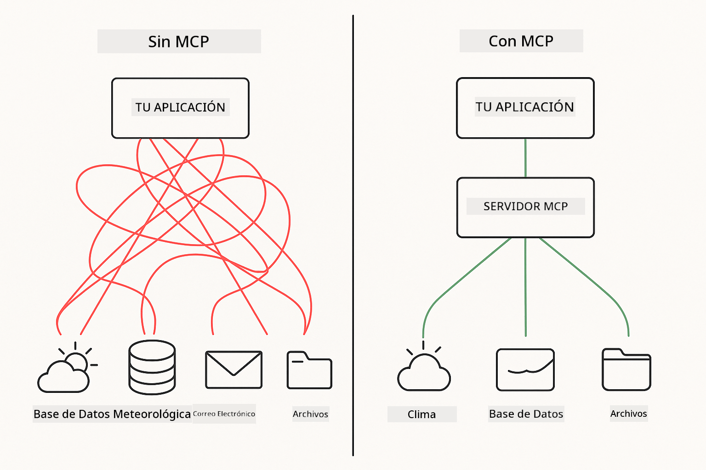
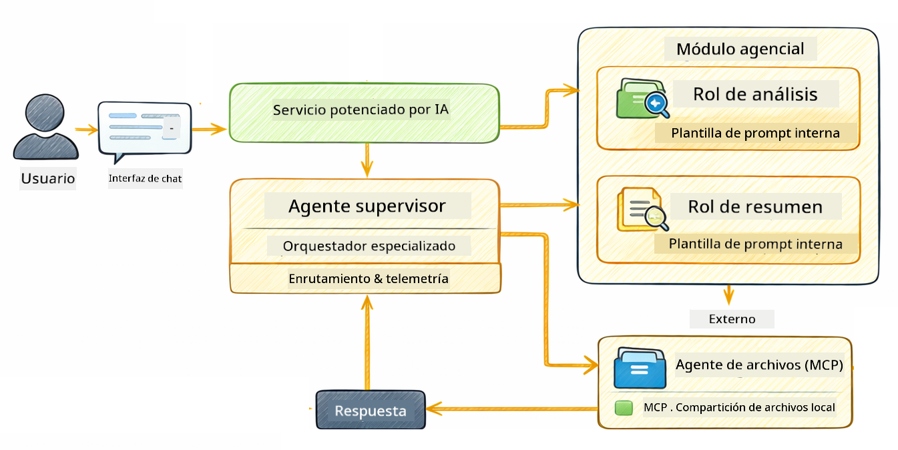

<!--
CO_OP_TRANSLATOR_METADATA:
{
  "original_hash": "f89f4c106d110e4943c055dd1a2f1dff",
  "translation_date": "2025-12-30T19:26:20+00:00",
  "source_file": "05-mcp/README.md",
  "language_code": "es"
}
-->
# Módulo 05: Protocolo de Contexto de Modelo (MCP)

## Tabla de contenidos

- [Qué aprenderás](../../../05-mcp)
- [¿Qué es MCP?](../../../05-mcp)
- [Cómo funciona MCP](../../../05-mcp)
- [El módulo agentic](../../../05-mcp)
- [Ejecutando los ejemplos](../../../05-mcp)
  - [Requisitos previos](../../../05-mcp)
- [Inicio rápido](../../../05-mcp)
  - [Operaciones de archivos (Stdio)](../../../05-mcp)
  - [Agente Supervisor](../../../05-mcp)
    - [Entendiendo la salida](../../../05-mcp)
    - [Explicación de las funciones del módulo agentic](../../../05-mcp)
- [Conceptos clave](../../../05-mcp)
- [¡Felicidades!](../../../05-mcp)
  - [¿Qué sigue?](../../../05-mcp)

## Qué aprenderás

Has construido IA conversacional, dominado prompts, fundamentado respuestas en documentos y creado agentes con herramientas. Pero todas esas herramientas fueron personalizadas para tu aplicación específica. ¿Y si pudieras darle a tu IA acceso a un ecosistema estandarizado de herramientas que cualquiera puede crear y compartir? En este módulo aprenderás a hacer exactamente eso con el Protocolo de Contexto de Modelo (MCP) y el módulo agentic de LangChain4j. Primero mostramos un lector de archivos MCP sencillo y luego mostramos cómo se integra fácilmente en flujos de trabajo agentic avanzados usando el patrón Supervisor Agent.

## ¿Qué es MCP?

El Protocolo de Contexto de Modelo (MCP) proporciona exactamente eso: una forma estándar para que las aplicaciones de IA descubran y usen herramientas externas. En lugar de escribir integraciones personalizadas para cada fuente de datos o servicio, te conectas a servidores MCP que exponen sus capacidades en un formato coherente. Tu agente de IA puede entonces descubrir y usar estas herramientas automáticamente.



*Antes de MCP: integraciones punto a punto complejas. Después de MCP: Un protocolo, posibilidades infinitas.*

MCP resuelve un problema fundamental en el desarrollo de IA: cada integración es personalizada. ¿Quieres acceder a GitHub? Código personalizado. ¿Quieres leer archivos? Código personalizado. ¿Quieres consultar una base de datos? Código personalizado. Y ninguna de estas integraciones funciona con otras aplicaciones de IA.

MCP estandariza esto. Un servidor MCP expone herramientas con descripciones y esquemas claros. Cualquier cliente MCP puede conectarse, descubrir las herramientas disponibles y usarlas. Construye una vez, usa en todas partes.


*Arquitectura del Protocolo de Contexto de Modelo - descubrimiento y ejecución de herramientas estandarizado*

## Cómo funciona MCP

**Arquitectura Cliente-Servidor**

MCP utiliza un modelo cliente-servidor. Los servidores proporcionan herramientas: lectura de archivos, consulta de bases de datos, llamadas a APIs. Los clientes (tu aplicación de IA) se conectan a los servidores y usan sus herramientas.

Para usar MCP con LangChain4j, añade esta dependencia de Maven:

```xml
<dependency>
    <groupId>dev.langchain4j</groupId>
    <artifactId>langchain4j-mcp</artifactId>
    <version>${langchain4j.version}</version>
</dependency>
```

**Descubrimiento de herramientas**

Cuando tu cliente se conecta a un servidor MCP, pregunta "¿Qué herramientas tienes?" El servidor responde con una lista de herramientas disponibles, cada una con descripciones y esquemas de parámetros. Tu agente de IA puede entonces decidir qué herramientas usar basándose en las solicitudes del usuario.

**Mecanismos de transporte**

MCP soporta diferentes mecanismos de transporte. Este módulo demuestra el transporte Stdio para procesos locales:


*Mecanismos de transporte MCP: HTTP para servidores remotos, Stdio para procesos locales*

**Stdio** - [StdioTransportDemo.java](../../../05-mcp/src/main/java/com/example/langchain4j/mcp/StdioTransportDemo.java)

Para procesos locales. Tu aplicación lanza un servidor como un subproceso y se comunica a través de la entrada/salida estándar. Útil para acceso al sistema de archivos o herramientas de línea de comandos.

```java
McpTransport stdioTransport = new StdioMcpTransport.Builder()
    .command(List.of(
        npmCmd, "exec",
        "@modelcontextprotocol/server-filesystem@2025.12.18",
        resourcesDir
    ))
    .logEvents(false)
    .build();
```

> **🤖 Prueba con [GitHub Copilot](https://github.com/features/copilot) Chat:** Abre [`StdioTransportDemo.java`](../../../05-mcp/src/main/java/com/example/langchain4j/mcp/StdioTransportDemo.java) y pregunta:
> - "¿Cómo funciona el transporte Stdio y cuándo debería usarlo en lugar de HTTP?"
> - "¿Cómo gestiona LangChain4j el ciclo de vida de los procesos de servidor MCP lanzados?"
> - "¿Cuáles son las implicaciones de seguridad de dar a la IA acceso al sistema de archivos?"

## El módulo agentic

Mientras MCP proporciona herramientas estandarizadas, el módulo **agentic** de LangChain4j ofrece una forma declarativa de construir agentes que orquestan esas herramientas. La anotación `@Agent` y `AgenticServices` te permiten definir el comportamiento del agente mediante interfaces en lugar de código imperativo.

En este módulo explorarás el patrón **Supervisor Agent** — un enfoque agentic avanzado donde un agente "supervisor" decide dinámicamente qué subagentes invocar basándose en las solicitudes del usuario. Combinaremos ambos conceptos dando a uno de nuestros subagentes capacidades de acceso al sistema de archivos potenciado por MCP.

Para usar el módulo agentic, añade esta dependencia de Maven:

```xml
<dependency>
    <groupId>dev.langchain4j</groupId>
    <artifactId>langchain4j-agentic</artifactId>
    <version>${langchain4j.mcp.version}</version>
</dependency>
```

> **⚠️ Experimental:** El módulo `langchain4j-agentic` es **experimental** y está sujeto a cambios. La forma estable de construir asistentes de IA sigue siendo `langchain4j-core` con herramientas personalizadas (Módulo 04).

## Ejecutando los ejemplos

### Requisitos previos

- Java 21+, Maven 3.9+
- Node.js 16+ y npm (para servidores MCP)
- Variables de entorno configuradas en el archivo `.env` (desde el directorio raíz):
  - **Para StdioTransportDemo:** `GITHUB_TOKEN` (Token de acceso personal de GitHub)
  - **Para SupervisorAgentDemo:** `AZURE_OPENAI_ENDPOINT`, `AZURE_OPENAI_API_KEY`, `AZURE_OPENAI_DEPLOYMENT` (igual que en los Módulos 01-04)

> **Nota:** Si aún no has configurado tus variables de entorno, consulta [Módulo 00 - Inicio rápido](../00-quick-start/README.md) para instrucciones, o copia `.env.example` a `.env` en el directorio raíz y completa tus valores.

## Inicio rápido

**Usando VS Code:** Simplemente haz clic derecho en cualquier archivo de demo en el Explorador y selecciona **"Run Java"**, o usa las configuraciones de lanzamiento desde el panel Run and Debug (asegúrate de haber añadido tu token al archivo `.env` primero).

**Usando Maven:** Alternativamente, puedes ejecutar desde la línea de comandos con los ejemplos a continuación.

### Operaciones de archivos (Stdio)

Esto demuestra herramientas basadas en subprocesos locales.

**✅ No se necesitan prerrequisitos** - el servidor MCP se lanza automáticamente.

**Usando VS Code:** Haz clic derecho en `StdioTransportDemo.java` y selecciona **"Run Java"**.

**Usando Maven:**

**Bash:**
```bash
export GITHUB_TOKEN=your_token_here
cd 05-mcp
mvn compile exec:java -Dexec.mainClass=com.example.langchain4j.mcp.StdioTransportDemo
```

**PowerShell:**
```powershell
$env:GITHUB_TOKEN=your_token_here
cd 05-mcp
mvn --% compile exec:java -Dexec.mainClass=com.example.langchain4j.mcp.StdioTransportDemo
```

La aplicación lanza automáticamente un servidor MCP de sistema de archivos y lee un archivo local. Observa cómo se maneja la gestión del subproceso por ti.

**Salida esperada:**
```
Assistant response: The file provides an overview of LangChain4j, an open-source Java library
for integrating Large Language Models (LLMs) into Java applications...
```

### Agente Supervisor




El **patrón Supervisor Agent** es una forma **flexible** de IA agentic. A diferencia de los flujos de trabajo deterministas (secuenciales, en bucle, paralelos), un Supervisor utiliza un LLM para decidir de forma autónoma qué agentes invocar en función de la solicitud del usuario.

**Combinando Supervisor con MCP:** En este ejemplo, damos al `FileAgent` acceso a herramientas de sistema de archivos MCP mediante `toolProvider(mcpToolProvider)`. Cuando un usuario pide "leer y analizar un archivo", el Supervisor analiza la solicitud y genera un plan de ejecución. Luego enruta la solicitud a `FileAgent`, que usa la herramienta `read_file` de MCP para recuperar el contenido. El Supervisor pasa ese contenido a `AnalysisAgent` para interpretación, y opcionalmente invoca a `SummaryAgent` para condensar los resultados.

Esto demuestra cómo las herramientas MCP se integran sin problemas en flujos agentic — el Supervisor no necesita saber *cómo* se leen los archivos, solo que `FileAgent` puede hacerlo. El Supervisor se adapta dinámicamente a diferentes tipos de solicitudes y devuelve ya sea la respuesta del último agente o un resumen de todas las operaciones.

**Usando los scripts de inicio (recomendado):**

Los scripts de inicio cargan automáticamente las variables de entorno desde el archivo `.env` raíz:

**Bash:**
```bash
cd 05-mcp
chmod +x start.sh
./start.sh
```

**PowerShell:**
```powershell
cd 05-mcp
.\start.ps1
```

**Usando VS Code:** Haz clic derecho en `SupervisorAgentDemo.java` y selecciona **"Run Java"** (asegúrate de que tu archivo `.env` esté configurado).

**Cómo funciona el Supervisor:**

```java
// Define múltiples agentes con capacidades específicas
FileAgent fileAgent = AgenticServices.agentBuilder(FileAgent.class)
        .chatModel(model)
        .toolProvider(mcpToolProvider)  // Tiene herramientas MCP para operaciones de archivos
        .build();

AnalysisAgent analysisAgent = AgenticServices.agentBuilder(AnalysisAgent.class)
        .chatModel(model)
        .build();

SummaryAgent summaryAgent = AgenticServices.agentBuilder(SummaryAgent.class)
        .chatModel(model)
        .build();

// Crea un Supervisor que orqueste estos agentes
SupervisorAgent supervisor = AgenticServices.supervisorBuilder()
        .chatModel(model)  // El modelo "planner"
        .subAgents(fileAgent, analysisAgent, summaryAgent)
        .responseStrategy(SupervisorResponseStrategy.SUMMARY)
        .build();

// El Supervisor decide de forma autónoma qué agentes invocar
// Simplemente pasa una solicitud en lenguaje natural - el LLM planifica la ejecución
String response = supervisor.invoke("Read the file at /path/file.txt and analyze it");
```

Consulta [SupervisorAgentDemo.java](../../../05-mcp/src/main/java/com/example/langchain4j/mcp/SupervisorAgentDemo.java) para la implementación completa.

> **🤖 Prueba con [GitHub Copilot](https://github.com/features/copilot) Chat:** Abre [`SupervisorAgentDemo.java`](../../../05-mcp/src/main/java/com/example/langchain4j/mcp/SupervisorAgentDemo.java) y pregunta:
> - "¿Cómo decide el Supervisor qué agentes invocar?"
> - "¿Cuál es la diferencia entre el patrón Supervisor y los patrones de flujo de trabajo Secuencial?"
> - "¿Cómo puedo personalizar el comportamiento de planificación del Supervisor?"

#### Entendiendo la salida

Cuando ejecutes la demo, verás una guía estructurada de cómo el Supervisor orquesta múltiples agentes. Esto es lo que significa cada sección:

```
======================================================================
  SUPERVISOR AGENT DEMO
======================================================================

This demo shows how a Supervisor Agent orchestrates multiple specialized agents.
The Supervisor uses an LLM to decide which agent to call based on the task.
```

**El encabezado** presenta la demo y explica el concepto principal: el Supervisor utiliza un LLM (no reglas codificadas) para decidir qué agentes llamar.

```
--- AVAILABLE AGENTS -------------------------------------------------
  [FILE]     FileAgent     - Reads files using MCP filesystem tools
  [ANALYZE]  AnalysisAgent - Analyzes content for structure, tone, and themes
  [SUMMARY]  SummaryAgent  - Creates concise summaries of content
```

**Agentes disponibles** muestra los tres agentes especializados que el Supervisor puede elegir. Cada agente tiene una capacidad específica:
- **FileAgent** puede leer archivos usando herramientas MCP (capacidad externa)
- **AnalysisAgent** analiza contenido (capacidad puramente LLM)
- **SummaryAgent** crea resúmenes (capacidad puramente LLM)

```
--- USER REQUEST -----------------------------------------------------
  "Read the file at .../file.txt and analyze what it's about"
```

**Solicitud del usuario** muestra lo que se pidió. El Supervisor debe analizar esto y decidir qué agentes invocar.

```
--- SUPERVISOR ORCHESTRATION -----------------------------------------
  The Supervisor will now decide which agents to invoke and in what order...

  +-- STEP 1: Supervisor chose -> FileAgent (reading file via MCP)
  |
  |   Input: .../file.txt
  |
  |   Result: LangChain4j is an open-source Java library designed to simplify...
  +-- [OK] FileAgent (reading file via MCP) completed

  +-- STEP 2: Supervisor chose -> AnalysisAgent (analyzing content)
  |
  |   Input: LangChain4j is an open-source Java library...
  |
  |   Result: Structure: The content is organized into clear paragraphs that int...
  +-- [OK] AnalysisAgent (analyzing content) completed
```

**Orquestación del Supervisor** es donde ocurre la magia. Observa cómo:
1. El Supervisor **eligió FileAgent primero** porque la solicitud mencionaba "leer el archivo"
2. FileAgent usó la herramienta `read_file` de MCP para obtener el contenido del archivo
3. El Supervisor entonces **eligió AnalysisAgent** y le pasó el contenido del archivo
4. AnalysisAgent analizó la estructura, el tono y los temas

Observa que el Supervisor tomó estas decisiones **de forma autónoma** basándose en la solicitud del usuario — ¡sin flujo de trabajo codificado!

**Respuesta final** es la respuesta sintetizada del Supervisor, combinando las salidas de todos los agentes que invocó. El ejemplo vuelca el ámbito agentic mostrando el resumen y los resultados del análisis almacenados por cada agente.

```
--- FINAL RESPONSE ---------------------------------------------------
I read the contents of the file and analyzed its structure, tone, and key themes.
The file introduces LangChain4j as an open-source Java library for integrating
large language models...

--- AGENTIC SCOPE (Shared Memory) ------------------------------------
  Agents store their results in a shared scope for other agents to use:
  * summary: LangChain4j is an open-source Java library...
  * analysis: Structure: The content is organized into clear paragraphs that in...
```

### Explicación de las funciones del módulo agentic

El ejemplo demuestra varias funciones avanzadas del módulo agentic. Veamos más de cerca Agentic Scope y los Agent Listeners.

**Agentic Scope** muestra la memoria compartida donde los agentes almacenaron sus resultados usando `@Agent(outputKey="...")`. Esto permite:
- Que agentes posteriores accedan a las salidas de agentes anteriores
- Que el Supervisor sintetice una respuesta final
- Que inspecciones lo que cada agente produjo

```java
ResultWithAgenticScope<String> result = supervisor.invokeWithAgenticScope(request);
AgenticScope scope = result.agenticScope();
String story = scope.readState("story");
List<AgentInvocation> history = scope.agentInvocations("analysisAgent");
```

**Agent Listeners** permiten monitorear y depurar la ejecución de agentes. La salida paso a paso que ves en la demo proviene de un AgentListener que se conecta a cada invocación de agente:
- **beforeAgentInvocation** - Llamado cuando el Supervisor selecciona un agente, permitiéndote ver qué agente fue elegido y por qué
- **afterAgentInvocation** - Llamado cuando un agente completa, mostrando su resultado
- **inheritedBySubagents** - Cuando es true, el listener monitorea todos los agentes en la jerarquía

```java
AgentListener monitor = new AgentListener() {
    private int step = 0;
    
    @Override
    public void beforeAgentInvocation(AgentRequest request) {
        step++;
        System.out.println("  +-- STEP " + step + ": " + request.agentName());
    }
    
    @Override
    public void afterAgentInvocation(AgentResponse response) {
        System.out.println("  +-- [OK] " + response.agentName() + " completed");
    }
    
    @Override
    public boolean inheritedBySubagents() {
        return true; // Propagar a todos los subagentes
    }
};
```

Más allá del patrón Supervisor, el módulo `langchain4j-agentic` ofrece varios patrones de flujo de trabajo y funciones potentes:

| Pattern | Description | Use Case |
|---------|-------------|----------|
| **Sequential** | Ejecutar agentes en orden, la salida fluye al siguiente | Pipelines: investigación → analizar → informe |
| **Parallel** | Ejecutar agentes simultáneamente | Tareas independientes: clima + noticias + acciones |
| **Loop** | Iterar hasta que se cumpla la condición | Puntuación de calidad: refinar hasta que la puntuación ≥ 0.8 |
| **Conditional** | Enrutar basado en condiciones | Clasificar → enrutar a agente especialista |
| **Human-in-the-Loop** | Añadir puntos de control humanos | Flujos de aprobación, revisión de contenido |

## Conceptos clave

**MCP** es ideal cuando quieres aprovechar ecosistemas de herramientas existentes, crear herramientas que múltiples aplicaciones puedan compartir, integrar servicios de terceros con protocolos estándar, o intercambiar implementaciones de herramientas sin cambiar el código.

**El módulo agentic** funciona mejor cuando quieres definiciones de agentes declarativas con anotaciones `@Agent`, necesitas orquestación de flujos de trabajo (secuencial, en bucle, paralelo), prefieres diseño de agentes basado en interfaces en lugar de código imperativo, o estás combinando múltiples agentes que comparten salidas mediante `outputKey`.

**El patrón Supervisor Agent** destaca cuando el flujo de trabajo no es predecible de antemano y quieres que el LLM decida, cuando tienes múltiples agentes especializados que necesitan orquestación dinámica, al construir sistemas conversacionales que enrutan a diferentes capacidades, o cuando quieres el comportamiento de agente más flexible y adaptativo.

## ¡Felicidades!

Has completado el curso LangChain4j para principiantes. Has aprendido:

- Cómo construir IA conversacional con memoria (Módulo 01)
- Patrones de ingeniería de prompts para diferentes tareas (Módulo 02)
- Fundar respuestas en tus documentos con RAG (Módulo 03)
- Crear agentes básicos de IA (asistentes) con herramientas personalizadas (Módulo 04)
- Integrando herramientas estandarizadas con los módulos LangChain4j MCP y Agentic (Módulo 05)

### ¿Qué sigue?

Después de completar los módulos, explora la [Guía de pruebas](../docs/TESTING.md) para ver los conceptos de pruebas de LangChain4j en acción.

**Recursos oficiales:**
- [Documentación de LangChain4j](https://docs.langchain4j.dev/) - Guías completas y referencia de la API
- [GitHub de LangChain4j](https://github.com/langchain4j/langchain4j) - Código fuente y ejemplos
- [Tutoriales de LangChain4j](https://docs.langchain4j.dev/tutorials/) - Tutoriales paso a paso para varios casos de uso

¡Gracias por completar este curso!

---

**Navegación:** [← Anterior: Módulo 04 - Herramientas](../04-tools/README.md) | [Volver al inicio](../README.md)

---

<!-- CO-OP TRANSLATOR DISCLAIMER START -->
Descargo de responsabilidad:
Este documento ha sido traducido utilizando el servicio de traducción por IA [Co-op Translator](https://github.com/Azure/co-op-translator). Si bien nos esforzamos por la exactitud, tenga en cuenta que las traducciones automáticas pueden contener errores o imprecisiones. La versión original del documento en su idioma nativo debe considerarse la fuente autorizada. Para información crítica, se recomienda una traducción profesional realizada por un traductor humano. No somos responsables de ningún malentendido o interpretación errónea que surja del uso de esta traducción.
<!-- CO-OP TRANSLATOR DISCLAIMER END -->