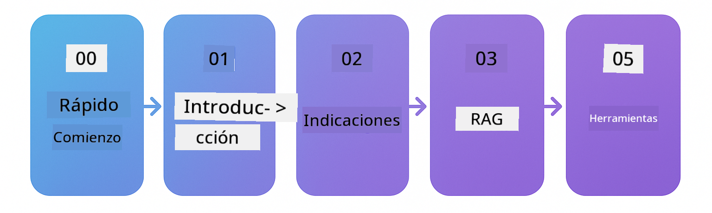

<!--
CO_OP_TRANSLATOR_METADATA:
{
  "original_hash": "8b9c4243c12488872afffa00f0092467",
  "translation_date": "2025-12-15T14:09:24+00:00",
  "source_file": "README.md",
  "language_code": "es"
}
-->

### 🌐 Soporte Multilingüe

#### Soportado mediante GitHub Action (Automatizado y Siempre Actualizado)

<!-- CO-OP TRANSLATOR LANGUAGES TABLE START -->
[Árabe](../ar/README.md) | [Bengalí](../bn/README.md) | [Búlgaro](../bg/README.md) | [Birmano (Myanmar)](../my/README.md) | [Chino (Simplificado)](../zh/README.md) | [Chino (Tradicional, Hong Kong)](../hk/README.md) | [Chino (Tradicional, Macao)](../mo/README.md) | [Chino (Tradicional, Taiwán)](../tw/README.md) | [Croata](../hr/README.md) | [Checo](../cs/README.md) | [Danés](../da/README.md) | [Holandés](../nl/README.md) | [Estonio](../et/README.md) | [Finlandés](../fi/README.md) | [Francés](../fr/README.md) | [Alemán](../de/README.md) | [Griego](../el/README.md) | [Hebreo](../he/README.md) | [Hindi](../hi/README.md) | [Húngaro](../hu/README.md) | [Indonesio](../id/README.md) | [Italiano](../it/README.md) | [Japonés](../ja/README.md) | [Kannada](../kn/README.md) | [Coreano](../ko/README.md) | [Lituano](../lt/README.md) | [Malayo](../ms/README.md) | [Malayalam](../ml/README.md) | [Maratí](../mr/README.md) | [Nepalí](../ne/README.md) | [Pidgin Nigeriano](../pcm/README.md) | [Noruego](../no/README.md) | [Persa (Farsi)](../fa/README.md) | [Polaco](../pl/README.md) | [Portugués (Brasil)](../br/README.md) | [Portugués (Portugal)](../pt/README.md) | [Punjabi (Gurmukhi)](../pa/README.md) | [Rumano](../ro/README.md) | [Ruso](../ru/README.md) | [Serbio (Cirílico)](../sr/README.md) | [Eslovaco](../sk/README.md) | [Esloveno](../sl/README.md) | [Español](./README.md) | [Swahili](../sw/README.md) | [Sueco](../sv/README.md) | [Tagalo (Filipino)](../tl/README.md) | [Tamil](../ta/README.md) | [Telugu](../te/README.md) | [Tailandés](../th/README.md) | [Turco](../tr/README.md) | [Ucraniano](../uk/README.md) | [Urdu](../ur/README.md) | [Vietnamita](../vi/README.md)
<!-- CO-OP TRANSLATOR LANGUAGES TABLE END -->

# LangChain4j para Principiantes

Un curso para construir aplicaciones de IA con LangChain4j y Azure OpenAI GPT-5, desde chat básico hasta agentes de IA.

**¿Nuevo en LangChain4j?** Consulta el [Glosario](docs/GLOSSARY.md) para definiciones de términos y conceptos clave.

## Tabla de Contenidos

1. [Inicio Rápido](00-quick-start/README.md) - Comienza con LangChain4j
2. [Introducción](01-introduction/README.md) - Aprende los fundamentos de LangChain4j
3. [Ingeniería de Prompts](02-prompt-engineering/README.md) - Domina el diseño efectivo de prompts
4. [RAG (Generación Aumentada por Recuperación)](03-rag/README.md) - Construye sistemas inteligentes basados en conocimiento
5. [Herramientas](04-tools/README.md) - Integra herramientas externas y APIs con agentes de IA
6. [MCP (Protocolo de Contexto de Modelo)](05-mcp/README.md) - Trabaja con el Protocolo de Contexto de Modelo
---

## Ruta de Aprendizaje

Comienza con el módulo de [Inicio Rápido](00-quick-start/README.md) y avanza a través de cada módulo para desarrollar tus habilidades paso a paso. Probarás ejemplos básicos para entender los fundamentos antes de pasar al módulo de [Introducción](01-introduction/README.md) para un análisis más profundo con GPT-5.

Después de completar los módulos, explora la [Guía de Pruebas](docs/TESTING.md) para ver los conceptos de pruebas en LangChain4j en acción.

> **Nota:** Esta formación utiliza tanto Modelos de GitHub como Azure OpenAI. Los módulos de [Inicio Rápido](00-quick-start/README.md) y [MCP](05-mcp/README.md) usan Modelos de GitHub (no se requiere suscripción a Azure), mientras que los módulos 1-4 usan Azure OpenAI GPT-5.

## Aprendizaje con GitHub Copilot

Para comenzar a programar rápidamente, abre este proyecto en un GitHub Codespace o en tu IDE local con el devcontainer proporcionado. El devcontainer usado en este curso viene preconfigurado con GitHub Copilot para programación asistida por IA.

Cada ejemplo de código incluye preguntas sugeridas que puedes hacerle a GitHub Copilot para profundizar tu comprensión. Busca los prompts 💡/🤖 en:

- **Encabezados de archivos Java** - Preguntas específicas para cada ejemplo
- **READMEs de los módulos** - Prompts de exploración después de los ejemplos de código

**Cómo usarlo:** Abre cualquier archivo de código y hazle a Copilot las preguntas sugeridas. Tiene el contexto completo del código y puede explicar, extender y sugerir alternativas.

¿Quieres aprender más? Consulta [Copilot para Programación Asistida por IA](https://aka.ms/GitHubCopilotAI).

## Recursos Adicionales 

### LangChain

---

### Azure / Edge / MCP / Agentes

---
 
### Serie de IA Generativa

[-9333EA?style=for-the-badge&labelColor=E5E7EB&color=9333EA)](https://github.com/microsoft/Generative-AI-for-beginners-dotnet?WT.mc_id=academic-105485-koreyst)
[-C084FC?style=for-the-badge&labelColor=E5E7EB&color=C084FC)](https://github.com/microsoft/generative-ai-for-beginners-java?WT.mc_id=academic-105485-koreyst)
[-E879F9?style=for-the-badge&labelColor=E5E7EB&color=E879F9)](https://github.com/microsoft/generative-ai-with-javascript?WT.mc_id=academic-105485-koreyst)

---
 
### Aprendizaje Básico

---
 
### Serie Copilot

## Obtener ayuda

Si te quedas atascado o tienes alguna pregunta sobre cómo crear aplicaciones de IA, únete a:

Si tienes comentarios sobre el producto o errores mientras construyes, visita:

## Licencia

Licencia MIT - Consulta el archivo [LICENSE](../../LICENSE) para más detalles.

---

<!-- CO-OP TRANSLATOR DISCLAIMER START -->
**Aviso Legal**:  
Este documento ha sido traducido utilizando el servicio de traducción automática [Co-op Translator](https://github.com/Azure/co-op-translator). Aunque nos esforzamos por la precisión, tenga en cuenta que las traducciones automáticas pueden contener errores o inexactitudes. El documento original en su idioma nativo debe considerarse la fuente autorizada. Para información crítica, se recomienda una traducción profesional realizada por humanos. No nos hacemos responsables de malentendidos o interpretaciones erróneas derivadas del uso de esta traducción.
<!-- CO-OP TRANSLATOR DISCLAIMER END -->