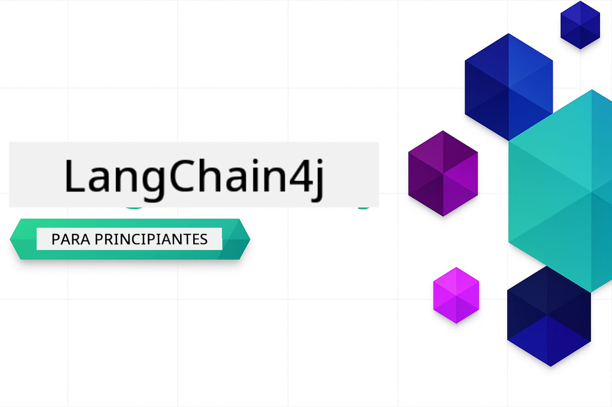

<!--
CO_OP_TRANSLATOR_METADATA:
{
  "original_hash": "d61ab6c245562094cc3dddecf08b50d3",
  "translation_date": "2025-12-30T19:23:08+00:00",
  "source_file": "README.md",
  "language_code": "es"
}
-->


### 🌐 Soporte multilingüe

#### Soportado mediante GitHub Action (automatizado y siempre actualizado)

<!-- CO-OP TRANSLATOR LANGUAGES TABLE START -->
[Árabe](../ar/README.md) | [Bengalí](../bn/README.md) | [Búlgaro](../bg/README.md) | [Birmano (Myanmar)](../my/README.md) | [Chino (simplificado)](../zh/README.md) | [Chino (tradicional, Hong Kong)](../hk/README.md) | [Chino (tradicional, Macao)](../mo/README.md) | [Chino (tradicional, Taiwán)](../tw/README.md) | [Croata](../hr/README.md) | [Checo](../cs/README.md) | [Danés](../da/README.md) | [Neerlandés](../nl/README.md) | [Estonio](../et/README.md) | [Finés](../fi/README.md) | [Francés](../fr/README.md) | [Alemán](../de/README.md) | [Griego](../el/README.md) | [Hebreo](../he/README.md) | [Hindi](../hi/README.md) | [Húngaro](../hu/README.md) | [Indonesio](../id/README.md) | [Italiano](../it/README.md) | [Japonés](../ja/README.md) | [Canarés](../kn/README.md) | [Coreano](../ko/README.md) | [Lituano](../lt/README.md) | [Malayo](../ms/README.md) | [Malayalam](../ml/README.md) | [Maratí](../mr/README.md) | [Nepalí](../ne/README.md) | [Pidgin nigeriano](../pcm/README.md) | [Noruego](../no/README.md) | [Persa (Farsi)](../fa/README.md) | [Polaco](../pl/README.md) | [Portugués (Brasil)](../br/README.md) | [Portugués (Portugal)](../pt/README.md) | [Panyabí (Gurmukhi)](../pa/README.md) | [Rumano](../ro/README.md) | [Ruso](../ru/README.md) | [Serbio (cirílico)](../sr/README.md) | [Eslovaco](../sk/README.md) | [Esloveno](../sl/README.md) | [Español](./README.md) | [Suajili](../sw/README.md) | [Sueco](../sv/README.md) | [Tagalo (filipino)](../tl/README.md) | [Tamil](../ta/README.md) | [Telugú](../te/README.md) | [Tailandés](../th/README.md) | [Turco](../tr/README.md) | [Ucraniano](../uk/README.md) | [Urdu](../ur/README.md) | [Vietnamita](../vi/README.md)
<!-- CO-OP TRANSLATOR LANGUAGES TABLE END -->

# LangChain4j para Principiantes

Un curso para crear aplicaciones de IA con LangChain4j y Azure OpenAI GPT-5, desde chat básico hasta agentes de IA.

**¿Nuevo en LangChain4j?** Consulta el [Glosario](docs/GLOSSARY.md) para definiciones de términos y conceptos clave.

## Table of Contents

1. [Inicio rápido](00-quick-start/README.md) - Comienza con LangChain4j
2. [Introducción](01-introduction/README.md) - Aprende los fundamentos de LangChain4j
3. [Ingeniería de prompts](02-prompt-engineering/README.md) - Domina el diseño efectivo de prompts
4. [RAG (Retrieval-Augmented Generation)](03-rag/README.md) - Construye sistemas inteligentes basados en conocimiento
5. [Herramientas](04-tools/README.md) - Integra herramientas externas y asistentes simples
6. [MCP (Model Context Protocol)](05-mcp/README.md) - Trabaja con el Protocolo de Contexto del Modelo (MCP) y los módulos de agentes
---

##  Ruta de aprendizaje

> **Inicio rápido**

1. Haz un fork de este repositorio en tu cuenta de GitHub
2. Click **Code** → **Codespaces** tab → **...** → **New with options...**
3. Usa los valores predeterminados – esto seleccionará el Development container creado para este curso
4. Click **Create codespace**
5. Espera 5-10 minutos a que el entorno esté listo
6. Ve directamente a [Inicio rápido](./00-quick-start/README.md) para empezar!

> **¿Prefieres clonar localmente?**
>
> Este repositorio incluye más de 50 traducciones de idiomas, lo que aumenta significativamente el tamaño de la descarga. Para clonar sin traducciones, usa sparse checkout:
> ```bash
> git clone --filter=blob:none --sparse https://github.com/microsoft/LangChain4j-for-Beginners.git
> cd LangChain4j-for-Beginners
> git sparse-checkout set --no-cone '/*' '!translations' '!translated_images'
> ```
> Esto te ofrece todo lo que necesitas para completar el curso con una descarga mucho más rápida.

Después de completar los módulos, explora la [Guía de pruebas](docs/TESTING.md) para ver los conceptos de pruebas de LangChain4j en acción.

> **Nota:** Esta formación utiliza tanto GitHub Models como Azure OpenAI. Los módulos [Inicio rápido](00-quick-start/README.md) y [MCP](05-mcp/README.md) usan GitHub Models (no se requiere suscripción a Azure), mientras que los módulos 1-4 usan Azure OpenAI GPT-5.


## Aprendizaje con GitHub Copilot

Para empezar a programar rápidamente, abre este proyecto en un GitHub Codespace o en tu IDE local con el devcontainer proporcionado. El devcontainer usado en este curso viene preconfigurado con GitHub Copilot para programación en pareja con IA.

Cada ejemplo de código incluye preguntas sugeridas que puedes hacer a GitHub Copilot para profundizar tu comprensión. Busca las indicaciones 💡/🤖 en:

- **Encabezados de archivos Java** - Preguntas específicas para cada ejemplo
- **README de los módulos** - Sugerencias de exploración después de los ejemplos de código

**Cómo usarlo:** Abre cualquier archivo de código y hazle a Copilot las preguntas sugeridas. Tiene el contexto completo del código y puede explicar, ampliar y sugerir alternativas.

¿Quieres saber más? Consulta [Copilot for AI Paired Programming](https://aka.ms/GitHubCopilotAI).


## Recursos adicionales

<!-- CO-OP TRANSLATOR OTHER COURSES START -->
### LangChain
[](https://aka.ms/langchain4j-for-beginners)
[](https://aka.ms/langchainjs-for-beginners?WT.mc_id=m365-94501-dwahlin)

---

### Azure / Edge / MCP / Agentes
[](https://github.com/microsoft/AZD-for-beginners?WT.mc_id=academic-105485-koreyst)
[](https://github.com/microsoft/edgeai-for-beginners?WT.mc_id=academic-105485-koreyst)
[](https://github.com/microsoft/mcp-for-beginners?WT.mc_id=academic-105485-koreyst)
[](https://github.com/microsoft/ai-agents-for-beginners?WT.mc_id=academic-105485-koreyst)

---
 
### Serie de IA generativa
[](https://github.com/microsoft/generative-ai-for-beginners?WT.mc_id=academic-105485-koreyst)
[-9333EA?style=for-the-badge&labelColor=E5E7EB&color=9333EA)](https://github.com/microsoft/Generative-AI-for-beginners-dotnet?WT.mc_id=academic-105485-koreyst)
[-C084FC?style=for-the-badge&labelColor=E5E7EB&color=C084FC)](https://github.com/microsoft/generative-ai-for-beginners-java?WT.mc_id=academic-105485-koreyst)
[-E879F9?style=for-the-badge&labelColor=E5E7EB&color=E879F9)](https://github.com/microsoft/generative-ai-with-javascript?WT.mc_id=academic-105485-koreyst)

---
 
### Aprendizaje esencial
[](https://aka.ms/ml-beginners?WT.mc_id=academic-105485-koreyst)
[](https://aka.ms/datascience-beginners?WT.mc_id=academic-105485-koreyst)
[](https://aka.ms/ai-beginners?WT.mc_id=academic-105485-koreyst)
[](https://github.com/microsoft/Security-101?WT.mc_id=academic-96948-sayoung)
[](https://aka.ms/webdev-beginners?WT.mc_id=academic-105485-koreyst)
[](https://aka.ms/iot-beginners?WT.mc_id=academic-105485-koreyst)
[](https://github.com/microsoft/xr-development-for-beginners?WT.mc_id=academic-105485-koreyst)

---
 
### Serie Copilot
[](https://aka.ms/GitHubCopilotAI?WT.mc_id=academic-105485-koreyst)
[](https://github.com/microsoft/mastering-github-copilot-for-dotnet-csharp-developers?WT.mc_id=academic-105485-koreyst)
[](https://github.com/microsoft/CopilotAdventures?WT.mc_id=academic-105485-koreyst)
<!-- CO-OP TRANSLATOR OTHER COURSES END -->

## Obtener ayuda

Si te quedas atascado o tienes alguna pregunta sobre cómo crear aplicaciones de IA, únete a:

[](https://aka.ms/foundry/discord)

Si tienes comentarios sobre el producto o errores mientras desarrollas, visita:

[](https://aka.ms/foundry/forum)

## Licencia

Licencia MIT - Consulta el archivo [LICENSE](../../LICENSE) para más detalles.

---

<!-- CO-OP TRANSLATOR DISCLAIMER START -->
**Descargo de responsabilidad**:
Este documento ha sido traducido utilizando el servicio de traducción por IA [Co-op Translator](https://github.com/Azure/co-op-translator). Aunque nos esforzamos por la precisión, tenga en cuenta que las traducciones automáticas pueden contener errores o imprecisiones. El documento original en su idioma nativo debe considerarse la fuente autorizada. Para información crítica, se recomienda una traducción profesional realizada por un traductor humano. No nos hacemos responsables de ningún malentendido o interpretación errónea que pueda surgir del uso de esta traducción.
<!-- CO-OP TRANSLATOR DISCLAIMER END -->