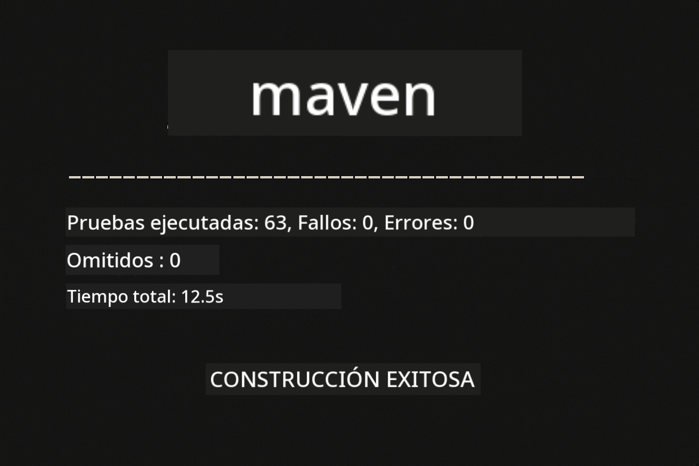
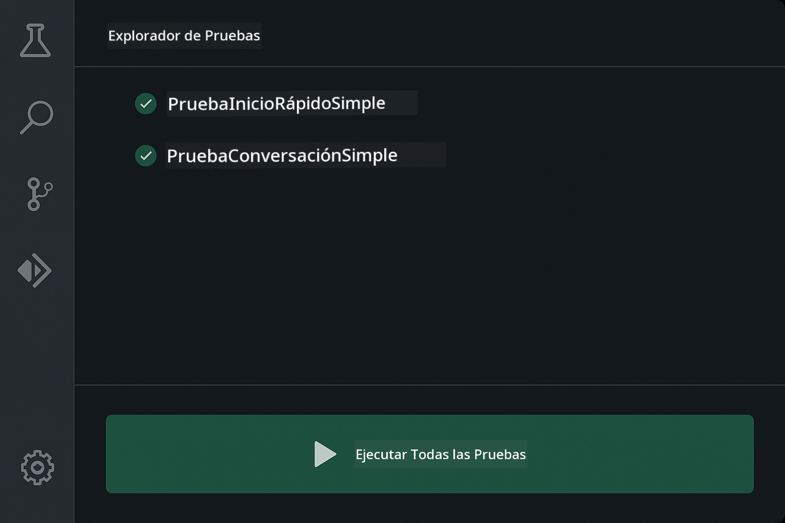
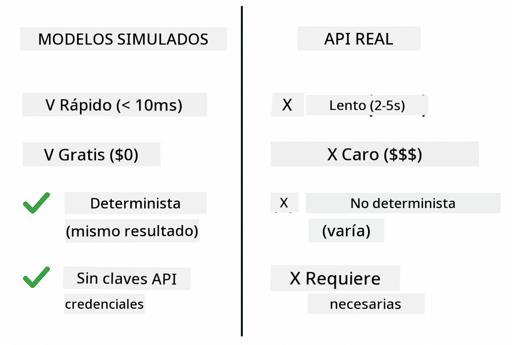
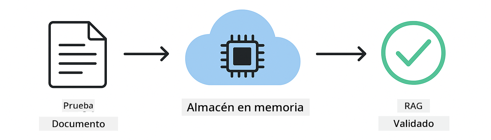
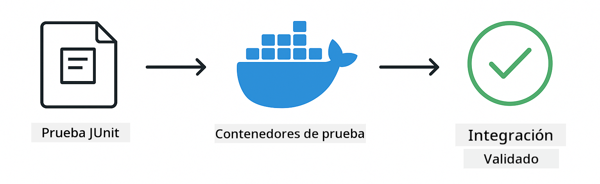

<!--
CO_OP_TRANSLATOR_METADATA:
{
  "original_hash": "b975537560c404d5f254331832811e78",
  "translation_date": "2025-12-13T20:33:02+00:00",
  "source_file": "docs/TESTING.md",
  "language_code": "es"
}
-->
# Pruebas de Aplicaciones LangChain4j

## Tabla de Contenidos

- [Inicio Rápido](../../../docs)
- [Qué Cubren las Pruebas](../../../docs)
- [Ejecutando las Pruebas](../../../docs)
- [Ejecutando Pruebas en VS Code](../../../docs)
- [Patrones de Prueba](../../../docs)
- [Filosofía de Pruebas](../../../docs)
- [Próximos Pasos](../../../docs)

Esta guía te lleva a través de las pruebas que demuestran cómo probar aplicaciones de IA sin requerir claves API o servicios externos.

## Inicio Rápido

Ejecuta todas las pruebas con un solo comando:

**Bash:**
```bash
mvn test
```

**PowerShell:**
```powershell
mvn --% test
```



*Ejecución exitosa de pruebas mostrando todas las pruebas aprobadas sin fallos*

## Qué Cubren las Pruebas

Este curso se enfoca en **pruebas unitarias** que se ejecutan localmente. Cada prueba demuestra un concepto específico de LangChain4j de forma aislada.


*Pirámide de pruebas mostrando el equilibrio entre pruebas unitarias (rápidas, aisladas), pruebas de integración (componentes reales) y pruebas end-to-end (sistema completo con Docker). Esta capacitación cubre pruebas unitarias.*

| Módulo | Pruebas | Enfoque | Archivos Clave |
|--------|---------|---------|----------------|
| **00 - Inicio Rápido** | 6 | Plantillas de prompt y sustitución de variables | `SimpleQuickStartTest.java` |
| **01 - Introducción** | 8 | Memoria de conversación y chat con estado | `SimpleConversationTest.java` |
| **02 - Ingeniería de Prompt** | 12 | Patrones GPT-5, niveles de entusiasmo, salida estructurada | `SimpleGpt5PromptTest.java` |
| **03 - RAG** | 10 | Ingesta de documentos, embeddings, búsqueda por similitud | `DocumentServiceTest.java` |
| **04 - Herramientas** | 12 | Llamadas a funciones y encadenamiento de herramientas | `SimpleToolsTest.java` |
| **05 - MCP** | 15 | Protocolo de Contexto de Modelo con Docker | `SimpleMcpTest.java`, `McpDockerTransportTest.java` |

## Ejecutando las Pruebas

**Ejecuta todas las pruebas desde la raíz:**

**Bash:**
```bash
mvn test
```

**PowerShell:**
```powershell
mvn --% test
```

**Ejecuta pruebas para un módulo específico:**

**Bash:**
```bash
cd 01-introduction && mvn test
# O desde la raíz
mvn test -pl 01-introduction
```

**PowerShell:**
```powershell
cd 01-introduction; mvn --% test
# O desde la raíz
mvn --% test -pl 01-introduction
```

**Ejecuta una sola clase de prueba:**

**Bash:**
```bash
mvn test -Dtest=SimpleConversationTest
```

**PowerShell:**
```powershell
mvn --% test -Dtest=SimpleConversationTest
```

**Ejecuta un método de prueba específico:**

**Bash:**
```bash
mvn test -Dtest=SimpleConversationTest#deberíaMantenerHistorialDeConversación
```

**PowerShell:**
```powershell
mvn --% test -Dtest=SimpleConversationTest#deberíaMantenerHistorialDeConversación
```

## Ejecutando Pruebas en VS Code

Si usas Visual Studio Code, el Explorador de Pruebas proporciona una interfaz gráfica para ejecutar y depurar pruebas.



*Explorador de Pruebas de VS Code mostrando el árbol de pruebas con todas las clases de prueba Java y métodos individuales*

**Para ejecutar pruebas en VS Code:**

1. Abre el Explorador de Pruebas haciendo clic en el ícono de matraz en la Barra de Actividades
2. Expande el árbol de pruebas para ver todos los módulos y clases de prueba
3. Haz clic en el botón de reproducir junto a cualquier prueba para ejecutarla individualmente
4. Haz clic en "Run All Tests" para ejecutar toda la suite
5. Haz clic derecho en cualquier prueba y selecciona "Debug Test" para establecer puntos de interrupción y depurar el código

El Explorador de Pruebas muestra marcas verdes para pruebas aprobadas y proporciona mensajes detallados de fallos cuando las pruebas fallan.

## Patrones de Prueba


*Seis patrones de prueba para aplicaciones LangChain4j: plantillas de prompt, simulación de modelos, aislamiento de conversación, pruebas de herramientas, RAG en memoria e integración con Docker*

### Patrón 1: Pruebas de Plantillas de Prompt

El patrón más simple prueba plantillas de prompt sin llamar a ningún modelo de IA. Verificas que la sustitución de variables funcione correctamente y que los prompts estén formateados como se espera.


*Pruebas de plantillas de prompt mostrando el flujo de sustitución de variables: plantilla con marcadores → valores aplicados → salida formateada verificada*

```java
@Test
@DisplayName("Should format prompt template with variables")
void testPromptTemplateFormatting() {
    PromptTemplate template = PromptTemplate.from(
        "Best time to visit {{destination}} for {{activity}}?"
    );
    
    Prompt prompt = template.apply(Map.of(
        "destination", "Paris",
        "activity", "sightseeing"
    ));
    
    assertThat(prompt.text()).isEqualTo("Best time to visit Paris for sightseeing?");
}
```

Esta prueba se encuentra en `00-quick-start/src/test/java/com/example/langchain4j/quickstart/SimpleQuickStartTest.java`.

**Ejecuta la prueba:**

**Bash:**
```bash
cd 00-quick-start && mvn test -Dtest=SimpleQuickStartTest#pruebaDeFormatoDePlantillaDeSolicitud
```

**PowerShell:**
```powershell
cd 00-quick-start; mvn --% test -Dtest=SimpleQuickStartTest#pruebaDeFormatoDePlantillaDeSolicitud
```

### Patrón 2: Simulación de Modelos de Lenguaje

Al probar la lógica de conversación, usa Mockito para crear modelos falsos que devuelven respuestas predeterminadas. Esto hace que las pruebas sean rápidas, gratuitas y deterministas.



*Comparación mostrando por qué se prefieren los mocks para pruebas: son rápidos, gratuitos, deterministas y no requieren claves API*

```java
@ExtendWith(MockitoExtension.class)
class SimpleConversationTest {
    
    private ConversationService conversationService;
    
    @Mock
    private OpenAiOfficialChatModel mockChatModel;
    
    @BeforeEach
    void setUp() {
        ChatResponse mockResponse = ChatResponse.builder()
            .aiMessage(AiMessage.from("This is a test response"))
            .build();
        when(mockChatModel.chat(anyList())).thenReturn(mockResponse);
        
        conversationService = new ConversationService(mockChatModel);
    }
    
    @Test
    void shouldMaintainConversationHistory() {
        String conversationId = conversationService.startConversation();
        
        ChatResponse mockResponse1 = ChatResponse.builder()
            .aiMessage(AiMessage.from("Response 1"))
            .build();
        ChatResponse mockResponse2 = ChatResponse.builder()
            .aiMessage(AiMessage.from("Response 2"))
            .build();
        ChatResponse mockResponse3 = ChatResponse.builder()
            .aiMessage(AiMessage.from("Response 3"))
            .build();
        
        when(mockChatModel.chat(anyList()))
            .thenReturn(mockResponse1)
            .thenReturn(mockResponse2)
            .thenReturn(mockResponse3);

        conversationService.chat(conversationId, "First message");
        conversationService.chat(conversationId, "Second message");
        conversationService.chat(conversationId, "Third message");

        List<ChatMessage> history = conversationService.getHistory(conversationId);
        assertThat(history).hasSize(6); // 3 mensajes de usuario + 3 mensajes de IA
    }
}
```

Este patrón aparece en `01-introduction/src/test/java/com/example/langchain4j/service/SimpleConversationTest.java`. El mock asegura un comportamiento consistente para que puedas verificar que la gestión de memoria funciona correctamente.

### Patrón 3: Pruebas de Aislamiento de Conversación

La memoria de conversación debe mantener separados a múltiples usuarios. Esta prueba verifica que las conversaciones no mezclen contextos.


*Pruebas de aislamiento de conversación mostrando almacenes de memoria separados para diferentes usuarios para evitar mezcla de contextos*

```java
@Test
void shouldIsolateConversationsByid() {
    String conv1 = conversationService.startConversation();
    String conv2 = conversationService.startConversation();
    
    ChatResponse mockResponse = ChatResponse.builder()
        .aiMessage(AiMessage.from("Response"))
        .build();
    when(mockChatModel.chat(anyList())).thenReturn(mockResponse);

    conversationService.chat(conv1, "Message for conversation 1");
    conversationService.chat(conv2, "Message for conversation 2");

    List<ChatMessage> history1 = conversationService.getHistory(conv1);
    List<ChatMessage> history2 = conversationService.getHistory(conv2);
    
    assertThat(history1).hasSize(2);
    assertThat(history2).hasSize(2);
}
```

Cada conversación mantiene su propio historial independiente. En sistemas de producción, este aislamiento es crítico para aplicaciones multiusuario.

### Patrón 4: Pruebas Independientes de Herramientas

Las herramientas son funciones que la IA puede llamar. Pruébalas directamente para asegurar que funcionen correctamente sin importar las decisiones de la IA.


*Pruebas de herramientas independientemente mostrando ejecución simulada de herramientas sin llamadas a IA para verificar la lógica de negocio*

```java
@Test
void shouldConvertCelsiusToFahrenheit() {
    TemperatureTool tempTool = new TemperatureTool();
    String result = tempTool.celsiusToFahrenheit(25.0);
    assertThat(result).containsPattern("77[.,]0°F");
}

@Test
void shouldDemonstrateToolChaining() {
    WeatherTool weatherTool = new WeatherTool();
    TemperatureTool tempTool = new TemperatureTool();

    String weatherResult = weatherTool.getCurrentWeather("Seattle");
    assertThat(weatherResult).containsPattern("\\d+°C");

    String conversionResult = tempTool.celsiusToFahrenheit(22.0);
    assertThat(conversionResult).containsPattern("71[.,]6°F");
}
```

Estas pruebas de `04-tools/src/test/java/com/example/langchain4j/agents/tools/SimpleToolsTest.java` validan la lógica de herramientas sin involucrar IA. El ejemplo de encadenamiento muestra cómo la salida de una herramienta alimenta la entrada de otra.

### Patrón 5: Pruebas RAG en Memoria

Los sistemas RAG tradicionalmente requieren bases de datos vectoriales y servicios de embeddings. El patrón en memoria te permite probar toda la canalización sin dependencias externas.



*Flujo de trabajo de pruebas RAG en memoria mostrando análisis de documentos, almacenamiento de embeddings y búsqueda por similitud sin requerir base de datos*

```java
@Test
void testProcessTextDocument() {
    String content = "This is a test document.\nIt has multiple lines.";
    InputStream inputStream = new ByteArrayInputStream(content.getBytes(StandardCharsets.UTF_8));
    
    DocumentService.ProcessedDocument result = 
        documentService.processDocument(inputStream, "test.txt");

    assertNotNull(result);
    assertTrue(result.segments().size() > 0);
    assertEquals("test.txt", result.segments().get(0).metadata().getString("filename"));
}
```

Esta prueba de `03-rag/src/test/java/com/example/langchain4j/rag/service/DocumentServiceTest.java` crea un documento en memoria y verifica el fragmentado y manejo de metadatos.

### Patrón 6: Pruebas de Integración con Docker

Algunas características necesitan infraestructura real. El módulo MCP usa Testcontainers para levantar contenedores Docker para pruebas de integración. Estas validan que tu código funcione con servicios reales manteniendo el aislamiento de pruebas.



*Pruebas de integración MCP con Testcontainers mostrando ciclo de vida automatizado de contenedores: inicio, ejecución de pruebas, parada y limpieza*

Las pruebas en `05-mcp/src/test/java/com/example/langchain4j/mcp/McpDockerTransportTest.java` requieren que Docker esté en ejecución.

**Ejecuta las pruebas:**

**Bash:**
```bash
cd 05-mcp && mvn test
```

**PowerShell:**
```powershell
cd 05-mcp; mvn --% test
```

## Filosofía de Pruebas

Prueba tu código, no la IA. Tus pruebas deben validar el código que escribes verificando cómo se construyen los prompts, cómo se gestiona la memoria y cómo se ejecutan las herramientas. Las respuestas de IA varían y no deberían formar parte de las aserciones de prueba. Pregúntate si tu plantilla de prompt sustituye variables correctamente, no si la IA da la respuesta correcta.

Usa mocks para modelos de lenguaje. Son dependencias externas que son lentas, costosas y no deterministas. Simularlas hace que las pruebas sean rápidas con milisegundos en lugar de segundos, gratuitas sin costos de API y deterministas con el mismo resultado cada vez.

Mantén las pruebas independientes. Cada prueba debe configurar sus propios datos, no depender de otras pruebas y limpiar después de sí misma. Las pruebas deben pasar sin importar el orden de ejecución.

Prueba casos límite más allá del camino feliz. Prueba entradas vacías, entradas muy grandes, caracteres especiales, parámetros inválidos y condiciones de frontera. Estos a menudo revelan errores que el uso normal no expone.

Usa nombres descriptivos. Compara `shouldMaintainConversationHistoryAcrossMultipleMessages()` con `test1()`. El primero te dice exactamente qué se está probando, facilitando mucho la depuración de fallos.

## Próximos Pasos

Ahora que entiendes los patrones de prueba, profundiza en cada módulo:

- **[00 - Inicio Rápido](../00-quick-start/README.md)** - Comienza con los conceptos básicos de plantillas de prompt
- **[01 - Introducción](../01-introduction/README.md)** - Aprende gestión de memoria de conversación
- **[02 - Ingeniería de Prompt](../02-prompt-engineering/README.md)** - Domina patrones de prompting GPT-5
- **[03 - RAG](../03-rag/README.md)** - Construye sistemas de generación aumentada por recuperación
- **[04 - Herramientas](../04-tools/README.md)** - Implementa llamadas a funciones y cadenas de herramientas
- **[05 - MCP](../05-mcp/README.md)** - Integra el Protocolo de Contexto de Modelo con Docker

El README de cada módulo proporciona explicaciones detalladas de los conceptos probados aquí.

---

**Navegación:** [← Volver al Inicio](../README.md)

---

<!-- CO-OP TRANSLATOR DISCLAIMER START -->
**Aviso legal**:
Este documento ha sido traducido utilizando el servicio de traducción automática [Co-op Translator](https://github.com/Azure/co-op-translator). Aunque nos esforzamos por la precisión, tenga en cuenta que las traducciones automáticas pueden contener errores o inexactitudes. El documento original en su idioma nativo debe considerarse la fuente autorizada. Para información crítica, se recomienda una traducción profesional realizada por humanos. No nos hacemos responsables de malentendidos o interpretaciones erróneas derivadas del uso de esta traducción.
<!-- CO-OP TRANSLATOR DISCLAIMER END -->