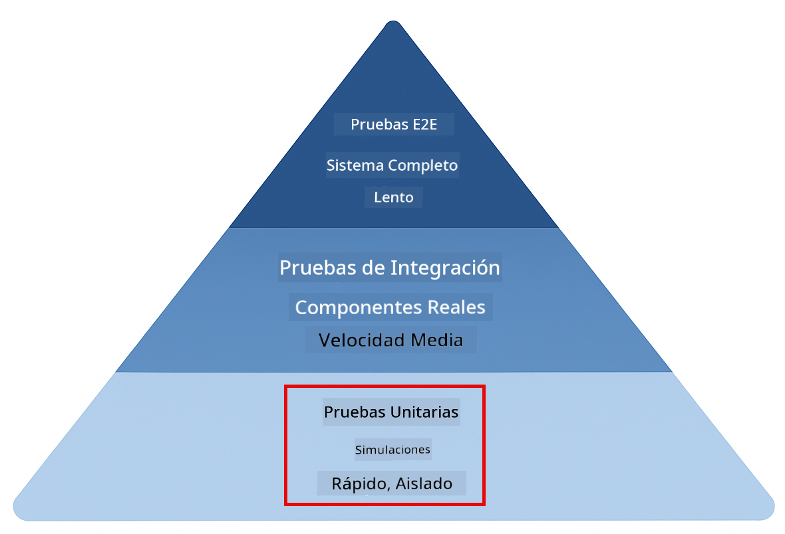
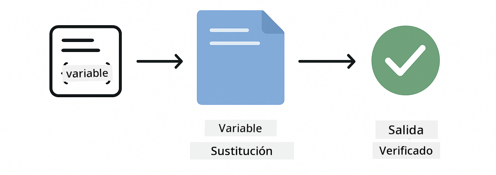
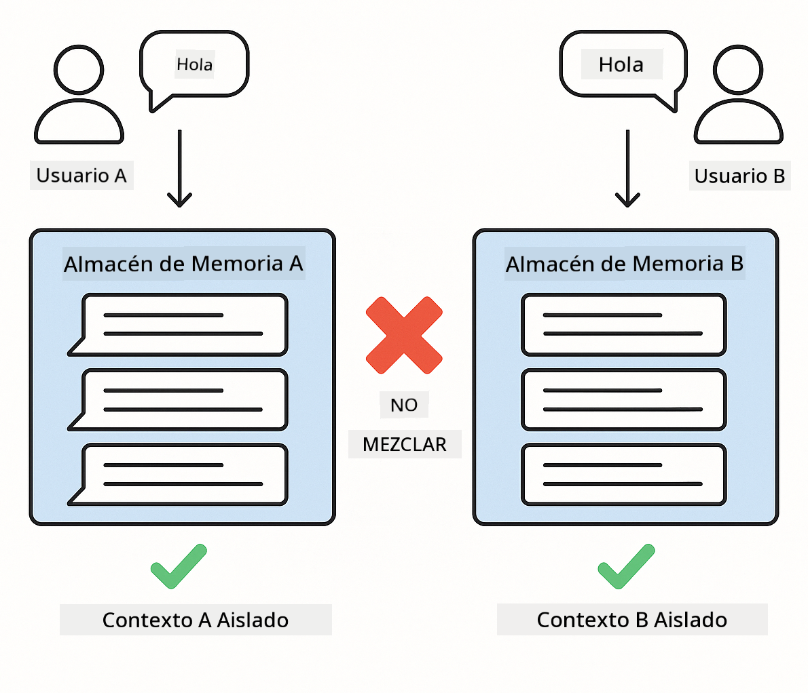
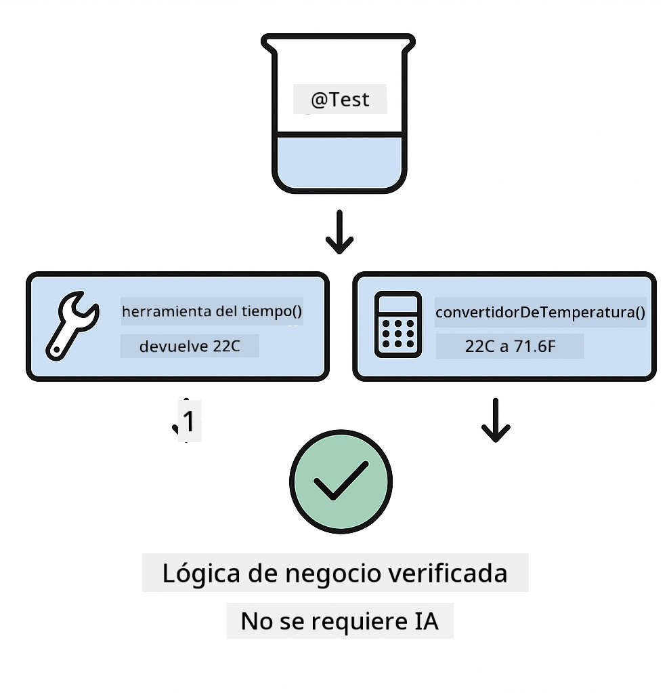

<!--
CO_OP_TRANSLATOR_METADATA:
{
  "original_hash": "ed93b3c14d58734ac10162967da958c1",
  "translation_date": "2025-12-30T19:34:19+00:00",
  "source_file": "docs/TESTING.md",
  "language_code": "es"
}
-->
# Pruebas de aplicaciones LangChain4j

## Tabla de contenidos

- [Inicio rápido](../../../docs)
- [Qué cubren las pruebas](../../../docs)
- [Ejecutar las pruebas](../../../docs)
- [Ejecutar pruebas en VS Code](../../../docs)
- [Patrones de prueba](../../../docs)
- [Filosofía de las pruebas](../../../docs)
- [Siguientes pasos](../../../docs)

Esta guía te lleva a través de las pruebas que demuestran cómo probar aplicaciones de IA sin requerir claves de API ni servicios externos.

## Quick Start

Ejecute todas las pruebas con un solo comando:

**Bash:**
```bash
mvn test
```

**PowerShell:**
```powershell
mvn --% test
```


*Ejecución de pruebas exitosa que muestra todas las pruebas pasando con cero fallos*

## What the Tests Cover

Este curso se centra en **pruebas unitarias** que se ejecutan localmente. Cada prueba demuestra un concepto específico de LangChain4j de forma aislada.



*Pirámide de pruebas que muestra el equilibrio entre pruebas unitarias (rápidas, aisladas), pruebas de integración (componentes reales) y pruebas end-to-end. Esta formación cubre las pruebas unitarias.*

| Módulo | Pruebas | Enfoque | Archivos clave |
|--------|-------|-------|-----------|
| **00 - Quick Start** | 6 | Plantillas de prompt y sustitución de variables | `SimpleQuickStartTest.java` |
| **01 - Introduction** | 8 | Memoria de conversación y chat con estado | `SimpleConversationTest.java` |
| **02 - Prompt Engineering** | 12 | Patrones de GPT-5, niveles de eagerness, salida estructurada | `SimpleGpt5PromptTest.java` |
| **03 - RAG** | 10 | Ingesta de documentos, embeddings, búsqueda por similitud | `DocumentServiceTest.java` |
| **04 - Tools** | 12 | Llamadas a funciones y encadenamiento de herramientas | `SimpleToolsTest.java` |
| **05 - MCP** | 8 | Model Context Protocol con transporte StdIO | `SimpleMcpTest.java` |

## Running the Tests

**Ejecute todas las pruebas desde la raíz:**

**Bash:**
```bash
mvn test
```

**PowerShell:**
```powershell
mvn --% test
```

**Ejecute las pruebas de un módulo específico:**

**Bash:**
```bash
cd 01-introduction && mvn test
# O desde root
mvn test -pl 01-introduction
```

**PowerShell:**
```powershell
cd 01-introduction; mvn --% test
# O desde root
mvn --% test -pl 01-introduction
```

**Ejecute una sola clase de prueba:**

**Bash:**
```bash
mvn test -Dtest=SimpleConversationTest
```

**PowerShell:**
```powershell
mvn --% test -Dtest=SimpleConversationTest
```

**Ejecute un método de prueba específico:**

**Bash:**
```bash
mvn test -Dtest=SimpleConversationTest#debería mantener el historial de la conversación
```

**PowerShell:**
```powershell
mvn --% test -Dtest=SimpleConversationTest#debería mantener el historial de conversación
```

## Running Tests in VS Code

Si usas Visual Studio Code, el Test Explorer proporciona una interfaz gráfica para ejecutar y depurar pruebas.


*VS Code Test Explorer mostrando el árbol de pruebas con todas las clases de prueba Java y métodos de prueba individuales*

**Para ejecutar pruebas en VS Code:**

1. Abre el Test Explorer haciendo clic en el icono del matraz en la Activity Bar
2. Expande el árbol de pruebas para ver todos los módulos y clases de prueba
3. Haz clic en el botón de reproducir junto a cualquier prueba para ejecutarla individualmente
4. Haz clic en "Run All Tests" para ejecutar todo el conjunto
5. Haz clic derecho en cualquier prueba y selecciona "Debug Test" para poner puntos de interrupción y depurar paso a paso

El Test Explorer muestra marcas verdes para las pruebas que pasan y proporciona mensajes detallados de fallo cuando las pruebas fallan.

## Testing Patterns

### Pattern 1: Testing Prompt Templates

El patrón más simple prueba las plantillas de prompt sin llamar a ningún modelo de IA. Verificas que la sustitución de variables funcione correctamente y que los prompts estén formateados según lo esperado.



*Prueba de plantillas de prompt mostrando el flujo de sustitución de variables: plantilla con marcadores → valores aplicados → salida formateada verificada*

```java
@Test
@DisplayName("Should format prompt template with variables")
void testPromptTemplateFormatting() {
    PromptTemplate template = PromptTemplate.from(
        "Best time to visit {{destination}} for {{activity}}?"
    );
    
    Prompt prompt = template.apply(Map.of(
        "destination", "Paris",
        "activity", "sightseeing"
    ));
    
    assertThat(prompt.text()).isEqualTo("Best time to visit Paris for sightseeing?");
}
```

Esta prueba se encuentra en `00-quick-start/src/test/java/com/example/langchain4j/quickstart/SimpleQuickStartTest.java`.

**Ejecutarla:**

**Bash:**
```bash
cd 00-quick-start && mvn test -Dtest=SimpleQuickStartTest#pruebaFormatoPlantillaDePrompt
```

**PowerShell:**
```powershell
cd 00-quick-start; mvn --% test -Dtest=SimpleQuickStartTest#prueba de formato de plantilla de prompt
```

### Pattern 2: Mocking Language Models

Al probar la lógica de conversación, usa Mockito para crear modelos falsos que devuelvan respuestas predeterminadas. Esto hace que las pruebas sean rápidas, gratuitas y deterministas.


*Comparación que muestra por qué se prefieren los mocks para las pruebas: son rápidos, gratuitos, deterministas y no requieren claves de API*

```java
@ExtendWith(MockitoExtension.class)
class SimpleConversationTest {
    
    private ConversationService conversationService;
    
    @Mock
    private OpenAiOfficialChatModel mockChatModel;
    
    @BeforeEach
    void setUp() {
        ChatResponse mockResponse = ChatResponse.builder()
            .aiMessage(AiMessage.from("This is a test response"))
            .build();
        when(mockChatModel.chat(anyList())).thenReturn(mockResponse);
        
        conversationService = new ConversationService(mockChatModel);
    }
    
    @Test
    void shouldMaintainConversationHistory() {
        String conversationId = conversationService.startConversation();
        
        ChatResponse mockResponse1 = ChatResponse.builder()
            .aiMessage(AiMessage.from("Response 1"))
            .build();
        ChatResponse mockResponse2 = ChatResponse.builder()
            .aiMessage(AiMessage.from("Response 2"))
            .build();
        ChatResponse mockResponse3 = ChatResponse.builder()
            .aiMessage(AiMessage.from("Response 3"))
            .build();
        
        when(mockChatModel.chat(anyList()))
            .thenReturn(mockResponse1)
            .thenReturn(mockResponse2)
            .thenReturn(mockResponse3);

        conversationService.chat(conversationId, "First message");
        conversationService.chat(conversationId, "Second message");
        conversationService.chat(conversationId, "Third message");

        List<ChatMessage> history = conversationService.getHistory(conversationId);
        assertThat(history).hasSize(6); // 3 mensajes de usuario + 3 mensajes de IA
    }
}
```

Este patrón aparece en `01-introduction/src/test/java/com/example/langchain4j/service/SimpleConversationTest.java`. El mock asegura un comportamiento consistente para que puedas verificar que la gestión de la memoria funcione correctamente.

### Pattern 3: Testing Conversation Isolation

La memoria de la conversación debe mantener separados a múltiples usuarios. Esta prueba verifica que las conversaciones no mezclen contextos.



*Prueba de aislamiento de conversación mostrando almacenes de memoria separados para diferentes usuarios para evitar la mezcla de contextos*

```java
@Test
void shouldIsolateConversationsByid() {
    String conv1 = conversationService.startConversation();
    String conv2 = conversationService.startConversation();
    
    ChatResponse mockResponse = ChatResponse.builder()
        .aiMessage(AiMessage.from("Response"))
        .build();
    when(mockChatModel.chat(anyList())).thenReturn(mockResponse);

    conversationService.chat(conv1, "Message for conversation 1");
    conversationService.chat(conv2, "Message for conversation 2");

    List<ChatMessage> history1 = conversationService.getHistory(conv1);
    List<ChatMessage> history2 = conversationService.getHistory(conv2);
    
    assertThat(history1).hasSize(2);
    assertThat(history2).hasSize(2);
}
```

Cada conversación mantiene su propio historial independiente. En sistemas de producción, este aislamiento es crítico para aplicaciones multiusuario.

### Pattern 4: Testing Tools Independently

Las herramientas son funciones que la IA puede invocar. Pruébalas directamente para asegurarte de que funcionan correctamente independientemente de las decisiones de la IA.



*Pruebas de herramientas de forma independiente mostrando la ejecución de la herramienta con mocks sin llamadas a la IA para verificar la lógica de negocio*

```java
@Test
void shouldConvertCelsiusToFahrenheit() {
    TemperatureTool tempTool = new TemperatureTool();
    String result = tempTool.celsiusToFahrenheit(25.0);
    assertThat(result).containsPattern("77[.,]0°F");
}

@Test
void shouldDemonstrateToolChaining() {
    WeatherTool weatherTool = new WeatherTool();
    TemperatureTool tempTool = new TemperatureTool();

    String weatherResult = weatherTool.getCurrentWeather("Seattle");
    assertThat(weatherResult).containsPattern("\\d+°C");

    String conversionResult = tempTool.celsiusToFahrenheit(22.0);
    assertThat(conversionResult).containsPattern("71[.,]6°F");
}
```

Estas pruebas de `04-tools/src/test/java/com/example/langchain4j/agents/tools/SimpleToolsTest.java` validan la lógica de las herramientas sin intervención de IA. El ejemplo de encadenamiento muestra cómo la salida de una herramienta alimenta la entrada de otra.

### Pattern 5: In-Memory RAG Testing

Los sistemas RAG tradicionalmente requieren bases de datos vectoriales y servicios de embeddings. El patrón en memoria te permite probar todo el pipeline sin dependencias externas.


*Flujo de trabajo de pruebas RAG en memoria mostrando el parseo de documentos, almacenamiento de embeddings y búsqueda por similitud sin requerir una base de datos*

```java
@Test
void testProcessTextDocument() {
    String content = "This is a test document.\nIt has multiple lines.";
    InputStream inputStream = new ByteArrayInputStream(content.getBytes(StandardCharsets.UTF_8));
    
    DocumentService.ProcessedDocument result = 
        documentService.processDocument(inputStream, "test.txt");

    assertNotNull(result);
    assertTrue(result.segments().size() > 0);
    assertEquals("test.txt", result.segments().get(0).metadata().getString("filename"));
}
```

Esta prueba de `03-rag/src/test/java/com/example/langchain4j/rag/service/DocumentServiceTest.java` crea un documento en memoria y verifica el chunking y el manejo de metadatos.

### Pattern 6: MCP Integration Testing

El módulo MCP prueba la integración del Model Context Protocol usando transporte stdio. Estas pruebas verifican que tu aplicación pueda lanzar y comunicarse con servidores MCP como subprocesos.

Las pruebas en `05-mcp/src/test/java/com/example/langchain4j/mcp/SimpleMcpTest.java` validan el comportamiento del cliente MCP.

**Ejecutarlas:**

**Bash:**
```bash
cd 05-mcp && mvn test
```

**PowerShell:**
```powershell
cd 05-mcp; mvn --% test
```

## Testing Philosophy

Prueba tu código, no la IA. Tus pruebas deben validar el código que escribes comprobando cómo se construyen los prompts, cómo se gestiona la memoria y cómo se ejecutan las herramientas. Las respuestas de la IA varían y no deberían formar parte de las aserciones de las pruebas. Pregúntate si tu plantilla de prompt sustituye correctamente las variables, no si la IA da la respuesta correcta.

Usa mocks para los modelos de lenguaje. Son dependencias externas que son lentas, costosas y no deterministas. El mocking hace que las pruebas sean rápidas en milisegundos en lugar de segundos, gratuitas sin costes de API y deterministas con el mismo resultado cada vez.

Mantén las pruebas independientes. Cada prueba debe configurar sus propios datos, no depender de otras pruebas y limpiar después de sí misma. Las pruebas deben pasar independientemente del orden de ejecución.

Prueba casos límite más allá del camino feliz. Prueba entradas vacías, entradas muy grandes, caracteres especiales, parámetros inválidos y condiciones límite. Estos suelen revelar errores que el uso normal no expone.

Usa nombres descriptivos. Compara shouldMaintainConversationHistoryAcrossMultipleMessages() con test1(). El primero te dice exactamente qué se está probando, haciendo que depurar fallos sea mucho más fácil.

## Next Steps

Ahora que entiendes los patrones de prueba, profundiza en cada módulo:

- **[00 - Quick Start](../00-quick-start/README.md)** - Comienza con los conceptos básicos de plantillas de prompt
- **[01 - Introduction](../01-introduction/README.md)** - Aprende la gestión de memoria de conversación
- **[02 - Prompt Engineering](../02-prompt-engineering/README.md)** - Domina los patrones de prompting para GPT-5
- **[03 - RAG](../03-rag/README.md)** - Construye sistemas de generación aumentada por recuperación
- **[04 - Tools](../04-tools/README.md)** - Implementa llamadas a funciones y cadenas de herramientas
- **[05 - MCP](../05-mcp/README.md)** - Integra Model Context Protocol

El README de cada módulo proporciona explicaciones detalladas de los conceptos aquí probados.

---

**Navegación:** [← Volver al inicio](../README.md)

---

<!-- CO-OP TRANSLATOR DISCLAIMER START -->
Descargo de responsabilidad:
Este documento ha sido traducido utilizando un servicio de traducción automática con IA [Co-op Translator](https://github.com/Azure/co-op-translator). Aunque nos esforzamos por la exactitud, tenga en cuenta que las traducciones automatizadas pueden contener errores o inexactitudes. El documento original en su idioma original debe considerarse la fuente autorizada. Para información crítica, se recomienda una traducción profesional realizada por traductores humanos. No nos hacemos responsables de malentendidos o interpretaciones erróneas que surjan del uso de esta traducción.
<!-- CO-OP TRANSLATOR DISCLAIMER END -->