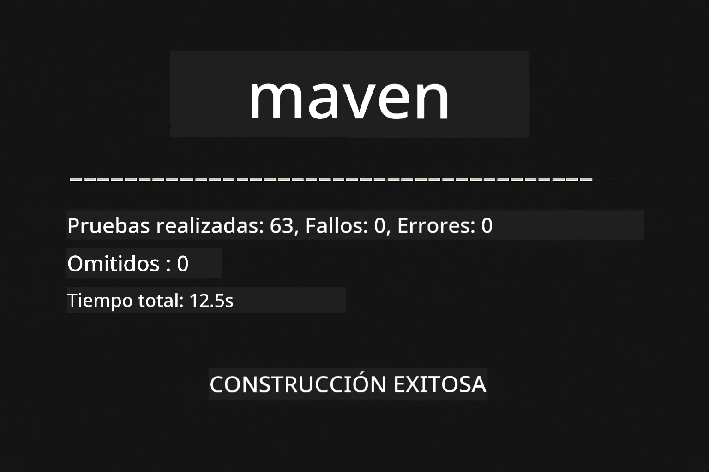
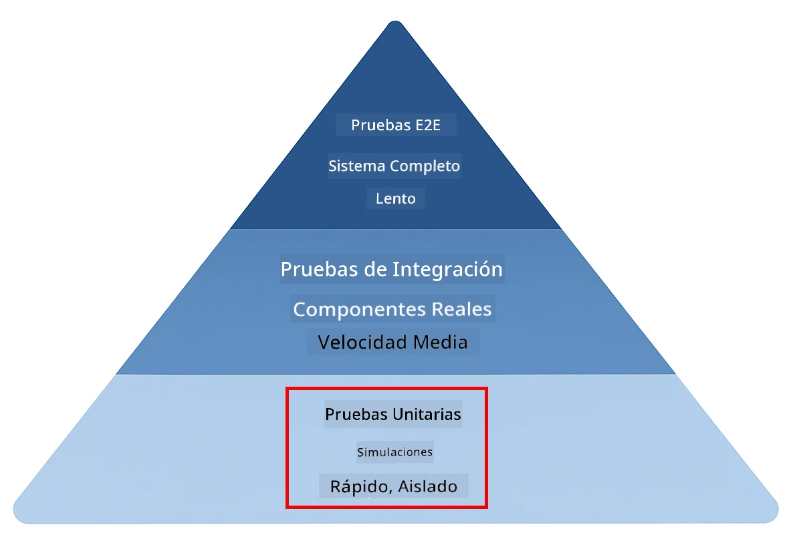
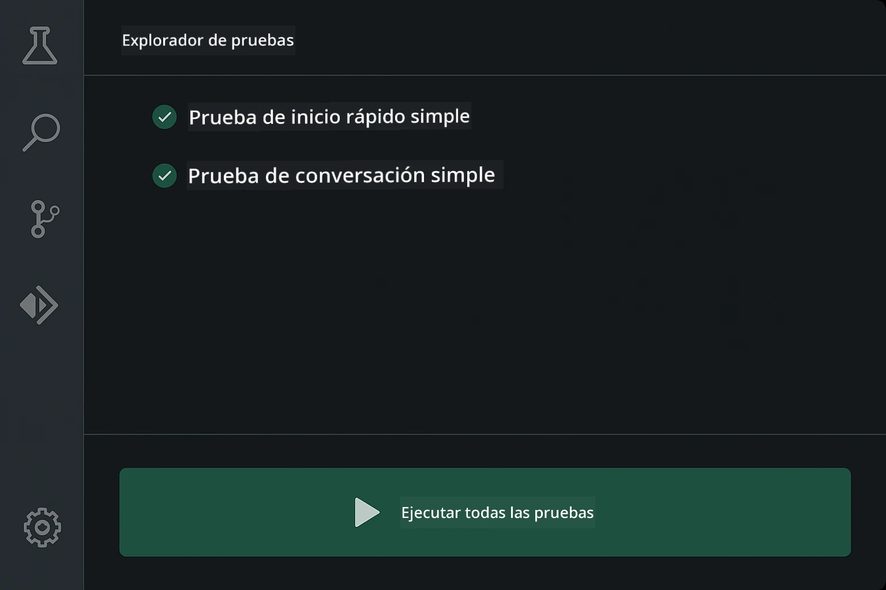
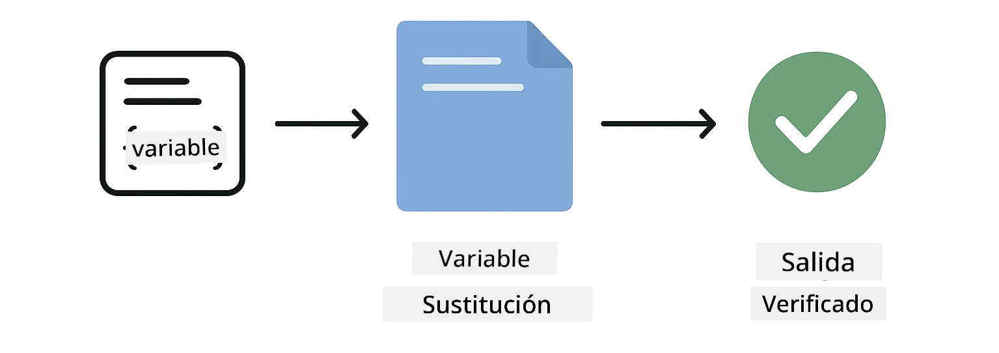
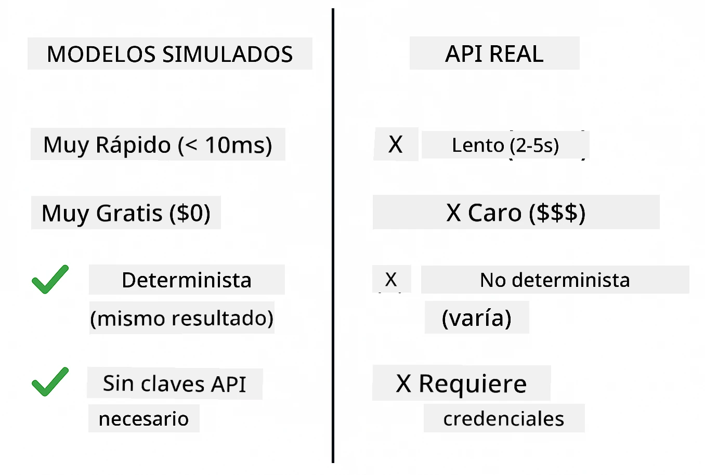
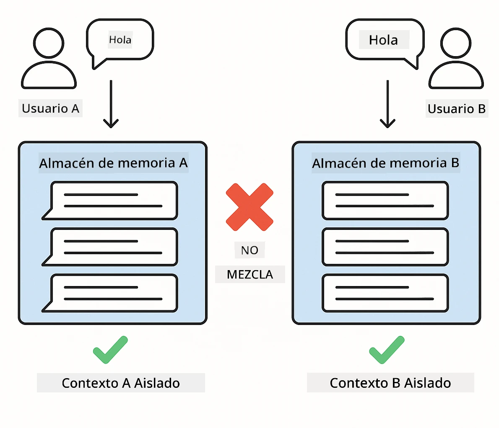
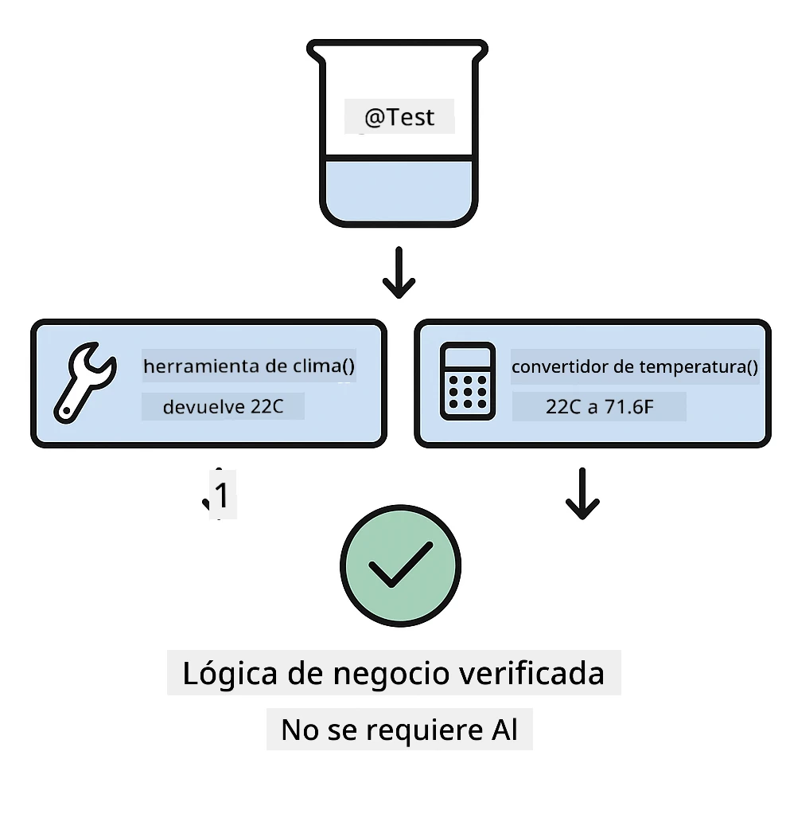
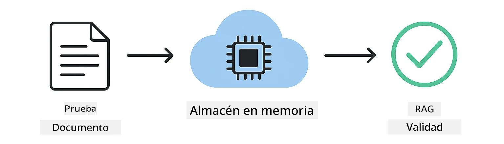

# Pruebas de Aplicaciones LangChain4j

## Tabla de Contenidos

- [Inicio Rápido](#inicio-rápido)
- [Qué Cubren las Pruebas](#qué-cubren-las-pruebas)
- [Ejecutando las Pruebas](#ejecutando-las-pruebas)
- [Ejecutando Pruebas en VS Code](#ejecutando-pruebas-en-vs-code)
- [Patrones de Prueba](#patrones-de-prueba)
- [Filosofía de Pruebas](#filosofía-de-pruebas)
- [Próximos Pasos](#próximos-pasos)

Esta guía te lleva a través de las pruebas que demuestran cómo probar aplicaciones de IA sin requerir claves de API o servicios externos.

## Inicio Rápido

Ejecuta todas las pruebas con un solo comando:

**Bash:**
```bash
mvn test
```

**PowerShell:**
```powershell
mvn --% test
```

Cuando todas las pruebas pasen, deberías ver una salida como la captura de pantalla a continuación — pruebas ejecutadas sin fallos.



*Ejecución exitosa de pruebas mostrando todas las pruebas aprobadas sin fallos*

## Qué Cubren las Pruebas

Este curso se enfoca en **pruebas unitarias** que se ejecutan localmente. Cada prueba demuestra un concepto específico de LangChain4j de forma aislada. La pirámide de pruebas a continuación muestra dónde encajan las pruebas unitarias — forman la base rápida y confiable sobre la que se construye el resto de tu estrategia de pruebas.



*Pirámide de pruebas mostrando el equilibrio entre pruebas unitarias (rápidas, aisladas), pruebas de integración (componentes reales) y pruebas de extremo a extremo. Esta capacitación cubre pruebas unitarias.*

| Módulo | Pruebas | Enfoque | Archivos Clave |
|--------|---------|---------|----------------|
| **01 - Introducción** | 8 | Memoria de conversación y chat con estado | `SimpleConversationTest.java` |
| **02 - Ingeniería de Prompts** | 12 | Patrones GPT-5.2, niveles de entusiasmo, salida estructurada | `SimpleGpt5PromptTest.java` |
| **03 - RAG** | 10 | Ingesta de documentos, embeddings, búsqueda por similitud | `DocumentServiceTest.java` |
| **04 - Herramientas** | 12 | Llamado de funciones y encadenamiento de herramientas | `SimpleToolsTest.java` |
| **05 - MCP** | 8 | Protocolo de Contexto de Modelo con transporte Stdio | `SimpleMcpTest.java` |

## Ejecutando las Pruebas

**Ejecuta todas las pruebas desde la raíz:**

**Bash:**
```bash
mvn test
```

**PowerShell:**
```powershell
mvn --% test
```

**Ejecuta pruebas para un módulo específico:**

**Bash:**
```bash
cd 01-introduction && mvn test
# O desde la raíz
mvn test -pl 01-introduction
```

**PowerShell:**
```powershell
cd 01-introduction; mvn --% test
# O desde la raíz
mvn --% test -pl 01-introduction
```

**Ejecuta una clase de prueba individual:**

**Bash:**
```bash
mvn test -Dtest=SimpleConversationTest
```

**PowerShell:**
```powershell
mvn --% test -Dtest=SimpleConversationTest
```

**Ejecuta un método de prueba específico:**

**Bash:**
```bash
mvn test -Dtest=SimpleConversationTest#deberíaMantenerElHistorialDeConversación
```

**PowerShell:**
```powershell
mvn --% test -Dtest=SimpleConversationTest#deberíaMantenerElHistorialDeConversación
```

## Ejecutando Pruebas en VS Code

Si usas Visual Studio Code, el Explorador de Pruebas proporciona una interfaz gráfica para ejecutar y depurar pruebas.



*Explorador de Pruebas de VS Code mostrando el árbol de pruebas con todas las clases Java y métodos de prueba individuales*

**Para ejecutar pruebas en VS Code:**

1. Abre el Explorador de Pruebas haciendo clic en el icono de matraz en la Barra de Actividades  
2. Expande el árbol de pruebas para ver todos los módulos y clases de prueba  
3. Haz clic en el botón de reproducir junto a cualquier prueba para ejecutarla individualmente  
4. Haz clic en "Ejecutar Todas las Pruebas" para ejecutar toda la suite  
5. Haz clic derecho en cualquier prueba y selecciona "Depurar Prueba" para establecer puntos de interrupción y avanzar por el código  

El Explorador de Pruebas muestra marcas verdes para las pruebas exitosas y proporciona mensajes detallados de fallos cuando las pruebas fallan.

## Patrones de Prueba

### Patrón 1: Probar Plantillas de Prompt

El patrón más simple prueba plantillas de prompt sin llamar a ningún modelo de IA. Verificas que la sustitución de variables funcione correctamente y que los prompts estén formateados como se espera.



*Pruebas de plantillas de prompt mostrando flujo de sustitución de variables: plantilla con marcadores → se aplican valores → salida formateada verificada*

```java
@Test
@DisplayName("Should format prompt template with variables")
void testPromptTemplateFormatting() {
    PromptTemplate template = PromptTemplate.from(
        "Best time to visit {{destination}} for {{activity}}?"
    );
    
    Prompt prompt = template.apply(Map.of(
        "destination", "Paris",
        "activity", "sightseeing"
    ));
    
    assertThat(prompt.text()).isEqualTo("Best time to visit Paris for sightseeing?");
}
```

Este patrón verifica que la sustitución de variables funcione correctamente y que los prompts estén formateados como se espera — no se requiere clave API ni llamada al modelo.

### Patrón 2: Simulación de Modelos de Lenguaje

Al probar la lógica de conversación, usa Mockito para crear modelos falsos que devuelven respuestas predeterminadas. Esto hace que las pruebas sean rápidas, gratuitas y deterministas.



*Comparación que muestra por qué se prefieren las simulaciones para pruebas: son rápidas, gratuitas, deterministas y no requieren claves API*

```java
@ExtendWith(MockitoExtension.class)
class SimpleConversationTest {
    
    private ConversationService conversationService;
    
    @Mock
    private OpenAiOfficialChatModel mockChatModel;
    
    @BeforeEach
    void setUp() {
        ChatResponse mockResponse = ChatResponse.builder()
            .aiMessage(AiMessage.from("This is a test response"))
            .build();
        when(mockChatModel.chat(anyList())).thenReturn(mockResponse);
        
        conversationService = new ConversationService(mockChatModel);
    }
    
    @Test
    void shouldMaintainConversationHistory() {
        String conversationId = conversationService.startConversation();
        
        ChatResponse mockResponse1 = ChatResponse.builder()
            .aiMessage(AiMessage.from("Response 1"))
            .build();
        ChatResponse mockResponse2 = ChatResponse.builder()
            .aiMessage(AiMessage.from("Response 2"))
            .build();
        ChatResponse mockResponse3 = ChatResponse.builder()
            .aiMessage(AiMessage.from("Response 3"))
            .build();
        
        when(mockChatModel.chat(anyList()))
            .thenReturn(mockResponse1)
            .thenReturn(mockResponse2)
            .thenReturn(mockResponse3);

        conversationService.chat(conversationId, "First message");
        conversationService.chat(conversationId, "Second message");
        conversationService.chat(conversationId, "Third message");

        List<ChatMessage> history = conversationService.getHistory(conversationId);
        assertThat(history).hasSize(6); // 3 mensajes de usuario + 3 mensajes de IA
    }
}
```

Este patrón aparece en `01-introduction/src/test/java/com/example/langchain4j/service/SimpleConversationTest.java`. El mock asegura un comportamiento consistente para que puedas verificar que la gestión de la memoria funcione correctamente.

### Patrón 3: Prueba de Aislamiento de Conversación

La memoria de conversación debe mantener separados a múltiples usuarios. Esta prueba verifica que las conversaciones no mezclen contextos.



*Prueba de aislamiento de conversación mostrando memorias separadas para diferentes usuarios para evitar mezcla de contextos*

```java
@Test
void shouldIsolateConversationsByid() {
    String conv1 = conversationService.startConversation();
    String conv2 = conversationService.startConversation();
    
    ChatResponse mockResponse = ChatResponse.builder()
        .aiMessage(AiMessage.from("Response"))
        .build();
    when(mockChatModel.chat(anyList())).thenReturn(mockResponse);

    conversationService.chat(conv1, "Message for conversation 1");
    conversationService.chat(conv2, "Message for conversation 2");

    List<ChatMessage> history1 = conversationService.getHistory(conv1);
    List<ChatMessage> history2 = conversationService.getHistory(conv2);
    
    assertThat(history1).hasSize(2);
    assertThat(history2).hasSize(2);
}
```

Cada conversación mantiene su propio historial independiente. En sistemas de producción, este aislamiento es crítico para aplicaciones multiusuario.

### Patrón 4: Probar Herramientas Independientemente

Las herramientas son funciones que la IA puede llamar. Prúebalas directamente para asegurar que funcionen correctamente independientemente de las decisiones de la IA.



*Pruebas de herramientas independientemente mostrando ejecución simulado de herramientas sin llamadas a IA para verificar la lógica empresarial*

```java
@Test
void shouldConvertCelsiusToFahrenheit() {
    TemperatureTool tempTool = new TemperatureTool();
    String result = tempTool.celsiusToFahrenheit(25.0);
    assertThat(result).containsPattern("77[.,]0°F");
}

@Test
void shouldDemonstrateToolChaining() {
    WeatherTool weatherTool = new WeatherTool();
    TemperatureTool tempTool = new TemperatureTool();

    String weatherResult = weatherTool.getCurrentWeather("Seattle");
    assertThat(weatherResult).containsPattern("\\d+°C");

    String conversionResult = tempTool.celsiusToFahrenheit(22.0);
    assertThat(conversionResult).containsPattern("71[.,]6°F");
}
```

Estas pruebas de `04-tools/src/test/java/com/example/langchain4j/agents/tools/SimpleToolsTest.java` validan la lógica de herramientas sin involucrar IA. El ejemplo de encadenamiento muestra cómo la salida de una herramienta alimenta la entrada de otra.

### Patrón 5: Prueba RAG en Memoria

Los sistemas RAG tradicionalmente requieren bases de datos vectoriales y servicios de embeddings. El patrón en memoria te permite probar todo el pipeline sin dependencias externas.



*Flujo de trabajo de prueba RAG en memoria mostrando análisis de documentos, almacenamiento de embeddings y búsqueda por similitud sin requerir base de datos*

```java
@Test
void testProcessTextDocument() {
    String content = "This is a test document.\nIt has multiple lines.";
    InputStream inputStream = new ByteArrayInputStream(content.getBytes(StandardCharsets.UTF_8));
    
    DocumentService.ProcessedDocument result = 
        documentService.processDocument(inputStream, "test.txt");

    assertNotNull(result);
    assertTrue(result.segments().size() > 0);
    assertEquals("test.txt", result.segments().get(0).metadata().getString("filename"));
}
```

Esta prueba de `03-rag/src/test/java/com/example/langchain4j/rag/service/DocumentServiceTest.java` crea un documento en memoria y verifica la segmentación y manejo de metadatos.

### Patrón 6: Pruebas de Integración MCP

El módulo MCP prueba la integración del Protocolo de Contexto de Modelo usando transporte stdio. Estas pruebas verifican que tu aplicación pueda iniciar y comunicarse con servidores MCP como subprocesos.

Las pruebas en `05-mcp/src/test/java/com/example/langchain4j/mcp/SimpleMcpTest.java` validan el comportamiento del cliente MCP.

**Ejecuta las pruebas:**

**Bash:**
```bash
cd 05-mcp && mvn test
```

**PowerShell:**
```powershell
cd 05-mcp; mvn --% test
```

## Filosofía de Pruebas

Prueba tu código, no la IA. Tus pruebas deberían validar el código que escribes verificando cómo se construyen los prompts, cómo se gestiona la memoria y cómo se ejecutan las herramientas. Las respuestas de IA varían y no deberían formar parte de las aserciones de prueba. Pregúntate si tu plantilla de prompt sustituye variables correctamente, no si la IA da la respuesta correcta.

Usa mocks para los modelos de lenguaje. Son dependencias externas lentas, costosas y no deterministas. Simularlas hace que las pruebas sean rápidas con tiempos en milisegundos en lugar de segundos, gratuitas sin costos de API y deterministas con el mismo resultado cada vez.

Mantén las pruebas independientes. Cada prueba debe configurar sus propios datos, no depender de otras pruebas y limpiar después de sí misma. Las pruebas deben pasar sin importar el orden de ejecución.

Prueba casos límite más allá del camino feliz. Intenta entradas vacías, entradas muy grandes, caracteres especiales, parámetros inválidos y condiciones de frontera. Estos casos a menudo revelan errores que el uso normal no expone.

Usa nombres descriptivos. Compara `shouldMaintainConversationHistoryAcrossMultipleMessages()` con `test1()`. El primero te dice exactamente qué se está probando, haciendo la depuración mucho más sencilla.

## Próximos Pasos

Ahora que entiendes los patrones de prueba, profundiza en cada módulo:

- **[01 - Introducción](../01-introduction/README.md)** - Aprende gestión de memoria de conversación  
- **[02 - Ingeniería de Prompts](../02-prompt-engineering/README.md)** - Domina los patrones de prompting GPT-5.2  
- **[03 - RAG](../03-rag/README.md)** - Construye sistemas de generación aumentada con recuperación  
- **[04 - Herramientas](../04-tools/README.md)** - Implementa llamadas a funciones y cadenas de herramientas  
- **[05 - MCP](../05-mcp/README.md)** - Integra el Protocolo de Contexto de Modelo  

El README de cada módulo ofrece explicaciones detalladas de los conceptos probados aquí.

---

**Navegación:** [← Volver al Inicio](../README.md)

---

<!-- CO-OP TRANSLATOR DISCLAIMER START -->
**Descargo de responsabilidad**:
Este documento ha sido traducido utilizando el servicio de traducción automática [Co-op Translator](https://github.com/Azure/co-op-translator). Aunque nos esforzamos por la precisión, tenga en cuenta que las traducciones automatizadas pueden contener errores o inexactitudes. El documento original en su idioma nativo debe considerarse la fuente autorizada. Para información crítica, se recomienda una traducción profesional humana. No somos responsables de cualquier malentendido o interpretación errónea que surja del uso de esta traducción.
<!-- CO-OP TRANSLATOR DISCLAIMER END -->