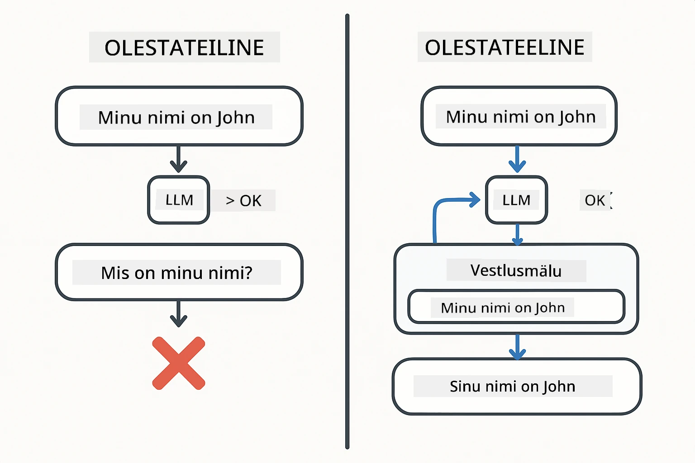
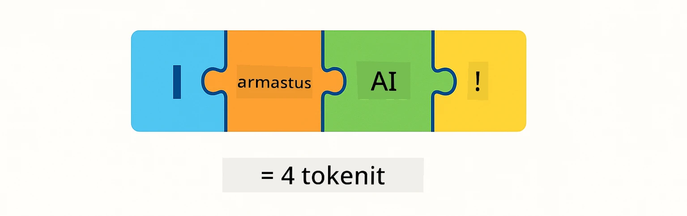
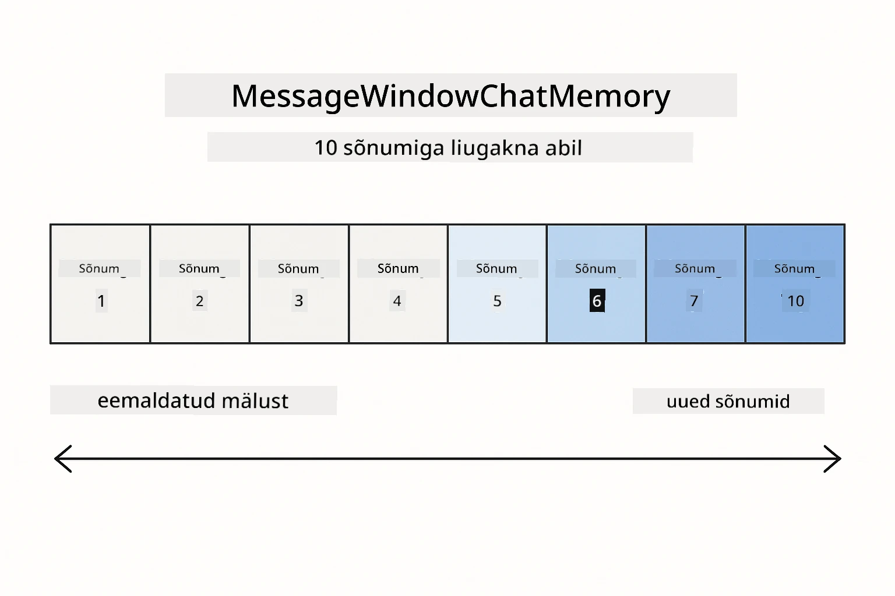
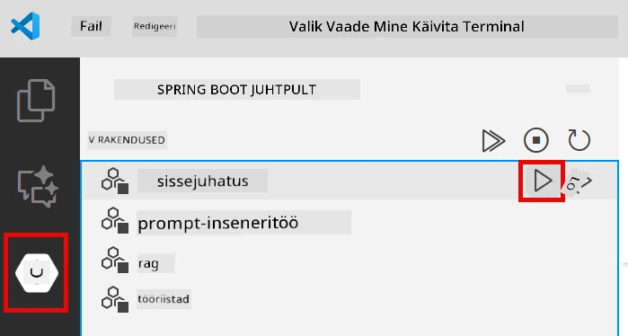
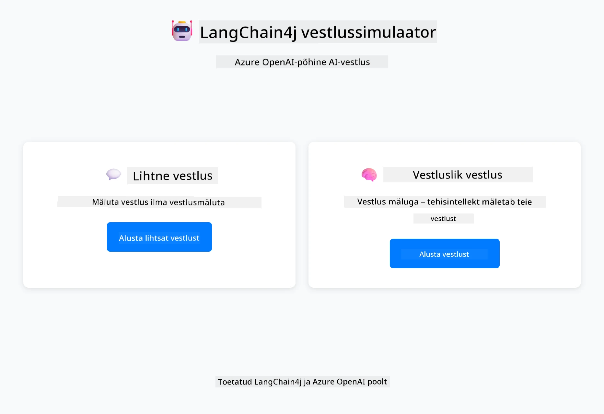
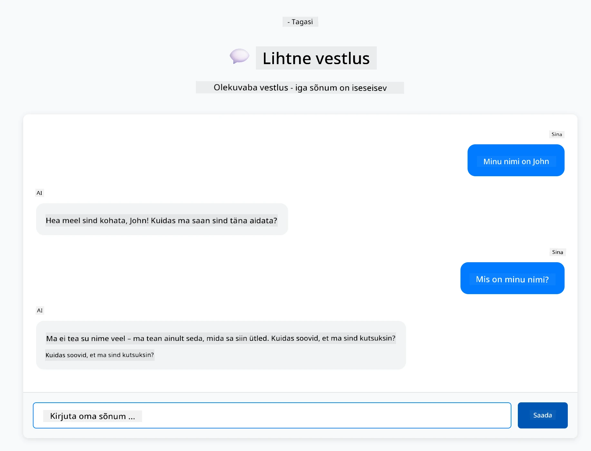
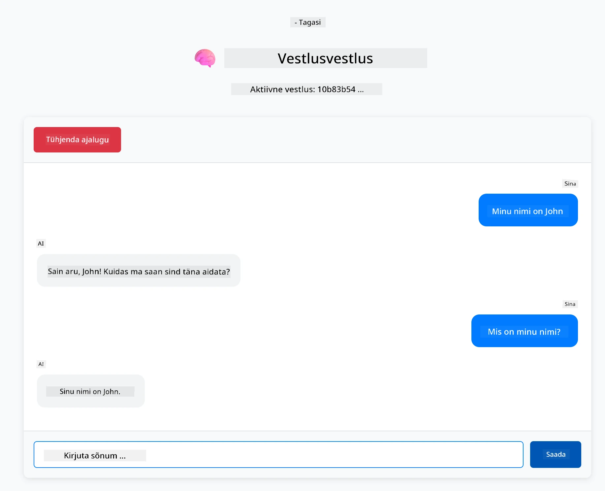

# Moodul 01: LangChain4j-ga alustamine

## Sisukord

- [Video juhendamine](#video-juhendamine)
- [Mida sa õpid](#mida-sa-õpid)
- [Eeltingimused](#eltingimused)
- [Tuumaprobleemi mõistmine](#tuumaprobleemi-mõistmine)
- [Tokenite mõistmine](#tokenite-mõistmine)
- [Kuidas mälu töötab](#kuidas-mälu-tööt)
- [Kuidas see kasutab LangChain4j](#kuidas-see-kasutab-langchain4j)
- [Azure OpenAI infrastruktuuri juurutamine](#azure-openai-infrastruktuuri-juurutamine)
- [Rakenduse lokaalne käitamine](#rakenduse-lokaalne-käitamine)
- [Rakenduse kasutamine](#rakenduse-kasutamine)
  - [Stateless vestlus (vasak paneel)](#stateless-vestlus-vasak-paneel)
  - [Stateful vestlus (parem paneel)](#stateful-vestlus-parem-paneel)
- [Järgmised sammud](#järgmised-sammud)

## Video juhendamine

Vaata seda otseülekannet, mis selgitab, kuidas selle mooduliga alustada:

<a href="https://www.youtube.com/live/nl_troDm8rQ?si=6b85S8xGjWnT2fX9"></a>

## Mida sa õpid

See on sinu lähtepunkt LangChain4j ja Azure OpenAI kasutamiseks. Alustame põhialustest ja hakkame looma tootmistasemel rakendusi. See moodul keskendub vestluslikule tehisintellektile, mis mäletab konteksti ja hoiab olekut — need on põhikontseptsioonid, millele kõik hilisemad moodulid tuginevad.

Selles juhendis kasutame kogu aeg Azure OpenAI GPT-5.2, sest selle arenenud mõtlemisvõimed muudavad erinevate mustrite käitumise selgemaks. Kui lisad mälu, näed vahet selgelt. See lihtsustab mõistmist, mida iga komponent sinu rakendusele annab.

Sa ehitad ühe rakenduse, mis demonstreerib mõlemat mustrit:

**Stateless vestlus** – iga päring on iseseisev. Mudelil puudub mälu varasemate sõnumite kohta. See on kõige lihtsam lähtepunkt.

**Stateful vestlus** – iga päring sisaldab vestluse ajalugu. Mudel hoiab konteksti mitme vahetuse vältel. Seda nõuavad tootmisrakendused.

## Eeltingimused

- Azure tellimus koos Azure OpenAI ligipääsuga
- Java 21, Maven 3.9+
- Azure CLI (https://learn.microsoft.com/en-us/cli/azure/install-azure-cli)
- Azure Developer CLI (azd) (https://learn.microsoft.com/en-us/azure/developer/azure-developer-cli/install-azd)

> **Märkus:** Java, Maven, Azure CLI ja Azure Developer CLI (azd) on kaasas eeltöödeldud arendus konteineris.

> **Märkus:** See moodul kasutab GPT-5.2 Azure OpenAI platvormil. Juurutamine on automaatselt konfigureeritud `azd up` käsuga — ärge muutke mudeli nime koodis.

## Tuumaprobleemi mõistmine

Keelemudelid on olekuta. Iga API-päring on iseseisev. Kui sa saadad "Minu nimi on John" ja seejärel küsid "Mis mu nimi on?", siis mudel ei tea, et sa just ennast tutvustasid. Ta käsitleb iga päringut, nagu see oleks sinu esimene vestlus üldse.

See sobib lihtsate küsimuste-vastuste jaoks, aga pole kasulik pärisrakendusteks. Klienditeeninduse botid peavad meeles pidama, mida sa neile rääkisid. Isiklikud assistendid vajavad konteksti. Iga mitmevahetuseline vestlus nõuab mälu.

Järgmine diagramm näitab kahte lähenemist – vasakul olekuta kõne, mis unustab su nime; paremal olekuga kõne ChatMemory taustal, mis su nime mäletab.



*Vahe olekuteta (iseseisvad kõned) ja olekuga (konteksti tundvad) vestluste vahel*

## Tokenite mõistmine

Enne vestlustesse sukeldumist on oluline mõista tokeneid – põhielemendid tekstist, mida keelemudelid töötlevad:



*Näide, kuidas tekst jaotatakse tokeniteks – "I love AI!" muutub neljaks eraldi töötlemisühikuks*

Tokenid on see, kuidas tehisintellekt mudelid mõõdavad ja töötlevad teksti. Sõnad, kirjavahemärgid ja isegi tühikud võivad olla tokenid. Sinu mudelil on piirates, mitu tokenit ta korraga suudab töödelda (400 000 GPT-5.2 puhul, kuni 272 000 sisendtokenit ja 128 000 väljundtokenit). Tokenite mõistmine aitab vestluse pikkust ja kulusid paremini hallata.

## Kuidas mälu töötab

Vestluse mälu lahendab olekuta probleemi, hoides vestluse ajaloo meeles. Enne kui saadad mudelile päringu, lisab raamistik vastavad varasemad sõnumid ette. Kui sa küsid "Mis mu nimi on?", saadab süsteem kogu vestluse ajaloo, mis võimaldab mudelil näha, et sa ütlesid "Minu nimi on John".

LangChain4j pakub mälulahendusi, mis teevad seda automaatselt. Sa valid, mitu sõnumit hoida ja raamistik haldab konteksti akent. Allolev diagramm näitab, kuidas MessageWindowChatMemory hoiab libisevat akent viimaste sõnumite jaoks.



*MessageWindowChatMemory hoiab libisevat akent viimaste sõnumite jaoks ja viskab automaatselt välja vanad*

## Kuidas see kasutab LangChain4j

See moodul integreerib Spring Booti ja lisab vestlusmälusüsteemi. Nii sobituvad komponendid kokku:

**Sõltuvused** – lisa kaks LangChain4j teeki:

```xml
<dependency>
    <groupId>dev.langchain4j</groupId>
    <artifactId>langchain4j</artifactId> <!-- Inherited from BOM in root pom.xml -->
</dependency>
<dependency>
    <groupId>dev.langchain4j</groupId>
    <artifactId>langchain4j-open-ai-official</artifactId> <!-- Inherited from BOM in root pom.xml -->
</dependency>
```

**Vestlusmudel** – konfigureeri Azure OpenAI Spring bean-ina ([LangChainConfig.java](../../../01-introduction/src/main/java/com/example/langchain4j/config/LangChainConfig.java)):

```java
@Bean
public OpenAiOfficialChatModel openAiOfficialChatModel() {
    return OpenAiOfficialChatModel.builder()
            .baseUrl(azureEndpoint)
            .apiKey(azureApiKey)
            .modelName(deploymentName)
            .timeout(Duration.ofMinutes(5))
            .maxRetries(3)
            .build();
}
```

Builder loeb mandaadid keskkonnamuutujatest, mis on seadistatud `azd up` poolt. `baseUrl` seadmine oma Azure lõpp-punkti suunab OpenAI kliendi Azure OpenAI teenusele.

**Vestluse mälu** – hoia vestluse ajalugu MessageWindowChatMemory abil ([ConversationService.java](../../../01-introduction/src/main/java/com/example/langchain4j/service/ConversationService.java)):

```java
ChatMemory memory = MessageWindowChatMemory.withMaxMessages(10);

memory.add(UserMessage.from("My name is John"));
memory.add(AiMessage.from("Nice to meet you, John!"));

memory.add(UserMessage.from("What's my name?"));
AiMessage aiMessage = chatModel.chat(memory.messages()).aiMessage();
memory.add(aiMessage);
```

Loo mälu `withMaxMessages(10)`-ga, et hoida viimast 10 sõnumit. Lisa kasutaja ja AI sõnumid tüübitud wrapperitega: `UserMessage.from(text)` ja `AiMessage.from(text)`. Tõmba ajalugu `memory.messages()` abil ja saada see mudelile. Teenus salvestab iga vestluse ID kohta eraldi mälukopsu, võimaldades mitmel kasutajal vestelda samaaegselt.

> **🤖 Proovi koos [GitHub Copilot](https://github.com/features/copilot) vestlusega:** Ava [`ConversationService.java`](../../../01-introduction/src/main/java/com/example/langchain4j/service/ConversationService.java) ja küsi:
> - "Kuidas otsustab MessageWindowChatMemory, milliseid sõnumeid eemaldada, kui aken on täis?"
> - "Kas ma saan implementerida kohandatud mälusalvestust andmebaasi abil, mitte ainult mälus?"
> - "Kuidas lisada kokkuvõtete tegemist vana vestluse ajaloo tihendamiseks?"

Stateless vestluse lõpp-punkt jätab mälusüsteemi vahele — lihtsalt `chatModel.chat(prompt)` nagu kiire algus. Stateful lõpp-punkt lisab sõnumid mällu, tõmbab ajaloo ja lisab selle konteksti iga päringu juurde. Sama mudeli konfiguratsioon, erinevad mustrid.

## Azure OpenAI infrastruktuuri juurutamine

**Bash:**
```bash
cd 01-introduction
azd up  # Valige tellimus ja asukoht (soovitatav on eastus2)
```

**PowerShell:**
```powershell
cd 01-introduction
azd up  # Valige tellimus ja asukoht (soovitatav on eastus2)
```

> **Märkus:** Kui saad veateate aja ületamise kohta (`RequestConflict: Cannot modify resource ... provisioning state is not terminal`), lihtsalt käivita uuesti `azd up`. Azure ressursid võivad veel taustal juurutamisel olla ja taaskäivitamine lubab juurutusel lõpule jõuda, kui ressursid jõuavad lõppseisundisse.

See teeb järgmist:
1. Juurutab Azure OpenAI ressursi koos GPT-5.2 ja text-embedding-3-small mudelitega
2. Genereerib automaatselt projekti juurkausta `.env` faili mandaadiga
3. Seadistab kõik vajalikud keskkonnamuutujad

**Kas on probleeme juurutamisega?** Loe [Infrastruktuuri README-st](infra/README.md), kus on detailne tõrkeotsing, sealhulgas alamdomeeni nime konfliktid, käsitsi Azure Portaali juurutamise juhised ja mudeli konfigureerimine.

**Kontrolli, kas juurutamine õnnestus:**

**Bash:**
```bash
cat ../.env  # Peaks kuvama AZURE_OPENAI_ENDPOINT, API_KEY jms.
```

**PowerShell:**
```powershell
Get-Content ..\.env  # Peaks näitama AZURE_OPENAI_ENDPOINT, API_KEY jt.
```

> **Märkus:** `azd up` käsk genereerib `.env` faili automaatselt. Kui vajad hiljem selle uuendamist, võid kas muuta `.env` faili käsitsi või genereerida selle uuesti käivitades:
>
> **Bash:**
> ```bash
> cd ..
> bash .azd-env.sh
> ```
>
> **PowerShell:**
> ```powershell
> cd ..
> .\.azd-env.ps1
> ```

## Rakenduse lokaalne käitamine

**Kontrolli juurutamist:**

Veendu, et `.env` fail on olemas juurkataloogis koos Azure mandaadiga. Käivita see mooduli kataloogist (`01-introduction/`):

**Bash:**
```bash
cat ../.env  # Peaks näitama AZURE_OPENAI_ENDPOINT, API_KEY, DEPLOYMENT
```

**PowerShell:**
```powershell
Get-Content ..\.env  # Peaks näitama AZURE_OPENAI_ENDPOINT, API_KEY, DEPLOYMENT
```

**Käivita rakendused:**

**Variant 1: Spring Boot Dashboardi kasutamine (soovitatav VS Code kasutajatele)**

Arenduskonteiner sisaldab Spring Boot Dashboard laiendust, mis pakub visuaalset liidest kõigi Spring Boot rakenduste haldamiseks. Selle leiad vasaku külje tegevusribalt VS Code's (otsi Spring Boot ikooni).

Spring Boot Dashboardist saad:
- Näha kõiki tööalal olevaid Spring Boot rakendusi
- Käivitada/peatada rakendusi ühe klikiga
- Vaadata rakenduse logisid reaalajas
- Jälgida rakenduse olekut

Lihtsalt vajuta mängunuppu "introduction" kõrval, et see moodul käivitada, või alusta korraga kõiki mooduleid.



*Spring Boot Dashboard VS Code's — alusta, peata ja jälgi kõiki mooduleid ühest kohast*

**Variant 2: Käsurea skriptide kasutamine**

Käivita kõik veebirakendused (moodulid 01-04):

**Bash:**
```bash
cd ..  # Juurekataloogist
./start-all.sh
```

**PowerShell:**
```powershell
cd ..  # Juure kataloogist
.\start-all.ps1
```

Või käivita ainult see moodul:

**Bash:**
```bash
cd 01-introduction
./start.sh
```

**PowerShell:**
```powershell
cd 01-introduction
.\start.ps1
```

Mõlemad skriptid laadivad automaatselt keskkonnamuutujad juurest `.env` failist ja ehitavad JAR-failid, kui need puuduvad.

> **Märkus:** Kui soovid kõik moodulid käsitsi enne käivitamist ehitada:
>
> **Bash:**
> ```bash
> cd ..  # Go to root directory
> mvn clean package -DskipTests
> ```
>
> **PowerShell:**
> ```powershell
> cd ..  # Go to root directory
> mvn clean package -DskipTests
> ```

Ava oma brauseris http://localhost:8080

**Peatamiseks:**

**Bash:**
```bash
./stop.sh  # Ainult see moodul
# Või
cd .. && ./stop-all.sh  # Kõik moodulid
```

**PowerShell:**
```powershell
.\stop.ps1  # Ainult see moodul
# Või
cd ..; .\stop-all.ps1  # Kõik moodulid
```

## Rakenduse kasutamine

Rakendus pakub veebiliidest kahe kõnelogi rakendusega kõrvuti.



*Armatuurlaud, mis näitab nii lihtsat vestlust (stateless) kui ka vestlussessiooni (stateful) valikud*

### Stateless vestlus (vasak paneel)

Proovi esmalt. Küsi "Minu nimi on John" ja seejärel kohe "Mis mu nimi on?". Mudel ei mäleta, sest iga sõnum on iseseisev. See demonstreerib baaskeelemudeli integratsiooni tuumaprobleemi - puudub vestluse kontekst.



*Tehisintellekt ei mäleta eelmistest sõnumitest sinu nime*

### Stateful vestlus (parem paneel)

Proovi nüüd sama järjestust siin. Küsi "Minu nimi on John" ja siis "Mis mu nimi on?" Sel korral mäletab. Erinevus on MessageWindowChatMemory - see hoiab vestluse ajaloo ja lisab selle iga päringu juurde. Nii toimib tootmise vestluslik tehisintellekt.



*Tehisintellekt mäletab varasemat vestlust ja sinu nime*

Mõlemad paneelid kasutavad sama GPT-5.2 mudelit. Ainuke erinevus on mälu olemasolu. See teeb selgeks, mida mälu sinu rakendusele lisab ja miks see on tõeliste kasutusjuhtude puhul oluline.

## Järgmised sammud

**Järgmine moodul:** [02-prompt-engineering - Päringu inseneriteadus GPT-5.2-ga](../02-prompt-engineering/README.md)

---

**Navigeerimine:** [← Tagasi põhiosasse](../README.md) | [Järgmine: Moodul 02 - Päringu inseneriteadus →](../02-prompt-engineering/README.md)

---

<!-- CO-OP TRANSLATOR DISCLAIMER START -->
**Lahtiütlus**:
See dokument on tõlgitud kasutades AI tõlketeenust [Co-op Translator](https://github.com/Azure/co-op-translator). Kuigi me püüdleme täpsuse poole, palun pange tähele, et automatiseeritud tõlgetes võib esineda vigu või ebatäpsusi. Originaaldokument selle emakeeles tuleks pidada autoriteetseks allikaks. Olulise teabe puhul soovitatakse kasutada professionaalset inimtõlget. Me ei vastuta selle tõlkega seotud eksimustest või valesti mõistmistest.
<!-- CO-OP TRANSLATOR DISCLAIMER END -->