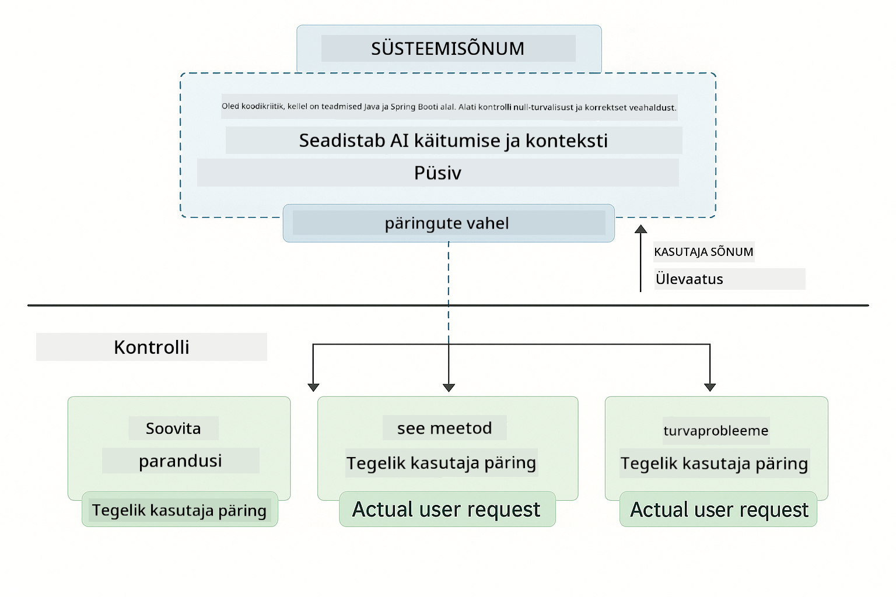
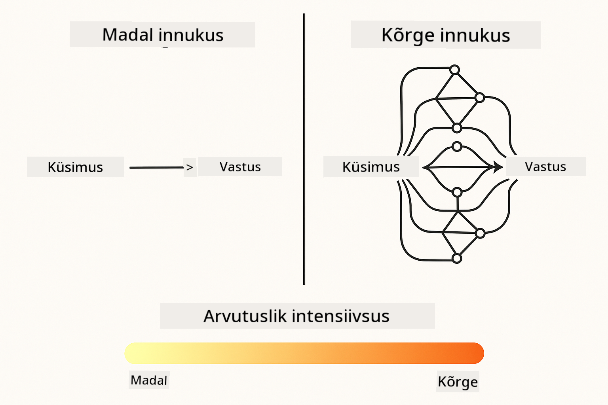
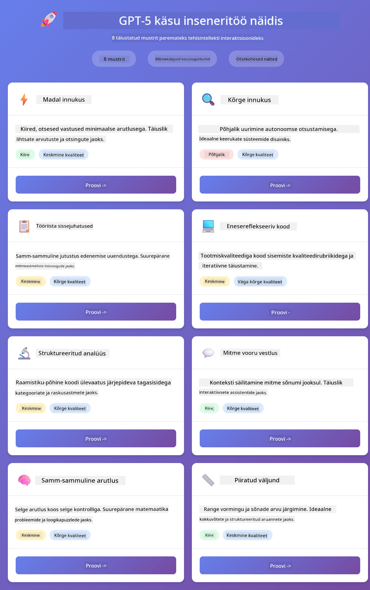
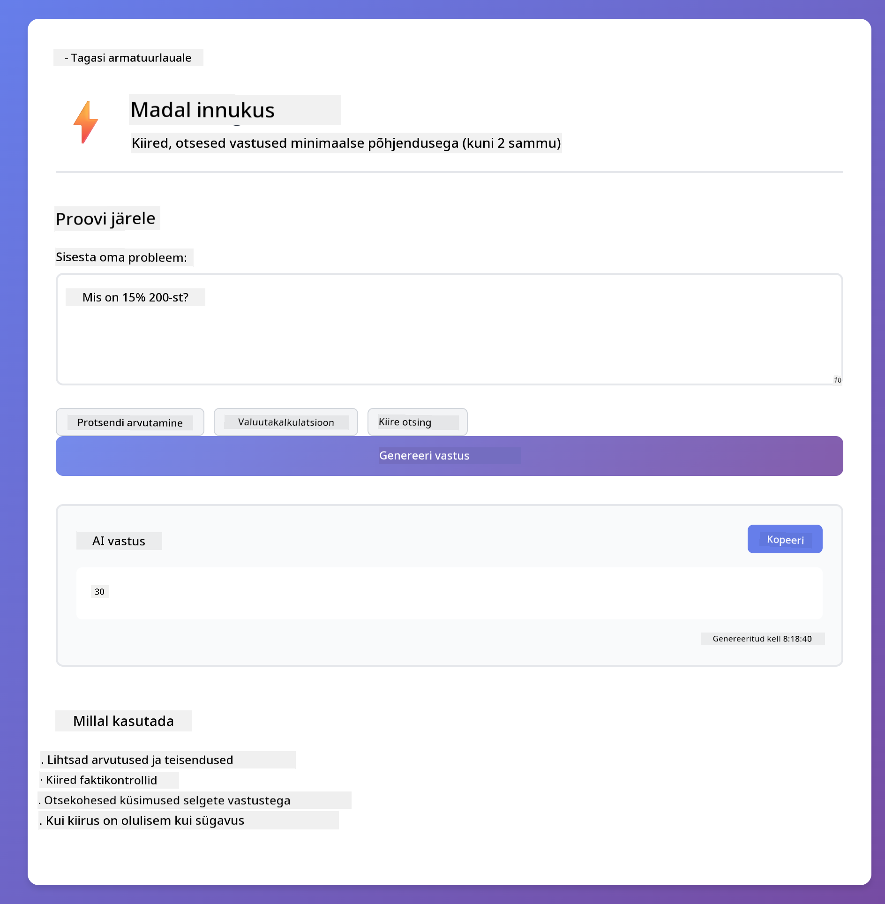
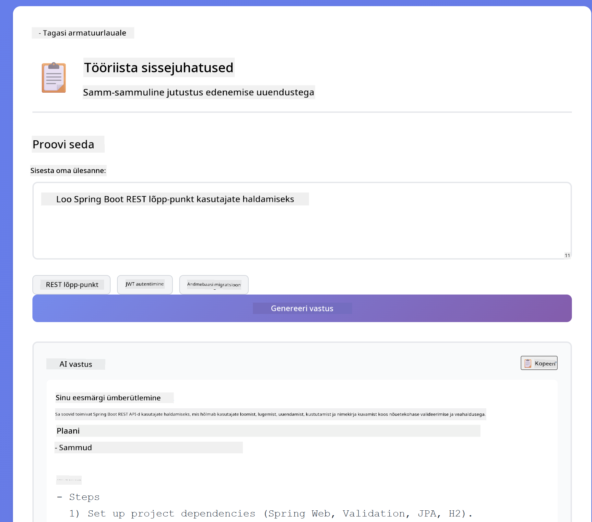
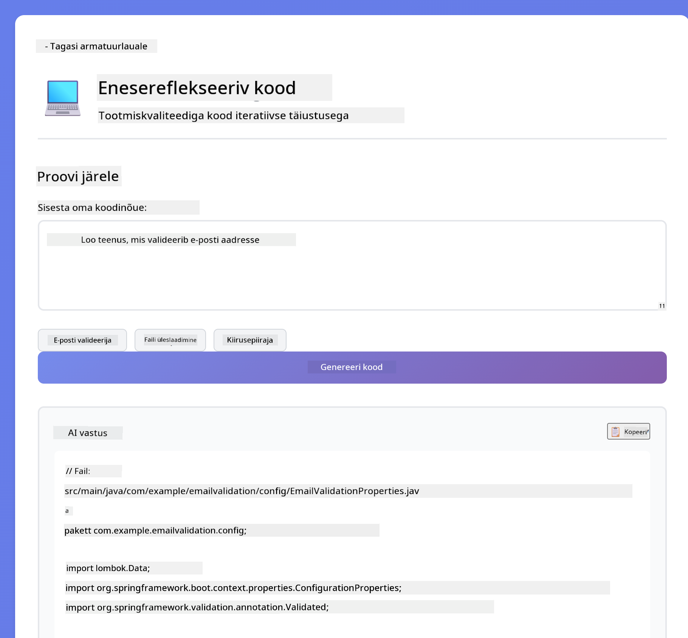
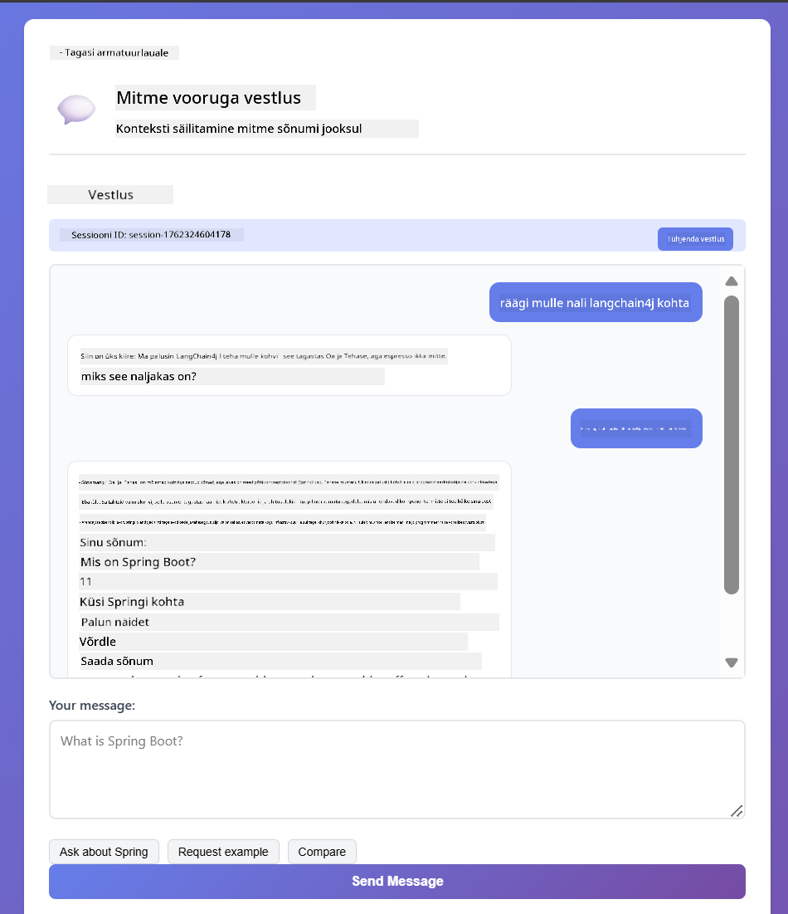
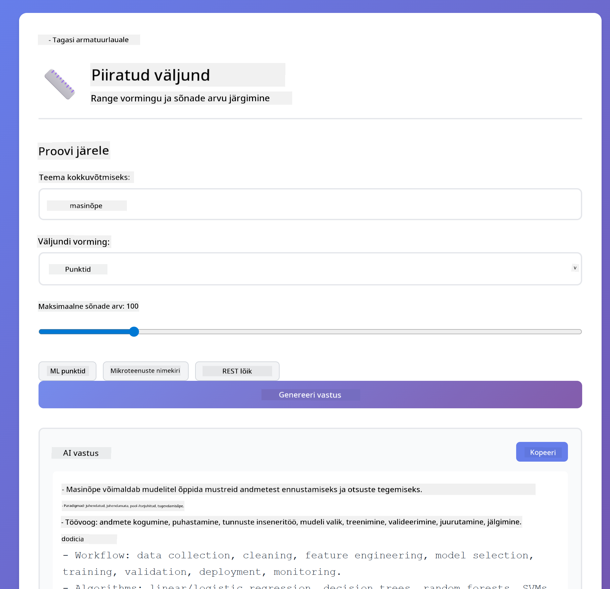

<!--
CO_OP_TRANSLATOR_METADATA:
{
  "original_hash": "8d787826cad7e92bf5cdbd116b1e6116",
  "translation_date": "2025-12-13T16:35:36+00:00",
  "source_file": "02-prompt-engineering/README.md",
  "language_code": "et"
}
-->
# Moodul 02: Promptide inseneritöö GPT-5-ga

## Sisukord

- [Mida sa õpid](../../../02-prompt-engineering)
- [Eeltingimused](../../../02-prompt-engineering)
- [Promptide inseneritöö mõistmine](../../../02-prompt-engineering)
- [Kuidas see kasutab LangChain4j](../../../02-prompt-engineering)
- [Põhiprintsiibid](../../../02-prompt-engineering)
- [Olemasolevate Azure ressursside kasutamine](../../../02-prompt-engineering)
- [Rakenduse ekraanipildid](../../../02-prompt-engineering)
- [Mustrid uurimine](../../../02-prompt-engineering)
  - [Madal vs kõrge innukus](../../../02-prompt-engineering)
  - [Ülesande täitmine (tööriistade sissejuhatused)](../../../02-prompt-engineering)
  - [Isepeegeldav kood](../../../02-prompt-engineering)
  - [Struktureeritud analüüs](../../../02-prompt-engineering)
  - [Mitme vooru vestlus](../../../02-prompt-engineering)
  - [Samm-sammuline põhjendus](../../../02-prompt-engineering)
  - [Piiratud väljund](../../../02-prompt-engineering)
- [Mida sa tegelikult õpid](../../../02-prompt-engineering)
- [Järgmised sammud](../../../02-prompt-engineering)

## Mida sa õpid

Eelmises moodulis nägid, kuidas mälu võimaldab vestluslikku tehisintellekti ja kasutasid GitHubi mudeleid põhilisteks interaktsioonideks. Nüüd keskendume sellele, kuidas sa küsimusi esitad – promptidele endile – kasutades Azure OpenAI GPT-5. Kuidas sa oma promptid struktureerid, mõjutab oluliselt vastuste kvaliteeti.

Kasutame GPT-5, sest see toob sisse põhjenduse kontrolli – sa saad mudelile öelda, kui palju mõtlemist teha enne vastamist. See muudab erinevad promptimise strateegiad selgemaks ja aitab sul mõista, millal kasutada millist lähenemist. Samuti saame kasu Azure'i väiksematest kiirusepiirangutest GPT-5 puhul võrreldes GitHubi mudelitega.

## Eeltingimused

- Läbitud Moodul 01 (Azure OpenAI ressursid juurutatud)
- Juurekaustas `.env` fail Azure volitustega (loodud `azd up` käsuga Moodulis 01)

> **Märkus:** Kui sa pole Moodulit 01 lõpetanud, järgi esmalt seal olevaid juurutusjuhiseid.

## Promptide inseneritöö mõistmine

Promptide inseneritöö tähendab sisendi teksti kujundamist nii, et see järjepidevalt annab sulle vajalikud tulemused. See ei ole lihtsalt küsimuste esitamine – see on taotluste struktureerimine nii, et mudel mõistaks täpselt, mida sa tahad ja kuidas seda esitada.

Mõtle sellele nagu juhiste andmine kolleegile. "Paranda viga" on ebamäärane. "Paranda nullviite erind UserService.java reas 45, lisades nullkontrolli" on konkreetne. Keelemudelid töötavad samamoodi – täpsus ja struktuur on olulised.

## Kuidas see kasutab LangChain4j

See moodul demonstreerib täiustatud promptimise mustreid, kasutades sama LangChain4j alust nagu eelmistel moodulitel, keskendudes promptide struktuurile ja põhjenduse kontrollile.


*Kuidas LangChain4j ühendab sinu promptid Azure OpenAI GPT-5-ga*

**Sõltuvused** – Moodul 02 kasutab järgmisi langchain4j sõltuvusi, mis on defineeritud `pom.xml` failis:
```xml
<dependency>
    <groupId>dev.langchain4j</groupId>
    <artifactId>langchain4j</artifactId> <!-- Inherited from BOM in root pom.xml -->
</dependency>
<dependency>
    <groupId>dev.langchain4j</groupId>
    <artifactId>langchain4j-open-ai-official</artifactId> <!-- Inherited from BOM in root pom.xml -->
</dependency>
```

**OpenAiOfficialChatModel konfiguratsioon** – [LangChainConfig.java](../../../02-prompt-engineering/src/main/java/com/example/langchain4j/prompts/config/LangChainConfig.java)

Vestlusmudel on käsitsi konfigureeritud Spring bean'ina, kasutades OpenAI ametlikku klienti, mis toetab Azure OpenAI lõpp-punkte. Peamine erinevus Moodul 01-st on selles, kuidas me struktureerime promptid, mis saadetakse `chatModel.chat()` meetodile, mitte mudeli seadistuses endas.

**Süsteemi ja kasutaja sõnumid** – [Gpt5PromptService.java](../../../02-prompt-engineering/src/main/java/com/example/langchain4j/prompts/service/Gpt5PromptService.java)

LangChain4j eristab sõnumitüüpe selguse huvides. `SystemMessage` seab tehisintellekti käitumise ja konteksti (näiteks "Sa oled koodi ülevaataja"), samas kui `UserMessage` sisaldab tegelikku päringut. See eristus võimaldab hoida AI käitumist järjepidevana erinevate kasutajapäringute puhul.

```java
SystemMessage systemMsg = SystemMessage.from(
    "You are a helpful Java programming expert."
);

UserMessage userMsg = UserMessage.from(
    "Explain what a List is in Java"
);

String response = chatModel.chat(systemMsg, userMsg);
```



*SystemMessage annab püsiva konteksti, UserMessages sisaldavad individuaalseid päringuid*

**MessageWindowChatMemory mitme vooru jaoks** – Mitme vooru vestlusmustri puhul kasutame uuesti `MessageWindowChatMemory` Moodulist 01. Iga sessioon saab oma mäluinstantsi, mis on salvestatud `Map<String, ChatMemory>`-sse, võimaldades mitut samaaegset vestlust ilma konteksti segamiseta.

**Prompti mallid** – Tegelik fookus on promptide inseneritööl, mitte uutel LangChain4j API-del. Iga muster (madal innukus, kõrge innukus, ülesande täitmine jne) kasutab sama `chatModel.chat(prompt)` meetodit, kuid hoolikalt struktureeritud promptide stringidega. XML sildid, juhised ja vormindus on kõik osa prompti tekstist, mitte LangChain4j omadused.

**Põhjenduse kontroll** – GPT-5 põhjenduse pingutust juhitakse prompti juhistega nagu "maksimaalselt 2 põhjendusetappi" või "uurida põhjalikult". Need on promptide inseneritöö tehnikad, mitte LangChain4j konfiguratsioonid. Teek lihtsalt edastab sinu promptid mudelile.

Peamine järeldus: LangChain4j pakub infrastruktuuri (mudeli ühendus läbi [LangChainConfig.java](../../../02-prompt-engineering/src/main/java/com/example/langchain4j/prompts/config/LangChainConfig.java), mälu, sõnumite haldus läbi [Gpt5PromptService.java](../../../02-prompt-engineering/src/main/java/com/example/langchain4j/prompts/service/Gpt5PromptService.java)), samal ajal kui see moodul õpetab, kuidas selles infrastruktuuris tõhusaid prompt'e koostada.

## Põhiprintsiibid

Kõik probleemid ei vaja sama lähenemist. Mõned küsimused vajavad kiireid vastuseid, teised sügavat mõtlemist. Mõned vajavad nähtavat põhjendust, teised ainult tulemusi. See moodul katab kaheksa promptimise mustrit – igaüks optimeeritud erinevateks olukordadeks. Sa katsetad kõiki, et õppida, millal milline lähenemine kõige paremini töötab.


*Ülevaade kaheksast promptide inseneritöö mustrist ja nende kasutusjuhtudest*



*Madal innukus (kiire, otsene) vs kõrge innukus (põhjalik, uuriv) põhjendamise lähenemised*

**Madal innukus (kiire ja fokusseeritud)** – Lihtsate küsimuste jaoks, kus soovid kiireid ja otseseid vastuseid. Mudel teeb minimaalset põhjendust – maksimaalselt 2 sammu. Kasuta seda arvutuste, otsingute või lihtsate küsimuste puhul.

```java
String prompt = """
    <reasoning_effort>low</reasoning_effort>
    <instruction>maximum 2 reasoning steps</instruction>
    
    What is 15% of 200?
    """;

String response = chatModel.chat(prompt);
```

> 💡 **Uuri GitHub Copilotiga:** Ava [`Gpt5PromptService.java`](../../../02-prompt-engineering/src/main/java/com/example/langchain4j/prompts/service/Gpt5PromptService.java) ja küsi:
> - "Mis vahe on madala ja kõrge innukusega promptimise mustritel?"
> - "Kuidas XML sildid promptides aitavad AI vastust struktureerida?"
> - "Millal peaksin kasutama isepeegeldamise mustreid ja millal otsest juhendamist?"

**Kõrge innukus (sügav ja põhjalik)** – Keerukate probleemide jaoks, kus soovid põhjalikku analüüsi. Mudel uurib põhjalikult ja näitab detailset põhjendust. Kasuta seda süsteemidisaini, arhitektuuriliste otsuste või keeruka uurimistöö puhul.

```java
String prompt = """
    <reasoning_effort>high</reasoning_effort>
    <instruction>explore thoroughly, show detailed reasoning</instruction>
    
    Design a caching strategy for a high-traffic REST API.
    """;

String response = chatModel.chat(prompt);
```

**Ülesande täitmine (samm-sammuline edenemine)** – Mitme sammu töövoogude jaoks. Mudel annab esmalt plaani, jutustab iga sammu töö käigus, seejärel annab kokkuvõtte. Kasuta seda migratsioonide, rakenduste või mis tahes mitme sammu protsesside puhul.

```java
String prompt = """
    <task>Create a REST endpoint for user registration</task>
    <preamble>Provide an upfront plan</preamble>
    <narration>Narrate each step as you work</narration>
    <summary>Summarize what was accomplished</summary>
    """;

String response = chatModel.chat(prompt);
```

Chain-of-Thought promptimine palub mudelil näidata oma põhjendusprotsessi, parandades keerukate ülesannete täpsust. Samm-sammuline jaotus aitab nii inimestel kui AI-l loogikat mõista.

> **🤖 Proovi [GitHub Copilot](https://github.com/features/copilot) Chatiga:** Küsi selle mustri kohta:
> - "Kuidas kohandada ülesande täitmise mustrit pikaajaliste operatsioonide jaoks?"
> - "Millised on parimad praktikad tööriistade sissejuhatuste struktureerimiseks tootmiskeskkonnas?"
> - "Kuidas püüda ja kuvada vahepealseid edenemisuuendusi kasutajaliideses?"


*Plaani → Täida → Kokkuvõtte töövoog mitme sammu ülesannete jaoks*

**Isepeegeldav kood** – Tootmiskvaliteediga koodi genereerimiseks. Mudel genereerib koodi, kontrollib seda kvaliteedikriteeriumide vastu ja parandab iteratiivselt. Kasuta seda uute funktsioonide või teenuste loomisel.

```java
String prompt = """
    <task>Create an email validation service</task>
    <quality_criteria>
    - Correct logic and error handling
    - Best practices (clean code, proper naming)
    - Performance optimization
    - Security considerations
    </quality_criteria>
    <instruction>Generate code, evaluate against criteria, improve iteratively</instruction>
    """;

String response = chatModel.chat(prompt);
```


*Iteratiivse täiustamise tsükkel – genereeri, hinda, tuvastage probleemid, paranda, korda*

**Struktureeritud analüüs** – Järjepidevaks hindamiseks. Mudel vaatab koodi üle fikseeritud raamistiku alusel (õigsus, praktikad, jõudlus, turvalisus). Kasuta seda koodi ülevaatusteks või kvaliteedi hindamiseks.

```java
String prompt = """
    <code>
    public List getUsers() {
        return database.query("SELECT * FROM users");
    }
    </code>
    
    <framework>
    Evaluate using these categories:
    1. Correctness - Logic and functionality
    2. Best Practices - Code quality
    3. Performance - Efficiency concerns
    4. Security - Vulnerabilities
    </framework>
    """;

String response = chatModel.chat(prompt);
```

> **🤖 Proovi [GitHub Copilot](https://github.com/features/copilot) Chatiga:** Küsi struktureeritud analüüsi kohta:
> - "Kuidas kohandada analüüsiraamistikku erinevate koodi ülevaatuste jaoks?"
> - "Mis on parim viis struktureeritud väljundi programmeerimiseks lugemiseks ja töötlemiseks?"
> - "Kuidas tagada järjepidevad raskusastmed erinevate ülevaatussessioonide vahel?"


*Neljaliikmeline raamistik järjepidevate koodi ülevaatuste jaoks raskusastmetega*

**Mitme vooru vestlus** – Vestluste jaoks, mis vajavad konteksti. Mudel mäletab eelnevaid sõnumeid ja ehitab nende peale. Kasuta seda interaktiivsete abiseansside või keerukate küsimuste-vastuste jaoks.

```java
ChatMemory memory = MessageWindowChatMemory.withMaxMessages(10);

memory.add(UserMessage.from("What is Spring Boot?"));
AiMessage aiMessage1 = chatModel.chat(memory.messages()).aiMessage();
memory.add(aiMessage1);

memory.add(UserMessage.from("Show me an example"));
AiMessage aiMessage2 = chatModel.chat(memory.messages()).aiMessage();
memory.add(aiMessage2);
```


*Kuidas vestluse kontekst koguneb mitme vooru jooksul kuni tokeni piirini*

**Samm-sammuline põhjendus** – Probleemide jaoks, mis vajavad nähtavat loogikat. Mudel näitab iga sammu selget põhjendust. Kasuta seda matemaatikaülesannete, loogikapuzzlede või siis, kui vajad mõtlemisprotsessi mõistmist.

```java
String prompt = """
    <instruction>Show your reasoning step-by-step</instruction>
    
    If a train travels 120 km in 2 hours, then stops for 30 minutes,
    then travels another 90 km in 1.5 hours, what is the average speed
    for the entire journey including the stop?
    """;

String response = chatModel.chat(prompt);
```


*Probleemide jagamine selgeteks loogilisteks sammudeks*

**Piiratud väljund** – Vastuste jaoks, millel on spetsiifilised formaadi nõuded. Mudel järgib rangelt formaadi ja pikkuse reegleid. Kasuta seda kokkuvõtete või täpse väljundistruktuuri vajaduse korral.

```java
String prompt = """
    <constraints>
    - Exactly 100 words
    - Bullet point format
    - Technical terms only
    </constraints>
    
    Summarize the key concepts of machine learning.
    """;

String response = chatModel.chat(prompt);
```


*Spetsiifiliste formaadi, pikkuse ja struktuuri nõuete järgimine*

## Olemasolevate Azure ressursside kasutamine

**Kontrolli juurutust:**

Veendu, et juurekaustas on olemas `.env` fail Azure volitustega (loodud Moodulis 01):
```bash
cat ../.env  # Peaks näitama AZURE_OPENAI_ENDPOINT, API_KEY, DEPLOYMENT
```

**Käivita rakendus:**

> **Märkus:** Kui sa juba käivitasid kõik rakendused käsuga `./start-all.sh` Moodulis 01, siis see moodul töötab juba pordil 8083. Võid allolevad käivituskäsud vahele jätta ja minna otse aadressile http://localhost:8083.

**Valik 1: Spring Boot Dashboardi kasutamine (soovitatav VS Code kasutajatele)**

Arenduskonteiner sisaldab Spring Boot Dashboard laiendust, mis pakub visuaalset liidest kõigi Spring Boot rakenduste haldamiseks. Leiad selle VS Code vasakpoolsest tegevusribast (otsi Spring Boot ikooni).

Spring Boot Dashboardist saad:
- Näha kõiki tööruumis olevaid Spring Boot rakendusi
- Käivitada/peatada rakendusi ühe klikiga
- Vaadata rakenduste logisid reaalajas
- Jälgida rakenduste olekut

Lihtsalt klõpsa "prompt-engineering" kõrval olevale mängunupule, et käivitada see moodul, või käivita korraga kõik moodulid.


**Valik 2: Shell skriptide kasutamine**

Käivita kõik veebirakendused (moodulid 01-04):

**Bash:**
```bash
cd ..  # Juurekataloogist
./start-all.sh
```

**PowerShell:**
```powershell
cd ..  # Juurekataloogist
.\start-all.ps1
```

Või käivita ainult see moodul:

**Bash:**
```bash
cd 02-prompt-engineering
./start.sh
```

**PowerShell:**
```powershell
cd 02-prompt-engineering
.\start.ps1
```

Mõlemad skriptid laadivad automaatselt keskkonnamuutujad juurekaustas olevast `.env` failist ja ehitavad JAR-failid, kui neid veel pole.

> **Märkus:** Kui soovid enne käivitamist kõik moodulid käsitsi ehitada:
>
> **Bash:**
> ```bash
> cd ..  # Go to root directory
> mvn clean package -DskipTests
> ```
>
> **PowerShell:**
> ```powershell
> cd ..  # Go to root directory
> mvn clean package -DskipTests
> ```

Ava oma brauseris http://localhost:8083.

**Peatamiseks:**

**Bash:**
```bash
./stop.sh  # Ainult see moodul
# Või
cd .. && ./stop-all.sh  # Kõik moodulid
```

**PowerShell:**
```powershell
.\stop.ps1  # Ainult see moodul
# Või
cd ..; .\stop-all.ps1  # Kõik moodulid
```

## Rakenduse ekraanipildid



*Peamine juhtpaneel, mis näitab kõiki 8 promptide inseneritöö mustrit koos nende omaduste ja kasutusjuhtudega*

## Mustrid uurimine

Veebiliides võimaldab sul katsetada erinevaid promptimise strateegiaid. Iga muster lahendab erinevaid probleeme – proovi neid, et näha, millal milline lähenemine kõige paremini toimib.

### Madal vs kõrge innukus

Esita lihtne küsimus nagu "Mis on 15% 200-st?" kasutades madalat innukust. Saad kohese ja otsese vastuse. Nüüd esita keerulisem küsimus nagu "Disaini vahemälu strateegia suure liiklusega API jaoks" kasutades kõrget innukust. Vaata, kuidas mudel aeglustub ja annab detailse põhjenduse. Sama mudel, sama küsimuse struktuur – aga prompt ütleb, kui palju mõtlemist teha.


*Kiire arvutus minimaalse põhjendusega*


*Kõikehõlmav vahemällu salvestamise strateegia (2.8MB)*

### Ülesande täitmine (tööriistade sissejuhatused)

Mitmeastmelised töövood saavad kasu eelplaneerimisest ja edenemise jutustamisest. Mudel kirjeldab, mida ta teeb, jutustab iga sammu kohta ja seejärel võtab tulemused kokku.



*REST-liidese loomine samm-sammult jutustades (3.9MB)*

### Enesepeegeldav kood

Proovi "Loo e-posti valideerimise teenus". Selle asemel, et lihtsalt koodi genereerida ja peatuda, genereerib mudel, hindab kvaliteedikriteeriumide alusel, tuvastab nõrkused ja parandab. Sa näed, kuidas ta kordab protsessi, kuni kood vastab tootmisstandarditele.



*Täielik e-posti valideerimise teenus (5.2MB)*

### Struktureeritud analüüs

Koodikontrollid vajavad järjepidevaid hindamisraamistikke. Mudel analüüsib koodi fikseeritud kategooriate (õigsus, tavad, jõudlus, turvalisus) ja raskusastmete alusel.


*Raamistiku-põhine koodikontroll*

### Mitmekäiguline vestlus

Küsi "Mis on Spring Boot?" ja seejärel kohe "Näita mulle näidet". Mudel mäletab sinu esimest küsimust ja annab sulle just Spring Booti näite. Ilma mäluta oleks teine küsimus liiga üldine.



*Konteksti säilitamine küsimuste vahel*

### Samm-sammuline põhjendus

Vali matemaatikaülesanne ja proovi seda nii samm-sammult põhjendades kui ka madala innukusega. Madal innukus annab lihtsalt vastuse – kiire, kuid ebaselge. Samm-sammult näitab sulle iga arvutust ja otsust.


*Matemaatikaülesanne selgete sammudega*

### Piiratud väljund

Kui vajad kindlaid vorminguid või sõnade arvu, sunnib see muster rangelt järgima. Proovi genereerida kokkuvõte, mis sisaldab täpselt 100 sõna punktide kujul.



*Masinõppe kokkuvõte vormingu kontrolliga*

## Mida sa tegelikult õpid

**Põhjenduse pingutus muudab kõik**

GPT-5 võimaldab sul kontrollida arvutuspingutust oma promptide kaudu. Madal pingutus tähendab kiireid vastuseid minimaalse uurimisega. Kõrge pingutus tähendab, et mudel võtab aega sügavalt mõtlemiseks. Sa õpid kohandama pingutust ülesande keerukusega – ära raiska aega lihtsatele küsimustele, aga ära kiirusta keeruliste otsustega.

**Struktuur juhib käitumist**

Kas märkasid promptides XML-silte? Need ei ole dekoratiivsed. Mudelid järgivad struktureeritud juhiseid usaldusväärsemalt kui vabateksti. Kui vajad mitmeastmelisi protsesse või keerukat loogikat, aitab struktuur mudelil jälgida, kus ta on ja mis järgmiseks tuleb.


*Hästi struktureeritud prompti anatoomia selgete osade ja XML-laadse korraldusega*

**Kvaliteet läbi enesehindamise**

Enesepeegeldavad mustrid töötavad, muutes kvaliteedikriteeriumid selgeks. Selle asemel, et loota, et mudel "teeb õigesti", ütled talle täpselt, mida "õige" tähendab: õige loogika, veahaldus, jõudlus, turvalisus. Mudel saab seejärel oma väljundit hinnata ja parandada. See muudab koodigeneratsiooni loteriist protsessiks.

**Kontekst on piiratud**

Mitmekäigulised vestlused toimivad, kaasates iga päringuga sõnumite ajaloo. Kuid on piir – igal mudelil on maksimaalne tokenite arv. Vestluste kasvades vajad strateegiaid, et hoida asjakohast konteksti ilma seda piiri ületamata. See moodul näitab, kuidas mälu töötab; hiljem õpid, millal kokku võtta, millal unustada ja millal taastada.

## Järgmised sammud

**Järgmine moodul:** [03-rag - RAG (otsingupõhine genereerimine)](../03-rag/README.md)

---

**Navigeerimine:** [← Eelmine: Moodul 01 - Sissejuhatus](../01-introduction/README.md) | [Tagasi avalehele](../README.md) | [Järgmine: Moodul 03 - RAG →](../03-rag/README.md)

---

<!-- CO-OP TRANSLATOR DISCLAIMER START -->
**Vastutusest loobumine**:
See dokument on tõlgitud kasutades tehisintellektil põhinevat tõlketeenust [Co-op Translator](https://github.com/Azure/co-op-translator). Kuigi püüame tagada täpsust, palun arvestage, et automaatsed tõlked võivad sisaldada vigu või ebatäpsusi. Originaaldokument selle emakeeles tuleks pidada autoriteetseks allikaks. Olulise teabe puhul soovitatakse kasutada professionaalset inimtõlget. Me ei vastuta selle tõlke kasutamisest tulenevate arusaamatuste või valesti mõistmiste eest.
<!-- CO-OP TRANSLATOR DISCLAIMER END -->