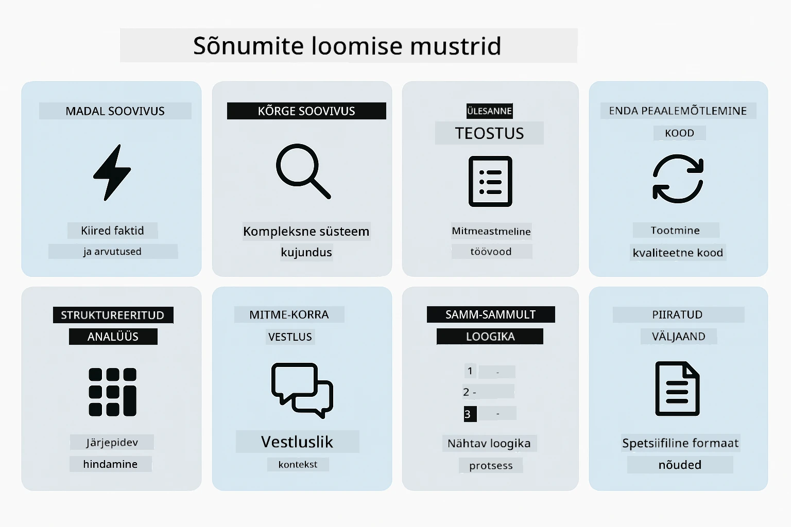
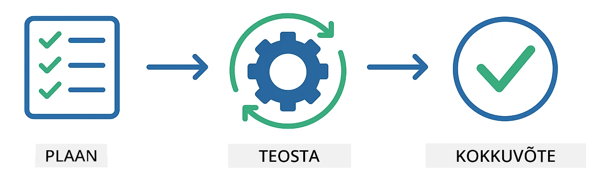
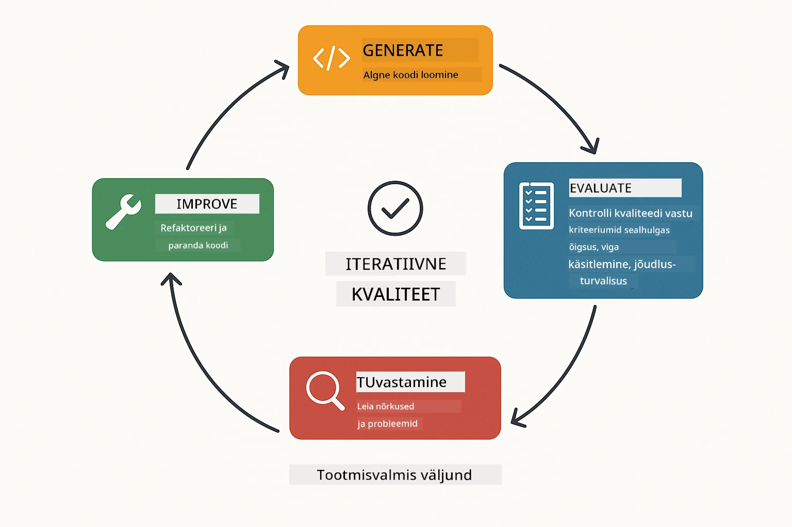
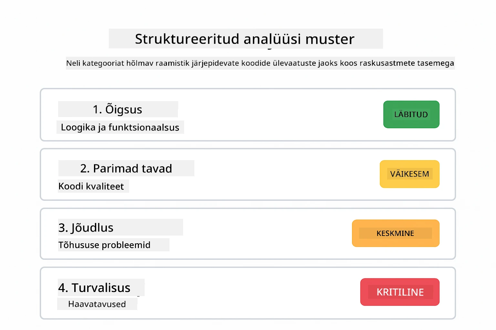
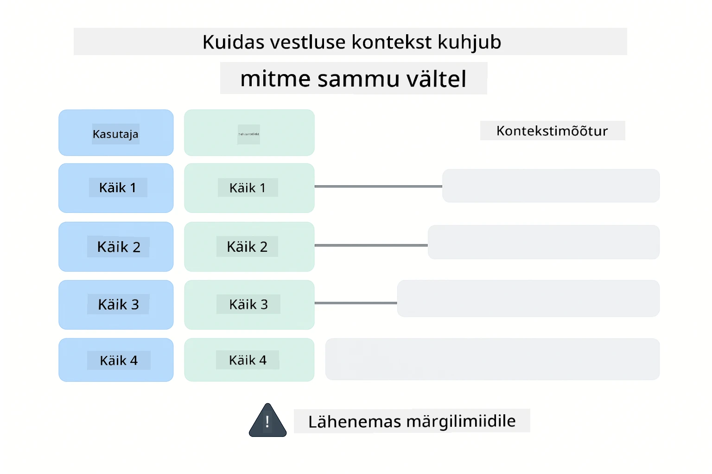
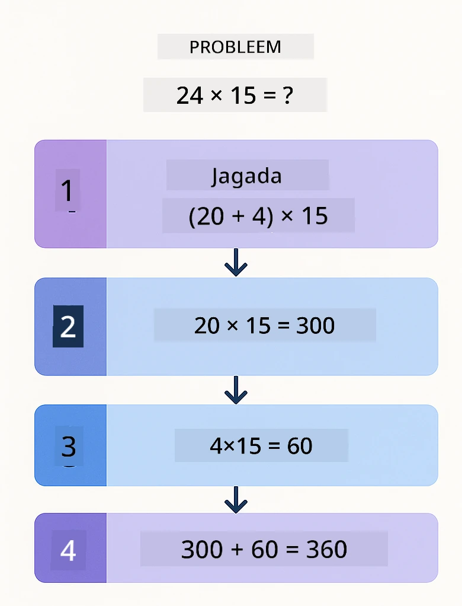
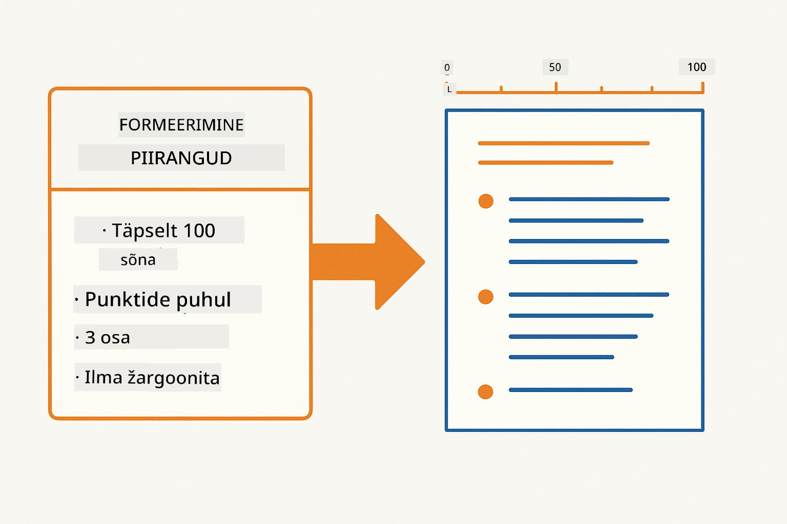
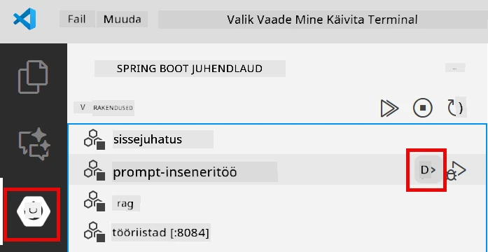
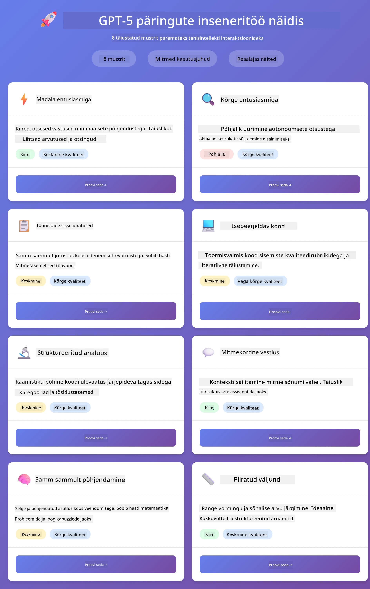
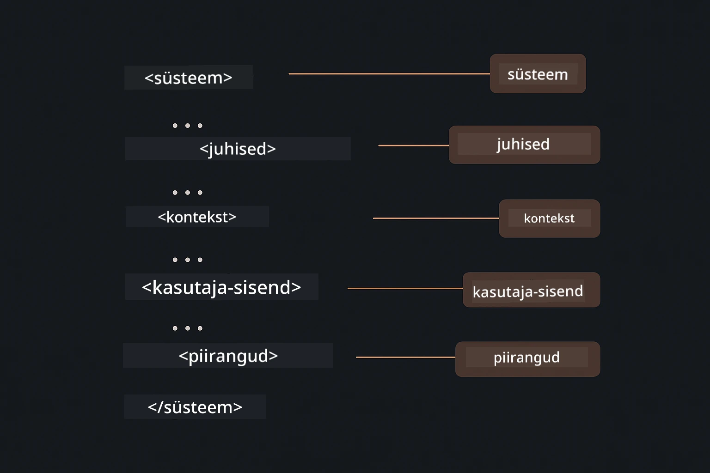

# Moodul 02: Promptide inseneriteadus GPT-5.2-ga

## Sisukord

- [Videojuhend](#videojuhend)
- [Mida Sa Õpid](#mida-sa-õpid)
- [Eeldused](#eeldused)
- [Promptide inseneriteaduse mõistmine](#promptide-inseneriteaduse-mõistmine)
- [Promptide inseneriteaduse alused](#promptide-inseneriteaduse-alused)
  - [Null-kohaline promptimine](#null-kohaline-promptimine)
  - [Mõned näited promptimine](#mõned-näited-promptimine)
  - [Mõtte ahel](#mõtte-ahel)
  - [Rollipõhine promptimine](#rollipõhine-promptimine)
  - [Promptide mallid](#promptide-mallid)
- [Täiustatud mustrid](#täiustatud-mustrid)
- [Rakenduse käivitamine](#rakenduse-käivitamine)
- [Rakenduse ekraanipildid](#rakenduse-ekraanipildid)
- [Mustrid lähemalt](#musterite-uurimine)
  - [Madal vs Kõrge innukus](#madal-vs-kõrge-innukus)
  - [Tööülesannete täitmine (tööriistade eeltekstid)](#ülesande-täitmine-tööriistapromptid)
  - [Isekriitiline kood](#enesepeegeldav-kood)
  - [Struktureeritud analüüs](#struktureeritud-analüüs)
  - [Mitme vooruga vestlus](#mitme-käiguline-vestlus)
  - [Samm-sammuline põhjendus](#samm-sammuline-põhjendus)
  - [Piiratud väljund](#piiratud-väljund)
- [Mida Sa Tõeliselt Õpid](#mida-te-tegelikult-õpite)
- [Järgmised sammud](#järgmised-sammud)

## Videojuhend

Vaata seda otseülekannet, mis selgitab, kuidas käivitada see moodul:

<a href="https://www.youtube.com/live/PJ6aBaE6bog?si=LDshyBrTRodP-wke"></a>

## Mida Sa Õpid

Järgnev diagramm annab ülevaate olulisematest teemadest ja oskustest, mida selles moodulis arendad — alates promptide lihvimise tehnikatest kuni samm-sammulise töövoo järgimiseni.


Eelnevas moodulis nägid, kuidas mälu võimaldab vestlus-AI-d Azure OpenAI abil. Nüüd keskendume sellele, kuidas sa esitad küsimusi — promptidele endile — kasutades Azure OpenAI GPT-5.2. Sinu promptide ülesehitus mõjutab oluliselt saadud vastuste kvaliteeti. Alustame põhitehnikate ülevaatega ja liigume edasi kaheksa täiustatud mustrini, mis võtavad GPT-5.2 võimekuse täielikult kasutusele.

Kasutame GPT-5.2, sest see tutvustab põhjendusjuhtimist – sa saad mudelile öelda, kui palju mõtlemist enne vastamist teha tuleb. See muudab erinevad promptimise strateegiad selgemaks ja aitab mõista, millal iga lähenemist kasutada.

## Eeldused

- Läbitud Moodul 01 (Azure OpenAI ressursid paigaldatud)
- Juurekataloogis `.env` fail Azure volitustega (loodud käsuga `azd up` Moodulis 01)

> **Märkus:** Kui pole lõpetanud Moodulit 01, järgi esmalt sealset paigaldamisjuhendit.

## Promptide inseneriteaduse mõistmine

Promptide inseneriteadus seisneb peamiselt selles, et juhised on kas ebamäärased või täpsed – järgnev võrdlus seda illustreerib.


Promptide inseneriteadus tähendab sisendi kavandamist nii, et see tagab sulle alati soovitud tulemused. See ei seisne ainult küsimuste esitamisel, vaid selleks, et päringud oleksid selliselt üles ehitatud, et mudel mõistaks täpselt, mida sa tahad ja kuidas seda esitada.

Mõtle sellele nagu juhiste andmine kolleegile. "Paranda viga" on ebamäärane. "Paranda UserService.java faili rea 45 tühiväärtusepaanika, lisades nulli kontrolli" on konkreetne. Keelemudelid töötavad samamoodi – tähtis on täpsus ja ülesehitus.

Järgnev diagramm näitab, kuidas LangChain4j sinna sobitub — ühendades su promptimustrid mudeliga läbi SystemMessage ja UserMessage ehitusplokkide.


LangChain4j tagab infrastruktuuri — mudeliga ühendused, mälu ja sõnumsiseste tüübid — samal ajal kui promptimustrid on lihtsalt hoolikalt üles ehitatud tekst, mida selle infrastruktuuri kaudu saadad. Peamised ehitusplokid on `SystemMessage` (mis määrab AI käitumise ja rolli) ja `UserMessage` (mis kannab su tegeliku päringu).

## Promptide inseneriteaduse alused

Viis põhitehnikat, mis on allpool näidatud, moodustavad tõhusa promptimise aluse. Igaüks neist käsitleb erinevat aspekti keeletega suhtlemisest.


Enne selle mooduli täiustatud mustrite juurde asumist vaatame üle viis fundamentaalset promptimise tehnikat. Need on ehitusplokid, mida iga promptide insener peaks teadma.

### Null-kohaline promptimine

Kõige lihtsam lähenemine: anna mudelile otsene juhis ilma näideteta. Mudel tugineb täielikult oma treeningule, et mõista ja täita ülesannet. See töötab hästi lihtsate päringute puhul, kus ootuspärane käitumine on ilmne.


*Otsene juhis ilma näideteta — mudel järeldab ülesande ainult juhise põhjal*

```java
String prompt = "Classify this sentiment: 'I absolutely loved the movie!'";
String response = model.chat(prompt);
// Vastus: "Positiivne"
```

**Millal kasutada:** Lihtsad klassifikatsioonid, otsesed küsimused, tõlkimised või mis tahes ülesanne, mida mudel suudab täita ilma täiendava juhendamiseta.

### Mõned näited promptimine

Too näited, mis näitavad mustrit, mida mudel peaks järgima. Mudel õpib sinu näidetest oodatud sisendi-väljundi formaadi ja rakendab seda uutele sisenditele. See parandab oluliselt järjepidevust ülesannetes, kus soovitud formaat või käitumine ei ole ilmne.


*Õppimine näidete kaudu — mudel tuvastab mustri ja rakendab seda uutele sisenditele*

```java
String prompt = """
    Classify the sentiment as positive, negative, or neutral.
    
    Examples:
    Text: "This product exceeded my expectations!" → Positive
    Text: "It's okay, nothing special." → Neutral
    Text: "Waste of money, very disappointed." → Negative
    
    Now classify this:
    Text: "Best purchase I've made all year!"
    """;
String response = model.chat(prompt);
```

**Millal kasutada:** Kohandatud klassifikatsioonid, järjepidev vormistus, domeenispetsiifilised ülesanded või kui null-kohaliste tulemused on ebajärjekindlad.

### Mõtte ahel

Paluge mudelil näidata oma põhjendust samm-sammult. Selle asemel, et kohe vastust anda, jagab mudel probleemi osadeks ja lahendab need ükshaaval selgelt välja tuues. See parandab täpsust matemaatikas, loogikas ja mitmesammulistes põhjendusülesannetes.


*Samm-sammuline põhjendus — keerukate probleemide lagundamine loogilisteks sammudeks*

```java
String prompt = """
    Problem: A store has 15 apples. They sell 8 apples and then 
    receive a shipment of 12 more apples. How many apples do they have now?
    
    Let's solve this step-by-step:
    """;
String response = model.chat(prompt);
// Mudel näitab: 15 - 8 = 7, siis 7 + 12 = 19 õuna
```

**Millal kasutada:** Matemaatikaülesanded, loogikamõistatused, silumine või mis tahes ülesanne, kus põhjendusprotsessi näitamine parandab täpsust ja usaldusväärsust.

### Rollipõhine promptimine

Sea AI-le enne küsimuse esitamist isiksus või roll. See annab konteksti, mis kujundab vastuse toonust, sügavust ja fookust. Näiteks "tarkvara arhitekt" annab teistsuguseid nõuandeid kui "noorem arendaja" või "turvaauditor".


*Konteksti ja isiksuse määramine — sama küsimuse puhul võib vastus sõltuda määratud rollist*

```java
String prompt = """
    You are an experienced software architect reviewing code.
    Provide a brief code review for this function:
    
    def calculate_total(items):
        total = 0
        for item in items:
            total = total + item['price']
        return total
    """;
String response = model.chat(prompt);
```

**Millal kasutada:** Koodikontrolle, juhendamist, domeenispetsiifilist analüüsi või kui vajad vastuseid, mis on kohandatud konkreetsele teadmiste tasemele või vaatenurgale.

### Promptide mallid

Loo korduvkasutatavad promptid muutujaplaanidega. Selle asemel, et kirjutada iga kord uus prompt, defineeri mall üks kord ja täida see erinevate väärtustega. LangChain4j `PromptTemplate` klass teeb seda lihtsaks `{{variable}}` süntaksiga.


*Korduvkasutatavad promptid muutuja asendustega — üks mall, palju kasutusi*

```java
PromptTemplate template = PromptTemplate.from(
    "What's the best time to visit {{destination}} for {{activity}}?"
);

Prompt prompt = template.apply(Map.of(
    "destination", "Paris",
    "activity", "sightseeing"
));

String response = model.chat(prompt.text());
```

**Millal kasutada:** Korduvate päringute puhul erinevate sisenditega, hulgitöötluses, korduvkasutatavate AI töövoogude ehitamisel või igas olukorras, kus prompti struktuur jääb samaks, kuid andmed muutuvad.

---

Need viis alust loovad tugeva tööriistakomplekti enamike promptimise ülesannete jaoks. Selle mooduli ülejäänud osa põhineb neil ning sisaldab **kaheksat täiustatud mustrit**, mis kasutavad GPT-5.2 põhjendusjuhtimise, enesehindamise ja struktureeritud väljundi võimalusi.

## Täiustatud mustrid

Kui alused on kaetud, liigume kaheksa täiustatud mustri juurde, mis teevad selle mooduli ainulaadseks. Mitte kõik probleemid ei vaja sama lähenemist. Mõned küsimused vajavad kiireid vastuseid, teised sügavat mõtlemist. Mõned vajavad nähtavat põhjendust, teised lihtsalt tulemusi. Iga alljärgnev muster on optimeeritud erinevaks stsenaariumiks — ning GPT-5.2 põhjendusjuhtimine muudab erinevused veelgi selgemaks.



*Kaheksa promptide insenerimustri ülevaade ja nende kasutusjuhud*

GPT-5.2 lisab nendele mustritele veel ühe mõõtme: *põhjendusjuhtimise*. Liugur allpool näitab, kuidas saad mudeli mõtlemise pingutust reguleerida — kiiretest otsevastustest kuni põhjaliku süvaanalüüsini.


*GPT-5.2 põhjendusjuhtimine lubab määrata, kui palju mudel peab mõtlema — alates kiiretest otsestest vastustest kuni põhjaliku uurimiseni*

**Madal innukus (Kiire & Fookustatud)** - Lihtsate küsimuste puhul, kus tahad kiireid ja otseseid vastuseid. Mudel teeb minimaalset põhjendust - maksimaalselt 2 sammu. Kasuta seda arvutuste, päringute või sirgjooneliste küsimuste jaoks.

```java
String prompt = """
    <context_gathering>
    - Search depth: very low
    - Bias strongly towards providing a correct answer as quickly as possible
    - Usually, this means an absolute maximum of 2 reasoning steps
    - If you think you need more time, state what you know and what's uncertain
    </context_gathering>
    
    Problem: What is 15% of 200?
    
    Provide your answer:
    """;

String response = chatModel.chat(prompt);
```

> 💡 **Uuri GitHub Copilotiga:** Ava [`Gpt5PromptService.java`](../../../02-prompt-engineering/src/main/java/com/example/langchain4j/prompts/service/Gpt5PromptService.java) ja küsi:
> - "Mis vahe on madala ja kõrge innukusega promptimustritel?"
> - "Kuidas XML sildid promptides aitavad AI vastuseid struktureerida?"
> - "Millal peaksin kasutama eneserefleksiooni mustreid vs otseseid juhiseid?"

**Kõrge innukus (Sügav & Põhjalik)** - Komplekssete probleemide puhul, kus soovid põhjalikku analüüsi. Mudel uurib põhjalikult ja näitab detailset põhjendust. Kasuta seda süsteemide disaini, arhitektuuriliste otsuste või keerukate uurimistööde jaoks.

```java
String prompt = """
    Analyze this problem thoroughly and provide a comprehensive solution.
    Consider multiple approaches, trade-offs, and important details.
    Show your analysis and reasoning in your response.
    
    Problem: Design a caching strategy for a high-traffic REST API.
    """;

String response = chatModel.chat(prompt);
```

**Tööülesannete täitmine (samm-sammuline edenemine)** - Mitmesammuliste töövoogude jaoks. Mudel annab etteplaani, jutustab iga sammu töötlemise ajal ja annab kokkuvõtte. Kasuta migreerimiste, rakenduste või mõne muu mitmesammulise protsessi jaoks.

```java
String prompt = """
    <task_execution>
    1. First, briefly restate the user's goal in a friendly way
    
    2. Create a step-by-step plan:
       - List all steps needed
       - Identify potential challenges
       - Outline success criteria
    
    3. Execute each step:
       - Narrate what you're doing
       - Show progress clearly
       - Handle any issues that arise
    
    4. Summarize:
       - What was completed
       - Any important notes
       - Next steps if applicable
    </task_execution>
    
    <tool_preambles>
    - Always begin by rephrasing the user's goal clearly
    - Outline your plan before executing
    - Narrate each step as you go
    - Finish with a distinct summary
    </tool_preambles>
    
    Task: Create a REST endpoint for user registration
    
    Begin execution:
    """;

String response = chatModel.chat(prompt);
```

Mõtte ahela promptimine palub mudelil selgelt näidata oma põhjendusprotsessi, parandades täpsust komplekssete ülesannete puhul. Samm-sammult lagundamine aitab nii inimestel kui AI-l loogikat mõista.

> **🤖 Proovi [GitHub Copiloti](https://github.com/features/copilot) Chat'iga:** Küsi selle mustri kohta:
> - "Kuidas kohandada tööülesande täitmise mustrit pikaajaliste operatsioonide jaoks?"
> - "Millised on parimad praktikad tööriistade eeltekstid rakendustes?"
> - "Kuidas tabada ja kuvada vahe-edenemise uuendusi kasutajaliideses?"

Järgnev diagramm illustreerib seda Plaan → Täida → Kokkuvõte töövoogu.



*Plaan → Täida → Kokkuvõte töövoog mitmesammuliste ülesannete jaoks*

**Isekriitiline kood** - Toodangukvaliteediga koodi genereerimiseks. Mudel loob koodi vastavalt tootmisstandarditele, sh nõuetekohase veakäsitlusega. Kasuta seda uute funktsioonide või teenuste arendamisel.

```java
String prompt = """
    Generate Java code with production-quality standards: Create an email validation service
    Keep it simple and include basic error handling.
    """;

String response = chatModel.chat(prompt);
```

Järgnev diagramm näitab seda iteratiivse täiustamise tsüklit — genereeri, hinda, tuvastu puudujäägid ja paranda, kuni kood vastab tootmisstandarditele.



*Iteratiivne täiustamise tsükkel – genereeri, hinda, leia puudused, paranda, korda*

**Struktureeritud analüüs** - Järjekindla hindamise jaoks. Mudel vaatab koodi üle fikseeritud raamistikus (õigsus, praktika, jõudlus, turvalisus, hooldatavus). Kasuta seda koodikontrollide või kvaliteedihindamiste jaoks.

```java
String prompt = """
    <analysis_framework>
    You are an expert code reviewer. Analyze the code for:
    
    1. Correctness
       - Does it work as intended?
       - Are there logical errors?
    
    2. Best Practices
       - Follows language conventions?
       - Appropriate design patterns?
    
    3. Performance
       - Any inefficiencies?
       - Scalability concerns?
    
    4. Security
       - Potential vulnerabilities?
       - Input validation?
    
    5. Maintainability
       - Code clarity?
       - Documentation?
    
    <output_format>
    Provide your analysis in this structure:
    - Summary: One-sentence overall assessment
    - Strengths: 2-3 positive points
    - Issues: List any problems found with severity (High/Medium/Low)
    - Recommendations: Specific improvements
    </output_format>
    </analysis_framework>
    
    Code to analyze:
    ```
    public List getUsers() {
        return database.query("SELECT * FROM users");
    }
    ```
    Provide your structured analysis:
    """;

String response = chatModel.chat(prompt);
```

> **🤖 Proovi [GitHub Copiloti](https://github.com/features/copilot) Chat'iga:** Küsi struktureeritud analüüsi kohta:
> - "Kuidas kohandada analüüsiraamistikku erinevate koodikontrollitüüpide jaoks?"
> - "Mis on parim viis struktureeritud väljundi programmiliseks töötlemiseks ja tegutsemiseks?"
> - "Kuidas tagada järjekindel raskusastmete määramine erinevates läbivaatuse sessioonides?"

Järgnev diagramm näitab, kuidas see raamistik organiseerib koodikontrolli järjekindlatesse kategooriatesse koos raskusastmetega.



*Järjekindlate koodikontrollide raamistik raskusastmetega*

**Mitme vooruga vestlus** - Vestluste jaoks, mis vajavad konteksti. Mudel mäletab varasemaid sõnumeid ja ehitab neile juurde. Kasuta seda interaktiivsete abiseansside või keerukate küsimuste ja vastuste jaoks.

```java
ChatMemory memory = MessageWindowChatMemory.withMaxMessages(10);

memory.add(UserMessage.from("What is Spring Boot?"));
AiMessage aiMessage1 = chatModel.chat(memory.messages()).aiMessage();
memory.add(aiMessage1);

memory.add(UserMessage.from("Show me an example"));
AiMessage aiMessage2 = chatModel.chat(memory.messages()).aiMessage();
memory.add(aiMessage2);
```

Järgnev diagramm visualiseerib, kuidas vestluse kontekst koguneb mitme vooru jooksul ja kuidas see seostub mudeli tokeni piiriga.



*Kuidas vestluse kontekst koguneb mitme vooruga kuni tokeni piirini*

**Samm-sammuline põhjendus** - Probleemide jaoks, mis vajavad nähtavat loogikat. Mudel näitab selget põhjendust iga sammu kohta. Kasuta seda matemaatikaülesannete, loogikamõistatuste või siis, kui vajad mõtlemisprotsessi mõistmist.

```java
String prompt = """
    <instruction>Show your reasoning step-by-step</instruction>
    
    If a train travels 120 km in 2 hours, then stops for 30 minutes,
    then travels another 90 km in 1.5 hours, what is the average speed
    for the entire journey including the stop?
    """;

String response = chatModel.chat(prompt);
```

Järgnev diagramm näitab, kuidas mudel jagab probleemid konkreetseteks, nummerdatud loogilisteks sammudeks.


*Probleemide jagamine selgeteks loogilisteks sammudeks*

**Piiratud väljund** – vastuste puhul, millel on konkreetsed vormingu nõuded. Mudel järgib rangelt vormingu ja pikkuse reegleid. Kasutatakse kokkuvõtete jaoks või kui on vaja täpset väljundi struktuuri.

```java
String prompt = """
    <constraints>
    - Exactly 100 words
    - Bullet point format
    - Technical terms only
    </constraints>
    
    Summarize the key concepts of machine learning.
    """;

String response = chatModel.chat(prompt);
```

Järgnev diagramm näitab, kuidas piirangud juhivad mudelit väljundi loomisel, mis rangelt vastab teie vormingu ja pikkuse nõuetele.



*Konkreetsed vormingu, pikkuse ja struktuuri nõueteks järgimine*

## Rakenduse käivitamine

**Paigaldamise kontrollimine:**

Veenduge, et `.env` fail eksisteerib juurkaustas koos Azure volitustega (loodud moodulis 01). Käivitage see mooduli kaustast (`02-prompt-engineering/`):

**Bash:**
```bash
cat ../.env  # Peab näitama AZURE_OPENAI_ENDPOINTi, API_KEYd, DEPLOYMENTi
```

**PowerShell:**
```powershell
Get-Content ..\.env  # Tuleks näidata AZURE_OPENAI_ENDPOINT, API_KEY, DEPLOYMENT
```

**Rakenduse käivitamine:**

> **Märkus:** Kui olete juba käivitanud kõik rakendused, kasutades `./start-all.sh` juurkaustast (nagu kirjeldatud moodulis 01), siis see moodul töötab juba pordil 8083. Võite alljärgnevad käivitamiskäsud vahele jätta ja minna otse aadressile http://localhost:8083.

**Variant 1: Spring Boot'i juhtpaneeli kasutamine (Soovitatav VS Code kasutajatele)**

Dev konteiner sisaldab Spring Boot Dashboard laiendust, mis pakub visuaalset liidest kõigi Spring Boot rakenduste haldamiseks. Leidke see VS Code ühelt vasakult küljelt tegevusribalt (otsige Spring Boot ikooni).

Spring Boot Dashboard'ist võite:
- Näha kõiki tööruumi saadaolevaid Spring Boot rakendusi
- Alustada/peatada rakendusi ühe klõpsuga
- Vaadata rakenduse logisid reaalajas
- Jälgida rakenduse olekut

Klõpsake lihtsalt "prompt-engineering" kõrval olevat esitamise nuppu, et seda moodulit käivitada või käivitage korraga kõik moodulid.



*Spring Boot Dashboard VS Code'is — alustage, peatage ja jälgige kõiki mooduleid ühest kohast*

**Variant 2: Shell skriptide kasutamine**

Käivitage kõik veebirakendused (moodulid 01-04):

**Bash:**
```bash
cd ..  # Juurekataloogist
./start-all.sh
```

**PowerShell:**
```powershell
cd ..  # Juurekataloogist
.\start-all.ps1
```

Või käivitage ainult see moodul:

**Bash:**
```bash
cd 02-prompt-engineering
./start.sh
```

**PowerShell:**
```powershell
cd 02-prompt-engineering
.\start.ps1
```

Mõlemad skriptid laadivad automaatselt keskkonnamuutujad juurekaustus asuvast `.env` failist ning ehitavad JAR-failid, kui neid ei eksisteeri.

> **Märkus:** Kui eelistate kõik moodulid enne käivitamist käsitsi kokku panna:
>
> **Bash:**
> ```bash
> cd ..  # Go to root directory
> mvn clean package -DskipTests
> ```
>
> **PowerShell:**
> ```powershell
> cd ..  # Go to root directory
> mvn clean package -DskipTests
> ```

Avage oma brauseris http://localhost:8083.

**Peatamiseks:**

**Bash:**
```bash
./stop.sh  # Ainult see moodul
# Või
cd .. && ./stop-all.sh  # Kõik moodulid
```

**PowerShell:**
```powershell
.\stop.ps1  # Ainult see moodul
# Või
cd ..; .\stop-all.ps1  # Kõik moodulid
```

## Rakenduse ekraanipildid

Siin on prompt-insenerimise mooduli põhiline liides, kus saate kõiki kaheksat mustrit kõrvuti katsetada.



*Peamine juhtpaneel, kus kuvatakse kõik 8 prompt-insenerimise mustrit koos nende omaduste ja kasutusjuhtudega*

## Musterite uurimine

Veebiliides võimaldab teil katsetada erinevaid promptimise strateegiaid. Iga muster lahendab erinevaid probleeme – proovige neid, et näha, millal iga lähenemine sobib.

> **Märkus: voogedastus vs mittevoogedastus** — Iga mustri lehel on kaks nuppu: **🔴 Stream Response (Live)** ja **mittevoogedastus** variant. Voogedastus kasutab serverist saadetavaid sündmusi (SSE), et näidata märksõnu reaalajas, kui mudel neid genereerib, nii et saate kohe edenemist näha. Mittevoogedastus ootab kogu vastuse saamist enne kuvamist. Sügavat mõtlemist nõudvate promptide (nt High Eagerness, Self-Reflecting Code) puhul võib mittevoogedastus võtta väga kaua aega — mõnikord minutit — ilma nähtava tagasisideta. **Kasutage voogedastust keerukate promptide puhul**, et näha mudeli tööd ja vältida muljet, et päring on aegunud.
>
> **Märkus: brauseri nõue** — Voogedastusfunktsioon kasutab Fetch Streams API-d (`response.body.getReader()`), mis vajab täisväärtuslikku brauserit (Chrome, Edge, Firefox, Safari). See ei tööta VS Code'i sisseehitatud Simple Browser-is, kuna selle veebivaade ei toeta ReadableStream API-d. Kui kasutate Simple Browserit, töötavad mittevoogedastuse nupud normaalselt – ainult voogedastuse nupud on piiratud. Avage täiskogemuse saamiseks `http://localhost:8083` välist brauserit.

### Madal vs kõrge innukus

Esitage lihtne küsimus nagu "Mis on 15% 200-st?" kasutades Madalat Innukust. Saate kohe otsese vastuse. Nüüd küsige midagi keerulisemat nagu "Disainige vahemällu salvestamise strateegia suure liiklusega API jaoks" kasutades Kõrget Innukust. Klõpsake **🔴 Stream Response (Live)** ja vaadake, kuidas mudeli detailne põhjendus ilmub ühikute kaupa. Sama mudel, sama küsimuse struktuur – kuid prompt räägib, kui palju mõtlemist teha.

### Ülesande täitmine (Tööriistapromptid)

Mitmeastmelised töövood saavad kasu etteplaneerimisest ja edenemise jutustamisest. Mudel kirjeldab, mida teeb, jutustab iga sammu ja seejärel võtab tulemused kokku.

### Enesepeegeldav kood

Proovige "Loo e-posti valideerimise teenus". Selle asemel, et lihtsalt koodi genereerida ja lõpetada, genereerib mudel, hindab kvaliteedikriteeriumite alusel, tuvastab nõrkused ja parandab. Näete, kuidas ta kordab kuni kood vastab tootmisstandarditele.

### Struktureeritud analüüs

Koodi ülevaated vajavad järjepidevaid hindamisraamistikke. Mudel analüüsib koodi fikseeritud kategooriate kaupa (õigsus, toimingud, jõudlus, turvalisus) koos tõsidustasemega.

### Mitme-käiguline vestlus

Küsige "Mis on Spring Boot?" ja seejärel kohe "Näita mulle näidet". Mudel mäletab teie esimest küsimust ja annab teile Spring Booti näite spetsiaalselt. Ilma mäluta oleks teine küsimus liiga ebamäärane.

### Samm-sammuline põhjendus

Valige matemaatikaülesanne ja proovige seda nii samm-sammulise põhjenduse kui ka madala innukusega. Madal innukus annab lihtsalt vastuse – kiiresti, kuid varjatud. Samm-sammuline näitab kõiki arvutusi ja otsuseid.

### Piiratud väljund

Kui vajate konkreetseid vorminguid või sõnade arvu, kehtestab see muster rangeid reegleid. Proovige genereerida kokkuvõte, millel on täpselt 100 sõna ja mis on punktidena esitatud.

## Mida te tegelikult õpite

**Põhjendusjõud muudab kõik**

GPT-5.2 võimaldab teil juhtida arvutusjõudu oma promptide kaudu. Madal jõud tähendab kiireid vastuseid vähese uurimisega. Kõrge jõud tähendab, et mudel võtab aega sügavalt mõtlemiseks. Õpite sobitama jõudu ülesande keerukusega – ärge raisake aega lihtsate küsimuste peale, kuid ärge ka kiirustage keerukate otsustega.

**Struktuur juhib käitumist**

Kas olete märganud promptide XML-silte? Need ei ole kaunistuseks. Mudelid järgivad struktureeritud juhiseid usaldusväärsemalt kui vabateksti. Kui vajate mitmeastmelisi protsesse või keerukat loogikat, aitab struktuur mudelil jälgida, kus ta on ja mis tuleb järgmiseks. Järgmine diagramm lagundab hästi struktureeritud prompti, näidates, kuidas sildid `<system>`, `<instructions>`, `<context>`, `<user-input>` ja `<constraints>` organiseerivad teie juhised selgeteks osadeks.



*Hästi struktureeritud prompti anatoomia selgete osade ja XML-laadse korraldusega*

**Kvaliteet läbi enesehindamise**

Enesepeegeldavad mustrid töötavad nii, et teevad kvaliteedikriteeriumid selgelt nähtavaks. Selle asemel, et loota mudeli „õigele tegutsemisele“, ütlete talle täpselt, mida „õige“ tähendab: õige loogika, veahaldus, jõudlus, turvalisus. Mudel saab seejärel hinnata oma väljundit ja parandada seda. See muudab koodi genereerimise loteriist protsessiks.

**Kontekst on piiratud**

Mitme-käigulised vestlused töötavad, lisades igale päringule sõnumite ajaloo. Kuid on piir – igal mudelil on maksimaalne tokenite arv. Vestluste kasvades peate leidma strateegiaid, kuidas hoida asjakohast konteksti ilma selle lakini jõudmata. See moodul näitab teile, kuidas mälu töötab; hiljem õpite, millal kokkuvõtteid teha, millal unustada ja millal pärida.

## Järgmised sammud

**Järgmine moodul:** [03-rag - RAG (otsingupõhine suurendatud genereerimine)](../03-rag/README.md)

---

**Navigeerimine:** [← Eelmine: Moodul 01 - Sissejuhatus](../01-introduction/README.md) | [Tagasi avalehele](../README.md) | [Järgmine: Moodul 03 - RAG →](../03-rag/README.md)

---

<!-- CO-OP TRANSLATOR DISCLAIMER START -->
**Lahtiütlus**:
See dokument on tõlgitud kasutades AI tõlketeenust [Co-op Translator](https://github.com/Azure/co-op-translator). Kuigi me püüdleme täpsuse poole, palun pange tähele, et automatiseeritud tõlgetes võib esineda vigu või ebatäpsusi. Originaaldokument selle emakeeles tuleks pidada autoriteetseks allikaks. Olulise teabe puhul soovitatakse kasutada professionaalset inimtõlget. Me ei vastuta selle tõlkega seotud eksimustest või valesti mõistmistest.
<!-- CO-OP TRANSLATOR DISCLAIMER END -->