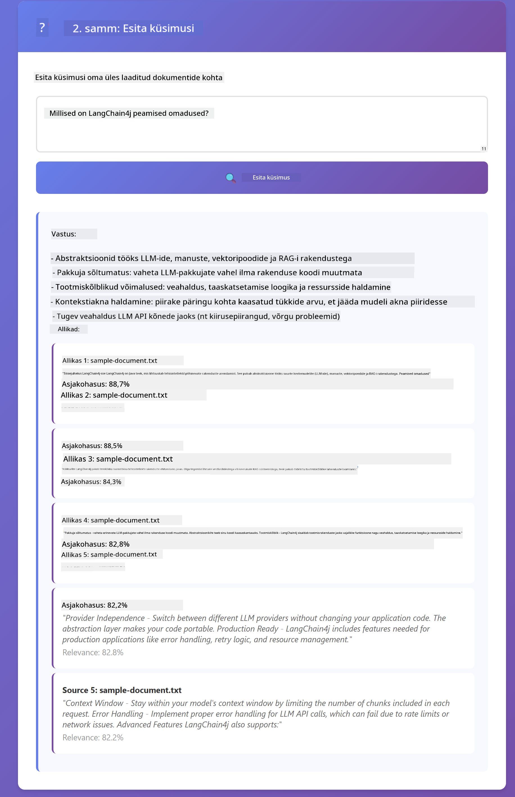

<!--
CO_OP_TRANSLATOR_METADATA:
{
  "original_hash": "f538a51cfd13147d40d84e936a0f485c",
  "translation_date": "2025-12-13T17:27:52+00:00",
  "source_file": "03-rag/README.md",
  "language_code": "et"
}
-->
# Moodul 03: RAG (otsingupõhine genereerimine)

## Sisukord

- [Mida sa õpid](../../../03-rag)
- [Eeltingimused](../../../03-rag)
- [RAG mõistmine](../../../03-rag)
- [Kuidas see töötab](../../../03-rag)
  - [Dokumendi töötlemine](../../../03-rag)
  - [Embedimiste loomine](../../../03-rag)
  - [Semantiline otsing](../../../03-rag)
  - [Vastuste genereerimine](../../../03-rag)
- [Rakenduse käivitamine](../../../03-rag)
- [Rakenduse kasutamine](../../../03-rag)
  - [Dokumendi üleslaadimine](../../../03-rag)
  - [Küsimuste esitamine](../../../03-rag)
  - [Allikaviidete kontrollimine](../../../03-rag)
  - [Küsimustega katsetamine](../../../03-rag)
- [Põhimõisted](../../../03-rag)
  - [Tükeldamisstrateegia](../../../03-rag)
  - [Sarnasuse skoorid](../../../03-rag)
  - [Mälusalvestus](../../../03-rag)
  - [Kontekstivaatakuhalduse](../../../03-rag)
- [Millal RAG on oluline](../../../03-rag)
- [Järgmised sammud](../../../03-rag)

## Mida sa õpid

Eelnevates moodulites õppisid, kuidas AI-ga vestelda ja oma päringuid tõhusalt struktureerida. Kuid on üks põhiline piirang: keelemudelid teavad ainult seda, mida nad on koolituse käigus õppinud. Nad ei saa vastata küsimustele sinu ettevõtte poliitikate, projektdokumentatsiooni või muu teabe kohta, mida neile ei ole õpetatud.

RAG (otsingupõhine genereerimine) lahendab selle probleemi. Selle asemel, et proovida mudelit sinu infole õpetada (mis on kallis ja ebapraktiline), annad mudelile võimaluse otsida sinu dokumentide seast. Kui keegi esitab küsimuse, leiab süsteem asjakohase info ja lisab selle päringusse. Mudel vastab seejärel selle leitud konteksti põhjal.

Mõtle RAG-ile kui mudelile viiteraamatukogule. Kui sa küsid küsimuse, teeb süsteem järgmist:

1. **Kasutaja päring** - Sa esitad küsimuse  
2. **Embedimine** - Muudab su küsimuse vektoriks  
3. **Vektorotsing** - Leiab sarnased dokumenditükid  
4. **Konteksti kokkupanek** - Lisab asjakohased tükid päringusse  
5. **Vastus** - LLM genereerib vastuse konteksti põhjal  

See seob mudeli vastused sinu tegelike andmetega, selle asemel et tugineda ainult koolitusandmetele või väljamõeldud vastustele.


*RAG töövoog – kasutaja päringust semantilise otsinguni ja kontekstipõhise vastuse genereerimiseni*

## Eeltingimused

- Moodul 01 lõpetatud (Azure OpenAI ressursid juurutatud)  
- `.env` fail juurkataloogis Azure volitustega (loodud `azd up` käivitamisel Moodulis 01)  

> **Märkus:** Kui sa pole Moodulit 01 lõpetanud, järgi esmalt seal olevaid juurutusjuhiseid.

## Kuidas see töötab

**Dokumendi töötlemine** - [DocumentService.java](../../../03-rag/src/main/java/com/example/langchain4j/rag/service/DocumentService.java)

Kui sa laadid dokumendi üles, jagab süsteem selle väiksemateks tükkideks – väiksemateks osadeks, mis mahuvad mugavalt mudeli kontekstivaatakusse. Need tükid kattuvad veidi, et sa ei kaotaks konteksti servades.

```java
Document document = FileSystemDocumentLoader.loadDocument("sample-document.txt");

DocumentSplitter splitter = DocumentSplitters
    .recursive(300, 30, new OpenAiTokenizer());

List<TextSegment> segments = splitter.split(document);
```
  
> **🤖 Proovi [GitHub Copilot](https://github.com/features/copilot) Chatiga:** Ava [`DocumentService.java`](../../../03-rag/src/main/java/com/example/langchain4j/rag/service/DocumentService.java) ja küsi:  
> - "Kuidas LangChain4j jagab dokumendid tükkideks ja miks on kattumine oluline?"  
> - "Mis on optimaalne tüki suurus erinevate dokumentide jaoks ja miks?"  
> - "Kuidas käsitleda dokumente mitmes keeles või eriformaadis?"

**Embedimiste loomine** - [LangChainRagConfig.java](../../../03-rag/src/main/java/com/example/langchain4j/rag/config/LangChainRagConfig.java)

Iga tükk muudetakse numbriliseks esinduseks, mida nimetatakse embedimiseks – põhimõtteliselt matemaatiliseks sõrmejäljeks, mis haarab teksti tähenduse. Sarnane tekst annab sarnased embedimised.

```java
@Bean
public EmbeddingModel embeddingModel() {
    return OpenAiOfficialEmbeddingModel.builder()
        .baseUrl(azureOpenAiEndpoint)
        .apiKey(azureOpenAiKey)
        .modelName(azureEmbeddingDeploymentName)
        .build();
}

EmbeddingStore<TextSegment> embeddingStore = 
    new InMemoryEmbeddingStore<>();
```
  


*Dokumendid esindatud vektoritena embedimisruumis – sarnane sisu koondub kokku*

**Semantiline otsing** - [RagService.java](../../../03-rag/src/main/java/com/example/langchain4j/rag/service/RagService.java)

Kui sa esitad küsimuse, muudetakse ka see embedimiseks. Süsteem võrdleb su küsimuse embedimist kõigi dokumenditükkide embedimistega. Ta leiab tükid, mille tähendus on kõige sarnasem – mitte ainult märksõnade kattuvus, vaid tegelik semantiline sarnasus.

```java
Embedding queryEmbedding = embeddingModel.embed(question).content();

List<EmbeddingMatch<TextSegment>> matches = 
    embeddingStore.findRelevant(queryEmbedding, 5, 0.7);

for (EmbeddingMatch<TextSegment> match : matches) {
    String relevantText = match.embedded().text();
    double score = match.score();
}
```
  
> **🤖 Proovi [GitHub Copilot](https://github.com/features/copilot) Chatiga:** Ava [`RagService.java`](../../../03-rag/src/main/java/com/example/langchain4j/rag/service/RagService.java) ja küsi:  
> - "Kuidas töötab sarnasuse otsing embedimistega ja mis määrab skoori?"  
> - "Millist sarnasuse läve peaksin kasutama ja kuidas see tulemusi mõjutab?"  
> - "Kuidas käituda olukordades, kus asjakohaseid dokumente ei leita?"

**Vastuste genereerimine** - [RagService.java](../../../03-rag/src/main/java/com/example/langchain4j/rag/service/RagService.java)

Kõige asjakohasemad tükid lisatakse mudeli päringusse. Mudel loeb need konkreetsed tükid läbi ja vastab su küsimusele selle info põhjal. See takistab hallutsinatsioone – mudel saab vastata ainult sellele, mis tal ees on.

## Rakenduse käivitamine

**Kontrolli juurutust:**

Veendu, et `.env` fail on juurkataloogis Azure volitustega (loodud Moodulis 01):  
```bash
cat ../.env  # Peaks näitama AZURE_OPENAI_ENDPOINT, API_KEY, DEPLOYMENT
```
  
**Käivita rakendus:**

> **Märkus:** Kui sa juba käivitasid kõik rakendused käsuga `./start-all.sh` Moodulis 01, siis see moodul töötab juba pordil 8081. Võid allolevad käivituskäsud vahele jätta ja minna otse aadressile http://localhost:8081.

**Variant 1: Spring Boot Dashboardi kasutamine (soovitatav VS Code kasutajatele)**

Arenduskonteiner sisaldab Spring Boot Dashboard laiendust, mis pakub visuaalset liidest kõigi Spring Boot rakenduste haldamiseks. Leiad selle VS Code vasakpoolsest tegevusribast (otsi Spring Boot ikooni).

Spring Boot Dashboardist saad:  
- Näha kõiki tööruumis olevaid Spring Boot rakendusi  
- Käivitada/peatada rakendusi ühe klikiga  
- Vaadata rakenduste logisid reaalajas  
- Jälgida rakenduste olekut  

Lihtsalt klõpsa "rag" kõrval olevale käivitusnupule, et käivitada see moodul, või käivita korraga kõik moodulid.


**Variant 2: Shell-skriptide kasutamine**

Käivita kõik veebirakendused (moodulid 01-04):

**Bash:**  
```bash
cd ..  # Juurekataloogist
./start-all.sh
```
  
**PowerShell:**  
```powershell
cd ..  # Juurekataloogist
.\start-all.ps1
```
  
Või käivita ainult see moodul:

**Bash:**  
```bash
cd 03-rag
./start.sh
```
  
**PowerShell:**  
```powershell
cd 03-rag
.\start.ps1
```
  
Mõlemad skriptid laadivad automaatselt keskkonnamuutujad juurkataloogis olevast `.env` failist ja ehitavad JAR-failid, kui neid veel pole.

> **Märkus:** Kui soovid enne käivitamist kõik moodulid käsitsi ehitada:  
>  
> **Bash:**  
> ```bash
> cd ..  # Go to root directory
> mvn clean package -DskipTests
> ```
  
> **PowerShell:**  
> ```powershell
> cd ..  # Go to root directory
> mvn clean package -DskipTests
> ```
  
Ava brauseris http://localhost:8081.

**Peatamiseks:**

**Bash:**  
```bash
./stop.sh  # Ainult see moodul
# Või
cd .. && ./stop-all.sh  # Kõik moodulid
```
  
**PowerShell:**  
```powershell
.\stop.ps1  # Ainult see moodul
# Või
cd ..; .\stop-all.ps1  # Kõik moodulid
```


## Rakenduse kasutamine

Rakendus pakub veebiliidest dokumentide üleslaadimiseks ja küsimuste esitamiseks.

<a href="images/rag-homepage.png"></a>

*RAG rakenduse liides – laadi üles dokumendid ja esita küsimusi*

**Dokumendi üleslaadimine**

Alusta dokumendi üleslaadimisega – testimiseks sobivad kõige paremini TXT-failid. Selles kataloogis on olemas `sample-document.txt`, mis sisaldab infot LangChain4j funktsioonide, RAG rakenduse ja parimate tavade kohta – ideaalne süsteemi testimiseks.

Süsteem töötleb su dokumendi, jagab selle tükkideks ja loob iga tüki jaoks embedimised. See toimub automaatselt pärast üleslaadimist.

**Küsimuste esitamine**

Nüüd esita konkreetseid küsimusi dokumendi sisu kohta. Proovi midagi faktilist, mis on dokumendis selgelt välja toodud. Süsteem otsib asjakohaseid tükke, lisab need päringusse ja genereerib vastuse.

**Allikaviidete kontrollimine**

Pane tähele, et iga vastus sisaldab allikaviiteid koos sarnasuse skooridega. Need skoorid (0 kuni 1) näitavad, kui asjakohane iga tükk su küsimusega oli. Kõrgemad skoorid tähendavad paremaid vasteid. See võimaldab sul vastust allikmaterjali vastu kontrollida.

<a href="images/rag-query-results.png"></a>

*Päringu tulemused, mis näitavad vastust koos allikaviidete ja asjakohasuse skooridega*

**Küsimustega katsetamine**

Proovi erinevat tüüpi küsimusi:  
- Konkreetsed faktid: "Mis on peamine teema?"  
- Võrdlused: "Mis vahe on X ja Y vahel?"  
- Kokkuvõtted: "Kokkuvõtte peamised punktid Z kohta"  

Vaata, kuidas asjakohasuse skoorid muutuvad sõltuvalt sellest, kui hästi su küsimus dokumendi sisuga kattub.

## Põhimõisted

**Tükeldamisstrateegia**

Dokumendid jagatakse 300-tokenilisteks tükkideks, millel on 30 tokeni kattuvus. See tasakaal tagab, et igal tükil on piisavalt konteksti, et olla tähenduslik, samas jäädes piisavalt väikseks, et päringusse mahutada mitu tükki.

**Sarnasuse skoorid**

Skoorid jäävad vahemikku 0 kuni 1:  
- 0.7-1.0: Väga asjakohane, täpne vaste  
- 0.5-0.7: Asjakohane, hea kontekst  
- Alla 0.5: Filtreeritud välja, liiga erinev  

Süsteem toob ainult tükid, mis ületavad minimaalse läve, et tagada kvaliteet.

**Mälusalvestus**

See moodul kasutab lihtsuse huvides mälusalvestust. Kui sa rakenduse taaskäivitad, kaovad üleslaaditud dokumendid. Tootmissüsteemid kasutavad püsivaid vektorandmebaase nagu Qdrant või Azure AI Search.

**Kontekstivaatakuhalduse**

Igal mudelil on maksimaalne kontekstivaataku suurus. Sa ei saa lisada kõiki suuri dokumendi tükke. Süsteem toob välja N kõige asjakohasemat tükki (vaikimisi 5), et jääda piiridesse ja samal ajal pakkuda piisavalt konteksti täpsete vastuste jaoks.

## Millal RAG on oluline

**Kasuta RAG-i, kui:**  
- Vastad küsimustele omandis olevate dokumentide kohta  
- Info muutub tihti (poliitikad, hinnad, spetsifikatsioonid)  
- Täpsus nõuab allikaviidet  
- Sisu on liiga mahukas, et mahutada ühte päringusse  
- Vajad kontrollitavaid ja faktiliselt põhjendatud vastuseid  

**Ära kasuta RAG-i, kui:**  
- Küsimused nõuavad üldteadmisi, mis mudelil juba olemas on  
- Vajalik on reaalajas andmed (RAG töötab üleslaaditud dokumentidega)  
- Sisu on piisavalt väike, et lisada otse päringusse  

## Järgmised sammud

**Järgmine moodul:** [04-tools - AI agendid tööriistadega](../04-tools/README.md)

---

**Navigeerimine:** [← Eelmine: Moodul 02 - Päringu koostamine](../02-prompt-engineering/README.md) | [Tagasi avalehele](../README.md) | [Järgmine: Moodul 04 - Tööriistad →](../04-tools/README.md)

---

<!-- CO-OP TRANSLATOR DISCLAIMER START -->
**Vastutusest loobumine**:
See dokument on tõlgitud kasutades tehisintellektil põhinevat tõlketeenust [Co-op Translator](https://github.com/Azure/co-op-translator). Kuigi püüame tagada täpsust, palun arvestage, et automaatsed tõlked võivad sisaldada vigu või ebatäpsusi. Originaaldokument selle emakeeles tuleks pidada autoriteetseks allikaks. Olulise teabe puhul soovitatakse kasutada professionaalset inimtõlget. Me ei vastuta selle tõlke kasutamisest tulenevate arusaamatuste või valesti mõistmiste eest.
<!-- CO-OP TRANSLATOR DISCLAIMER END -->