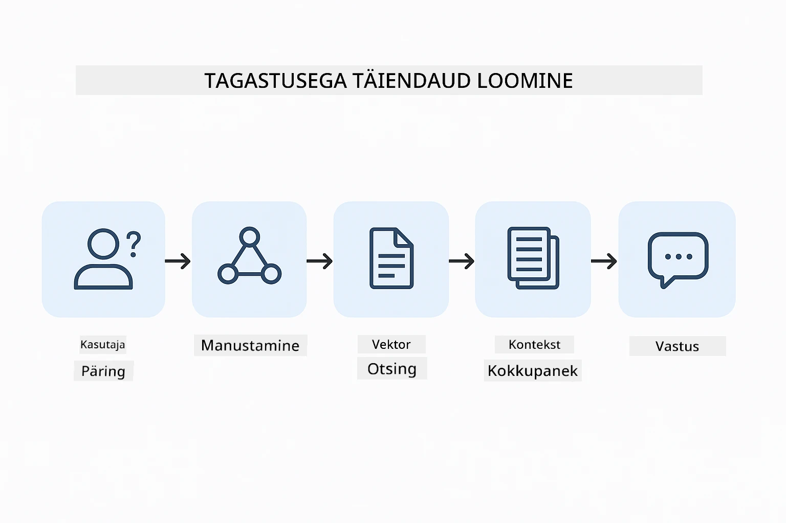
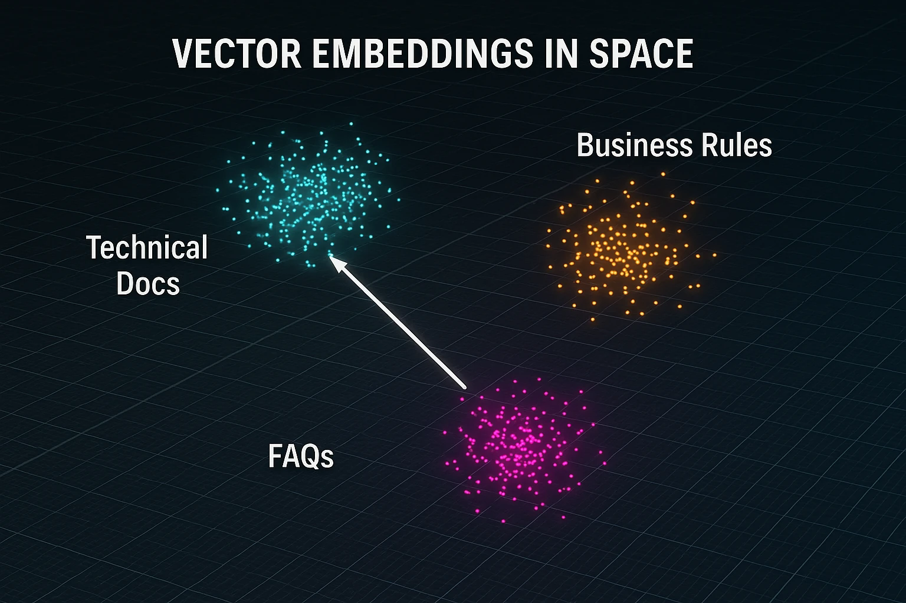
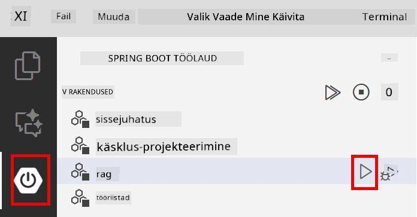
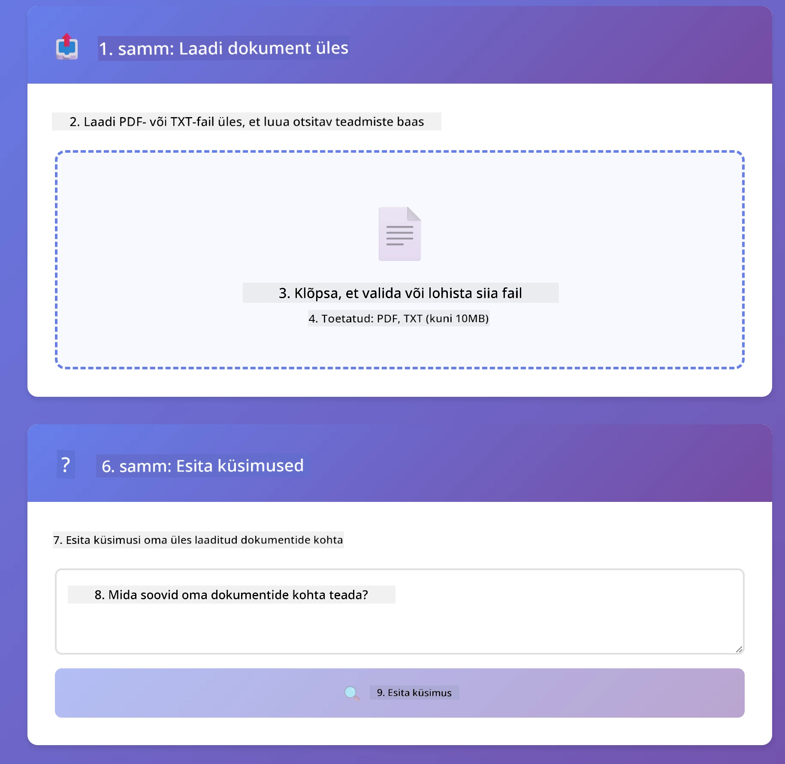
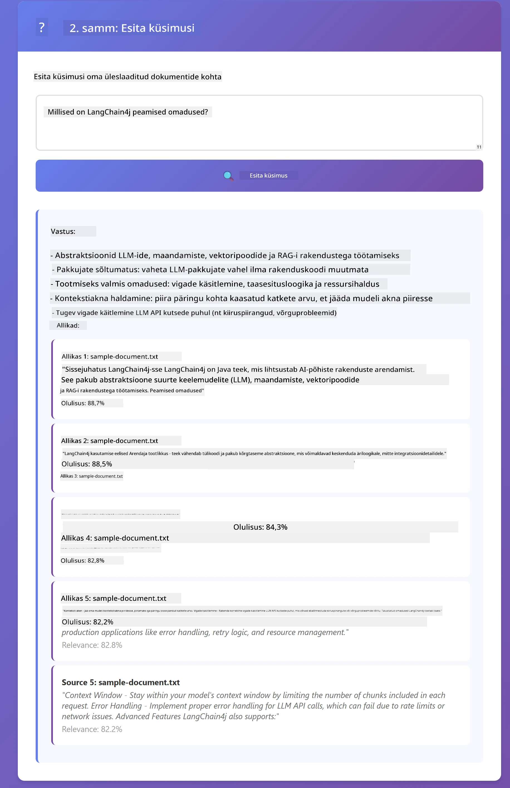

<!--
CO_OP_TRANSLATOR_METADATA:
{
  "original_hash": "81d087662fb3dd7b7124bce1a9c9ec86",
  "translation_date": "2026-01-06T02:00:14+00:00",
  "source_file": "03-rag/README.md",
  "language_code": "et"
}
-->
# Moodul 03: RAG (otsinguga täiustatud loomine)

## Sisukord

- [Mida Sa Õpid](../../../03-rag)
- [Eeltingimused](../../../03-rag)
- [RAG mõistmine](../../../03-rag)
- [Kuidas see töötab](../../../03-rag)
  - [Dokumendi töötlemine](../../../03-rag)
  - [Manuste loomine](../../../03-rag)
  - [Semeantiline otsing](../../../03-rag)
  - [Vastuse genereerimine](../../../03-rag)
- [Rakenduse käivitamine](../../../03-rag)
- [Rakenduse kasutamine](../../../03-rag)
  - [Dokumendi üleslaadimine](../../../03-rag)
  - [Küsimuste esitamine](../../../03-rag)
  - [Allikaviidete kontrollimine](../../../03-rag)
  - [Küsimustega katsetamine](../../../03-rag)
- [Põhikonseptsioonid](../../../03-rag)
  - [Tükkideks jagamise strateegia](../../../03-rag)
  - [Sarnasuse skoorid](../../../03-rag)
  - [Mälu-põhine hoiustamine](../../../03-rag)
  - [Kontekstiakna haldamine](../../../03-rag)
- [Millal RAG loeb](../../../03-rag)
- [Järgmised sammud](../../../03-rag)

## Mida Sa Õpid

Eelmistes moodulites õppisid, kuidas vestelda tehisintellektiga ja efektiivselt oma prompt’e struktureerida. Kuid on olemas põhiline piirang: keelemudelid teavad ainult seda, mida nad treeningu ajal õppisid. Nad ei saa vastata küsimustele sinu ettevõtte poliitikate, projektdokumentatsiooni ega muu info kohta, mida neile ei ole välja õpetatud.

RAG (otsinguga täiustatud loomine) lahendab selle probleemi. Selle asemel, et püüda mudelit sinu infoga õpetada (mis on kulukas ja ebapraktiline), annad mudelile võimaluse sirvida sinu dokumente. Kui keegi küsib küsimust, leiab süsteem asjakohase info ja lisab selle prompti. Mudel vastab seejärel selle leitud konteksti põhjal.

Mõtle RAG’ile kui mudelile viiteraamatu andmisele. Kui sa küsid küsimust, teeb süsteem järgmist:

1. **Kasutaja päring** - Sa küsid küsimuse  
2. **Manustamine** - Muudab su küsimuse vektoriks  
3. **Vektoriotsing** - Leiab sarnased dokumendi tükid  
4. **Konteksti koostamine** - Lisab asjakohased tükid prompti  
5. **Vastus** - LLM genereerib vastuse leitud konteksti põhjal  

See maandab mudeli vastused sinu tegelike andmete peale, selle asemel, et tugineda ainult treeningteabele või väljamõeldud vastustele.



*RAG töövoog – kasutajapäringust semantilise otsingu ja kontekstipõhise vastuse genereerimiseni*

## Eeltingimused

- Moodul 01 on läbitud (Azure OpenAI ressursid on juurutatud)  
- Juurtaseme kataloogis on `.env` fail Azure autentimisandmetega (loodud käsklusega `azd up` Moodulis 01)

> **Märkus:** Kui sa pole läbinu Moodulit 01, järgi seal esmalt juurutamisjuhiseid.

## Kuidas see töötab

### Dokumendi töötlemine

[DocumentService.java](../../../03-rag/src/main/java/com/example/langchain4j/rag/service/DocumentService.java)

Kui sa uploadid dokumendi, jagab süsteem selle tükkideks – väiksemateks osadeks, mis mahuvad mugavalt mudeli kontekstiaknasse. Need tükid kattuvad natuke, et sa ei kaotaks konteksti servades.

```java
Document document = FileSystemDocumentLoader.loadDocument("sample-document.txt");

DocumentSplitter splitter = DocumentSplitters
    .recursive(300, 30, new OpenAiTokenizer());

List<TextSegment> segments = splitter.split(document);
```

> **🤖 Proovi [GitHub Copiloti](https://github.com/features/copilot) Chat-iga:** Ava [`DocumentService.java`](../../../03-rag/src/main/java/com/example/langchain4j/rag/service/DocumentService.java) ja küsi:  
> - "Kuidas jagab LangChain4j dokumendid tükkideks ja miks kattuvus on oluline?"  
> - "Mis on optimaalne tüki suurus erinevate dokumentide puhul ja miks?"  
> - "Kuidas käsitleda mitmekeelseid või eriformaatidega dokumente?"

### Manuste loomine

[LangChainRagConfig.java](../../../03-rag/src/main/java/com/example/langchain4j/rag/config/LangChainRagConfig.java)

Iga tükk muudetakse numbriliseks esitluseks, mida nimetatakse manuseks – põhimõtteliselt matemaatiliseks sõrmejäljeks, mis kajastab teksti tähendust. Sarnane tekst annab sarnased manused.

```java
@Bean
public EmbeddingModel embeddingModel() {
    return OpenAiOfficialEmbeddingModel.builder()
        .baseUrl(azureOpenAiEndpoint)
        .apiKey(azureOpenAiKey)
        .modelName(azureEmbeddingDeploymentName)
        .build();
}

EmbeddingStore<TextSegment> embeddingStore = 
    new InMemoryEmbeddingStore<>();
```



*Dokumendid esitatakse vektoritena manuste ruumis – sarnane sisu koguneb ühte gruppi*

### Semeantiline otsing

[RagService.java](../../../03-rag/src/main/java/com/example/langchain4j/rag/service/RagService.java)

Kui sa esitad küsimuse, muutub ka küsimus manuseks. Süsteem võrdleb sinu küsimuse manust kõigi dokumenditükkide manustega. Leidub tükkid, mille tähendus on kõige sarnasem – mitte ainult võõrsõnade kokkulangevus, vaid tegelik semantiline sarnasus.

```java
Embedding queryEmbedding = embeddingModel.embed(question).content();

List<EmbeddingMatch<TextSegment>> matches = 
    embeddingStore.findRelevant(queryEmbedding, 5, 0.7);

for (EmbeddingMatch<TextSegment> match : matches) {
    String relevantText = match.embedded().text();
    double score = match.score();
}
```

> **🤖 Proovi [GitHub Copiloti](https://github.com/features/copilot) Chat-iga:** Ava [`RagService.java`](../../../03-rag/src/main/java/com/example/langchain4j/rag/service/RagService.java) ja küsi:  
> - "Kuidas töötab sarnasuse otsing manuste alusel ja mis tingib skoori?"  
> - "Millist sarnasuse läve peaksin kasutama ja kuidas see tulemusi mõjutab?"  
> - "Kuidas toimida, kui sobivaid dokumente ei leita?"

### Vastuse genereerimine

[RagService.java](../../../03-rag/src/main/java/com/example/langchain4j/rag/service/RagService.java)

Kõige asjakohasemad tükid lisatakse mudeli prompti. Mudel loeb need konkreetsed tükid ja vastab su küsimusele selle põhjal. See väldib "hallutsineerimist" – mudel saab vastata ainult sellele, mis tal ees on.

## Rakenduse käivitamine

**Kontrolli juurutust:**

Veendu, et juurtaseme kataloogis on `.env` fail koos Azure autentimisandmetega (loodud Moodulis 01):
```bash
cat ../.env  # Peaks näitama AZURE_OPENAI_ENDPOINT, API_KEY, DEPLOYMENT
```

**Käivita rakendus:**

> **Märkus:** Kui oled juba kõik rakendused käivitanud käsuga `./start-all.sh` Moodulis 01, töötab see moodul juba pordil 8081. Võid alljärgnevad käivituskäsud vahele jätta ja minna otse aadressile http://localhost:8081.

**Variant 1: Spring Boot Dashboard’i kasutamine (soovitatav VS Code kasutajatele)**

Dev konteiner sisaldab Spring Boot Dashboardi laiendust, mis annab visuaalse liidese kõigi Spring Boot rakenduste haldamiseks. Leiad selle VS Code’i vasakpoolsest Activity Barist (otsi Spring Boot ikooni).

Dashboardist saad:  
- Vaadata kõiki töölaua Spring Boot rakendusi  
- Käivitada või peatada rakendusi ühe klikiga  
- Vaadata reaalajas rakenduse logisid  
- Jälgida rakenduse olekut

Lihtsalt klõpsa nupule "rag" kõrval, et käivitada see moodul, või käivita korraga kõik moodulid.



**Variant 2: Shell skriptide kasutamine**

Käivita kõik veebirakendused (moodulid 01-04):

**Bash:**
```bash
cd ..  # Juuretõenäolisest kataloogist
./start-all.sh
```

**PowerShell:**
```powershell
cd ..  # Juure kataloogist
.\start-all.ps1
```

Või käivita ainult see moodul:

**Bash:**
```bash
cd 03-rag
./start.sh
```

**PowerShell:**
```powershell
cd 03-rag
.\start.ps1
```

Mõlemad skriptid laadivad automaatselt keskkonnamuutujad juurtaseme `.env` failist ja ehitavad JAR-failid, kui neid veel pole.

> **Märkus:** Kui soovid kõik moodulid enne käsitsi ehitada:  
>  
> **Bash:**  
> ```bash
> cd ..  # Go to root directory
> mvn clean package -DskipTests
> ```
  
> **PowerShell:**  
> ```powershell
> cd ..  # Go to root directory
> mvn clean package -DskipTests
> ```
  
Ava oma brauseris http://localhost:8081.

**Peatamiseks:**

**Bash:**  
```bash
./stop.sh  # Ainult see moodul
# Või
cd .. && ./stop-all.sh  # Kõik moodulid
```
  
**PowerShell:**  
```powershell
.\stop.ps1  # Ainult see moodul
# Või
cd ..; .\stop-all.ps1  # Kõik moodulid
```


## Rakenduse kasutamine

Rakendus pakub veebiliidest dokumentide üleslaadimiseks ja küsimuste esitamiseks.

<a href="images/rag-homepage.png"></a>

*RAG rakenduse liides – laadi üles dokumendid ja esita küsimusi*

### Dokumendi üleslaadimine

Alusta dokumendi üleslaadimisest – TXT-failid sobivad testimiseks kõige paremini. Selles kataloogis on `sample-document.txt`, mis sisaldab infot LangChain4j funktsioonide, RAG rakenduse ja parimate tavade kohta – ideaalne süsteemi testimiseks.

Süsteem töötleb su dokumendi, lõikab selle tükkideks ja loob iga tuki kohta manused. See toimub automaatselt pärast küll üleslaadimist.

### Küsimuste esitamine

Esita nüüd dokumendi sisu kohta spetsiifilisi küsimusi. Proovi midagi faktipõhist, mis on dokumendis selgelt kirjas. Süsteem otsib asjakohaseid tükke, lisab need prompti ja genereerib vastuse.

### Allikaviidete kontrollimine

Pane tähele, et iga vastus sisaldab allikaviiteid koos sarnasuse skooridega. Need skoorid (0 kuni 1) näitavad, kui palju see tükk sinu küsimusega haakus. Kõrgemad skoorid tähendavad paremaid vasteid. See võimaldab sul vastuseid allikmaterjaliga kontrollida.

<a href="images/rag-query-results.png"></a>

*Päringu tulemused: vastus koos allikaviidete ja asjakohasuse skooridega*

### Küsimustega katsetamine

Proovi erinevat tüüpi küsimusi:  
- Spetsiifilised faktid: "Mis on peamine teema?"  
- Võrdlused: "Mis vahe on X-l ja Y-l?"  
- Kokkuvõtted: "Kokkuvõtlik võtmeaspektid Z kohta"

Vaata, kuidas asjakohasuse skoorid muutuvad sõltuvalt sellest, kui hästi su küsimus dokumendisisuga sobib.

## Põhikonseptsioonid

### Tükkideks jagamise strateegia

Dokumendid jagatakse 300-sõnalisteks tükkideks, millel on 30 sõna kattuvust. See tasakaal tagab, et igal tükil on piisavalt konteksti, et see oleks mõtestatud, samas jäädes piisavalt väikseks, et prompti mahutada mitu tükki.

### Sarnasuse skoorid

Skoorid on vahemikus 0 kuni 1:  
- 0.7–1.0: Täiesti asjakohane, täpne vaste  
- 0.5–0.7: Asjakohane, hea kontekst  
- Alla 0.5: Filtreeritud välja, liiga erinev  

Süsteem toob välja ainult need tükid, mis ületavad minimaalse läve, et tagada kvaliteet.

### Mälu-põhine hoiustamine

See moodul kasutab lihtsuse huvides mälus hoiustamist. Rakenduse taaskäivitamisel kaovad üleslaaditud dokumendid. Tootmissüsteemides kasutatakse püsivaid vektorandmebaase nagu Qdrant või Azure AI Search.

### Kontekstiakna haldamine

Igal mudelil on maksimaalne kontekstiakna suurus. Suurest dokumendist ei saa kõiki tükke üheaegselt lisada. Süsteem võtab kõige asjakohasemad N tükki (vaikimisi 5), et jääda piiridesse, pakkudes samas piisavalt konteksti täpsete vastuste jaoks.

## Millal RAG loeb

**Kasuta RAG’i, kui:**  
- Vastad küsimustele era- või konfidentsiaalsete dokumentide kohta  
- Informatsioon muutub sageli (poliitikad, hinnad, spetsifikatsioonid)  
- Täpsus vajab allikaviitamist  
- Sisu on liiga suur, et mahtuda ühe prompti sisse  
- Vajad kontrollitavaid ja põhjendatud vastuseid

**Ära kasuta RAG’i, kui:**  
- Küsimused nõuavad üldteadmisi, mis mudelil juba on  
- Vajalik on reaalajas info (RAG töötab üleslaaditud dokumentidega)  
- Sisu on piisavalt väike, et lisada otse prompti

## Järgmised sammud

**Järgmine moodul:** [04-tööriistad - AI agentide tööriistad](../04-tools/README.md)

---

**Navigatsioon:** [← Eelmine: Moodul 02 - Promptide inseneriteadus](../02-prompt-engineering/README.md) | [Tagasi põhilehele](../README.md) | [Järgmine: Moodul 04 - Tööriistad →](../04-tools/README.md)

---

<!-- CO-OP TRANSLATOR DISCLAIMER START -->
**Erliritus**:
See dokument on tõlgitud kasutades tehisintellektil põhinevat tõlketeenust [Co-op Translator](https://github.com/Azure/co-op-translator). Kuigi püüame täpsust, võivad automaatsed tõlked sisaldada vigu või ebatäpsusi. Originaaldokument selle emakeeles tuleks pidada ametlikuks allikaks. Kriitilise teabe puhul soovitatakse kasutada professionaalset inimtõlget. Me ei vastuta tõlke kasutamisest tingitud võimalike arusaamatuste või valesti mõistmiste eest.
<!-- CO-OP TRANSLATOR DISCLAIMER END -->