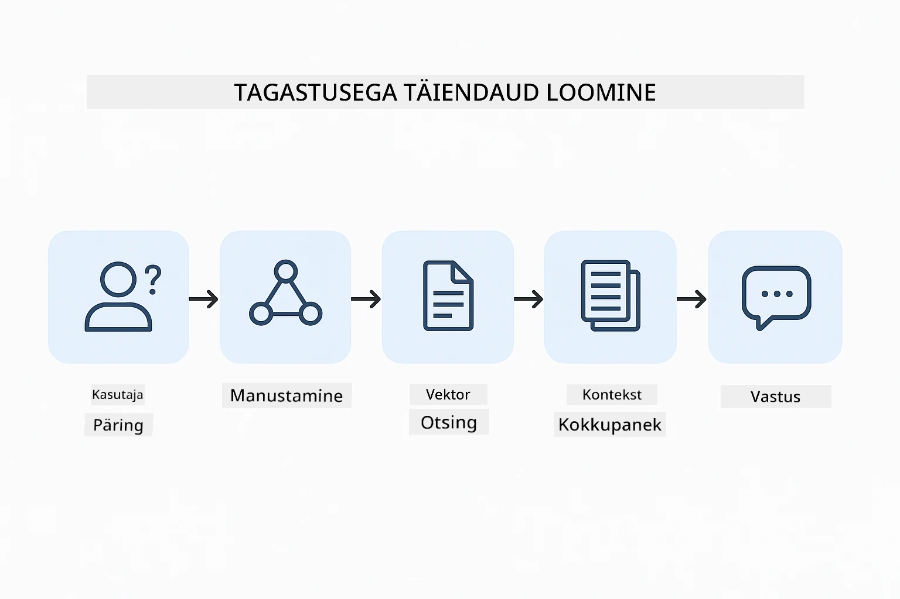
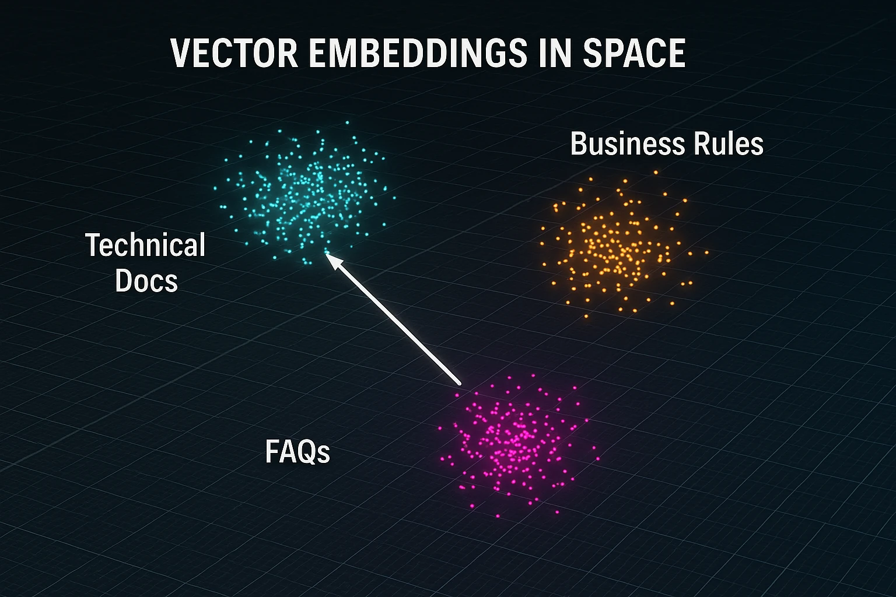
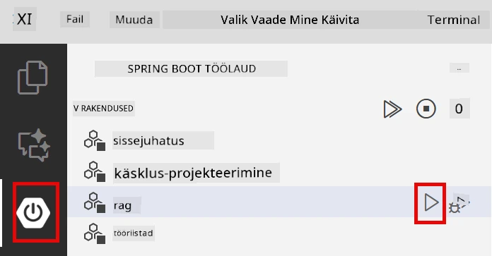
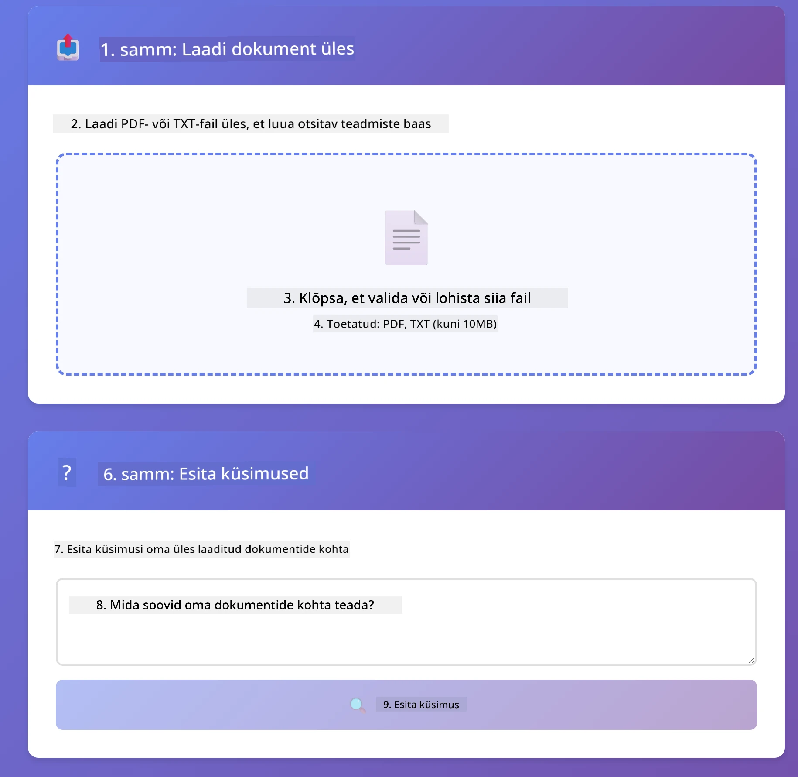
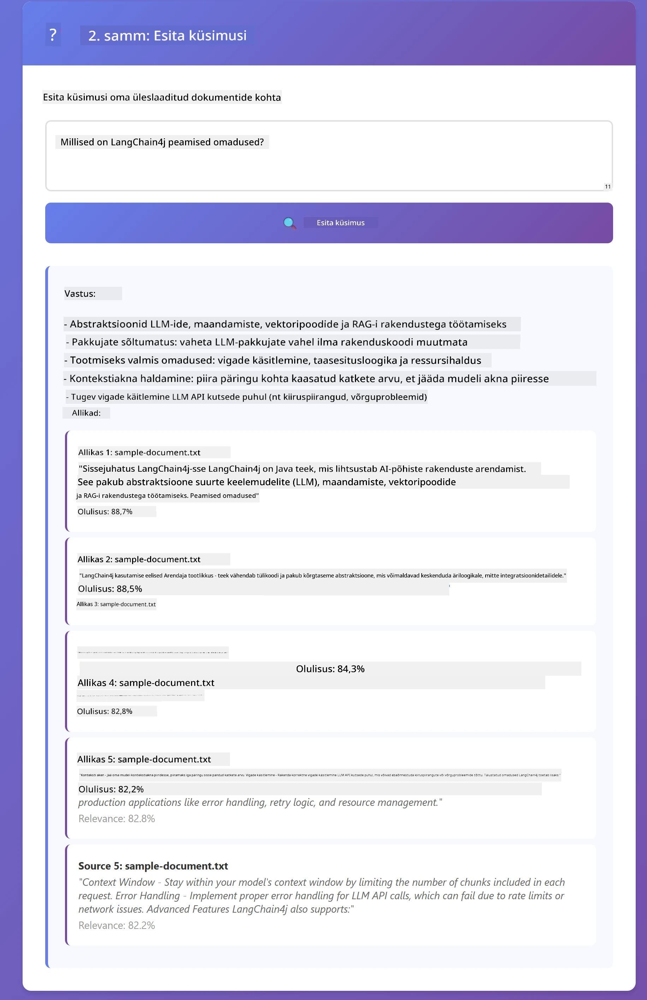

# Moodul 03: RAG (otsingupõhine genereerimine)

## Sisukord

- [Videojuhend](#videojuhend)
- [Mida Sa Õpid](#mida-sa-õpid)
- [Eelnõuded](#eelnõuded)
- [RAG mõistmine](#rag-mõistmine)
  - [Millist RAG lähenemist see juhend kasutab?](#millist-rag-lähenemist-see-juhend-kasutab)
- [Kuidas see töötab](#kuidas-see-töötab)
  - [Dokumendi töötlemine](#dokumendi-töötlemine)
  - [Sissejuhatuste loomine](#sissejuhatuste-loomine)
  - [Semantiline otsing](#semantiline-otsing)
  - [Vastuse genereerimine](#vastuse-loomine)
- [Rakenduse käivitamine](#rakenduse-käivitamine)
- [Rakenduse kasutamine](#rakenduse-kasutamine)
  - [Dokumendi üleslaadimine](#dokumendi-üleslaadimine)
  - [Küsimuste esitamne](#küsi-küsimusi)
  - [Allikaviidete kontrollimine](#kontrolli-allikaviiteid)
  - [Katsetamine küsimustega](#katseta-küsimustega)
- [Põhikontseptsioonid](#olulised-mõisted)
  - [Tükkideks jagamise strateegia](#lõikude-strateegia)
  - [Sarnasuse skoorid](#sarnasusskoorid)
  - [Mälusalvestus](#mälupõhine-salvestus)
  - [Kontekstiakna haldamine](#konteksti-akna-haldamine)
- [Millal RAG on oluline](#millal-rag-on-oluline)
- [Järgmised sammud](#järgmised-sammud)

## Videojuhend

Vaata seda reaalajas sessiooni, mis selgitab, kuidas selle mooduli alustamiseks:

<a href="https://www.youtube.com/watch?v=_olq75ZH_eY"></a>

## Mida Sa Õpid

Eelnevates moodulites õppisid, kuidas suhelda tehisintellektiga ja struktureerida oma juhiseid efektiivselt. Kuid on üks põhimõtteline piirang: keelemudelid teavad vaid seda, mida nad treeningu ajal õppisid. Nad ei saa vastata küsimustele sinu ettevõtte poliitikate, projekti dokumentatsiooni või muu teabe kohta, mida neile treenimisel ei sisestatud.

RAG (otsingupõhine genereerimine) lahendab selle probleemi. Selle asemel, et püüda mudelile sinu infot õpetada (mis on kallis ja ebaratsionaalne), annad talle võime otsida sinu dokumentidest. Kui keegi esitab mingi küsimuse, leiab süsteem asjakohase info ja lisab selle juhise hulka. Seejärel mudel vastab selle toomise baasil.

Mõtle RAG-ile kui viidete raamatukogule mudelile. Kui esitad küsimuse, teeb süsteem järgmised sammud:

1. **Kasutaja päring** - Sa esitad küsimuse
2. **Embedding** - Konverteerib sinu küsimuse vektoriks
3. **Vektorotsing** - Leiab sarnase dokumendi tükid
4. **Konteksti kokkupanek** - Lisab asjakohased tükid juhisesse
5. **Vastus** - LLM genereerib vastuse konteksti põhjal

See annab mudeli vastustele kindla baasi sinu tegelikest andmetest, mitte ei tugine üksnes treeningteadmistel ega improviseeri vastuseid.

## Eelnõuded

- Lõpetatud [Moodul 01 - Sissejuhatus](../01-introduction/README.md) (Azure OpenAI ressursid paigaldatud, sh `text-embedding-3-small` embedimismudel)
- `.env` fail juurkataloogis koos Azure volitustega (loodud käsuga `azd up` Moodulis 01)

> **Märkus:** Kui sa ei ole lõpetanud Moodulit 01, järgi sealset paigaldusjuhendit esmalt. Käsk `azd up` paigaldab nii GPT vestlusmudeli kui ka selle mooduli embedimismudeli.

## RAG mõistmine

Joonis allpool illustreerib põhikontseptsiooni: RAG ei tugine üksnes mudeli treeningandmetele, vaid annab talle ligipääsu sinu dokumentide raamatukogule enne iga vastuse genereerimist.


*Selles joonises näidatakse erinevust tavalise LLM vahel (mis oletab treeningandmete põhjal) ja RAG-ga tugevdatu vahel (mis esmalt kontrollib ära sinu dokumendid).*

Siin on sammud ükshaaval lõpp-punktini. Kasutaja küsimus liigub läbi nelja etapi — embedding, vektorotsingu, konteksti kokkupaneku ja vastuse genereerimise — igaüks tugineb eelnevale:



*Selles joonises on RAG töövool lõpp-punktini — kasutaja päring läbib embeddingu, vektorotsingu, konteksti kokku paneku ja vastuse genereerimise.*

Järgmised sektsioonid käivad läbi iga etapi, koos koodiga, mida saad käivitada ja muuta.

### Millist RAG lähenemist see juhend kasutab?

LangChain4j pakub kolme RAG rakendamist, igaüks erineval abstraktsioonitasemel. Joonis allpool võrdleb neid kõrvuti:


*Selles joonises on kolm LangChain4j RAG lähenemist — Easy, Native ja Advanced — ning näidatakse nende põhikomponente ja kasutamise olukordi.*

| Lähenemine | Mida See Teeb | Kompromiss |
|---|---|---|
| **Easy RAG** | Sidub kõik automaatselt läbi `AiServices` ja `ContentRetriever`. Sa märgistad liidese, lisad retriiveri ning LangChain4j haldab embedimist, otsingut ja käsu koostamist taga. | Vähe koodi, kuid sa ei näe, mis toimub igas sammus. |
| **Native RAG** | Sa kutsud embedimismudeli, otsid andmebaasist, koostad käsu ja genereerid vastuse ise — samm-sammult. | Rohkem koodi, kuid iga etapp on nähtav ja muudetav. |
| **Advanced RAG** | Kasutab `RetrievalAugmentor` raamistikku koos vahetatavate päringu muundurite, marsruuterite, ümberhinnangute ja sisendite lisajatega tootmiskvaliteediga torujuhtmete jaoks. | Maksimaalne paindlikkus, kuid palju keerulisem. |

**See juhend kasutab Native lähenemist.** Iga RAG torujuhtme samm — päringu embedimine, vektoripoest otsimine, konteksti kogumine ja vastuse genereerimine — on selgelt lahti kirjutatud [`RagService.java`](../../../03-rag/src/main/java/com/example/langchain4j/rag/service/RagService.java). See on teadlik valik: õppematerjalina on olulisem, et sa näeksid ja mõistaksid iga etappi, kui et kood oleks minimaalselt kirjutatud. Kui oled igas etapis mugav, võid üle minna Easy RAG-le kiireteks prototüüpideks või Advanced RAG-le tootmissüsteemide jaoks.

> **💡 Huvitatud Easy RAG-st?** LangChain4j pakub ka *Easy RAG* lähenemist, kus `AiServices` ja `ContentRetriever` haldavad embedimist, otsingut ja käsu koostamist automaatselt. See moodul kasutab selgemat teed — avab selle torujuhtme iga etapi, et sa näeksid ja kontrolliksid seda ise.

Joonis allpool näitab Easy RAG torujuhet. Märka, kuidas `AiServices` ja `EmbeddingStoreContentRetriever` varjavad kogu keerukust — sa laed dokumendi, lisad retriiveri ja saad vastused. Native lähenemine selles moodulis avab kõik need varjatud sammud:


*Selles joonises on Easy RAG torujuht. Võrdle seda Native lähenemisega selles moodulis: Easy RAG varjab embedimist, otsingut ja käsu koostamist `AiServices` ja `ContentRetriever` taga — sa laed dokumendi, lülitad retriiveri sisse ja saad vastused. Native lähenemine selles moodulis avab kogu torujuhtme, nii et sa kutsud iga etappi ise (embed, otsing, konteksti koostamine, genereerimine), pakkudes täisvaatlust ja kontrolli.*

## Kuidas see töötab

Selles moodulis jaguneb RAG torujuhe neljaks etapiks, mis käivad kasutaja iga küsimuse korral järjestikku läbi. Esmalt eelnevalt üles laetud dokument on **parsitakse ja tükkideks jagatud**, väiksemateks osadeks, mis mahuvad mugavalt mudeli kontekstiaknasse. Need tükid teisendatakse **vektoriteks** ehk embedimisteks ja säilitatakse, et neid saab matemaatiliselt võrrelda. Kui päring jõuab kohale, toimub **semantiline otsing**, et leida kõige asjakohasemad tükid. Lõpuks antakse need kontekstina LLM-ile vastuse genereerimiseks. Järgnevad osad selgitavad iga etappi koos reaalse koodi ja joonistega. Vaatame esimese sammu.

### Dokumendi töötlemine

[DocumentService.java](../../../03-rag/src/main/java/com/example/langchain4j/rag/service/DocumentService.java)

Kui sa laed dokumendi üles, süsteem parsib selle (PDF või tavatekst), lisab metadata nagu failinimi ja jagab selle tükkideks — väiksemateks osadeks, mis mahuvad mudeli konteksti aknasse. Need tükid kattuvad osaliselt, et sa ei kaotaks konteksti servades.

```java
// Töötle üleslaaditud fail ja paki see LangChain4j dokumendiks
Document document = Document.from(content, metadata);

// Jaga 300 tokeni kaupa tükkideks, mis kattuvad 30 tokeniga
DocumentSplitter splitter = DocumentSplitters
    .recursive(300, 30);

List<TextSegment> segments = splitter.split(document);
```
  
Joonis allpool näitab seda visuaalselt. Märka, kuidas iga tükk jagab mõningaid tokeneid oma naabritega — 30-tokeniline kattumine tagab, et oluline kontekst ei kaotsi:


*Selles joonises näidatakse dokumenti, mis on jagatud 300 tokeni pikkusteks tükikesteks 30 tokeni kattumisega, säilitades konteksti tükkide servades.*

> **🤖 Proovi [GitHub Copilot](https://github.com/features/copilot) Chati abil:** Ava [`DocumentService.java`](../../../03-rag/src/main/java/com/example/langchain4j/rag/service/DocumentService.java) ja küsi:  
> - "Kuidas LangChain4j jagab dokumendid tükkideks ja miks kattumine on oluline?"  
> - "Mis on optimaalne tüki suurus erinevate dokumentide jaoks ja miks?"  
> - "Kuidas käsitleda dokumente mitmes keeles või erilise vormindusega?"

### Sissejuhatuste loomine

[LangChainRagConfig.java](../../../03-rag/src/main/java/com/example/langchain4j/rag/config/LangChainRagConfig.java)

Iga tükk teisendatakse numbriliseks esinduseks, mida nimetatakse embeddinguks — sisuliselt tähenduse ja numbrite konvertoriks. Embedimismudel pole "intelligentne" nagu vestlusmudel; ta ei suuda järgida juhiseid, arutleda ega vastata küsimustele. Mida ta teeb, on tekstide kaardistamine matemaatilisse ruumi, kus sarnased tähendused paiknevad üksteisele lähedal — näiteks "auto" ja "sõiduauto" on lähestikku, "tagasimakse poliitika" on lähedane "raha tagastamisele". Mõtle vestlusmudelit kui sõpra, kellega saab rääkida; embedimismudel on väga hea arhiveerimissüsteem.

Joonis allpool visualiseerib seda kontseptsiooni — tekst sisse, numbrilised vektorid välja, ja sarnased tähendused tekitavad lähedalolevad vektorid:


*Selles joonises on näidatud, kuidas embedimismudel konverteerib teksti numbrilisteks vektoriteks, pannes sarnased tähendused nagu "auto" ja "sõiduauto" vektoriruumis lähedale.*

```java
@Bean
public EmbeddingModel embeddingModel() {
    return OpenAiOfficialEmbeddingModel.builder()
        .baseUrl(azureOpenAiEndpoint)
        .apiKey(azureOpenAiKey)
        .modelName(azureEmbeddingDeploymentName)
        .build();
}

EmbeddingStore<TextSegment> embeddingStore = 
    new InMemoryEmbeddingStore<>();
```
  
Järgmine klassidiagramm näitab kahte eraldi töövoogu RAG torujuhtmes ja LangChain4j klasse, mis neid katavad. **Sisendvoog** (käivitatakse üleslaadimisel) jagab dokumendi, teeb tükkidele embeddingud ja salvestab need `.addAll()` meetodiga. **Päringuvoog** (käivitatakse iga kord, kui kasutaja esitab küsimuse) teeb päringust embeddingu, otsib poe kaudu `.search()` meetodiga ja annab leitud konteksti vestlusmudelile. Mõlemad vood kohtuvad jagatud `EmbeddingStore<TextSegment>` liidese juures:


*Selles joonises on RAG torujuhtme kaks voogu — sisend ja päring — ning nende ühendus ühise EmbeddingStore´i kaudu.*

Kui embeddingud on salvestatud, koonduvad sarnased dokumendid loomulikult vektoriruumis kokku. Järgmine visualisatsioon näitab, kuidas seotud teemad koonduvad lähestikku punktidesse, mis võimaldab semantilist otsingut:



*See visualisatsioon näitab seotud dokumentide koondumist 3D vektoriruumis, kus on eristuvad grupid nagu Tehnilised dokumendid, Ärieeskirjad ja KKK.*

Kui kasutaja otsib, toimib süsteem neljas etapis: embedib dokumendid ühekordselt, embedib iga otsingu päringu eraldi, võrdleb päringu vektorit kõigi salvestatud vektoritega koosiin sarnasuse alusel ja tagastab parima K skooriga tükid. Joonis allpool demonstreerib iga sammu koos vastavate LangChain4j klassidega:


*Selles joonises on neljaastmeline embedimise otsingu protsess: embedid dokumendid, embedid päringu, võrdled vektoreid koosiin sarnasuse alusel ja tagastad tipp-K tulemused.*

### Semantiline otsing

[RagService.java](../../../03-rag/src/main/java/com/example/langchain4j/rag/service/RagService.java)

Kui sa esitad küsimuse, muutub ka sinu küsimus embeddinguks. Süsteem võrdleb sinu päringu embeddingut kõigi dokumenditükkide embeddingutega. Ta leiab tükid, mille tähendused on sarnasemad — mitte ainult märksõnade kattumised, vaid tegelik semantiline sarnasus.

```java
Embedding queryEmbedding = embeddingModel.embed(question).content();

EmbeddingSearchRequest searchRequest = EmbeddingSearchRequest.builder()
    .queryEmbedding(queryEmbedding)
    .maxResults(5)
    .minScore(0.5)
    .build();

EmbeddingSearchResult<TextSegment> searchResult = embeddingStore.search(searchRequest);
List<EmbeddingMatch<TextSegment>> matches = searchResult.matches();

for (EmbeddingMatch<TextSegment> match : matches) {
    String relevantText = match.embedded().text();
    double score = match.score();
}
```
  
Joonis allpool võrdleb semantilist otsingut traditsioonilise märksõnapõhise otsinguga. Märksõnapõhine otsing päringuga "sõiduk" jätab vahele mõned tükid teemal "autod ja veoautod", kuid semantiline otsing mõistab, et need tähendavad sama asja ja tagastab selle kõrge skooriga vasteidena:


*Selles joonises võrreldakse märksõnapõhist otsingut semantilise otsinguga, mis leiab mõistepõhist seotud sisu ka siis, kui märksõnad erinevad.*

Tegelikult mõõdetakse sarnasust koosiiniga — küsimusega "kas need kaks noolt osutavad samasse suunda?" Kahe tükki sõnad võivad olla täiesti erinevad, kuid kui tähendused kattuvad, osutavad vektorid samasse suunda ja skoor on ligi 1.0:


*Selles diagrammis on kujutatud kosini sarnasust manustatud vektorite vahelise nurga kaudu — rohkem ühtlustatud vektorid saavad skoori lähemale 1,0-le, mis näitab kõrgemat semantilist sarnasust.*

> **🤖 Proovi [GitHub Copilot](https://github.com/features/copilot) Chat'iga:** Ava [`RagService.java`](../../../03-rag/src/main/java/com/example/langchain4j/rag/service/RagService.java) ja küsi:
> - "Kuidas töötab sarnasusotsing manustustega ja mis määrab skoori?"
> - "Millist sarnasuse lävendit peaksin kasutama ja kuidas see tulemusi mõjutab?"
> - "Kuidas ma käsitlen olukordi, kus sobivaid dokumente ei leita?"

### Vastuse loomine

[RagService.java](../../../03-rag/src/main/java/com/example/langchain4j/rag/service/RagService.java)

Kõige asjakohasemad lõigud koostatakse struktureeritud päringuks, mis sisaldab selgeid juhiseid, päringu konteksti ja kasutaja küsimust. Mudel loeb need konkreetsed lõigud ja vastab nende põhjal — ta saab kasutada ainult seda, mis on ees, mis takistab hallutsinatsiooni.

```java
String context = matches.stream()
    .map(match -> match.embedded().text())
    .collect(Collectors.joining("\n\n"));

String prompt = String.format("""
    Answer the question based on the following context.
    If the answer cannot be found in the context, say so.

    Context:
    %s

    Question: %s

    Answer:""", context, request.question());

String answer = chatModel.chat(prompt);
```

Allolev diagramm näitab seda kokkupanekut tegevuses — otsingust parima skooriga lõigud sisestatakse päringumalli ja `OpenAiOfficialChatModel` genereerib põhjaliku vastuse:


*Selles diagrammis näidatakse, kuidas parima skooriga lõigud kogutakse struktureeritud päringusse, mis võimaldab mudelil teie andmetest põhjendatud vastust genereerida.*

## Rakenduse käivitamine

**Kontrolli paigaldust:**

Veendu, et juurkataloogis oleks olemas `.env` fail koos Azure volitustega (loodud moodulis 01). Käivita see mooduli kataloogist (`03-rag/`):

**Bash:**
```bash
cat ../.env  # Peaks näitama AZURE_OPENAI_ENDPOINT, API_KEY, DEPLOYMENT
```

**PowerShell:**
```powershell
Get-Content ..\.env  # Peaks näitama AZURE_OPENAI_ENDPOINT, API_KEY, DEPLOYMENT
```

**Alusta rakendust:**

> **Märkus:** Kui oled juba käivitanud kõik rakendused käsuga `./start-all.sh` juurkataloogist (nagu moodulis 01 kirjeldatud), töötab see moodul juba pordil 8081. Võid allolevad käivitamiskäsud vahele jätta ja minna otse aadressile http://localhost:8081.

**Variant 1: Kasutades Spring Boot Dashboardi (Soovitatav VS Code kasutajatele)**

Arendus konteiner sisaldab Spring Boot Dashboard laiendust, mis pakub visuaalset liidest kõigi Spring Boot rakenduste haldamiseks. Selle leiad VS Code vasakult küljeribalt (otsi Spring Boot ikooni).

Spring Boot Dashboardist saad:
- Näha kõiki tööruumis olevaid Spring Boot rakendusi
- Käivitada/peatada rakendusi ühe klikiga
- Vaadata rakenduse logisid reaalajas
- Jälgida rakenduste olekut

Lihtsalt klõpsa nupule "rag" kõrval, et käivitada see moodul või alusta korraga kõiki mooduleid.



*Sellel ekraanipildil on näha Spring Boot Dashboard VS Codes, kus saad rakendusi visuaalselt käivitada, peatada ja jälgida.*

**Variant 2: Kasutades käsurea skripte**

Käivita kõik veebirakendused (moodulid 01-04):

**Bash:**
```bash
cd ..  # Juurekataloogist
./start-all.sh
```

**PowerShell:**
```powershell
cd ..  # Juure kataloogist
.\start-all.ps1
```

Või käivita vaid see moodul:

**Bash:**
```bash
cd 03-rag
./start.sh
```

**PowerShell:**
```powershell
cd 03-rag
.\start.ps1
```

Mõlemad skriptid laadivad automaatselt keskkonnamuutujad juurkataloogist `.env` failist ning ehitavad JARid, kui neid pole veel olemas.

> **Märkus:** Kui soovid ehitada kõik moodulid käsitsi enne käivitamist:
>
> **Bash:**
> ```bash
> cd ..  # Go to root directory
> mvn clean package -DskipTests
> ```
>
> **PowerShell:**
> ```powershell
> cd ..  # Go to root directory
> mvn clean package -DskipTests
> ```

Ava brauseris http://localhost:8081.

**Peatamiseks:**

**Bash:**
```bash
./stop.sh  # Ainult see moodul
# Või
cd .. && ./stop-all.sh  # Kõik moodulid
```

**PowerShell:**
```powershell
.\stop.ps1  # Ainult see moodul
# Või
cd ..; .\stop-all.ps1  # Kõik moodulid
```

## Rakenduse kasutamine

Rakendus pakub veebiliidest dokumentide üleslaadimiseks ja küsimuste esitamiseks.

<a href="images/rag-homepage.png"></a>

*Sellel ekraanipildil on näha RAG rakenduse liides, kus saad dokumente üles laadida ja küsimusi esitada.*

### Dokumendi üleslaadimine

Alusta dokumendi üleslaadimisega — testimiseks sobivad kõige paremini TXT-failid. Selles kataloogis on olemas `sample-document.txt`, mis sisaldab infot LangChain4j omaduste, RAG rakenduse ja parimate tavade kohta — ideaalne süsteemi testimiseks.

Süsteem töötleb sinu dokumendi, jagab selle lõikudeks ja loob igale lõigule manustused. See toimub automaatselt pärast üleslaadimist.

### Küsi küsimusi

Esita nüüd dokumendi sisu kohta konkreetseid küsimusi. Proovi midagi faktilist, mis on dokumendis selgelt välja toodud. Süsteem otsib asjakohaseid lõike, lisab need päringusse ja genereerib vastuse.

### Kontrolli allikaviiteid

Pane tähele, et iga vastus sisaldab allikaviiteid koos sarnasusskooridega. Need skoorid (0 kuni 1) näitavad, kui asjakohane iga lõik oli sinu küsimusele. Kõrgemad skoorid tähendavad paremaid vasteid. See võimaldab sul vastuse võrrelda algallikaga.

<a href="images/rag-query-results.png"></a>

*Sellel ekraanipildil on näha päringu tulemused koos genereeritud vastuse, allikaviidete ja iga leitud lõigu asjakohasuskoori.*

### Katseta küsimustega

Proovi erinevat tüüpi küsimusi:
- Konkreetsed faktid: "Mis on põhiteema?"
- Võrdlused: "Mis vahe on X ja Y vahel?"
- Kokkuvõtted: "Kokkuvõtte põhikohad Z kohta"

Vaata, kuidas muutuvad asjakohasus skoorid vastavalt sellele, kui hästi sinu küsimus dokumendi sisuga sobib.

## Olulised mõisted

### Lõikude strateegia

Dokumendid jagatakse 300-token'ilise pikkusega lõikudeks, kus on 30 tokeni kattuvust. See tasakaal tagab, et igal lõigul on piisavalt konteksti, et olla tähenduslik, kuid samas piisavalt väike, et mahtuda päringusse mitu lõiku.

### Sarnasusskoorid

Iga leitud lõik on varustatud sarnasusskooriga vahemikus 0 kuni 1, mis näitab kui hästi see kasutaja küsimusega vastab. Järgmine diagramm visualiseerib skooride vahemikke ja kuidas süsteem neid tulemuste filtreerimiseks kasutab:


*Selles diagrammis on näha skooride vahemikud 0 kuni 1, kus minimaalseks lävendiks on 0,5, mis filtreerib välja ebasobivad lõigud.*

Skoorid on vahemikus 0 kuni 1:
- 0,7–1,0: Väga asjakohane, täpne vaste
- 0,5–0,7: Asjakohane, hea kontekst
- Alla 0,5: Filtreeritud välja, liiga erinev

Süsteem otsib ainult lõikeid, mis ületavad minimaalse lävendi, kvaliteedi tagamiseks.

Manustused töötavad hästi selgete tähenduste rühmitamisel, kuid neil on ka kitsaskohad. Järgmine diagramm näitab levinud veaolukordi — liiga suured lõigud annavad uduseid vektoreid, liiga väikesed lõigud puuduvad konteksti, mitmetähenduslikud terminid viitavad mitmele rühmale ja täpsed otsingud (ID-d, osanumbrids) ei tööta manustustega üldse:


*Selles diagrammis on näha levinumaid manustamise veaolukordi: liiga suured lõigud, liiga väikesed lõigud, mitmetähenduslikud terminid, mis viitavad mitmele rühmale, ja täpsed otsingud nagu ID-d.*

### Mälupõhine salvestus

See moodul kasutab lihtsuse huvides mälus hoidmist. Rakenduse taaskäivitamisel kaovad üleslaaditud dokumendid. Tootmiskeskkonnas kasutatakse püsivaid vektorandmebaase nagu Qdrant või Azure AI Search.

### Konteksti akna haldamine

Igal mudelil on maksimaalne konteksti akna suurus. Suurtest dokumentidest ei saa kõiki lõike korraga lisada. Süsteem otsib üles parima N asjakohased lõigud (vaikimisi 5), et jääda piiridesse, pakkudes samas piisavalt konteksti täpsete vastuste andmiseks.

## Millal RAG on oluline

RAG ei ole alati parim lahendus. Järgmine otsusjuht aitab määrata, millal RAG lisab väärtust ja millal lihtsamad lahendused — nagu sisu otse päringusse lisamine või mudeli sisseehitatud teadmiste kasutamine — on piisavad:


*Selles diagrammis on otsustustugi, mis näitab, millal RAG lisab väärtust ja millal lihtsamad lahendused on piisavad.*

## Järgmised sammud

**Järgmine moodul:** [04-tools - AI Agents with Tools](../04-tools/README.md)

---

**Navigeerimine:** [← Eelmine: Moodul 02 - Päringute konstrueerimine](../02-prompt-engineering/README.md) | [Tagasi avalehele](../README.md) | [Järgmine: Moodul 04 - Tööriistad →](../04-tools/README.md)

---

<!-- CO-OP TRANSLATOR DISCLAIMER START -->
**Lahtiütlus**:
See dokument on tõlgitud kasutades AI tõlketeenust [Co-op Translator](https://github.com/Azure/co-op-translator). Kuigi me püüdleme täpsuse poole, palun pange tähele, et automatiseeritud tõlgetes võib esineda vigu või ebatäpsusi. Originaaldokument selle emakeeles tuleks pidada autoriteetseks allikaks. Olulise teabe puhul soovitatakse kasutada professionaalset inimtõlget. Me ei vastuta selle tõlkega seotud eksimustest või valesti mõistmistest.
<!-- CO-OP TRANSLATOR DISCLAIMER END -->