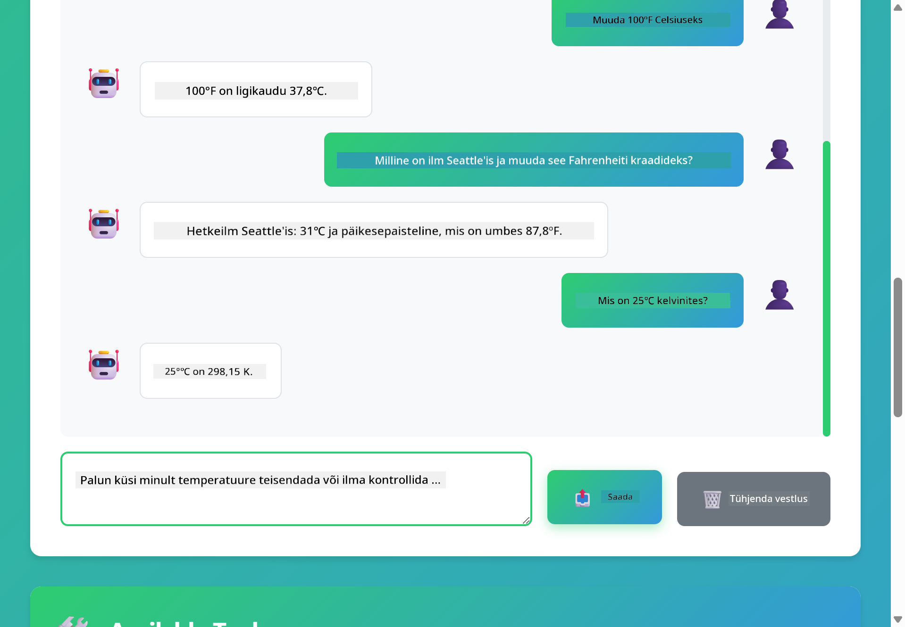

<!--
CO_OP_TRANSLATOR_METADATA:
{
  "original_hash": "844788938b26242f3cc54ce0d0951bea",
  "translation_date": "2026-01-06T02:02:56+00:00",
  "source_file": "04-tools/README.md",
  "language_code": "et"
}
-->
# Moodul 04: AI Agendid tööriistadega

## Sisukord

- [Mida Sa Õpid](../../../04-tools)
- [Eeltingimused](../../../04-tools)
- [AI Agentide mõistmine tööriistadega](../../../04-tools)
- [Kuidas tööriista kutsumine toimib](../../../04-tools)
  - [Tööriistade definitsioonid](../../../04-tools)
  - [Otsuste langetamine](../../../04-tools)
  - [Täideviimine](../../../04-tools)
  - [Vastuse genereerimine](../../../04-tools)
- [Tööriistade ahelad](../../../04-tools)
- [Rakenduse käivitamine](../../../04-tools)
- [Rakenduse kasutamine](../../../04-tools)
  - [Proovi lihtsat tööriista kasutust](../../../04-tools)
  - [Testi tööriistade ahelat](../../../04-tools)
  - [Vaata vestluse kulgu](../../../04-tools)
  - [Katseta erinevate päringutega](../../../04-tools)
- [Olulised mõisted](../../../04-tools)
  - [ReAct muster (Põhjendamine ja Tegutsemine)](../../../04-tools)
  - [Tööriistade kirjeldused on olulised](../../../04-tools)
  - [Sessioonihaldus](../../../04-tools)
  - [Vigade käsitlemine](../../../04-tools)
- [Saadaval olevad tööriistad](../../../04-tools)
- [Millal kasutada tööriistapõhiseid agente](../../../04-tools)
- [Järgmised sammud](../../../04-tools)

## Mida Sa Õpid

Senini oled õppinud, kuidas AI-ga vestelda, kuidas tõhusalt struktuureerida päringuid ja kuidas vastuseid oma dokumentide põhjal kinnitada. Kuid on üks põhimõtteline piirang: keelemudelid suudavad genereerida ainult teksti. Nad ei saa ilmaasju kontrollida, arvutusi teha, andmebaase pärida ega suhelda väliste süsteemidega.

Tööriistad muudavad selle. Kui anda mudelile juurdepääs funktsioonidele, mida ta saab kutsuda, muutud sellest tekstigeneraatorist agendiks, kes suudab tegutseda. Mudel otsustab, millal tal on vaja tööriista, millist tööriista kasutada ja millised parameetrid edasi anda. Sinu kood täidab funktsiooni ja tagastab tulemuse. Mudel lisab selle tulemuse oma vastusesse.

## Eeltingimused

- Moodul 01 lõpetatud (Azure OpenAI ressursid juurutatud)
- Juurkaustas `.env` fail, milles on Azure tunnused (loodud `azd up` käsuga Moodulis 01)

> **Märkus:** Kui sa pole Moodulit 01 lõpetanud, järgi esmalt seal juhiseid juurutamiseks.

## AI Agentide mõistmine tööriistadega

> **📝 Märkus:** Termin "agendid" selles moodulis viitab AI abistajatele, kellel on tööriistade kutsumise võimekus. See erineb **Agentic AI** mustritest (autonoomsed agendid, kellel on planeerimine, mälu ja mitmeastmeline põhjendamine), mida käsitleme [Moodulis 05: MCP](../05-mcp/README.md).

AI agent tööriistadega järgib põhjendamise ja tegutsemise mustrit (ReAct):

1. Kasutaja esitab küsimuse
2. Agent mõtleb, mida ta peab teadma
3. Agent otsustab, kas vastamiseks on vaja tööriista
4. Kui jah, kutsub agent sobiva tööriista õigete parameetritega
5. Tööriist täidetakse ja tagastab andmed
6. Agent võtab tulemuse oma vastusse ja annab lõpliku vastuse


*ReAct muster — kuidas AI agendid vaheldumisi põhjendavad ja tegutsevad probleemide lahendamiseks*

See juhtub automaatselt. Sina defineerid tööriistad ja nende kirjeldused. Mudel tegeleb otsuste langetamisega, millal ja kuidas neid kasutada.

## Kuidas tööriista kutsumine toimib

### Tööriistade definitsioonid

[WeatherTool.java](../../../04-tools/src/main/java/com/example/langchain4j/agents/tools/WeatherTool.java) | [TemperatureTool.java](../../../04-tools/src/main/java/com/example/langchain4j/agents/tools/TemperatureTool.java)

Sa defineerid funktsioonid selgete kirjelduste ja parameetrite spetsiifikatsioonidega. Mudel näeb neid kirjeldusi oma süsteemipäringus ja mõistab, mida iga tööriist teeb.

```java
@Component
public class WeatherTool {
    
    @Tool("Get the current weather for a location")
    public String getCurrentWeather(@P("Location name") String location) {
        // Teie ilmaotsingu loogika
        return "Weather in " + location + ": 22°C, cloudy";
    }
}

@AiService
public interface Assistant {
    String chat(@MemoryId String sessionId, @UserMessage String message);
}

// Assistent on automaatselt ühendatud Spring Boot abil järgmisega:
// - ChatModel kiht
// - Kõik @Tool meetodid @Component klassidest
// - ChatMemoryProvider sessioonihalduseks
```

> **🤖 Proovi [GitHub Copilot](https://github.com/features/copilot) Chat'iga:** Ava [`WeatherTool.java`](../../../04-tools/src/main/java/com/example/langchain4j/agents/tools/WeatherTool.java) ja küsi:
> - "Kuidas integreerida päris ilmaandmete API nagu OpenWeatherMap asemel imitatsiooni?"
> - "Mis teeb heast tööriistakirjeldusest, mis aitab AI-l seda õigesti kasutada?"
> - "Kuidas käsitleda API vigu ja piiranguid tööriistade realiseerimisel?"

### Otsuste langetamine

Kui kasutaja küsib "Milline on ilm Seattle'is?", tunneb mudel ära, et tal on vaja ilmatööriista. See genereerib funktsiooni kutse koos asukoha parameetriga "Seattle".

### Täideviimine

[AgentService.java](../../../04-tools/src/main/java/com/example/langchain4j/agents/service/AgentService.java)

Spring Boot ühendab automaatselt deklaratiivse `@AiService` liidese kõigi registreeritud tööriistadega ja LangChain4j täidab tööriistakutsed automaatselt.

> **🤖 Proovi [GitHub Copilot](https://github.com/features/copilot) Chat'iga:** Ava [`AgentService.java`](../../../04-tools/src/main/java/com/example/langchain4j/agents/service/AgentService.java) ja küsi:
> - "Kuidas ReAct muster toimib ja miks on see AI agentide jaoks efektiivne?"
> - "Kuidas agent otsustab, millist tööriista kasutada ja mis järjekorras?"
> - "Mis juhtub, kui tööriista täideviimine nurjub — kuidas tõrkeid vastupidavalt hallata?"

### Vastuse genereerimine

Mudel saab ilmaandmed ja vormindab need kasutajale loomuliku keele vastuseks.

### Miks kasutada deklaratiivseid AI teenuseid?

See moodul kasutab LangChain4j Spring Boot integratsiooni deklaratiivsete `@AiService` liidestega:

- **Spring Boot automaatne ühendamine** - ChatModel ja tööriistad süstitakse automaatselt
- **@MemoryId muster** - Automaatne sessioonipõhine mäluhaldus
- **Üksik eksemplar** - Assistent luuakse korra ja taaskasutatakse jõudluse parandamiseks
- **Tüübiohut execution** - Java meetodid kutsutakse otse tüübimuundusega
- **Mitme sammu orkestreerimine** - Haldab tööriistade ahelaid automaatselt
- **Null boilerplate** - Ei mingit käsitsi AiServices.builder() kutsumist ega HashMap mälu

Alternatiivsed lähenemised (manuaalne `AiServices.builder()`) nõuavad rohkem koodi ega kasuta Spring Boot integratsiooni eeliseid.

## Tööriistade ahelad

**Tööriistade ahelad** — AI võib kutsuda mitut tööriista jadamisi. Küsides "Milline on ilm Seattle'is ja kas peaksin võtma vihmavarju?", näed, kuidas ta omavahel seob `getCurrentWeather` funktsiooni, põhjendades vihmavarju vajalikkust.

<a href="images/tool-chaining.png"></a>

*Jadamineetud tööriistakutsed — ühe tööriista väljund suunatakse järgmise otsusesse*

**Ilma violentude korral** — Küsides ilma linnas, mis pole simulatsioonandmetes, tagastab tööriist veateate ja AI selgitab, et ta ei saa aidata. Tööriistad ebaõnnestuvad ohutult.

See toimib ühe vestlusetapi jooksul. Agent orkestreerib mitmeid tööriistakutseid iseseisvalt.

## Rakenduse käivitamine

**Veendu juurutuse olemasolus:**

Kontrolli, et juurkaustas on `.env` fail Azure tunnistega (loodud Moodulis 01):
```bash
cat ../.env  # Peaks näitama AZURE_OPENAI_ENDPOINT, API_KEY, DEPLOYMENT
```

**Käivita rakendus:**

> **Märkus:** Kui sa juba käivitasid kõik rakendused `./start-all.sh` käsuga Moodulis 01, siis see moodul töötab port 8084 juba. Võid alljärgnevad käivitamiskäsud vahele jätta ja minna otse aadressile http://localhost:8084.

**Valik 1: Spring Boot Dashboardi kasutamine (Soovitatav VS Code kasutajatele)**

Arendus konteineris on Spring Boot Dashboard laiendus, mis pakub visuaalset liidest kõigi Spring Boot rakenduste haldamiseks. Selle leiad VS Code vasakpoolsest tegevusribalt (otsima Spring Boot ikooni).

Spring Boot Dashboardist saad:
- Näha kõiki saadaolevaid Spring Boot rakendusi töökohas
- Alustada/peatada rakendusi ühe klõpsuga
- Vaadata rakenduste logisid reaalajas
- Jälgida rakenduste olekut

Lihtsalt klõpsa mängunupul "tools" kõrval selle mooduli alustamiseks või käivita korraga kõik moodulid.


**Valik 2: Skriptide kasutamine**

Käivita kõik veebirakendused (moodulid 01-04):

**Bash:**
```bash
cd ..  # Juure kataloogist
./start-all.sh
```

**PowerShell:**
```powershell
cd ..  # Juurekataloogist
.\start-all.ps1
```

Või käivita ainult see moodul:

**Bash:**
```bash
cd 04-tools
./start.sh
```

**PowerShell:**
```powershell
cd 04-tools
.\start.ps1
```

Mõlemad skriptid laadivad automaatselt keskkonnamuutujad juurkausta `.env` failist ja ehitavad JAR failid, kui need puuduvad.

> **Märkus:** Kui soovid käsitsi peale ehitada kõik moodulid enne käivitamist:
>
> **Bash:**
> ```bash
> cd ..  # Go to root directory
> mvn clean package -DskipTests
> ```
>
> **PowerShell:**
> ```powershell
> cd ..  # Go to root directory
> mvn clean package -DskipTests
> ```

Ava brauseris http://localhost:8084.

**Peatamiseks:**

**Bash:**
```bash
./stop.sh  # Ainult see moodul
# Või
cd .. && ./stop-all.sh  # Kõik moodulid
```

**PowerShell:**
```powershell
.\stop.ps1  # Ainult see moodul
# Või
cd ..; .\stop-all.ps1  # Kõik moodulid
```

## Rakenduse kasutamine

Rakendus pakub veebiliidest, kus saad suhelda AI agendiga, kellel on juurdepääs ilma ja temperatuuri teisendamise tööriistadele.

<a href="images/tools-homepage.png"></a>

*AI Agendi tööriistade liides — kiired näited ja vestlusliides tööriistadega suhtlemiseks*

### Proovi lihtsat tööriista kasutust

Alusta lihtsa päringuga: "Muuda 100 kraadi Fahrenheiti Celsiuseks". Agent tunneb ära, et tal on vaja temperatuuri teisendamise tööriista, kutsub selle õige parameetriga ja tagastab tulemuse. Märka, kui loomulik see on — sa ei pidanud määrama, millist tööriista kasutada ega kuidas seda kutsuda.

### Testi tööriistade ahelat

Proovi nüüd keerulisemat: "Milline on ilm Seattle'is ja muuda see Fahrenheiti kraadidesse?" Vaata, kuidas agent töötab selles sammhaaval. Esiteks saab ta ilma (mis on Celsiuses), mõistab, et peab selle muutma Fahrenheiti vastu, kutsub teisendustööriista ja kombineerib mõlema tulemuse üheks vastuseks.

### Vaata vestluse kulgu

Vestlusliides hoiab vestluse ajalugu, võimaldades sul teha mitmesammulisi suhtlusi. Näed kõiki varasemaid päringuid ja vastuseid, mis teeb lihtsaks vestluse jälgimise ja mõistmise, kuidas agent konteksti ehitab mitme vahetusega.

<a href="images/tools-conversation-demo.png"></a>

*Mitmesammuline vestlus, mis näitab lihtsaid teisendusi, ilma päringuid ja tööriistade jadamist*

### Katseta erinevate päringutega

Proovi erinevaid kombinatsioone:
- Ilmavaatlused: "Milline on ilm Tokyos?"
- Temperatuuri teisendused: "Mis on 25°C Kelvinites?"
- Ühendatud päringud: "Kontrolli ilma Pariisis ja ütle, kas see on üle 20°C"

Märka, kuidas agent tõlgendab loomulikku keelt ja kaardistab selle sobivateks tööriistakutseteks.

## Olulised mõisted

### ReAct muster (Põhjendamine ja Tegutsemine)

Agent vaheldub põhjendamise (otsustades, mida teha) ja tegutsemise (tööriistade kasutamise) vahel. See muster võimaldab autonoomset probleemilahendust mitte ainult juhiste järgimist.

### Tööriistade kirjeldused on olulised

Tööriistade kirjelduste kvaliteet mõjutab otseselt, kui hästi agent neid kasutab. Selged ja konkreetsed kirjeldused aitavad mudelil mõista, millal ja kuidas kutset teha.

### Sessioonihaldus

`@MemoryId` annotatsioon lubab automaatse sessioonipõhise mäluhalduse. Iga sessiooni ID saab oma `ChatMemory` eksemplari, mida haldab `ChatMemoryProvider` bean, eemaldades vajaduse käsitsi mälu jälgimiseks.

### Vigade käsitlemine

Tööriistad võivad ebaõnnestuda – API aeguvad, parameetrid võivad olla vigased, välised teenused võivad olla maas. Tootmisagentidel on vaja vigade haldust, et mudel saaks selgitada probleeme või proovida alternatiive.

## Saadaval olevad tööriistad

**Ilmatööriistad** (imitatsioonandmed demonstratsiooniks):
- Praeguse ilma saamine asukoha järgi
- Mitmepäevane prognoos

**Temperatuuri teisendamise tööriistad**:
- Celsiuse → Fahrenheiti
- Fahrenheiti → Celsiuse
- Celsiuse → Kelvini
- Kelvini → Celsiuse
- Fahrenheiti → Kelvini
- Kelvini → Fahrenheiti

Need on lihtsad näited, kuid see muster laiendab mis tahes funktsioonidele: andmebaasi päringud, API kutseid, arvutusi, failitoiminguid või süsteemikäske.

## Millal kasutada tööriistapõhiseid agente

**Kasuta tööriistu, kui:**
- Vastamiseks on vaja reaalajas andmeid (ilm, aktsiahinnad, laoseis)
- Vajad teha arvutusi üle lihtsa matemaatika
- Juurdepääs andmebaasidele või API-dele
- Tegevuste sooritamine (kirjade saatmine, piletite loomine, andmete uuendamine)
- Mitme andmeallika kombineerimine

**Ära kasuta tööriistu, kui:**
- Küsimustele saab vastata üldteadmiste põhjal
- Vastus on puhtalt vestluslik
- Tööriistade latentsus muudaks kasutuskogemuse liialt aeglaseks

## Järgmised sammud

**Järgmine moodul:** [05-mcp - Mudeli konteksti protokoll (MCP)](../05-mcp/README.md)

---

**Navigeerimine:** [← Eelmine: Moodul 03 - RAG](../03-rag/README.md) | [Tagasi Avalehele](../README.md) | [Järgmine: Moodul 05 - MCP →](../05-mcp/README.md)

---

<!-- CO-OP TRANSLATOR DISCLAIMER START -->
**Vastutusest loobumine**:
See dokument on tõlgitud kasutades tehisintellektil põhinevat tõlketeenust [Co-op Translator](https://github.com/Azure/co-op-translator). Kuigi me püüame täpsust, palun arvestage, et automaatsed tõlked võivad sisaldada vigu või ebatäpsusi. Originaaldokument oma algkeeles peaks olema käsitletud autoriteetse allikana. Tähtsa teabe puhul on soovitatav kasutada professionaalset inimtõlget. Me ei vastuta ükskõik milliste arusaamatuste või valesti mõistmiste eest, mis võivad tekkida selle tõlke kasutamisest.
<!-- CO-OP TRANSLATOR DISCLAIMER END -->