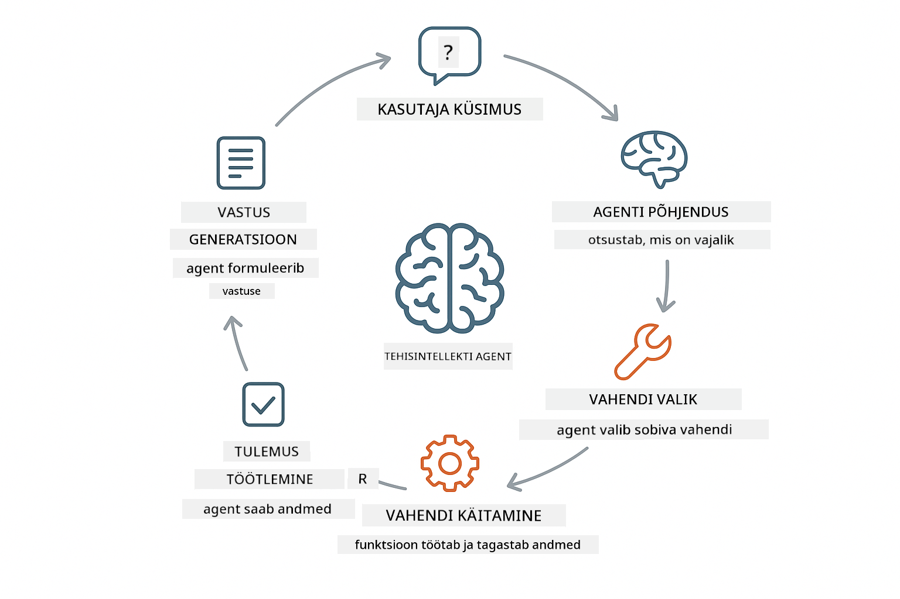
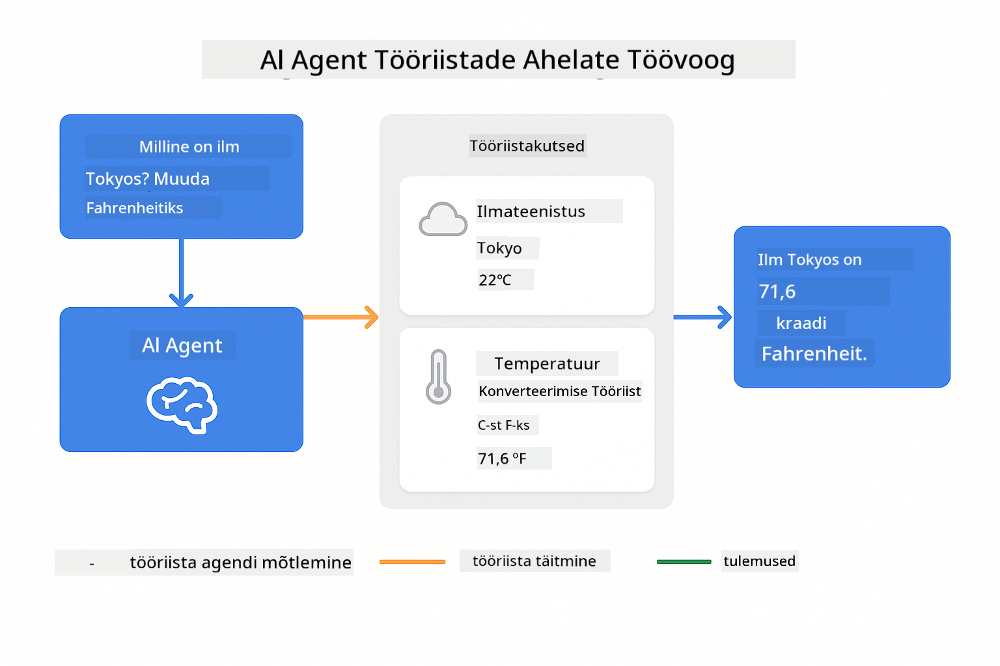
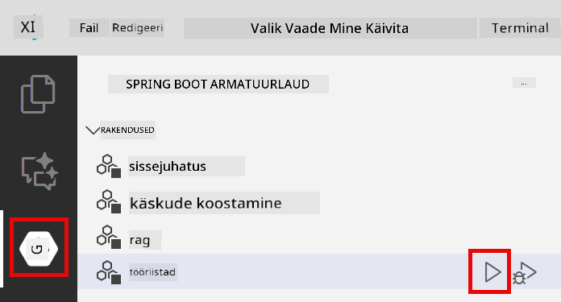
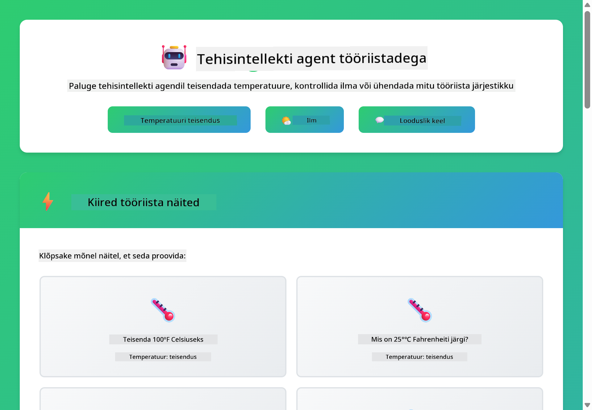

<!--
CO_OP_TRANSLATOR_METADATA:
{
  "original_hash": "aa23f106e7f53270924c9dd39c629004",
  "translation_date": "2025-12-13T19:41:02+00:00",
  "source_file": "04-tools/README.md",
  "language_code": "et"
}
-->
# Moodul 04: AI agendid tööriistadega

## Sisukord

- [Mida sa õpid](../../../04-tools)
- [Eeltingimused](../../../04-tools)
- [AI agentide mõistmine tööriistadega](../../../04-tools)
- [Kuidas tööriistakõned toimivad](../../../04-tools)
  - [Tööriistade definitsioonid](../../../04-tools)
  - [Otsuste tegemine](../../../04-tools)
  - [Täideviimine](../../../04-tools)
  - [Vastuse genereerimine](../../../04-tools)
- [Tööriistade aheldamine](../../../04-tools)
- [Rakenduse käivitamine](../../../04-tools)
- [Rakenduse kasutamine](../../../04-tools)
  - [Proovi lihtsat tööriista kasutust](../../../04-tools)
  - [Testi tööriistade aheldamist](../../../04-tools)
  - [Vaata vestluse kulgu](../../../04-tools)
  - [Jälgi mõtlemist](../../../04-tools)
  - [Katseta erinevate päringutega](../../../04-tools)
- [Põhimõisted](../../../04-tools)
  - [ReAct muster (mõtlemine ja tegutsemine)](../../../04-tools)
  - [Tööriistade kirjeldused on olulised](../../../04-tools)
  - [Sessioonihaldus](../../../04-tools)
  - [Vigade käsitlemine](../../../04-tools)
- [Saadaval olevad tööriistad](../../../04-tools)
- [Millal kasutada tööriistapõhiseid agente](../../../04-tools)
- [Järgmised sammud](../../../04-tools)

## Mida sa õpid

Senini oled õppinud, kuidas AI-ga vestelda, kuidas tõhusalt ülesandeid struktureerida ja vastuseid dokumentide põhjal kinnitada. Kuid on üks põhiline piirang: keelemudelid suudavad genereerida ainult teksti. Nad ei saa ilmaasju kontrollida, teha arvutusi, pärida andmebaase ega suhelda väliste süsteemidega.

Tööriistad muudavad selle. Kui mudelile anda juurdepääs funktsioonidele, mida ta saab kutsuda, muudad ta tekstigeneraatorist agendiks, kes saab tegutseda. Mudel otsustab, millal tal on tööriista vaja, millist tööriista kasutada ja milliseid parameetreid edastada. Sinu kood täidab funktsiooni ja tagastab tulemuse. Mudel lisab selle vastusesse.

## Eeltingimused

- Moodul 01 lõpetatud (Azure OpenAI ressursid juurutatud)
- Juurekataloogis `.env` fail Azure volitustega (loodud `azd up` käsuga Moodulis 01)

> **Märkus:** Kui sa pole Moodulit 01 lõpetanud, järgi esmalt seal olevaid juurutusjuhiseid.

## AI agentide mõistmine tööriistadega

AI agent tööriistadega järgib mõtlemise ja tegutsemise mustrit (ReAct):

1. Kasutaja esitab küsimuse
2. Agent mõtleb, mida tal vaja teada on
3. Agent otsustab, kas vastamiseks on vaja tööriista
4. Kui jah, kutsub agent sobiva tööriista õige parameetriga
5. Tööriist täidab ja tagastab andmed
6. Agent lisab tulemuse ja annab lõpliku vastuse



*ReAct muster – kuidas AI agendid vaheldumisi mõtlevad ja tegutsevad probleemide lahendamiseks*

See toimub automaatselt. Sa defineerid tööriistad ja nende kirjeldused. Mudel tegeleb otsustamisega, millal ja kuidas neid kasutada.

## Kuidas tööriistakõned toimivad

**Tööriistade definitsioonid** - [WeatherTool.java](../../../04-tools/src/main/java/com/example/langchain4j/agents/tools/WeatherTool.java) | [TemperatureTool.java](../../../04-tools/src/main/java/com/example/langchain4j/agents/tools/TemperatureTool.java)

Sa defineerid funktsioonid selgete kirjelduste ja parameetritega. Mudel näeb neid kirjeldusi süsteemi promptis ja mõistab, mida iga tööriist teeb.

```java
@Component
public class WeatherTool {
    
    @Tool("Get the current weather for a location")
    public String getCurrentWeather(@P("Location name") String location) {
        // Teie ilmaotsingu loogika
        return "Weather in " + location + ": 22°C, cloudy";
    }
}

@AiService
public interface Assistant {
    String chat(@MemoryId String sessionId, @UserMessage String message);
}

// Assistent on Spring Booti poolt automaatselt ühendatud järgmistega:
// - ChatModel bean
// - Kõik @Tool meetodid @Component klassidest
// - ChatMemoryProvider sessioonihalduseks
```

> **🤖 Proovi [GitHub Copilot](https://github.com/features/copilot) Chatiga:** Ava [`WeatherTool.java`](../../../04-tools/src/main/java/com/example/langchain4j/agents/tools/WeatherTool.java) ja küsi:
> - "Kuidas integreerida päris ilma API nagu OpenWeatherMap, mitte kasutada näidandmeid?"
> - "Mis teeb hea tööriista kirjelduse, mis aitab AI-l seda õigesti kasutada?"
> - "Kuidas käsitleda API vigu ja päringupiiranguid tööriistade rakendustes?"

**Otsuste tegemine**

Kui kasutaja küsib "Milline on ilm Seattle'is?", tunneb mudel ära, et tal on vaja ilma tööriista. Ta genereerib funktsiooni kõne, kus asukoha parameeter on "Seattle".

**Täideviimine** - [AgentService.java](../../../04-tools/src/main/java/com/example/langchain4j/agents/service/AgentService.java)

Spring Boot ühendab automaatselt deklaratiivse `@AiService` liidese kõigi registreeritud tööriistadega ja LangChain4j täidab tööriistakõned automaatselt.

> **🤖 Proovi [GitHub Copilot](https://github.com/features/copilot) Chatiga:** Ava [`AgentService.java`](../../../04-tools/src/main/java/com/example/langchain4j/agents/service/AgentService.java) ja küsi:
> - "Kuidas ReAct muster töötab ja miks see AI agentide jaoks tõhus on?"
> - "Kuidas agent otsustab, millist tööriista kasutada ja mis järjekorras?"
> - "Mis juhtub, kui tööriista täideviimine ebaõnnestub – kuidas vigu usaldusväärselt käsitleda?"

**Vastuse genereerimine**

Mudel saab ilmaandmed ja vormindab need kasutajale loomulikus keeles vastuseks.

### Miks kasutada deklaratiivseid AI teenuseid?

See moodul kasutab LangChain4j Spring Boot integratsiooni deklaratiivsete `@AiService` liidestega:

- **Spring Boot automaatne ühendamine** – ChatModel ja tööriistad süstitakse automaatselt
- **@MemoryId muster** – automaatne sessioonipõhine mäluhaldus
- **Üksik eksemplar** – assistent luuakse korra ja taaskasutatakse parema jõudluse jaoks
- **Tüübikindel täideviimine** – Java meetodid kutsutakse otse koos tüübikonversiooniga
- **Mitme sammu orkestreerimine** – tööriistade aheldamine toimub automaatselt
- **Null boilerplate** – pole vaja käsitsi AiServices.builder() kutsuda ega mälu HashMapi hallata

Alternatiivsed lähenemised (käsitsi `AiServices.builder()`) nõuavad rohkem koodi ja ei kasuta Spring Boot integratsiooni eeliseid.

## Tööriistade aheldamine

**Tööriistade aheldamine** – AI võib järjestikku kutsuda mitut tööriista. Küsi "Milline on ilm Seattle'is ja kas peaksin vihmavarju kaasa võtma?" ja vaata, kuidas ta aheldab `getCurrentWeather` koos mõtlemisega vihmavarju vajalikkusest.

<a href="images/tool-chaining.png"></a>

*Järjestikused tööriistakõned – ühe tööriista väljund läheb järgmise otsustamiseks*

**Sujuvad vead** – Küsi ilma kohta linnas, mis pole näidandmetes. Tööriist tagastab veateate ja AI selgitab, et ei saa aidata. Tööriistad ebaõnnestuvad turvaliselt.

See toimub ühe vestlusvooru jooksul. Agent orkestreerib mitut tööriistakõnet iseseisvalt.

## Rakenduse käivitamine

**Kontrolli juurutust:**

Veendu, et juurekataloogis on `.env` fail Azure volitustega (loodud Moodulis 01):
```bash
cat ../.env  # Peaks näitama AZURE_OPENAI_ENDPOINT, API_KEY, DEPLOYMENT
```

**Käivita rakendus:**

> **Märkus:** Kui oled juba käivitanud kõik rakendused käsuga `./start-all.sh` Moodulis 01, siis see moodul töötab juba pordil 8084. Võid allolevad käivituskäsud vahele jätta ja minna otse aadressile http://localhost:8084.

**Variant 1: Spring Boot Dashboard kasutamine (soovitatav VS Code kasutajatele)**

Arenduskonteiner sisaldab Spring Boot Dashboard laiendust, mis pakub visuaalset liidest kõigi Spring Boot rakenduste haldamiseks. Leiad selle VS Code vasakpoolsest tegevusribast (otsige Spring Boot ikooni).

Spring Boot Dashboardist saad:
- Näha kõiki tööruumis olevaid Spring Boot rakendusi
- Käivitada/peatada rakendusi ühe klikiga
- Vaadata rakenduste logisid reaalajas
- Jälgida rakenduste olekut

Lihtsalt klõpsa "tools" kõrval olevale mängunupule, et käivitada see moodul, või käivita korraga kõik moodulid.



**Variant 2: Shell skriptide kasutamine**

Käivita kõik veebirakendused (moodulid 01-04):

**Bash:**
```bash
cd ..  # Juurekataloogist
./start-all.sh
```

**PowerShell:**
```powershell
cd ..  # Juurekataloogist
.\start-all.ps1
```

Või käivita ainult see moodul:

**Bash:**
```bash
cd 04-tools
./start.sh
```

**PowerShell:**
```powershell
cd 04-tools
.\start.ps1
```

Mõlemad skriptid laadivad automaatselt keskkonnamuutujad juure `.env` failist ja ehitavad JAR-id, kui neid pole.

> **Märkus:** Kui soovid enne käivitamist kõik moodulid käsitsi ehitada:
>
> **Bash:**
> ```bash
> cd ..  # Go to root directory
> mvn clean package -DskipTests
> ```
>
> **PowerShell:**
> ```powershell
> cd ..  # Go to root directory
> mvn clean package -DskipTests
> ```

Ava brauseris http://localhost:8084.

**Peatamiseks:**

**Bash:**
```bash
./stop.sh  # Ainult see moodul
# Või
cd .. && ./stop-all.sh  # Kõik moodulid
```

**PowerShell:**
```powershell
.\stop.ps1  # Ainult see moodul
# Või
cd ..; .\stop-all.ps1  # Kõik moodulid
```

## Rakenduse kasutamine

Rakendus pakub veebiliidest, kus saad suhelda AI agendiga, kellel on juurdepääs ilma- ja temperatuuri teisendamise tööriistadele.

<a href="images/tools-homepage.png"></a>

*AI agendi tööriistade liides – kiired näited ja vestlusliides tööriistadega suhtlemiseks*

**Proovi lihtsat tööriista kasutust**

Alusta lihtsa päringuga: "Muuda 100 kraadi Fahrenheiti Celsiuseks". Agent tunneb ära, et tal on vaja temperatuuri teisendamise tööriista, kutsub selle õige parameetriga ja tagastab tulemuse. Märka, kui loomulik see on – sa ei pidanud määrama, millist tööriista kasutada ega kuidas seda kutsuda.

**Testi tööriistade aheldamist**

Proovi nüüd keerulisemat: "Milline on ilm Seattle'is ja muuda see Fahrenheiti kraadideks?" Vaata, kuidas agent samm-sammult töötab. Ta saab esmalt ilma (mis on Celsiuses), mõistab, et peab teisendama Fahrenheiti, kutsub teisendustööriista ja ühendab mõlemad tulemused üheks vastuseks.

**Vaata vestluse kulgu**

Vestlusliides hoiab vestluse ajaloo, võimaldades sul pidada mitme sammu pikkuseid vestlusi. Näed kõiki varasemaid päringuid ja vastuseid, mis teeb lihtsaks vestluse jälgimise ja mõistmise, kuidas agent konteksti ehitab.

<a href="images/tools-conversation-demo.png"></a>

*Mitme sammu vestlus, mis näitab lihtsaid teisendusi, ilma päringuid ja tööriistade aheldamist*

**Katseta erinevate päringutega**

Proovi erinevaid kombinatsioone:
- Ilma päringud: "Milline on ilm Tokyos?"
- Temperatuuri teisendused: "Mis on 25°C kelvinites?"
- Ühendatud päringud: "Kontrolli ilma Pariisis ja ütle, kas on üle 20°C"

Märka, kuidas agent tõlgendab loomulikku keelt ja kaardistab selle sobivateks tööriistakõnedeks.

## Põhimõisted

**ReAct muster (mõtlemine ja tegutsemine)**

Agent vaheldumisi mõtleb (otsustab, mida teha) ja tegutseb (kasutab tööriistu). See muster võimaldab autonoomset probleemilahendust, mitte ainult juhiste täitmist.

**Tööriistade kirjeldused on olulised**

Tööriistade kirjelduste kvaliteet mõjutab otseselt, kui hästi agent neid kasutab. Selged ja spetsiifilised kirjeldused aitavad mudelil mõista, millal ja kuidas iga tööriista kutsuda.

**Sessioonihaldus**

`@MemoryId` annotatsioon võimaldab automaatset sessioonipõhist mäluhaldust. Iga sessiooni ID saab oma `ChatMemory` eksemplari, mida haldab `ChatMemoryProvider` bean, mis kõrvaldab vajaduse käsitsi mälu jälgimiseks.

**Vigade käsitlemine**

Tööriistad võivad ebaõnnestuda – API-d aeguvad, parameetrid võivad olla vigased, välised teenused võivad langeda. Tootmisagentidel on vaja vigade käsitlemist, et mudel saaks probleeme selgitada või proovida alternatiive.

## Saadaval olevad tööriistad

**Ilmatööriistad** (näidandmed demonstratsiooniks):
- Praeguse ilma saamine asukoha järgi
- Mitmepäevane prognoos

**Temperatuuri teisendamise tööriistad**:
- Celsiuse ja Fahrenheiti teisendus mõlemas suunas
- Celsiuse ja Kelvini teisendus mõlemas suunas
- Fahrenheiti ja Kelvini teisendus mõlemas suunas

Need on lihtsad näited, kuid muster laieneb mis tahes funktsioonile: andmebaasi päringud, API kõned, arvutused, failitoimingud või süsteemikäsklused.

## Millal kasutada tööriistapõhiseid agente

**Kasuta tööriistu, kui:**
- Vastamiseks on vaja reaalajas andmeid (ilm, aktsiahinnad, laoseis)
- Pead tegema arvutusi, mis ületavad lihtsat matemaatikat
- Juurdepääs andmebaasidele või API-dele
- Tegutsema (saata e-kirju, luua pileteid, uuendada kirjeid)
- Kombineerima mitut andmeallikat

**Ära kasuta tööriistu, kui:**
- Küsimustele saab vastata üldteadmiste põhjal
- Vastus on puhtalt vestluslik
- Tööriistade latentsus muudaks kogemuse liiga aeglaseks

## Järgmised sammud

**Järgmine moodul:** [05-mcp - Mudeli konteksti protokoll (MCP)](../05-mcp/README.md)

---

**Navigeerimine:** [← Eelmine: Moodul 03 - RAG](../03-rag/README.md) | [Tagasi avalehele](../README.md) | [Järgmine: Moodul 05 - MCP →](../05-mcp/README.md)

---

<!-- CO-OP TRANSLATOR DISCLAIMER START -->
**Vastutusest loobumine**:
See dokument on tõlgitud kasutades tehisintellektil põhinevat tõlketeenust [Co-op Translator](https://github.com/Azure/co-op-translator). Kuigi püüame tagada täpsust, palun arvestage, et automaatsed tõlked võivad sisaldada vigu või ebatäpsusi. Originaaldokument selle emakeeles tuleks pidada autoriteetseks allikaks. Olulise teabe puhul soovitatakse kasutada professionaalset inimtõlget. Me ei vastuta selle tõlke kasutamisest tulenevate arusaamatuste või valesti mõistmiste eest.
<!-- CO-OP TRANSLATOR DISCLAIMER END -->