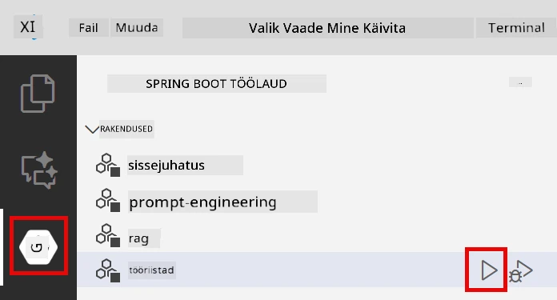
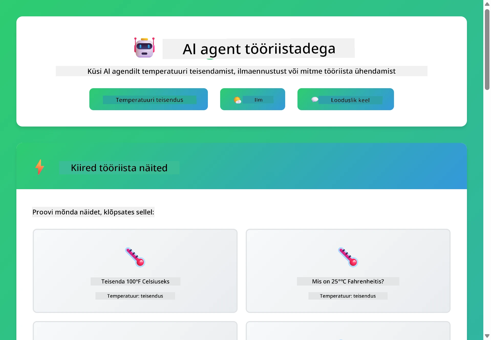
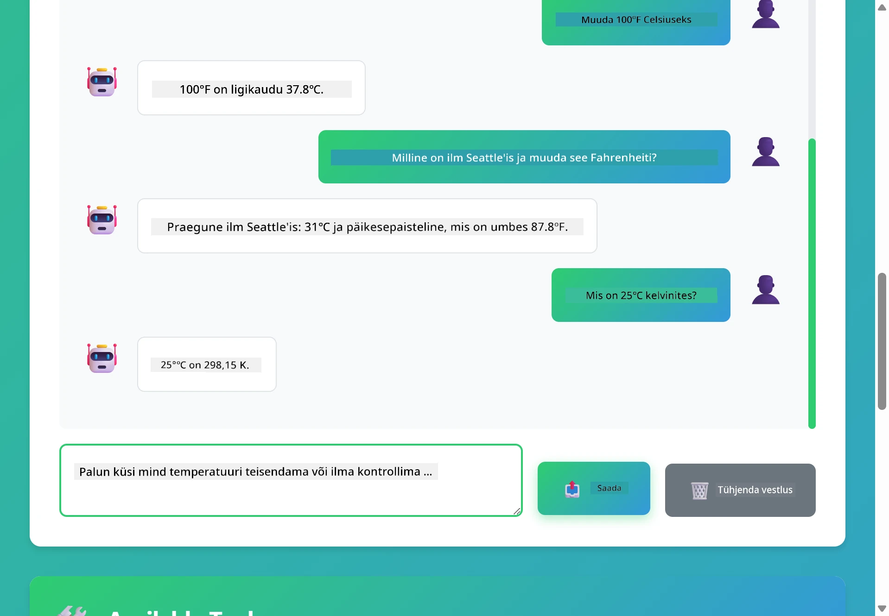

# Moodul 04: AI Agendid tööriistadega

## Sisukord

- [Video Juhend](#video-juhend)
- [Mida Sa Õpid](#mida-sa-õpid)
- [Eeltingimused](#eeltingimused)
- [AI Agentide Mõistmine Tööriistadega](#ai-agentide-mõistmine-tööriistadega)
- [Kuidas Tööriista Kutsumine Töötab](#kuidas-tööriista-kutsumine-töötab)
  - [Tööriistade Definitsioonid](#tööriistade-definitsioonid)
  - [Otsuste Tegemine](#otsuste-tegemine)
  - [Täideviimine](#täideviimine)
  - [Vastuse Genereerimine](#vastuse-genereerimine)
  - [Arhitektuur: Spring Boot Automaatühendus](#arhitektuur-spring-boot-automaatühendus)
- [Tööriistade Järgnevus](#tööriistade-järgnevus)
- [Rakenduse Käivitamine](#rakenduse-käivitamine)
- [Rakenduse Kasutamine](#rakenduse-kasutamine)
  - [Proovi Lihtsat Tööriista Kasutust](#proovi-lihtsat-tööriista-kasutust)
  - [Testi Tööriistade Järgnevust](#testi-tööriistade-ahelat)
  - [Vaata Vestluse Voogu](#vaata-vestluse-voogu)
  - [Katseta Erinevate Päringutega](#katseta-erinevate-päringutega)
- [Olulised Mõisted](#peamised-kontseptsioonid)
  - [ReAct Muster (Põhjendamine ja Tegutsemine)](#react-muster-põhjus-ja-tegutsemine)
  - [Tööriistade Kirjeldused on Tähtsad](#tööriistade-kirjeldused-on-tähtsad)
  - [Sessioonihaldus](#sessiooni-haldus)
  - [Vigade Käitlemine](#veahaldus)
- [Saadaval Tööriistad](#saadaval-olevad-tööriistad)
- [Millal Kasutada Tööriistapõhiseid Agente](#millal-kasutada-tööriistapõhiseid-agente)
- [Tööriistad vs RAG](#tööriistad-vs-rag)
- [Järgmised Sammud](#järgmised-sammud)

## Video Juhend

Vaata seda otseülekannet, mis selgitab, kuidas selle mooduliga alustada:

<a href="https://www.youtube.com/watch?v=O_J30kZc0rw"></a>

## Mida Sa Õpid

Nii kaugele oled õppinud, kuidas pidada vestlusi AI-ga, struktureerida tõhusaid prompt’e ja põhendada vastuseid oma dokumentides. Kuid on endiselt põhimõtteline piirang: keelemudelid saavad vaid teksti genereerida. Nad ei saa ilmaennustust teha, arvutusi lahendada, andmebaase pärida ega suhelda väliste süsteemidega.

Tööriistad muudavad selle. Anda mudelile juurdepääs funktsioonidele, mida ta saab kutsuda, muudab selle tekstigeneraatorist agendiks, kes suudab tegutseda. Mudel otsustab, millal tal on vaja tööriista, millist tööriista kasutada ja milliseid parameetreid edastada. Sinu kood täidab funktsiooni ja tagastab tulemuse. Mudel kasutab seda tulemust oma vastuses.

## Eeltingimused

- Läbitud [Moodul 01 - Sissejuhatus](../01-introduction/README.md) (Azure OpenAI ressursid juurutatud)
- Soovitatavalt läbitud varasemad moodulid (see moodul viitab [RAG kontseptsioonidele Moodulis 03](../03-rag/README.md) Tööriistade vs RAG võrdluses)
- Juurekataloogis asuv `.env` fail Azure volitustega (loodud `azd up` abil Moodulis 01)

> **Märkus:** Kui sa pole veel Moodulit 01 läbinud, järgi esmalt seal olevaid juurutusjuhiseid.

## AI Agentide Mõistmine Tööriistadega

> **📝 Märkus:** Selles moodulis viitab mõiste "agendid" AI assistentidele, millel on tööriista kutsumise võimekus. See erineb **Agentic AI** mustritest (autonoomsed agendid planeerimise, mälu ja mitmeastmelise põhjendamisega), mida käsitleme [Moodulis 05: MCP](../05-mcp/README.md).

Ilma tööriistadeta saab keelemudel ainult oma treeningandmetest teksti genereerida. Küsi ilmakaarti ja ta peab aimama. Anna talle tööriistad ja ta saab kutsuda ilma API, teha arvutusi või andmebaasi päringuid — ning põimida need reaalsete tulemused oma vastusesse.


*Ilma tööriistadeta saab mudel ainult oletada — tööriistadega saab ta kutsuda API-sid, teha arvutusi ja tagastada reaalajas andmeid.*

AI agent tööriistadega järgib **Põhjendamise ja Tegutsemise (ReAct)** mustrit. Mudel ei vasta lihtsalt — ta mõtleb, mida vajab, tegutseb tööriista kutsumisega, jälgib tulemust ja otsustab, kas tegutseda uuesti või anda lõplik vastus:

1. **Põhjenda** — Agent analüüsib kasutaja küsimust ja määrab vajaliku info
2. **Tegutse** — Agent valib sobiva tööriista, genereerib õiged parameetrid ja kutsub selle
3. **Vaatle** — Agent saab tööriista väljundi ja hindab tulemust
4. **Korda või Vasta** — Kui vaja rohkem andmeid, kordab agent tsüklit; muidu koostab loomuliku keele vastuse


*ReAct tsükkel — agent põhjendab, mida teha, tegutseb tööriista kutsumisega, vaatleb tulemust ja kordab kuni lõpliku vastuse esitamiseni.*

See toimub automaatselt. Sa defineerid tööriistad ja nende kirjeldused. Mudel haldab otsustamist, millal ja kuidas neid kasutada.

## Kuidas Tööriista Kutsumine Töötab

### Tööriistade Definitsioonid

[WeatherTool.java](../../../04-tools/src/main/java/com/example/langchain4j/agents/tools/WeatherTool.java) | [TemperatureTool.java](../../../04-tools/src/main/java/com/example/langchain4j/agents/tools/TemperatureTool.java)

Sa defineerid funktsioonid selgete kirjelduste ja parameetrite spetsifikatsioonidega. Mudel näeb neid kirjeldusi oma süsteemipromptis ja mõistab, mida iga tööriist teeb.

```java
@Component
public class WeatherTool {
    
    @Tool("Get the current weather for a location")
    public String getCurrentWeather(@P("Location name") String location) {
        // Teie ilmainfo päringu loogika
        return "Weather in " + location + ": 22°C, cloudy";
    }
}

@AiService
public interface Assistant {
    String chat(@MemoryId String sessionId, @UserMessage String message);
}

// Abi on Spring Booti poolt automaatselt ühendatud järgmistega:
// - ChatModel bean
// - Kõik @Tool meetodid @Component klassidest
// - ChatMemoryProvider sessiooni haldamiseks
```

Järgmine skeem lahti seletab iga annotatsiooni ja näitab, kuidas iga osa aitab tehisintellektil mõista, millal tööriista kutsuda ja milliseid argumente edastada:


*Tööriistade definitsiooni anatoomia — @Tool ütleb tehisintellektile, millal seda kasutada, @P kirjeldab iga parameetrit ja @AiService ühendab kõik käivitamisel.*

> **🤖 Proovi [GitHub Copilot](https://github.com/features/copilot) Chat’iga:** Ava [`WeatherTool.java`](../../../04-tools/src/main/java/com/example/langchain4j/agents/tools/WeatherTool.java) ja küsi:
> - "Kuidas integreerida päris ilma API nagu OpenWeatherMap simuleeritud andmete asemel?"
> - "Mis teeb tööriista kirjelduse heaks ja aitab AI kasutamisel seda õigesti kasutada?"
> - "Kuidas käsitleda API vigu ja päringu piire tööriista rakendustes?"

### Otsuste Tegemine

Kui kasutaja küsib "Milline on ilm Seattle’is?", ei vali mudel tööriista juhuslikult. Ta võrdleb kasutaja tahet kõigi tema käsutuses olevate tööriistade kirjeldustega, hinde igaüht asjakohasuse põhjal ja valib parima vaste. Seejärel genereerib struktureeritud funktsiooni kutsumise õigete parameetritega — antud juhul seab `location` väärtuseks `"Seattle"`.

Kui ükski tööriist ei vasta kasutaja päringule, vastab mudel oma teadmiste põhjal. Kui sobivaid tööriistu on mitu, valib kõige spetsiifilisema.


*Mudel hindab kõiki olemasolevaid tööriistu kasutaja eesmärgiga ja valib parima sobivuse — sellepärast on selgete ja spetsiifiliste tööriistakirjelduste kirjutamine oluline.*

### Täideviimine

[AgentService.java](../../../04-tools/src/main/java/com/example/langchain4j/agents/service/AgentService.java)

Spring Boot ühendab deklaratiivse `@AiService` liidese kõigi registreeritud tööriistadega automaatselt ning LangChain4j täidab tööriistakutsed ise. Tagaplaanil kulgeb täiesti tööriistakutse kuue faasiga — kasutaja loomuliku keele küsimusest loodusesse vastuseni tagasi:


*Algusest lõpuni voog — kasutaja esitab küsimuse, mudel valib tööriista, LangChain4j täidab selle ja mudel põimib tulemuse loomulikku vastusesse.*

Tagaplaanil käivitab `AiServices` sama tööriistakutsete tsükli iga tööriista jaoks — siin lihtsustatud `Calculatori` näitel. Allolev järjestusdiagramm näitab täpselt, mis toimub allapoole vooludes:


*Tööriistakutse tsükkel — `AiServices` saadab su sõnumi ja tööriistaskemad LLM-ile, LLM vastab funktsioonikutsena nagu `add(42, 58)`, LangChain4j täidab kohalikult `Calculator` meetodi ja tagastab tulemuse lõpliku vastuse jaoks.*

> **🤖 Proovi [GitHub Copilot](https://github.com/features/copilot) Chat’iga:** Ava [`AgentService.java`](../../../04-tools/src/main/java/com/example/langchain4j/agents/service/AgentService.java) ja küsi:
> - "Kuidas töötab ReAct muster ja miks see on AI agentide puhul tõhus?"
> - "Kuidas agent otsustab, millist tööriista kasutada ja mis järjekorras?"
> - "Mis juhtub, kui tööriista täideviimine ebaõnnestub - kuidas käsitleda vigu kindlalt?"

### Vastuse Genereerimine

Mudel saab ilmaandmed ja vormistab need loomulikus keeles vastuseks kasutajale.

### Arhitektuur: Spring Boot Automaatühendus

Selles moodulis kasutatakse LangChain4j Spring Boot integratsiooni deklaratiivsete `@AiService` liidestega. Käivitamisel avastab Spring Boot iga `@Component`, mis sisaldab `@Tool` meetodeid, sinu `ChatModel` bean’i ja `ChatMemoryProvider` — ning ühendab kõik üheks `Assistant` liideseks nullkoodita.


*@AiService liides ühendab kokku ChatModel’i, tööriistakomponendid ja mälu pakkuja — Spring Boot haldab kogu ühenduse automaatselt.*

Siin on kogu päringu elutsükkel järjestusdiagrammina — HTTP päringust kontrolleri, teenuse ja automaatühendatud proksi kaudu tööriistakutseni ja tagasi:


*Täielik Spring Boot päringu elutsükkel — HTTP päring voolab läbi kontrolleri ja teenuse automaatselt ühendatud Assistant proksi juurde, mis korraldab LLM ja tööriistakutsed iseseisvalt.*

Selle lähenemise peamised eelised:

- **Spring Boot automaatühendus** — ChatModel ja tööriistad süstitakse automaatselt
- **@MemoryId muster** — Automaatne sessioonipõhine mäluhaldus
- **Üks eksemplar** — Assistant loodud korra ja korduvkasutatud paremaks jõudluseks
- **Tüübikindel täideviimine** — Java meetodid kutsutakse otse koos tüübi konverteerimisega
- **Mitme sammuga korraldus** — Haldab tööriistade ühendamist automaatselt
- **Nullkood** — Ei ole vaja käsitsi `AiServices.builder()` kutsumisi ega mäluhaldus HashMap’i

Alternatiivsed käsitletavad lähenemised (käsitsi `AiServices.builder()`) vajavad rohkem koodi ja jäävad ilma Spring Boot integratsiooni eelistest.

## Tööriistade Järgnevus

**Tööriistade Järgnevus** — Tööriistapõhiste agentide tõeline jõud avaldub siis, kui üks küsimus nõuab mitut tööriista. Küsi "Milline on ilm Seattle’is Fahrenheitides?" ja agent ühendab automaatselt kaks tööriista: esmalt kutsub `getCurrentWeather`, et saada temperatuur Celsiuses, seejärel annab selle tulemuse `celsiusToFahrenheit`-ile ümberarvestamiseks — kõik ühes vestluse sammus.


*Tööriistade järgnevus tegevuses — agent kutsub esmalt getCurrentWeather, siis suunab Celsiuse tulemuse celsiusToFahrenheit-i ja annab kokkuvõtliku vastuse.*

**Vigade Maaratlus** — Küsi ilma kohta linnast, mis pole simulatsioonandmetes. Tööriist tagastab veateate ja AI selgitab, et ei saa aidata, selle asemel et rike tekiks. Tööriistad ebaõnnestuvad turvaliselt. Järgmine skeem võrdleb kahte lähenemist — korraliku veahaldusega püüab agent vea kinni ja vastab abistavalt, ilma selleta kukub kogu rakendus kokku:


*Kui tööriist ebaõnnestub, püüab agent vea kinni ja vastab kasuliku selgitusega selle asemel, et kokku kukkuda.*

See kõik toimub ühes vestluse sammus. Agent korraldab mitmeid tööriistakutseid iseseisvalt.

## Rakenduse Käivitamine

**Kontrolli juurutust:**

Veendu, et juurekataloogis on `.env` fail Azure volitustega (loodud Moodulis 01). Käivita see moodulikaustast (`04-tools/`):

**Bash:**  
```bash
cat ../.env  # Peaks näitama AZURE_OPENAI_ENDPOINT, API_KEY, DEPLOYMENT
```
  
**PowerShell:**  
```powershell
Get-Content ..\.env  # Peaks näitama AZURE_OPENAI_ENDPOINT, API_KEY, DEPLOYMENT
```
  
**Rakenduse käivitamine:**

> **Märkus:** Kui sa oled juba käivitanud kõik rakendused käsuga `./start-all.sh` juurest (nagu kirjeldatud Moodulis 01), siis see moodul juba töötab pordil 8084. Võid käivitamiskäsud vahele jätta ja minna otse aadressile http://localhost:8084.

**Variant 1: Kasutades Spring Boot Dashboard’i (Soovitatav VS Code kasutajatele)**

Arenduskonteiner sisaldab Spring Boot Dashboard laiendust, mis pakub visuaalset liidest kõigi Spring Boot rakenduste haldamiseks. Sa leiad selle VS Code vasakpoolsest Activity Bar’ist (otsi Spring Boot ikooni).

Spring Boot Dashboard’i abil saad:  
- Näha kõiki töölaua Spring Boot rakendusi  
- Käivitada/peatada rakendusi ühe klikiga  
- Vaadata rakenduse logisid reaalajas  
- Jälgida rakenduse olekut

Lihtsalt klõpsa "tools" kõrval olevat play nuppu, et käivitada see moodul, või alusta korraga kõiki mooduleid.

Siin on, kuidas Spring Boot Dashboard VS Code’is välja näeb:


*Spring Boot Tööriistalaud VS Code’is — alusta, peata ja jälgi kõiki mooduleid ühest kohast*

**Variant 2: Shell-i skriptide kasutamine**

Alusta kõiki veebirakendusi (moodulid 01-04):

**Bash:**
```bash
cd ..  # Juurkaustast
./start-all.sh
```

**PowerShell:**
```powershell
cd ..  # Põhijuurkataloogist
.\start-all.ps1
```

Või alusta ainult seda moodulit:

**Bash:**
```bash
cd 04-tools
./start.sh
```

**PowerShell:**
```powershell
cd 04-tools
.\start.ps1
```

Mõlemad skriptid laadivad automaatselt keskkonnamuutujad juurest `.env` failist ja ehitavad JAR-id, kui neid veel ei ole.

> **Märkus:** Kui soovid enne käivitamist kõik moodulid käsitsi ehitada:
>
> **Bash:**
> ```bash
> cd ..  # Go to root directory
> mvn clean package -DskipTests
> ```
>
> **PowerShell:**
> ```powershell
> cd ..  # Go to root directory
> mvn clean package -DskipTests
> ```

Ava oma brauseris aadress http://localhost:8084.

**Peatamiseks:**

**Bash:**
```bash
./stop.sh  # Ainult see moodul
# Või
cd .. && ./stop-all.sh  # Kõik moodulid
```

**PowerShell:**
```powershell
.\stop.ps1  # Ainult see moodul
# Või
cd ..; .\stop-all.ps1  # Kõik moodulid
```

## Rakenduse kasutamine

Rakendus pakub veebiliidest, kus saad suhelda AI-agentiga, kellel on ligipääs ilma- ja temperatuuri teisendamise tööriistadele. Näiteks näeb kasutajaliides välja selline — sisaldab kiirstart näiteid ja vestluse paneeli päringute saatmiseks:

<a href="images/tools-homepage.png"></a>

*AI Agendi Tööriistade liides - kiirnäited ja vestlusliides tööriistadega suhtlemiseks*

### Proovi lihtsat tööriista kasutust

Alusta lihtsast päringust: "Teisenda 100 kraadi Fahrenheitist Celsiuseks". Agent mõistab, et tal on vaja temperatuuri teisendamise tööriista, kutsub seda õigete parameetritega ja tagastab tulemuse. Pane tähele, kui loomulik see on - sa ei pidanud täpsustama, millist tööriista kasutada või kuidas seda kutsuda.

### Testi tööriistade ahelat

Proovi midagi keerukamat: "Milline on ilm Seattle’is ja teisenda see Fahrenheitiks?" Vaatle, kuidas agent samm-sammult töötab. Ta võtab esmalt ilmateate (mis tagastab Celsiuse kraadid), mõistab, et peab teisendama Fahrenheitiks, kutsub teisendustööriista ja ühendab mõlemad tulemused ühte vastusesse.

### Vaata vestluse voogu

Vestlusliides hoiab vestluste ajalugu, võimaldades mitmetoalisi dialooge. Sa näed kõiki eelnevaid päringuid ja vastuseid, mis teeb kergeks vestluse jälgimise ja mõistmise, kuidas agent konteksti mitme vahetusega üles ehitab.

<a href="images/tools-conversation-demo.png"></a>

*Mitme vooruga vestlus, mis näitab lihtsaid teisendusi, ilmateateid ja tööriistade ahelat*

### Katseta erinevate päringutega

Proovi erinevaid kombinatsioone:
- Ilmateated: "Milline on ilm Tokyos?"
- Temperatuuri teisendused: "Mis on 25°C kelvinites?"
- Ühendatud päringud: "Kontrolli Pariisi ilma ja ütle, kas temperatuur on üle 20°C"

Pane tähele, kuidas agent tõlgendab loomulikku keelt ja seob selle sobivate tööriistakutsetega.

## Peamised kontseptsioonid

### ReAct muster (Põhjus ja Tegutsemine)

Agent vaheldumisi põhjendab (otsustab, mida teha) ja tegutseb (kasutab tööriistu). See muster võimaldab autonoomset probleemilahendust, mitte ainult juhiste täitmist.

### Tööriistade kirjeldused on tähtsad

Tööriistade kirjelduste kvaliteet määrab otse, kui hästi agent neid kasutab. Selged ja spetsiifilised kirjeldused aitavad mudelil mõista, millal ja kuidas iga tööriista kutsuda.

### Sessiooni haldus

`@MemoryId` annotatsioon lubab automaatset sessioonipõhist mälu haldust. Iga sessiooni ID-le luuakse oma `ChatMemory` instants, mida haldab `ChatMemoryProvider` bean, nii et mitmed kasutajad saavad samaaegselt agentidega suhelda ilma, et vestlused seguneksid. Järgmine diagramm näitab, kuidas mitmed kasutajad suunatakse eraldatud vestlusmäludele vastavalt nende sessiooni ID-dele:


*Iga sessiooni ID vastab isoleeritud vestluse ajaloole — kasutajad ei näe kunagi teiste sõnumeid.*

### Veahaldus

Tööriistad võivad ebaõnnestuda — API-d aeguvad, parameetrid võivad olla valed, välised teenused võivad olla maas. Tootmisagentidel on vaja veahaldust, et mudel saaks probleeme selgitada või proovida alternatiive, mitte et kogu rakendus kokku jookseks. Kui tööriist viskab erandi, tabab LangChain4j selle ja suunab veateate mudelile tagasi, kes saab probleemi selgitada loomulikus keeles.

## Saadaval olevad tööriistad

Järgmine diagramm näitab laia tööriistade ökosüsteemi, mida saad ehitada. See moodul demonstreerib ilma- ja temperatuuritööriistu, kuid sama `@Tool` muster töötab mis tahes Java meetodi puhul — alates andmebaasi päringutest kuni maksete töötlemiseni.


*Iga Java meetod, mis on märgistatud @Tool-iga, saab AI-le kättesaadavaks — muster laieneb andmebaasidele, API-dele, e-postile, failitöötlusele ja muule.*

## Millal kasutada tööriistapõhiseid agente

Mitte iga päring ei vaja tööriistu. Otsus sõltub sellest, kas AI-l on vaja suhelda väliste süsteemidega või saab ta vastata oma teadmiste põhjal. Järgmine juhend koondab, millal tööriistad on kasulikud ja millal tarbetud:


*Kiire otsustusjuhend — tööriistad on reaalajas andmete, arvutuste ja toimingute jaoks; üldised teadmised ja loomingulised ülesanded ei vaja neid.*

## Tööriistad vs RAG

Moodulid 03 ja 04 laiendavad AI võimekust, aga põhimõtteliselt erinevalt. RAG annab mudelile ligipääsu **teadmistele** dokumentide toomise kaudu. Tööriistad annavad mudelile võime **teha toiminguid** funktsioonide kutsumise kaudu. Järgmine diagramm võrdleb neid kahte lähenemist kõrvuti — alates sellest, kuidas töövood toimivad kuni nende vaheliste kompromissideni:


*RAG toob infot staatilistest dokumentidest — Tööriistad täidavad toiminguid ja hangivad dünaamilisi, reaalajas andmeid. Paljud tootmissüsteemid kasutavad mõlemat kombineeritult.*

Praktikas kasutavad paljud tootmissüsteemid mõlemaid lähenemisi: RAG dokumentatsiooni toetamiseks ja Tööriistad elavate andmete hankimiseks või toimingute tegemiseks.

## Järgmised sammud

**Järgmine moodul:** [05-mcp - Mudeli konteksti protokoll (MCP)](../05-mcp/README.md)

---

**Navigeerimine:** [← Eelmine: Moodul 03 - RAG](../03-rag/README.md) | [Tagasi avalehele](../README.md) | [Järgmine: Moodul 05 - MCP →](../05-mcp/README.md)

---

<!-- CO-OP TRANSLATOR DISCLAIMER START -->
**Lahtiütlus**:
See dokument on tõlgitud kasutades AI tõlketeenust [Co-op Translator](https://github.com/Azure/co-op-translator). Kuigi me püüdleme täpsuse poole, palun pange tähele, et automatiseeritud tõlgetes võib esineda vigu või ebatäpsusi. Originaaldokument selle emakeeles tuleks pidada autoriteetseks allikaks. Olulise teabe puhul soovitatakse kasutada professionaalset inimtõlget. Me ei vastuta selle tõlkega seotud eksimustest või valesti mõistmistest.
<!-- CO-OP TRANSLATOR DISCLAIMER END -->