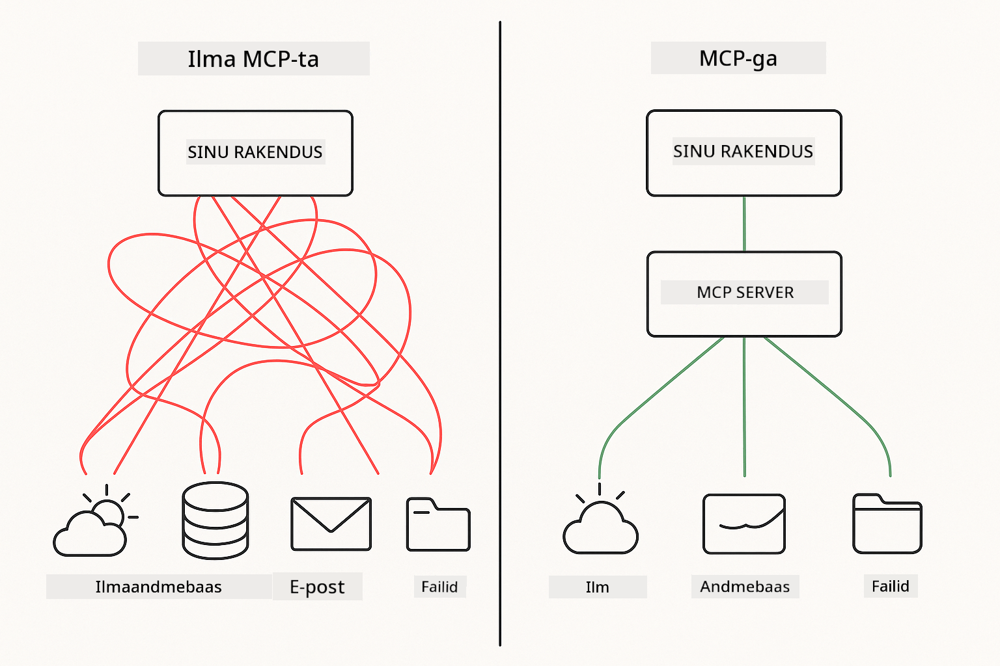

<!--
CO_OP_TRANSLATOR_METADATA:
{
  "original_hash": "c25ec1f10ef156c53e190cdf8b0711ab",
  "translation_date": "2025-12-13T18:12:53+00:00",
  "source_file": "05-mcp/README.md",
  "language_code": "et"
}
-->
# Moodul 05: Mudeli konteksti protokoll (MCP)

## Sisukord

- [Mida sa õpid](../../../05-mcp)
- [MCP mõistmine](../../../05-mcp)
- [Kuidas MCP töötab](../../../05-mcp)
  - [Server-kliendi arhitektuur](../../../05-mcp)
  - [Tööriistade avastamine](../../../05-mcp)
  - [Transpordimehhanismid](../../../05-mcp)
- [Eeltingimused](../../../05-mcp)
- [Mida see moodul katab](../../../05-mcp)
- [Kiire algus](../../../05-mcp)
  - [Näide 1: Kaugkalkulaator (voogedastatav HTTP)](../../../05-mcp)
  - [Näide 2: Failitoimingud (Stdio)](../../../05-mcp)
  - [Näide 3: Git analüüs (Docker)](../../../05-mcp)
- [Põhimõisted](../../../05-mcp)
  - [Transpordi valik](../../../05-mcp)
  - [Tööriistade avastamine](../../../05-mcp)
  - [Sessioonihaldus](../../../05-mcp)
  - [Platvormideülene kaalutlus](../../../05-mcp)
- [Millal kasutada MCP-d](../../../05-mcp)
- [MCP ökosüsteem](../../../05-mcp)
- [Palju õnne!](../../../05-mcp)
  - [Mis edasi?](../../../05-mcp)
- [Tõrkeotsing](../../../05-mcp)

## Mida sa õpid

Oled loonud vestlusliku tehisintellekti, valdanud promptide loomist, sidunud vastused dokumentidega ja loonud agendid tööriistadega. Kuid kõik need tööriistad olid spetsiaalselt sinu rakenduse jaoks kohandatud. Mis siis, kui saaksid anda oma tehisintellektile juurdepääsu standardiseeritud tööriistade ökosüsteemile, mida igaüks saab luua ja jagada?

Mudeli konteksti protokoll (MCP) pakub just seda – standardset viisi AI rakenduste jaoks väliste tööriistade avastamiseks ja kasutamiseks. Selle asemel, et kirjutada iga andmeallika või teenuse jaoks kohandatud integratsioone, ühendud MCP serveritega, mis avaldavad oma võimekuse ühtses formaadis. Sinu AI agent saab siis need tööriistad automaatselt avastada ja kasutada.



*Enne MCP-d: keerulised punkt-punkt integratsioonid. Pärast MCP-d: üks protokoll, lõputud võimalused.*

## MCP mõistmine

MCP lahendab AI arenduses põhiprobleemi: iga integratsioon on kohandatud. Tahad ligi pääseda GitHubile? Kohandatud kood. Tahad faile lugeda? Kohandatud kood. Tahad andmebaasi pärida? Kohandatud kood. Ja ükski neist integratsioonidest ei tööta teiste AI rakendustega.

MCP standardiseerib selle. MCP server avaldab tööriistad selgete kirjelduste ja skeemidega. Iga MCP klient saab ühenduda, avastada saadavalolevad tööriistad ja neid kasutada. Ehita üks kord, kasuta kõikjal.


*Mudeli konteksti protokolli arhitektuur – standardiseeritud tööriistade avastamine ja täitmine*

## Kuidas MCP töötab

**Server-kliendi arhitektuur**

MCP kasutab kliendi-serveri mudelit. Serverid pakuvad tööriistu – failide lugemine, andmebaaside päringud, API-de kutsumine. Kliendid (sinu AI rakendus) ühenduvad serveritega ja kasutavad nende tööriistu.

**Tööriistade avastamine**

Kui sinu klient ühendub MCP serveriga, küsib ta: "Millised tööriistad sul on?" Server vastab saadavalolevate tööriistade nimekirjaga, igaühel kirjeldused ja parameetrite skeemid. Sinu AI agent saab siis otsustada, milliseid tööriistu kasutaja päringu põhjal kasutada.

**Transpordimehhanismid**

MCP määratleb kaks transpordimehhanismi: HTTP kaugserverite jaoks, Stdio kohalike protsesside jaoks (sh Docker konteinerid):


*MCP transpordimehhanismid: HTTP kaugserverite jaoks, Stdio kohalike protsesside jaoks (sh Docker konteinerid)*

**Voogedastatav HTTP** - [StreamableHttpDemo.java](../../../05-mcp/src/main/java/com/example/langchain4j/mcp/StreamableHttpDemo.java)

Kaugserverite jaoks. Sinu rakendus teeb HTTP päringuid serverile, mis töötab kuskil võrgus. Kasutab Server-Sent Events reaalajas suhtluseks.

```java
McpTransport httpTransport = new StreamableHttpMcpTransport.Builder()
    .url("http://localhost:3001/mcp")
    .timeout(Duration.ofSeconds(60))
    .logRequests(true)
    .logResponses(true)
    .build();
```

> **🤖 Proovi [GitHub Copilot](https://github.com/features/copilot) Chatiga:** Ava [`StreamableHttpDemo.java`](../../../05-mcp/src/main/java/com/example/langchain4j/mcp/StreamableHttpDemo.java) ja küsi:
> - "Kuidas erineb MCP otsesest tööriistade integratsioonist nagu Moodulis 04?"
> - "Millised on MCP kasutamise eelised tööriistade jagamisel rakenduste vahel?"
> - "Kuidas käsitled ühenduse katkemisi või aegumisi MCP serveritega?"

**Stdio** - [StdioTransportDemo.java](../../../05-mcp/src/main/java/com/example/langchain4j/mcp/StdioTransportDemo.java)

Kohalike protsesside jaoks. Sinu rakendus käivitab serveri alamprotsessina ja suhtleb standardse sisendi/väljundi kaudu. Kasulik failisüsteemi ligipääsuks või käsurea tööriistade jaoks.

```java
McpTransport stdioTransport = new StdioMcpTransport.Builder()
    .command(List.of(
        npmCmd, "exec",
        "@modelcontextprotocol/server-filesystem@0.6.2",
        resourcesDir
    ))
    .logEvents(false)
    .build();
```

> **🤖 Proovi [GitHub Copilot](https://github.com/features/copilot) Chatiga:** Ava [`StdioTransportDemo.java`](../../../05-mcp/src/main/java/com/example/langchain4j/mcp/StdioTransportDemo.java) ja küsi:
> - "Kuidas Stdio transport töötab ja millal peaksin seda HTTP asemel kasutama?"
> - "Kuidas haldab LangChain4j käivitatud MCP serveriprotsesside elutsüklit?"
> - "Millised on turvariskid, kui anda AI-le juurdepääs failisüsteemile?"

**Docker (kasutab Stdio-d)** - [GitRepositoryAnalyzer.java](../../../05-mcp/src/main/java/com/example/langchain4j/mcp/GitRepositoryAnalyzer.java)

Konteineriseeritud teenuste jaoks. Kasutab stdio transporti suhtlemiseks Docker konteineriga `docker run` kaudu. Sobib keerukate sõltuvuste või isoleeritud keskkondade jaoks.

```java
McpTransport dockerTransport = new StdioMcpTransport.Builder()
    .command(List.of(
        "docker", "run",
        "-e", "GITHUB_PERSONAL_ACCESS_TOKEN=" + System.getenv("GITHUB_TOKEN"),
        "-v", volumeMapping,
        "-i", "mcp/git"
    ))
    .logEvents(true)
    .build();
```

> **🤖 Proovi [GitHub Copilot](https://github.com/features/copilot) Chatiga:** Ava [`GitRepositoryAnalyzer.java`](../../../05-mcp/src/main/java/com/example/langchain4j/mcp/GitRepositoryAnalyzer.java) ja küsi:
> - "Kuidas Docker transport isoleerib MCP serverid ja millised on eelised?"
> - "Kuidas konfigureerida mahu ühendusi andmete jagamiseks hosti ja MCP konteinerite vahel?"
> - "Millised on parimad praktikad Docker-põhiste MCP serverite elutsükli haldamiseks tootmises?"

## Näidete käivitamine

### Eeltingimused

- Java 21+, Maven 3.9+
- Node.js 16+ ja npm (MCP serverite jaoks)
- **Docker Desktop** – peab olema **KÄIVITATUD** Näite 3 jaoks (mitte ainult installitud)
- GitHubi isiklik juurdepääsutoken seadistatud `.env` failis (Moodul 00-st)

> **Märkus:** Kui sa pole veel oma GitHubi tokenit seadistanud, vaata [Moodul 00 - Kiire algus](../00-quick-start/README.md) juhiseid.

> **⚠️ Dockeri kasutajatele:** Enne Näite 3 käivitamist veendu, et Docker Desktop töötab käsuga `docker ps`. Kui näed ühenduse vigu, käivita Docker Desktop ja oota ~30 sekundit initsialiseerimiseks.

## Kiire algus

**VS Code kasutamisel:** Lihtsalt paremklõpsa suvalisel demo failil Exploreri paneelis ja vali **"Run Java"** või kasuta käivituskonfiguratsioone Run and Debug paneelil (veendu, et oled esmalt lisanud oma tokeni `.env` faili).

**Maveni kasutamisel:** Võid ka käsurealt näiteid käivitada allolevate käskudega.

**⚠️ Tähtis:** Mõnel näitel on eeltingimused (nt MCP serveri käivitamine või Docker piltide ehitamine). Kontrolli iga näite nõudeid enne käivitamist.

### Näide 1: Kaugkalkulaator (voogedastatav HTTP)

See demonstreerib võrgupõhist tööriistade integratsiooni.

**⚠️ Eeltingimus:** Pead esmalt käivitama MCP serveri (vt allpool Terminal 1).

**Terminal 1 - MCP serveri käivitamine:**

**Bash:**
```bash
git clone https://github.com/modelcontextprotocol/servers.git
cd servers/src/everything
npm install
node dist/streamableHttp.js
```

**PowerShell:**
```powershell
git clone https://github.com/modelcontextprotocol/servers.git
cd servers/src/everything
npm install
node dist/streamableHttp.js
```

**Terminal 2 - Näite käivitamine:**

**VS Code kasutamisel:** Paremklõpsa `StreamableHttpDemo.java` failil ja vali **"Run Java"**.

**Maveni kasutamisel:**

**Bash:**
```bash
export GITHUB_TOKEN=your_token_here
cd 05-mcp
mvn compile exec:java -Dexec.mainClass=com.example.langchain4j.mcp.StreamableHttpDemo
```

**PowerShell:**
```powershell
$env:GITHUB_TOKEN=your_token_here
cd 05-mcp
mvn --% compile exec:java -Dexec.mainClass=com.example.langchain4j.mcp.StreamableHttpDemo
```

Vaata, kuidas agent avastab saadavalolevad tööriistad ja kasutab kalkulaatorit liitmise tegemiseks.

### Näide 2: Failitoimingud (Stdio)

See demonstreerib kohalikke alamprotsessipõhiseid tööriistu.

**✅ Eeltingimusi pole** – MCP server käivitatakse automaatselt.

**VS Code kasutamisel:** Paremklõpsa `StdioTransportDemo.java` failil ja vali **"Run Java"**.

**Maveni kasutamisel:**

**Bash:**
```bash
export GITHUB_TOKEN=your_token_here
cd 05-mcp
mvn compile exec:java -Dexec.mainClass=com.example.langchain4j.mcp.StdioTransportDemo
```

**PowerShell:**
```powershell
$env:GITHUB_TOKEN=your_token_here
cd 05-mcp
mvn --% compile exec:java -Dexec.mainClass=com.example.langchain4j.mcp.StdioTransportDemo
```

Rakendus käivitab automaatselt failisüsteemi MCP serveri ja loeb kohalikku faili. Pane tähele, kuidas alamprotsessi haldus on sinu eest tehtud.

**Oodatav väljund:**
```
Assistant response: The content of the file is "Kaboom!".
```

### Näide 3: Git analüüs (Docker)

See demonstreerib konteineriseeritud tööriistade servereid.

**⚠️ Eeltingimused:** 
1. **Docker Desktop peab olema KÄIVITATUD** (mitte ainult installitud)
2. **Windowsi kasutajatele:** Soovitatav WSL 2 režiim (Docker Desktop Seaded → Üldine → "Use the WSL 2 based engine"). Hyper-V režiim nõuab käsitsi failijagamise seadistust.
3. Pead esmalt ehitama Docker pildi (vt allpool Terminal 1)

**Kontrolli, kas Docker töötab:**

**Bash:**
```bash
docker ps  # Peaks näitama konteinerite nimekirja, mitte viga
```

**PowerShell:**
```powershell
docker ps  # Peaks näitama konteinerite nimekirja, mitte viga
```

Kui näed viga nagu "Cannot connect to Docker daemon" või "The system cannot find the file specified", käivita Docker Desktop ja oota selle initsialiseerimist (~30 sekundit).

**Tõrkeotsing:**
- Kui AI teatab tühjast repositooriumist või puuduvatest failidest, ei tööta mahu ühendus (`-v`).
- **Windows Hyper-V kasutajatele:** Lisa projekti kataloog Docker Desktop Seaded → Ressursid → Failijagamine ja taaskäivita Docker Desktop.
- **Soovitatav lahendus:** Lülitu WSL 2 režiimile automaatseks failijagamiseks (Seaded → Üldine → lülita sisse "Use the WSL 2 based engine").

**Terminal 1 - Docker pildi ehitamine:**

**Bash:**
```bash
cd servers/src/git
docker build -t mcp/git .
```

**PowerShell:**
```powershell
cd servers/src/git
docker build -t mcp/git .
```

**Terminal 2 - Analüsaatori käivitamine:**

**VS Code kasutamisel:** Paremklõpsa `GitRepositoryAnalyzer.java` failil ja vali **"Run Java"**.

**Maveni kasutamisel:**

**Bash:**
```bash
export GITHUB_TOKEN=your_token_here
cd 05-mcp
mvn compile exec:java -Dexec.mainClass=com.example.langchain4j.mcp.GitRepositoryAnalyzer
```

**PowerShell:**
```powershell
$env:GITHUB_TOKEN=your_token_here
cd 05-mcp
mvn --% compile exec:java -Dexec.mainClass=com.example.langchain4j.mcp.GitRepositoryAnalyzer
```

Rakendus käivitab Docker konteineri, ühendab sinu repositooriumi ja analüüsib repositooriumi struktuuri ja sisu AI agendi kaudu.

## Põhimõisted

**Transpordi valik**

Vali vastavalt tööriistade asukohale:
- Kaugteenused → Voogedastatav HTTP
- Kohalik failisüsteem → Stdio
- Keerukad sõltuvused → Docker

**Tööriistade avastamine**

MCP kliendid avastavad ühendudes automaatselt saadavalolevad tööriistad. Sinu AI agent näeb tööriistade kirjeldusi ja otsustab kasutaja päringu põhjal, milliseid tööriistu kasutada.

**Sessioonihaldus**

Voogedastatav HTTP transpordis hoitakse sessioone, võimaldades olekupõhist suhtlust kaugserveritega. Stdio ja Docker transpordid on tavaliselt olekuta.

**Platvormideülene kaalutlus**

Näited käsitlevad automaatselt platvormide erinevusi (Windows vs Unix käsud, teekonversioonid Dockerile). See on oluline tootmiskeskkondades erinevate platvormide vahel.

## Millal kasutada MCP-d

**Kasuta MCP-d, kui:**
- Tahad kasutada olemasolevaid tööriistade ökosüsteeme
- Ehitate tööriistu, mida kasutavad mitmed rakendused
- Integreerid kolmanda osapoole teenuseid standardsete protokollidega
- Vajad tööriistade rakenduste vahetust ilma koodimuudatusteta

**Kasuta kohandatud tööriistu (Moodul 04), kui:**
- Ehitate rakenduspõhist funktsionaalsust
- Töökindlus on kriitiline (MCP lisab koormust)
- Tööriistad on lihtsad ja neid ei taaskasutata
- Vajad täielikku kontrolli täitmise üle

## MCP ökosüsteem

Mudeli konteksti protokoll on avatud standard kasvava ökosüsteemiga:

- Ametlikud MCP serverid tavapäraste ülesannete jaoks (failisüsteem, Git, andmebaasid)
- Kogukonna panustatud serverid erinevate teenuste jaoks
- Standardiseeritud tööriistade kirjeldused ja skeemid
- Raamistikeülene ühilduvus (töötab iga MCP kliendiga)

See standardiseerimine tähendab, et ühe AI rakenduse jaoks loodud tööriistad töötavad ka teistega, luues jagatud võimekuste ökosüsteemi.

## Palju õnne!

Oled lõpetanud LangChain4j algajate kursuse. Sa oled õppinud:

- Kuidas ehitada vestluslikku AI-d mäluga (Moodul 01)
- Promptide insenerimise mustrid erinevate ülesannete jaoks (Moodul 02)
- Vastuste sidumine dokumentidega RAG abil (Moodul 03)
- AI agentide loomine kohandatud tööriistadega (Moodul 04)
- Standardiseeritud tööriistade integreerimine MCP kaudu (Moodul 05)

Sul on nüüd alus tootmisvalmis AI rakenduste ehitamiseks. Õpitud kontseptsioonid kehtivad sõltumata konkreetsetest raamistikest või mudelitest – need on AI inseneri põhimustrid.

### Mis edasi?

Moodulite lõpetamise järel vaata [Testimise juhendit](../docs/TESTING.md), et näha LangChain4j testimise kontseptsioone praktikas.

**Ametlikud ressursid:**
- [LangChain4j dokumentatsioon](https://docs.langchain4j.dev/) – põhjalikud juhendid ja API viited
- [LangChain4j GitHub](https://github.com/langchain4j/langchain4j) – lähtekood ja näited
- [LangChain4j õpikud](https://docs.langchain4j.dev/tutorials/) – samm-sammult juhendid erinevate kasutusjuhtude jaoks

Täname, et lõpetasid selle kursuse!

---

**Navigeerimine:** [← Eelmine: Moodul 04 - Tööriistad](../04-tools/README.md) | [Tagasi avalehele](../README.md)

---

## Tõrkeotsing

### PowerShelli Maven käsu süntaks
**Probleem**: Maveni käsud ebaõnnestuvad veaga `Unknown lifecycle phase ".mainClass=..."`

**Põhjus**: PowerShell tõlgendab `=` kui muutujale omistamise operaatorit, mis rikub Maveni omaduste süntaksit

**Lahendus**: Kasuta stop-parsing operaatorit `--%` enne Maveni käsku:

**PowerShell:**
```powershell
mvn --% compile exec:java -Dexec.mainClass=com.example.langchain4j.mcp.StreamableHttpDemo
```

**Bash:**
```bash
mvn compile exec:java -Dexec.mainClass=com.example.langchain4j.mcp.StreamableHttpDemo
```

Operaator `--%` ütleb PowerShellile, et kõik ülejäänud argumendid antakse Mavenile täpselt nii edasi ilma tõlgenduseta.

### Dockeri ühenduse probleemid

**Probleem**: Dockeri käsud ebaõnnestuvad veaga "Cannot connect to Docker daemon" või "The system cannot find the file specified"

**Põhjus**: Docker Desktop ei tööta või ei ole täielikult initsialiseeritud

**Lahendus**: 
1. Käivita Docker Desktop
2. Oota ~30 sekundit täielikuks initsialiseerimiseks
3. Kontrolli käsuga `docker ps` (peab näitama konteinerite nimekirja, mitte viga)
4. Seejärel käivita oma näide

### Windowsi Dockeri mahu ühendamine

**Probleem**: Git reposti analüsaator teatab tühjast repost või puuduvatest failidest

**Põhjus**: Mahu ühendus (`-v`) ei tööta failide jagamise seadistuse tõttu

**Lahendus**:
- **Soovitatav:** Lülitu WSL 2 režiimile (Docker Desktop Settings → General → "Use the WSL 2 based engine")
- **Alternatiiv (Hyper-V):** Lisa projekti kataloog Docker Desktop Settings → Resources → File sharing alla, seejärel taaskäivita Docker Desktop

---

<!-- CO-OP TRANSLATOR DISCLAIMER START -->
**Vastutusest loobumine**:
See dokument on tõlgitud kasutades tehisintellektil põhinevat tõlketeenust [Co-op Translator](https://github.com/Azure/co-op-translator). Kuigi püüame tagada täpsust, palun arvestage, et automaatsed tõlked võivad sisaldada vigu või ebatäpsusi. Originaaldokument selle emakeeles tuleks pidada autoriteetseks allikaks. Olulise teabe puhul soovitatakse kasutada professionaalset inimtõlget. Me ei vastuta selle tõlke kasutamisest tulenevate arusaamatuste või valesti mõistmiste eest.
<!-- CO-OP TRANSLATOR DISCLAIMER END -->