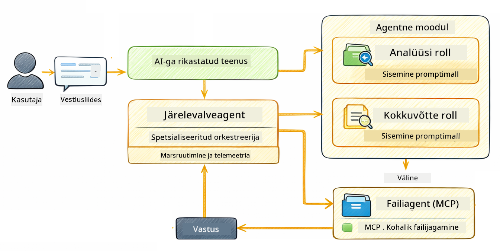

<!--
CO_OP_TRANSLATOR_METADATA:
{
  "original_hash": "f89f4c106d110e4943c055dd1a2f1dff",
  "translation_date": "2025-12-31T07:13:04+00:00",
  "source_file": "05-mcp/README.md",
  "language_code": "et"
}
-->
# Moodul 05: Mudeli konteksti protokoll (MCP)

## Table of Contents

- [Mida Sa Õpid](../../../05-mcp)
- [Mis on MCP?](../../../05-mcp)
- [Kuidas MCP Töötleb](../../../05-mcp)
- [Agentne Moodul](../../../05-mcp)
- [Näidete Käivitamine](../../../05-mcp)
  - [Eeltingimused](../../../05-mcp)
- [Kiirkäivitus](../../../05-mcp)
  - [Failioperatsioonid (Stdio)](../../../05-mcp)
  - [Järelevalveagent](../../../05-mcp)
    - [Väljundi Mõistmine](../../../05-mcp)
    - [Agentse Mooduli Funktsioonide Selgitus](../../../05-mcp)
- [Põhikontseptsioonid](../../../05-mcp)
- [Õnnitleme!](../../../05-mcp)
  - [Mis Järgmine?](../../../05-mcp)

## What You'll Learn

Oled ehitanud vestlusliku tehisintellekti, valda promptide koostamist, sidunud vastused dokumentidega ja loonud tööriistadega agente. Kuid need kõik olid kohandatud sinu konkreetse rakenduse jaoks. Mis oleks, kui saaksid anda oma tehisintellektile ligipääsu standardiseeritud tööriistade ökosüsteemile, mida igaüks saab luua ja jagada? Selles moodulis õpid just seda — Model Context Protocol (MCP) ja LangChain4j agentse mooduli abil. Alguses näitame lihtsat MCP faililugejat ja seejärel demonstreerime, kuidas seda hõlpsasti integreerida keerukamatesse agentsetesse töövoogudesse, kasutades Supervisor Agenti mustrit.

## What is MCP?

Model Context Protocol (MCP) pakub täpselt seda — standardset viisi, kuidas AI-rakendused saavad avastada ja kasutada väliseid tööriistu. Kohandatud integratsioonide kirjutamise asemel iga andmeallika või teenuse jaoks ühendud MCP serveritega, mis esitavad oma võimekused ühtsel kujul. Sinu AI-agent saab siis need tööriistad automaatselt avastada ja kasutada.


*Enne MCP-d: keerukad punkt-punkt integreeringud. Pärast MCP-d: üks protokoll, lõputud võimalused.*

MCP lahendab AI arenduse põhiprobleemi: iga integratsioon on kohandatud. Tahad ligi pääseda GitHubile? Kohandatud kood. Tahad lugeda faile? Kohandatud kood. Tahad pärida andmebaasi? Kohandatud kood. Ja ükski neist integratsioonidest ei tööta teiste AI-rakendustega.

MCP standardiseerib selle. MCP server esitab tööriistad koos selgete kirjelduste ja skeemidega. Igas MCP kliendis saab ühendada, avastada saadaval olevad tööriistad ja neid kasutada. Ehita üks kord, kasuta kõikjal.


*Mudeli konteksti protokolli arhitektuur — standardiseeritud tööriistade avastamine ja täitmine*

## How MCP Works

**Server-Klient Arhitektuur**

MCP kasutab kliendi-serveri mudelit. Serverid pakuvad tööriistu — failide lugemine, andmebaasi päringud, API-de kutsumine. Kliendid (sinu AI-rakendus) ühenduvad serveritega ja kasutavad nende tööriistu.

To use MCP with LangChain4j, add this Maven dependency:

```xml
<dependency>
    <groupId>dev.langchain4j</groupId>
    <artifactId>langchain4j-mcp</artifactId>
    <version>${langchain4j.version}</version>
</dependency>
```

**Tool Discovery**

Kui sinu klient ühendub MCP serveriga, küsib see "Millised tööriistad teil on?" Server vastab saadaval olevate tööriistade nimekirjaga, igaühel kirjelduse ja parameetrite skeemiga. Sinu AI-agent saab siis otsustada, milliseid tööriistu kasutada kasutaja päringu põhjal.

**Edastusmehhanismid**

MCP toetab erinevaid edastusmehhanisme. See moodul demonstreerib Stdio transpordimehhanismi kohalike protsesside jaoks:


*MCP edastusmehhanismid: HTTP kaugserverite jaoks, Stdio kohalike protsesside jaoks*

**Stdio** - [StdioTransportDemo.java](../../../05-mcp/src/main/java/com/example/langchain4j/mcp/StdioTransportDemo.java)

Kohalike protsesside jaoks. Sinu rakendus alustab serverit alamprotsessina ja suhtleb standardse sisendi/väljundi kaudu. Kasulik failisüsteemi juurdepääsu või käsureatööriistade jaoks.

```java
McpTransport stdioTransport = new StdioMcpTransport.Builder()
    .command(List.of(
        npmCmd, "exec",
        "@modelcontextprotocol/server-filesystem@2025.12.18",
        resourcesDir
    ))
    .logEvents(false)
    .build();
```

> **🤖 Proovi [GitHub Copilot](https://github.com/features/copilot) Chat'iga:** Ava [`StdioTransportDemo.java`](../../../05-mcp/src/main/java/com/example/langchain4j/mcp/StdioTransportDemo.java) ja küsi:
> - "Kuidas Stdio transpordimehhanism töötab ja millal peaksin seda HTTP-ga asemel kasutama?"
> - "Kuidas LangChain4j haldab MCP serveri alamprotsesside elutsüklit?"
> - "Millised on turvariskid, kui anda AI-le juurdepääs failisüsteemile?"

## The Agentic Module

Kuigi MCP pakub standardiseeritud tööriistu, annab LangChain4j **agentne moodul** deklaratiivse viisi agentide ehitamiseks, mis orkestreerivad neid tööriistu. `@Agent` annotatsioon ja `AgenticServices` võimaldavad määratleda agendi käitumist liidestena, mitte imperatiivse koodina.

Selles moodulis uurid **Supervisor Agenti** mustrit — täiustatud agentne AI lähenemine, kus "järelevalve" agent dünaamiliselt otsustab, milliseid alaagente kutsuda kasutaja päringu põhjal. Ühendame mõlemad kontseptsioonid, andes ühele meie alaagentidest MCP-toega failisüsteemi ligipääsu.

To use the agentic module, add this Maven dependency:

```xml
<dependency>
    <groupId>dev.langchain4j</groupId>
    <artifactId>langchain4j-agentic</artifactId>
    <version>${langchain4j.mcp.version}</version>
</dependency>
```

> **⚠️ Eksperimentaalne:** `langchain4j-agentic` moodul on **eksperimentaalne** ja võib muutuda. Stabiilne viis AI-assistentide ehitamiseks jääb `langchain4j-core` koos kohandatud tööriistadega (Moodul 04).

## Running the Examples

### Eeltingimused

- Java 21+, Maven 3.9+
- Node.js 16+ ja npm (MCP serverite jaoks)
- Keskkonnamuutujad seadistatud `.env` faili (juurkaustast):
  - **For StdioTransportDemo:** `GITHUB_TOKEN` (GitHub Personal Access Token)
  - **For SupervisorAgentDemo:** `AZURE_OPENAI_ENDPOINT`, `AZURE_OPENAI_API_KEY`, `AZURE_OPENAI_DEPLOYMENT` (nagu Moodulites 01-04)

> **Märkus:** Kui sa pole veel seadistanud oma keskkonnamuutujaid, vaata juhiseid [Module 00 - Quick Start](../00-quick-start/README.md) lehelt, või kopeeri `.env.example` faili nimega `.env` juurkausta ja täida oma väärtused.

## Quick Start

**VS Code'i kasutamine:** Paremklõpsa suvalisel demo failil Explorer'is ja vali **"Run Java"**, või kasuta Run and Debug paneelilt launch konfiguratsioone (veendu, et oled esmalt lisanud oma tokeni `.env` faili).

**Maveniga:** Alternatiivselt võid käivitada käskudega allpool.

### File Operations (Stdio)

See demonstreerib kohalikke alamprotsessipõhiseid tööriistu.

**✅ Eeltingimusi pole vaja** - MCP server käivitatakse automaatselt.

**VS Code'i kasutamine:** Paremklõpsa `StdioTransportDemo.java` ja vali **"Run Java"**.

**Maveniga:**

**Bash:**
```bash
export GITHUB_TOKEN=your_token_here
cd 05-mcp
mvn compile exec:java -Dexec.mainClass=com.example.langchain4j.mcp.StdioTransportDemo
```

**PowerShell:**
```powershell
$env:GITHUB_TOKEN=your_token_here
cd 05-mcp
mvn --% compile exec:java -Dexec.mainClass=com.example.langchain4j.mcp.StdioTransportDemo
```

Rakendus käivitab automaatselt failisüsteemi MCP serveri ja loeb kohaliku faili. Pööra tähelepanu, kuidas alamprotsessi haldus on sinu eest ära tehtud.

**Oodatav väljund:**
```
Assistant response: The file provides an overview of LangChain4j, an open-source Java library
for integrating Large Language Models (LLMs) into Java applications...
```

### Supervisor Agent




**Supervisor Agenti muster** on **paindlik** agentse AI vorm. Erinevalt deterministlikest töövoogudest (järjestikuline, tsükkel, paralleelne), kasutab Järelevalve LLM-i, et autonoomselt otsustada, milliseid agente kutsuda vastavalt kasutaja päringule.

**Järelevalve ja MCP kombineerimine:** Selles näites anname `FileAgent`-ile juurdepääsu MCP failisüsteemi tööriistadele läbi `toolProvider(mcpToolProvider)`. Kui kasutaja palub "lugeda ja analüüsida faili", analüüsib Järelevalve päringu ja genereerib täitmiskava. See suunab päringu `FileAgent`-ile, mis kasutab MCP `read_file` tööriista sisu toomiseks. Järelevalve edastab selle sisu `AnalysisAgent`-ile tõlgendamiseks ja vajadusel kutsub `SummaryAgent`-i tulemuste kokkusurumiseks.

See demonstreerib, kuidas MCP tööriistad integreeruvad sujuvalt agentsetesse töövoogudesse — Järelevalve ei pea teadma, KUIDAS faile loetakse, vaid lihtsalt, et `FileAgent` saab seda teha. Järelevalve kohandub dünaamiliselt erinevat tüüpi päringutega ja tagastab kas viimase agendi vastuse või kõigi operatsioonide kokkuvõtte.

**Start skriptide kasutamine (Soovitatav):**

Start skriptid laadivad automaatselt keskkonnamuutujad juurkausta `.env` failist:

**Bash:**
```bash
cd 05-mcp
chmod +x start.sh
./start.sh
```

**PowerShell:**
```powershell
cd 05-mcp
.\start.ps1
```

**VS Code'i kasutamine:** Paremklõpsa `SupervisorAgentDemo.java` ja vali **"Run Java"** (veendu, et sinu `.env` fail on seadistatud).

**Kuidas Järelevalve töötab:**

```java
// Määratle mitu agenti konkreetsete võimetega
FileAgent fileAgent = AgenticServices.agentBuilder(FileAgent.class)
        .chatModel(model)
        .toolProvider(mcpToolProvider)  // Omab MCP tööriistu failitoiminguteks
        .build();

AnalysisAgent analysisAgent = AgenticServices.agentBuilder(AnalysisAgent.class)
        .chatModel(model)
        .build();

SummaryAgent summaryAgent = AgenticServices.agentBuilder(SummaryAgent.class)
        .chatModel(model)
        .build();

// Loo järelevalvaja, mis orkestreerib neid agente
SupervisorAgent supervisor = AgenticServices.supervisorBuilder()
        .chatModel(model)  // Mudel "planner"
        .subAgents(fileAgent, analysisAgent, summaryAgent)
        .responseStrategy(SupervisorResponseStrategy.SUMMARY)
        .build();

// Järelevalvaja otsustab autonoomselt, milliseid agente kutsuda
// Lihtsalt edasta loomulikus keeles päring - LLM planeerib täitmise
String response = supervisor.invoke("Read the file at /path/file.txt and analyze it");
```

Vaata täielikku implementatsiooni failist [SupervisorAgentDemo.java](../../../05-mcp/src/main/java/com/example/langchain4j/mcp/SupervisorAgentDemo.java).

> **🤖 Proovi [GitHub Copilot](https://github.com/features/copilot) Chat'iga:** Ava [`SupervisorAgentDemo.java`](../../../05-mcp/src/main/java/com/example/langchain4j/mcp/SupervisorAgentDemo.java) ja küsi:
> - "Kuidas Järelevalve otsustab, milliseid agente kutsuda?"
> - "Mis vahe on Järelevalve ja järjestikulise töövoo mustri vahel?"
> - "Kuidas saan kohandada Järelevalve planeerimis käitumist?"

#### Väljundi Mõistmine

Kui sa käivitad demo, näed struktureeritud samm-sammult läbikäiku, kuidas Järelevalve orkestreerib mitut agenti. Siin on, mida iga sektsioon tähendab:

```
======================================================================
  SUPERVISOR AGENT DEMO
======================================================================

This demo shows how a Supervisor Agent orchestrates multiple specialized agents.
The Supervisor uses an LLM to decide which agent to call based on the task.
```

**Päis** tutvustab demo ja selgitab põhikontsepti: Järelevalve kasutab LLM-i (mitte kõvasti kodeeritud reegleid), et otsustada, milliseid agente kutsuda.

```
--- AVAILABLE AGENTS -------------------------------------------------
  [FILE]     FileAgent     - Reads files using MCP filesystem tools
  [ANALYZE]  AnalysisAgent - Analyzes content for structure, tone, and themes
  [SUMMARY]  SummaryAgent  - Creates concise summaries of content
```

**Saadaval olevad Agendid** näitab kolme spetsialiseeritud agenti, mida Järelevalve võib valida. Iga agent omab spetsiifilist võimekust:
- **FileAgent** suudab lugeda faile, kasutades MCP tööriistu (välised võimekused)
- **AnalysisAgent** analüüsib sisu (puhtalt LLM-i võimekus)
- **SummaryAgent** koostab kokkuvõtteid (puhtalt LLM-i võimekus)

```
--- USER REQUEST -----------------------------------------------------
  "Read the file at .../file.txt and analyze what it's about"
```

**Kasutaja Päring** näitab, mida küsiti. Järelevalve peab selle parsimiseks ja otsustama, milliseid agente kutsuda.

```
--- SUPERVISOR ORCHESTRATION -----------------------------------------
  The Supervisor will now decide which agents to invoke and in what order...

  +-- STEP 1: Supervisor chose -> FileAgent (reading file via MCP)
  |
  |   Input: .../file.txt
  |
  |   Result: LangChain4j is an open-source Java library designed to simplify...
  +-- [OK] FileAgent (reading file via MCP) completed

  +-- STEP 2: Supervisor chose -> AnalysisAgent (analyzing content)
  |
  |   Input: LangChain4j is an open-source Java library...
  |
  |   Result: Structure: The content is organized into clear paragraphs that int...
  +-- [OK] AnalysisAgent (analyzing content) completed
```

**Järelevalve Orkestreerimine** on koht, kus võlu juhtub. Vaata, kuidas:
1. Järelevalve **valis esmalt FileAgent'i**, sest päring mainis "loe faili"
2. FileAgent kasutas MCP `read_file` tööriista faili sisu toomiseks
3. Seejärel **valis Järelevalve AnalysisAgent'i** ja edastas failisisu sellele
4. AnalysisAgent analüüsis struktuuri, tooni ja teemasid

Märka, et Järelevalve tegi need otsused **autonoomselt** kasutaja päringu põhjal — pole kõvasti kodeeritud töövoogu!

**Lõplik Vastus** on Järelevalve sünteesitud vastus, mis kombineerib kõigi kutsutud agentide väljundid. Näide väljastab agentse ulatuse, näidates kokkuvõtet ja analüüsi tulemusi, mida iga agent talletas.

```
--- FINAL RESPONSE ---------------------------------------------------
I read the contents of the file and analyzed its structure, tone, and key themes.
The file introduces LangChain4j as an open-source Java library for integrating
large language models...

--- AGENTIC SCOPE (Shared Memory) ------------------------------------
  Agents store their results in a shared scope for other agents to use:
  * summary: LangChain4j is an open-source Java library...
  * analysis: Structure: The content is organized into clear paragraphs that in...
```

### Agentse Mooduli Funktsioonide Selgitus

Näide demonstreerib mitmeid agentse mooduli täiustatud funktsioone. Vaatame lähemalt Agentic Scope'i ja Agent Listeners'i.

**Agenti Ulatus** näitab jagatud mälu, kuhu agentid salvestasid oma tulemused kasutades `@Agent(outputKey="...")`. See võimaldab:
- Hilisematel agentidel pääseda ligi varasemate agentide väljunditele
- Järelevalve sünteesida lõpliku vastuse
- Sul inspekteerida, mida iga agent tootis

```java
ResultWithAgenticScope<String> result = supervisor.invokeWithAgenticScope(request);
AgenticScope scope = result.agenticScope();
String story = scope.readState("story");
List<AgentInvocation> history = scope.agentInvocations("analysisAgent");
```

**Agenti Kuulajad** võimaldavad agentide täitmise jälgimist ja silumist. Demo samm-sammult väljund tuleb AgentListener'ist, mis ühendub iga agendi kutsumisega:
- **beforeAgentInvocation** - Kutsutakse, kui Järelevalve valib agendi, võimaldades näha, milline agent valiti ja miks
- **afterAgentInvocation** - Kutsutakse, kui agent lõpetab, kuvades selle tulemuse
- **inheritedBySubagents** - Kui true, jälgib kuulaja kõiki hierarhias olevaid agente

```java
AgentListener monitor = new AgentListener() {
    private int step = 0;
    
    @Override
    public void beforeAgentInvocation(AgentRequest request) {
        step++;
        System.out.println("  +-- STEP " + step + ": " + request.agentName());
    }
    
    @Override
    public void afterAgentInvocation(AgentResponse response) {
        System.out.println("  +-- [OK] " + response.agentName() + " completed");
    }
    
    @Override
    public boolean inheritedBySubagents() {
        return true; // Levita kõigile alamagentidele
    }
};
```

Lisaks Järelevalve mustrile pakub `langchain4j-agentic` moodul mitmeid võimsaid töövoo mustreid ja funktsioone:

| Muster | Kirjeldus | Kasutusjuhtum |
|--------|-----------|---------------|
| **Sequential** | Käivita agentid järjest, väljund liigub järgmisele | Torud: uurimus → analüüs → aruanne |
| **Parallel** | Käivita agentid samaaegselt | Sõltumatud ülesanded: ilm + uudised + aktsiaturg |
| **Loop** | Korda kuni tingimus on täidetud | Kvaliteediskoorimine: täiusta kuni skoor ≥ 0.8 |
| **Conditional** | Marsruudi põhjal | Klassifitseeri → suuna spetsialistile |
| **Human-in-the-Loop** | Lisa inimkontrollpunkte | Heakskiidu töövood, sisu ülevaatus |

## Key Concepts

**MCP** on ideaalne, kui soovid ära kasutada olemasolevaid tööriistade ökosüsteeme, ehitada tööriistu, mida mitu rakendust saab ühiskasutusse anda, integreerida kolmanda osapoole teenuseid standardsete protokollidega või vahetada tööriistade implementeerimisi ilma koodi muutmata.

**Agentne Moodul** töötab kõige paremini, kui soovid deklaratiivseid agendi definitsioone `@Agent` annotatsioonidega, vajad töövoo orkestreerimist (järjestikuline, tsükkel, paralleel), eelistad liidese-põhist agendi disaini imperatiivse koodi asemel või kombineerid mitut agenti, mis jagavad väljundeid `outputKey` kaudu.

**Järelevalve Agendi muster** paistab silma, kui töövoog pole eelnevalt ennustatav ja soovid, et LLM otsustaks, kui sul on mitu spetsialiseeritud agenti, mis vajavad dünaamilist orkestreerimist, kui ehitad vestlussüsteeme, mis suunavad erinevatele võimekustele, või kui tahad kõige paindlikumat, adaptiivset agendi käitumist.

## Congratulations!

Oled lõpetanud LangChain4j for Beginners kursuse. Sa õppisid:

- Kuidas ehitada vestluslikku tehisintellekti koos mäluga (Moodul 01)
- Promptimise mustrid erinevate ülesannete jaoks (Moodul 02)
- Vastuste sidumine oma dokumentidega RAG abil (Moodul 03)
- Põhioskuste loomine AI-agentide (abiliste) loomiseks koos kohandatud tööriistadega (Moodul 04)
- Standardiseeritud tööriistade integreerimine LangChain4j MCP ja Agentic moodulitega (Moodul 05)

### Mis järgmiseks?

Pärast moodulite lõpetamist uurige [Testimisjuhendit](../docs/TESTING.md), et näha LangChain4j testimise kontseptsioone praktikas.

**Ametlikud ressursid:**
- [LangChain4j dokumentatsioon](https://docs.langchain4j.dev/) - Põhjalikud juhendid ja API-viide
- [LangChain4j GitHub](https://github.com/langchain4j/langchain4j) - Allikakood ja näited
- [LangChain4j õpetused](https://docs.langchain4j.dev/tutorials/) - Samm-sammult õpetused erinevate kasutusjuhtude jaoks

Täname selle kursuse lõpetamise eest!

---

**Navigatsioon:** [← Eelmine: Moodul 04 - Tööriistad](../04-tools/README.md) | [Tagasi põhilehele](../README.md)

---

<!-- CO-OP TRANSLATOR DISCLAIMER START -->
Lahtiütlus:
See dokument on tõlgitud tehisintellektil põhineva tõlketeenuse [Co-op Translator](https://github.com/Azure/co-op-translator) abil. Kuigi püüame tagada täpsust, tuleb arvestada, et automaatsed tõlked võivad sisaldada vigu või ebatäpsusi. Originaaldokument selle algkeeles tuleks pidada autoriteetseks allikaks. Kriitilise teabe puhul soovitatakse kasutada professionaalset inimtõlget. Me ei vastuta käesoleva tõlke kasutamisest tulenevate arusaamatuste ega valesti tõlgendamiste eest.
<!-- CO-OP TRANSLATOR DISCLAIMER END -->