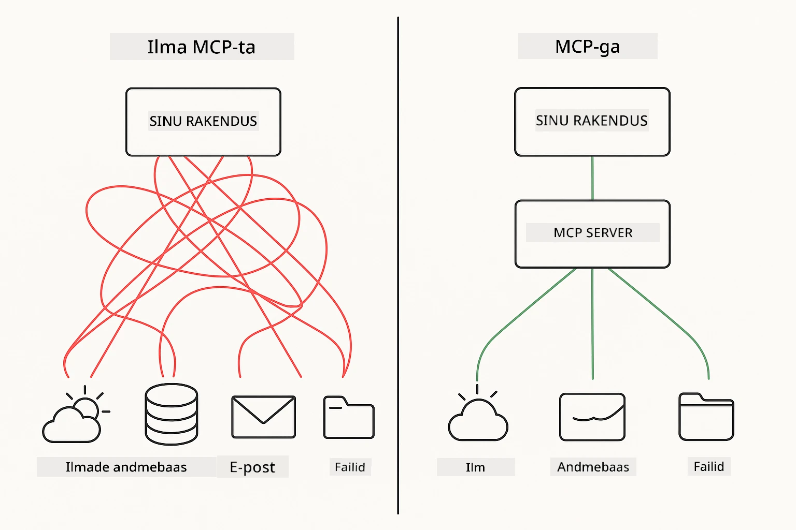
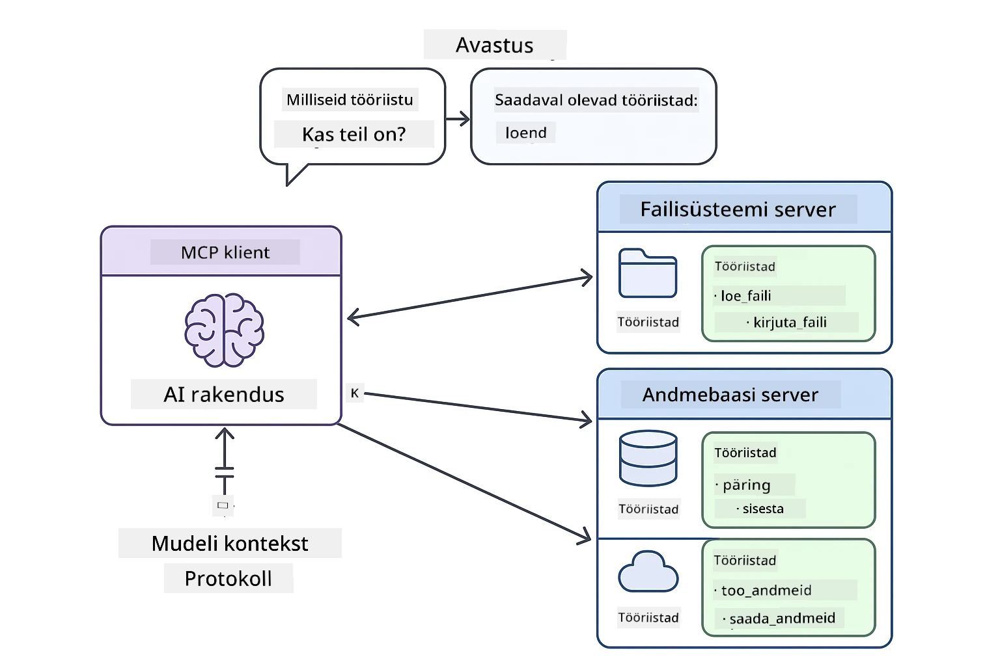
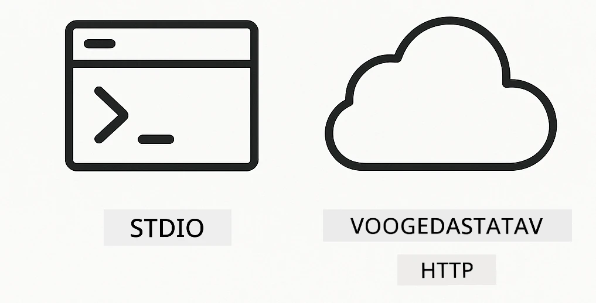
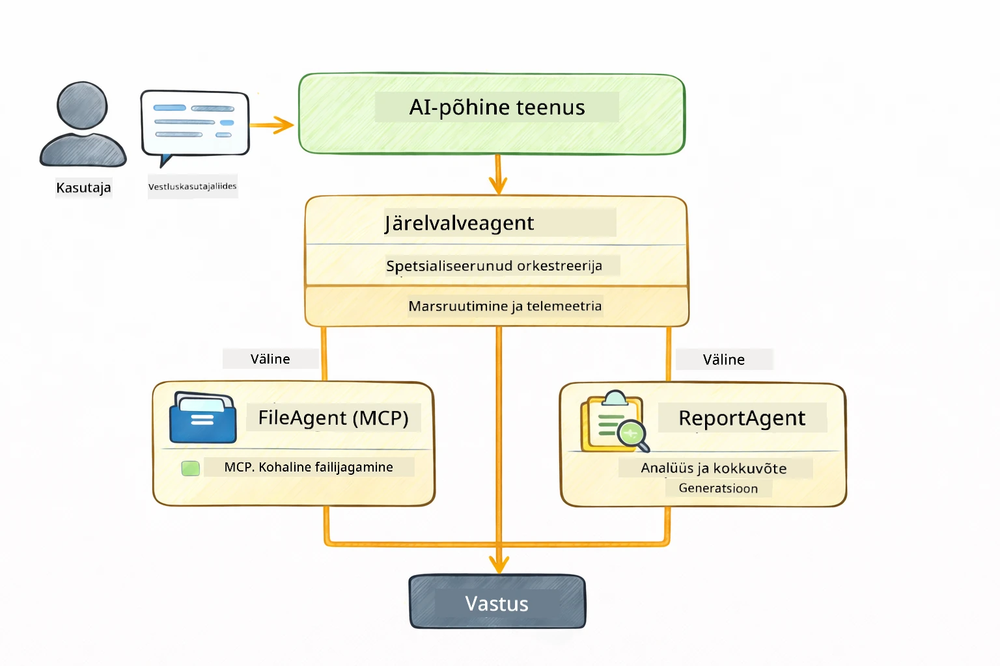

# Moodul 05: Mudeli Konteksti Protokoll (MCP)

## Sisukord

- [Mida Sa Õpid](../../../05-mcp)
- [Mis On MCP?](../../../05-mcp)
- [Kuidas MCP Töötab](../../../05-mcp)
- [Agentne Moodul](../../../05-mcp)
- [Näidete Käivitamine](../../../05-mcp)
  - [Eeltingimused](../../../05-mcp)
- [Kiire Algus](../../../05-mcp)
  - [Failioperatsioonid (Stdio)](../../../05-mcp)
  - [Järelevalve Agent](../../../05-mcp)
    - [Väljundi Mõistmine](../../../05-mcp)
    - [Vastusstrateegiad](../../../05-mcp)
    - [Agentse Mooduli Funktsioonide Selgitus](../../../05-mcp)
- [Põhimõisted](../../../05-mcp)
- [Palju Õnne!](../../../05-mcp)
  - [Mis Järgmine?](../../../05-mcp)

## Mida Sa Õpid

Oled loonud vestlusliku tehisintellekti, valdad sõelujaid, sidunud vastused dokumentidega ja loonud agentide tööriistu. Kuid kõik need tööriistad olid spetsiaalselt sinu rakenduse jaoks kohandatud. Mis juhtuks, kui saaksid anda oma tehisintellektile ligipääsu standardiseeritud tööriistade ökosüsteemile, mida igaüks saab luua ja jagada? Selles moodulis õpidki, kuidas teha just nii Model Context Protocoli (MCP) ja LangChain4j agentse mooduli abil. Esiteks tutvustame lihtsat MCP faililugejat ja seejärel näitame, kuidas see sujuvalt ühineb arenenud agentse töövoogudega, kasutades Järelevalve Agendi mustrit.

## Mis On MCP?

Model Context Protocol (MCP) pakub just seda — standardset viisi, kuidas AI rakendused leiavad ja kasutavad väliseid tööriistu. Selle asemel, et kirjutada iga andmeallika või teenuse jaoks eraldi integratsioon, ühendad MCP serveritega, mis avaldavad oma võimekuse ühtses formaadis. Sinu AI agent saab neid tööriistu siis automaatselt avastada ja kasutada.



*Enne MCP-d: keerulised otsast-otsani integratsioonid. Pärast MCP-d: üks protokoll, lõputud võimalused.*

MCP lahendab AI arenduse põhiprobleemi: iga integratsioon on käsitsi kohandatud. Tahad ligipääsu GitHubile? Kohandatud kood. Tahad faile lugeda? Kohandatud kood. Tahad andmebaasipäringuid teha? Kohandatud kood. Ja ükski neist integratsioonidest ei tööta teiste AI rakendustega.

MCP standardiseerib selle. MCP server avaldab tööriistu selgete kirjelduse ja skeemidega. Igal MCP kliendil on võimalik ühenduda, avastada olemasolevaid tööriistu ja neid kasutada. Loo üks kord, kasuta kõikjal.



*Model Context Protocoli arhitektuur – standardiseeritud tööriistade avastamine ja käivitamine*

## Kuidas MCP Töötab

**Server-Klient Arhitektuur**

MCP kasutab klient-server mudelit. Serverid pakuvad tööriistu – failide lugemine, andmebaaside päringud, API kutseid. Kliendid (sinu AI rakendus) ühenduvad serveritega ja kasutavad nende tööriistu.

MCP kasutamiseks koos LangChain4j-ga lisa see Maven sõltuvus:

```xml
<dependency>
    <groupId>dev.langchain4j</groupId>
    <artifactId>langchain4j-mcp</artifactId>
    <version>${langchain4j.version}</version>
</dependency>
```

**Tööriistade Avastamine**

Kui su klient ühendub MCP serveriga, küsib ta: "Millised tööriistad sul olemas on?" Server vastab nimekirjaga saadaval olevatest tööriistadest, igaühe kirjelduste ja parameetrite skeemidega. Sinu AI agent saab seejärel otsustada, milliseid tööriistu kasutusele võtta vastavalt kasutaja päringule.

**Transportmehhanismid**

MCP toetab erinevaid transpordimehhanisme. See moodul demonstreerib Stdio transporti kohalike protsesside puhul:



*MCP transpordimehhanismid: HTTP kaugserverite jaoks, Stdio kohalike protsesside jaoks*

**Stdio** - [StdioTransportDemo.java](../../../05-mcp/src/main/java/com/example/langchain4j/mcp/StdioTransportDemo.java)

Kohalike protsesside jaoks. Sinu rakendus käivitab serveri alamprotsessina ja suhtleb standardse sisendi/väljundi kaudu. Kasulik failisüsteemi ligipääsuks või käsureatööriistade jaoks.

```java
McpTransport stdioTransport = new StdioMcpTransport.Builder()
    .command(List.of(
        npmCmd, "exec",
        "@modelcontextprotocol/server-filesystem@2025.12.18",
        resourcesDir
    ))
    .logEvents(false)
    .build();
```

> **🤖 Proovi koos [GitHub Copilot](https://github.com/features/copilot) Chat'iga:** Ava [`StdioTransportDemo.java`](../../../05-mcp/src/main/java/com/example/langchain4j/mcp/StdioTransportDemo.java) ja küsi:
> - "Kuidas Stdio transport töötab ja millal tuleks seda kasutada võrreldes HTTP-ga?"
> - "Kuidas haldab LangChain4j MCP serveriprotsesside elutsüklit?"
> - "Millised on turvariskid, kui anda AI-le ligipääs failisüsteemile?"

## Agentne Moodul

Kuigi MCP pakub standardiseeritud tööriistu, annab LangChain4j **agentne moodul** deklaratiivse viisi agentide loomiseks, kes neid tööriistu orkestreerivad. `@Agent` annotatsioon ja `AgenticServices` võimaldavad määratleda agendi käitumist liideste kaudu, mitte imperatiivse koodina.

Selles moodulis uurid **Järelevalve Agendi** mustrit — arenenud agentne AI lähenemine, kus "järelevalve" agent otsustab dünaamiliselt, milliseid alaagente käivitada vastavalt kasutaja päringule. Ühendame need mõlemad, andes ühele meie alaagentidest MCP-toega failide lugemise võimekuse.

Agentse mooduli kasutamiseks lisa see Maven sõltuvus:

```xml
<dependency>
    <groupId>dev.langchain4j</groupId>
    <artifactId>langchain4j-agentic</artifactId>
    <version>${langchain4j.mcp.version}</version>
</dependency>
```

> **⚠️ Eksperimentaalne:** `langchain4j-agentic` moodul on **eksperimentaalne** ja võib muutuda. Stabiilne viis AI assistentide ehitamiseks on endiselt `langchain4j-core` koos kohandatud tööriistadega (Moodul 04).

## Näidete Käivitamine

### Eeltingimused

- Java 21+, Maven 3.9+
- Node.js 16+ ja npm (MCP serverite jaoks)
- Keskkonnamuutujad seadistatud `.env` failis (juurkataloogist):
  - `AZURE_OPENAI_ENDPOINT`, `AZURE_OPENAI_API_KEY`, `AZURE_OPENAI_DEPLOYMENT` (nagu Moodulites 01-04)

> **Märkus:** Kui pole keskkonnamuutujaid veel seadistanud, vaata [Moodul 00 - Kiire Algus](../00-quick-start/README.md) juhiseid või kopeeri `.env.example` `.env`-iks juurkataloogis ja täida enda andmed.

## Kiire Algus

**VS Code kasutamine:** Paremklõpsa Exploreris mis tahes demo failil ja vali **"Run Java"** või kasuta Run and Debug paneeli käivituskonfiguratsioone (eeldades, et oled esmalt lisanud oma tokeni `.env` faili).

**Maveni kasutamine:** Alternatiivselt võid käivitada käsurealt järgmiste näidetega.

### Failioperatsioonid (Stdio)

See demonstreerib kohalikke alamprotsessidel põhinevaid tööriistu.

**✅ Eeltingimused puuduvad** - MCP server käivitatakse automaatselt.

**Käivituskriptide kasutamine (Soovitatav):**

Käivitusskriptid laadivad automaatselt keskkonnamuutujad juurkataloogi `.env` failist:

**Bash:**
```bash
cd 05-mcp
chmod +x start-stdio.sh
./start-stdio.sh
```

**PowerShell:**
```powershell
cd 05-mcp
.\start-stdio.ps1
```

**VS Code kasutamine:** Paremklõpsa `StdioTransportDemo.java` failil ja vali **"Run Java"** (kontrolli, et su `.env` fail on korras).

Rakendus käivitab automaatselt failisüsteemi MCP serveri ja loeb kohaliku faili. Pane tähele, kuidas alamprotsessi haldus on sinu eest tehtud.

**Oodatav väljund:**
```
Assistant response: The file provides an overview of LangChain4j, an open-source Java library
for integrating Large Language Models (LLMs) into Java applications...
```

### Järelevalve Agent

**Järelevalve Agendi mustrit** iseloomustab **paindlik** agentne AI vorm. Järelevalve kasutab LLM-i autonoomselt otsustamaks, milliseid agente käivitada vastavalt kasutaja päringule. Järgmises näites ühendame MCP-toega faililuugimise LLM agentiga, luues järelevalve all toimiva faili lugemise → aruande töövoo.

Demos loeb `FileAgent` faili MCP failisüsteemi tööriistade abil ja `ReportAgent` genereerib struktureeritud aruande juhtkokkuvõtte (1 lause), 3 võtmekohaga ja soovitustega. Järelevalve orkestreerib selle töövoo automaatselt:



```
┌─────────────┐      ┌──────────────┐
│  FileAgent  │ ───▶ │ ReportAgent  │
│ (MCP tools) │      │  (pure LLM)  │
└─────────────┘      └──────────────┘
   outputKey:           outputKey:
  'fileContent'         'report'
```

Iga agent salvestab väljundi **Agentse Ulatusesse** (jagunatud mällu), võimaldades järgmiste agentide ligipääsu eelnevatele tulemustele. See demonstreerib, kuidas MCP tööriistad integreeruvad voolavalt agentsetesse töövoogudesse — Järelevalve ei pea teadma *kuidas* faile loetakse, vaid ainult, et `FileAgent` suudab seda teha.

#### Demo Käivitamine

Käivitusskriptid laadivad automaatselt keskkonnamuutujad juurkataloogi `.env` failist:

**Bash:**
```bash
cd 05-mcp
chmod +x start-supervisor.sh
./start-supervisor.sh
```

**PowerShell:**
```powershell
cd 05-mcp
.\start-supervisor.ps1
```

**VS Code kasutamine:** Paremklõpsa `SupervisorAgentDemo.java` failil ja vali **"Run Java"** (kontrolli, et su `.env` fail on korras).

#### Kuidas Järelevalve Töötab

```java
// Samm 1: FileAgent loeb faile kasutades MCP tööriistu
FileAgent fileAgent = AgenticServices.agentBuilder(FileAgent.class)
        .chatModel(model)
        .toolProvider(mcpToolProvider)  // Omab MCP tööriistu failitoiminguteks
        .build();

// Samm 2: ReportAgent genereerib struktureeritud aruandeid
ReportAgent reportAgent = AgenticServices.agentBuilder(ReportAgent.class)
        .chatModel(model)
        .build();

// Juhataja korraldab faili → aruande töövoogu
SupervisorAgent supervisor = AgenticServices.supervisorBuilder()
        .chatModel(model)
        .subAgents(fileAgent, reportAgent)
        .responseStrategy(SupervisorResponseStrategy.LAST)  // Tagasta lõplik aruanne
        .build();

// Juhataja otsustab, milliseid agente päringu põhjal kutsuda
String response = supervisor.invoke("Read the file at /path/file.txt and generate a report");
```

#### Vastusstrateegiad

Kui seadistad `SupervisorAgent`, määrad, kuidas see peab formuleerima oma lõpliku vastuse kasutajale pärast seda, kui alaagendid on oma ülesanded lõpetanud. Saadaval on järgmised strateegiad:

| Strateegia | Kirjeldus |
|------------|-----------|
| **LAST** | Järelevalve tagastab viimase alagentide või tööriista väljastuse. See sobib, kui töövoo viimane agent on spetsiaalselt loodud ühtse, lõpliku vastuse tootmiseks (nt "Kokkuvõte Agent" uurimistöö voos). |
| **SUMMARY** | Järelevalve kasutab oma sisemist keeletugevust (LLM) kogu suhtluse ja kõigi alagentide väljundite kokkuvõtte sünteesimiseks ning tagastab selle kokkuvõtte lõpliku vastusena. See annab kasutajale puhta, koondatud vastuse. |
| **SCORED** | Süsteem kasutab sisemist LLM-i nii viimase vastuse kui ka suhtluse kokkuvõtte hindamiseks originaalse kasutajapäringu suhtes ning tagastab tulemuse, mis saab kõrgema skoori. |

Vaata täielikku implementatsiooni failist [SupervisorAgentDemo.java](../../../05-mcp/src/main/java/com/example/langchain4j/mcp/SupervisorAgentDemo.java).

> **🤖 Proovi koos [GitHub Copilot](https://github.com/features/copilot) Chat'iga:** Ava [`SupervisorAgentDemo.java`](../../../05-mcp/src/main/java/com/example/langchain4j/mcp/SupervisorAgentDemo.java) ja küsi:
> - "Kuidas otsustab Järelevalve, milliseid agente käivitada?"
> - "Mis vahe on Järelevalve ja Järjestikulise töövoo mustri vahel?"
> - "Kuidas kohandada Järelevalve planeerimiskäitumist?"

#### Väljundi Mõistmine

Demo käivitamisel näed, kuidas Järelevalve orkestreerib mitmeid agente struktureeritud viisil. Iga jaotis tähendab järgmist:

```
======================================================================
  FILE → REPORT WORKFLOW DEMO
======================================================================

This demo shows a clear 2-step workflow: read a file, then generate a report.
The Supervisor orchestrates the agents automatically based on the request.
```

**Päis** tutvustab töövoo kontseptsiooni: keskendunud torujuhe faililugemisest aruande koostamiseni.

```
--- WORKFLOW ---------------------------------------------------------
  ┌─────────────┐      ┌──────────────┐
  │  FileAgent  │ ───▶ │ ReportAgent  │
  │ (MCP tools) │      │  (pure LLM)  │
  └─────────────┘      └──────────────┘
   outputKey:           outputKey:
   'fileContent'        'report'

--- AVAILABLE AGENTS -------------------------------------------------
  [FILE]   FileAgent   - Reads files via MCP → stores in 'fileContent'
  [REPORT] ReportAgent - Generates structured report → stores in 'report'
```

**Töövoo Diagramm** näitab andmevoogu agentide vahel. Igal agendil on kindel ülesanne:
- **FileAgent** loeb failid MCP tööriistade abil ja salvestab toore sisu `fileContent` muutujasse
- **ReportAgent** tarbib seda sisu ja genereerib struktureeritud aruande `report` muutujasse

```
--- USER REQUEST -----------------------------------------------------
  "Read the file at .../file.txt and generate a report on its contents"
```

**Kasutaja Päring** näitab ülesannet. Järelevalve parsib selle ja otsustab käivitada FileAgent → ReportAgent.

```
--- SUPERVISOR ORCHESTRATION -----------------------------------------
  The Supervisor decides which agents to invoke and passes data between them...

  +-- STEP 1: Supervisor chose -> FileAgent (reading file via MCP)
  |
  |   Input: .../file.txt
  |
  |   Result: LangChain4j is an open-source, provider-agnostic Java framework for building LLM...
  +-- [OK] FileAgent (reading file via MCP) completed

  +-- STEP 2: Supervisor chose -> ReportAgent (generating structured report)
  |
  |   Input: LangChain4j is an open-source, provider-agnostic Java framew...
  |
  |   Result: Executive Summary...
  +-- [OK] ReportAgent (generating structured report) completed
```

**Järelevalve Orkestreerimine** kuvab 2-astmelise voolu toimimises:
1. **FileAgent** loeb faili MCP abil ja salvestab sisu
2. **ReportAgent** võtab sisu ja genereerib struktureeritud aruande

Järelevalve tegi need otsused **autonoomselt** vastavalt kasutaja soovile.

```
--- FINAL RESPONSE ---------------------------------------------------
Executive Summary
...

Key Points
...

Recommendations
...

--- AGENTIC SCOPE (Data Flow) ----------------------------------------
  Each agent stores its output for downstream agents to consume:
  * fileContent: LangChain4j is an open-source, provider-agnostic Java framework...
  * report: Executive Summary...
```

#### Agentse Mooduli Funktsioonide Selgitus

Näidis demonstreerib mitmeid agentse mooduli arenenud funktsioone. Vaatame lähemalt Agentset Ulatust ja Agendi Kuulajaid.

**Agentne Ulatus** tähistab jagatud mälu, kuhu agentide tulemused salvestatakse `@Agent(outputKey="...")` abil. See võimaldab:
- Hilisematel agentidel ligipääsu varasemate agentide väljunditele
- Järelevalve sünteesida lõpliku vastuse
- Sul endal kontrollida, mida iga agent on toodetud

```java
ResultWithAgenticScope<String> result = supervisor.invokeWithAgenticScope(request);
AgenticScope scope = result.agenticScope();
String fileContent = scope.readState("fileContent");  // Toores failide andmed FileAgendilt
String report = scope.readState("report");            // Struktureeritud aruanne ReportAgendilt
```

**Agendi Kuulajad** võimaldavad agentide käivitamise jälgimist ja silumist. Demo samm-sammult väljund pärineb Agendi Kuulajalt, kes ühendub iga agendi kutsumisega:
- **beforeAgentInvocation** – kutsutakse, kui Järelevalve valib agendi, võimaldades näha, milline agent valiti ja miks
- **afterAgentInvocation** – kutsutakse pärast agendi lõpetamist, näidates selle tulemust
- **inheritedBySubagents** – kui tõene, jälgib kuulaja kõiki agentide hierarhias

```java
AgentListener monitor = new AgentListener() {
    private int step = 0;
    
    @Override
    public void beforeAgentInvocation(AgentRequest request) {
        step++;
        System.out.println("  +-- STEP " + step + ": " + request.agentName());
    }
    
    @Override
    public void afterAgentInvocation(AgentResponse response) {
        System.out.println("  +-- [OK] " + response.agentName() + " completed");
    }
    
    @Override
    public boolean inheritedBySubagents() {
        return true; // Levita kõigile alaagentidele
    }
};
```

Lisaks Järelevalve mustrile pakub `langchain4j-agentic` moodul mitmeid võimsaid töövoo mustreid ja funktsioone:

| Muster | Kirjeldus | Kasutusjuhtum |
|--------|-----------|---------------|
| **Järjestikune** | Käivitab agendid järjekorras, väljund juhitakse järgmisele | Torujuhtmed: uurimine → analüüs → aruanne |
| **Paralleelne** | Käivitab agendid samaaegselt | Sõltumatud ülesanded: ilm + uudised + aktsiad |
| **Tsükkel** | Kordab kuni tingimus täidetud | Kvaliteedihindamine: täienda kuni skoor ≥ 0.8 |
| **Tingimuslik** | Suunab tingimustel põhinevalt | Klassifitseeri → saada spetsialistile |
| **Inimene Tsüklis** | Lisab inimeste kontrollpunktid | Kinnituse töövood, sisu ülevaatus |

## Põhimõisted

Nüüd, kui oled MCP ja agentse mooduli praktiliselt läbi töötanud, teeme kokkuvõtte, millal kasutada kumbagi lähenemist.

**MCP** sobib ideaalselt, kui tahad kasutada olemasolevaid tööriistade ökosüsteeme, ehitada tööriistu, mida mitmed rakendused saavad jagada, integreerida kolmanda osapoole teenuseid standardprotokollide abil või vahetada tööriistade rakendusi ilma koodi muutmata.

**Agentne Moodul** sobib kõige paremini, kui soovid deklaratiivset agenndi defineerimist `@Agent` annotatsioonide kaudu, vajad töövoo orkestreerimist (järjestikune, tsükkel, paralleel), eelistad liidesepõhist agentdisaini imperatiivse koodi asemel või kombineerid mitut agenti, kes jagavad väljundeid `outputKey` kaudu.

**Järelevalve Agendi muster** paistab silma, kui töövoog ei ole ette ennustatav ning soovid, et LLM otsustab, kui sul on mitu spetsialiseerunud agenti, kelle dünaamiline juhtimine on vajalik, kui ehitad vestlussüsteeme, mis suunavad erinevatele võimekustele või kui soovid kõige paindlikumat, kohanduvat agentse käitumist.
## Palju õnne!

Oled lõpetanud LangChain4j algajatele kursuse. Sa õppisid:

- Kuidas ehitada vestluslikku tehisintellekti mäluga (Moodul 01)
- Promptide loomise mustrid erinevate ülesannete jaoks (Moodul 02)
- Vastuste sidumine oma dokumentidega RAG abil (Moodul 03)
- Põhiliste tehisintellekti agentide (abimeeste) loomine kohandatud tööriistadega (Moodul 04)
- Standardiseeritud tööriistade integreerimine LangChain4j MCP ja Agentic moodulitega (Moodul 05)

### Mis järgmiseks?

Pärast moodulite läbimist tutvu [Testimise juhendiga](../docs/TESTING.md), et näha LangChain4j testimise kontseptsioone praktikas.

**Ametlikud ressursid:**
- [LangChain4j dokumentatsioon](https://docs.langchain4j.dev/) - Põhjalikud juhendid ja API viited
- [LangChain4j GitHub](https://github.com/langchain4j/langchain4j) - Allikakood ja näited
- [LangChain4j õpitoad](https://docs.langchain4j.dev/tutorials/) - Samm-sammult juhendid erinevate kasutusjuhtude jaoks

Täname, et läbisid selle kursuse!

---

**Navigeerimine:** [← Eelmine: Moodul 04 - Tööriistad](../04-tools/README.md) | [Tagasi avalehele](../README.md)

---

<!-- CO-OP TRANSLATOR DISCLAIMER START -->
**Lahtiütlus**:
See dokument on tõlgitud kasutades tehisintellektil põhinevat tõlketeenust [Co-op Translator](https://github.com/Azure/co-op-translator). Kuigi püüdleme täpsuse poole, palun pidage meeles, et automaatsed tõlked võivad sisaldada vigu või ebatäpsusi. Originaaldokument selle emakeeles tuleks pidada autoriteetseks allikaks. Olulise info puhul soovitatakse kasutada professionaalset inimtõlget. Me ei vastuta selle tõlke kasutamisest tingitud arusaamatuste või valesti mõistmiste eest.
<!-- CO-OP TRANSLATOR DISCLAIMER END -->