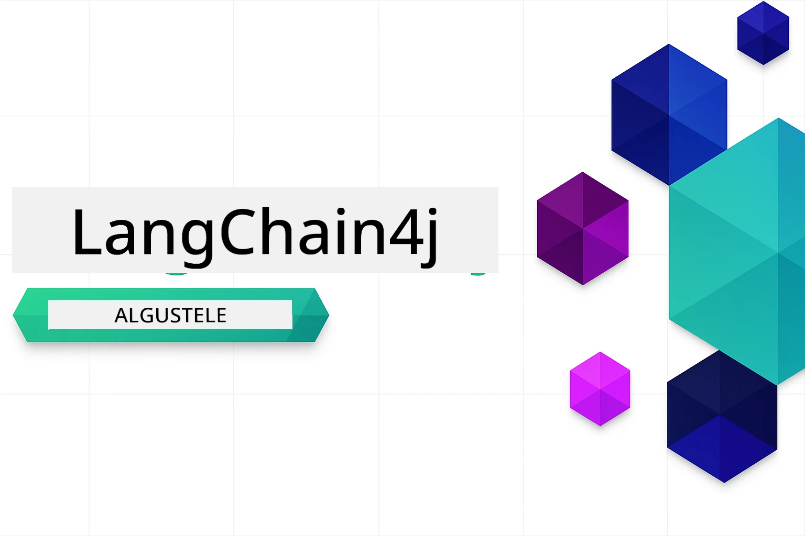

### 🌐 Mitmekeelsuse tugi

#### Toetatud GitHub Actioni kaudu (automaatne ja alati ajakohane)

<!-- CO-OP TRANSLATOR LANGUAGES TABLE START -->
[Arabic](../ar/README.md) | [Bengali](../bn/README.md) | [Bulgarian](../bg/README.md) | [Burmese (Myanmar)](../my/README.md) | [Chinese (Simplified)](../zh-CN/README.md) | [Chinese (Traditional, Hong Kong)](../zh-HK/README.md) | [Chinese (Traditional, Macau)](../zh-MO/README.md) | [Chinese (Traditional, Taiwan)](../zh-TW/README.md) | [Croatian](../hr/README.md) | [Czech](../cs/README.md) | [Danish](../da/README.md) | [Dutch](../nl/README.md) | [Estonian](./README.md) | [Finnish](../fi/README.md) | [French](../fr/README.md) | [German](../de/README.md) | [Greek](../el/README.md) | [Hebrew](../he/README.md) | [Hindi](../hi/README.md) | [Hungarian](../hu/README.md) | [Indonesian](../id/README.md) | [Italian](../it/README.md) | [Japanese](../ja/README.md) | [Kannada](../kn/README.md) | [Korean](../ko/README.md) | [Lithuanian](../lt/README.md) | [Malay](../ms/README.md) | [Malayalam](../ml/README.md) | [Marathi](../mr/README.md) | [Nepali](../ne/README.md) | [Nigerian Pidgin](../pcm/README.md) | [Norwegian](../no/README.md) | [Persian (Farsi)](../fa/README.md) | [Polish](../pl/README.md) | [Portuguese (Brazil)](../pt-BR/README.md) | [Portuguese (Portugal)](../pt-PT/README.md) | [Punjabi (Gurmukhi)](../pa/README.md) | [Romanian](../ro/README.md) | [Russian](../ru/README.md) | [Serbian (Cyrillic)](../sr/README.md) | [Slovak](../sk/README.md) | [Slovenian](../sl/README.md) | [Spanish](../es/README.md) | [Swahili](../sw/README.md) | [Swedish](../sv/README.md) | [Tagalog (Filipino)](../tl/README.md) | [Tamil](../ta/README.md) | [Telugu](../te/README.md) | [Thai](../th/README.md) | [Turkish](../tr/README.md) | [Ukrainian](../uk/README.md) | [Urdu](../ur/README.md) | [Vietnamese](../vi/README.md)

> **Eelistad kloonimist kohalikult?**

> See hoidla sisaldab rohkem kui 50 keele tõlget, mis suurendab oluliselt allalaadimise suurust. Kui soovid kloonida ilma tõlgeteta, kasuta sparse checkouti:
> ```bash
> git clone --filter=blob:none --sparse https://github.com/microsoft/LangChain4j-for-Beginners.git
> cd LangChain4j-for-Beginners
> git sparse-checkout set --no-cone '/*' '!translations' '!translated_images'
> ```
> See annab sulle kõik vajaliku kursuse läbimiseks palju kiirema allalaadimisega.
<!-- CO-OP TRANSLATOR LANGUAGES TABLE END -->

# LangChain4j algajatele

Kursus tehisintellekti rakenduste loomiseks LangChain4j ja Azure OpenAI GPT-5 abil, algusest vestlusest AI-agentideni.

**Uus LangChain4j-s?** Vaata [Sõnastikku](docs/GLOSSARY.md), et tutvuda võtmeterminite ja mõistetega.

## Sisukord

1. [Kiire algus](00-quick-start/README.md) - Alusta LangChain4j-ga
2. [Sissejuhatus](01-introduction/README.md) - Õpi LangChain4j põhialuseid
3. [Promptide kujundamine](02-prompt-engineering/README.md) - Õpi tõhusalt promptide loomist
4. [RAG (otsingupõhine genereerimine)](03-rag/README.md) - Loo nutikaid teadmiste põhiseid süsteeme
5. [Tööriistad](04-tools/README.md) - Integreeri väliseid tööriistu ja lihtsaid assistente
6. [MCP (mudeli kontekstil protokoll)](05-mcp/README.md) - Töötamine Mudeli konteksti protokolli (MCP) ja Agentuursete moodulitega
---

## Õpitee

> **Kiire algus**

1. Tee selle hoidla fork oma GitHub kontole
2. Klõpsa **Code** → **Codespaces** sakk → **...** → **Uus valikutega...**
3. Kasuta vaikeseadeid – see valib arenduscontaineri, mis on selle kursuse jaoks loodud
4. Klõpsa **Loo Codespace**
5. Oota 5-10 minutit, kuni keskkond on valmis
6. Alusta kohe [Kiirest algusest](./00-quick-start/README.md)!

Moodulite läbimise järel tutvu [Testimise juhendiga](docs/TESTING.md), et näha LangChain4j testimise kontseptsioone praktikas.

> **Märkus:** Selle koolituse jaoks kasutatakse nii GitHub Mudelite kui ka Azure OpenAI teenust. [Kiire algus](00-quick-start/README.md) kasutab GitHub Mudelite teenust (Azure tellimust ei nõuta), samas kui moodulid 1-5 kasutavad Azure OpenAI.

## Õppimine GitHub Copilotiga

Kiireks kodeerima asumiseks ava see projekt GitHub Codespace’is või oma kohalikus arenduskeskkonnas pakutud devcontaineriga. Selles kursuses kasutatav devcontainer sisaldab eelseadistatud GitHub Copiloti AI paarprogrammeerimise jaoks.

Iga koodinäite juures on soovitatud küsimused, mida võid Copilotile esitada, et oma arusaamist süvendada. Otsi 💡/🤖 vihjeid:

- **Java failide päistes** - näidise spetsiifilised küsimused
- **Moodulite READMEd** - uurimisküsimused pärast koodinäiteid

**Kuidas kasutada:** Ava ükskõik milline koodifail ja esita Copilotile soovitatud küsimusi. Tal on täielik ülevaade kogu koodibaasist ning ta suudab seletada, laiendada ja pakkuda alternatiive.

Soovid rohkem teada? Vaata [Copilot AI paarprogrammeerimise jaoks](https://aka.ms/GitHubCopilotAI).

## Lisaressursid

<!-- CO-OP TRANSLATOR OTHER COURSES START -->
### LangChain
[](https://aka.ms/langchain4j-for-beginners)
[](https://aka.ms/langchainjs-for-beginners?WT.mc_id=m365-94501-dwahlin)

---

### Azure / Edge / MCP / Agentid
[](https://github.com/microsoft/AZD-for-beginners?WT.mc_id=academic-105485-koreyst)
[](https://github.com/microsoft/edgeai-for-beginners?WT.mc_id=academic-105485-koreyst)
[](https://github.com/microsoft/mcp-for-beginners?WT.mc_id=academic-105485-koreyst)
[](https://github.com/microsoft/ai-agents-for-beginners?WT.mc_id=academic-105485-koreyst)

---
 
### Generatiivse AI seeria
[](https://github.com/microsoft/generative-ai-for-beginners?WT.mc_id=academic-105485-koreyst)
[-9333EA?style=for-the-badge&labelColor=E5E7EB&color=9333EA)](https://github.com/microsoft/Generative-AI-for-beginners-dotnet?WT.mc_id=academic-105485-koreyst)
[-C084FC?style=for-the-badge&labelColor=E5E7EB&color=C084FC)](https://github.com/microsoft/generative-ai-for-beginners-java?WT.mc_id=academic-105485-koreyst)
[-E879F9?style=for-the-badge&labelColor=E5E7EB&color=E879F9)](https://github.com/microsoft/generative-ai-with-javascript?WT.mc_id=academic-105485-koreyst)

---
 
### Põhiõpe
[](https://aka.ms/ml-beginners?WT.mc_id=academic-105485-koreyst)
[](https://aka.ms/datascience-beginners?WT.mc_id=academic-105485-koreyst)
[](https://aka.ms/ai-beginners?WT.mc_id=academic-105485-koreyst)
[](https://github.com/microsoft/Security-101?WT.mc_id=academic-96948-sayoung)
[](https://aka.ms/webdev-beginners?WT.mc_id=academic-105485-koreyst)
[](https://aka.ms/iot-beginners?WT.mc_id=academic-105485-koreyst)
[](https://github.com/microsoft/xr-development-for-beginners?WT.mc_id=academic-105485-koreyst)

---
 
### Copilot seeria

[](https://aka.ms/GitHubCopilotAI?WT.mc_id=academic-105485-koreyst)
[](https://github.com/microsoft/mastering-github-copilot-for-dotnet-csharp-developers?WT.mc_id=academic-105485-koreyst)
[](https://github.com/microsoft/CopilotAdventures?WT.mc_id=academic-105485-koreyst)
<!-- CO-OP TRANSLATOR OTHER COURSES END -->

## Abi saamine

Kui sa jooksed ummikusse või sul on küsimusi AI-rakenduste loomise kohta, liitu:

[](https://aka.ms/foundry/discord)

Kui sul on toodete kohta tagasisidet või vigasid arendamise ajal, külasta:

[](https://aka.ms/foundry/forum)

## Litsents

MIT litsents - vt üksikasju [LICENSE](../../LICENSE) failist.

---

<!-- CO-OP TRANSLATOR DISCLAIMER START -->
**Vastusvastutusest loobumine**:
See dokument on tõlgitud tehisintellekti tõlketeenuse [Co-op Translator](https://github.com/Azure/co-op-translator) abil. Kuigi püüdleme täpsuse poole, tuleb arvestada, et automaatsed tõlked võivad sisaldada vigu või ebatäpsusi. Algne dokument selle emakeeles tuleks pidada autoriteetseks allikaks. Kriitilise teabe puhul soovitatakse kasutada professionaalset inimtõlget. Me ei vastuta selle tõlke kasutamisest tulenevate arusaamatuste või valesti mõistmiste eest.
<!-- CO-OP TRANSLATOR DISCLAIMER END -->