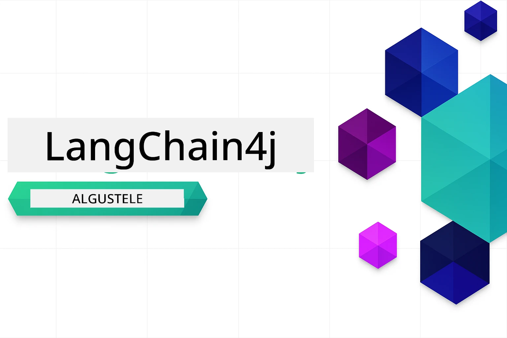

# LangChain4j algajatele

Kursus AI rakenduste ehitamiseks kasutades LangChain4j ja Azure OpenAI GPT-5.2, alates lihtsast vestlusest kuni AI agentideni.

### 🌐 Mitmekeelne tugi

#### Toetatud GitHub Actioni kaudu (Automaatne ja alati ajakohane)

<!-- CO-OP TRANSLATOR LANGUAGES TABLE START -->
[Arabic](../ar/README.md) | [Bengali](../bn/README.md) | [Bulgarian](../bg/README.md) | [Burmese (Myanmar)](../my/README.md) | [Chinese (Simplified)](../zh-CN/README.md) | [Chinese (Traditional, Hong Kong)](../zh-HK/README.md) | [Chinese (Traditional, Macau)](../zh-MO/README.md) | [Chinese (Traditional, Taiwan)](../zh-TW/README.md) | [Croatian](../hr/README.md) | [Czech](../cs/README.md) | [Danish](../da/README.md) | [Dutch](../nl/README.md) | [Estonian](./README.md) | [Finnish](../fi/README.md) | [French](../fr/README.md) | [German](../de/README.md) | [Greek](../el/README.md) | [Hebrew](../he/README.md) | [Hindi](../hi/README.md) | [Hungarian](../hu/README.md) | [Indonesian](../id/README.md) | [Italian](../it/README.md) | [Japanese](../ja/README.md) | [Kannada](../kn/README.md) | [Khmer](../km/README.md) | [Korean](../ko/README.md) | [Lithuanian](../lt/README.md) | [Malay](../ms/README.md) | [Malayalam](../ml/README.md) | [Marathi](../mr/README.md) | [Nepali](../ne/README.md) | [Nigerian Pidgin](../pcm/README.md) | [Norwegian](../no/README.md) | [Persian (Farsi)](../fa/README.md) | [Polish](../pl/README.md) | [Portuguese (Brazil)](../pt-BR/README.md) | [Portuguese (Portugal)](../pt-PT/README.md) | [Punjabi (Gurmukhi)](../pa/README.md) | [Romanian](../ro/README.md) | [Russian](../ru/README.md) | [Serbian (Cyrillic)](../sr/README.md) | [Slovak](../sk/README.md) | [Slovenian](../sl/README.md) | [Spanish](../es/README.md) | [Swahili](../sw/README.md) | [Swedish](../sv/README.md) | [Tagalog (Filipino)](../tl/README.md) | [Tamil](../ta/README.md) | [Telugu](../te/README.md) | [Thai](../th/README.md) | [Turkish](../tr/README.md) | [Ukrainian](../uk/README.md) | [Urdu](../ur/README.md) | [Vietnamese](../vi/README.md)

> **Eelistad kloonimist lokaalselt?**
>
> See hoidla sisaldab üle 50 keele tõlget, mis suurendab allalaaditava faili suurust märkimisväärselt. Tõlgeteta kloonimiseks kasuta sparsed checkouti:
>
> **Bash / macOS / Linux:**
> ```bash
> git clone --filter=blob:none --sparse https://github.com/microsoft/LangChain4j-for-Beginners.git
> cd LangChain4j-for-Beginners
> git sparse-checkout set --no-cone '/*' '!translations' '!translated_images'
> ```
>
> **CMD (Windows):**
> ```cmd
> git clone --filter=blob:none --sparse https://github.com/microsoft/LangChain4j-for-Beginners.git
> cd LangChain4j-for-Beginners
> git sparse-checkout set --no-cone "/*" "!translations" "!translated_images"
> ```
>
> See annab sulle kõik vajaliku kursuse läbimiseks palju kiirema allalaadimisega.
<!-- CO-OP TRANSLATOR LANGUAGES TABLE END -->

## Sisukord

1. [Sissejuhatus](01-introduction/README.md) - Õpi LangChain4j põhialuseid
2. [Promptide loomine](02-prompt-engineering/README.md) - Õpi tõhusaid promptide disainimise tehnikaid
3. [RAG (otsingupõhine genereerimine)](03-rag/README.md) - Ehita nutikaid teadmistepõhiseid süsteeme
4. [Tööriistad](04-tools/README.md) - Integreeri väliseid tööriistu ja lihtsaid assistente
5. [MCP (Mudeli konteksti protokoll)](05-mcp/README.md) - Tööta Model Context Protocoli (MCP) ja agentide moodulitega

### Video juhendid

Iga mooduli juurde kuulub otseülekandes juhend, kus samm-sammult käime läbi kontseptsioonid ja koodi.

| Moodul | Video |
|--------|-------|
| 01 - Sissejuhatus | [LangChain4j kasutuselevõtt](https://www.youtube.com/live/nl_troDm8rQ) |
| 02 - Promptide loomine | [Promptide loomine LangChain4j-ga](https://www.youtube.com/live/PJ6aBaE6bog) |
| 03 - RAG | [RAG koos LangChain4j-ga](https://www.youtube.com/watch?v=_olq75ZH_eY) |
| 04 - Tööriistad & 05 - MCP | [AI agentide loomine tööriistade ja MCP-ga](https://www.youtube.com/watch?v=O_J30kZc0rw) |

---

## Õppeteekond

**Oled uus LangChain4j juures?** Vaata [Sõnastikku](docs/GLOSSARY.md), kus selgitatakse võtmetermineid ja kontseptsioone.

> **Kiirstart**

1. Looge selle hoidla fork oma GitHubi kontole
2. Klõpsake **Code** → **Codespaces** sakk → **...** → **New with options...**
3. Kasutage vaikeseadeid – see valib kursuse jaoks loodud arendus konteineri
4. Klõpsake **Create codespace**
5. Oodake 5–10 minutit, kuni keskkond on valmis
6. Alustage otse [sissejuhatusest](./01-introduction/README.md)!

Pärast moodulite läbimist uurige [Testimise juhendit](docs/TESTING.md), et näha LangChain4j testimise kontseptsioone praktikas.

> **Märkus:** See koolitus kasutab Azure OpenAI. Kui sul pole veel kontot, alusta [TASUTA Azure konto](https://aka.ms/azure-free-account) loomisega.


## Õppimine GitHub Copilotiga

Selleks, et kiiresti kodeerima hakata, ava see projekt GitHub Codespaces või oma lokaalses IDEs koos antud devcontaineriga. Kursuses kasutatav devcontainer on eelseadistatud GitHub Copilotiga AI paarisprogrammeerimiseks.

Iga koodinäite juures on soovituslikud küsimused, mida võid Copilotilt küsida, et oma arusaamist süvendada. Otsi 💡/🤖 märgendit:

- **Java failide päistes** – iga näite kohta spetsiifilised küsimused
- **Mooduli README-d** – uurimisküsimused pärast koodinäiteid

**Kuidas kasutada:** Ava ükskõik milline koodifail ja küsi soovitatud küsimusi Copilotilt. Tal on kogu koodibaasi kontekst olemas, ta saab seletada, laiendada ja soovitada alternatiive.

Tahad rohkem teada? Vaata [Copilot AI paarisprogrammeerimiseks](https://aka.ms/GitHubCopilotAI).


## Täiendavad ressursid

<!-- CO-OP TRANSLATOR OTHER COURSES START -->
### LangChain
[](https://aka.ms/langchain4j-for-beginners)
[](https://aka.ms/langchainjs-for-beginners?WT.mc_id=m365-94501-dwahlin)
[](https://github.com/microsoft/langchain-for-beginners?WT.mc_id=m365-94501-dwahlin)
---

### Azure / Edge / MCP / Agentid
[](https://github.com/microsoft/AZD-for-beginners?WT.mc_id=academic-105485-koreyst)
[](https://github.com/microsoft/edgeai-for-beginners?WT.mc_id=academic-105485-koreyst)
[](https://github.com/microsoft/mcp-for-beginners?WT.mc_id=academic-105485-koreyst)
[](https://github.com/microsoft/ai-agents-for-beginners?WT.mc_id=academic-105485-koreyst)

---
 
### Generatiivne AI sari
[](https://github.com/microsoft/generative-ai-for-beginners?WT.mc_id=academic-105485-koreyst)
[-9333EA?style=for-the-badge&labelColor=E5E7EB&color=9333EA)](https://github.com/microsoft/Generative-AI-for-beginners-dotnet?WT.mc_id=academic-105485-koreyst)
[-C084FC?style=for-the-badge&labelColor=E5E7EB&color=C084FC)](https://github.com/microsoft/generative-ai-for-beginners-java?WT.mc_id=academic-105485-koreyst)
[-E879F9?style=for-the-badge&labelColor=E5E7EB&color=E879F9)](https://github.com/microsoft/generative-ai-with-javascript?WT.mc_id=academic-105485-koreyst)

---
 
### Põhiõpe
[](https://aka.ms/ml-beginners?WT.mc_id=academic-105485-koreyst)
[](https://aka.ms/datascience-beginners?WT.mc_id=academic-105485-koreyst)
[](https://aka.ms/ai-beginners?WT.mc_id=academic-105485-koreyst)
[](https://github.com/microsoft/Security-101?WT.mc_id=academic-96948-sayoung)

[](https://aka.ms/webdev-beginners?WT.mc_id=academic-105485-koreyst)
[](https://aka.ms/iot-beginners?WT.mc_id=academic-105485-koreyst)
[](https://github.com/microsoft/xr-development-for-beginners?WT.mc_id=academic-105485-koreyst)

---
 
### Copilot seeria
[](https://aka.ms/GitHubCopilotAI?WT.mc_id=academic-105485-koreyst)
[](https://github.com/microsoft/mastering-github-copilot-for-dotnet-csharp-developers?WT.mc_id=academic-105485-koreyst)
[](https://github.com/microsoft/CopilotAdventures?WT.mc_id=academic-105485-koreyst)
<!-- CO-OP TRANSLATOR OTHER COURSES END -->

## Abi saamine

Kui takerdud või sul on küsimusi AI-rakenduste loomise kohta, liitu:

[](https://aka.ms/foundry/discord)

Kui sul on toodete tagasisidet või ehitusprotsessis ilmneb vigu, külasta:

[](https://aka.ms/foundry/forum)

## Litsents

MIT litsents - vaata üksikasju [LICENSE](../../LICENSE) failist.

---

<!-- CO-OP TRANSLATOR DISCLAIMER START -->
**Lahtiütlus**:
See dokument on tõlgitud kasutades AI tõlketeenust [Co-op Translator](https://github.com/Azure/co-op-translator). Kuigi me püüdleme täpsuse poole, palun pange tähele, et automatiseeritud tõlgetes võib esineda vigu või ebatäpsusi. Originaaldokument selle emakeeles tuleks pidada autoriteetseks allikaks. Olulise teabe puhul soovitatakse kasutada professionaalset inimtõlget. Me ei vastuta selle tõlkega seotud eksimustest või valesti mõistmistest.
<!-- CO-OP TRANSLATOR DISCLAIMER END -->