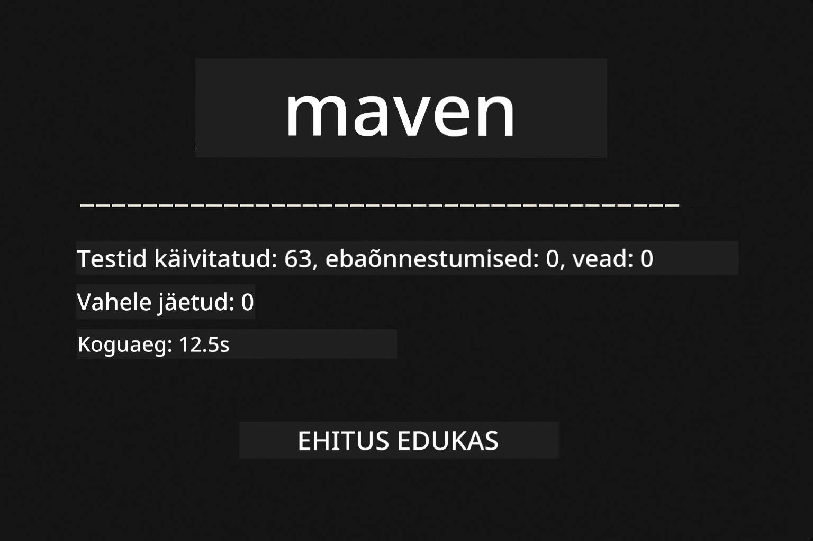
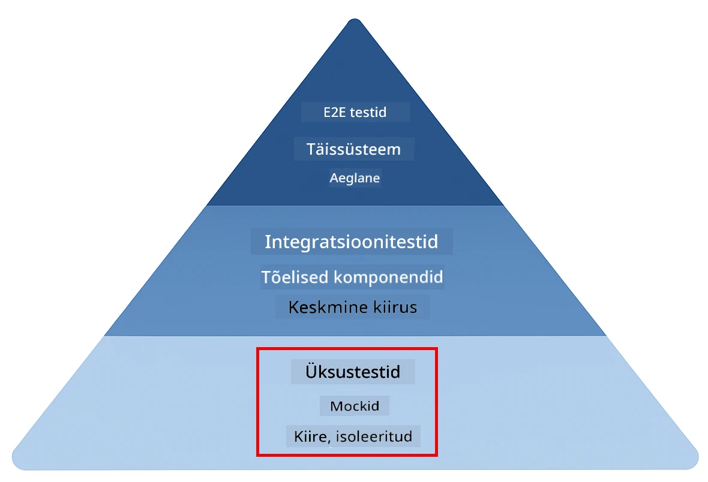
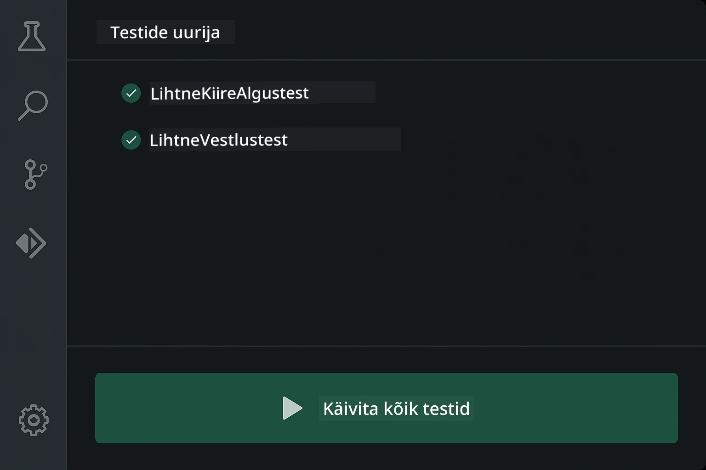
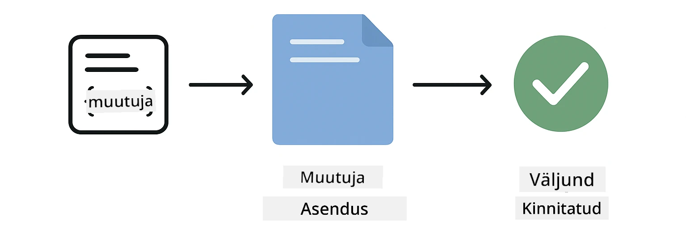
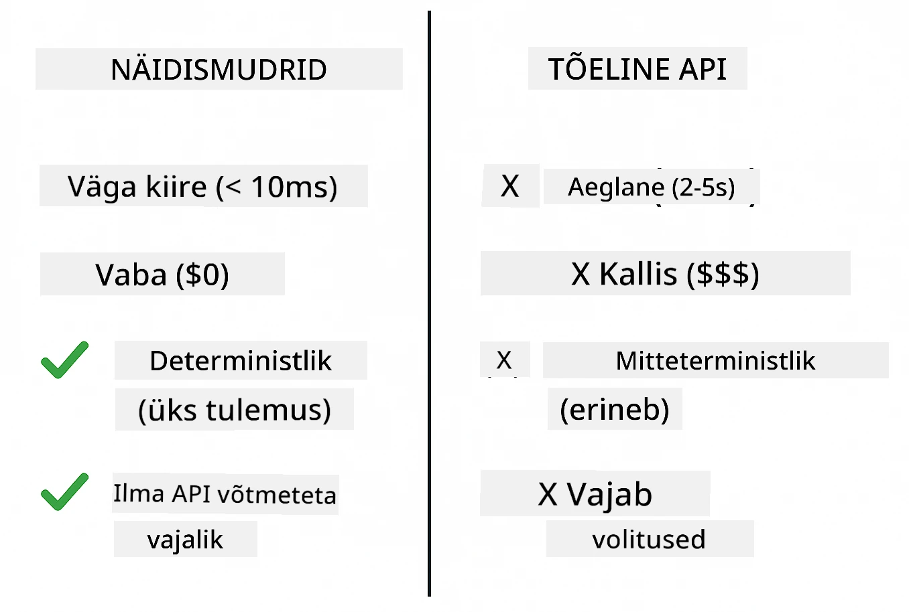
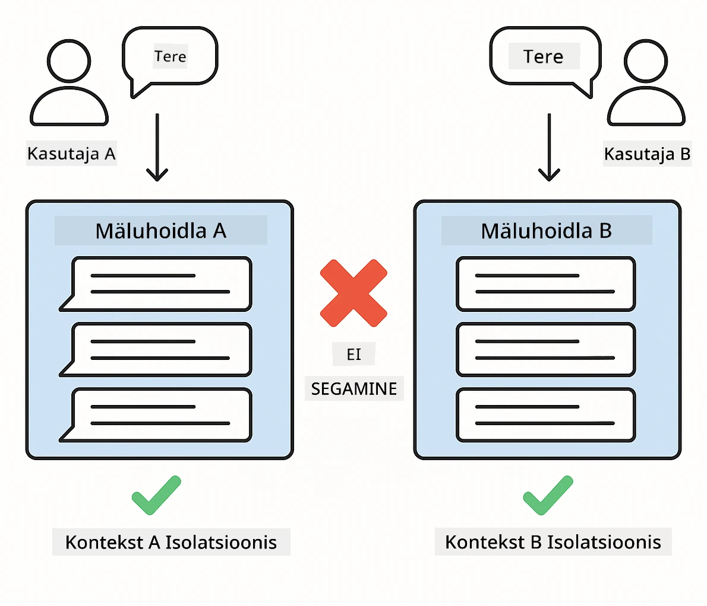
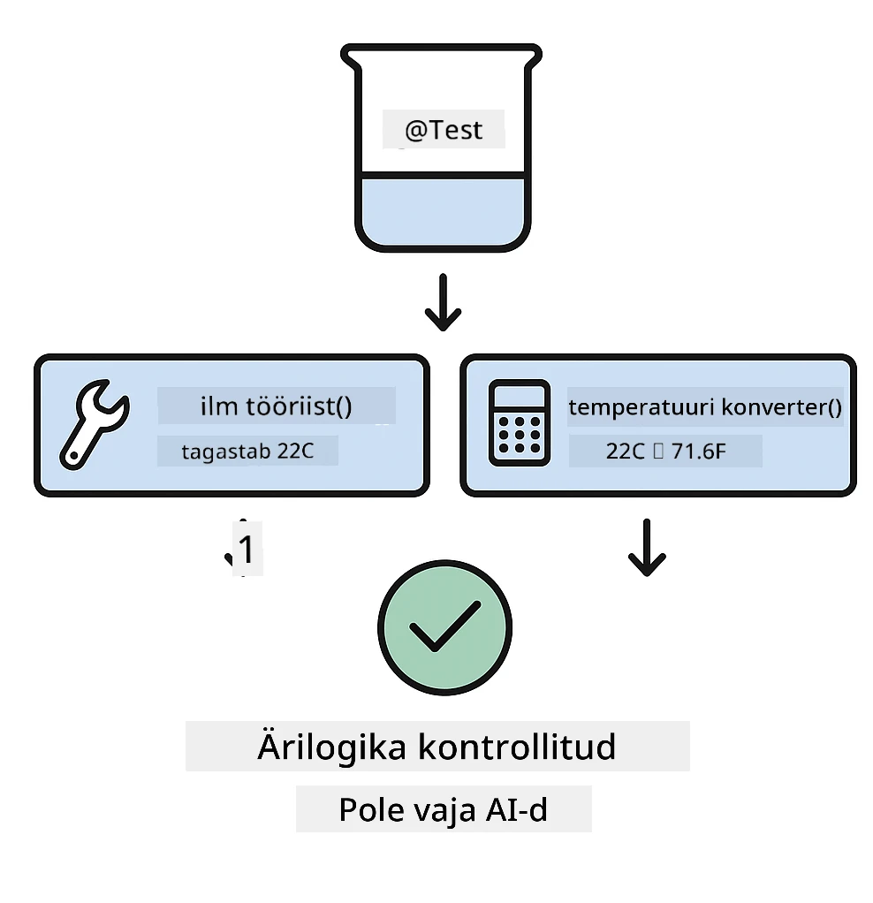
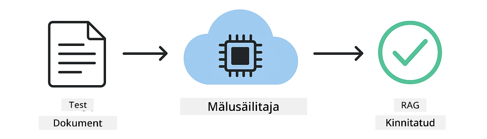

<!--
CO_OP_TRANSLATOR_METADATA:
{
  "original_hash": "ed93b3c14d58734ac10162967da958c1",
  "translation_date": "2025-12-31T07:22:27+00:00",
  "source_file": "docs/TESTING.md",
  "language_code": "et"
}
-->
# LangChain4j rakenduste testimine

## Sisukord

- [Kiire algus](../../../docs)
- [Mida testid katavad](../../../docs)
- [Testide käivitamine](../../../docs)
- [VS Code'is testide käivitamine](../../../docs)
- [Testimise mustrid](../../../docs)
- [Testimise filosoofia](../../../docs)
- [Edasised sammud](../../../docs)

See juhend juhendab sind läbi testide, mis näitavad, kuidas testida AI-rakendusi ilma API-võtmeteta või väliste teenusteta.

## Kiire algus

Käivita kõik testid ühe käsuga:

**Bash:**
```bash
mvn test
```

**PowerShell:**
```powershell
mvn --% test
```



*Testide õnnestunud täitmine: kõik testid läbisid ilma ebaõnnestumisteta*

## Mida testid katavad

See kursus keskendub lokaalselt käivitatavatele **ühikutestidele**. Iga test demonstreerib üksikut LangChain4j kontseptsiooni eraldatult.



*Testimise püramiid, mis näitab tasakaalu üksikutestide (kiired, eraldatud), integratsioonitestide (päris komponendid) ja lõpp-kuni-lõpp-katsete vahel. See koolitus hõlmab üksikutestimist.*

| Module | Tests | Focus | Key Files |
|--------|-------|-------|-----------|
| **00 - Quick Start** | 6 | Päringu mallid ja muutujate asendamine | `SimpleQuickStartTest.java` |
| **01 - Introduction** | 8 | Vestluse mälu ja olekupõhine vestlus | `SimpleConversationTest.java` |
| **02 - Prompt Engineering** | 12 | GPT-5 mustrid, innukuse tasemed, struktureeritud väljund | `SimpleGpt5PromptTest.java` |
| **03 - RAG** | 10 | Dokumentide sisselugemine, embeddingud, sarnasuseotsing | `DocumentServiceTest.java` |
| **04 - Tools** | 12 | Funktsioonikõned ja tööriistade ahelad | `SimpleToolsTest.java` |
| **05 - MCP** | 8 | Mudeli konteksti protokoll koos stdio transpordiga | `SimpleMcpTest.java` |

## Testide käivitamine

**Käivita kõik testid juurkataloogist:**

**Bash:**
```bash
mvn test
```

**PowerShell:**
```powershell
mvn --% test
```

**Käivita testid konkreetse mooduli jaoks:**

**Bash:**
```bash
cd 01-introduction && mvn test
# Või juurkasutajalt
mvn test -pl 01-introduction
```

**PowerShell:**
```powershell
cd 01-introduction; mvn --% test
# Või juurist
mvn --% test -pl 01-introduction
```

**Käivita üks testi klass:**

**Bash:**
```bash
mvn test -Dtest=SimpleConversationTest
```

**PowerShell:**
```powershell
mvn --% test -Dtest=SimpleConversationTest
```

**Käivita konkreetne testmeetod:**

**Bash:**
```bash
mvn test -Dtest=SimpleConversationTest#peaksSäilitamaVestluseAjalugu
```

**PowerShell:**
```powershell
mvn --% test -Dtest=SimpleConversationTest#peaksSäilitamaVestluseAjalugu
```

## VS Code'is testide käivitamine

Kui kasutad Visual Studio Code'i, pakub Test Explorer graafilist liidest testide käivitamiseks ja silumiseks.



*VS Code Test Explorer kuvab testi puu kõigi Java testiklasside ja üksikute testmeetoditega*

**Testide käivitamiseks VS Code'is:**

1. Ava Test Explorer, klõpsates Activity Bar'is kolbiikooni
2. Laienda testi puu, et näha kõiki mooduleid ja testiklasse
3. Klõpsa iga testi kõrval olevat käivitusnuppu, et seda eraldi käivitada
4. Klõpsa "Run All Tests", et käivitada kogu komplekt
5. Paremklõpsa suvalisel testil ja vali "Debug Test", et seada murdepunktid ja sammuda läbi koodi

Test Explorer kuvab läbipääsu puhul rohelisi linnukesi ning annab üksikasjalikud veateated, kui testid ebaõnnestuvad.

## Testimise mustrid

### Muster 1: Päringu mallide testimine

Lihtsaim muster testib päringu malle ilma ühegi AI-mudeli kutsumiseta. Sa kontrollid, et muutujate asendamine töötab õigesti ja päringud on oodatud kujul vormindatud.



*Päringu mallide testimine, kus on näidatud muutujate asendamise voog: mall kohatäiteks → väärtused rakendatud → vormindatud väljund kontrollitud*

```java
@Test
@DisplayName("Should format prompt template with variables")
void testPromptTemplateFormatting() {
    PromptTemplate template = PromptTemplate.from(
        "Best time to visit {{destination}} for {{activity}}?"
    );
    
    Prompt prompt = template.apply(Map.of(
        "destination", "Paris",
        "activity", "sightseeing"
    ));
    
    assertThat(prompt.text()).isEqualTo("Best time to visit Paris for sightseeing?");
}
```

See test asub `00-quick-start/src/test/java/com/example/langchain4j/quickstart/SimpleQuickStartTest.java`.

**Käivita see:**

**Bash:**
```bash
cd 00-quick-start && mvn test -Dtest=SimpleQuickStartTest#testi prompt-malli vormindamine
```

**PowerShell:**
```powershell
cd 00-quick-start; mvn --% test -Dtest=SimpleQuickStartTest#promptimalli vormindamise test
```

### Muster 2: Keeltemudelite mockimine

Vestlusloogika testimisel kasuta Mockito't, et luua võltsmudelid, mis tagastavad eelnevalt määratletud vastuseid. See teeb testid kiireks, tasuta ja deterministlikuks.



*Võrdlus, mis selgitab, miks mock'e eelistatakse testimisel: need on kiired, tasuta, deterministlikud ja ei vaja API-võtmeid*

```java
@ExtendWith(MockitoExtension.class)
class SimpleConversationTest {
    
    private ConversationService conversationService;
    
    @Mock
    private OpenAiOfficialChatModel mockChatModel;
    
    @BeforeEach
    void setUp() {
        ChatResponse mockResponse = ChatResponse.builder()
            .aiMessage(AiMessage.from("This is a test response"))
            .build();
        when(mockChatModel.chat(anyList())).thenReturn(mockResponse);
        
        conversationService = new ConversationService(mockChatModel);
    }
    
    @Test
    void shouldMaintainConversationHistory() {
        String conversationId = conversationService.startConversation();
        
        ChatResponse mockResponse1 = ChatResponse.builder()
            .aiMessage(AiMessage.from("Response 1"))
            .build();
        ChatResponse mockResponse2 = ChatResponse.builder()
            .aiMessage(AiMessage.from("Response 2"))
            .build();
        ChatResponse mockResponse3 = ChatResponse.builder()
            .aiMessage(AiMessage.from("Response 3"))
            .build();
        
        when(mockChatModel.chat(anyList()))
            .thenReturn(mockResponse1)
            .thenReturn(mockResponse2)
            .thenReturn(mockResponse3);

        conversationService.chat(conversationId, "First message");
        conversationService.chat(conversationId, "Second message");
        conversationService.chat(conversationId, "Third message");

        List<ChatMessage> history = conversationService.getHistory(conversationId);
        assertThat(history).hasSize(6); // 3 kasutaja- ja 3 tehisintellekti sõnumit
    }
}
```

See muster esineb failis `01-introduction/src/test/java/com/example/langchain4j/service/SimpleConversationTest.java`. Mock tagab ühtlase käitumise, nii et saad kontrollida, et mälu haldamine töötab õigesti.

### Muster 3: Vestluse isoleerituse testimine

Vestluse mälu peab hoidma mitme kasutaja andmed eraldi. See test kontrollib, et vestlused ei sega kontekste omavahel.



*Vestluse isoleerimise testimine, mis näitab erinevate kasutajate jaoks eraldi mälukogusid, et vältida kontekstide segunemist*

```java
@Test
void shouldIsolateConversationsByid() {
    String conv1 = conversationService.startConversation();
    String conv2 = conversationService.startConversation();
    
    ChatResponse mockResponse = ChatResponse.builder()
        .aiMessage(AiMessage.from("Response"))
        .build();
    when(mockChatModel.chat(anyList())).thenReturn(mockResponse);

    conversationService.chat(conv1, "Message for conversation 1");
    conversationService.chat(conv2, "Message for conversation 2");

    List<ChatMessage> history1 = conversationService.getHistory(conv1);
    List<ChatMessage> history2 = conversationService.getHistory(conv2);
    
    assertThat(history1).hasSize(2);
    assertThat(history2).hasSize(2);
}
```

Iga vestlus säilitab oma iseseisva ajaloo. Tootmissüsteemides on see isoleeritus mitme kasutajaga rakenduste jaoks kriitilise tähtsusega.

### Muster 4: Tööriistade eraldiseisev testimine

Tööriistad on funktsioonid, mida AI saab kutsuda. Testi neid otse, et tagada nende õige toimimine sõltumata AI otsustest.



*Tööriistade eraldi testimine, kus näidatakse mock-tööriistade käivitust ilma AI-kõnedeta äriloogika kinnitamiseks*

```java
@Test
void shouldConvertCelsiusToFahrenheit() {
    TemperatureTool tempTool = new TemperatureTool();
    String result = tempTool.celsiusToFahrenheit(25.0);
    assertThat(result).containsPattern("77[.,]0°F");
}

@Test
void shouldDemonstrateToolChaining() {
    WeatherTool weatherTool = new WeatherTool();
    TemperatureTool tempTool = new TemperatureTool();

    String weatherResult = weatherTool.getCurrentWeather("Seattle");
    assertThat(weatherResult).containsPattern("\\d+°C");

    String conversionResult = tempTool.celsiusToFahrenheit(22.0);
    assertThat(conversionResult).containsPattern("71[.,]6°F");
}
```

Need testid failist `04-tools/src/test/java/com/example/langchain4j/agents/tools/SimpleToolsTest.java` valideerivad tööriistade loogikat ilma AI-sekkumiseta. Kettimise näide näitab, kuidas ühe tööriista väljund läheb teise sisendiks.

### Muster 5: Mälusisene RAG-testimine

RAG-süsteemid vajavad tavaliselt vektoriandmebaase ja embeddinguteenuseid. Mälusisene muster võimaldab testida kogu torujuhet ilma väliste sõltuvusteta.



*Mälusisene RAG-testimise töövoog, mis näitab dokumentide parsingu, embeddingu salvestamist ja sarnasuse otsingut ilma andmebaasi nõudmata*

```java
@Test
void testProcessTextDocument() {
    String content = "This is a test document.\nIt has multiple lines.";
    InputStream inputStream = new ByteArrayInputStream(content.getBytes(StandardCharsets.UTF_8));
    
    DocumentService.ProcessedDocument result = 
        documentService.processDocument(inputStream, "test.txt");

    assertNotNull(result);
    assertTrue(result.segments().size() > 0);
    assertEquals("test.txt", result.segments().get(0).metadata().getString("filename"));
}
```

See test failist `03-rag/src/test/java/com/example/langchain4j/rag/service/DocumentServiceTest.java` loob dokumendi mällu ja kontrollib lõikamist ning metaandmete käitlemist.

### Muster 6: MCP integreerimise testimine

MCP-moodul testib Model Context Protocol integratsiooni, kasutades stdio transporti. Need testid kontrollivad, et teie rakendus suudab käivitada ja suhelda MCP-serveritega alamprotsessidena.

Testid failis `05-mcp/src/test/java/com/example/langchain4j/mcp/SimpleMcpTest.java` valideerivad MCP-klienti.

**Käivita need:**

**Bash:**
```bash
cd 05-mcp && mvn test
```

**PowerShell:**
```powershell
cd 05-mcp; mvn --% test
```

## Testimise filosoofia

Testi oma koodi, mitte AI-d. Sinu testid peaksid valideerima kirjutatud koodi, kontrollides, kuidas päringud on üles ehitatud, kuidas mälu hallatakse ja kuidas tööriistad töötavad. AI vastused varieeruvad ega tohiks olla osa testiväidetest. Küsi endalt, kas sinu päringu mall asendab muutujad õigesti, mitte kas AI annab õige vastuse.

Kasuta keeltemudelite puhul mock'e. Need on välised sõltuvused, mis on aeglased, kallid ja mittedeterministlikud. Mockimine teeb testid kiired (millisekundites sekundite asemel), tasuta (ilma API-kuludeta) ja deterministlikud, andes iga kord sama tulemuse.

Hoia testid sõltumatuna. Iga test peaks seadistama oma andmed, mitte tuginema teistele testidele, ja koristama enda järel. Testid peaksid läbima sõltumata käivitamise järjekorrast.

Testi servajuhtumeid, mitte ainult õnnelikku rada. Proovi tühje sisendeid, väga suuri sisendeid, erimärke, vigaseid parameetreid ja piirjuhtumeid. Need paljastavad sageli vigu, mida tavaline kasutus ei avalda.

Kasuta kirjeldavaid nimesid. Võrdle shouldMaintainConversationHistoryAcrossMultipleMessages() ja test1(). Esimene ütleb täpselt, mida testitakse, muutes veaotsingu palju lihtsamaks.

## Edasised sammud

Nüüd, kui mõistad testimismustreid, süvene igasse moodulisse:

- **[00 - Quick Start](../00-quick-start/README.md)** - Alusta päringute mallide põhialustega
- **[01 - Introduction](../01-introduction/README.md)** - Õpi vestlusmälude haldamist
- **[02 - Prompt Engineering](../02-prompt-engineering/README.md)** - Valda GPT-5 päringumustreid
- **[03 - RAG](../03-rag/README.md)** - Ehita retrieval-augmenteeritud genereerimissüsteeme
- **[04 - Tools](../04-tools/README.md)** - Rakenda funktsioonikõnesid ja tööriistaketid
- **[05 - MCP](../05-mcp/README.md)** - Integreeri Model Context Protocol

Iga mooduli README pakub üksikasjalikke selgitusi siin testitavate kontseptsioonide kohta.

---

**Navigeerimine:** [← Tagasi peamenüüsse](../README.md)

---

<!-- CO-OP TRANSLATOR DISCLAIMER START -->
**Vastutusest loobumine**:
See dokument on tõlgitud tehisintellekti tõlketeenuse Co-op Translator (https://github.com/Azure/co-op-translator) abil. Kuigi me püüame tagada täpsust, palun arvestage, et automaatsed tõlked võivad sisaldada vigu või ebatäpsusi. Algupärane dokument selle emakeeles tuleks pidada autoriteetseks allikaks. Kriitilise tähtsusega teabe puhul soovitatakse kasutada professionaalset inimtõlget. Me ei vastuta ühegi tõlke kasutamisest tuleneva arusaamatuse või valesti tõlgendamise eest.
<!-- CO-OP TRANSLATOR DISCLAIMER END -->