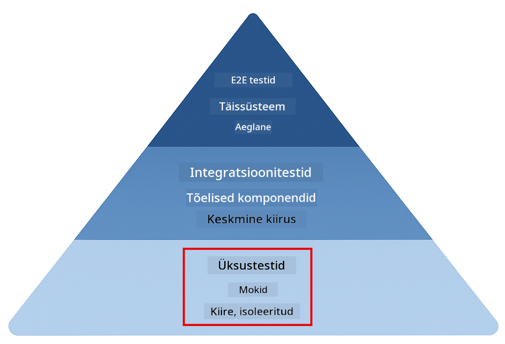
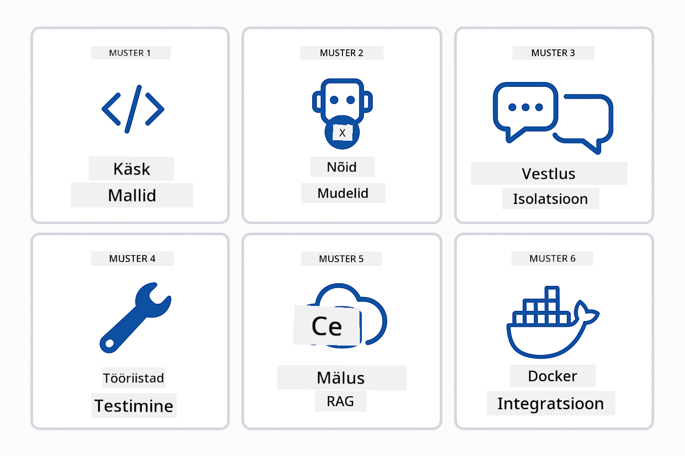
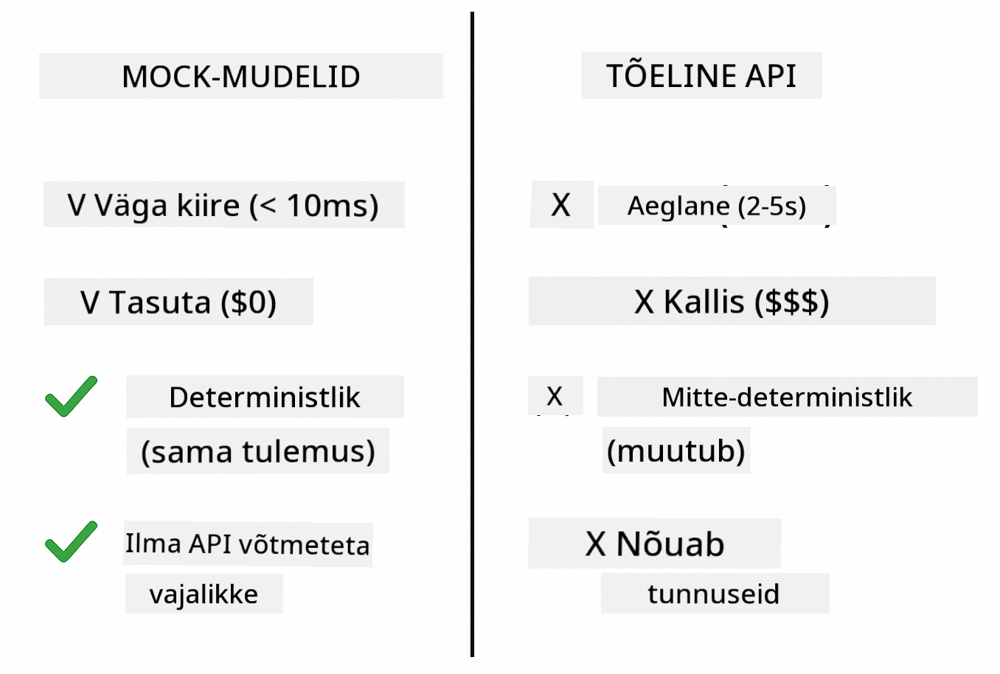
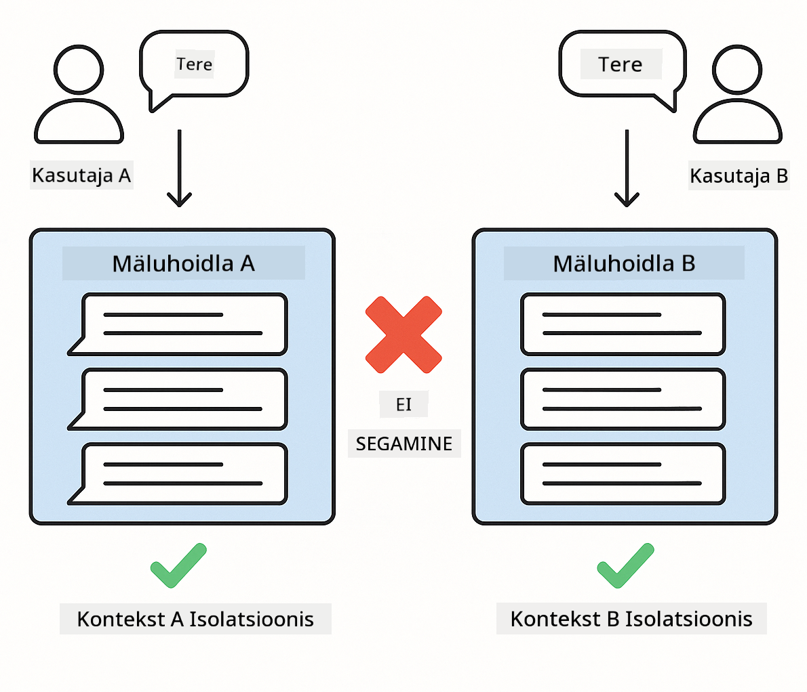
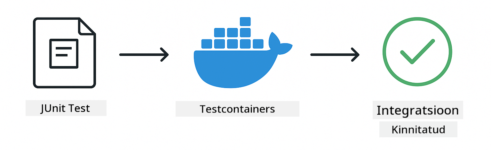

<!--
CO_OP_TRANSLATOR_METADATA:
{
  "original_hash": "b975537560c404d5f254331832811e78",
  "translation_date": "2025-12-13T21:34:48+00:00",
  "source_file": "docs/TESTING.md",
  "language_code": "et"
}
-->
# LangChain4j rakenduste testimine

## Sisukord

- [Kiire algus](../../../docs)
- [Mida testid katavad](../../../docs)
- [Testide käivitamine](../../../docs)
- [Testide käivitamine VS Code'is](../../../docs)
- [Testimise mustrid](../../../docs)
- [Testimise filosoofia](../../../docs)
- [Järgmised sammud](../../../docs)

See juhend viib teid läbi testide, mis näitavad, kuidas testida tehisintellekti rakendusi ilma API võtmete või väliste teenusteta.

## Kiire algus

Käivitage kõik testid ühe käsuga:

**Bash:**
```bash
mvn test
```

**PowerShell:**
```powershell
mvn --% test
```


*Edukalt läbitud testide käivitamine, kus kõik testid on läbitud ilma vigadeta*

## Mida testid katavad

See kursus keskendub **ühikutestidele**, mis jooksevad lokaalselt. Iga test demonstreerib konkreetset LangChain4j kontseptsiooni isoleeritult.



*Testimise püramiid, mis näitab tasakaalu ühikutestide (kiired, isoleeritud), integratsioonitestide (päris komponendid) ja lõpp-kuni-lõpuni testide (täissüsteem Dockeriga) vahel. See koolitus käsitleb ühikutestimist.*

| Moodul | Testid | Fookus | Peamised failid |
|--------|--------|--------|-----------------|
| **00 - Kiire algus** | 6 | Käskmallid ja muutujate asendamine | `SimpleQuickStartTest.java` |
| **01 - Sissejuhatus** | 8 | Vestluse mälu ja olekupõhine vestlus | `SimpleConversationTest.java` |
| **02 - Käskude inseneritöö** | 12 | GPT-5 mustrid, innukuse tasemed, struktureeritud väljund | `SimpleGpt5PromptTest.java` |
| **03 - RAG** | 10 | Dokumendi töötlemine, manused, sarnasuse otsing | `DocumentServiceTest.java` |
| **04 - Tööriistad** | 12 | Funktsioonikutsed ja tööriistade ahelad | `SimpleToolsTest.java` |
| **05 - MCP** | 15 | Mudeli konteksti protokoll Dockeriga | `SimpleMcpTest.java`, `McpDockerTransportTest.java`` |

## Testide käivitamine

**Käivitage kõik testid juurkataloogist:**

**Bash:**
```bash
mvn test
```

**PowerShell:**
```powershell
mvn --% test
```

**Käivitage testid konkreetse mooduli jaoks:**

**Bash:**
```bash
cd 01-introduction && mvn test
# Või juurtest
mvn test -pl 01-introduction
```

**PowerShell:**
```powershell
cd 01-introduction; mvn --% test
# Või juurtest
mvn --% test -pl 01-introduction
```

**Käivitage üks testiklass:**

**Bash:**
```bash
mvn test -Dtest=SimpleConversationTest
```

**PowerShell:**
```powershell
mvn --% test -Dtest=SimpleConversationTest
```

**Käivitage konkreetne testmeetod:**

**Bash:**
```bash
mvn test -Dtest=SimpleConversationTest#peaks säilitama vestluse ajaloo
```

**PowerShell:**
```powershell
mvn --% test -Dtest=SimpleConversationTest#peaks säilitama vestluse ajaloo
```

## Testide käivitamine VS Code'is

Kui kasutate Visual Studio Code'i, pakub Test Explorer graafilist liidest testide käivitamiseks ja silumiseks.


*VS Code Test Explorer kuvab testipuu koos kõigi Java testiklasside ja üksikute testmeetoditega*

**Testide käivitamiseks VS Code'is:**

1. Avage Test Explorer, klõpsates tegevusribal kolbi ikooni
2. Laiendage testipuu, et näha kõiki mooduleid ja testiklasse
3. Klõpsake mängunupul mis tahes testi kõrval, et seda individuaalselt käivitada
4. Klõpsake "Run All Tests", et käivitada kogu komplekt
5. Paremklõpsake mis tahes testi ja valige "Debug Test", et seada murdepunkte ja sammuda koodi läbi

Test Explorer kuvab rohelisi linnukesi läbitud testide juures ja annab üksikasjalikke veateateid, kui testid ebaõnnestuvad.

## Testimise mustrid



*Kuus testimise mustrit LangChain4j rakendustele: käskmallid, keelemudelite imiteerimine, vestluse isoleerimine, tööriistade testimine, mälusisesed RAG-id ja Docker integratsioon*

### Muster 1: Käskmallide testimine

Lihtsaim muster testib käskmalle ilma AI mudelit kutsumata. Kontrollite, et muutujate asendamine toimib õigesti ja käsud on oodatud kujul.


*Käskmallide testimine, mis näitab muutujate asendamise voogu: mall kohatäitega → rakendatud väärtused → vormindatud väljund kontrollitud*

```java
@Test
@DisplayName("Should format prompt template with variables")
void testPromptTemplateFormatting() {
    PromptTemplate template = PromptTemplate.from(
        "Best time to visit {{destination}} for {{activity}}?"
    );
    
    Prompt prompt = template.apply(Map.of(
        "destination", "Paris",
        "activity", "sightseeing"
    ));
    
    assertThat(prompt.text()).isEqualTo("Best time to visit Paris for sightseeing?");
}
```

See test asub failis `00-quick-start/src/test/java/com/example/langchain4j/quickstart/SimpleQuickStartTest.java`.

**Käivitage see:**

**Bash:**
```bash
cd 00-quick-start && mvn test -Dtest=SimpleQuickStartTest#testiPromptMallideVormindamine
```

**PowerShell:**
```powershell
cd 00-quick-start; mvn --% test -Dtest=SimpleQuickStartTest#testiPromptMallideVormindamine
```

### Muster 2: Keelemudelite imiteerimine

Vestlusloogika testimisel kasutage Mockito't, et luua võltsmudelid, mis tagastavad ette määratud vastuseid. See muudab testid kiired, tasuta ja deterministlikud.



*Võrdlus, mis näitab, miks testimiseks eelistatakse võltse: need on kiired, tasuta, deterministlikud ja ei vaja API võtmeid*

```java
@ExtendWith(MockitoExtension.class)
class SimpleConversationTest {
    
    private ConversationService conversationService;
    
    @Mock
    private OpenAiOfficialChatModel mockChatModel;
    
    @BeforeEach
    void setUp() {
        ChatResponse mockResponse = ChatResponse.builder()
            .aiMessage(AiMessage.from("This is a test response"))
            .build();
        when(mockChatModel.chat(anyList())).thenReturn(mockResponse);
        
        conversationService = new ConversationService(mockChatModel);
    }
    
    @Test
    void shouldMaintainConversationHistory() {
        String conversationId = conversationService.startConversation();
        
        ChatResponse mockResponse1 = ChatResponse.builder()
            .aiMessage(AiMessage.from("Response 1"))
            .build();
        ChatResponse mockResponse2 = ChatResponse.builder()
            .aiMessage(AiMessage.from("Response 2"))
            .build();
        ChatResponse mockResponse3 = ChatResponse.builder()
            .aiMessage(AiMessage.from("Response 3"))
            .build();
        
        when(mockChatModel.chat(anyList()))
            .thenReturn(mockResponse1)
            .thenReturn(mockResponse2)
            .thenReturn(mockResponse3);

        conversationService.chat(conversationId, "First message");
        conversationService.chat(conversationId, "Second message");
        conversationService.chat(conversationId, "Third message");

        List<ChatMessage> history = conversationService.getHistory(conversationId);
        assertThat(history).hasSize(6); // 3 kasutaja + 3 tehisintellekti sõnumit
    }
}
```

See muster on failis `01-introduction/src/test/java/com/example/langchain4j/service/SimpleConversationTest.java`. Võlts tagab järjepideva käitumise, nii et saate kontrollida mälu haldamise õigsust.

### Muster 3: Vestluse isoleerimise testimine

Vestluse mälu peab hoidma mitme kasutaja andmed eraldi. See test kontrollib, et vestlused ei sega kontekste.



*Vestluse isoleerimise testimine, mis näitab erinevate kasutajate eraldi mälupoodide hoidmist, et vältida konteksti segamist*

```java
@Test
void shouldIsolateConversationsByid() {
    String conv1 = conversationService.startConversation();
    String conv2 = conversationService.startConversation();
    
    ChatResponse mockResponse = ChatResponse.builder()
        .aiMessage(AiMessage.from("Response"))
        .build();
    when(mockChatModel.chat(anyList())).thenReturn(mockResponse);

    conversationService.chat(conv1, "Message for conversation 1");
    conversationService.chat(conv2, "Message for conversation 2");

    List<ChatMessage> history1 = conversationService.getHistory(conv1);
    List<ChatMessage> history2 = conversationService.getHistory(conv2);
    
    assertThat(history1).hasSize(2);
    assertThat(history2).hasSize(2);
}
```

Iga vestlus hoiab oma sõltumatut ajalugu. Tootmissüsteemides on see isoleerimine kriitiline mitme kasutajaga rakenduste jaoks.

### Muster 4: Tööriistade iseseisev testimine

Tööriistad on funktsioonid, mida AI saab kutsuda. Testige neid otse, et veenduda nende õigsuses sõltumata AI otsustest.


*Tööriistade iseseisev testimine, mis näitab võltsitud tööriista täitmist ilma AI kutsedeta, et kontrollida äriloogikat*

```java
@Test
void shouldConvertCelsiusToFahrenheit() {
    TemperatureTool tempTool = new TemperatureTool();
    String result = tempTool.celsiusToFahrenheit(25.0);
    assertThat(result).containsPattern("77[.,]0°F");
}

@Test
void shouldDemonstrateToolChaining() {
    WeatherTool weatherTool = new WeatherTool();
    TemperatureTool tempTool = new TemperatureTool();

    String weatherResult = weatherTool.getCurrentWeather("Seattle");
    assertThat(weatherResult).containsPattern("\\d+°C");

    String conversionResult = tempTool.celsiusToFahrenheit(22.0);
    assertThat(conversionResult).containsPattern("71[.,]6°F");
}
```

Need testid failist `04-tools/src/test/java/com/example/langchain4j/agents/tools/SimpleToolsTest.java` valideerivad tööriistade loogikat ilma AI kaasamiseta. Ahela näide näitab, kuidas ühe tööriista väljund läheb teise sisendiks.

### Muster 5: Mälusisene RAG testimine

RAG süsteemid vajavad tavaliselt vektorandmebaase ja manusteenuseid. Mälusisene muster võimaldab testida kogu torujuhet ilma väliste sõltuvusteta.


*Mälusisene RAG testimise töövoog, mis näitab dokumendi parsimist, manuste salvestamist ja sarnasuse otsingut ilma andmebaasi nõudmata*

```java
@Test
void testProcessTextDocument() {
    String content = "This is a test document.\nIt has multiple lines.";
    InputStream inputStream = new ByteArrayInputStream(content.getBytes(StandardCharsets.UTF_8));
    
    DocumentService.ProcessedDocument result = 
        documentService.processDocument(inputStream, "test.txt");

    assertNotNull(result);
    assertTrue(result.segments().size() > 0);
    assertEquals("test.txt", result.segments().get(0).metadata().getString("filename"));
}
```

See test failist `03-rag/src/test/java/com/example/langchain4j/rag/service/DocumentServiceTest.java` loob dokumendi mällu ja kontrollib tükeldamist ning metaandmete töötlemist.

### Muster 6: Integratsioonitestimine Dockeriga

Mõned funktsioonid vajavad päris infrastruktuuri. MCP moodul kasutab Testcontainers'i, et käivitada Docker konteinerid integratsioonitestide jaoks. Need valideerivad, et teie kood töötab päris teenustega, säilitades samal ajal testide isoleerituse.



*MCP integratsioonitesting Testcontainers'iga, mis näitab konteineri automaatset elutsüklit: käivitamine, testide täitmine, peatamine ja puhastamine*

Testid failis `05-mcp/src/test/java/com/example/langchain4j/mcp/McpDockerTransportTest.java` nõuavad, et Docker töötab.

**Käivitage need:**

**Bash:**
```bash
cd 05-mcp && mvn test
```

**PowerShell:**
```powershell
cd 05-mcp; mvn --% test
```

## Testimise filosoofia

Testige oma koodi, mitte AI-d. Teie testid peaksid valideerima kirjutatud koodi, kontrollides, kuidas käske konstrueeritakse, kuidas mälu hallatakse ja kuidas tööriistad täidetakse. AI vastused varieeruvad ega tohiks olla testide väidete osa. Küsi endalt, kas sinu käskmall asendab muutujad õigesti, mitte kas AI annab õige vastuse.

Kasutage keelemudelite jaoks võltse. Need on välised sõltuvused, mis on aeglased, kallid ja mittedeterministlikud. Võltimine teeb testid kiired (millisekundites sekundite asemel), tasuta (ilma API kuludeta) ja deterministlikud (iga kord sama tulemus).

Hoidke testid sõltumatutena. Iga test peaks seadistama oma andmed, mitte sõltuma teistest testidest ja puhastama enda järel. Testid peaksid läbima olenemata täitmise järjekorrast.

Testige äärejuhtumeid õnneliku tee kõrval. Proovige tühje sisendeid, väga suuri sisendeid, erimärke, vigaseid parameetreid ja piiriolukordi. Need paljastavad sageli vigu, mida tavaline kasutus ei näita.

Kasutage kirjeldavaid nimesid. Võrrelge `shouldMaintainConversationHistoryAcrossMultipleMessages()` ja `test1()`. Esimene ütleb täpselt, mida testitakse, muutes vigade silumise palju lihtsamaks.

## Järgmised sammud

Nüüd, kui mõistate testimise mustreid, süvenege iga mooduli sisse:

- **[00 - Kiire algus](../00-quick-start/README.md)** - Alustage käskmallide põhitõdedest
- **[01 - Sissejuhatus](../01-introduction/README.md)** - Õppige vestluse mälu haldamist
- **[02 - Käskude inseneritöö](../02-prompt-engineering/README.md)** - Valmistuge GPT-5 käskude mustreid
- **[03 - RAG](../03-rag/README.md)** - Looge päringupõhised genereerimissüsteemid
- **[04 - Tööriistad](../04-tools/README.md)** - Rakendage funktsioonikutsed ja tööriistade ahelad
- **[05 - MCP](../05-mcp/README.md)** - Integreerige Mudeli konteksti protokoll Dockeriga

Iga mooduli README sisaldab üksikasjalikke selgitusi siin testitud kontseptsioonide kohta.

---

**Navigeerimine:** [← Tagasi avalehele](../README.md)

---

<!-- CO-OP TRANSLATOR DISCLAIMER START -->
**Vastutusest loobumine**:
See dokument on tõlgitud kasutades tehisintellekti tõlketeenust [Co-op Translator](https://github.com/Azure/co-op-translator). Kuigi püüame tagada täpsust, palun arvestage, et automaatsed tõlked võivad sisaldada vigu või ebatäpsusi. Originaaldokument selle emakeeles tuleks pidada autoriteetseks allikaks. Olulise teabe puhul soovitatakse kasutada professionaalset inimtõlget. Me ei vastuta selle tõlke kasutamisest tulenevate arusaamatuste või valesti mõistmiste eest.
<!-- CO-OP TRANSLATOR DISCLAIMER END -->