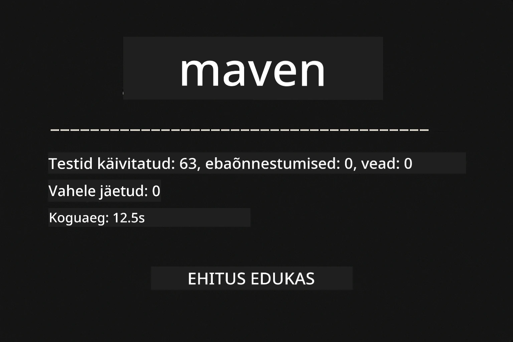
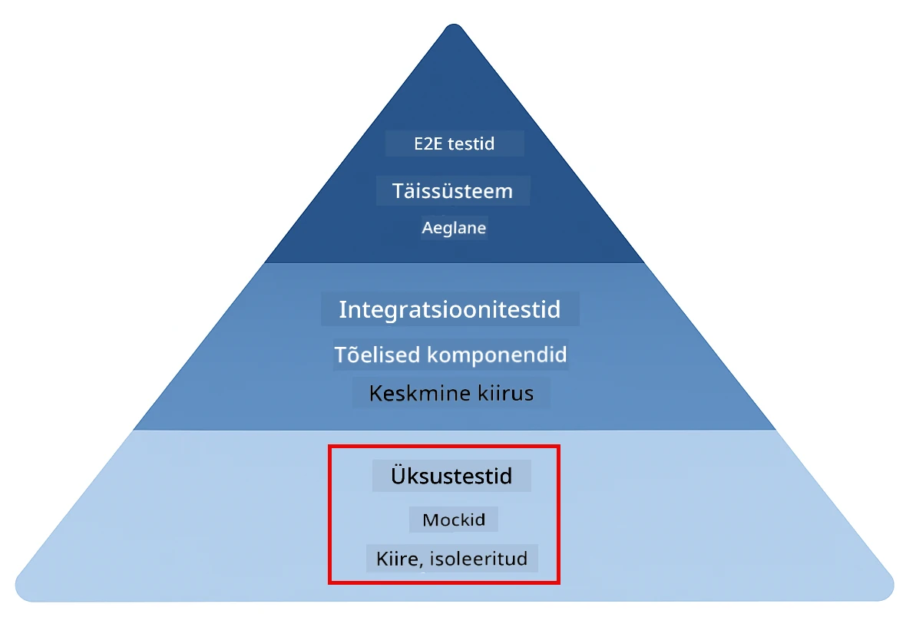
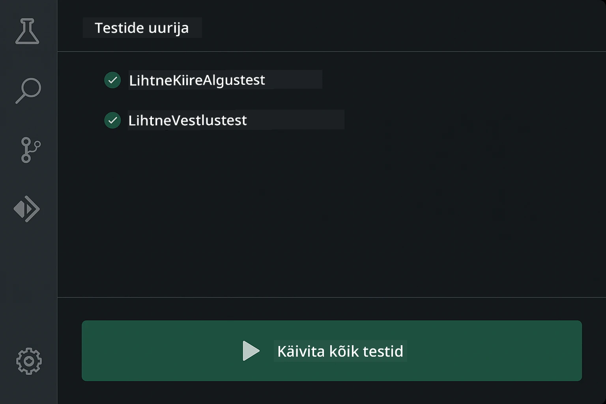
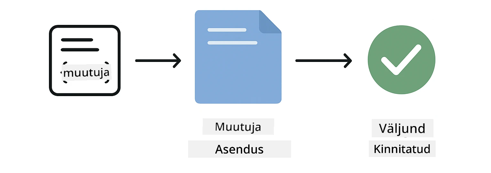
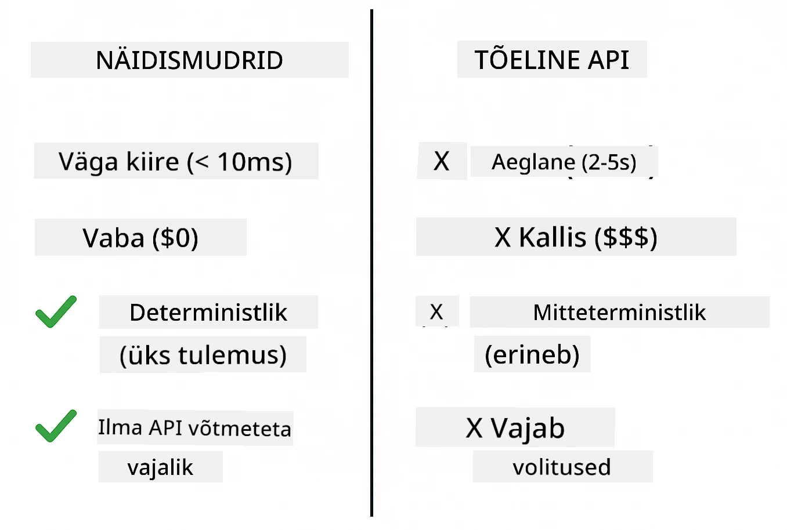
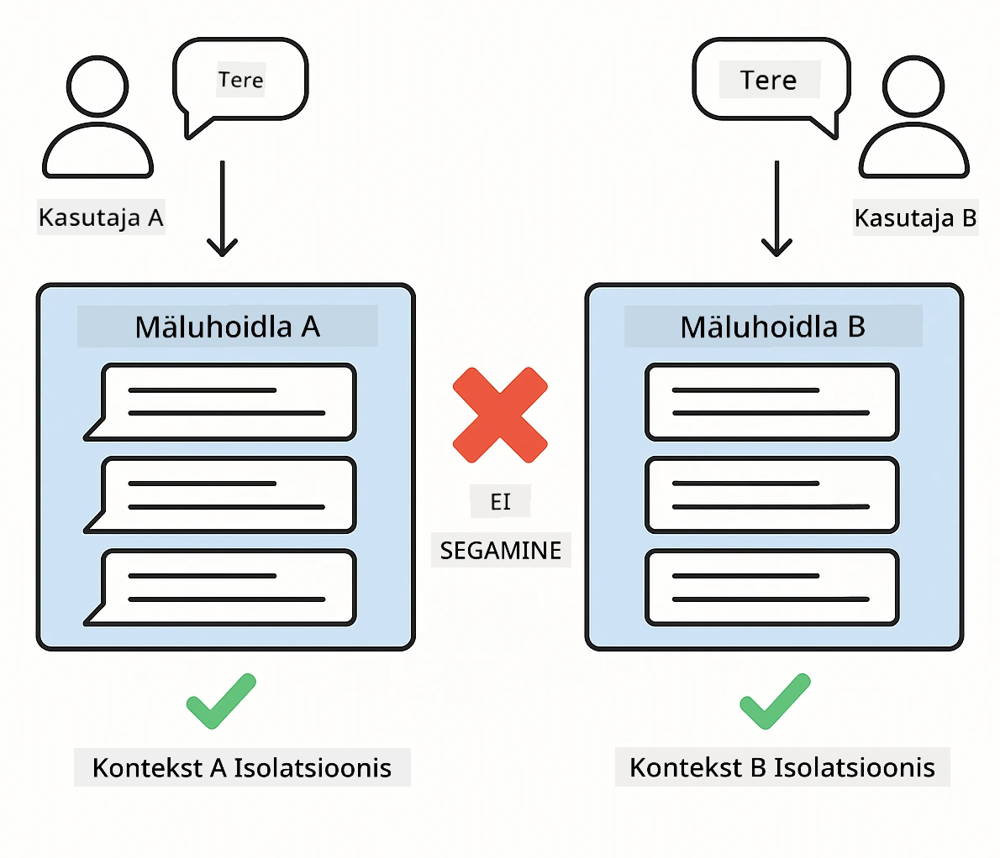
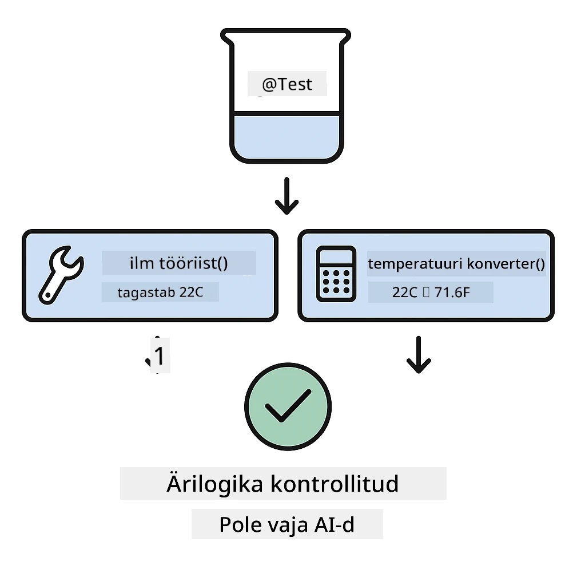
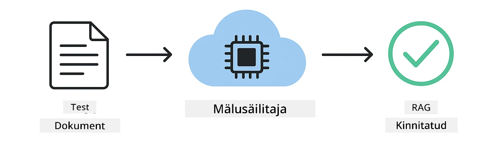

# LangChain4j rakenduste testimine

## Sisukord

- [Kiire algus](#kiire-algus)
- [Mida testid sisaldavad](#mida-testid-sisaldavad)
- [Testide käivitamine](#testide-käivitamine)
- [Testide käivitamine VS Code'is](#testide-käivitamine-vs-codeis)
- [Testimismustrid](#testimismustrid)
- [Testimise filosoofia](#testimise-filosoofia)
- [Järgmised sammud](#järgmised-sammud)

See juhend viib teid läbi testide, mis näitavad, kuidas testida AI rakendusi ilma API-võtmeteta või välist teenust kasutamata.

## Kiire algus

Käivitage kõik testid ühe käsuga:

**Bash:**
```bash
mvn test
```

**PowerShell:**
```powershell
mvn --% test
```

Kui kõik testid läbivad, peaksite nägema väljundit nagu alloleval ekraanipildil — testid jooksevad ilma ühegi veata.



*Õnnestunud testi täitmine, kus kõik testid läbivad ilma vigadeta*

## Mida testid sisaldavad

See kursus keskendub **ühiktestidele**, mis jooksevad lokaalselt. Iga test demonstreerib konkreetset LangChain4j kontseptsiooni isolatsioonis. Allpool olev testimise püramiid näitab, kuhu ühiktestid mahuvad — need moodustavad kiiruse ja usaldusväärsuse aluse, millele teie ülejäänud testistrateegia toetub.



*Testimise püramiid näitab tasakaalu ühiktestide (kiired, isoleeritud), integratsioonitestide (päris komponendid) ja lõppastme testide vahel. See koolitus katab ühiketste.*

| Moodul | Testid | Fookus | Olulised failid |
|--------|--------|--------|-----------------|
| **01 - Sissejuhatus** | 8 | Vestluse mälu ja oleku säilitamine | `SimpleConversationTest.java` |
| **02 - Promptide inseneritöö** | 12 | GPT-5.2 mustrid, ootuse tasemed, struktureeritud väljund | `SimpleGpt5PromptTest.java` |
| **03 - RAG** | 10 | Dokumendi sisestamine, embeddingud, sarnasuse otsing | `DocumentServiceTest.java` |
| **04 - Tööriistad** | 12 | Funktsioonide kutsumine ja tööriistade ahelad | `SimpleToolsTest.java` |
| **05 - MCP** | 8 | Model Context Protocol stdio transpordiga | `SimpleMcpTest.java` |

## Testide käivitamine

**Käivitage kõik testid juurest:**

**Bash:**
```bash
mvn test
```

**PowerShell:**
```powershell
mvn --% test
```

**Käivitage testid kindla mooduli jaoks:**

**Bash:**
```bash
cd 01-introduction && mvn test
# Või juurest
mvn test -pl 01-introduction
```

**PowerShell:**
```powershell
cd 01-introduction; mvn --% test
# Või juurtest
mvn --% test -pl 01-introduction
```

**Käivitage üks testiklass:**

**Bash:**
```bash
mvn test -Dtest=SimpleConversationTest
```

**PowerShell:**
```powershell
mvn --% test -Dtest=SimpleConversationTest
```

**Käivitage konkreetne testimeetod:**

**Bash:**
```bash
mvn test -Dtest=SimpleConversationTest#peaks säilitama vestluse ajaloo
```

**PowerShell:**
```powershell
mvn --% test -Dtest=SimpleConversationTest#peaks säilitama vestluse ajaloo
```

## Testide käivitamine VS Code'is

Kui kasutate Visual Studio Code'i, annab Test Explorer graafilise kasutajaliidese testide käivitamiseks ja silumiseks.



*VS Code Test Exploreri testipuu, kus on kõik Java testiklassid ja üksikud testimeetodid*

**Testide käivitamiseks VS Code'is:**

1. Avage Test Explorer, klõpsates Activity Baril olevat mõõteriista ikooni
2. Laiendage testipuu, et näha kõiki mooduleid ja testiklasse
3. Klõpsake mängu ikoonil mis tahes testi kõrval, et seda individuaalselt käivitada
4. Klõpsake nuppu "Run All Tests", et käivitada kogu komplekt
5. Paremklõpsake mis tahes testi ja valige "Debug Test", et panna murdepunkte ja läbida koodi sammhaaval

Test Explorer kuvab rohelisi linnukesi läbinud testide juures ja annab üksikasjalikud veateated, kui testid ebaõnnestuvad.

## Testimismustrid

### Muster 1: Promptide mallide testimine

Kõige lihtsam muster testib promptide malle ilma AI mudelit kutsumata. Kontrollite, et muutujate asendamine toimiks õigesti ja promptid oleksid ootuspäraselt vormindatud.



*Promptide mallide testimine, mis näitab muutujate asendamise voogu: mall kohatäitega → väärtuste rakendamine → vormindatud väljundi kontroll*

```java
@Test
@DisplayName("Should format prompt template with variables")
void testPromptTemplateFormatting() {
    PromptTemplate template = PromptTemplate.from(
        "Best time to visit {{destination}} for {{activity}}?"
    );
    
    Prompt prompt = template.apply(Map.of(
        "destination", "Paris",
        "activity", "sightseeing"
    ));
    
    assertThat(prompt.text()).isEqualTo("Best time to visit Paris for sightseeing?");
}
```

See muster kontrollib, et muutujate asendamine toimib õigesti ja promptid vormindatakse ootuspäraselt — API võtit ega mudelikõnet ei ole vaja.

### Muster 2: Keelemudelite katmine

Vestlusloogika testimisel kasutage Mockito, et luua võltsmudeleid, mis tagastavad eelnevalt määratud vastuseid. See teeb testid kiireks, tasuta ja deterministlikuks.



*Võrdlus, mis näitab, miks testimisel eelistatakse võltse: need on kiired, tasuta, deterministlikud ja EI vaja API võtmeid*

```java
@ExtendWith(MockitoExtension.class)
class SimpleConversationTest {
    
    private ConversationService conversationService;
    
    @Mock
    private OpenAiOfficialChatModel mockChatModel;
    
    @BeforeEach
    void setUp() {
        ChatResponse mockResponse = ChatResponse.builder()
            .aiMessage(AiMessage.from("This is a test response"))
            .build();
        when(mockChatModel.chat(anyList())).thenReturn(mockResponse);
        
        conversationService = new ConversationService(mockChatModel);
    }
    
    @Test
    void shouldMaintainConversationHistory() {
        String conversationId = conversationService.startConversation();
        
        ChatResponse mockResponse1 = ChatResponse.builder()
            .aiMessage(AiMessage.from("Response 1"))
            .build();
        ChatResponse mockResponse2 = ChatResponse.builder()
            .aiMessage(AiMessage.from("Response 2"))
            .build();
        ChatResponse mockResponse3 = ChatResponse.builder()
            .aiMessage(AiMessage.from("Response 3"))
            .build();
        
        when(mockChatModel.chat(anyList()))
            .thenReturn(mockResponse1)
            .thenReturn(mockResponse2)
            .thenReturn(mockResponse3);

        conversationService.chat(conversationId, "First message");
        conversationService.chat(conversationId, "Second message");
        conversationService.chat(conversationId, "Third message");

        List<ChatMessage> history = conversationService.getHistory(conversationId);
        assertThat(history).hasSize(6); // 3 kasutaja + 3 tehisintellekti sõnumit
    }
}
```

See muster ilmub failis `01-introduction/src/test/java/com/example/langchain4j/service/SimpleConversationTest.java`. Võlts tagab järjepideva käitumise, et kontrollida mälu haldust õigesti toimivat.

### Muster 3: Vestluse isoleerimise testimine

Vestluse mälu peab kasutajaid eristama. See test kontrollib, et vestlused ei segaks kontekste.



*Vestluse isoleerimise testimine näitab eraldi mäluhoidlaid eri kasutajate jaoks konteksti segamise vältimiseks*

```java
@Test
void shouldIsolateConversationsByid() {
    String conv1 = conversationService.startConversation();
    String conv2 = conversationService.startConversation();
    
    ChatResponse mockResponse = ChatResponse.builder()
        .aiMessage(AiMessage.from("Response"))
        .build();
    when(mockChatModel.chat(anyList())).thenReturn(mockResponse);

    conversationService.chat(conv1, "Message for conversation 1");
    conversationService.chat(conv2, "Message for conversation 2");

    List<ChatMessage> history1 = conversationService.getHistory(conv1);
    List<ChatMessage> history2 = conversationService.getHistory(conv2);
    
    assertThat(history1).hasSize(2);
    assertThat(history2).hasSize(2);
}
```

Iga vestlus hoiab enda sõltumatut ajalugu. Tootmissüsteemides on see isoleeritus oluline mitmekasutajarakenduste jaoks.

### Muster 4: Tööriistade eraldiseisev testimine

Tööriistad on funktsioonid, mida AI saab kutsuda. Testige neid otse, et veenduda, et need töötavad õigesti, sõltumata AI otsustest.



*Tööriistade eraldiseisev testimine näitab võltsimise tööriista käivitamist ilma AI kutsumata äriloogika kontrollimiseks*

```java
@Test
void shouldConvertCelsiusToFahrenheit() {
    TemperatureTool tempTool = new TemperatureTool();
    String result = tempTool.celsiusToFahrenheit(25.0);
    assertThat(result).containsPattern("77[.,]0°F");
}

@Test
void shouldDemonstrateToolChaining() {
    WeatherTool weatherTool = new WeatherTool();
    TemperatureTool tempTool = new TemperatureTool();

    String weatherResult = weatherTool.getCurrentWeather("Seattle");
    assertThat(weatherResult).containsPattern("\\d+°C");

    String conversionResult = tempTool.celsiusToFahrenheit(22.0);
    assertThat(conversionResult).containsPattern("71[.,]6°F");
}
```

Need testid failist `04-tools/src/test/java/com/example/langchain4j/agents/tools/SimpleToolsTest.java` valideerivad tööriistade loogikat ilma AI kaasamiseta. Ahela näide näitab, kuidas ühe tööriista väljund läheb teise sisendiks.

### Muster 5: Mälu-põhine RAG testimine

RAG süsteemid kasutavad tavaliselt vektordatabaase ja embedimis-teenuseid. Mälu-põhine muster võimaldab testida kogu torujuhet ilma väliste sõltuvusteta.



*Mälu-põhise RAG testimisläbivaade, mis kuvab dokumendi töötlemist, embedimiste salvestamist ja sarnasuse otsingut ilma andmebaasi nõudmata*

```java
@Test
void testProcessTextDocument() {
    String content = "This is a test document.\nIt has multiple lines.";
    InputStream inputStream = new ByteArrayInputStream(content.getBytes(StandardCharsets.UTF_8));
    
    DocumentService.ProcessedDocument result = 
        documentService.processDocument(inputStream, "test.txt");

    assertNotNull(result);
    assertTrue(result.segments().size() > 0);
    assertEquals("test.txt", result.segments().get(0).metadata().getString("filename"));
}
```

See test failist `03-rag/src/test/java/com/example/langchain4j/rag/service/DocumentServiceTest.java` loob dokumendi mällu ja kontrollib tükkide tegemist ning metaandmete käitlemist.

### Muster 6: MCP integratsioonitestimine

MCP moodul testib Model Context Protocol integreerimist stdio transpordi kaudu. Need testid kontrollivad, et teie rakendus saab käivitada ja suhelda MCP serveritega alamprotsessidena.

Testid failis `05-mcp/src/test/java/com/example/langchain4j/mcp/SimpleMcpTest.java` valideerivad MCP kliendi käitumist.

**Käivitage need:**

**Bash:**
```bash
cd 05-mcp && mvn test
```

**PowerShell:**
```powershell
cd 05-mcp; mvn --% test
```

## Testimise filosoofia

Testige oma koodi, mitte AI-d. Testid peaksid valideerima kirjutatud koodi, kontrollides, kuidas promptid konstrueeritakse, kuidas mälu hallatakse ja kuidas tööriistad täidetakse. AI vastused varieeruvad ega tohiks olla testi kinnituses osa. Küsige endalt, kas teie prompti mall asendab muutujaid õigesti, mitte seda, kas AI annab õige vastuse.

Kasutage keelemudelite puhul valemänge. Need on välised sõltuvused, mis on aeglased, kallid ja mitte-deterministlikud. Valemängud muudavad testid kiiremaks (millisekundites, mitte sekundites), tasuta (ilma API kuludeta) ja deterministlikuks (iga kord sama tulemus).

Hoia testid iseseisvad. Iga test peaks seadistama oma andmed, mitte sõltuma teistest testidest ja puhastama enda järel. Testid peaksid läbima sõltumata käivitamise järjekorrast.

Testige äärmusjuhtumeid peale õnne tee. Katsetage tühjade sisenditega, väga suurte sisenditega, erimärkidega, vigaste parameetrite ja piiritingimustega. Need paljastavad tihti vead, mida tavakasutus ei näita.

Kasutage kirjeldavaid nimesid. Võrrelge `shouldMaintainConversationHistoryAcrossMultipleMessages()` ja `test1()`. Esimene ütleb täpselt, mida testitakse, muutes rikete silumise palju lihtsamaks.

## Järgmised sammud

Nüüd, kui mõistate testimismustreid, sukeldage end sügavamale iga mooduli juurde:

- **[01 - Sissejuhatus](../01-introduction/README.md)** - Õppige vestluse mälu haldamist
- **[02 - Promptide inseneritöö](../02-prompt-engineering/README.md)** - Valdage GPT-5.2 promptide mustreid
- **[03 - RAG](../03-rag/README.md)** - Looge päringutega täiustatud generaatori süsteeme
- **[04 - Tööriistad](../04-tools/README.md)** - Rakendage funktsioonide kutsumist ja tööriistade ahelaid
- **[05 - MCP](../05-mcp/README.md)** - Integreerige Model Context Protocol

Iga mooduli README annab üksikasjalikke seletusi siin testitud kontseptsioonide kohta.

---

**Navigeerimine:** [← Tagasi peamenüüsse](../README.md)

---

<!-- CO-OP TRANSLATOR DISCLAIMER START -->
**Lahtiütlus**:
See dokument on tõlgitud kasutades AI tõlketeenust [Co-op Translator](https://github.com/Azure/co-op-translator). Kuigi me püüdleme täpsuse poole, palun pange tähele, et automatiseeritud tõlgetes võib esineda vigu või ebatäpsusi. Originaaldokument selle emakeeles tuleks pidada autoriteetseks allikaks. Olulise teabe puhul soovitatakse kasutada professionaalset inimtõlget. Me ei vastuta selle tõlkega seotud eksimustest või valesti mõistmistest.
<!-- CO-OP TRANSLATOR DISCLAIMER END -->