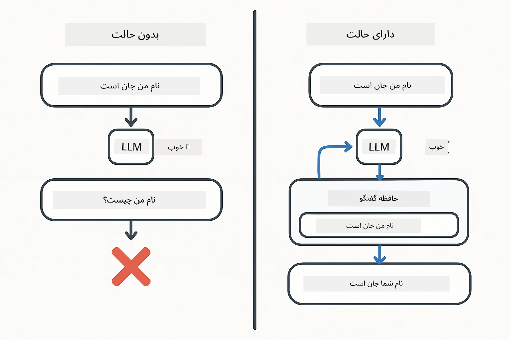
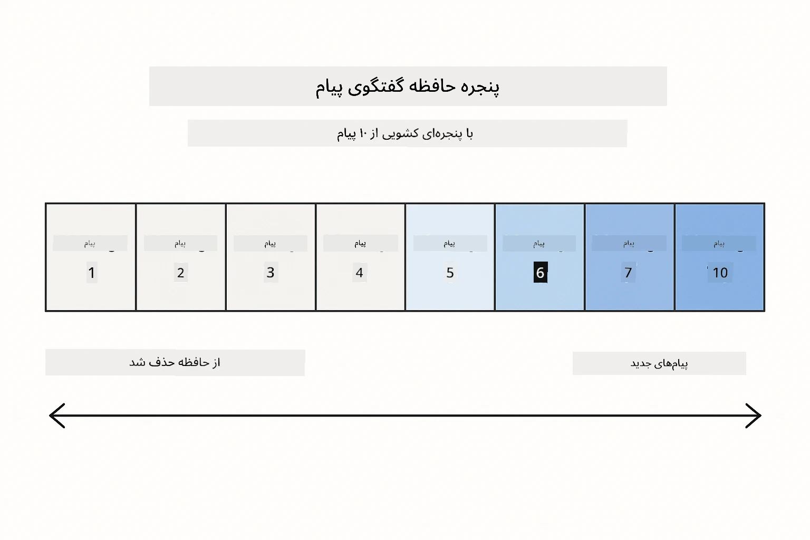
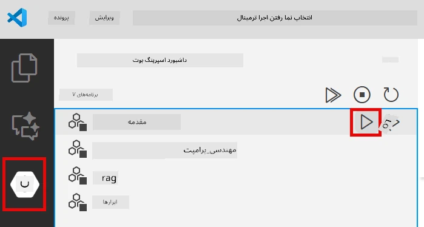
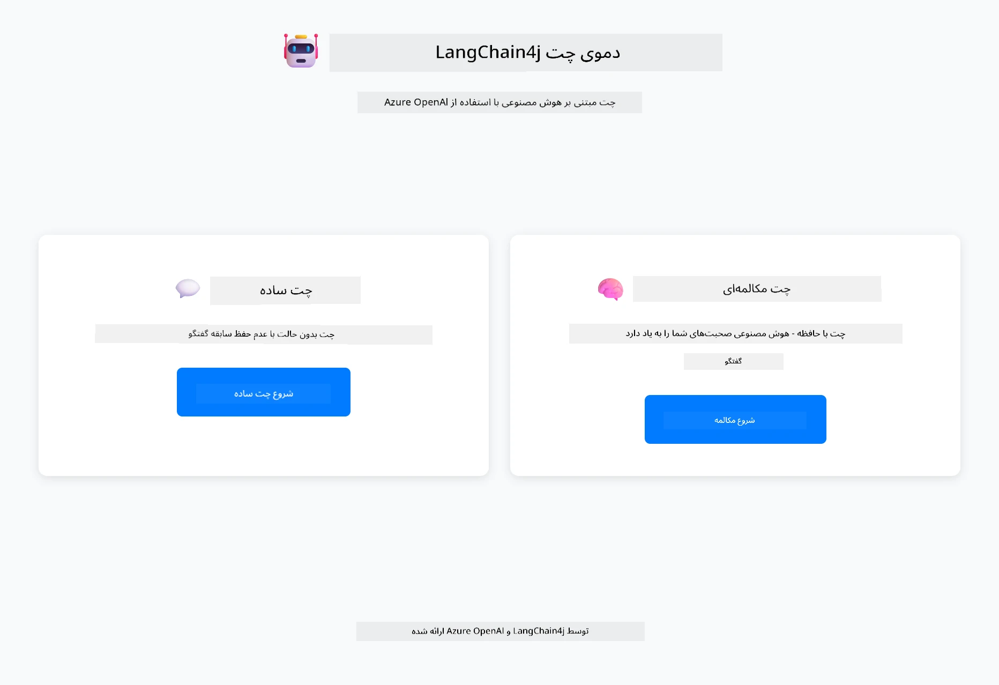
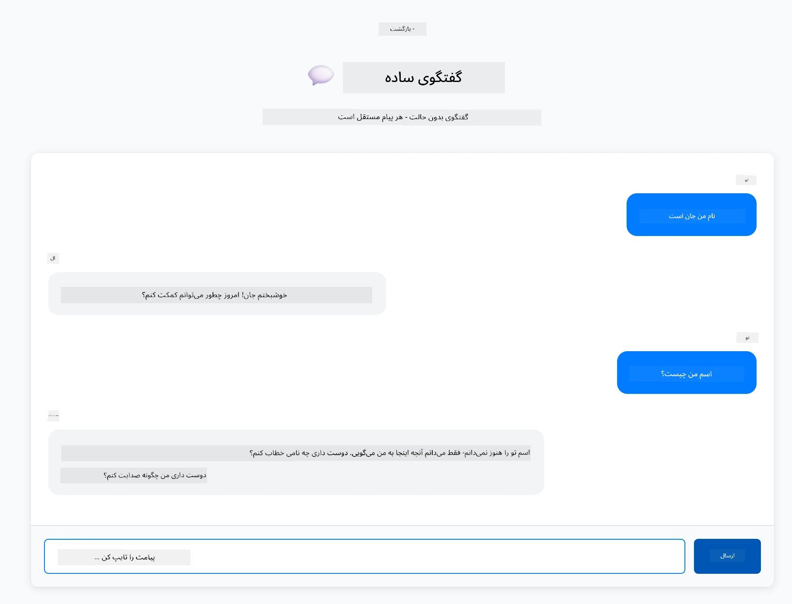
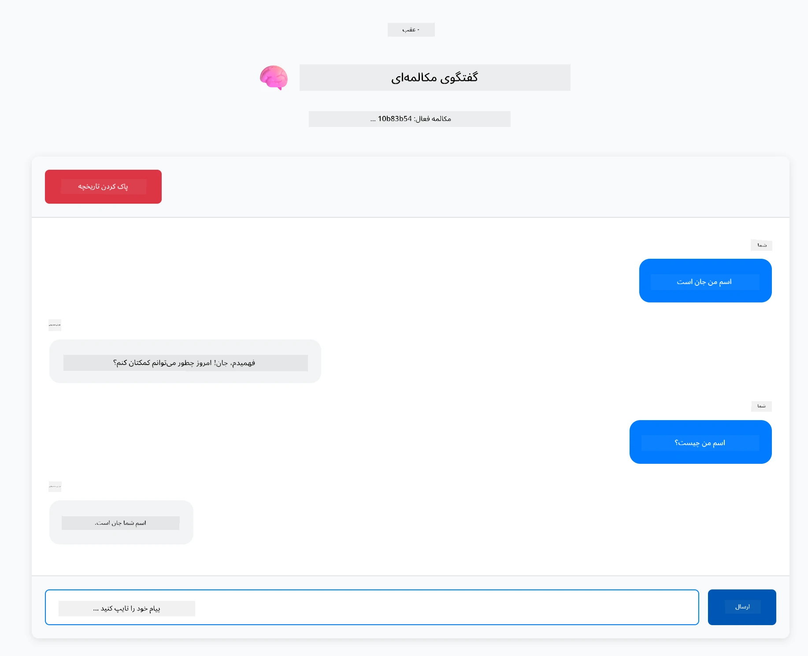

<!--
CO_OP_TRANSLATOR_METADATA:
{
  "original_hash": "c3e07ca58d0b8a3f47d3bf5728541e0a",
  "translation_date": "2025-12-13T13:07:25+00:00",
  "source_file": "01-introduction/README.md",
  "language_code": "fa"
}
-->
# ماژول ۰۱: شروع کار با LangChain4j

## فهرست مطالب

- [آنچه یاد خواهید گرفت](../../../01-introduction)
- [پیش‌نیازها](../../../01-introduction)
- [درک مسئله اصلی](../../../01-introduction)
- [درک توکن‌ها](../../../01-introduction)
- [نحوه کار حافظه](../../../01-introduction)
- [نحوه استفاده از LangChain4j در این ماژول](../../../01-introduction)
- [استقرار زیرساخت Azure OpenAI](../../../01-introduction)
- [اجرای برنامه به صورت محلی](../../../01-introduction)
- [استفاده از برنامه](../../../01-introduction)
  - [چت بدون حالت (پنل سمت چپ)](../../../01-introduction)
  - [چت با حالت (پنل سمت راست)](../../../01-introduction)
- [گام‌های بعدی](../../../01-introduction)

## آنچه یاد خواهید گرفت

اگر شروع سریع را کامل کرده‌اید، دیدید چگونه پرامپت‌ها را ارسال و پاسخ‌ها را دریافت کنید. این پایه است، اما برنامه‌های واقعی به چیزهای بیشتری نیاز دارند. این ماژول به شما آموزش می‌دهد چگونه یک هوش مصنوعی مکالمه‌ای بسازید که زمینه را به خاطر بسپارد و حالت را حفظ کند - تفاوت بین یک دمو یک‌باره و یک برنامه آماده تولید.

در این راهنما از GPT-5 Azure OpenAI استفاده خواهیم کرد چون قابلیت‌های پیشرفته استدلال آن رفتار الگوهای مختلف را واضح‌تر می‌کند. وقتی حافظه اضافه می‌کنید، تفاوت را به وضوح خواهید دید. این باعث می‌شود درک اینکه هر جزء چه چیزی به برنامه شما می‌آورد آسان‌تر شود.

شما یک برنامه خواهید ساخت که هر دو الگو را نشان می‌دهد:

**چت بدون حالت** - هر درخواست مستقل است. مدل هیچ حافظه‌ای از پیام‌های قبلی ندارد. این همان الگویی است که در شروع سریع استفاده کردید.

**مکالمه با حالت** - هر درخواست شامل تاریخچه مکالمه است. مدل زمینه را در چندین نوبت حفظ می‌کند. این چیزی است که برنامه‌های تولیدی نیاز دارند.

## پیش‌نیازها

- اشتراک Azure با دسترسی به Azure OpenAI
- جاوا ۲۱، Maven 3.9+
- Azure CLI (https://learn.microsoft.com/en-us/cli/azure/install-azure-cli)
- Azure Developer CLI (azd) (https://learn.microsoft.com/en-us/azure/developer/azure-developer-cli/install-azd)

> **توجه:** جاوا، Maven، Azure CLI و Azure Developer CLI (azd) در devcontainer ارائه شده از قبل نصب شده‌اند.

> **توجه:** این ماژول از GPT-5 در Azure OpenAI استفاده می‌کند. استقرار به صورت خودکار از طریق `azd up` پیکربندی شده است - نام مدل را در کد تغییر ندهید.

## درک مسئله اصلی

مدل‌های زبانی بدون حالت هستند. هر فراخوانی API مستقل است. اگر بگویید "اسم من جان است" و سپس بپرسید "اسم من چیست؟"، مدل هیچ اطلاعی ندارد که شما تازه خودتان را معرفی کرده‌اید. هر درخواست را طوری می‌بیند که انگار اولین مکالمه شماست.

این برای پرسش و پاسخ ساده خوب است اما برای برنامه‌های واقعی بی‌فایده است. ربات‌های خدمات مشتری باید آنچه به آنها گفته‌اید را به خاطر بسپارند. دستیاران شخصی به زمینه نیاز دارند. هر مکالمه چند نوبتی نیازمند حافظه است.



*تفاوت بین مکالمات بدون حالت (فراخوانی‌های مستقل) و با حالت (آگاه به زمینه)*

## درک توکن‌ها

قبل از ورود به مکالمات، مهم است که توکن‌ها را درک کنید - واحدهای پایه متن که مدل‌های زبانی پردازش می‌کنند:


*مثالی از چگونگی شکستن متن به توکن‌ها - "I love AI!" به ۴ واحد پردازشی جداگانه تبدیل می‌شود*

توکن‌ها نحوه اندازه‌گیری و پردازش متن توسط مدل‌های هوش مصنوعی هستند. کلمات، علائم نگارشی و حتی فاصله‌ها می‌توانند توکن باشند. مدل شما محدودیتی دارد که چند توکن را می‌تواند همزمان پردازش کند (۴۰۰,۰۰۰ برای GPT-5، با حداکثر ۲۷۲,۰۰۰ توکن ورودی و ۱۲۸,۰۰۰ توکن خروجی). درک توکن‌ها به شما کمک می‌کند طول مکالمه و هزینه‌ها را مدیریت کنید.

## نحوه کار حافظه

حافظه چت مشکل بدون حالت بودن را با حفظ تاریخچه مکالمه حل می‌کند. قبل از ارسال درخواست به مدل، چارچوب پیام‌های قبلی مرتبط را اضافه می‌کند. وقتی می‌پرسید "اسم من چیست؟"، سیستم در واقع کل تاریخچه مکالمه را ارسال می‌کند تا مدل ببیند شما قبلاً گفته‌اید "اسم من جان است."

LangChain4j پیاده‌سازی‌های حافظه‌ای ارائه می‌دهد که این کار را به صورت خودکار انجام می‌دهند. شما تعیین می‌کنید چند پیام نگه داشته شود و چارچوب پنجره زمینه را مدیریت می‌کند.



*MessageWindowChatMemory پنجره لغزنده‌ای از پیام‌های اخیر را نگه می‌دارد و به صورت خودکار پیام‌های قدیمی را حذف می‌کند*

## نحوه استفاده از LangChain4j در این ماژول

این ماژول شروع سریع را با ادغام Spring Boot و افزودن حافظه مکالمه گسترش می‌دهد. اینجا نحوه کنار هم قرار گرفتن قطعات است:

**وابستگی‌ها** - افزودن دو کتابخانه LangChain4j:

```xml
<dependency>
    <groupId>dev.langchain4j</groupId>
    <artifactId>langchain4j</artifactId> <!-- Inherited from BOM in root pom.xml -->
</dependency>
<dependency>
    <groupId>dev.langchain4j</groupId>
    <artifactId>langchain4j-open-ai-official</artifactId> <!-- Inherited from BOM in root pom.xml -->
</dependency>
```

**مدل چت** - پیکربندی Azure OpenAI به عنوان یک bean در Spring ([LangChainConfig.java](../../../01-introduction/src/main/java/com/example/langchain4j/config/LangChainConfig.java)):

```java
@Bean
public OpenAiOfficialChatModel openAiOfficialChatModel() {
    return OpenAiOfficialChatModel.builder()
            .baseUrl(azureEndpoint)
            .apiKey(azureApiKey)
            .modelName(deploymentName)
            .timeout(Duration.ofMinutes(5))
            .maxRetries(3)
            .build();
}
```

سازنده اعتبارنامه‌ها را از متغیرهای محیطی که توسط `azd up` تنظیم شده‌اند می‌خواند. تنظیم `baseUrl` به نقطه انتهایی Azure شما باعث می‌شود کلاینت OpenAI با Azure OpenAI کار کند.

**حافظه مکالمه** - پیگیری تاریخچه چت با MessageWindowChatMemory ([ConversationService.java](../../../01-introduction/src/main/java/com/example/langchain4j/service/ConversationService.java)):

```java
ChatMemory memory = MessageWindowChatMemory.withMaxMessages(10);

memory.add(UserMessage.from("My name is John"));
memory.add(AiMessage.from("Nice to meet you, John!"));

memory.add(UserMessage.from("What's my name?"));
AiMessage aiMessage = chatModel.chat(memory.messages()).aiMessage();
memory.add(aiMessage);
```

حافظه را با `withMaxMessages(10)` ایجاد کنید تا ۱۰ پیام آخر نگه داشته شود. پیام‌های کاربر و هوش مصنوعی را با بسته‌بندی‌های تایپ شده اضافه کنید: `UserMessage.from(text)` و `AiMessage.from(text)`. تاریخچه را با `memory.messages()` بازیابی و به مدل ارسال کنید. سرویس نمونه‌های حافظه جداگانه برای هر شناسه مکالمه ذخیره می‌کند که اجازه می‌دهد چندین کاربر همزمان چت کنند.

> **🤖 امتحان کنید با چت [GitHub Copilot](https://github.com/features/copilot):** فایل [`ConversationService.java`](../../../01-introduction/src/main/java/com/example/langchain4j/service/ConversationService.java) را باز کنید و بپرسید:
> - "MessageWindowChatMemory چگونه تصمیم می‌گیرد وقتی پنجره پر است کدام پیام‌ها را حذف کند؟"
> - "آیا می‌توانم ذخیره‌سازی حافظه سفارشی با استفاده از پایگاه داده به جای حافظه درون‌برنامه‌ای پیاده‌سازی کنم؟"
> - "چگونه می‌توانم خلاصه‌سازی برای فشرده‌سازی تاریخچه مکالمه قدیمی اضافه کنم؟"

نقطه پایانی چت بدون حالت حافظه را کاملاً نادیده می‌گیرد - فقط `chatModel.chat(prompt)` مانند شروع سریع. نقطه پایانی با حالت پیام‌ها را به حافظه اضافه می‌کند، تاریخچه را بازیابی می‌کند و آن زمینه را با هر درخواست می‌فرستد. همان پیکربندی مدل، الگوهای متفاوت.

## استقرار زیرساخت Azure OpenAI

**Bash:**
```bash
cd 01-introduction
azd up  # اشتراک و مکان را انتخاب کنید (eastus2 توصیه می‌شود)
```

**PowerShell:**
```powershell
cd 01-introduction
azd up  # اشتراک و مکان را انتخاب کنید (توصیه شده: eastus2)
```

> **توجه:** اگر با خطای تایم‌اوت مواجه شدید (`RequestConflict: Cannot modify resource ... provisioning state is not terminal`)، کافی است دوباره `azd up` را اجرا کنید. منابع Azure ممکن است هنوز در حال آماده‌سازی باشند و تلاش مجدد اجازه می‌دهد استقرار پس از رسیدن منابع به حالت نهایی کامل شود.

این کار موارد زیر را انجام می‌دهد:
1. استقرار منبع Azure OpenAI با مدل‌های GPT-5 و text-embedding-3-small
2. ایجاد خودکار فایل `.env` در ریشه پروژه با اعتبارنامه‌ها
3. تنظیم تمام متغیرهای محیطی مورد نیاز

**مشکل در استقرار دارید؟** راهنمای عیب‌یابی دقیق شامل تداخل نام زیر دامنه، مراحل استقرار دستی در Azure Portal و راهنمای پیکربندی مدل را در [Infrastructure README](infra/README.md) ببینید.

**تأیید موفقیت استقرار:**

**Bash:**
```bash
cat ../.env  # باید AZURE_OPENAI_ENDPOINT، API_KEY و غیره را نشان دهد.
```

**PowerShell:**
```powershell
Get-Content ..\.env  # باید AZURE_OPENAI_ENDPOINT، API_KEY و غیره را نشان دهد.
```

> **توجه:** دستور `azd up` به صورت خودکار فایل `.env` را ایجاد می‌کند. اگر بعداً نیاز به به‌روزرسانی داشتید، می‌توانید فایل `.env` را به صورت دستی ویرایش کنید یا با اجرای:
>
> **Bash:**
> ```bash
> cd ..
> bash .azd-env.sh
> ```
>
> **PowerShell:**
> ```powershell
> cd ..
> .\.azd-env.ps1
> ```

## اجرای برنامه به صورت محلی

**تأیید استقرار:**

اطمینان حاصل کنید فایل `.env` در دایرکتوری ریشه با اعتبارنامه‌های Azure وجود دارد:

**Bash:**
```bash
cat ../.env  # باید AZURE_OPENAI_ENDPOINT، API_KEY، DEPLOYMENT را نشان دهد
```

**PowerShell:**
```powershell
Get-Content ..\.env  # باید AZURE_OPENAI_ENDPOINT، API_KEY، DEPLOYMENT را نشان دهد
```

**شروع برنامه‌ها:**

**گزینه ۱: استفاده از Spring Boot Dashboard (توصیه شده برای کاربران VS Code)**

devcontainer شامل افزونه Spring Boot Dashboard است که رابط بصری برای مدیریت همه برنامه‌های Spring Boot فراهم می‌کند. می‌توانید آن را در نوار فعالیت سمت چپ VS Code (آیکون Spring Boot) پیدا کنید.

از Spring Boot Dashboard می‌توانید:
- همه برنامه‌های Spring Boot موجود در فضای کاری را ببینید
- برنامه‌ها را با یک کلیک شروع/توقف کنید
- لاگ‌های برنامه را به صورت زنده مشاهده کنید
- وضعیت برنامه را نظارت کنید

فقط روی دکمه پخش کنار "introduction" کلیک کنید تا این ماژول شروع شود، یا همه ماژول‌ها را همزمان اجرا کنید.



**گزینه ۲: استفاده از اسکریپت‌های شل**

همه برنامه‌های وب (ماژول‌های ۰۱-۰۴) را شروع کنید:

**Bash:**
```bash
cd ..  # از دایرکتوری ریشه
./start-all.sh
```

**PowerShell:**
```powershell
cd ..  # از دایرکتوری ریشه
.\start-all.ps1
```

یا فقط این ماژول را شروع کنید:

**Bash:**
```bash
cd 01-introduction
./start.sh
```

**PowerShell:**
```powershell
cd 01-introduction
.\start.ps1
```

هر دو اسکریپت به صورت خودکار متغیرهای محیطی را از فایل `.env` ریشه بارگذاری می‌کنند و در صورت عدم وجود، فایل‌های JAR را می‌سازند.

> **توجه:** اگر ترجیح می‌دهید قبل از شروع همه ماژول‌ها را به صورت دستی بسازید:
>
> **Bash:**
> ```bash
> cd ..  # Go to root directory
> mvn clean package -DskipTests
> ```
>
> **PowerShell:**
> ```powershell
> cd ..  # Go to root directory
> mvn clean package -DskipTests
> ```

آدرس http://localhost:8080 را در مرورگر خود باز کنید.

**برای توقف:**

**Bash:**
```bash
./stop.sh  # فقط این ماژول
# یا
cd .. && ./stop-all.sh  # همه ماژول‌ها
```

**PowerShell:**
```powershell
.\stop.ps1  # فقط این ماژول
# یا
cd ..; .\stop-all.ps1  # همه ماژول‌ها
```

## استفاده از برنامه

برنامه یک رابط وب با دو پیاده‌سازی چت کنار هم ارائه می‌دهد.



*داشبورد نمایش‌دهنده گزینه‌های چت ساده (بدون حالت) و چت مکالمه‌ای (با حالت)*

### چت بدون حالت (پنل سمت چپ)

اول این را امتحان کنید. بگویید "اسم من جان است" و بلافاصله بپرسید "اسم من چیست؟" مدل به خاطر نمی‌آورد چون هر پیام مستقل است. این مشکل اصلی ادغام مدل زبان پایه را نشان می‌دهد - بدون زمینه مکالمه.



*هوش مصنوعی اسم شما را از پیام قبلی به خاطر نمی‌آورد*

### چت با حالت (پنل سمت راست)

حالا همان توالی را اینجا امتحان کنید. بگویید "اسم من جان است" و سپس "اسم من چیست؟" این بار به خاطر می‌آورد. تفاوت MessageWindowChatMemory است - تاریخچه مکالمه را حفظ می‌کند و با هر درخواست آن را می‌فرستد. این نحوه کار هوش مصنوعی مکالمه‌ای در تولید است.



*هوش مصنوعی اسم شما را از ابتدای مکالمه به خاطر می‌آورد*

هر دو پنل از همان مدل GPT-5 استفاده می‌کنند. تنها تفاوت حافظه است. این به وضوح نشان می‌دهد حافظه چه چیزی به برنامه شما می‌آورد و چرا برای موارد استفاده واقعی ضروری است.

## گام‌های بعدی

**ماژول بعدی:** [۰۲-مهندسی پرامپت - مهندسی پرامپت با GPT-5](../02-prompt-engineering/README.md)

---

**ناوبری:** [← قبلی: ماژول ۰۰ - شروع سریع](../00-quick-start/README.md) | [بازگشت به اصلی](../README.md) | [بعدی: ماژول ۰۲ - مهندسی پرامپت →](../02-prompt-engineering/README.md)

---

<!-- CO-OP TRANSLATOR DISCLAIMER START -->
**سلب مسئولیت**:  
این سند با استفاده از سرویس ترجمه هوش مصنوعی [Co-op Translator](https://github.com/Azure/co-op-translator) ترجمه شده است. در حالی که ما در تلاش برای دقت هستیم، لطفاً توجه داشته باشید که ترجمه‌های خودکار ممکن است حاوی خطاها یا نادرستی‌هایی باشند. سند اصلی به زبان بومی خود باید به عنوان منبع معتبر در نظر گرفته شود. برای اطلاعات حیاتی، ترجمه حرفه‌ای انسانی توصیه می‌شود. ما مسئول هیچ گونه سوءتفاهم یا تفسیر نادرستی که از استفاده این ترجمه ناشی شود، نیستیم.
<!-- CO-OP TRANSLATOR DISCLAIMER END -->