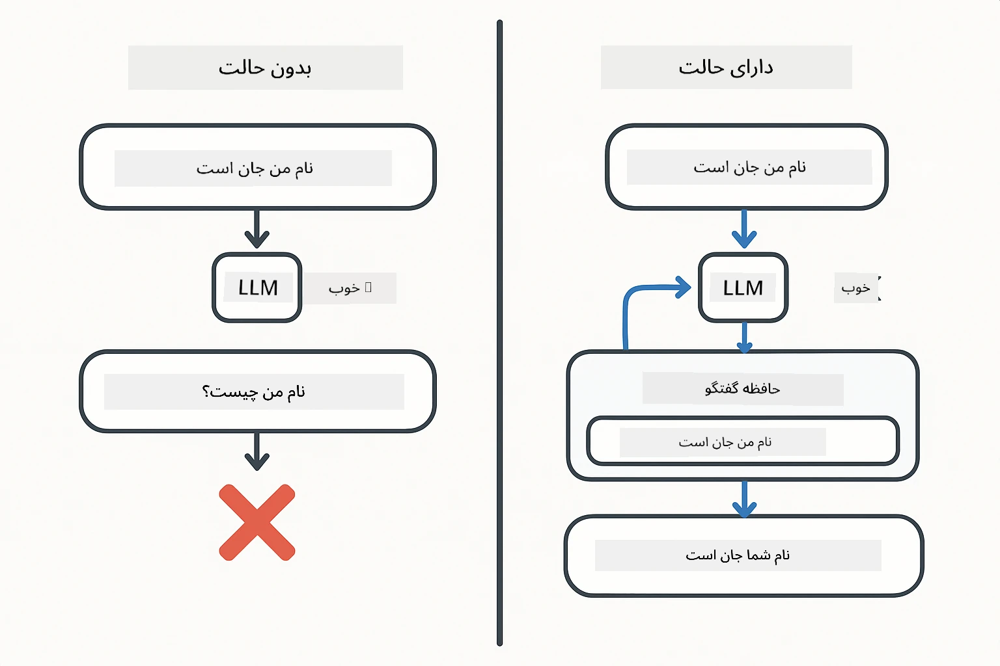
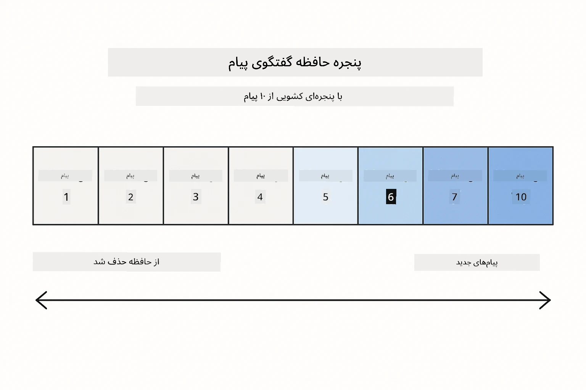
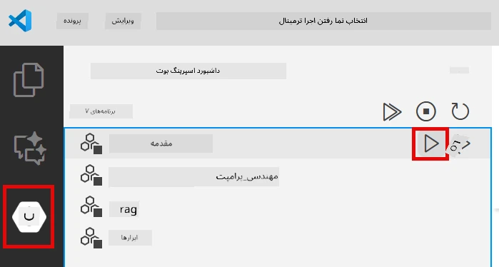
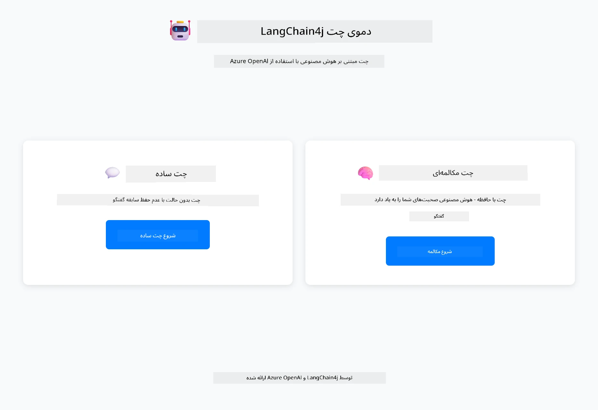
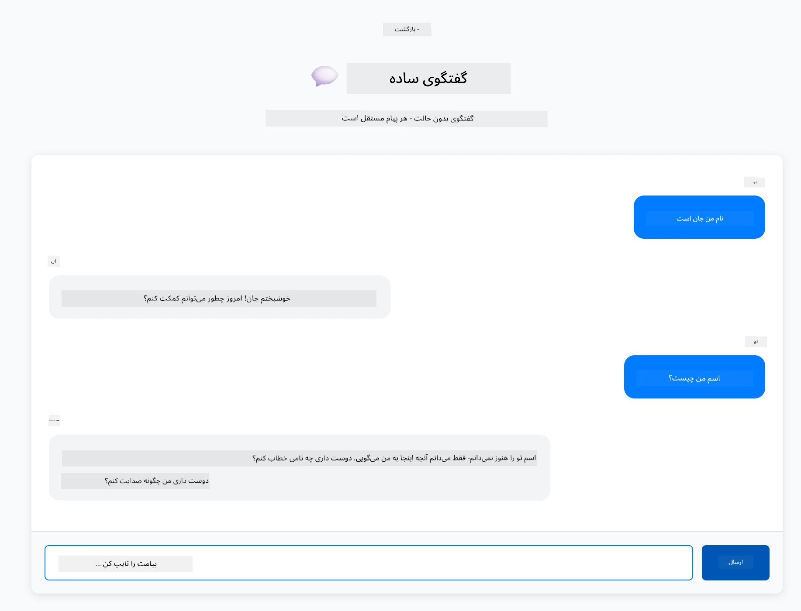
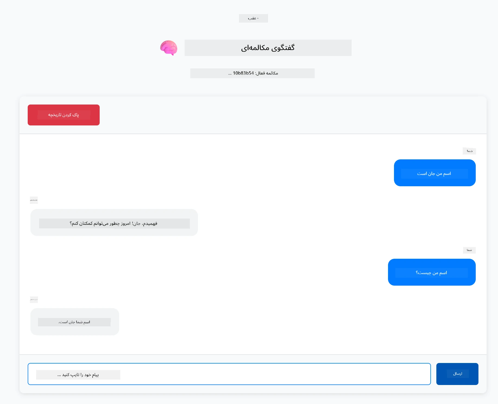

# ماژول ۰۱: شروع کار با LangChain4j

## فهرست مطالب

- [بررسی ویدئویی](#بررسی-ویدئویی)
- [آنچه خواهید آموخت](#آنچه-خواهید-آموخت)
- [پیش‌نیازها](#پیش‌نیازها)
- [درک مشکل اصلی](#درک-مشکل-اصلی)
- [درک توکن‌ها](#درک-توکن‌ها)
- [چگونگی کارکرد حافظه](#چگونگی-کارکرد-حافظه)
- [نحوه استفاده از LangChain4j در این پروژه](#نحوه-استفاده-از-langchain4j-در-این-پروژه)
- [استقرار زیرساخت Azure OpenAI](#استقرار-زیرساخت-azure-openai)
- [اجرای برنامه به صورت محلی](#اجرای-برنامه-به-صورت-محلی)
- [استفاده از برنامه](#استفاده-از-برنامه)
  - [چت بدون وضعیت (پنل سمت چپ)](#چت-بدون-وضعیت-پنل-سمت-چپ)
  - [چت دارای وضعیت (پنل سمت راست)](#چت-دارای-وضعیت-پنل-سمت-راست)
- [گام‌های بعدی](#گام‌های-بعدی)

## بررسی ویدئویی

این جلسه زنده را تماشا کنید که توضیح می‌دهد چگونه با این ماژول شروع کنید:

<a href="https://www.youtube.com/live/nl_troDm8rQ?si=6b85S8xGjWnT2fX9"></a>

## آنچه خواهید آموخت

این نقطه شروع شما با LangChain4j و Azure OpenAI است. ما با اصول پایه شروع کرده و به ساخت برنامه‌های سبک تولید می‌پردازیم. این ماژول بر روی هوش مصنوعی مکالمه‌ای متمرکز است که زمینه را به خاطر می‌سپارد و وضعیت را حفظ می‌کند — مفاهیم پایه‌ای که هر ماژول بعدی بر اساس آن‌ها ساخته می‌شود.

در سراسر راهنما از GPT-5.2 شرکت Azure OpenAI استفاده خواهیم کرد چون قابلیت‌های استدلال پیشرفته آن رفتار الگوهای مختلف را مشهودتر می‌کند. وقتی حافظه اضافه می‌کنید، تفاوت به وضوح قابل مشاهده است. این درک آسان‌تری از نقش هر مؤلفه در برنامه شما ایجاد می‌کند.

شما یک برنامه خواهید ساخت که هر دو الگو را نشان می‌دهد:

**چت بدون وضعیت** – هر درخواست مستقل است. مدل هیچ‌گونه حافظه‌ای از پیام‌های قبلی ندارد. این ساده‌ترین نقطه شروع است.

**گفتگوی دارای وضعیت** – هر درخواست شامل تاریخچه گفتگو است. مدل در چندین دور مکالمه زمینه را حفظ می‌کند. این چیزی است که برنامه‌های تولیدی نیاز دارند.

## پیش‌نیازها

- اشتراک Azure با دسترسی به Azure OpenAI
- Java 21، Maven 3.9+
- Azure CLI (https://learn.microsoft.com/en-us/cli/azure/install-azure-cli)
- Azure Developer CLI (azd) (https://learn.microsoft.com/en-us/azure/developer/azure-developer-cli/install-azd)

> **توجه:** Java، Maven، Azure CLI و Azure Developer CLI (azd) از پیش در کانتینر توسعه ارائه شده نصب هستند.

> **توجه:** این ماژول از GPT-5.2 روی Azure OpenAI استفاده می‌کند. استقرار به صورت خودکار از طریق `azd up` پیکربندی می‌شود - نام مدل در کد را تغییر ندهید.

## درک مشکل اصلی

مدل‌های زبان بدون وضعیت هستند. هر تماس API مستقل است. اگر بگویید «اسم من جان است» و سپس بپرسید «اسم من چیست؟»، مدل هیچ ایده‌ای ندارد که شما همین الان خودتان را معرفی کرده‌اید. هر درخواست را گویی اولین مکالمه شماست می‌پندارد.

این برای پرسش و پاسخ‌های ساده مناسب است ولی برای برنامه‌های واقعی بی‌فایده است. ربات‌های خدمات مشتری باید آنچه به آن‌ها گفته‌اید را به خاطر بسپارند. دستیارهای شخصی نیاز به زمینه دارند. هر مکالمه چند دوری نیازمند حافظه است.

نمودار زیر دو رویکرد را مقایسه می‌کند — در سمت چپ، تماس بدون وضعیت که اسم شما را فراموش می‌کند؛ در سمت راست، تماس دارای وضعیت با پشتیبانی ChatMemory که آن را به یاد می‌آورد.



*تفاوت بین گفتگوهای بدون وضعیت (تماس‌های مستقل) و دارای وضعیت (آگاه به زمینه)*

## درک توکن‌ها

قبل از ورود به مکالمات، مهم است که توکن‌ها را بفهمید - واحدهای پایه متن که مدل‌های زبان پردازش می‌کنند:


*مثال نحوه تجزیه متن به توکن‌ها - «I love AI!» به ۴ واحد پردازشی جداگانه تبدیل می‌شود*

توکن‌ها واحد اندازه‌گیری و پردازش متن از سوی مدل‌های هوش مصنوعی هستند. کلمات، نشانه‌گذاری و حتی فواصل ممکن است توکن باشند. مدل شما محدودیتی در تعداد توکن‌هایی که می‌تواند همزمان پردازش کند دارد (۴۰۰,۰۰۰ برای GPT-5.2، با حداکثر ۲۷۲,۰۰۰ توکن ورودی و ۱۲۸,۰۰۰ توکن خروجی). آگاهی از توکن‌ها به مدیریت طول مکالمه و هزینه‌ها کمک می‌کند.

## چگونگی کارکرد حافظه

حافظه چت مشکل بدون وضعیت بودن را با حفظ تاریخچه مکالمه حل می‌کند. قبل از ارسال درخواست به مدل، فریمورک پیام‌های مرتبط قبلی را در ابتدا قرار می‌دهد. وقتی می‌پرسید «اسم من چیست؟»، سیستم در واقع کل تاریخچه مکالمه را ارسال می‌کند تا مدل ببیند قبلاً گفتید «اسم من جان است.»

LangChain4j پیاده‌سازی‌های حافظه را ارائه می‌دهد که این کار را به صورت خودکار مدیریت می‌کنند. شما تعیین می‌کنید که چند پیام حفظ شود و فریمورک پنجره زمینه را مدیریت می‌کند. نمودار زیر نشان می‌دهد چگونه MessageWindowChatMemory یک پنجره لغزشی از پیام‌های اخیر را حفظ می‌کند.



*MessageWindowChatMemory یک پنجره لغزشی از پیام‌های اخیر حفظ می‌کند و به صورت خودکار پیام‌های قدیمی را حذف می‌کند*

## نحوه استفاده از LangChain4j در این پروژه

این ماژول Spring Boot را یکپارچه کرده و حافظه مکالمه را اضافه می‌کند. اجزا به این صورت کنار هم قرار می‌گیرند:

**وابستگی‌ها** – افزودن دو کتابخانه LangChain4j:

```xml
<dependency>
    <groupId>dev.langchain4j</groupId>
    <artifactId>langchain4j</artifactId> <!-- Inherited from BOM in root pom.xml -->
</dependency>
<dependency>
    <groupId>dev.langchain4j</groupId>
    <artifactId>langchain4j-open-ai-official</artifactId> <!-- Inherited from BOM in root pom.xml -->
</dependency>
```

**مدل چت** – پیکربندی Azure OpenAI به عنوان یک bean در Spring ([LangChainConfig.java](../../../01-introduction/src/main/java/com/example/langchain4j/config/LangChainConfig.java)):

```java
@Bean
public OpenAiOfficialChatModel openAiOfficialChatModel() {
    return OpenAiOfficialChatModel.builder()
            .baseUrl(azureEndpoint)
            .apiKey(azureApiKey)
            .modelName(deploymentName)
            .timeout(Duration.ofMinutes(5))
            .maxRetries(3)
            .build();
}
```

سازنده اطلاعات کاربری را از متغیرهای محیطی که توسط `azd up` تنظیم شده‌اند می‌خواند. تنظیم `baseUrl` به نقطه پایانی Azure شما باعث می‌شود کلاینت OpenAI با Azure OpenAI کار کند.

**حافظه مکالمه** – پیگیری تاریخچه چت با MessageWindowChatMemory ([ConversationService.java](../../../01-introduction/src/main/java/com/example/langchain4j/service/ConversationService.java)):

```java
ChatMemory memory = MessageWindowChatMemory.withMaxMessages(10);

memory.add(UserMessage.from("My name is John"));
memory.add(AiMessage.from("Nice to meet you, John!"));

memory.add(UserMessage.from("What's my name?"));
AiMessage aiMessage = chatModel.chat(memory.messages()).aiMessage();
memory.add(aiMessage);
```

با `withMaxMessages(10)` حافظه را می‌سازید تا ۱۰ پیام اخیر را حفظ کند. پیام‌های کاربر و هوش مصنوعی را با کپسول‌های نوعی شده می‌افزایید: `UserMessage.from(text)` و `AiMessage.from(text)`. تاریخچه را با `memory.messages()` دریافت کرده و به مدل ارسال می‌کنید. سرویس نمونه‌های حافظه جداگانه برای هر شناسه مکالمه نگه می‌دارد تا چندین کاربر بتوانند همزمان گفتگو کنند.

> **🤖 امتحان با چت [GitHub Copilot](https://github.com/features/copilot):** فایل [`ConversationService.java`](../../../01-introduction/src/main/java/com/example/langchain4j/service/ConversationService.java) را باز کرده و بپرسید:
> - "MessageWindowChatMemory چگونه تصمیم می‌گیرد وقتی پنجره پر است کدام پیام‌ها را حذف کند؟"
> - "آیا می‌توانم حافظه سفارشی را با استفاده از پایگاه داده به جای درون‌حافظه‌ای پیاده‌سازی کنم؟"
> - "چگونه می‌توانم خلاصه‌سازی برای فشرده‌سازی تاریخچه قدیمی مکالمه اضافه کنم؟"

نقطه پایان چت بدون وضعیت کاملاً حافظه را نادیده می‌گیرد - به سادگی `chatModel.chat(prompt)` مانند راه‌اندازی سریع. نقطه پایان دارای وضعیت پیام‌ها را به حافظه اضافه می‌کند، تاریخچه را بازیابی کرده و آن زمینه را با هر درخواست می‌فرستد. پیکربندی مدل یکسان است، ولی الگوها متفاوتند.

## استقرار زیرساخت Azure OpenAI

**بش:**
```bash
cd 01-introduction
azd up  # اشتراک و مکان را انتخاب کنید (eastus2 توصیه می‌شود)
```

**PowerShell:**
```powershell
cd 01-introduction
azd up  # اشتراک و مکان را انتخاب کنید (eastus2 توصیه می‌شود)
```

> **توجه:** اگر خطای زمان‌تمامی (`RequestConflict: Cannot modify resource ... provisioning state is not terminal`) دریافت کردید، کافیست دوباره `azd up` را اجرا کنید. منابع Azure ممکن است هنوز در حال استقرار باشند و تکرار باعث می‌شود استقرار وقتی منابع به حالت نهایی می‌رسند تکمیل شود.

این کار موارد زیر را انجام می‌دهد:
1. استقرار منبع Azure OpenAI با مدل‌های GPT-5.2 و text-embedding-3-small
2. ایجاد خودکار فایل `.env` در ریشه پروژه با مدارک
3. تنظیم همه متغیرهای محیطی مورد نیاز

**در صورت بروز مشکل در استقرار:** راهنمای [README زیرساخت](infra/README.md) را ببینید شامل رفع تعارض نام زیردامنه، مراحل استقرار دستی در Azure Portal و راهنمای پیکربندی مدل.

**تأیید موفقیت استقرار:**

**بش:**
```bash
cat ../.env  # باید AZURE_OPENAI_ENDPOINT، API_KEY و غیره را نشان دهد.
```

**PowerShell:**
```powershell
Get-Content ..\.env  # باید AZURE_OPENAI_ENDPOINT، API_KEY و غیره را نشان دهد.
```

> **توجه:** دستور `azd up` به طور خودکار فایل `.env` را ایجاد می‌کند. اگر بعداً نیاز به به‌روزرسانی داشتید، می‌توانید یا به صورت دستی آن را ویرایش کنید یا با اجرای:
>
> **بش:**
> ```bash
> cd ..
> bash .azd-env.sh
> ```
>
> **PowerShell:**
> ```powershell
> cd ..
> .\.azd-env.ps1
> ```

## اجرای برنامه به صورت محلی

**تأیید استقرار:**

مطمئن شوید فایل `.env` با مدارک Azure در شاخه ریشه وجود دارد. این فرمان را از پوشه ماژول (`01-introduction/`) اجرا کنید:

**بش:**
```bash
cat ../.env  # باید AZURE_OPENAI_ENDPOINT، API_KEY، DEPLOYMENT را نشان دهد
```

**PowerShell:**
```powershell
Get-Content ..\.env  # باید AZURE_OPENAI_ENDPOINT، API_KEY، DEPLOYMENT را نشان دهد
```

**شروع برنامه‌ها:**

**گزینه ۱: استفاده از داشبورد Spring Boot (توصیه شده برای کاربران VS Code)**

کانتینر توسعه دارای افزونه Spring Boot Dashboard است که رابط بصری برای مدیریت همه برنامه‌های Spring Boot فراهم می‌کند. می‌توانید آن را در نوار فعالیت سمت چپ VS Code ببینید (آیکون Spring Boot).

از داشبورد Spring Boot می‌توانید:
- همه برنامه‌های Spring Boot موجود در فضای کاری را ببینید
- برنامه‌ها را با یک کلیک شروع/توقف کنید
- لاگ‌های برنامه را به صورت زنده مشاهده کنید
- وضعیت برنامه را نظارت کنید

کافیست روی دکمه پخش کنار "introduction" کلیک کنید تا این ماژول شروع شود، یا همه ماژول‌ها را همزمان اجرا کنید.



*داشبورد Spring Boot در VS Code — شروع، توقف و نظارت بر همه ماژول‌ها از یک مکان*

**گزینه ۲: استفاده از اسکریپت‌های شل**

تمام برنامه‌های وب (ماژول‌های ۰۱ تا ۰۴) را شروع کنید:

**بش:**
```bash
cd ..  # از دایرکتوری ریشه
./start-all.sh
```

**PowerShell:**
```powershell
cd ..  # از دایرکتوری ریشه
.\start-all.ps1
```

یا فقط همین ماژول را اجرا کنید:

**بش:**
```bash
cd 01-introduction
./start.sh
```

**PowerShell:**
```powershell
cd 01-introduction
.\start.ps1
```

هر دو اسکریپت به صورت خودکار متغیرهای محیطی را از فایل `.env` ریشه بارگذاری می‌کنند و در صورت عدم وجود، فایل‌های JAR را می‌سازند.

> **توجه:** اگر می‌خواهید همه ماژول‌ها را به صورت دستی بسازید قبل از شروع:
>
> **بش:**
> ```bash
> cd ..  # Go to root directory
> mvn clean package -DskipTests
> ```
>
> **PowerShell:**
> ```powershell
> cd ..  # Go to root directory
> mvn clean package -DskipTests
> ```

در مرورگر خود http://localhost:8080 را باز کنید.

**برای توقف:**

**بش:**
```bash
./stop.sh  # فقط این ماژول
# یا
cd .. && ./stop-all.sh  # همه ماژول‌ها
```

**PowerShell:**
```powershell
.\stop.ps1  # فقط این ماژول
# یا
cd ..; .\stop-all.ps1  # تمام ماژول‌ها
```

## استفاده از برنامه

برنامه رابط وب با دو پیاده‌سازی چت را به صورت کنار هم ارائه می‌دهد.



*داشبورد نمایش‌دهنده هر دو گزینه چت ساده (بدون وضعیت) و چت مکالمه‌ای (دارای وضعیت)*

### چت بدون وضعیت (پنل سمت چپ)

اول این را امتحان کنید. بگویید «اسم من جان است» و بلافاصله بعد بپرسید «اسم من چیست؟» مدل به خاطر نمی‌آورد چون هر پیام مستقل است. این مشکل اصلی ادغام اولیه مدل زبان است — بدون زمینه مکالمه.



*هوش مصنوعی اسم شما را از پیام قبلی به خاطر نمی‌آورد*

### چت دارای وضعیت (پنل سمت راست)

حالا همین دنباله را اینجا امتحان کنید. «اسم من جان است» و سپس «اسم من چیست؟» این بار مدل به خاطر می‌آورد. تفاوت پیام‌ها توسط MessageWindowChatMemory است - که تاریخچه مکالمه را حفظ کرده و با هر درخواست می‌فرستد. این همان طریقه کار هوش مصنوعی مکالمه‌ای تولیدی است.



*هوش مصنوعی اسم شما را از ابتدای مکالمه به یاد دارد*

هر دو پنل از مدل GPT-5.2 یکسان استفاده می‌کنند. تنها تفاوت حافظه است. این به وضوح نشان می‌دهد حافظه چه مزیتی به برنامه شما می‌دهد و چرا برای موارد واقعی ضروری است.

## گام‌های بعدی

**ماژول بعدی:** [۰۲-مهندسی پرامپت - مهندسی پرامپت با GPT-5.2](../02-prompt-engineering/README.md)

---

**ناوبری:** [← بازگشت به اصلی](../README.md) | [بعدی: ماژول ۰۲ - مهندسی پرامپت →](../02-prompt-engineering/README.md)

---

<!-- CO-OP TRANSLATOR DISCLAIMER START -->
**سلب مسئولیت**:
این سند با استفاده از سرویس ترجمه هوش مصنوعی [Co-op Translator](https://github.com/Azure/co-op-translator) ترجمه شده است. در حالی که ما در تلاش برای دقت هستیم، لطفاً توجه داشته باشید که ترجمه‌های خودکار ممکن است شامل خطاها یا نادرستی‌هایی باشند. سند اصلی به زبان مادری خود باید به عنوان منبع معتبر در نظر گرفته شود. برای اطلاعات حیاتی، ترجمه حرفه‌ای انسانی توصیه می‌شود. ما در قبال هرگونه سوء تفاهم یا برداشت نادرست ناشی از استفاده از این ترجمه مسئولیتی نداریم.
<!-- CO-OP TRANSLATOR DISCLAIMER END -->