<!--
CO_OP_TRANSLATOR_METADATA:
{
  "original_hash": "8d787826cad7e92bf5cdbd116b1e6116",
  "translation_date": "2025-12-13T15:50:16+00:00",
  "source_file": "02-prompt-engineering/README.md",
  "language_code": "fa"
}
-->
# ماژول ۰۲: مهندسی پرامپت با GPT-5

## فهرست مطالب

- [آنچه خواهید آموخت](../../../02-prompt-engineering)
- [پیش‌نیازها](../../../02-prompt-engineering)
- [درک مهندسی پرامپت](../../../02-prompt-engineering)
- [چگونه این ماژول از LangChain4j استفاده می‌کند](../../../02-prompt-engineering)
- [الگوهای اصلی](../../../02-prompt-engineering)
- [استفاده از منابع موجود Azure](../../../02-prompt-engineering)
- [تصاویر برنامه](../../../02-prompt-engineering)
- [کاوش الگوها](../../../02-prompt-engineering)
  - [کم‌اشتیاق در مقابل پر اشتیاق](../../../02-prompt-engineering)
  - [اجرای وظیفه (مقدمات ابزار)](../../../02-prompt-engineering)
  - [کد خودبازتابی](../../../02-prompt-engineering)
  - [تحلیل ساختاریافته](../../../02-prompt-engineering)
  - [چت چند مرحله‌ای](../../../02-prompt-engineering)
  - [استدلال گام به گام](../../../02-prompt-engineering)
  - [خروجی محدود شده](../../../02-prompt-engineering)
- [آنچه واقعاً می‌آموزید](../../../02-prompt-engineering)
- [گام‌های بعدی](../../../02-prompt-engineering)

## آنچه خواهید آموخت

در ماژول قبلی، دیدید که چگونه حافظه امکان هوش مصنوعی مکالمه‌ای را فراهم می‌کند و از مدل‌های GitHub برای تعاملات پایه استفاده کردید. اکنون تمرکز ما بر نحوه پرسیدن سوالات - خود پرامپت‌ها - با استفاده از GPT-5 در Azure OpenAI است. نحوه ساختاردهی پرامپت‌ها به طور چشمگیری کیفیت پاسخ‌هایی که دریافت می‌کنید را تحت تأثیر قرار می‌دهد.

ما از GPT-5 استفاده می‌کنیم زیرا کنترل استدلال را معرفی می‌کند - می‌توانید به مدل بگویید چقدر باید قبل از پاسخ دادن فکر کند. این باعث می‌شود استراتژی‌های مختلف پرامپت‌دهی واضح‌تر شود و به شما کمک می‌کند بفهمید چه زمانی از هر رویکرد استفاده کنید. همچنین از محدودیت‌های نرخ کمتر Azure برای GPT-5 نسبت به مدل‌های GitHub بهره‌مند خواهیم شد.

## پیش‌نیازها

- تکمیل ماژول ۰۱ (منابع Azure OpenAI مستقر شده)
- فایل `.env` در دایرکتوری ریشه با اعتبارنامه‌های Azure (ایجاد شده توسط `azd up` در ماژول ۰۱)

> **توجه:** اگر ماژول ۰۱ را تکمیل نکرده‌اید، ابتدا دستورالعمل‌های استقرار آن را دنبال کنید.

## درک مهندسی پرامپت

مهندسی پرامپت درباره طراحی متن ورودی است که به طور مداوم نتایجی که نیاز دارید را به شما می‌دهد. فقط پرسیدن سوال نیست - بلکه ساختاردهی درخواست‌ها به گونه‌ای است که مدل دقیقاً بفهمد چه می‌خواهید و چگونه آن را ارائه دهد.

آن را مانند دادن دستورالعمل به یک همکار در نظر بگیرید. "اشکال را رفع کن" مبهم است. "اشکال null pointer در UserService.java خط ۴۵ را با افزودن بررسی null رفع کن" مشخص است. مدل‌های زبانی هم همینطور عمل می‌کنند - دقت و ساختار اهمیت دارد.

## چگونه این ماژول از LangChain4j استفاده می‌کند

این ماژول الگوهای پیشرفته پرامپت‌دهی را با استفاده از همان پایه LangChain4j از ماژول‌های قبلی نشان می‌دهد، با تمرکز بر ساختار پرامپت و کنترل استدلال.


*چگونگی اتصال پرامپت‌های شما به Azure OpenAI GPT-5 توسط LangChain4j*

**وابستگی‌ها** - ماژول ۰۲ از وابستگی‌های langchain4j زیر که در `pom.xml` تعریف شده‌اند استفاده می‌کند:  
```xml
<dependency>
    <groupId>dev.langchain4j</groupId>
    <artifactId>langchain4j</artifactId> <!-- Inherited from BOM in root pom.xml -->
</dependency>
<dependency>
    <groupId>dev.langchain4j</groupId>
    <artifactId>langchain4j-open-ai-official</artifactId> <!-- Inherited from BOM in root pom.xml -->
</dependency>
```
  
**پیکربندی OpenAiOfficialChatModel** - [LangChainConfig.java](../../../02-prompt-engineering/src/main/java/com/example/langchain4j/prompts/config/LangChainConfig.java)

مدل چت به صورت دستی به عنوان یک bean در Spring با استفاده از کلاینت رسمی OpenAI پیکربندی شده است که از نقاط انتهایی Azure OpenAI پشتیبانی می‌کند. تفاوت کلیدی با ماژول ۰۱ در نحوه ساختاردهی پرامپت‌های ارسال شده به `chatModel.chat()` است، نه خود تنظیم مدل.

**پیام‌های سیستم و کاربر** - [Gpt5PromptService.java](../../../02-prompt-engineering/src/main/java/com/example/langchain4j/prompts/service/Gpt5PromptService.java)

LangChain4j انواع پیام‌ها را برای وضوح جدا می‌کند. `SystemMessage` رفتار و زمینه هوش مصنوعی را تنظیم می‌کند (مانند "شما یک بازبین کد هستید")، در حالی که `UserMessage` درخواست واقعی را در بر دارد. این جداسازی به شما اجازه می‌دهد رفتار AI را در پرسش‌های مختلف کاربر به طور مداوم حفظ کنید.

```java
SystemMessage systemMsg = SystemMessage.from(
    "You are a helpful Java programming expert."
);

UserMessage userMsg = UserMessage.from(
    "Explain what a List is in Java"
);

String response = chatModel.chat(systemMsg, userMsg);
```
  
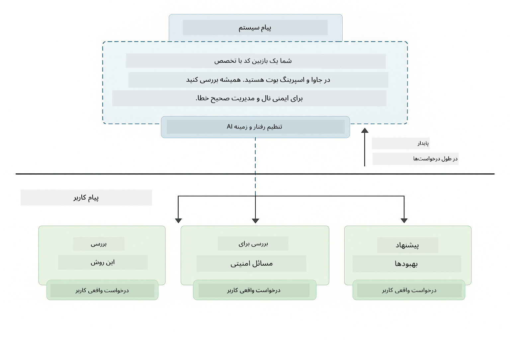

*SystemMessage زمینه ماندگار فراهم می‌کند در حالی که UserMessages درخواست‌های فردی را در بر دارند*

**MessageWindowChatMemory برای چند مرحله‌ای** - برای الگوی مکالمه چند مرحله‌ای، از `MessageWindowChatMemory` ماژول ۰۱ مجدداً استفاده می‌کنیم. هر جلسه حافظه مخصوص به خود را دارد که در `Map<String, ChatMemory>` ذخیره می‌شود و امکان چندین مکالمه همزمان بدون اختلاط زمینه را فراهم می‌کند.

**قالب‌های پرامپت** - تمرکز واقعی اینجا مهندسی پرامپت است، نه APIهای جدید LangChain4j. هر الگو (کم اشتیاق، پر اشتیاق، اجرای وظیفه و غیره) از همان متد `chatModel.chat(prompt)` استفاده می‌کند اما با رشته‌های پرامپت با ساختار دقیق. تگ‌های XML، دستورالعمل‌ها و قالب‌بندی همه بخشی از متن پرامپت هستند، نه ویژگی‌های LangChain4j.

**کنترل استدلال** - تلاش استدلال GPT-5 از طریق دستورالعمل‌های پرامپت مانند "حداکثر ۲ مرحله استدلال" یا "کامل بررسی کن" کنترل می‌شود. این‌ها تکنیک‌های مهندسی پرامپت هستند، نه پیکربندی‌های LangChain4j. کتابخانه فقط پرامپت‌های شما را به مدل می‌رساند.

نکته کلیدی: LangChain4j زیرساخت (اتصال مدل از طریق [LangChainConfig.java](../../../02-prompt-engineering/src/main/java/com/example/langchain4j/prompts/config/LangChainConfig.java)، حافظه، مدیریت پیام از طریق [Gpt5PromptService.java](../../../02-prompt-engineering/src/main/java/com/example/langchain4j/prompts/service/Gpt5PromptService.java)) را فراهم می‌کند، در حالی که این ماژول به شما آموزش می‌دهد چگونه پرامپت‌های مؤثر در آن زیرساخت بسازید.

## الگوهای اصلی

همه مسائل به یک رویکرد نیاز ندارند. برخی سوالات نیاز به پاسخ سریع دارند، برخی نیاز به تفکر عمیق. برخی نیاز به استدلال قابل مشاهده دارند، برخی فقط به نتایج نیاز دارند. این ماژول هشت الگوی پرامپت‌دهی را پوشش می‌دهد - هر کدام برای سناریوهای مختلف بهینه شده‌اند. شما با همه آن‌ها آزمایش خواهید کرد تا بفهمید هر رویکرد چه زمانی بهترین عملکرد را دارد.


*مروری بر هشت الگوی مهندسی پرامپت و موارد استفاده آن‌ها*


*رویکردهای استدلال کم اشتیاق (سریع، مستقیم) در مقابل پر اشتیاق (کامل، اکتشافی)*

**کم اشتیاق (سریع و متمرکز)** - برای سوالات ساده که می‌خواهید پاسخ سریع و مستقیم بگیرید. مدل حداقل استدلال را انجام می‌دهد - حداکثر ۲ مرحله. از این برای محاسبات، جستجوها یا سوالات ساده استفاده کنید.

```java
String prompt = """
    <reasoning_effort>low</reasoning_effort>
    <instruction>maximum 2 reasoning steps</instruction>
    
    What is 15% of 200?
    """;

String response = chatModel.chat(prompt);
```
  
> 💡 **با GitHub Copilot کاوش کنید:** فایل [`Gpt5PromptService.java`](../../../02-prompt-engineering/src/main/java/com/example/langchain4j/prompts/service/Gpt5PromptService.java) را باز کنید و بپرسید:  
> - "تفاوت الگوهای پرامپت کم اشتیاق و پر اشتیاق چیست؟"  
> - "چگونه تگ‌های XML در پرامپت‌ها به ساختاردهی پاسخ AI کمک می‌کنند؟"  
> - "چه زمانی باید از الگوهای خودبازتابی در مقابل دستور مستقیم استفاده کنم؟"

**پر اشتیاق (عمیق و کامل)** - برای مسائل پیچیده که می‌خواهید تحلیل جامع داشته باشید. مدل به طور کامل بررسی می‌کند و استدلال دقیق نشان می‌دهد. از این برای طراحی سیستم، تصمیمات معماری یا تحقیقات پیچیده استفاده کنید.

```java
String prompt = """
    <reasoning_effort>high</reasoning_effort>
    <instruction>explore thoroughly, show detailed reasoning</instruction>
    
    Design a caching strategy for a high-traffic REST API.
    """;

String response = chatModel.chat(prompt);
```
  
**اجرای وظیفه (پیشرفت گام به گام)** - برای جریان‌های کاری چند مرحله‌ای. مدل یک برنامه اولیه ارائه می‌دهد، هر مرحله را هنگام کار شرح می‌دهد، سپس خلاصه‌ای می‌دهد. از این برای مهاجرت‌ها، پیاده‌سازی‌ها یا هر فرآیند چند مرحله‌ای استفاده کنید.

```java
String prompt = """
    <task>Create a REST endpoint for user registration</task>
    <preamble>Provide an upfront plan</preamble>
    <narration>Narrate each step as you work</narration>
    <summary>Summarize what was accomplished</summary>
    """;

String response = chatModel.chat(prompt);
```
  
پرامپت زنجیره‌ای-تفکر به طور صریح از مدل می‌خواهد فرآیند استدلال خود را نشان دهد که دقت را برای وظایف پیچیده بهبود می‌بخشد. تجزیه گام به گام به انسان‌ها و AI کمک می‌کند منطق را درک کنند.

> **🤖 با [GitHub Copilot](https://github.com/features/copilot) Chat امتحان کنید:** درباره این الگو بپرسید:  
> - "چگونه الگوی اجرای وظیفه را برای عملیات طولانی مدت تطبیق دهم؟"  
> - "بهترین روش‌ها برای ساختاردهی مقدمات ابزار در برنامه‌های تولیدی چیست؟"  
> - "چگونه می‌توانم به‌روزرسانی‌های پیشرفت میانی را در رابط کاربری ضبط و نمایش دهم؟"


*برنامه‌ریزی → اجرا → خلاصه‌سازی جریان کاری برای وظایف چند مرحله‌ای*

**کد خودبازتابی** - برای تولید کد با کیفیت تولید. مدل کد تولید می‌کند، آن را بر اساس معیارهای کیفیت بررسی می‌کند و به صورت تکراری بهبود می‌بخشد. از این هنگام ساخت ویژگی‌ها یا سرویس‌های جدید استفاده کنید.

```java
String prompt = """
    <task>Create an email validation service</task>
    <quality_criteria>
    - Correct logic and error handling
    - Best practices (clean code, proper naming)
    - Performance optimization
    - Security considerations
    </quality_criteria>
    <instruction>Generate code, evaluate against criteria, improve iteratively</instruction>
    """;

String response = chatModel.chat(prompt);
```
  
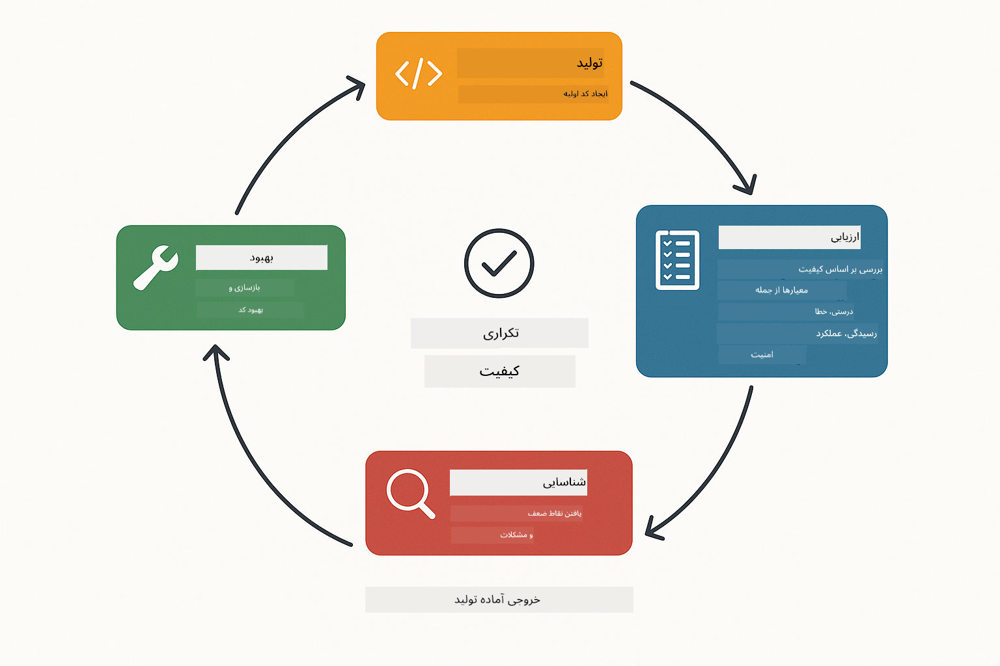

*چرخه بهبود تکراری - تولید، ارزیابی، شناسایی مشکلات، بهبود، تکرار*

**تحلیل ساختاریافته** - برای ارزیابی مداوم. مدل کد را با استفاده از چارچوب ثابتی (درستی، شیوه‌ها، عملکرد، امنیت) بررسی می‌کند. از این برای بازبینی کد یا ارزیابی کیفیت استفاده کنید.

```java
String prompt = """
    <code>
    public List getUsers() {
        return database.query("SELECT * FROM users");
    }
    </code>
    
    <framework>
    Evaluate using these categories:
    1. Correctness - Logic and functionality
    2. Best Practices - Code quality
    3. Performance - Efficiency concerns
    4. Security - Vulnerabilities
    </framework>
    """;

String response = chatModel.chat(prompt);
```
  
> **🤖 با [GitHub Copilot](https://github.com/features/copilot) Chat امتحان کنید:** درباره تحلیل ساختاریافته بپرسید:  
> - "چگونه می‌توانم چارچوب تحلیل را برای انواع مختلف بازبینی کد سفارشی کنم؟"  
> - "بهترین روش برای تجزیه و استفاده برنامه‌نویسی از خروجی ساختاریافته چیست؟"  
> - "چگونه می‌توانم سطوح شدت را در جلسات بازبینی مختلف به طور مداوم حفظ کنم؟"

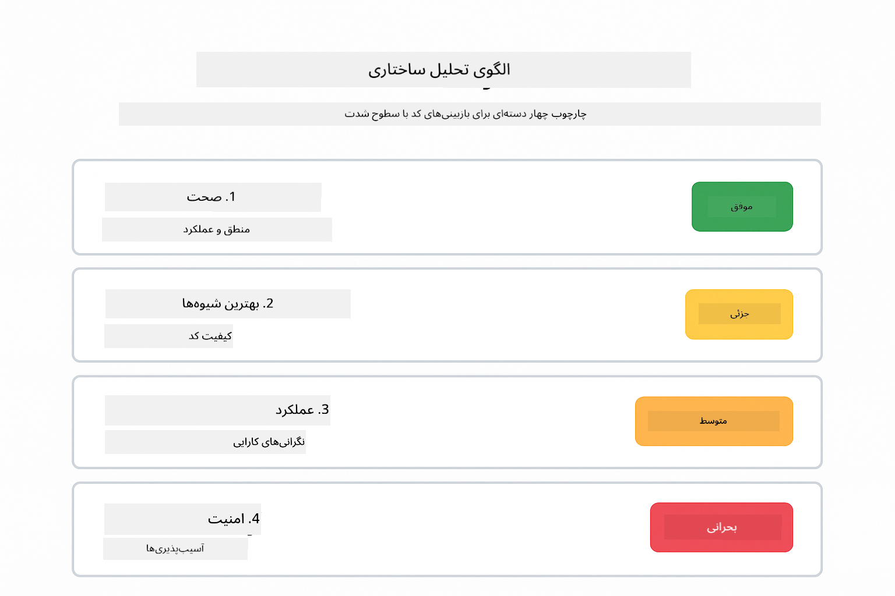

*چارچوب چهار دسته‌ای برای بازبینی‌های مداوم کد با سطوح شدت*

**چت چند مرحله‌ای** - برای مکالماتی که نیاز به زمینه دارند. مدل پیام‌های قبلی را به خاطر می‌سپارد و بر اساس آن‌ها پیش می‌رود. از این برای جلسات کمک تعاملی یا پرسش و پاسخ پیچیده استفاده کنید.

```java
ChatMemory memory = MessageWindowChatMemory.withMaxMessages(10);

memory.add(UserMessage.from("What is Spring Boot?"));
AiMessage aiMessage1 = chatModel.chat(memory.messages()).aiMessage();
memory.add(aiMessage1);

memory.add(UserMessage.from("Show me an example"));
AiMessage aiMessage2 = chatModel.chat(memory.messages()).aiMessage();
memory.add(aiMessage2);
```
  
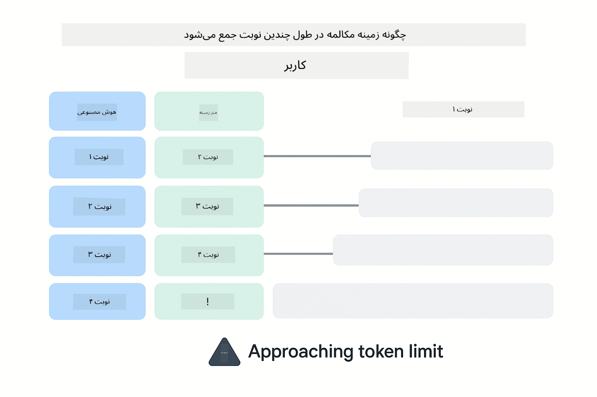

*چگونه زمینه مکالمه در چند مرحله جمع می‌شود تا به حد توکن برسد*

**استدلال گام به گام** - برای مسائلی که نیاز به منطق قابل مشاهده دارند. مدل استدلال صریح برای هر مرحله را نشان می‌دهد. از این برای مسائل ریاضی، معماهای منطقی یا زمانی که می‌خواهید فرآیند تفکر را بفهمید استفاده کنید.

```java
String prompt = """
    <instruction>Show your reasoning step-by-step</instruction>
    
    If a train travels 120 km in 2 hours, then stops for 30 minutes,
    then travels another 90 km in 1.5 hours, what is the average speed
    for the entire journey including the stop?
    """;

String response = chatModel.chat(prompt);
```
  


*شکستن مسائل به مراحل منطقی صریح*

**خروجی محدود شده** - برای پاسخ‌هایی با الزامات قالب خاص. مدل به طور دقیق قوانین قالب و طول را دنبال می‌کند. از این برای خلاصه‌ها یا زمانی که به ساختار خروجی دقیق نیاز دارید استفاده کنید.

```java
String prompt = """
    <constraints>
    - Exactly 100 words
    - Bullet point format
    - Technical terms only
    </constraints>
    
    Summarize the key concepts of machine learning.
    """;

String response = chatModel.chat(prompt);
```
  
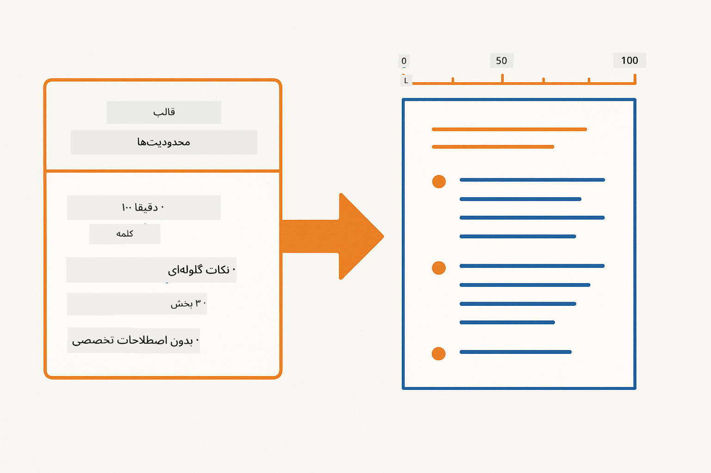

*اجرای الزامات قالب، طول و ساختار خاص*

## استفاده از منابع موجود Azure

**تأیید استقرار:**

اطمینان حاصل کنید که فایل `.env` در دایرکتوری ریشه با اعتبارنامه‌های Azure وجود دارد (ایجاد شده در ماژول ۰۱):  
```bash
cat ../.env  # باید AZURE_OPENAI_ENDPOINT، API_KEY، DEPLOYMENT را نشان دهد
```
  
**شروع برنامه:**

> **توجه:** اگر قبلاً همه برنامه‌ها را با استفاده از `./start-all.sh` از ماژول ۰۱ راه‌اندازی کرده‌اید، این ماژول در حال حاضر روی پورت ۸۰۸۳ اجرا می‌شود. می‌توانید دستورات شروع زیر را رد کنید و مستقیماً به http://localhost:8083 بروید.

**گزینه ۱: استفاده از Spring Boot Dashboard (توصیه شده برای کاربران VS Code)**

کانتینر توسعه شامل افزونه Spring Boot Dashboard است که رابط بصری برای مدیریت همه برنامه‌های Spring Boot فراهم می‌کند. می‌توانید آن را در نوار فعالیت سمت چپ VS Code (آیکون Spring Boot) پیدا کنید.

از Spring Boot Dashboard می‌توانید:  
- همه برنامه‌های Spring Boot موجود در فضای کاری را ببینید  
- برنامه‌ها را با یک کلیک شروع/توقف کنید  
- لاگ‌های برنامه را به صورت زنده مشاهده کنید  
- وضعیت برنامه را نظارت کنید

فقط روی دکمه پخش کنار "prompt-engineering" کلیک کنید تا این ماژول شروع شود، یا همه ماژول‌ها را همزمان اجرا کنید.

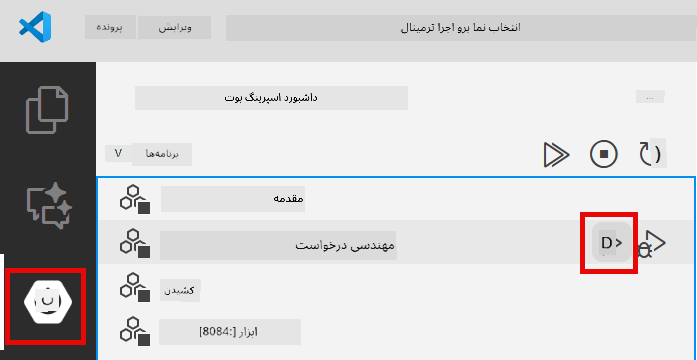

**گزینه ۲: استفاده از اسکریپت‌های شل**

همه برنامه‌های وب (ماژول‌های ۰۱-۰۴) را شروع کنید:

**Bash:**  
```bash
cd ..  # از دایرکتوری ریشه
./start-all.sh
```
  
**PowerShell:**  
```powershell
cd ..  # از دایرکتوری ریشه
.\start-all.ps1
```
  
یا فقط این ماژول را شروع کنید:

**Bash:**  
```bash
cd 02-prompt-engineering
./start.sh
```
  
**PowerShell:**  
```powershell
cd 02-prompt-engineering
.\start.ps1
```
  
هر دو اسکریپت به طور خودکار متغیرهای محیطی را از فایل `.env` ریشه بارگذاری می‌کنند و در صورت عدم وجود، JARها را می‌سازند.

> **توجه:** اگر ترجیح می‌دهید همه ماژول‌ها را به صورت دستی قبل از شروع بسازید:  
>  
> **Bash:**  
> ```bash
> cd ..  # Go to root directory
> mvn clean package -DskipTests
> ```
  
> **PowerShell:**  
> ```powershell
> cd ..  # Go to root directory
> mvn clean package -DskipTests
> ```
  
مرورگر خود را باز کرده و به http://localhost:8083 بروید.

**برای توقف:**

**Bash:**  
```bash
./stop.sh  # فقط این ماژول
# یا
cd .. && ./stop-all.sh  # همه ماژول‌ها
```
  
**PowerShell:**  
```powershell
.\stop.ps1  # فقط این ماژول
# یا
cd ..; .\stop-all.ps1  # همه ماژول‌ها
```
  
## تصاویر برنامه

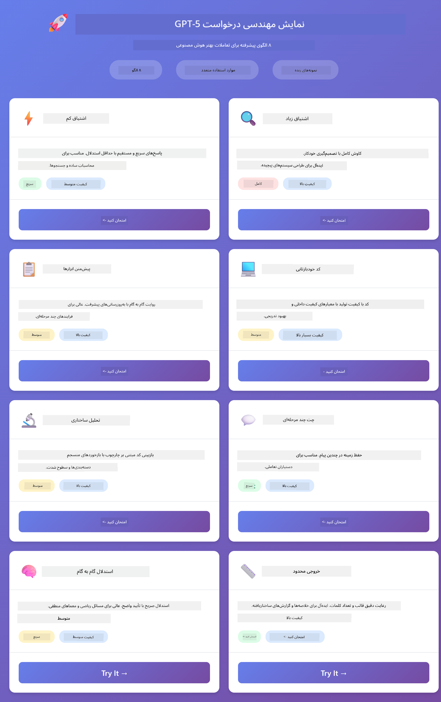

*داشبورد اصلی که همه ۸ الگوی مهندسی پرامپت را با ویژگی‌ها و موارد استفاده آن‌ها نشان می‌دهد*

## کاوش الگوها

رابط وب به شما اجازه می‌دهد با استراتژی‌های مختلف پرامپت‌دهی آزمایش کنید. هر الگو مسائل متفاوتی را حل می‌کند - آن‌ها را امتحان کنید تا ببینید هر رویکرد چه زمانی بهترین عملکرد را دارد.

### کم‌اشتیاق در مقابل پر اشتیاق

یک سوال ساده مانند "۱۵٪ از ۲۰۰ چقدر است؟" با کم‌اشتیاق بپرسید. پاسخ فوری و مستقیم دریافت خواهید کرد. حالا سوالی پیچیده مانند "یک استراتژی کشینگ برای یک API با ترافیک بالا طراحی کن" با پر اشتیاق بپرسید. ببینید چگونه مدل کند می‌شود و استدلال دقیق ارائه می‌دهد. همان مدل، همان ساختار سوال - اما پرامپت به آن می‌گوید چقدر باید فکر کند.

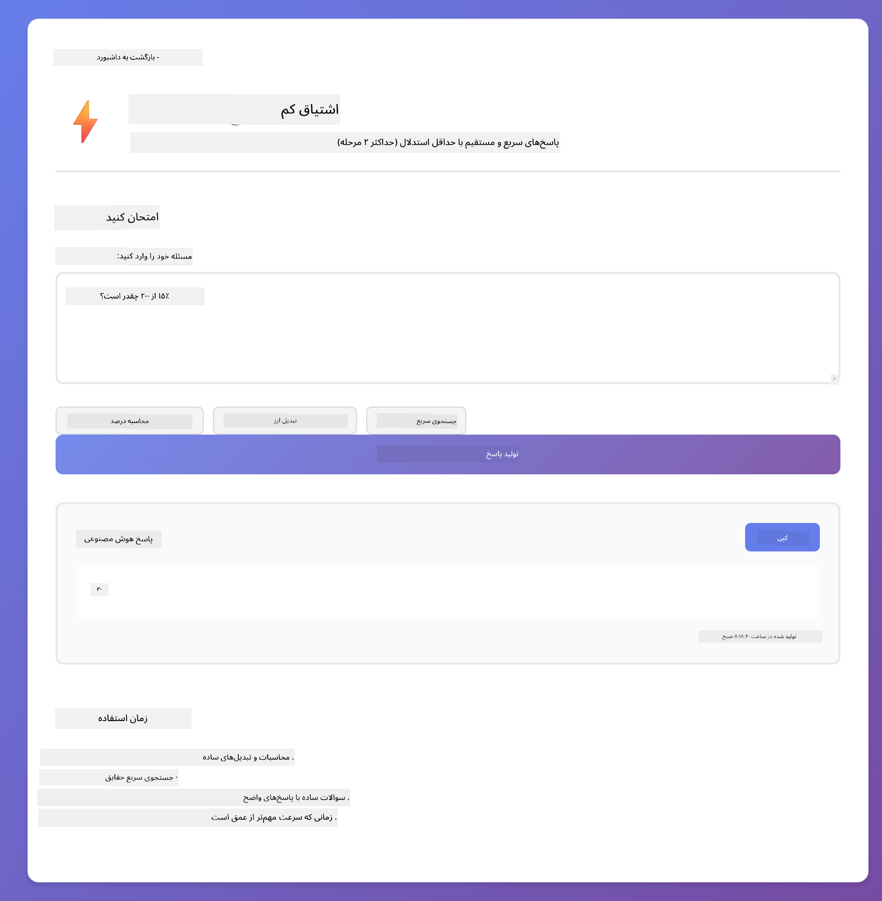
*محاسبه سریع با حداقل استدلال*

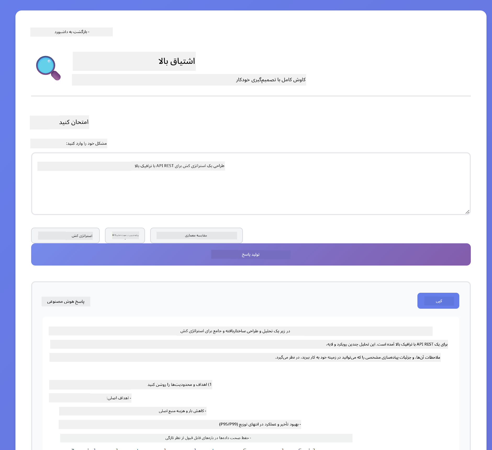

*استراتژی جامع کشینگ (۲.۸ مگابایت)*

### اجرای وظیفه (مقدمات ابزار)

جریان‌های کاری چندمرحله‌ای از برنامه‌ریزی اولیه و روایت پیشرفت بهره می‌برند. مدل توضیح می‌دهد که چه کاری انجام خواهد داد، هر مرحله را روایت می‌کند، سپس نتایج را خلاصه می‌کند.

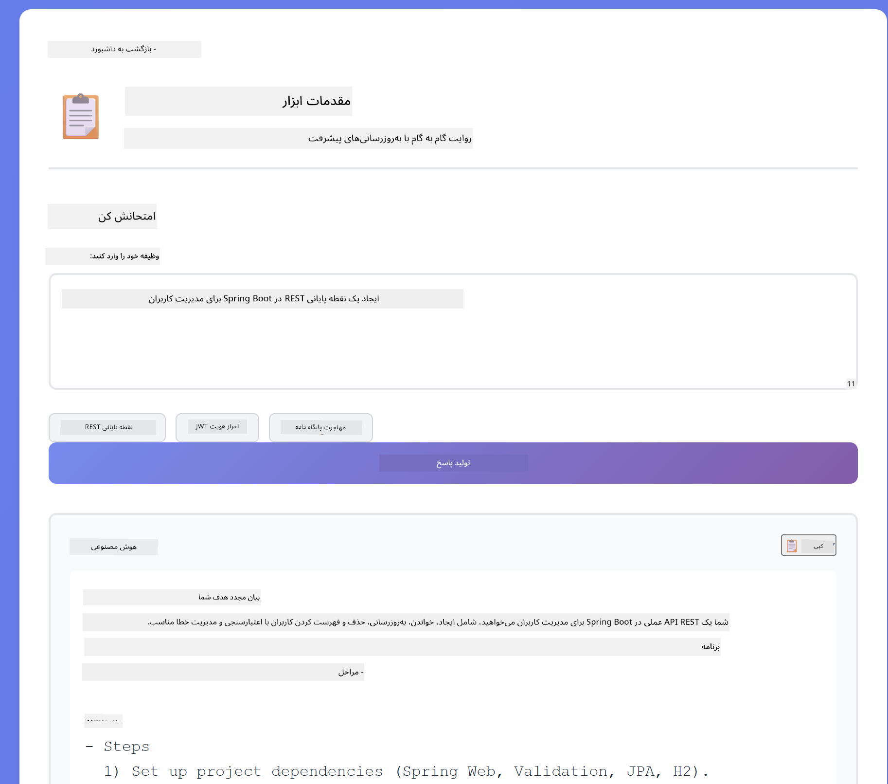

*ایجاد یک نقطه پایانی REST با روایت مرحله به مرحله (۳.۹ مگابایت)*

### کد خودبازتابی

عبارت «ایجاد سرویس اعتبارسنجی ایمیل» را امتحان کنید. به جای فقط تولید کد و توقف، مدل تولید می‌کند، بر اساس معیارهای کیفیت ارزیابی می‌کند، نقاط ضعف را شناسایی می‌کند و بهبود می‌بخشد. خواهید دید که تا زمانی که کد به استانداردهای تولید برسد، تکرار می‌کند.

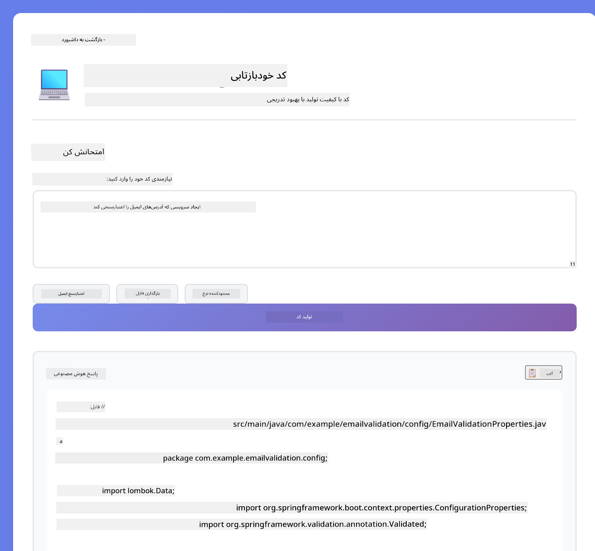

*سرویس کامل اعتبارسنجی ایمیل (۵.۲ مگابایت)*

### تحلیل ساختاری

بازبینی کد نیازمند چارچوب‌های ارزیابی ثابت است. مدل کد را با استفاده از دسته‌بندی‌های ثابت (درستی، شیوه‌ها، عملکرد، امنیت) با سطوح شدت تحلیل می‌کند.

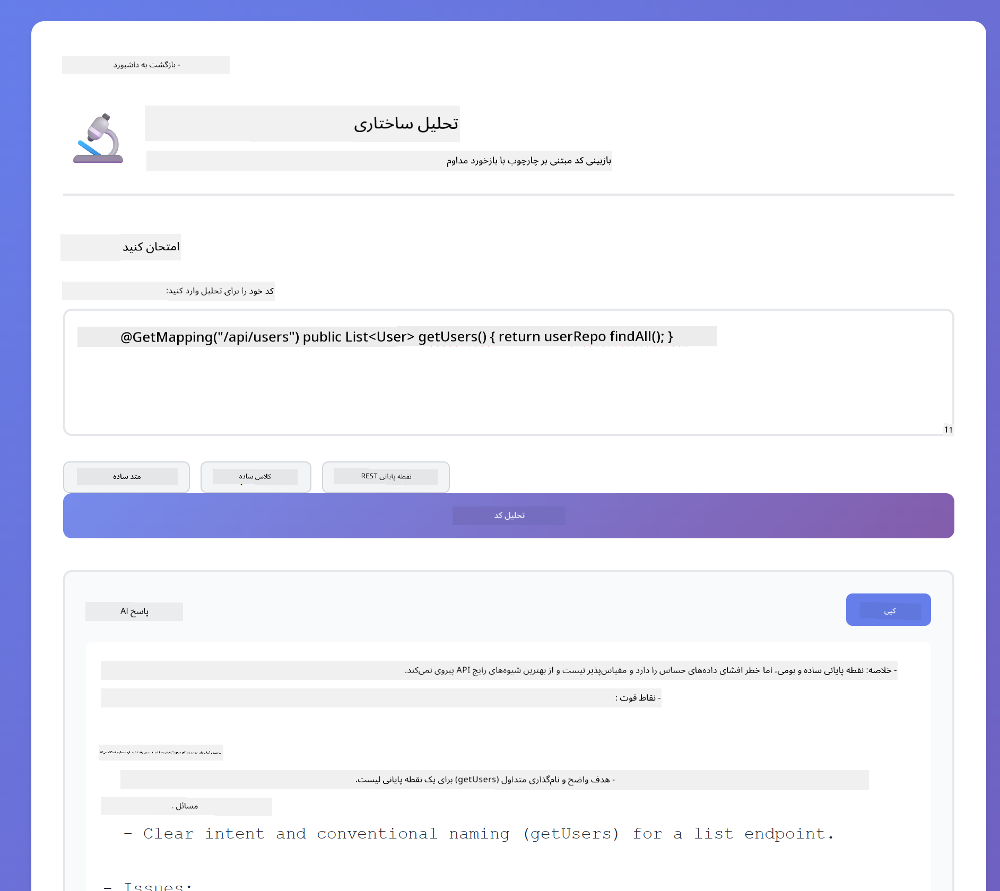

*بازبینی کد مبتنی بر چارچوب*

### چت چندمرحله‌ای

بپرسید «Spring Boot چیست؟» سپس بلافاصله دنبال کنید با «یک مثال نشان بده». مدل سوال اول شما را به خاطر می‌سپارد و به طور خاص یک مثال Spring Boot به شما می‌دهد. بدون حافظه، آن سوال دوم خیلی مبهم بود.

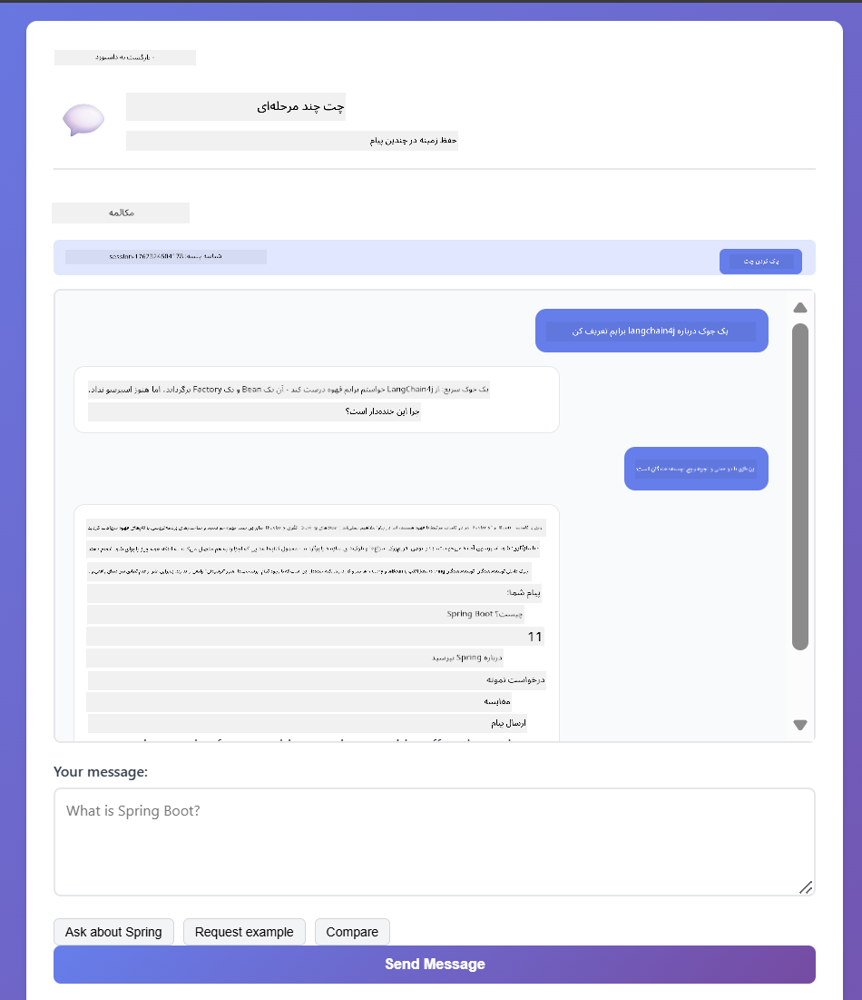

*حفظ زمینه در سوالات مختلف*

### استدلال مرحله به مرحله

یک مسئله ریاضی انتخاب کنید و آن را با هر دو حالت استدلال مرحله به مرحله و اشتیاق کم امتحان کنید. اشتیاق کم فقط پاسخ را به شما می‌دهد - سریع اما مبهم. استدلال مرحله به مرحله هر محاسبه و تصمیم را به شما نشان می‌دهد.

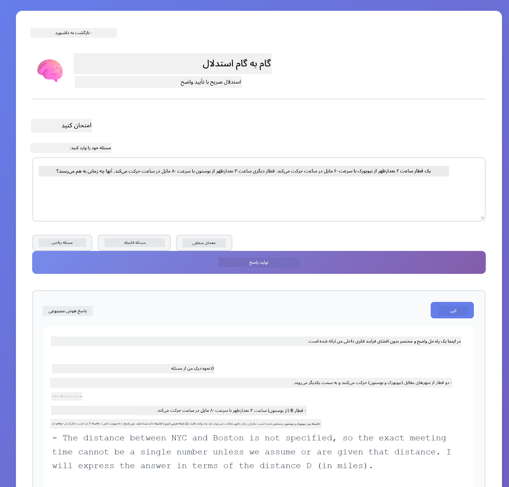

*مسئله ریاضی با مراحل صریح*

### خروجی محدود شده

وقتی به فرمت‌های خاص یا تعداد کلمات مشخص نیاز دارید، این الگو رعایت دقیق را تضمین می‌کند. امتحان کنید خلاصه‌ای با دقیقاً ۱۰۰ کلمه به صورت نکته‌وار تولید کنید.


*خلاصه یادگیری ماشین با کنترل فرمت*

## آنچه واقعاً یاد می‌گیرید

**تلاش استدلال همه چیز را تغییر می‌دهد**

GPT-5 به شما اجازه می‌دهد تلاش محاسباتی را از طریق درخواست‌هایتان کنترل کنید. تلاش کم یعنی پاسخ‌های سریع با کاوش حداقلی. تلاش زیاد یعنی مدل زمان می‌گذارد تا عمیق فکر کند. شما یاد می‌گیرید تلاش را با پیچیدگی کار تطبیق دهید - وقت خود را روی سوالات ساده هدر ندهید، اما تصمیمات پیچیده را هم عجله نکنید.

**ساختار رفتار را هدایت می‌کند**

توجه کرده‌اید تگ‌های XML در درخواست‌ها؟ آن‌ها تزئینی نیستند. مدل‌ها دستورالعمل‌های ساختاریافته را قابل اطمینان‌تر از متن آزاد دنبال می‌کنند. وقتی به فرآیندهای چندمرحله‌ای یا منطق پیچیده نیاز دارید، ساختار به مدل کمک می‌کند بداند کجاست و بعد چه باید بکند.


*آناتومی یک درخواست خوب ساختار یافته با بخش‌های واضح و سازماندهی به سبک XML*

**کیفیت از طریق خودارزیابی**

الگوهای خودبازتابی با صریح کردن معیارهای کیفیت کار می‌کنند. به جای اینکه امیدوار باشید مدل «درست انجام دهد»، دقیقاً به آن می‌گویید «درست» یعنی چه: منطق صحیح، مدیریت خطا، عملکرد، امنیت. سپس مدل می‌تواند خروجی خود را ارزیابی و بهبود دهد. این تولید کد را از یک قرعه‌کشی به یک فرآیند تبدیل می‌کند.

**زمینه محدود است**

گفتگوهای چندمرحله‌ای با شامل کردن تاریخچه پیام‌ها در هر درخواست کار می‌کنند. اما محدودیتی وجود دارد - هر مدل حداکثر تعداد توکن دارد. با رشد گفتگوها، به استراتژی‌هایی نیاز دارید تا زمینه مرتبط را حفظ کنید بدون اینکه به سقف برسید. این ماژول به شما نشان می‌دهد حافظه چگونه کار می‌کند؛ بعداً یاد می‌گیرید کی خلاصه کنید، کی فراموش کنید و کی بازیابی کنید.

## مراحل بعدی

**ماژول بعدی:** [03-rag - RAG (تولید تقویت‌شده با بازیابی)](../03-rag/README.md)

---

**ناوبری:** [← قبلی: ماژول ۰۱ - مقدمه](../01-introduction/README.md) | [بازگشت به اصلی](../README.md) | [بعدی: ماژول ۰۳ - RAG →](../03-rag/README.md)

---

<!-- CO-OP TRANSLATOR DISCLAIMER START -->
**سلب مسئولیت**:  
این سند با استفاده از سرویس ترجمه هوش مصنوعی [Co-op Translator](https://github.com/Azure/co-op-translator) ترجمه شده است. در حالی که ما در تلاش برای دقت هستیم، لطفاً توجه داشته باشید که ترجمه‌های خودکار ممکن است حاوی خطاها یا نواقصی باشند. سند اصلی به زبان بومی خود باید به عنوان منبع معتبر در نظر گرفته شود. برای اطلاعات حیاتی، ترجمه حرفه‌ای انسانی توصیه می‌شود. ما مسئول هیچ گونه سوءتفاهم یا تفسیر نادرستی که از استفاده این ترجمه ناشی شود، نیستیم.
<!-- CO-OP TRANSLATOR DISCLAIMER END -->