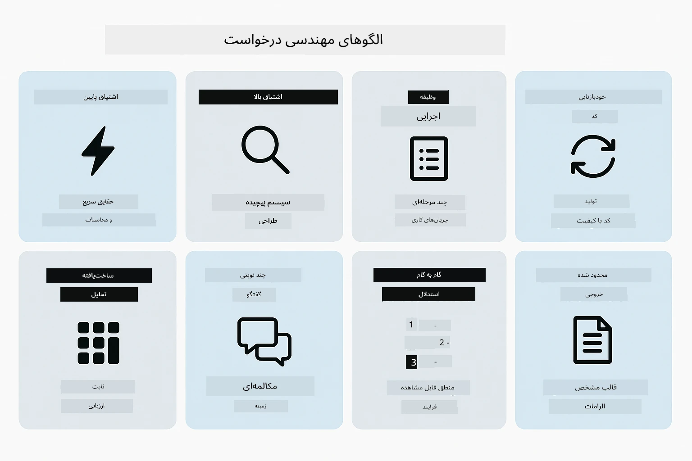
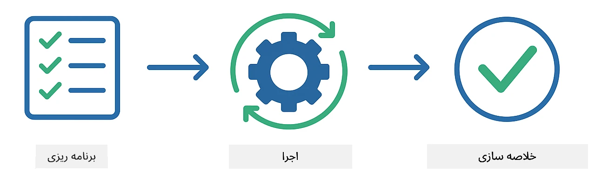
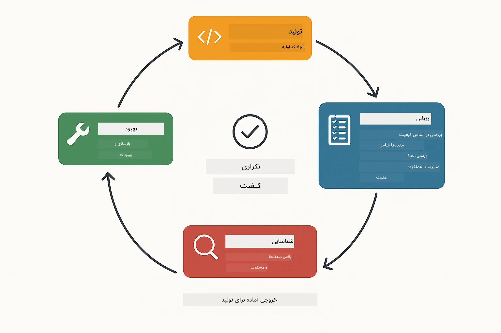
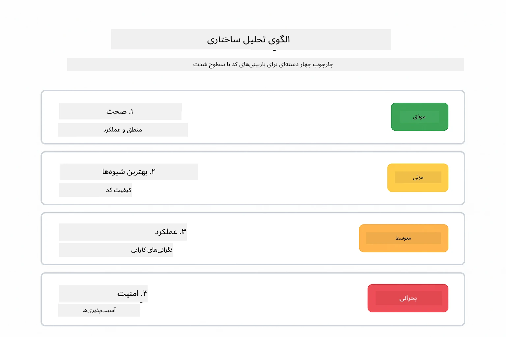
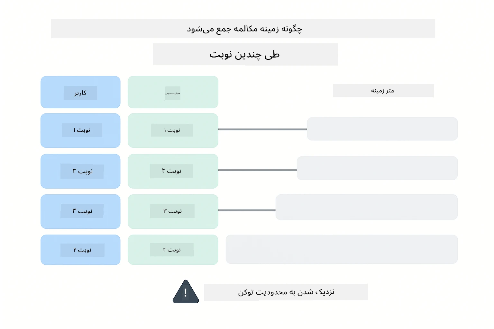
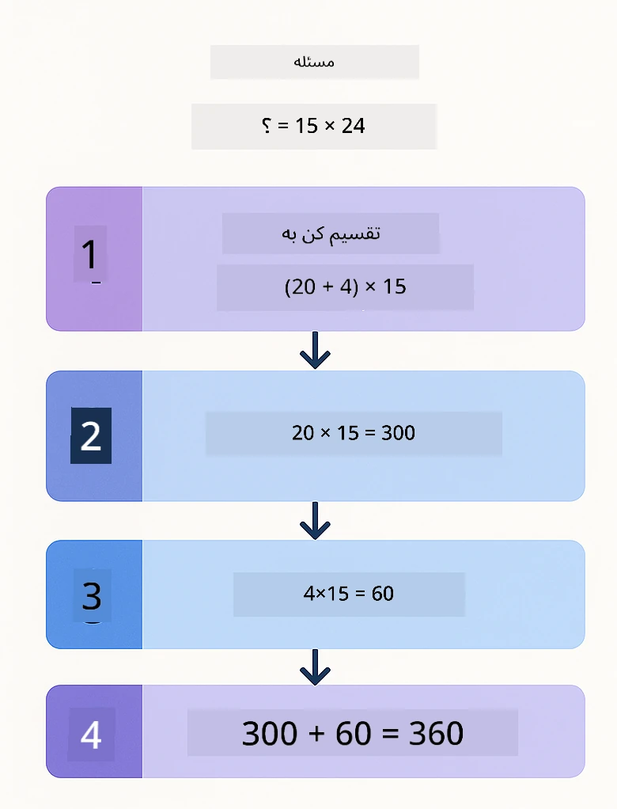
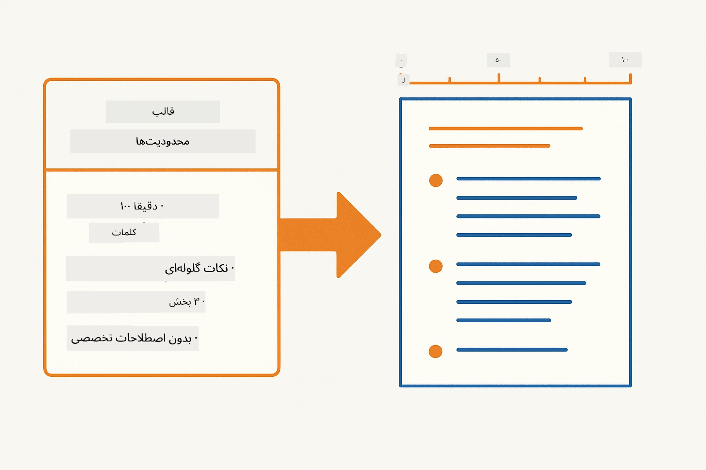
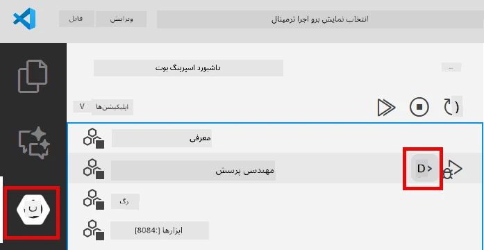
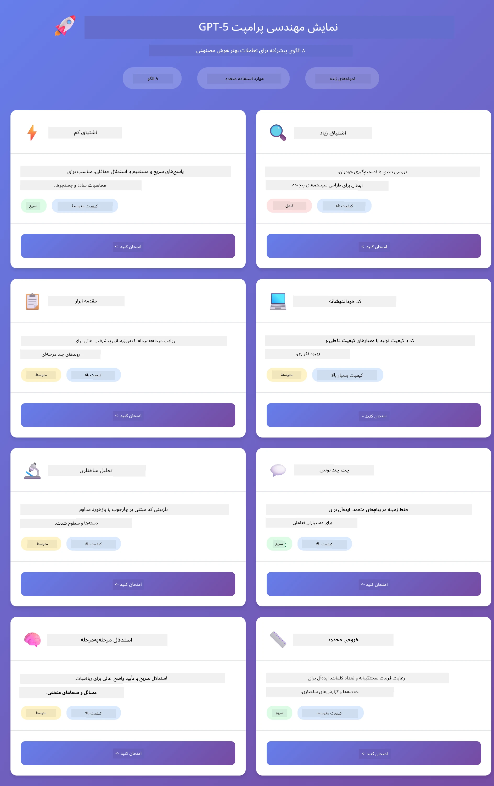
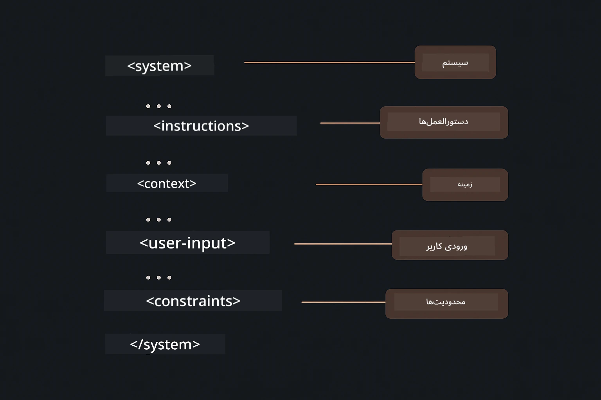

# ماژول ۰۲: مهندسی پرامپت با GPT-5.2

## فهرست مطالب

- [نمایش ویدئو](#نمایش-ویدئو)
- [چیزهایی که یاد می‌گیرید](#چیزهایی-که-یاد-می‌گیرید)
- [پیش‌نیازها](#پیش‌نیازها)
- [درک مهندسی پرامپت](#درک-مهندسی-پرامپت)
- [اصول مهندسی پرامپت](#اصول-مهندسی-پرامپت)
  - [پرامپت صفر-شات](#پرامپت-صفر-شات)
  - [پرامپت چند-شات](#پرامپت-چند-شات)
  - [زنجیره تفکر](#زنجیره-تفکر)
  - [پرامپت بر اساس نقش](#پرامپت-بر-اساس-نقش)
  - [قالب‌های پرامپت](#قالب‌های-پرامپت)
- [الگوهای پیشرفته](#الگوهای-پیشرفته)
- [اجرای برنامه](#اجرای-برنامه)
- [تصاویر برنامه](#تصاویر-برنامه)
- [کاوش در الگوها](#بررسی-الگوها)
  - [انگیزه کم در مقابل انگیزه زیاد](#اشتیاق-کم-در-مقابل-اشتیاق-زیاد)
  - [اجرای وظیفه (مقدمه‌های ابزار)](#اجرای-کار-پیش‌نویس-ابزارها)
  - [کد خودبازتابی](#کد-خودبازتابی)
  - [تحلیل ساختاریافته](#تحلیل-ساختاریافته)
  - [چت چند مرحله‌ای](#چت-چندمرحله‌ای)
  - [استدلال مرحله به مرحله](#استدلال-گام‌به‌گام)
  - [خروجی محدود شده](#خروجی-محدودشده)
- [آنچه واقعاً یاد می‌گیرید](#آنچه-واقعاً-یاد-می‌گیرید)
- [گام‌های بعدی](#مراحل-بعدی)

## نمایش ویدئو

این جلسه زنده را تماشا کنید که توضیح می‌دهد چگونه با این ماژول شروع کنید:

<a href="https://www.youtube.com/live/PJ6aBaE6bog?si=LDshyBrTRodP-wke"></a>

## چیزهایی که یاد می‌گیرید

نمودار زیر نمای کلی از موضوعات و مهارت‌های کلیدی را که در این ماژول توسعه خواهید داد ارائه می‌دهد — از تکنیک‌های اصلاح پرامپت گرفته تا جریان کاری مرحله به مرحله‌ای که دنبال خواهید کرد.


در ماژول قبلی، دیدید که چگونه حافظه به هوش مصنوعی مکالمه‌ای با Azure OpenAI امکان می‌دهد. حالا تمرکز ما روی نحوه پرسیدن سوالات است — خود پرامپت‌ها — با استفاده از GPT-5.2 در Azure OpenAI. نحوه ساختاردهی پرامپت‌ها تأثیر چشمگیری بر کیفیت پاسخ‌هایی که می‌گیرید دارد. ما با مرور تکنیک‌های بنیادی پرامپت شروع می‌کنیم، سپس به هشت الگوی پیشرفته می‌پردازیم که از تمام قابلیت‌های GPT-5.2 بهره می‌برند.

ما از GPT-5.2 استفاده می‌کنیم زیرا کنترل استدلال را معرفی می‌کند - می‌توانید به مدل بگویید چقدر باید قبل از پاسخ تفکر کند. این باعث می‌شود استراتژی‌های مختلف پرامپت واضح‌تر شود و به شما کمک می‌کند بفهمید چه موقع از هر روش استفاده کنید.

## پیش‌نیازها

- تکمیل ماژول ۰۱ (منابع Azure OpenAI مستقر شده)
- فایل `.env` در ریشه دایرکتوری با مدارک Azure (ایجاد شده توسط `azd up` در ماژول ۰۱)

> **توجه:** اگر ماژول ۰۱ را تکمیل نکرده‌اید، ابتدا دستورالعمل‌های استقرار آن را دنبال کنید.

## درک مهندسی پرامپت

در اصل، مهندسی پرامپت تفاوت بین دستورالعمل‌های مبهم و دستورالعمل‌های دقیق است، همانطور که مقایسه زیر نشان می‌دهد.


مهندسی پرامپت درباره طراحی متن ورودی است که به طور مداوم نتایجی را که نیاز دارید به شما می‌دهد. فقط پرسیدن سوال نیست - بلکه ساختاربندی درخواست‌هاست تا مدل دقیقاً بفهمد چه می‌خواهید و چگونه آن را ارائه دهد.

به آن مثل دادن دستورالعمل به یک همکار فکر کنید. "اشکال را رفع کن" مبهم است. "رفع خطای اشاره‌گر null در UserService.java خط ۴۵ با افزودن بررسی null" دقیق است. مدل‌های زبانی نیز به همین صورت کار می‌کنند - دقت و ساختار اهمیت دارد.

نمودار زیر نشان می‌دهد چگونه LangChain4j در این تصویر قرار می‌گیرد — الگوهای پرامپت شما را از طریق بلوک‌های ساختاری SystemMessage و UserMessage به مدل متصل می‌کند.


LangChain4j زیرساخت‌ها را فراهم می‌کند — ارتباطات مدل، حافظه، و انواع پیام — در حالی که الگوهای پرامپت فقط متون ساختاربندی شده‌ای هستند که از طریق این زیرساخت ارسال می‌کنید. بلوک‌های کلیدی `SystemMessage` (که رفتار و نقش AI را تعیین می‌کند) و `UserMessage` (که درخواست واقعی شما را حمل می‌کند) هستند.

## اصول مهندسی پرامپت

پنج تکنیک اصلی زیر اساس مهندسی پرامپت موثر را تشکیل می‌دهند. هر کدام جنبه متفاوتی از نحوه ارتباط شما با مدل‌های زبانی را پوشش می‌دهند.


قبل از پرداختن به الگوهای پیشرفته در این ماژول، بیایید پنج تکنیک بنیادی پرامپت را مرور کنیم. اینها بلوک‌های ساختمانی هستند که هر مهندس پرامپت باید بداند.

### پرامپت صفر-شات

ساده‌ترین رویکرد: به مدل یک دستور مستقیم بدون هیچ مثالی بدهید. مدل کاملاً بر اساس آموزش خود متکی است تا کار را بفهمد و اجرا کند. این برای درخواست‌های ساده که رفتار مورد انتظار واضح است به خوبی کار می‌کند.


*دستور مستقیم بدون مثال — مدل فقط از روی دستور کار را استنباط می‌کند*

```java
String prompt = "Classify this sentiment: 'I absolutely loved the movie!'";
String response = model.chat(prompt);
// پاسخ: "مثبت"
```
  
**زمان استفاده:** دسته‌بندی‌های ساده، سوالات مستقیم، ترجمه‌ها، یا هر کار که مدل می‌تواند بدون راهنمایی اضافی انجام دهد.

### پرامپت چند-شات

مثال‌هایی ارائه دهید که الگوی مورد نظر را به مدل نشان می‌دهد. مدل فرمت ورودی-خروجی مورد انتظار را از نمونه‌ها یاد می‌گیرد و آن را به ورودی‌های جدید اعمال می‌کند. این به طور قابل توجهی انسجام را برای کارهایی که فرمت یا رفتار دلخواه واضح نیست، افزایش می‌دهد.


*یادگیری از مثال‌ها — مدل الگو را شناسایی کرده و برای ورودی‌های جدید اعمال می‌کند*

```java
String prompt = """
    Classify the sentiment as positive, negative, or neutral.
    
    Examples:
    Text: "This product exceeded my expectations!" → Positive
    Text: "It's okay, nothing special." → Neutral
    Text: "Waste of money, very disappointed." → Negative
    
    Now classify this:
    Text: "Best purchase I've made all year!"
    """;
String response = model.chat(prompt);
```
  
**زمان استفاده:** دسته‌بندی‌های سفارشی، قالب‌بندی سازگار، کارهای حوزه خاص، یا زمانی که نتایج صفر-شات ناپایدار است.

### زنجیره تفکر

از مدل بخواهید استدلال خود را قدم به قدم نشان دهد. به جای رفتن مستقیم به پاسخ، مدل مسئله را تقسیم کرده و هر قسمت را به صورت صریح پیش می‌برد. این دقت را در مسائل ریاضی، منطق و استدلال چند مرحله‌ای بهبود می‌بخشد.


*استدلال مرحله به مرحله — تقسیم مسائل پیچیده به گام‌های منطقی صریح*

```java
String prompt = """
    Problem: A store has 15 apples. They sell 8 apples and then 
    receive a shipment of 12 more apples. How many apples do they have now?
    
    Let's solve this step-by-step:
    """;
String response = model.chat(prompt);
// مدل نشان می‌دهد: ۱۵ - ۸ = ۷، سپس ۷ + ۱۲ = ۱۹ سیب
```
  
**زمان استفاده:** مسائل ریاضی، معماهای منطقی، رفع اشکال، یا هر کاری که نشان دادن فرآیند استدلال دقت و اعتماد را بالا می‌برد.

### پرامپت بر اساس نقش

قبل از پرسیدن سوال، شخصیتی یا نقشی برای AI تعیین کنید. این زمینه‌ای فراهم می‌کند که لحن، عمق، و تمرکز پاسخ را شکل می‌دهد. یک "معمار نرم‌افزار" مشاوره متفاوتی نسبت به "توسعه‌دهنده مبتدی" یا "ممیزی امنیتی" می‌دهد.


*تعیین زمینه و شخصیت — همان سوال پاسخ متفاوتی بسته به نقش تعیین شده می‌گیرد*

```java
String prompt = """
    You are an experienced software architect reviewing code.
    Provide a brief code review for this function:
    
    def calculate_total(items):
        total = 0
        for item in items:
            total = total + item['price']
        return total
    """;
String response = model.chat(prompt);
```
  
**زمان استفاده:** بازبینی کد، تدریس، تحلیل حوزه خاص، یا هر زمانی که نیاز به پاسخ‌های متناسب با سطح تخصص یا دیدگاه خاص باشد.

### قالب‌های پرامپت

پرامپت‌های قابل استفاده مجدد با جایگزین‌های متغیر بسازید. به جای نوشتن پرامپت جدید هر بار، یک قالب تعریف کنید و مقادیر مختلف را پر کنید. کلاس `PromptTemplate` در LangChain4j این کار را با نحو `{{variable}}` آسان می‌کند.


*پرامپت‌های قابل استفاده مجدد با جایگزین‌های متغیر — یک قالب، استفاده‌های متعدد*

```java
PromptTemplate template = PromptTemplate.from(
    "What's the best time to visit {{destination}} for {{activity}}?"
);

Prompt prompt = template.apply(Map.of(
    "destination", "Paris",
    "activity", "sightseeing"
));

String response = model.chat(prompt.text());
```
  
**زمان استفاده:** پرسش‌های تکراری با ورودی‌های مختلف، پردازش دسته‌ای، ساخت جریان‌های کاری AI قابل استفاده مجدد، یا هر موقعیتی که ساختار پرامپت یکسان می‌ماند ولی داده‌ها تغییر می‌کنند.

---

این پنج اصل یک جعبه ابزار محکم برای اکثر کارهای پرامپت به شما می‌دهد. بقیه این ماژول بر اساس آنها با **هشت الگوی پیشرفته** ساخته شده است که کنترل استدلال، خودارزیابی، و قابلیت‌های خروجی ساختاریافته GPT-5.2 را به کار می‌گیرند.

## الگوهای پیشرفته

پس از پوشش اصول، بیایید به هشت الگوی پیشرفته بپردازیم که این ماژول را منحصر به فرد می‌کند. همه مسائل به یک روش نیاز ندارند. برخی سوالات نیاز به پاسخ سریع دارند، برخی به تفکر عمیق. بعضی به استدلال قابل مشاهده نیاز دارند، برخی فقط نتایج. هر الگو به سناریویی متفاوت بهینه شده است — و کنترل استدلال GPT-5.2 این تفاوت‌ها را بیش از پیش نمایان می‌کند.



*نمای کلی هشت الگوی مهندسی پرامپت و موارد استفاده آنها*

GPT-5.2 بعد دیگری به این الگوها اضافه می‌کند: *کنترل استدلال*. لغزنده زیر نشان می‌دهد چگونه می‌توانید میزان تفکر مدل را تنظیم کنید — از پاسخ‌های سریع و مستقیم تا تحلیل عمیق و دقیق.


*کنترل استدلال GPT-5.2 اجازه می‌دهد مشخص کنید مدل چقدر باید فکر کند — از پاسخ‌های سریع تا کاوش عمیق*

**انگیزه کم (سریع و متمرکز)** - برای سوالات ساده که پاسخ‌های سریع و مستقیم می‌خواهید. مدل حداقل استدلال می‌کند - حداکثر ۲ مرحله. این را برای محاسبات، جستجوها، یا سوالات ساده به کار ببرید.

```java
String prompt = """
    <context_gathering>
    - Search depth: very low
    - Bias strongly towards providing a correct answer as quickly as possible
    - Usually, this means an absolute maximum of 2 reasoning steps
    - If you think you need more time, state what you know and what's uncertain
    </context_gathering>
    
    Problem: What is 15% of 200?
    
    Provide your answer:
    """;

String response = chatModel.chat(prompt);
```
  
> 💡 **کشف با GitHub Copilot:** فایل [`Gpt5PromptService.java`](../../../02-prompt-engineering/src/main/java/com/example/langchain4j/prompts/service/Gpt5PromptService.java) را باز کنید و بپرسید:  
> - "تفاوت الگوهای پرامپت انگیزه کم و انگیزه زیاد چیست؟"  
> - "چطور تگ‌های XML در پرامپت‌ها به ساختاردهی پاسخ AI کمک می‌کنند؟"  
> - "کی باید از الگوهای خودبازتابی استفاده کنم و کی از دستور مستقیم؟"

**انگیزه زیاد (عمیق و دقیق)** - برای مسائل پیچیده که تحلیل جامعی می‌خواهید. مدل به طور کامل کاوش می‌کند و استدلال دقیق نشان می‌دهد. این را برای طراحی سیستم، تصمیمات معماری، یا پژوهش پیچیده استفاده کنید.

```java
String prompt = """
    Analyze this problem thoroughly and provide a comprehensive solution.
    Consider multiple approaches, trade-offs, and important details.
    Show your analysis and reasoning in your response.
    
    Problem: Design a caching strategy for a high-traffic REST API.
    """;

String response = chatModel.chat(prompt);
```
  
**اجرای وظیفه (پیشرفت مرحله به مرحله)** - برای جریان‌های کاری چند مرحله‌ای. مدل برنامه‌ای مقدماتی می‌دهد، هر مرحله را در حین کار روایت می‌کند، سپس خلاصه ارائه می‌دهد. این را برای مهاجرت‌ها، پیاده‌سازی‌ها، یا هر فرایند چند مرحله‌ای استفاده کنید.

```java
String prompt = """
    <task_execution>
    1. First, briefly restate the user's goal in a friendly way
    
    2. Create a step-by-step plan:
       - List all steps needed
       - Identify potential challenges
       - Outline success criteria
    
    3. Execute each step:
       - Narrate what you're doing
       - Show progress clearly
       - Handle any issues that arise
    
    4. Summarize:
       - What was completed
       - Any important notes
       - Next steps if applicable
    </task_execution>
    
    <tool_preambles>
    - Always begin by rephrasing the user's goal clearly
    - Outline your plan before executing
    - Narrate each step as you go
    - Finish with a distinct summary
    </tool_preambles>
    
    Task: Create a REST endpoint for user registration
    
    Begin execution:
    """;

String response = chatModel.chat(prompt);
```
  
پرامپت زنجیره تفکر به صراحت از مدل می‌خواهد فرآیند استدلال خود را نشان دهد، که دقت را در کارهای پیچیده افزایش می‌دهد. تقسیم‌بندی مرحله به مرحله به انسان و AI کمک می‌کند منطق را بفهمند.

> **🤖 با چت [GitHub Copilot](https://github.com/features/copilot) امتحان کنید:** درباره این الگو سوال کنید:  
> - "چگونه الگوی اجرای وظیفه را برای عملیات طولانی‌مدت تطبیق دهم؟"  
> - "بهترین روش‌ها برای ساختاردهی مقدمه‌های ابزار در برنامه‌های تولیدی چیست؟"  
> - "چطور می‌توانم به‌روزرسانی‌های پیشرفت میانی را در یک رابط کاربری ضبط و نمایش دهم؟"

نمودار زیر این جریان کاری برنامه‌ریزی → اجرا → خلاصه‌سازی را نشان می‌دهد.



*جریان کاری برنامه‌ریزی → اجرا → خلاصه‌سازی برای کارهای چند مرحله‌ای*

**کد خودبازتابی** - برای تولید کد با کیفیت تولید. مدل کدی می‌سازد که استانداردهای تولید را دنبال می‌کند با مدیریت خطای مناسب. این را هنگام ساخت ویژگی‌ها یا سرویس‌های جدید استفاده کنید.

```java
String prompt = """
    Generate Java code with production-quality standards: Create an email validation service
    Keep it simple and include basic error handling.
    """;

String response = chatModel.chat(prompt);
```
  
نمودار زیر این حلقه بهبود تکراری را نشان می‌دهد — تولید، ارزیابی، شناسایی ضعف‌ها، و بازبینی تا کد به استانداردهای تولید برسد.



*حلقه بهبود تکراری - تولید، ارزیابی، شناسایی مشکلات، بهبود، تکرار*

**تحلیل ساختاریافته** - برای ارزیابی سازگار. مدل کد را با استفاده از چارچوبی ثابت (درستی، شیوه‌ها، عملکرد، امنیت، نگهداری) بررسی می‌کند. این را برای بازبینی کد یا ارزیابی کیفیت استفاده کنید.

```java
String prompt = """
    <analysis_framework>
    You are an expert code reviewer. Analyze the code for:
    
    1. Correctness
       - Does it work as intended?
       - Are there logical errors?
    
    2. Best Practices
       - Follows language conventions?
       - Appropriate design patterns?
    
    3. Performance
       - Any inefficiencies?
       - Scalability concerns?
    
    4. Security
       - Potential vulnerabilities?
       - Input validation?
    
    5. Maintainability
       - Code clarity?
       - Documentation?
    
    <output_format>
    Provide your analysis in this structure:
    - Summary: One-sentence overall assessment
    - Strengths: 2-3 positive points
    - Issues: List any problems found with severity (High/Medium/Low)
    - Recommendations: Specific improvements
    </output_format>
    </analysis_framework>
    
    Code to analyze:
    ```
    public List getUsers() {
        return database.query("SELECT * FROM users");
    }
    ```
    Provide your structured analysis:
    """;

String response = chatModel.chat(prompt);
```
  
> **🤖 با چت [GitHub Copilot](https://github.com/features/copilot) امتحان کنید:** درباره تحلیل ساختاریافته سوال کنید:  
> - "چگونه می‌توانم چارچوب تحلیل را برای انواع مختلف بازبینی کد سفارشی کنم؟"  
> - "بهترین روش برای پردازش و اعمال خروجی ساختاریافته به صورت برنامه‌نویسی چیست؟"  
> - "چگونه می‌توانم اطمینان حاصل کنم سطوح شدت در جلسات بازبینی مختلف سازگار است؟"

نمودار زیر نشان می‌دهد چگونه این چارچوب ساختاریافته، بازبینی کد را به دسته‌بندی‌های سازگار با سطوح شدت سازماندهی می‌کند.



*چارچوب بازبینی کد سازگار با سطوح شدت*

**چت چند مرحله‌ای** - برای گفتگوهایی که نیاز به محتوا دارند. مدل پیام‌های قبلی را به خاطر می‌سپارد و بر اساس آنها می‌سازد. این را برای جلسات کمک تعاملی یا پرسش و پاسخ پیچیده به کار ببرید.

```java
ChatMemory memory = MessageWindowChatMemory.withMaxMessages(10);

memory.add(UserMessage.from("What is Spring Boot?"));
AiMessage aiMessage1 = chatModel.chat(memory.messages()).aiMessage();
memory.add(aiMessage1);

memory.add(UserMessage.from("Show me an example"));
AiMessage aiMessage2 = chatModel.chat(memory.messages()).aiMessage();
memory.add(aiMessage2);
```
  
نمودار زیر نشان می‌دهد چگونه زمینه مکالمه با هر مرحله جمع می‌شود و چگونه به محدودیت توکن مدل مرتبط است.



*چگونه زمینه مکالمه در چندین مرحله تجمع می‌یابد تا به محدودیت توکن برسد*

**استدلال مرحله به مرحله** - برای مسائلی که نیاز به منطق قابل مشاهده دارند. مدل استدلال صریح برای هر مرحله را نشان می‌دهد. این را برای مسائل ریاضی، معماهای منطقی، یا زمانی که باید فرآیند تفکر را درک کنید استفاده کنید.

```java
String prompt = """
    <instruction>Show your reasoning step-by-step</instruction>
    
    If a train travels 120 km in 2 hours, then stops for 30 minutes,
    then travels another 90 km in 1.5 hours, what is the average speed
    for the entire journey including the stop?
    """;

String response = chatModel.chat(prompt);
```
  
نمودار زیر نشان می‌دهد چگونه مدل مسائل را به گام‌های منطقی شماره‌گذاری شده و صریح تقسیم می‌کند.


*شکستن مسائل به گام‌های منطقی صریح*

**خروجی محدودشده** - برای پاسخ‌هایی با الزامات قالب‌بندی خاص. مدل دقیقاً از قوانین قالب و طول پیروی می‌کند. این حالت را برای خلاصه‌ها یا وقتی نیاز به ساختار دقیق خروجی دارید، استفاده کنید.

```java
String prompt = """
    <constraints>
    - Exactly 100 words
    - Bullet point format
    - Technical terms only
    </constraints>
    
    Summarize the key concepts of machine learning.
    """;

String response = chatModel.chat(prompt);
```

نمودار زیر نشان می‌دهد چگونه محدودیت‌ها مدل را هدایت می‌کنند تا خروجی دقیقاً مطابق با الزامات قالب و طول شما تولید کند.



*اجرای الزامات قالب، طول و ساختار خاص*

## اجرای برنامه

**بررسی استقرار:**

اطمینان حاصل کنید فایل `.env` در ریشه پروژه وجود دارد و دارای مجوزهای Azure است (که در ماژول ۰۱ ایجاد شده است). این دستور را از دایرکتوری ماژول (`02-prompt-engineering/`) اجرا کنید:

**Bash:**
```bash
cat ../.env  # باید AZURE_OPENAI_ENDPOINT، API_KEY، DEPLOYMENT را نمایش دهد
```

**PowerShell:**
```powershell
Get-Content ..\.env  # باید AZURE_OPENAI_ENDPOINT، API_KEY، DEPLOYMENT را نشان دهد
```

**شروع برنامه:**

> **توجه:** اگر از قبل همه برنامه‌ها را با دستور `./start-all.sh` از ریشه (مطابق با ماژول ۰۱) اجرا کرده‌اید، این ماژول روی پورت 8083 در حال اجراست. می‌توانید اجرای دستورات شروع زیر را رد کنید و مستقیماً به http://localhost:8083 بروید.

**گزینه ۱: استفاده از Spring Boot Dashboard (مورد پیشنهاد کاربران VS Code)**

کانتینر توسعه شامل افزونه Spring Boot Dashboard است که یک رابط بصری برای مدیریت همه برنامه‌های Spring Boot فراهم می‌کند. این افزونه را در نوار فعالیت در سمت چپ VS Code می‌توانید بیابید (آیکون Spring Boot را جستجو کنید).

از Spring Boot Dashboard می‌توانید:
- تمام برنامه‌های Spring Boot موجود در فضای کاری را ببینید
- برنامه‌ها را فقط با یک کلیک شروع/توقف کنید
- لاگ‌های برنامه را به صورت زنده مشاهده کنید
- وضعیت برنامه را مانیتور کنید

فقط روی دکمه پخش کنار «prompt-engineering» کلیک کنید تا این ماژول شروع شود، یا همه ماژول‌ها را هم‌زمان اجرا کنید.



*داشبورد Spring Boot در VS Code — شروع، توقف و نظارت بر همه ماژول‌ها از یک محل*

**گزینه ۲: استفاده از اسکریپت‌های شل**

همه برنامه‌های وب (ماژول‌های ۰۱ تا ۰۴) را شروع کنید:

**Bash:**
```bash
cd ..  # از دایرکتوری ریشه
./start-all.sh
```

**PowerShell:**
```powershell
cd ..  # از فهرست اصلی
.\start-all.ps1
```

یا فقط این ماژول را اجرا کنید:

**Bash:**
```bash
cd 02-prompt-engineering
./start.sh
```

**PowerShell:**
```powershell
cd 02-prompt-engineering
.\start.ps1
```

هر دو اسکریپت به صورت خودکار متغیرهای محیطی را از فایل `.env` ریشه بارگذاری می‌کنند و در صورت عدم وجود، فایل‌های JAR را می‌سازند.

> **توجه:** اگر ترجیح می‌دهید قبل از شروع، همه ماژول‌ها را به صورت دستی بسازید:
>
> **Bash:**
> ```bash
> cd ..  # Go to root directory
> mvn clean package -DskipTests
> ```
>
> **PowerShell:**
> ```powershell
> cd ..  # Go to root directory
> mvn clean package -DskipTests
> ```

در مرورگر خود http://localhost:8083 را باز کنید.

**برای توقف:**

**Bash:**
```bash
./stop.sh  # فقط این ماژول
# یا
cd .. && ./stop-all.sh  # همه ماژول‌ها
```

**PowerShell:**
```powershell
.\stop.ps1  # فقط این ماژول
# یا
cd ..; .\stop-all.ps1  # همه ماژول‌ها
```

## تصاویر برنامه

در اینجا رابط اصلی ماژول مهندسی پرامپت نمایش داده شده است، جایی که می‌توانید با همه هشت الگو کنار هم آزمایش کنید.



*داشبورد اصلی نشان‌دهنده هر ۸ الگوی مهندسی پرامپت به همراه ویژگی‌ها و موارد استفاده‌شان*

## بررسی الگوها

رابط وب به شما اجازه می‌دهد با استراتژی‌های مختلف پرامپت آزمایش کنید. هر الگو مسائل متفاوتی را حل می‌کند - آنها را امتحان کنید و ببینید هر کدام چه زمانی بهترین عملکرد را دارند.

> **توجه: پخش زنده در مقابل غیر زنده** — هر صفحه الگو دو دکمه دارد: **🔴 پخش پاسخ (زنده)** و گزینه‌ای برای حالت **غیر زنده**. پخش زنده از رویدادهای ارسالی سرور (SSE) برای نمایش توکن‌ها به صورت زنده استفاده می‌کند، بنابراین شما پیشرفت را بلافاصله می‌بینید. حالت غیرزنده کل پاسخ را منتظر می‌ماند تا نمایش دهد. برای پرامپت‌هایی که به استدلال عمیق نیاز دارند (مثلاً High Eagerness، Self-Reflecting Code) تماس غیرزنده ممکن است بسیار طول بکشد — گاهی دقیقه‌ها — بدون اینکه بازخوردی ظاهر شود. **هنگام آزمایش پرامپت‌های پیچیده از پخش زنده استفاده کنید** تا مدل را در حال کار ببینید و از فرض اتمام زمان درخواست جلوگیری کنید.
>
> **توجه: نیاز مرورگر** — قابلیت پخش زنده از Fetch Streams API (`response.body.getReader()`) استفاده می‌کند که به مرورگر کامل (Chrome, Edge, Firefox, Safari) نیاز دارد. این قابلیت در Simple Browser تعبیه شده در VS Code کار نمی‌کند، زیرا وب‌ویو آن API ReadableStream را پشتیبانی نمی‌کند. اگر از Simple Browser استفاده می‌کنید، دکمه‌های غیرزنده به طور عادی کار می‌کنند — فقط دکمه‌های پخش زنده تحت‌تأثیر هستند. برای تجربه کامل، `http://localhost:8083` را در یک مرورگر خارجی باز کنید.

### اشتیاق کم در مقابل اشتیاق زیاد

سؤال ساده‌ای مثل «۱۵٪ از ۲۰۰ چقدر است؟» را با اشتیاق کم بپرسید. پاسخ سریع و مستقیم دریافت می‌کنید. اکنون یک سؤال پیچیده مثل «یک استراتژی کشینگ برای یک API پر ترافیک طراحی کن» را با اشتیاق زیاد بپرسید. روی **🔴 پخش پاسخ (زنده)** کلیک کنید و شاهد استدلال دقیق مدل به صورت توکن به توکن خواهید بود. مدل یکسان، ساختار سؤال یکسان — اما پرامپت مشخص می‌کند چقدر فکر کند.

### اجرای کار (پیش‌نویس ابزارها)

فرآیندهای چندمرحله‌ای از برنامه‌ریزی مقدماتی و روایت پیشرفت بهره می‌برند. مدل توضیح می‌دهد چه کاری خواهد کرد، هر گام را شرح می‌دهد و سپس نتایج را خلاصه می‌کند.

### کد خودبازتابی

«یک سرویس اعتبارسنجی ایمیل بساز» را امتحان کنید. مدل فقط به تولید کد اکتفا نمی‌کند بلکه آن را ارزیابی می‌کند، نقاط ضعف را شناسایی و بهبود می‌بخشد. می‌بینید که تا رسیدن کد به سطح کیفیت تولید تکرار می‌شود.

### تحلیل ساختاریافته

نقد کد نیاز به چارچوب‌های ارزیابی ثابت دارد. مدل کد را با دسته‌بندی‌های مشخص (درستی، شیوه‌ها، عملکرد، امنیت) و با درج سطوح شدت تحلیل می‌کند.

### چت چندمرحله‌ای

سؤال «Spring Boot چیست؟» را بپرسید و بلافاصله دنبال آن «مثالی نشان بده» را بپرسید. مدل سؤال اول را به خاطر می‌سپارد و مثال مربوط به Spring Boot را می‌دهد. بدون حافظه، سؤال دوم بسیار مبهم بود.

### استدلال گام‌به‌گام

یک مسئله ریاضی انتخاب کنید و آن را با استدلال گام‌به‌گام و اشتیاق کم امتحان کنید. اشتیاق کم فقط پاسخ را سریع می‌دهد — سریع اما مبهم؛ استدلال گام‌به‌گام هر محاسبه و تصمیم را نشان می‌دهد.

### خروجی محدودشده

وقتی به فرمت یا تعداد کلمات خاص نیاز دارید، این الگو رعایت دقیق آن را اجباری می‌کند. مثلاً تولید خلاصه‌ای دقیقاً با ۱۰۰ کلمه به صورت نقطه‌گذاری شده.

## آنچه واقعاً یاد می‌گیرید

**تلاش استدلال همه چیز را تغییر می‌دهد**

GPT-5.2 به شما اجازه می‌دهد از طریق پرامپت‌ها کنترل تلاش محاسباتی را به دست بگیرید. تلاش کم یعنی پاسخ‌های سریع با حداقل بررسی. تلاش زیاد یعنی مدل زمان صرف تفکر عمیق می‌کند. شما یاد می‌گیرید تلاش را با پیچیدگی کارها تطبیق دهید — برای پرسش‌های ساده وقت تلف نکنید اما در تصمیمات پیچیده عجله نکنید.

**ساختار رفتار را هدایت می‌کند**

متوجه تگ‌های XML در پرامپت‌ها شده‌اید؟ این‌ها تزئینی نیستند. مدل‌ها دستورالعمل‌های ساختاریافته را بهتر از متن آزاد دنبال می‌کنند. وقتی به فرآیندهای چندمرحله‌ای یا منطق پیچیده نیاز دارید، ساختار کمک می‌کند مدل بداند کجاست و بعد چه باید بکند. نمودار زیر یک پرامپت خوب ساختار یافته را نشان می‌دهد که چگونه تگ‌هایی مانند `<system>`, `<instructions>`, `<context>`, `<user-input>`, و `<constraints>` دستورالعمل‌ها را به بخش‌های واضح تقسیم می‌کند.



*آناتومی یک پرامپت ساختارمند با بخش‌های واضح و سازماندهی به سبک XML*

**کیفیت از طریق خودارزیابی**

الگوهای خودبازتابی با صراحت معیارهای کیفیت را بیان می‌کنند. به جای اینکه امیدوار باشید مدل «درست انجام دهد»، به آن دقیقاً می‌گویید «درست» یعنی چه: منطق صحیح، مدیریت خطا، عملکرد، امنیت. مدل سپس می‌تواند خروجی خود را ارزیابی و بهبود دهد. این باعث می‌شود تولید کد به جای قرعه‌کشی، به یک فرآیند تبدیل شود.

**متن محدود است**

گفتگوهای چندمرحله‌ای با قرار دادن تاریخچه پیام‌ها در هر درخواست کار می‌کنند. اما یک حدی دارد — هر مدل تعداد توکن‌های محدودی دارد. با رشد مکالمه، باید راهکارهایی برای حفظ زمینه مرتبط بدون عبور از حد پیدا کنید. این ماژول نحوه کار حافظه را نشان می‌دهد؛ بعداً خواهید آموخت کی خلاصه کنید، کی فراموش کنید و کی بازیابی کنید.

## مراحل بعدی

**ماژول بعدی:** [03-rag - تولید تکمیلی به کمک جستجو (RAG)](../03-rag/README.md)

---

**ناوبری:** [← قبلی: ماژول ۰۱ - معرفی](../01-introduction/README.md) | [بازگشت به اصلی](../README.md) | [بعدی: ماژول ۰۳ - RAG →](../03-rag/README.md)

---

<!-- CO-OP TRANSLATOR DISCLAIMER START -->
**سلب مسئولیت**:
این سند با استفاده از سرویس ترجمه هوش مصنوعی [Co-op Translator](https://github.com/Azure/co-op-translator) ترجمه شده است. در حالی که ما در تلاش برای دقت هستیم، لطفاً توجه داشته باشید که ترجمه‌های خودکار ممکن است شامل خطاها یا نادرستی‌هایی باشند. سند اصلی به زبان مادری خود باید به عنوان منبع معتبر در نظر گرفته شود. برای اطلاعات حیاتی، ترجمه حرفه‌ای انسانی توصیه می‌شود. ما در قبال هرگونه سوء تفاهم یا برداشت نادرست ناشی از استفاده از این ترجمه مسئولیتی نداریم.
<!-- CO-OP TRANSLATOR DISCLAIMER END -->