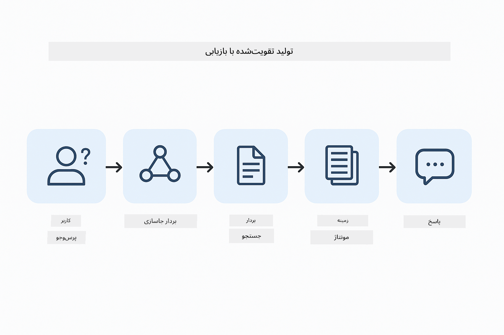
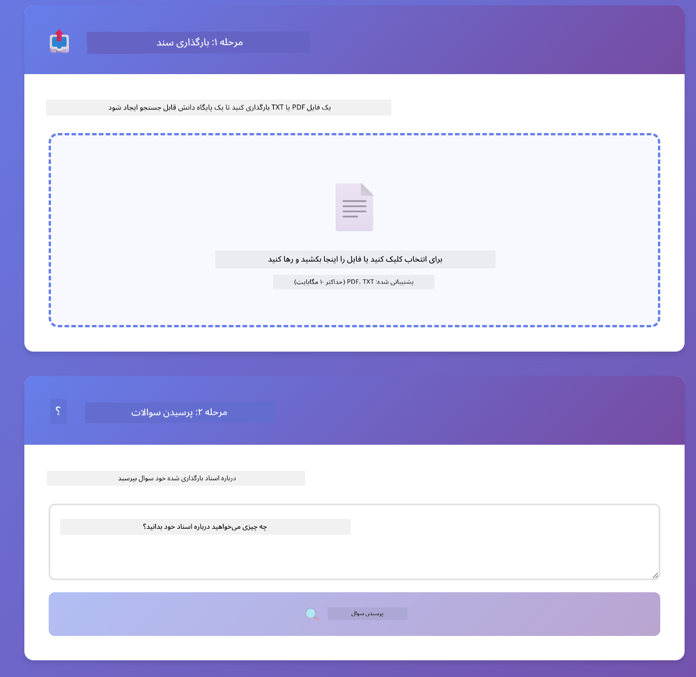

<!--
CO_OP_TRANSLATOR_METADATA:
{
  "original_hash": "f538a51cfd13147d40d84e936a0f485c",
  "translation_date": "2025-12-13T16:47:05+00:00",
  "source_file": "03-rag/README.md",
  "language_code": "fa"
}
-->
# ماژول ۰۳: RAG (تولید تقویت‌شده با بازیابی)

## فهرست مطالب

- [آنچه خواهید آموخت](../../../03-rag)
- [پیش‌نیازها](../../../03-rag)
- [درک RAG](../../../03-rag)
- [نحوه کارکرد](../../../03-rag)
  - [پردازش سند](../../../03-rag)
  - [ایجاد تعبیه‌ها](../../../03-rag)
  - [جستجوی معنایی](../../../03-rag)
  - [تولید پاسخ](../../../03-rag)
- [اجرای برنامه](../../../03-rag)
- [استفاده از برنامه](../../../03-rag)
  - [بارگذاری سند](../../../03-rag)
  - [پرسیدن سوالات](../../../03-rag)
  - [بررسی مراجع منبع](../../../03-rag)
  - [آزمایش با سوالات](../../../03-rag)
- [مفاهیم کلیدی](../../../03-rag)
  - [استراتژی تقسیم‌بندی](../../../03-rag)
  - [امتیازهای شباهت](../../../03-rag)
  - [ذخیره‌سازی در حافظه](../../../03-rag)
  - [مدیریت پنجره زمینه](../../../03-rag)
- [زمان اهمیت RAG](../../../03-rag)
- [گام‌های بعدی](../../../03-rag)

## آنچه خواهید آموخت

در ماژول‌های قبلی، یاد گرفتید چگونه با هوش مصنوعی گفتگو کنید و درخواست‌های خود را به‌طور مؤثر ساختاربندی نمایید. اما یک محدودیت اساسی وجود دارد: مدل‌های زبانی فقط آنچه را در طول آموزش یاد گرفته‌اند می‌دانند. آن‌ها نمی‌توانند به سوالاتی درباره سیاست‌های شرکت شما، مستندات پروژه‌تان یا هر اطلاعاتی که آموزش ندیده‌اند پاسخ دهند.

RAG (تولید تقویت‌شده با بازیابی) این مشکل را حل می‌کند. به جای اینکه سعی کنید مدل را با اطلاعات خود آموزش دهید (که هزینه‌بر و غیرعملی است)، به آن توانایی جستجو در اسناد خود را می‌دهید. وقتی کسی سوالی می‌پرسد، سیستم اطلاعات مرتبط را پیدا کرده و در درخواست وارد می‌کند. سپس مدل بر اساس آن زمینه بازیابی‌شده پاسخ می‌دهد.

RAG را مانند دادن یک کتابخانه مرجع به مدل در نظر بگیرید. وقتی سوالی می‌پرسید، سیستم:

1. **پرسش کاربر** - شما سوال می‌پرسید  
2. **تعبیه** - سوال شما به یک بردار تبدیل می‌شود  
3. **جستجوی برداری** - بخش‌های مشابه سند را پیدا می‌کند  
4. **ترکیب زمینه** - بخش‌های مرتبط را به درخواست اضافه می‌کند  
5. **پاسخ** - مدل زبانی بزرگ بر اساس زمینه پاسخ می‌دهد  

این کار پاسخ‌های مدل را بر اساس داده‌های واقعی شما پایه‌گذاری می‌کند، نه صرفاً دانش آموزش یا ساختن پاسخ.



*جریان کاری RAG - از پرسش کاربر تا جستجوی معنایی و تولید پاسخ مبتنی بر زمینه*

## پیش‌نیازها

- تکمیل ماژول ۰۱ (منابع Azure OpenAI مستقر شده)
- فایل `.env` در دایرکتوری ریشه با اعتبارنامه‌های Azure (ایجاد شده توسط `azd up` در ماژول ۰۱)

> **توجه:** اگر ماژول ۰۱ را کامل نکرده‌اید، ابتدا دستورالعمل‌های استقرار آن را دنبال کنید.

## نحوه کارکرد

**پردازش سند** - [DocumentService.java](../../../03-rag/src/main/java/com/example/langchain4j/rag/service/DocumentService.java)

وقتی سندی بارگذاری می‌کنید، سیستم آن را به بخش‌های کوچکتر تقسیم می‌کند - قطعاتی که به‌راحتی در پنجره زمینه مدل جا می‌شوند. این بخش‌ها کمی همپوشانی دارند تا در مرزها زمینه از دست نرود.

```java
Document document = FileSystemDocumentLoader.loadDocument("sample-document.txt");

DocumentSplitter splitter = DocumentSplitters
    .recursive(300, 30, new OpenAiTokenizer());

List<TextSegment> segments = splitter.split(document);
```

> **🤖 امتحان با [GitHub Copilot](https://github.com/features/copilot) Chat:** فایل [`DocumentService.java`](../../../03-rag/src/main/java/com/example/langchain4j/rag/service/DocumentService.java) را باز کنید و بپرسید:  
> - "چگونه LangChain4j اسناد را به بخش‌ها تقسیم می‌کند و چرا همپوشانی مهم است؟"  
> - "اندازه بهینه بخش‌ها برای انواع مختلف اسناد چقدر است و چرا؟"  
> - "چگونه اسناد چندزبانه یا با قالب‌بندی خاص را مدیریت کنم؟"

**ایجاد تعبیه‌ها** - [LangChainRagConfig.java](../../../03-rag/src/main/java/com/example/langchain4j/rag/config/LangChainRagConfig.java)

هر بخش به یک نمایش عددی به نام تعبیه تبدیل می‌شود - در واقع یک اثر انگشت ریاضی که معنای متن را ثبت می‌کند. متن‌های مشابه تعبیه‌های مشابه تولید می‌کنند.

```java
@Bean
public EmbeddingModel embeddingModel() {
    return OpenAiOfficialEmbeddingModel.builder()
        .baseUrl(azureOpenAiEndpoint)
        .apiKey(azureOpenAiKey)
        .modelName(azureEmbeddingDeploymentName)
        .build();
}

EmbeddingStore<TextSegment> embeddingStore = 
    new InMemoryEmbeddingStore<>();
```


*اسناد به صورت بردارهایی در فضای تعبیه نمایش داده شده‌اند - محتواهای مشابه در کنار هم خوشه‌بندی شده‌اند*

**جستجوی معنایی** - [RagService.java](../../../03-rag/src/main/java/com/example/langchain4j/rag/service/RagService.java)

وقتی سوالی می‌پرسید، سوال شما نیز به تعبیه تبدیل می‌شود. سیستم تعبیه سوال شما را با تعبیه‌های تمام بخش‌های سند مقایسه می‌کند. بخش‌هایی را پیدا می‌کند که بیشترین شباهت معنایی را دارند - نه فقط کلمات کلیدی مشابه، بلکه شباهت واقعی معنایی.

```java
Embedding queryEmbedding = embeddingModel.embed(question).content();

List<EmbeddingMatch<TextSegment>> matches = 
    embeddingStore.findRelevant(queryEmbedding, 5, 0.7);

for (EmbeddingMatch<TextSegment> match : matches) {
    String relevantText = match.embedded().text();
    double score = match.score();
}
```

> **🤖 امتحان با [GitHub Copilot](https://github.com/features/copilot) Chat:** فایل [`RagService.java`](../../../03-rag/src/main/java/com/example/langchain4j/rag/service/RagService.java) را باز کنید و بپرسید:  
> - "جستجوی شباهت چگونه با تعبیه‌ها کار می‌کند و چه چیزی امتیاز را تعیین می‌کند؟"  
> - "چه آستانه شباهتی باید استفاده کنم و چگونه نتایج را تحت تأثیر قرار می‌دهد؟"  
> - "چگونه مواردی که سند مرتبطی پیدا نمی‌شود را مدیریت کنم؟"

**تولید پاسخ** - [RagService.java](../../../03-rag/src/main/java/com/example/langchain4j/rag/service/RagService.java)

مربوط‌ترین بخش‌ها در درخواست به مدل وارد می‌شوند. مدل آن بخش‌های خاص را می‌خواند و بر اساس آن اطلاعات به سوال شما پاسخ می‌دهد. این از توهم‌زایی جلوگیری می‌کند - مدل فقط می‌تواند از آنچه در مقابلش است پاسخ دهد.

## اجرای برنامه

**تأیید استقرار:**

اطمینان حاصل کنید فایل `.env` در دایرکتوری ریشه با اعتبارنامه‌های Azure وجود دارد (ایجاد شده در ماژول ۰۱):  
```bash
cat ../.env  # باید AZURE_OPENAI_ENDPOINT، API_KEY، DEPLOYMENT را نشان دهد
```
  
**شروع برنامه:**

> **توجه:** اگر قبلاً همه برنامه‌ها را با `./start-all.sh` از ماژول ۰۱ اجرا کرده‌اید، این ماژول هم‌اکنون روی پورت ۸۰۸۱ در حال اجراست. می‌توانید دستورات شروع زیر را رد کنید و مستقیماً به http://localhost:8081 بروید.

**گزینه ۱: استفاده از Spring Boot Dashboard (توصیه شده برای کاربران VS Code)**

کانتینر توسعه شامل افزونه Spring Boot Dashboard است که رابط بصری برای مدیریت همه برنامه‌های Spring Boot فراهم می‌کند. می‌توانید آن را در نوار فعالیت سمت چپ VS Code (آیکون Spring Boot) پیدا کنید.

از طریق Spring Boot Dashboard می‌توانید:  
- همه برنامه‌های Spring Boot موجود در فضای کاری را ببینید  
- برنامه‌ها را با یک کلیک شروع/توقف کنید  
- لاگ‌های برنامه را به‌صورت زنده مشاهده کنید  
- وضعیت برنامه را نظارت کنید  

فقط روی دکمه پخش کنار "rag" کلیک کنید تا این ماژول شروع شود، یا همه ماژول‌ها را همزمان اجرا کنید.


**گزینه ۲: استفاده از اسکریپت‌های شل**

همه برنامه‌های وب (ماژول‌های ۰۱ تا ۰۴) را اجرا کنید:

**Bash:**  
```bash
cd ..  # از دایرکتوری ریشه
./start-all.sh
```
  
**PowerShell:**  
```powershell
cd ..  # از دایرکتوری ریشه
.\start-all.ps1
```
  
یا فقط این ماژول را اجرا کنید:

**Bash:**  
```bash
cd 03-rag
./start.sh
```
  
**PowerShell:**  
```powershell
cd 03-rag
.\start.ps1
```
  
هر دو اسکریپت به‌طور خودکار متغیرهای محیطی را از فایل `.env` ریشه بارگذاری می‌کنند و در صورت عدم وجود، فایل‌های JAR را می‌سازند.

> **توجه:** اگر ترجیح می‌دهید قبل از شروع همه ماژول‌ها را به‌صورت دستی بسازید:  
>  
> **Bash:**  
> ```bash
> cd ..  # Go to root directory
> mvn clean package -DskipTests
> ```
  
> **PowerShell:**  
> ```powershell
> cd ..  # Go to root directory
> mvn clean package -DskipTests
> ```
  
مرورگر خود را باز کرده و به http://localhost:8081 بروید.

**برای توقف:**

**Bash:**  
```bash
./stop.sh  # فقط این ماژول
# یا
cd .. && ./stop-all.sh  # همه ماژول‌ها
```
  
**PowerShell:**  
```powershell
.\stop.ps1  # فقط این ماژول
# یا
cd ..; .\stop-all.ps1  # همه ماژول‌ها
```


## استفاده از برنامه

برنامه یک رابط وب برای بارگذاری سند و پرسش فراهم می‌کند.

<a href="images/rag-homepage.png"></a>

*رابط برنامه RAG - بارگذاری اسناد و پرسیدن سوالات*

**بارگذاری سند**

با بارگذاری یک سند شروع کنید - فایل‌های TXT برای تست بهترین عملکرد را دارند. یک فایل `sample-document.txt` در این دایرکتوری موجود است که شامل اطلاعاتی درباره ویژگی‌های LangChain4j، پیاده‌سازی RAG و بهترین شیوه‌ها است - مناسب برای تست سیستم.

سیستم سند شما را پردازش می‌کند، آن را به بخش‌هایی تقسیم می‌کند و برای هر بخش تعبیه ایجاد می‌کند. این کار به‌صورت خودکار هنگام بارگذاری انجام می‌شود.

**پرسیدن سوالات**

اکنون سوالات خاصی درباره محتوای سند بپرسید. چیزی واقعی و واضح که در سند بیان شده است را امتحان کنید. سیستم بخش‌های مرتبط را جستجو می‌کند، آن‌ها را در درخواست وارد می‌کند و پاسخ تولید می‌کند.

**بررسی مراجع منبع**

توجه کنید هر پاسخ شامل مراجع منبع با امتیازهای شباهت است. این امتیازها (از ۰ تا ۱) نشان می‌دهند هر بخش چقدر به سوال شما مرتبط بوده است. امتیازهای بالاتر به معنای تطابق بهتر است. این امکان را به شما می‌دهد که پاسخ را با منبع اصلی بررسی کنید.

<a href="images/rag-query-results.png"></a>

*نتایج پرسش که پاسخ را همراه با مراجع منبع و امتیازهای مرتبط نشان می‌دهد*

**آزمایش با سوالات**

انواع مختلف سوالات را امتحان کنید:  
- حقایق خاص: "موضوع اصلی چیست؟"  
- مقایسه‌ها: "تفاوت بین X و Y چیست؟"  
- خلاصه‌ها: "نکات کلیدی درباره Z را خلاصه کن"  

مشاهده کنید چگونه امتیازهای مرتبط بر اساس تطابق سوال شما با محتوای سند تغییر می‌کنند.

## مفاهیم کلیدی

**استراتژی تقسیم‌بندی**

اسناد به بخش‌های ۳۰۰ توکنی با ۳۰ توکن همپوشانی تقسیم می‌شوند. این تعادل تضمین می‌کند هر بخش زمینه کافی برای معنی‌دار بودن دارد و در عین حال به اندازه‌ای کوچک است که چند بخش در یک درخواست جا شود.

**امتیازهای شباهت**

امتیازها از ۰ تا ۱ متغیرند:  
- ۰.۷ تا ۱.۰: بسیار مرتبط، تطابق دقیق  
- ۰.۵ تا ۰.۷: مرتبط، زمینه خوب  
- کمتر از ۰.۵: فیلتر شده، خیلی نامرتبط  

سیستم فقط بخش‌هایی را بازیابی می‌کند که بالاتر از آستانه حداقل باشند تا کیفیت تضمین شود.

**ذخیره‌سازی در حافظه**

این ماژول برای سادگی از ذخیره‌سازی در حافظه استفاده می‌کند. وقتی برنامه را مجدداً راه‌اندازی کنید، اسناد بارگذاری‌شده از دست می‌روند. سیستم‌های تولیدی از پایگاه‌های داده برداری پایدار مانند Qdrant یا Azure AI Search استفاده می‌کنند.

**مدیریت پنجره زمینه**

هر مدل یک پنجره زمینه حداکثری دارد. نمی‌توانید همه بخش‌های یک سند بزرگ را وارد کنید. سیستم N بخش مرتبط‌ترین (پیش‌فرض ۵) را بازیابی می‌کند تا در محدودیت‌ها بماند و در عین حال زمینه کافی برای پاسخ‌های دقیق فراهم کند.

## زمان اهمیت RAG

**از RAG استفاده کنید وقتی:**  
- به سوالات درباره اسناد اختصاصی پاسخ می‌دهید  
- اطلاعات به‌طور مکرر تغییر می‌کند (سیاست‌ها، قیمت‌ها، مشخصات)  
- دقت نیازمند ارجاع به منبع است  
- محتوا خیلی بزرگ است که در یک درخواست جا شود  
- به پاسخ‌های قابل تأیید و مبتنی بر داده نیاز دارید  

**از RAG استفاده نکنید وقتی:**  
- سوالات نیازمند دانش عمومی است که مدل قبلاً دارد  
- داده‌های زمان واقعی لازم است (RAG فقط روی اسناد بارگذاری‌شده کار می‌کند)  
- محتوا به اندازه‌ای کوچک است که مستقیماً در درخواست وارد شود  

## گام‌های بعدی

**ماژول بعدی:** [۰۴-ابزارها - عوامل هوش مصنوعی با ابزارها](../04-tools/README.md)

---

**ناوبری:** [← قبلی: ماژول ۰۲ - مهندسی درخواست](../02-prompt-engineering/README.md) | [بازگشت به اصلی](../README.md) | [بعدی: ماژول ۰۴ - ابزارها →](../04-tools/README.md)

---

<!-- CO-OP TRANSLATOR DISCLAIMER START -->
**سلب مسئولیت**:  
این سند با استفاده از سرویس ترجمه هوش مصنوعی [Co-op Translator](https://github.com/Azure/co-op-translator) ترجمه شده است. در حالی که ما در تلاش برای دقت هستیم، لطفاً توجه داشته باشید که ترجمه‌های خودکار ممکن است حاوی خطاها یا نواقصی باشند. سند اصلی به زبان بومی خود باید به عنوان منبع معتبر در نظر گرفته شود. برای اطلاعات حیاتی، ترجمه حرفه‌ای انسانی توصیه می‌شود. ما مسئول هیچ گونه سوءتفاهم یا تفسیر نادرستی که از استفاده این ترجمه ناشی شود، نیستیم.
<!-- CO-OP TRANSLATOR DISCLAIMER END -->