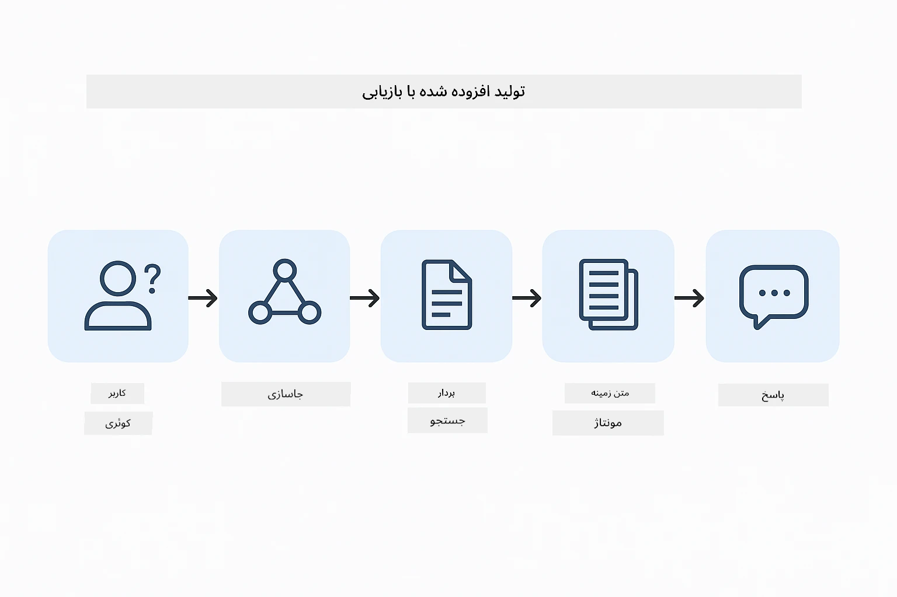
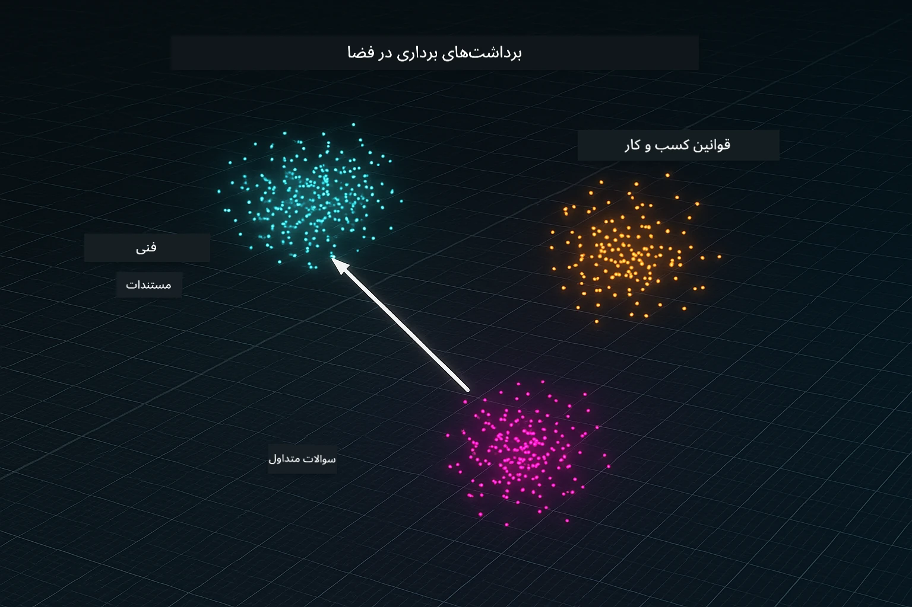
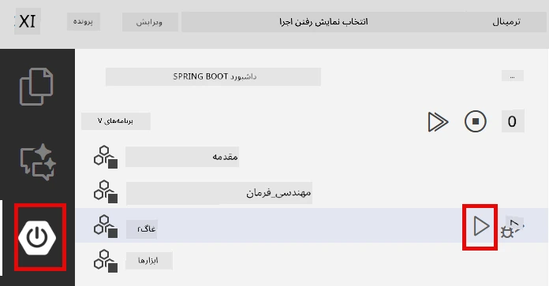
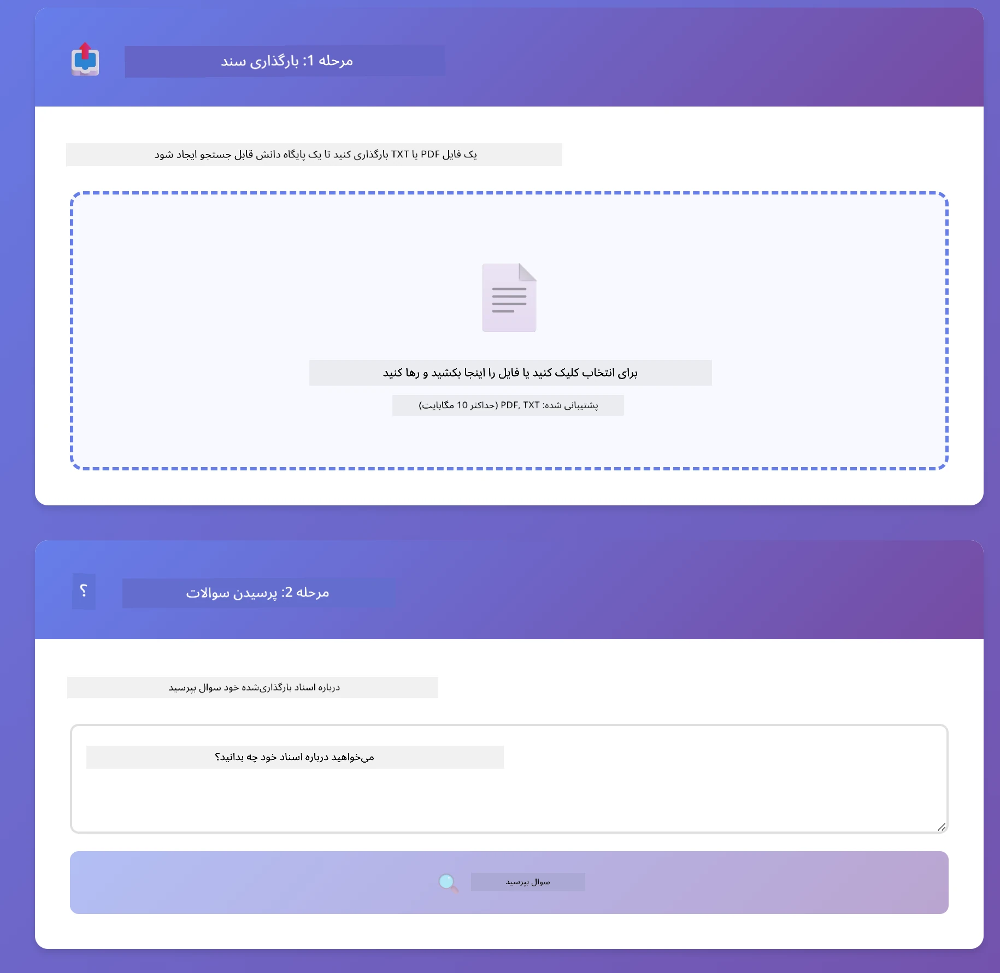
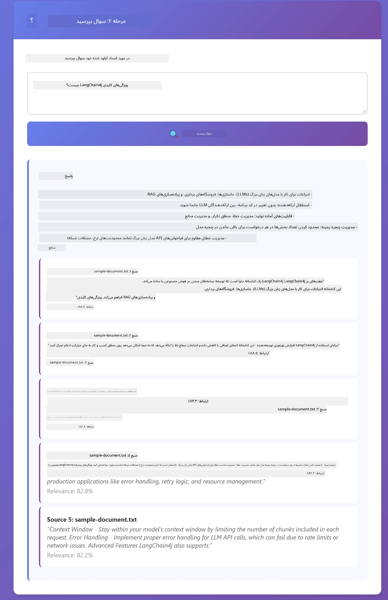

# ماژول ۰۳: RAG (تولید تقویت‌شده با بازیابی)

## فهرست مطالب

- [تماشای ویدیو](#تماشای-ویدیو)
- [آنچه یاد خواهید گرفت](#آنچه-یاد-خواهید-گرفت)
- [پیش‌نیازها](#پیش‌نیازها)
- [درک RAG](#درک-rag)
  - [کدام رویکرد RAG در این آموزش استفاده می‌شود؟](#کدام-رویکرد-rag-در-این-آموزش-استفاده-می‌شود؟)
- [نحوه کارکرد](#نحوه-کارکرد)
  - [پردازش سند](#پردازش-سند)
  - [ایجاد تعبیه‌ها](#ایجاد-تعبیه‌ها)
  - [جستجوی معنایی](#جستجوی-معنایی)
  - [تولید پاسخ](#تولید-پاسخ)
- [اجرای برنامه](#اجرای-برنامه)
- [استفاده از برنامه](#استفاده-از-برنامه)
  - [بارگذاری سند](#بارگذاری-سند)
  - [پرسیدن سوال](#پرسیدن-سوالات)
  - [بررسی منابع](#بررسی-مراجع-منبع)
  - [آزمایش با سوالات](#آزمایش-با-سوالات-مختلف)
- [مفاهیم کلیدی](#مفاهیم-کلیدی)
  - [استراتژی تکه‌بندی](#استراتژی-تقسیم-بخش‌ها)
  - [امتیازهای شباهت](#امتیازهای-شباهت)
  - [ذخیره‌سازی در حافظه](#ذخیره‌سازی-در-حافظه)
  - [مدیریت پنجره متن](#مدیریت-پنجره-زمینه)
- [زمان اهمیت RAG](#کی-rag-اهمیت-دارد)
- [گام‌های بعدی](#مراحل-بعدی)

## تماشای ویدیو

این جلسه زنده را ببینید که توضیح می‌دهد چگونه با این ماژول شروع به کار کنید:

<a href="https://www.youtube.com/watch?v=_olq75ZH_eY"></a>

## آنچه یاد خواهید گرفت

در ماژول‌های قبلی یاد گرفتید چگونه با هوش مصنوعی گفتگو کنید و پرامپت‌های خود را به‌طور مؤثر ساختاربندی کنید. اما یک محدودیت بنیادی وجود دارد: مدل‌های زبانی فقط آنچه را در حین آموزش یاد گرفته‌اند می‌دانند. آن‌ها نمی‌توانند به سوالاتی درباره سیاست‌های شرکت شما، مستندات پروژه‌تان، یا هر اطلاعاتی که روی آن آموزش ندیده‌اند پاسخ دهند.

RAG (تولید تقویت‌شده با بازیابی) این مشکل را حل می‌کند. به جای اینکه بخواهید مدل را با اطلاعات خود آموزش دهید (که هزینه‌بر و غیرعملی است)، به آن توانایی جستجو در اسناد خود را می‌دهید. وقتی کسی سوالی می‌پرسد، سیستم اطلاعات مرتبط را پیدا کرده و در پرامپت وارد می‌کند. سپس مدل بر اساس آن زمینه بازیابی‌شده پاسخ می‌دهد.

RAG را مانند دادن یک کتابخانه مرجع به مدل در نظر بگیرید. وقتی سوال می‌پرسید، سیستم:

1. **پرسش کاربر** - شما سوال می‌پرسید
2. **تعبیه‌سازی** - سوال شما به بردار تبدیل می‌شود
3. **جستجوی برداری** - بخش‌های مشابه سند پیدا می‌شوند
4. **گردآوری متن زمینه** - بخش‌های مرتبط به پرامپت اضافه می‌شود
5. **پاسخ** - مدل زبانی بزرگ پاسخ را بر اساس متن زمینه ایجاد می‌کند

این باعث می‌شود پاسخ‌های مدل بر اساس داده‌های واقعی شما باشد، نه فقط دانسته‌های آموزشی یا حدس‌های غیرواقعی.

## پیش‌نیازها

- اتمام [ماژول ۰۱ - معرفی](../01-introduction/README.md) (استقرار منابع Azure OpenAI، شامل مدل تعبیه‌سازی `text-embedding-3-small`)
- فایل `.env` در شاخه اصلی با اطلاعات Azure (ایجاد شده توسط دستور `azd up` در ماژول ۰۱)

> **توجه:** اگر ماژول ۰۱ را کامل نکرده‌اید، ابتدا دستورالعمل‌های استقرار آن را دنبال کنید. دستور `azd up` هر دو مدل گفتگو GPT و مدل تعبیه‌سازی مورد استفاده این ماژول را مستقر می‌کند.

## درک RAG

نمودار زیر مفهوم اصلی را نشان می‌دهد: به جای تکیه صرف بر داده‌های آموزشی مدل، RAG به آن یک کتابخانه مرجع از اسناد شما می‌دهد تا قبل از ایجاد هر پاسخ، به آن مراجعه کند.


*این نمودار تفاوت بین یک مدل زبانی استاندارد (که از داده‌های آموزشی حدس می‌زند) و یک مدل زبانی تقویت‌شده RAG (که ابتدا به اسناد شما مراجعه می‌کند) را نشان می‌دهد.*

اتصالات قطعات سیستم از ابتدا تا انتها به این صورت است. سوال کاربر از چهار مرحله می‌گذرد — تعبیه‌سازی، جستجوی برداری، جمع‌آوری متن زمینه، و تولید پاسخ — که هر مرحله بر مرحله قبل بنا شده است:



*این نمودار خط لوله انتها به انتهای RAG را نشان می‌دهد — پرسش کاربر از مراحل تعبیه‌سازی، جستجوی برداری، جمع‌آوری متن زمینه و تولید پاسخ عبور می‌کند.*

باقی ماژول هر مرحله را با جزئیات، همراه با کد قابل اجرا و قابل تغییر، بررسی می‌کند.

### کدام رویکرد RAG در این آموزش استفاده می‌شود؟

LangChain4j سه روش برای پیاده‌سازی RAG ارائه می‌دهد، هرکدام با سطح انتزاع متفاوت. نمودار زیر آن‌ها را کنار هم مقایسه می‌کند:


*این نمودار سه رویکرد RAG در LangChain4j — آسان، بومی و پیشرفته — را نشان می‌دهد، بخش‌های کلیدی و زمان استفاده از هرکدام را توضیح می‌دهد.*

| رویکرد | چه کاری انجام می‌دهد | مصالحه |
|---|---|---|
| **Easy RAG** | همه چیز را به صورت خودکار از طریق `AiServices` و `ContentRetriever` سیم‌کشی می‌کند. شما یک رابط را توضیح می‌دهید، یک بازیاب متصل می‌کنید و LangChain4j تعبیه‌سازی، جستجو و جمع‌آوری پرامپت را پشت صحنه مدیریت می‌کند. | کمترین کد، اما شما دقیقاً نمی‌بینید در هر مرحله چه اتفاقی می‌افتد. |
| **Native RAG** | خودتان مدل تعبیه‌سازی را صدا می‌زنید، فروشگاه را جستجو می‌کنید، پرامپت را می‌سازید و پاسخ را تولید می‌کنید — هر مرحله آشکار و جداگانه. | کد بیشتر، اما هر مرحله قابل مشاهده و تغییر است. |
| **Advanced RAG** | از چارچوب `RetrievalAugmentor` با تبدیل‌کننده‌های پرسش، مسیریاب‌ها، دوباره رتبه‌بند‌ها و تزریق‌کننده‌های محتوا برای خط‌لوله‌های سطح تولید استفاده می‌کند. | حداکثر انعطاف‌پذیری، اما به مراتب پیچیده‌تر. |

**این آموزش رویکرد Native را به کار می‌برد.** هر مرحله از خط لوله RAG — تعبیه‌سازی پرسش، جستجوی فروشگاه بردار، جمع‌آوری متن زمینه، و تولید پاسخ — به‌طور صریح در [`RagService.java`](../../../03-rag/src/main/java/com/example/langchain4j/rag/service/RagService.java) نوشته شده است. این کار عمدی است: به عنوان منبع آموزشی، مهم‌تر است که شما هر مرحله را ببینید و درک کنید تا اینکه کد به حداقل برسد. وقتی راحت شدید که قطعات چگونه کنار هم می‌نشینند، می‌توانید به Easy RAG برای نمونه‌های سریع یا Advanced RAG برای سیستم‌های تولیدی منتقل شوید.

> **💡 کنجکاو درباره Easy RAG؟** LangChain4j همچنین رویکرد *Easy RAG* را ارائه می‌دهد که در آن `AiServices` و `ContentRetriever` تعبیه‌سازی، جستجو و جمع‌آوری پرامپت را به طور خودکار انجام می‌دهند. این ماژول مسیر واضح‌تری را می‌پیماید تا بتوانید هر مرحله را خودتان ببینید و کنترل کنید.

نمودار زیر خط لوله Easy RAG را نشان می‌دهد. توجه کنید که چگونه `AiServices` و `EmbeddingStoreContentRetriever` همه پیچیدگی‌ها را پنهان می‌کنند — شما یک سند بارگذاری می‌کنید، یک بازیاب متصل می‌کنید و پاسخ می‌گیرید. رویکرد بومی در این ماژول هر یک از آن مراحل پنهان‌شده را باز می‌کند:


*این نمودار خط لوله Easy RAG را نشان می‌دهد. آن را با رویکرد بومی این ماژول مقایسه کنید: Easy RAG تعبیه‌سازی، بازیابی و ساخت پرامپت را پشت `AiServices` و `ContentRetriever` مخفی می‌کند — شما سندی بارگذاری می‌کنید، بازیابی‌کننده‌ای متصل می‌کنید و پاسخ می‌گیرید. رویکرد بومی در این ماژول آن خط لوله را باز می‌کند تا شما هر مرحله (تعبیه‌سازی، جستجو، جمع‌آوری متن، تولید) را خودتان صدا بزنید، که دید و کنترل کاملی به شما می‌دهد.*

## نحوه کارکرد

خط لوله RAG در این ماژول به چهار مرحله تقسیم می‌شود که هر بار یک کاربر سوال می‌پرسد به ترتیب اجرا می‌شوند. ابتدا سند بارگذاری‌شده **تجزیه و به تکه‌های قابل مدیریت تقسیم می‌شود**. سپس این تکه‌ها به **بردارهای تعبیه تبدیل** و ذخیره می‌شوند تا بتوان آن‌ها را به صورت ریاضی مقایسه کرد. وقتی پرسش می‌رسد، سیستم برای یافتن مرتبط‌ترین تکه‌ها **جستجوی معنایی** انجام می‌دهد و در نهایت آن‌ها را به عنوان متن زمینه به مدل زبانی بزرگ برای **تولید پاسخ** می‌فرستد. بخش‌های زیر هر مرحله را با کد واقعی و نمودارها بررسی می‌کنند. ابتدا گام اول را ببینیم.

### پردازش سند

[DocumentService.java](../../../03-rag/src/main/java/com/example/langchain4j/rag/service/DocumentService.java)

وقتی سندی بارگذاری می‌کنید، سیستم آن را (PDF یا متن ساده) تجزیه می‌کند، متادیتا مانند نام فایل را اضافه می‌کند و سپس آن را به تکه‌هایی تقسیم می‌کند — قطعات کوچکتری که به راحتی در پنجره متن مدل جای بگیرند. این تکه‌ها کمی هم‌پوشانی دارند تا زمینه در مرزها از دست نرود.

```java
// فایل بارگذاری شده را تجزیه کرده و در یک سند LangChain4j قرار دهید
Document document = Document.from(content, metadata);

// تقسیم به بخش‌های ۳۰۰ توکنی با همپوشانی ۳۰ توکنی
DocumentSplitter splitter = DocumentSplitters
    .recursive(300, 30);

List<TextSegment> segments = splitter.split(document);
```
  
نمودار زیر نحوه کار را به صورت تصویری نشان می‌دهد. ببینید هر تکه چگونه با همسایگانش برخی توکن‌ها را به اشتراک می‌گذارد — هم‌پوشانی ۳۰ توکن تضمین می‌کند که هیچ زمینه مهمی در شکاف‌ها از دست نرود:


*این نمودار نشان می‌دهد چگونه یک سند به تکه‌های ۳۰۰ توکنی با هم‌پوشانی ۳۰ توکنی تقسیم می‌شود، و زمینه در مرز تکه‌ها حفظ می‌شود.*

> **🤖 با [گیت‌هاب کاپایلوت](https://github.com/features/copilot) گفتگو کنید:** فایل [`DocumentService.java`](../../../03-rag/src/main/java/com/example/langchain4j/rag/service/DocumentService.java) را باز کنید و بپرسید:  
> - "LangChain4j چطور اسناد را به تکه‌هایی تقسیم می‌کند و چرا هم‌پوشانی مهم است؟"  
> - "اندازه بهینه تکه برای انواع مختلف اسناد چیست و چرا؟"  
> - "چطور با اسناد چندزبانه یا با قالب‌بندی ویژه برخورد کنیم؟"

### ایجاد تعبیه‌ها

[LangChainRagConfig.java](../../../03-rag/src/main/java/com/example/langchain4j/rag/config/LangChainRagConfig.java)

هر تکه به یک نمایش عددی به نام تعبیه تبدیل می‌شود — اساساً یک تبدیل معنا به اعداد. مدل تعبیه‌سازی هوشمند نیست مانند مدل گفتگویی؛ نمی‌تواند دستورالعمل‌ها را دنبال کند، استدلال کند یا به سوالات پاسخ دهد. کاری که انجام می‌دهد این است که متن را به فضایی ریاضی نگاشت می‌کند که معانی مشابه نزدیک هم قرار می‌گیرند — "car" نزدیک "automobile"، "refund policy" نزدیک "return my money". مدل گفتگویی مانند فردی است که می‌توانید با او صحبت کنید؛ مدل تعبیه‌سازی مانند یک سامانه بایگانی بسیار خوب است.

نمودار زیر این مفهوم را نمایش می‌دهد — متن وارد می‌شود، بردارهای عددی بیرون می‌آیند و معانی مشابه بردارهای نزدیکی تولید می‌کنند:


*این نمودار نشان می‌دهد که یک مدل تعبیه‌سازی چگونه متن را به بردارهای عددی تبدیل می‌کند، و معانی مشابه مانند "car" و "automobile" را در فضای بردار نزدیک به هم قرار می‌دهد.*

```java
@Bean
public EmbeddingModel embeddingModel() {
    return OpenAiOfficialEmbeddingModel.builder()
        .baseUrl(azureOpenAiEndpoint)
        .apiKey(azureOpenAiKey)
        .modelName(azureEmbeddingDeploymentName)
        .build();
}

EmbeddingStore<TextSegment> embeddingStore = 
    new InMemoryEmbeddingStore<>();
```
  
نمودار کلاس زیر دو جریان جداگانه در خط لوله RAG و کلاس‌های LangChain4j را که آن‌ها را پیاده‌سازی می‌کنند نشان می‌دهد. جریان **ورودی** (یکبار در زمان بارگذاری اجرا می‌شود) سند را تقسیم، تکه‌ها را تعبیه‌سازی و با `.addAll()` ذخیره می‌کند. جریان **پرسش** (هر بار که کاربر سوال می‌پرسد اجرا می‌شود) سوال را تعبیه‌سازی، فروشگاه را با `.search()` جستجو و متن مرتبط را به مدل گفتگویی می‌فرستد. هر دو جریان به رابط مشترک `EmbeddingStore<TextSegment>` می‌رسند:


*این نمودار دو جریان در خط لوله RAG — ورودی و پرسش — و نحوه اتصال آن‌ها از طریق EmbeddingStore مشترک را نشان می‌دهد.*

وقتی تعبیه‌ها ذخیره شدند، محتوای مشابه به طور طبیعی در فضای بردار کنار هم خوشه‌بندی می‌شوند. تصویر زیر نشان می‌دهد چگونه اسناد مرتبط در نزدیکی یکدیگر به صورت نقاطی کنار هم قرار می‌گیرند، که امکان جستجوی معنایی را فراهم می‌کند:



*این تصویر خوشه‌بندی اسناد مرتبط را در فضای سه‌بعدی بردار نشان می‌دهد، با موضوعاتی مانند اسناد فنی، قوانین کسب‌وکار و سوالات متداول که گروه‌های متمایزی تشکیل می‌دهند.*

وقتی کاربر جستجو می‌کند، سیستم چهار گام را طی می‌کند: اسناد یک‌بار تعبیه می‌شوند، پرسش در هر جستجو تعبیه می‌شود، بردار پرسش با همه بردارهای ذخیره‌شده با شباهت کسینوسی مقایسه می‌شود، و بخش‌های برتر نتیجه بازگردانده می‌شوند. نمودار زیر هر گام و کلاس‌های LangChain4j مربوط را نشان می‌دهد:


*این نمودار فرایند جستجوی تعبیه در چهار گام را نشان می‌دهد: تعبیه اسناد، تعبیه پرسش، مقایسه بردارها با شباهت کسینوسی، و بازگرداندن نتایج برتر.*

### جستجوی معنایی

[RagService.java](../../../03-rag/src/main/java/com/example/langchain4j/rag/service/RagService.java)

وقتی سوال می‌پرسید، خود سوال نیز به تعبیه تبدیل می‌شود. سیستم تعبیه سوال را با همه تعبیه‌های تکه‌های سند مقایسه می‌کند. تکه‌هایی با معانی مشابه را می‌یابد — نه فقط مطابقت کلمات کلیدی، بلکه شباهت معنایی واقعی.

```java
Embedding queryEmbedding = embeddingModel.embed(question).content();

EmbeddingSearchRequest searchRequest = EmbeddingSearchRequest.builder()
    .queryEmbedding(queryEmbedding)
    .maxResults(5)
    .minScore(0.5)
    .build();

EmbeddingSearchResult<TextSegment> searchResult = embeddingStore.search(searchRequest);
List<EmbeddingMatch<TextSegment>> matches = searchResult.matches();

for (EmbeddingMatch<TextSegment> match : matches) {
    String relevantText = match.embedded().text();
    double score = match.score();
}
```
  
نمودار زیر جستجوی معنایی را با جستجوی سنتی کلمات کلیدی مقایسه می‌کند. جستجوی کلمه کلیدی "vehicle" یک تکه درباره "cars and trucks" را از دست می‌دهد، ولی جستجوی معنایی می‌فهمد که آن‌ها یکی هستند و آن را به عنوان نتیجه با امتیاز بالا برمی‌گرداند:


*این نمودار جستجوی مبتنی بر کلمات کلیدی را با جستجوی معنایی مقایسه می‌کند و نشان می‌دهد چگونه جستجوی معنایی حتی وقتی کلمات کلیدی دقیق متفاوت هستند، محتوای مرتبط مفهومی را بازیابی می‌کند.*

در پس‌زمینه، شباهت با استفاده از شباهت کسینوسی اندازه‌گیری می‌شود — اساساً سوال می‌شود "آیا این دو پیکان به یک جهت اشاره می‌کنند؟" دو تکه می‌توانند کلمات کاملاً متفاوتی داشته باشند، ولی اگر معنی یکسانی داشته باشند بردارهایشان به یک سمت اشاره کرده و امتیاز نزدیک ۱.۰ می‌گیرند:


*این نمودار نشان‌دهنده شباهت کسینوس به‌عنوان زاویه بین بردارهای جاسازی است — بردارهای هم‌راستا امتیاز نزدیک‌تر به ۱.۰ می‌گیرند که نشان‌دهنده شباهت معنایی بالاتر است.*

> **🤖 امتحان کنید با [GitHub Copilot](https://github.com/features/copilot) Chat:** فایل [`RagService.java`](../../../03-rag/src/main/java/com/example/langchain4j/rag/service/RagService.java) را باز کنید و بپرسید:
> - "جستجوی شباهت چگونه با جاسازی‌ها کار می‌کند و چه چیزی امتیاز را تعیین می‌کند؟"
> - "چه حد آستانه شباهتی باید استفاده کنم و چگونه بر نتایج تأثیر می‌گذارد؟"
> - "چگونه مواردی که هیچ مدارک مرتبطی یافت نمی‌شود را مدیریت کنم؟"

### تولید پاسخ

[RagService.java](../../../03-rag/src/main/java/com/example/langchain4j/rag/service/RagService.java)

مرتبط‌ترین بخش‌ها به یک پرامپت ساختاریافته جمع‌آوری می‌شوند که شامل دستورالعمل‌های صریح، زمینه بازیابی‌شده و سؤال کاربر است. مدل آن بخش‌های خاص را می‌خواند و بر اساس آن اطلاعات پاسخ می‌دهد — فقط می‌تواند از آنچه در مقابلش است استفاده کند، که از ایجاد توهم جلوگیری می‌کند.

```java
String context = matches.stream()
    .map(match -> match.embedded().text())
    .collect(Collectors.joining("\n\n"));

String prompt = String.format("""
    Answer the question based on the following context.
    If the answer cannot be found in the context, say so.

    Context:
    %s

    Question: %s

    Answer:""", context, request.question());

String answer = chatModel.chat(prompt);
```
  
نمودار زیر این گردآوری را به نمایش می‌گذارد — بخش‌های با بالاترین امتیاز از مرحله جستجو وارد قالب پرامپت می‌شوند و `OpenAiOfficialChatModel` پاسخ مبتنی بر داده تولید می‌کند:


*این نمودار نشان می‌دهد که چگونه بخش‌های با بالاترین امتیاز به یک پرامپت ساختاریافته تبدیل می‌شوند تا مدل پاسخ مبتنی بر داده‌های شما را تولید کند.*

## اجرای برنامه

**بررسی استقرار:**

اطمینان حاصل کنید فایل `.env` در دایرکتوری ریشه با اعتبارات Azure موجود است (ساخته شده در طول ماژول ۰۱). این دستور را از دایرکتوری ماژول (`03-rag/`) اجرا کنید:

**Bash:**  
```bash
cat ../.env  # باید AZURE_OPENAI_ENDPOINT، API_KEY، DEPLOYMENT را نشان دهد
```
  
**PowerShell:**  
```powershell
Get-Content ..\.env  # باید AZURE_OPENAI_ENDPOINT، API_KEY، DEPLOYMENT را نمایش دهد
```
  
**راه‌اندازی برنامه:**

> **توجه:** اگر قبلاً همه برنامه‌ها را با استفاده از `./start-all.sh` از دایرکتوری ریشه (مطابق شرح در ماژول ۰۱) شروع کرده‌اید، این ماژول هم اکنون روی پورت ۸۰۸۱ اجرا می‌شود. می‌توانید دستورات شروع زیر را رد کرده و مستقیماً به http://localhost:8081 بروید.

**گزینه ۱: استفاده از Spring Boot Dashboard (توصیه شده برای کاربران VS Code)**

کانتینر توسعه شامل افزونه Spring Boot Dashboard است که رابط بصری برای مدیریت همه برنامه‌های Spring Boot فراهم می‌کند. در نوار فعالیت سمت چپ VS Code آن را پیدا کنید (نماد Spring Boot را جستجو کنید).

از Spring Boot Dashboard می‌توانید:
- همه برنامه‌های Spring Boot موجود در محیط کاری را ببینید  
- برنامه‌ها را با یک کلیک شروع/توقف کنید  
- لاگ‌های برنامه را به صورت زنده مشاهده کنید  
- وضعیت برنامه را نظارت کنید  

فقط روی دکمه پخش کنار "rag" کلیک کنید تا این ماژول اجرا شود، یا همه ماژول‌ها را همزمان شروع کنید.



*این اسکرین‌شات نمای Spring Boot Dashboard در VS Code را نشان می‌دهد، جایی که می‌توانید به صورت بصری برنامه‌ها را شروع، متوقف و نظارت کنید.*

**گزینه ۲: استفاده از اسکریپت‌های خط فرمان**

همه برنامه‌های وب (ماژول‌های ۰۱ تا ۰۴) را اجرا کنید:

**Bash:**  
```bash
cd ..  # از دایرکتوری ریشه
./start-all.sh
```
  
**PowerShell:**  
```powershell
cd ..  # از دایرکتوری ریشه
.\start-all.ps1
```
  
یا فقط این ماژول را اجرا کنید:

**Bash:**  
```bash
cd 03-rag
./start.sh
```
  
**PowerShell:**  
```powershell
cd 03-rag
.\start.ps1
```
  
هر دو اسکریپت متغیرهای محیطی را به‌طور خودکار از فایل `.env` ریشه بارگذاری می‌کنند و در صورت عدم وجود JARها آنها را می‌سازند.

> **توجه:** اگر می‌خواهید قبل از اجرای آن‌ها همه ماژول‌ها را به صورت دستی بسازید:  
>  
> **Bash:**  
> ```bash
> cd ..  # Go to root directory
> mvn clean package -DskipTests
> ```
  
> **PowerShell:**  
> ```powershell
> cd ..  # Go to root directory
> mvn clean package -DskipTests
> ```
  
مرورگر خود را باز کرده و به http://localhost:8081 بروید.

**برای توقف:**

**Bash:**  
```bash
./stop.sh  # فقط این ماژول
# یا
cd .. && ./stop-all.sh  # همه ماژول‌ها
```
  
**PowerShell:**  
```powershell
.\stop.ps1  # فقط این ماژول
# یا
cd ..; .\stop-all.ps1  # همه ماژول‌ها
```
  
## استفاده از برنامه

برنامه رابط وبی برای بارگذاری سند و پرسیدن سوال فراهم می‌کند.

<a href="images/rag-homepage.png"></a>

*این اسکرین‌شات رابط برنامه RAG را نشان می‌دهد که در آن می‌توانید اسناد را بارگذاری کرده و سوال بپرسید.*

### بارگذاری سند

با بارگذاری یک سند شروع کنید — فایل‌های TXT برای آزمایش بهترین عملکرد را دارند. در این پوشه یک فایل `sample-document.txt` موجود است که شامل اطلاعات درباره ویژگی‌های LangChain4j، پیاده‌سازی RAG و بهترین روش‌ها است — مناسب برای تست سیستم.

سیستم سند شما را پردازش می‌کند، آن را به بخش‌هایی تقسیم کرده و برای هر بخش جاسازی ایجاد می‌کند. این فرآیند هنگام بارگذاری به‌طور خودکار انجام می‌شود.

### پرسیدن سوالات

حالا سوالات مشخصی درباره محتوای سند بپرسید. چیزی واقعی و آشکار در سند باشد. سیستم بخش‌های مرتبط را جستجو می‌کند، آن‌ها را در پرامپت می‌گنجاند و پاسخ تولید می‌کند.

### بررسی مراجع منبع

توجه داشته باشید هر پاسخ شامل مراجع منبع با امتیازهای شباهت است. این امتیازها (از ۰ تا ۱) نشان می‌دهند هر بخش چقدر به سوال شما مرتبط بوده است. امتیازهای بالاتر به معنای تطابق بهتر است. این به شما امکان می‌دهد پاسخ را با منبع اصلی بررسی کنید.

<a href="images/rag-query-results.png"></a>

*این اسکرین‌شات نتایج پرس‌وجو را با پاسخ تولید شده، مراجع منبع و امتیازهای مرتبط برای هر بخش بازیابی شده نشان می‌دهد.*

### آزمایش با سوالات مختلف

انواع سوالات مختلف را امتحان کنید:  
- حقایق مشخص: "موضوع اصلی چیست؟"  
- مقایسه‌ها: "تفاوت بین X و Y چیست؟"  
- خلاصه‌ها: "نکات کلیدی درباره Z را خلاصه کن"

تغییر امتیازهای مرتبط را بر اساس تطابق سوال با محتوای سند مشاهده کنید.

## مفاهیم کلیدی

### استراتژی تقسیم بخش‌ها

اسناد به بخش‌های ۳۰۰ توکنی با ۳۰ توکن هم‌پوشانی تقسیم می‌شوند. این تعادل اجازه می‌دهد هر بخش زمینه کافی برای معنا داشتن داشته باشد و در عین حال کوچک باشد تا چندین بخش در یک پرامپت جا شوند.

### امتیازهای شباهت

هر بخش بازیابی شده همراه با امتیاز شباهتی بین ۰ تا ۱ است که نشان می‌دهد چقدر به سوال کاربر نزدیک است. نمودار زیر بازه‌های امتیاز و نحوه استفاده سیستم از آن‌ها برای فیلتر کردن نتایج را نشان می‌دهد:


*این نمودار بازه امتیازها از ۰ تا ۱ را نشان می‌دهد، با حداقل آستانه ۰.۵ که بخش‌های نامرتبط را فیلتر می‌کند.*

امتیازها بازه ۰ تا ۱ دارند:  
- ۰.۷-۱.۰: خیلی مرتبط، تطابق دقیق  
- ۰.۵-۰.۷: مرتبط، زمینه خوب  
- کمتر از ۰.۵: فیلتر شده، خیلی نامرتبط

سیستم فقط بخش‌هایی را بازیابی می‌کند که بالاتر از حداقل آستانه باشند تا کیفیت حفظ شود.

جاسازی‌ها زمانی خوب عمل می‌کنند که معانی به وضوح خوشه‌بندی شوند، اما نقاط کور دارند. نمودار زیر حالت‌های رایج شکست را نشان می‌دهد — بخش‌های خیلی بزرگ بردارهای مبهم ایجاد می‌کنند، بخش‌های خیلی کوچک فاقد زمینه هستند، اصطلاحات مبهم به چندین خوشه اشاره می‌کنند و جستجوهای تطابق دقیق (شناسه‌ها، شماره قطعات) کاملاً با جاسازی‌ها کار نمی‌کند:


*این نمودار حالت‌های رایج شکست جاسازی را نشان می‌دهد: بخش‌های خیلی بزرگ، بخش‌های خیلی کوچک، اصطلاحات مبهم که به چندین خوشه اشاره می‌کنند، و جستجوهای تطابق دقیق مانند شناسه‌ها.*

### ذخیره‌سازی در حافظه

این ماژول برای سادگی از ذخیره‌سازی در حافظه استفاده می‌کند. هنگام راه‌اندازی مجدد برنامه، اسناد بارگذاری شده از دست می‌روند. سیستم‌های تولیدی از پایگاه داده‌های برداری دائمی مانند Qdrant یا Azure AI Search بهره می‌برند.

### مدیریت پنجره زمینه

هر مدل یک پنجره زمینه حداکثری دارد. نمی‌توانید هر بخش از یک سند بزرگ را وارد کنید. سیستم بالاترین N بخش مرتبط را بازیابی می‌کند (پیش‌فرض ۵) تا در محدودیت‌ها بماند و در عین حال زمینه کافی برای پاسخ‌های دقیق فراهم گردد.

## کی RAG اهمیت دارد

RAG همیشه رویکرد مناسب نیست. راهنمای تصمیم زیر به شما کمک می‌کند تعیین کنید چه زمانی RAG ارزش افزوده دارد و چه زمانی روش‌های ساده‌تر — مانند قرار دادن محتوا مستقیماً در پرامپت یا اعتماد به دانش داخلی مدل — کافی هستند:


*این نمودار راهنمای تصمیم‌گیری برای زمان استفاده از RAG در مقابل زمان کافی بودن روش‌های ساده‌تر را نشان می‌دهد.*

## مراحل بعدی

**ماژول بعدی:** [04-tools - عامل‌های هوش مصنوعی با ابزارها](../04-tools/README.md)

---

**ناوبری:** [← قبلی: ماژول ۰۲ - مهندسی پرامپت](../02-prompt-engineering/README.md) | [بازگشت به اصلی](../README.md) | [بعدی: ماژول ۰۴ - ابزارها →](../04-tools/README.md)

---

<!-- CO-OP TRANSLATOR DISCLAIMER START -->
**سلب مسئولیت**:
این سند با استفاده از سرویس ترجمه هوش مصنوعی [Co-op Translator](https://github.com/Azure/co-op-translator) ترجمه شده است. در حالی که ما در تلاش برای دقت هستیم، لطفاً توجه داشته باشید که ترجمه‌های خودکار ممکن است شامل خطاها یا نادرستی‌هایی باشند. سند اصلی به زبان مادری خود باید به عنوان منبع معتبر در نظر گرفته شود. برای اطلاعات حیاتی، ترجمه حرفه‌ای انسانی توصیه می‌شود. ما در قبال هرگونه سوء تفاهم یا برداشت نادرست ناشی از استفاده از این ترجمه مسئولیتی نداریم.
<!-- CO-OP TRANSLATOR DISCLAIMER END -->