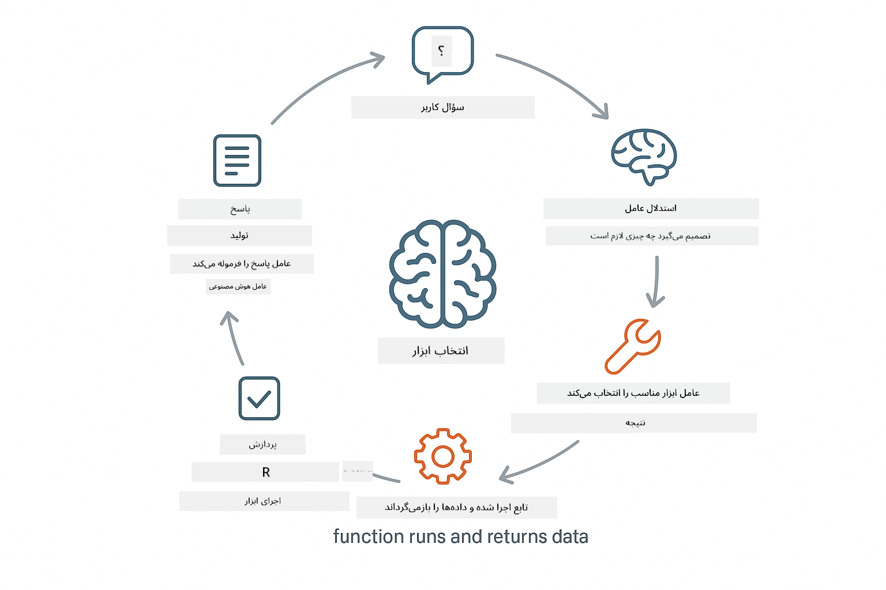
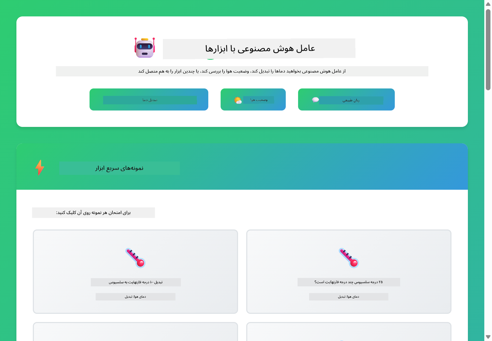

<!--
CO_OP_TRANSLATOR_METADATA:
{
  "original_hash": "aa23f106e7f53270924c9dd39c629004",
  "translation_date": "2025-12-13T18:25:32+00:00",
  "source_file": "04-tools/README.md",
  "language_code": "fa"
}
-->
# ماژول ۰۴: عامل‌های هوش مصنوعی با ابزارها

## فهرست مطالب

- [آنچه خواهید آموخت](../../../04-tools)
- [پیش‌نیازها](../../../04-tools)
- [درک عامل‌های هوش مصنوعی با ابزارها](../../../04-tools)
- [نحوه کار فراخوانی ابزار](../../../04-tools)
  - [تعاریف ابزار](../../../04-tools)
  - [تصمیم‌گیری](../../../04-tools)
  - [اجرا](../../../04-tools)
  - [تولید پاسخ](../../../04-tools)
- [زنجیره‌سازی ابزار](../../../04-tools)
- [اجرای برنامه](../../../04-tools)
- [استفاده از برنامه](../../../04-tools)
  - [آزمایش استفاده ساده از ابزار](../../../04-tools)
  - [آزمایش زنجیره‌سازی ابزار](../../../04-tools)
  - [مشاهده جریان گفتگو](../../../04-tools)
  - [مشاهده استدلال](../../../04-tools)
  - [آزمایش با درخواست‌های مختلف](../../../04-tools)
- [مفاهیم کلیدی](../../../04-tools)
  - [الگوی ReAct (استدلال و عمل)](../../../04-tools)
  - [اهمیت توضیحات ابزار](../../../04-tools)
  - [مدیریت جلسه](../../../04-tools)
  - [مدیریت خطا](../../../04-tools)
- [ابزارهای موجود](../../../04-tools)
- [زمان استفاده از عامل‌های مبتنی بر ابزار](../../../04-tools)
- [گام‌های بعدی](../../../04-tools)

## آنچه خواهید آموخت

تا کنون، یاد گرفته‌اید چگونه با هوش مصنوعی گفتگو کنید، پرامپت‌ها را به‌طور مؤثر ساختاربندی کنید و پاسخ‌ها را بر اساس اسناد خود پایه‌گذاری کنید. اما هنوز یک محدودیت اساسی وجود دارد: مدل‌های زبانی فقط می‌توانند متن تولید کنند. آن‌ها نمی‌توانند وضعیت آب و هوا را بررسی کنند، محاسبات انجام دهند، پایگاه‌های داده را جستجو کنند یا با سیستم‌های خارجی تعامل داشته باشند.

ابزارها این وضعیت را تغییر می‌دهند. با دادن دسترسی به مدل به توابعی که می‌تواند فراخوانی کند، آن را از یک تولیدکننده متن به عاملی تبدیل می‌کنید که می‌تواند اقداماتی انجام دهد. مدل تصمیم می‌گیرد چه زمانی به ابزار نیاز دارد، کدام ابزار را استفاده کند و چه پارامترهایی را ارسال کند. کد شما تابع را اجرا کرده و نتیجه را بازمی‌گرداند. مدل آن نتیجه را در پاسخ خود وارد می‌کند.

## پیش‌نیازها

- تکمیل ماژول ۰۱ (منابع Azure OpenAI مستقر شده)
- فایل `.env` در دایرکتوری ریشه با اعتبارنامه‌های Azure (ایجاد شده توسط `azd up` در ماژول ۰۱)

> **توجه:** اگر ماژول ۰۱ را تکمیل نکرده‌اید، ابتدا دستورالعمل‌های استقرار آن را دنبال کنید.

## درک عامل‌های هوش مصنوعی با ابزارها

یک عامل هوش مصنوعی با ابزارها از الگوی استدلال و عمل (ReAct) پیروی می‌کند:

۱. کاربر سوالی می‌پرسد  
۲. عامل درباره آنچه باید بداند استدلال می‌کند  
۳. عامل تصمیم می‌گیرد آیا برای پاسخ به ابزار نیاز دارد  
۴. اگر بله، عامل ابزار مناسب را با پارامترهای درست فراخوانی می‌کند  
۵. ابزار اجرا شده و داده‌ها را بازمی‌گرداند  
۶. عامل نتیجه را وارد کرده و پاسخ نهایی را ارائه می‌دهد



*الگوی ReAct - چگونه عامل‌های هوش مصنوعی بین استدلال و عمل برای حل مسائل جابجا می‌شوند*

این فرآیند به‌صورت خودکار اتفاق می‌افتد. شما ابزارها و توضیحات آن‌ها را تعریف می‌کنید. مدل تصمیم‌گیری درباره زمان و نحوه استفاده از آن‌ها را بر عهده می‌گیرد.

## نحوه کار فراخوانی ابزار

**تعاریف ابزار** - [WeatherTool.java](../../../04-tools/src/main/java/com/example/langchain4j/agents/tools/WeatherTool.java) | [TemperatureTool.java](../../../04-tools/src/main/java/com/example/langchain4j/agents/tools/TemperatureTool.java)

شما توابعی با توضیحات واضح و مشخصات پارامتر تعریف می‌کنید. مدل این توضیحات را در پرامپت سیستمی خود می‌بیند و می‌فهمد هر ابزار چه کاری انجام می‌دهد.

```java
@Component
public class WeatherTool {
    
    @Tool("Get the current weather for a location")
    public String getCurrentWeather(@P("Location name") String location) {
        // منطق جستجوی آب و هوای شما
        return "Weather in " + location + ": 22°C, cloudy";
    }
}

@AiService
public interface Assistant {
    String chat(@MemoryId String sessionId, @UserMessage String message);
}

// دستیار به طور خودکار توسط Spring Boot متصل شده است با:
// - bean مدل چت
// - همه متدهای @Tool از کلاس‌های @Component
// - ChatMemoryProvider برای مدیریت جلسه
```

> **🤖 با [GitHub Copilot](https://github.com/features/copilot) Chat امتحان کنید:** فایل [`WeatherTool.java`](../../../04-tools/src/main/java/com/example/langchain4j/agents/tools/WeatherTool.java) را باز کنید و بپرسید:  
> - "چگونه می‌توانم یک API واقعی آب و هوا مانند OpenWeatherMap را به جای داده‌های نمونه ادغام کنم؟"  
> - "چه چیزی یک توضیح خوب برای ابزار است که به هوش مصنوعی کمک می‌کند آن را به درستی استفاده کند؟"  
> - "چگونه خطاهای API و محدودیت‌های نرخ را در پیاده‌سازی ابزار مدیریت کنم؟"

**تصمیم‌گیری**

وقتی کاربر می‌پرسد «وضعیت آب و هوا در سیاتل چگونه است؟»، مدل تشخیص می‌دهد که به ابزار آب و هوا نیاز دارد. یک فراخوانی تابع با پارامتر مکان "سیاتل" تولید می‌کند.

**اجرا** - [AgentService.java](../../../04-tools/src/main/java/com/example/langchain4j/agents/service/AgentService.java)

Spring Boot به‌صورت خودکار رابط `@AiService` اعلامی را با تمام ابزارهای ثبت‌شده متصل می‌کند و LangChain4j فراخوانی‌های ابزار را به‌طور خودکار اجرا می‌کند.

> **🤖 با [GitHub Copilot](https://github.com/features/copilot) Chat امتحان کنید:** فایل [`AgentService.java`](../../../04-tools/src/main/java/com/example/langchain4j/agents/service/AgentService.java) را باز کنید و بپرسید:  
> - "الگوی ReAct چگونه کار می‌کند و چرا برای عامل‌های هوش مصنوعی مؤثر است؟"  
> - "عامل چگونه تصمیم می‌گیرد کدام ابزار را استفاده کند و به چه ترتیبی؟"  
> - "اگر اجرای یک ابزار شکست خورد چه اتفاقی می‌افتد - چگونه باید خطاها را به‌طور مقاوم مدیریت کنم؟"

**تولید پاسخ**

مدل داده‌های آب و هوا را دریافت کرده و آن را به پاسخی به زبان طبیعی برای کاربر قالب‌بندی می‌کند.

### چرا از سرویس‌های اعلامی AI استفاده کنیم؟

این ماژول از ادغام LangChain4j با Spring Boot و رابط‌های اعلامی `@AiService` استفاده می‌کند:

- **اتصال خودکار Spring Boot** - مدل چت و ابزارها به‌طور خودکار تزریق می‌شوند  
- **الگوی @MemoryId** - مدیریت حافظه مبتنی بر جلسه به‌صورت خودکار  
- **نمونه واحد** - دستیار یک بار ایجاد شده و برای عملکرد بهتر مجدداً استفاده می‌شود  
- **اجرای نوع‌امن** - متدهای جاوا مستقیماً با تبدیل نوع فراخوانی می‌شوند  
- **هماهنگی چند مرحله‌ای** - زنجیره‌سازی ابزارها را به‌طور خودکار مدیریت می‌کند  
- **بدون کد اضافی** - بدون فراخوانی دستی AiServices.builder() یا حافظه HashMap

رویکردهای جایگزین (مانند `AiServices.builder()` دستی) نیاز به کد بیشتر دارند و مزایای ادغام Spring Boot را ندارند.

## زنجیره‌سازی ابزار

**زنجیره‌سازی ابزار** - هوش مصنوعی ممکن است چندین ابزار را به ترتیب فراخوانی کند. بپرسید «وضعیت آب و هوا در سیاتل چگونه است و آیا باید چتر ببرم؟» و ببینید چگونه `getCurrentWeather` را با استدلال درباره تجهیزات بارانی زنجیره می‌کند.

<a href="images/tool-chaining.png"></a>

*فراخوانی‌های متوالی ابزار - خروجی یک ابزار به تصمیم بعدی می‌رود*

**شکست‌های نرم** - برای آب و هوا در شهری که در داده‌های نمونه نیست بپرسید. ابزار پیام خطا بازمی‌گرداند و هوش مصنوعی توضیح می‌دهد که نمی‌تواند کمک کند. ابزارها به‌صورت ایمن شکست می‌خورند.

این در یک نوبت گفتگو اتفاق می‌افتد. عامل به‌طور خودکار چندین فراخوانی ابزار را هماهنگ می‌کند.

## اجرای برنامه

**تأیید استقرار:**

اطمینان حاصل کنید فایل `.env` در دایرکتوری ریشه با اعتبارنامه‌های Azure وجود دارد (ایجاد شده در ماژول ۰۱):  
```bash
cat ../.env  # باید AZURE_OPENAI_ENDPOINT، API_KEY، DEPLOYMENT را نشان دهد
```
  
**شروع برنامه:**

> **توجه:** اگر قبلاً همه برنامه‌ها را با `./start-all.sh` از ماژول ۰۱ اجرا کرده‌اید، این ماژول در پورت ۸۰۸۴ در حال اجرا است. می‌توانید دستورات شروع زیر را رد کنید و مستقیماً به http://localhost:8084 بروید.

**گزینه ۱: استفاده از داشبورد Spring Boot (توصیه شده برای کاربران VS Code)**

کانتینر توسعه شامل افزونه داشبورد Spring Boot است که رابط بصری برای مدیریت همه برنامه‌های Spring Boot فراهم می‌کند. می‌توانید آن را در نوار فعالیت سمت چپ VS Code (آیکون Spring Boot) پیدا کنید.

از داشبورد Spring Boot می‌توانید:  
- همه برنامه‌های Spring Boot موجود در فضای کاری را ببینید  
- برنامه‌ها را با یک کلیک شروع/توقف کنید  
- لاگ‌های برنامه را به‌صورت زنده مشاهده کنید  
- وضعیت برنامه را نظارت کنید

فقط روی دکمه پخش کنار "tools" کلیک کنید تا این ماژول شروع شود، یا همه ماژول‌ها را همزمان اجرا کنید.


**گزینه ۲: استفاده از اسکریپت‌های شل**

همه برنامه‌های وب (ماژول‌های ۰۱-۰۴) را اجرا کنید:

**Bash:**  
```bash
cd ..  # از دایرکتوری ریشه
./start-all.sh
```
  
**PowerShell:**  
```powershell
cd ..  # از دایرکتوری ریشه
.\start-all.ps1
```
  
یا فقط این ماژول را اجرا کنید:

**Bash:**  
```bash
cd 04-tools
./start.sh
```
  
**PowerShell:**  
```powershell
cd 04-tools
.\start.ps1
```
  
هر دو اسکریپت به‌طور خودکار متغیرهای محیطی را از فایل `.env` ریشه بارگذاری می‌کنند و در صورت عدم وجود، فایل‌های JAR را می‌سازند.

> **توجه:** اگر ترجیح می‌دهید همه ماژول‌ها را به‌صورت دستی بسازید قبل از شروع:  
>  
> **Bash:**  
> ```bash
> cd ..  # Go to root directory
> mvn clean package -DskipTests
> ```
>  
> **PowerShell:**  
> ```powershell
> cd ..  # Go to root directory
> mvn clean package -DskipTests
> ```
  
مرورگر خود را باز کرده و به http://localhost:8084 بروید.

**برای توقف:**

**Bash:**  
```bash
./stop.sh  # فقط این ماژول
# یا
cd .. && ./stop-all.sh  # همه ماژول‌ها
```
  
**PowerShell:**  
```powershell
.\stop.ps1  # فقط این ماژول
# یا
cd ..; .\stop-all.ps1  # همه ماژول‌ها
```
  
## استفاده از برنامه

برنامه یک رابط وب فراهم می‌کند که می‌توانید با عاملی از هوش مصنوعی که به ابزارهای آب و هوا و تبدیل دما دسترسی دارد تعامل کنید.

<a href="images/tools-homepage.png"></a>

*رابط ابزارهای عامل هوش مصنوعی - نمونه‌های سریع و رابط گفتگو برای تعامل با ابزارها*

**آزمایش استفاده ساده از ابزار**

با یک درخواست ساده شروع کنید: «۱۰۰ درجه فارنهایت را به سلسیوس تبدیل کن». عامل تشخیص می‌دهد که به ابزار تبدیل دما نیاز دارد، آن را با پارامترهای درست فراخوانی می‌کند و نتیجه را بازمی‌گرداند. توجه کنید چقدر طبیعی است - شما مشخص نکردید کدام ابزار را استفاده کند یا چگونه آن را فراخوانی کند.

**آزمایش زنجیره‌سازی ابزار**

حالا چیزی پیچیده‌تر امتحان کنید: «وضعیت آب و هوا در سیاتل چگونه است و آن را به فارنهایت تبدیل کن؟» ببینید عامل چگونه این کار را مرحله به مرحله انجام می‌دهد. ابتدا آب و هوا را می‌گیرد (که به سلسیوس است)، تشخیص می‌دهد باید به فارنهایت تبدیل کند، ابزار تبدیل را فراخوانی می‌کند و هر دو نتیجه را در یک پاسخ ترکیب می‌کند.

**مشاهده جریان گفتگو**

رابط گفتگو تاریخچه مکالمه را حفظ می‌کند و به شما امکان تعامل چند مرحله‌ای می‌دهد. می‌توانید همه پرسش‌ها و پاسخ‌های قبلی را ببینید که پیگیری گفتگو و درک نحوه ساخت زمینه توسط عامل را آسان می‌کند.

<a href="images/tools-conversation-demo.png"></a>

*گفتگوی چند مرحله‌ای که تبدیل‌های ساده، جستجوی آب و هوا و زنجیره‌سازی ابزار را نشان می‌دهد*

**آزمایش با درخواست‌های مختلف**

ترکیب‌های مختلف را امتحان کنید:  
- جستجوی آب و هوا: «وضعیت آب و هوا در توکیو چگونه است؟»  
- تبدیل دما: «۲۵ درجه سلسیوس چند کلوین است؟»  
- پرسش‌های ترکیبی: «آب و هوا در پاریس را بررسی کن و بگو آیا بالای ۲۰ درجه سلسیوس است»

توجه کنید چگونه عامل زبان طبیعی را تفسیر کرده و آن را به فراخوانی‌های مناسب ابزار نگاشت می‌کند.

## مفاهیم کلیدی

**الگوی ReAct (استدلال و عمل)**

عامل بین استدلال (تصمیم‌گیری درباره کار) و عمل (استفاده از ابزارها) جابجا می‌شود. این الگو امکان حل خودکار مسئله را به جای فقط پاسخ به دستورها فراهم می‌کند.

**اهمیت توضیحات ابزار**

کیفیت توضیحات ابزار شما مستقیماً بر نحوه استفاده مؤثر عامل از آن‌ها تأثیر می‌گذارد. توضیحات واضح و مشخص به مدل کمک می‌کند بفهمد چه زمانی و چگونه هر ابزار را فراخوانی کند.

**مدیریت جلسه**

حاشیه‌نویسی `@MemoryId` مدیریت حافظه مبتنی بر جلسه را به‌صورت خودکار فعال می‌کند. هر شناسه جلسه یک نمونه `ChatMemory` مخصوص به خود دارد که توسط bean `ChatMemoryProvider` مدیریت می‌شود و نیاز به پیگیری حافظه دستی را حذف می‌کند.

**مدیریت خطا**

ابزارها ممکن است شکست بخورند - APIها تایم‌اوت کنند، پارامترها نامعتبر باشند، سرویس‌های خارجی از کار بیفتند. عامل‌های تولیدی نیاز به مدیریت خطا دارند تا مدل بتواند مشکلات را توضیح دهد یا جایگزین‌ها را امتحان کند.

## ابزارهای موجود

**ابزارهای آب و هوا** (داده‌های نمونه برای نمایش):  
- دریافت وضعیت فعلی آب و هوا برای یک مکان  
- دریافت پیش‌بینی چند روزه

**ابزارهای تبدیل دما:**  
- سلسیوس به فارنهایت  
- فارنهایت به سلسیوس  
- سلسیوس به کلوین  
- کلوین به سلسیوس  
- فارنهایت به کلوین  
- کلوین به فارنهایت

این‌ها نمونه‌های ساده‌ای هستند، اما الگو به هر تابعی گسترش می‌یابد: پرس‌وجوهای پایگاه داده، فراخوانی API، محاسبات، عملیات فایل یا دستورات سیستمی.

## زمان استفاده از عامل‌های مبتنی بر ابزار

**از ابزارها استفاده کنید وقتی:**  
- پاسخ نیاز به داده‌های زمان واقعی دارد (آب و هوا، قیمت سهام، موجودی)  
- نیاز به انجام محاسبات فراتر از ریاضیات ساده دارید  
- دسترسی به پایگاه‌های داده یا APIها لازم است  
- اقداماتی مانند ارسال ایمیل، ایجاد تیکت، به‌روزرسانی رکوردها انجام می‌دهید  
- ترکیب چند منبع داده

**از ابزارها استفاده نکنید وقتی:**  
- سوالات را می‌توان از دانش عمومی پاسخ داد  
- پاسخ صرفاً گفتگویی است  
- تأخیر ابزار تجربه کاربری را بسیار کند می‌کند

## گام‌های بعدی

**ماژول بعدی:** [05-mcp - پروتکل زمینه مدل (MCP)](../05-mcp/README.md)

---

**ناوبری:** [← قبلی: ماژول ۰۳ - RAG](../03-rag/README.md) | [بازگشت به اصلی](../README.md) | [بعدی: ماژول ۰۵ - MCP →](../05-mcp/README.md)

---

<!-- CO-OP TRANSLATOR DISCLAIMER START -->
**سلب مسئولیت**:  
این سند با استفاده از سرویس ترجمه هوش مصنوعی [Co-op Translator](https://github.com/Azure/co-op-translator) ترجمه شده است. در حالی که ما در تلاش برای دقت هستیم، لطفاً توجه داشته باشید که ترجمه‌های خودکار ممکن است حاوی خطاها یا نواقصی باشند. سند اصلی به زبان بومی خود باید به عنوان منبع معتبر در نظر گرفته شود. برای اطلاعات حیاتی، ترجمه حرفه‌ای انسانی توصیه می‌شود. ما مسئول هیچ گونه سوءتفاهم یا تفسیر نادرستی که از استفاده این ترجمه ناشی شود، نیستیم.
<!-- CO-OP TRANSLATOR DISCLAIMER END -->