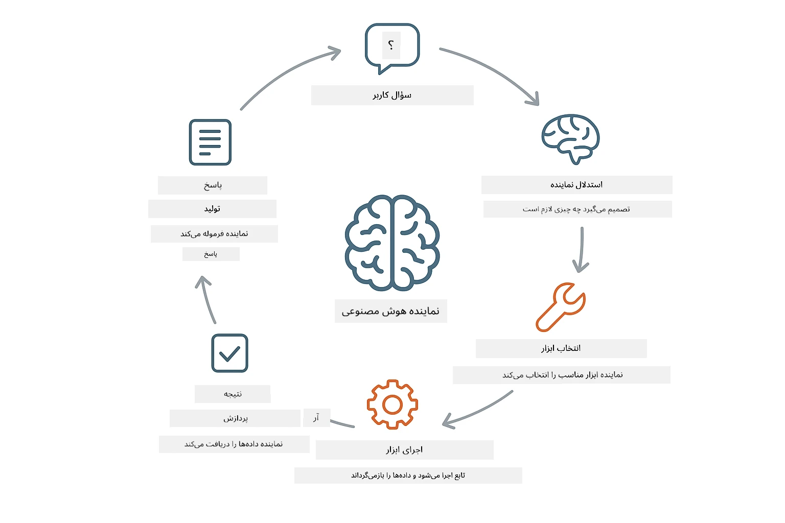
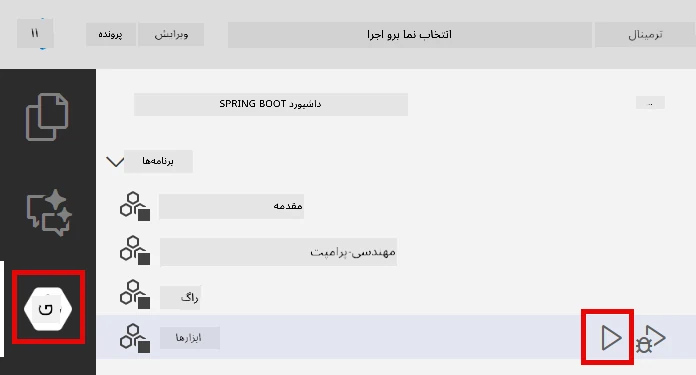
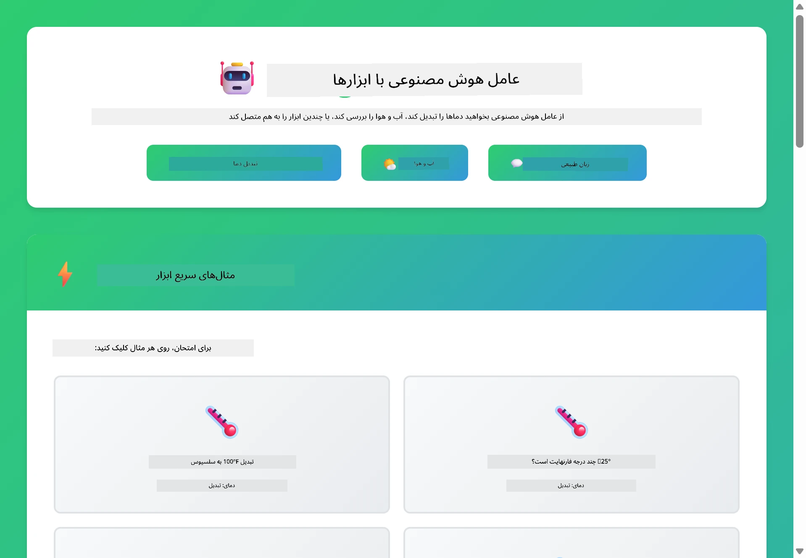

<!--
CO_OP_TRANSLATOR_METADATA:
{
  "original_hash": "844788938b26242f3cc54ce0d0951bea",
  "translation_date": "2026-01-05T21:44:10+00:00",
  "source_file": "04-tools/README.md",
  "language_code": "fa"
}
-->
# ماژول ۰۴: عامل‌های هوش مصنوعی با ابزارها

## فهرست مطالب

- [آنچه یاد خواهید گرفت](../../../04-tools)
- [پیش‌نیازها](../../../04-tools)
- [درک عامل‌های هوش مصنوعی با ابزارها](../../../04-tools)
- [چگونه فراخوانی ابزار کار می‌کند](../../../04-tools)
  - [تعاریف ابزار](../../../04-tools)
  - [تصمیم‌گیری](../../../04-tools)
  - [اجرا](../../../04-tools)
  - [تولید پاسخ](../../../04-tools)
- [زنجیره‌سازی ابزار](../../../04-tools)
- [اجرای برنامه](../../../04-tools)
- [استفاده از برنامه](../../../04-tools)
  - [آزمایش استفاده ساده از ابزار](../../../04-tools)
  - [آزمایش زنجیره‌سازی ابزار](../../../04-tools)
  - [مشاهده جریان گفتگو](../../../04-tools)
  - [آزمایش با درخواست‌های مختلف](../../../04-tools)
- [مفاهیم کلیدی](../../../04-tools)
  - [الگوی ReAct (استدلال و عمل)](../../../04-tools)
  - [توضیحات ابزار مهم است](../../../04-tools)
  - [مدیریت جلسه](../../../04-tools)
  - [رسیدگی به خطا](../../../04-tools)
- [ابزارهای موجود](../../../04-tools)
- [چه زمانی از عامل‌های مبتنی بر ابزار استفاده کنیم](../../../04-tools)
- [گام‌های بعدی](../../../04-tools)

## آنچه یاد خواهید گرفت

تا کنون آموخته‌اید چگونه با هوش مصنوعی گفتگو کنید، پرامپت‌ها را به‌طور مؤثر ساختاربندی کنید و پاسخ‌ها را در اسناد خود تعبیه کنید. اما محدودیت بنیادین هنوز وجود دارد: مدل‌های زبانی فقط می‌توانند متن تولید کنند. آن‌ها نمی‌توانند آب و هوا را بررسی کنند، محاسبات انجام دهند، پایگاه‌های داده را پرس‌وجو کنند یا با سیستم‌های خارجی تعامل داشته باشند.

ابزارها این محدودیت را تغییر می‌دهند. با دادن دسترسی به مدل به توابعی که می‌تواند فراخوانی کند، آن را از یک تولیدکننده متن به عاملی تبدیل می‌کنید که قادر به انجام اقدامات است. مدل تصمیم می‌گیرد چه زمانی به ابزار نیاز دارد، کدام ابزار را استفاده کند و چه پارامترهایی ارسال شود. کد شما تابع را اجرا کرده و نتیجه را باز می‌گرداند. مدل آن نتیجه را در پاسخ خود جای می‌دهد.

## پیش‌نیازها

- اتمام ماژول ۰۱ (منابع Azure OpenAI مستقر شده‌اند)
- فایل `.env` در دایرکتوری ریشه با اعتبارنامه‌های Azure (ایجاد شده توسط `azd up` در ماژول ۰۱)

> **توجه:** اگر ماژول ۰۱ را کامل نکرده‌اید، ابتدا دستورالعمل‌های استقرار آنجا را دنبال کنید.

## درک عامل‌های هوش مصنوعی با ابزارها

> **📝 توجه:** اصطلاح "عامل‌ها" در این ماژول به دستیارهای هوش مصنوعی اشاره دارد که با قابلیت فراخوانی ابزار افزوده شده‌اند. این با الگوهای **Agentic AI** (عامل‌های خودران با برنامه‌ریزی، حافظه و استدلال چندمرحله‌ای) که در [ماژول ۰۵: MCP](../05-mcp/README.md) بررسی خواهیم کرد، متفاوت است.

یک عامل هوش مصنوعی با ابزارها از الگوی استدلال و عمل (ReAct) پیروی می‌کند:

1. کاربر سوال می‌پرسد  
2. عامل درباره آنچه باید بداند استدلال می‌کند  
3. عامل تصمیم می‌گیرد آیا برای پاسخ نیاز به ابزار دارد  
4. اگر بله، عامل با پارامترهای مناسب، ابزار مربوطه را فراخوانی می‌کند  
5. ابزار اجرا شده و داده برمی‌گرداند  
6. عامل نتیجه را در پاسخ نهایی جای می‌دهد



*الگوی ReAct - چگونه عامل‌های هوش مصنوعی بین استدلال و عمل برای حل مسائل جابجا می‌شوند*

این فرآیند به‌صورت خودکار اتفاق می‌افتد. شما ابزارها و توضیحاتشان را تعریف می‌کنید. مدل مسئول تصمیم‌گیری درباره زمان و نحوه استفاده از آن‌ها است.

## چگونه فراخوانی ابزار کار می‌کند

### تعاریف ابزار

[WeatherTool.java](../../../04-tools/src/main/java/com/example/langchain4j/agents/tools/WeatherTool.java) | [TemperatureTool.java](../../../04-tools/src/main/java/com/example/langchain4j/agents/tools/TemperatureTool.java)

توابعی با توضیحات واضح و مشخصات پارامتر تعریف می‌کنید. مدل این توضیحات را در پرامپت سیستم می‌بیند و درک می‌کند هر ابزار چه کاری انجام می‌دهد.

```java
@Component
public class WeatherTool {
    
    @Tool("Get the current weather for a location")
    public String getCurrentWeather(@P("Location name") String location) {
        // منطق جستجوی وضعیت هوا
        return "Weather in " + location + ": 22°C, cloudy";
    }
}

@AiService
public interface Assistant {
    String chat(@MemoryId String sessionId, @UserMessage String message);
}

// دستیار به طور خودکار توسط Spring Boot متصل شده است با:
// - بین ChatModel
// - همه متدهای @Tool از کلاس‌های @Component
// - ChatMemoryProvider برای مدیریت جلسه
```

> **🤖 با گفتگوی [GitHub Copilot](https://github.com/features/copilot) امتحان کنید:** فایل [`WeatherTool.java`](../../../04-tools/src/main/java/com/example/langchain4j/agents/tools/WeatherTool.java) را باز کرده و بپرسید:
> - "چگونه می‌توانم به جای داده‌های نمونه از API واقعی آب و هوا مثل OpenWeatherMap استفاده کنم؟"
> - "توضیح خوب برای یک ابزار چیست که کمک کند هوش مصنوعی به درستی از آن استفاده کند؟"
> - "چگونه خطاهای API و محدودیت نرخ را در پیاده‌سازی ابزار مدیریت کنم؟"

### تصمیم‌گیری

وقتی کاربر می‌پرسد "هوای سیاتل چگونه است؟"، مدل تشخیص می‌دهد به ابزار آب و هوا نیاز دارد. یک فراخوانی تابع با پارامتر مکان "Seattle" تولید می‌کند.

### اجرا

[AgentService.java](../../../04-tools/src/main/java/com/example/langchain4j/agents/service/AgentService.java)

اسپرینگ بوت به صورت خودکار رابط `@AiService` اعلامی را با تمام ابزارهای ثبت‌شده متصل می‌کند و LangChain4j فراخوانی ابزارها را به‌طور خودکار اجرا می‌کند.

> **🤖 با گفتگوی [GitHub Copilot](https://github.com/features/copilot) امتحان کنید:** فایل [`AgentService.java`](../../../04-tools/src/main/java/com/example/langchain4j/agents/service/AgentService.java) را باز کرده و بپرسید:
> - "الگوی ReAct چگونه کار می‌کند و چرا برای عامل‌های هوش مصنوعی مؤثر است؟"
> - "عامل چگونه تصمیم می‌گیرد کدام ابزار را استفاده کند و به چه ترتیبی؟"
> - "اگر اجرای یک ابزار شکست خورد چه می‌شود - چگونه باید به خطاها به شکل مقاومی رسیدگی کنم؟"

### تولید پاسخ

مدل داده‌های آب و هوا را دریافت کرده و آن را به قالب پاسخ طبیعی زبان تبدیل می‌کند تا به کاربر ارائه دهد.

### چرا از سرویس‌های هوش مصنوعی اعلامی استفاده کنیم؟

این ماژول از ادغام LangChain4j با اسپرینگ بوت با رابط‌های اعلامی `@AiService` استفاده می‌کند:

- **اتصال خودکار اسپرینگ بوت** - ChatModel و ابزارها به‌طور خودکار تزریق می‌شوند  
- **الگوی @MemoryId** - مدیریت حافظه مبتنی بر جلسه به‌صورت خودکار  
- **یک نمونه واحد** - دستیار یکبار ایجاد شده و برای عملکرد بهتر استفاده می‌شود  
- **اجرای نوع‌امن** - متدهای جاوا مستقیماً با تبدیل نوع فراخوانی می‌شوند  
- **هماهنگی چندمرحله‌ای** - زنجیره‌سازی ابزارها را به‌طور خودکار کنترل می‌کند  
- **بدون کد اضافی** - نیاز به فراخوانی دستی AiServices.builder() یا حافظه هش‌مپ نیست

روش‌های جایگزین (مانند استفاده دستی از AiServices.builder()) نیاز به کد بیشتر دارد و مزایای ادغام با اسپرینگ بوت را از دست می‌دهد.

## زنجیره‌سازی ابزار

**زنجیره‌سازی ابزار** - ممکن است هوش مصنوعی چند ابزار را پشت سر هم فراخوانی کند. بپرسید "هوای سیاتل چگونه است و آیا باید چتری همراه داشته باشم؟" و ببینید چگونه `getCurrentWeather` را با استدلال درباره تجهیزات بارانی زنجیره می‌کند.

<a href="images/tool-chaining.png"></a>

*فراخوانی‌های متوالی ابزار - خروجی یک ابزار وارد تصمیم بعدی می‌شود*

**شکست‌های شیک** - برای آب و هوا در شهری که داده نمونه ندارد درخواست کنید. ابزار پیام خطایی برمی‌گرداند و هوش مصنوعی توضیح می‌دهد که نمی‌تواند کمک کند. ابزارها به صورت ایمن شکست می‌خورند.

این در یک مرحله مکالمه اتفاق می‌افتد. عامل به طور خودکار چند فراخوانی ابزار را هماهنگ می‌کند.

## اجرای برنامه

**تأیید استقرار:**

اطمینان حاصل کنید فایل `.env` در دایرکتوری ریشه با اعتبارنامه‌های Azure وجود دارد (ایجاد شده در ماژول ۰۱):  
```bash
cat ../.env  # باید AZURE_OPENAI_ENDPOINT، API_KEY، DEPLOYMENT را نشان دهد
```
  
**شروع برنامه:**

> **توجه:** اگر قبلاً همه برنامه‌ها را با `./start-all.sh` از ماژول ۰۱ اجرا کرده‌اید، این ماژول هم‌اکنون روی پورت 8084 اجرا می‌شود. می‌توانید دستورات شروع زیر را نادیده گرفته و مستقیماً به http://localhost:8084 بروید.

**گزینه ۱: استفاده از داشبورد Spring Boot (توصیه شده برای کاربران VS Code)**

کانتینر توسعه شامل افزونه داشبورد Spring Boot است که یک رابط تصویری برای مدیریت همه برنامه‌های Spring Boot ارائه می‌دهد. می‌توانید آن را در نوار فعالیت در سمت چپ VS Code (آیکون Spring Boot) پیدا کنید.

از داشبورد Spring Boot می‌توانید:  
- همه برنامه‌های Spring Boot موجود در فضای کاری را ببینید  
- با یک کلیک برنامه‌ها را شروع/متوقف کنید  
- لاگ‌های برنامه را به‌صورت زنده مشاهده کنید  
- وضعیت برنامه را نظارت کنید  

فقط روی دکمه پخش کنار "tools" کلیک کنید تا این ماژول شروع شود، یا همه ماژول‌ها را هم‌زمان اجرا کنید.



**گزینه ۲: استفاده از اسکریپت‌های پوسته**

اجرای همه برنامه‌های وب (ماژول‌های ۰۱ تا ۰۴):

**باش:**  
```bash
cd ..  # از دایرکتوری ریشه
./start-all.sh
```
  
**پاورشل:**  
```powershell
cd ..  # از دایرکتوری ریشه
.\start-all.ps1
```
  
یا فقط همین ماژول را اجرا کنید:

**باش:**  
```bash
cd 04-tools
./start.sh
```
  
**پاورشل:**  
```powershell
cd 04-tools
.\start.ps1
```
  
هر دو اسکریپت به‌طور خودکار متغیرهای محیطی فایل `.env` ریشه را بارگذاری می‌کنند و در صورت عدم وجود، JARها را می‌سازند.

> **توجه:** اگر ترجیح می‌دهید قبل از شروع همه ماژول‌ها را به‌صورت دستی بسازید:  
>  
> **باش:**  
> ```bash
> cd ..  # Go to root directory
> mvn clean package -DskipTests
> ```
>  
> **پاورشل:**  
> ```powershell
> cd ..  # Go to root directory
> mvn clean package -DskipTests
> ```
  
مرورگر خود را به http://localhost:8084 باز کنید.

**برای توقف برنامه:**

**باش:**  
```bash
./stop.sh  # فقط این ماژول
# یا
cd .. && ./stop-all.sh  # همه ماژول‌ها
```
  
**پاورشل:**  
```powershell
.\stop.ps1  # فقط این ماژول
# یا
cd ..; .\stop-all.ps1  # همه ماژول‌ها
```


## استفاده از برنامه

برنامه یک رابط وب فراهم می‌کند که می‌توانید با یک عامل هوش مصنوعی که به ابزارهای آب و هوا و تبدیل دما دسترسی دارد، تعامل کنید.

<a href="images/tools-homepage.png"></a>

*رابط ابزارهای عامل هوش مصنوعی - مثال‌های سریع و رابط گفتگو برای تعامل با ابزارها*

### آزمایش استفاده ساده از ابزار

با درخواست ساده شروع کنید: "تبدیل ۱۰۰ درجه فارنهایت به سلسیوس". عامل تشخیص می‌دهد به ابزار تبدیل دما نیاز دارد، آن را با پارامترهای درست فراخوانی می‌کند و نتیجه را بازمی‌گرداند. توجه کنید چقدر طبیعی است - شما مشخص نکردید کدام ابزار را استفاده کند یا چگونه آن را فراخوانی کند.

### آزمایش زنجیره‌سازی ابزار

حالا چیزی پیچیده‌تر امتحان کنید: "هوای سیاتل چگونه است و آن را به فارنهایت تبدیل کن؟" ببینید عامل چگونه مرحله به مرحله پیش می‌رود. اول هوا را می‌گیرد (که برمی‌گرداند به سلسیوس)، تشخیص می‌دهد باید تبدیل به فارنهایت شود، ابزار تبدیل را فراخوانی می‌کند و هر دو نتیجه را در یک پاسخ ترکیب می‌کند.

### مشاهده جریان گفتگو

رابط گفتگو تاریخچه مکالمه را حفظ می‌کند تا تعامل چندمرحله‌ای داشته باشید. می‌توانید همه پرسش‌ها و پاسخ‌های قبلی را ببینید و به راحتی جریان گفتگو را دنبال کنید و درک کنید چگونه عامل زمینه را از تبادل‌های مختلف می‌سازد.

<a href="images/tools-conversation-demo.png"></a>

*گفتگوی چندمرحله‌ای نمایشگر تبدیل‌های ساده، جستجوی آب و هوا و زنجیره‌سازی ابزار*

### آزمایش با درخواست‌های مختلف

ترکیب‌های مختلف را امتحان کنید:  
- جستجوی آب و هوا: "هوای توکیو چگونه است؟"  
- تبدیل دما: "۲۵ درجه سلسیوس چند کلوین است؟"  
- پرسش‌های ترکیبی: "آب و هوای پاریس را بررسی کن و بگو آیا بالای ۲۰ درجه سلسیوس است"  

توجه کنید عامل چگونه زبان طبیعی را تفسیر کرده و به فراخوانی ابزار مناسب نگاشت می‌کند.

## مفاهیم کلیدی

### الگوی ReAct (استدلال و عمل)

عامل بین استدلال (تصمیم‌گیری درباره کاری که باید انجام شود) و عمل (استفاده از ابزارها) جابجا می‌شود. این الگو امکان حل مسئله خودگردان را فراهم می‌کند و فراتر از پاسخ صرف به دستورالعمل‌هاست.

### توضیحات ابزار مهم است

کیفیت توضیحات ابزار به طور مستقیم بر نحوه استفاده مؤثر عامل از آن‌ها تأثیر می‌گذارد. توضیحات واضح و دقیق به مدل کمک می‌کند بدانید چه زمانی و چگونه باید هر ابزار را فراخوانی کند.

### مدیریت جلسه

حاشیه‌نویسی `@MemoryId` مدیریت حافظه مبتنی بر جلسه را به‌صورت خودکار فعال می‌کند. هر شناسه جلسه یک نمونه `ChatMemory` خاص را که توسط bean`ChatMemoryProvider` مدیریت می‌شود، دریافت می‌کند و نیاز به پیگیری حافظه دستی را حذف می‌کند.

### رسیدگی به خطا

ابزارها ممکن است شکست بخورند - APIها ممکن است زمان‌بر شوند، پارامترها نامعتبر باشند، خدمات خارجی قطع شوند. عوامل تولیدی به مدیریت خطا نیاز دارند تا مدل بتواند مشکلات را توضیح دهد یا گزینه‌های جایگزین را امتحان کند.

## ابزارهای موجود

**ابزارهای هواشناسی** (داده‌های نمونه برای نمایش):  
- دریافت وضعیت آب و هوای فعلی برای یک مکان  
- دریافت پیش‌بینی چندروزه  

**ابزارهای تبدیل دما**:  
- سلسیوس به فارنهایت  
- فارنهایت به سلسیوس  
- سلسیوس به کلوین  
- کلوین به سلسیوس  
- فارنهایت به کلوین  
- کلوین به فارنهایت  

این‌ها مثال‌های ساده‌ای هستند، اما الگو برای هر تابعی قابل تعمیم است: پرس‌وجوی پایگاه داده، فراخوانی API، محاسبات، عملیات فایل یا فرمان‌های سیستمی.

## چه زمانی از عامل‌های مبتنی بر ابزار استفاده کنیم

**از ابزار زمانی استفاده کنید که:**  
- پاسخ به داده‌های زمان واقعی نیاز دارد (آب و هوا، قیمت سهام، موجودی کالا)  
- نیاز به انجام محاسبات فراتر از ریاضیات ساده وجود دارد  
- دسترسی به پایگاه داده‌ها یا APIها  
- انجام اقدامات (ارسال ایمیل، ایجاد بلیط، به‌روزرسانی سوابق)  
- ترکیب داده از منابع مختلف  

**از ابزار زمانی استفاده نکنید که:**  
- سوالات را می‌توان با دانش عمومی پاسخ داد  
- پاسخ صرفاً گفتگومحور است  
- تأخیر ابزار تجربه کاربری را کند می‌کند  

## گام‌های بعدی

**ماژول بعدی:** [05-mcp - پروتکل زمینه مدل (MCP)](../05-mcp/README.md)

---

**راهبری:** [← قبلی: ماژول ۰۳ - RAG](../03-rag/README.md) | [بازگشت به اصلی](../README.md) | [بعدی: ماژول ۰۵ - MCP →](../05-mcp/README.md)

---

<!-- CO-OP TRANSLATOR DISCLAIMER START -->
**سلب مسئولیت**:  
این سند با استفاده از سرویس ترجمه ماشینی [Co-op Translator](https://github.com/Azure/co-op-translator) ترجمه شده است. در حالی که ما در تلاش برای دقت هستیم، لطفاً به این نکته توجه داشته باشید که ترجمه‌های خودکار ممکن است حاوی خطاها یا نواقصی باشند. سند اصلی به زبان بومی خود باید به عنوان منبع معتبر در نظر گرفته شود. برای اطلاعات حیاتی، توصیه می‌شود از ترجمه حرفه‌ای انسانی استفاده کنید. ما مسئول هیچ گونه سوءتفاهم یا برداشت نادرستی که از استفاده این ترجمه ناشی شود، نخواهیم بود.
<!-- CO-OP TRANSLATOR DISCLAIMER END -->