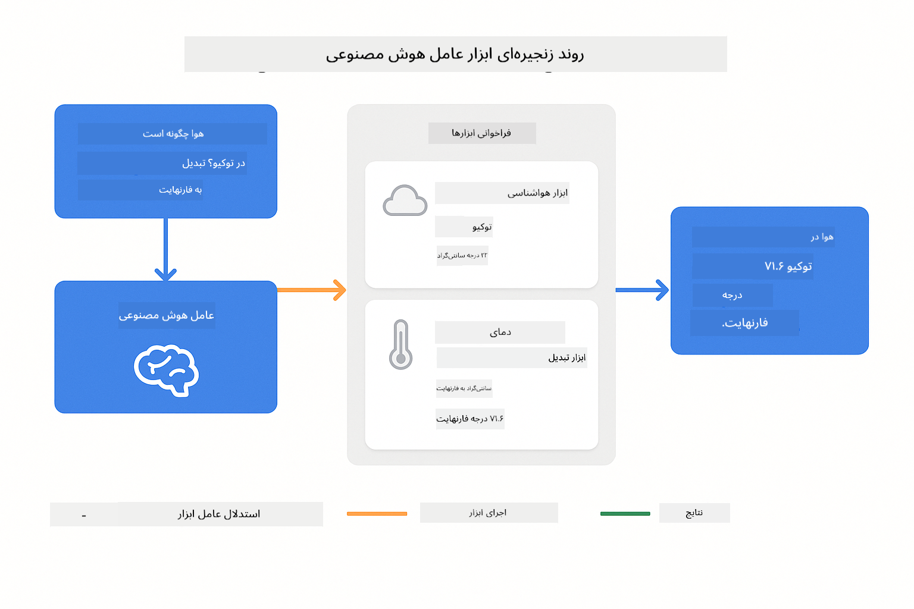
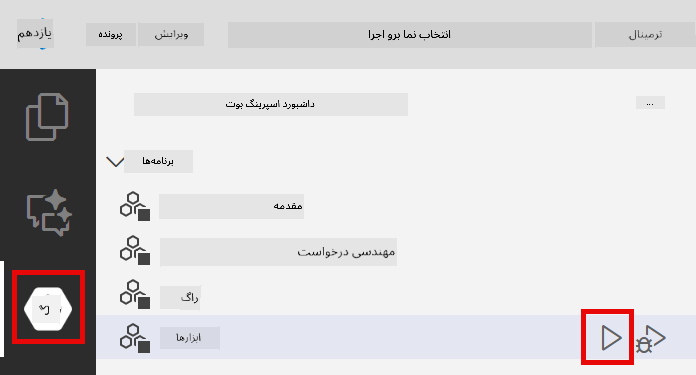
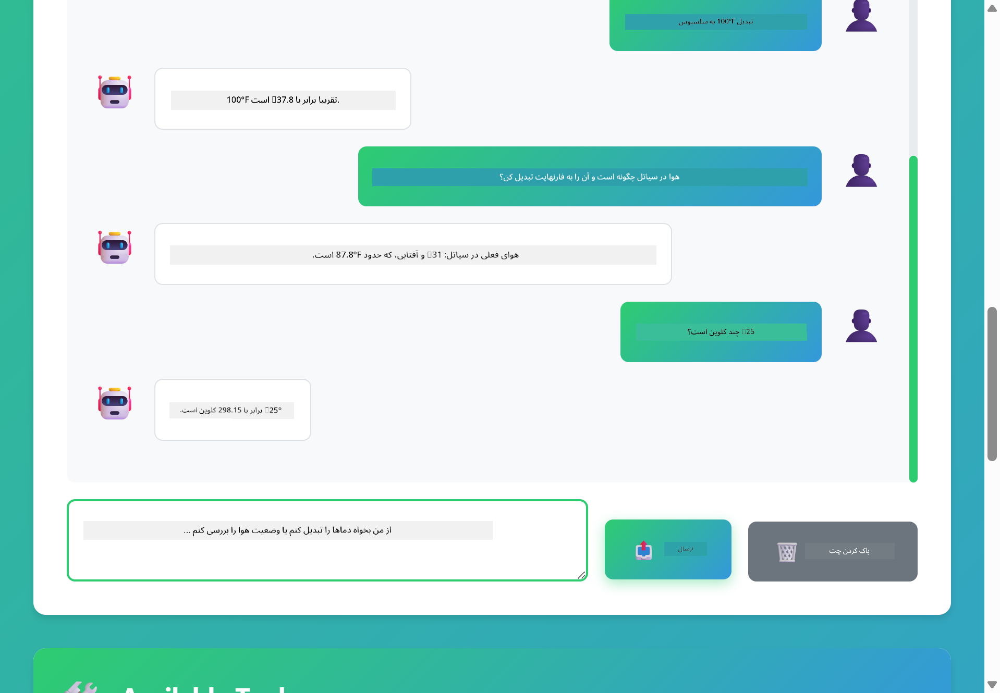

<!--
CO_OP_TRANSLATOR_METADATA:
{
  "original_hash": "13ec450c12cdd1a863baa2b778f27cd7",
  "translation_date": "2025-12-30T20:32:40+00:00",
  "source_file": "04-tools/README.md",
  "language_code": "fa"
}
-->
# ماژول 04: عامل‌های هوش مصنوعی با ابزارها

## فهرست مطالب

- [آنچه خواهید آموخت](../../../04-tools)
- [پیش‌نیازها](../../../04-tools)
- [درک عامل‌های هوش مصنوعی با ابزارها](../../../04-tools)
- [نحوهٔ کار فراخوانی ابزارها](../../../04-tools)
  - [تعاریف ابزار](../../../04-tools)
  - [تصمیم‌گیری](../../../04-tools)
  - [اجرا](../../../04-tools)
  - [تولید پاسخ](../../../04-tools)
- [زنجیره‌سازی ابزارها](../../../04-tools)
- [اجرای برنامه](../../../04-tools)
- [استفاده از برنامه](../../../04-tools)
  - [آزمایش استفادهٔ ساده از ابزار](../../../04-tools)
  - [آزمون زنجیره‌سازی ابزارها](../../../04-tools)
  - [دیدن جریان مکالمه](../../../04-tools)
  - [مشاهدهٔ استدلال](../../../04-tools)
  - [آزمایش با درخواست‌های مختلف](../../../04-tools)
- [مفاهیم کلیدی](../../../04-tools)
  - [الگوی ReAct (استدلال و عمل)](../../../04-tools)
  - [توصیف ابزارها مهم است](../../../04-tools)
  - [مدیریت جلسه](../../../04-tools)
  - [مدیریت خطا](../../../04-tools)
- [ابزارهای در دسترس](../../../04-tools)
- [چه زمانی از عامل‌های مبتنی بر ابزار استفاده کنیم](../../../04-tools)
- [گام‌های بعدی](../../../04-tools)

## آنچه خواهید آموخت

تا کنون آموخته‌اید چگونه با هوش مصنوعی گفتگو کنید، پرامپت‌ها را مؤثر ساختار دهید و پاسخ‌ها را در اسناد خود پایه‌گذاری کنید. اما هنوز یک محدودیت اساسی وجود دارد: مدل‌های زبانی فقط قادر به تولید متن هستند. آن‌ها نمی‌توانند وضعیت هوا را بررسی کنند، محاسبات انجام دهند، به پایگاه‌داده‌ها پرس‌وجو بزنند یا با سیستم‌های خارجی تعامل کنند.

ابزارها این وضعیت را تغییر می‌دهند. با دادن دسترسی به توابعی که مدل می‌تواند فراخوانی کند، آن را از یک تولیدکنندهٔ متن به عاملی تبدیل می‌کنید که می‌تواند اقدام کند. مدل تصمیم می‌گیرد چه زمانی به ابزار نیاز دارد، کدام ابزار را استفاده کند و چه پارامترهایی ارسال کند. کد شما تابع را اجرا کرده و نتیجه را بازمی‌گرداند. مدل آن نتیجه را در پاسخ خود وارد می‌کند.

## پیش‌نیازها

- اتمام ماژول 01 (منابع Azure OpenAI مستقر شده)
- فایل `.env` در دایرکتوری ریشه با اطلاعات ورود Azure (ایجاد شده توسط `azd up` در ماژول 01)

> **نکته:** اگر ماژول 01 را تکمیل نکرده‌اید، ابتدا دستورالعمل‌های استقرار آن را دنبال کنید.

## درک عامل‌های هوش مصنوعی با ابزارها

> **📝 توجه:** اصطلاح «عامل‌ها» در این ماژول به دستیارهای هوش مصنوعی اشاره دارد که با قابلیت فراخوانی ابزارها تقویت شده‌اند. این با الگوهای **Agentic AI** (عامل‌های خودمختار با برنامه‌ریزی، حافظه و استدلال چندمرحله‌ای) متفاوت است که در [ماژول 05: MCP](../05-mcp/README.md) پوشش خواهیم داد.

یک عامل هوش مصنوعی با ابزارها از الگوی استدلال و عمل (ReAct) پیروی می‌کند:

1. کاربر سوالی می‌پرسد
2. عامل دربارهٔ آنچه باید بداند استدلال می‌کند
3. عامل تصمیم می‌گیرد آیا برای پاسخ به ابزار نیاز دارد
4. اگر بله، عامل ابزار مناسب را با پارامترهای درست فراخوانی می‌کند
5. ابزار اجرا شده و داده‌ها را بازمی‌گرداند
6. عامل نتیجه را وارد کرده و پاسخ نهایی را ارائه می‌دهد


*الگوی ReAct - چگونگی تناوب بین استدلال و عمل توسط عامل‌های هوش مصنوعی برای حل مسائل*

این فرآیند به‌صورت خودکار رخ می‌دهد. شما ابزارها و توضیحات آن‌ها را تعریف می‌کنید. مدل تصمیم‌گیری دربارهٔ زمان و نحوهٔ استفاده از آن‌ها را بر عهده می‌گیرد.

## نحوهٔ کار فراخوانی ابزارها

**تعاریف ابزار** - [WeatherTool.java](../../../04-tools/src/main/java/com/example/langchain4j/agents/tools/WeatherTool.java) | [TemperatureTool.java](../../../04-tools/src/main/java/com/example/langchain4j/agents/tools/TemperatureTool.java)

شما توابعی با توضیحات واضح و مشخصات پارامتر تعریف می‌کنید. مدل این توضیحات را در پرامپت سیستم می‌بیند و متوجه می‌شود هر ابزار چه کاری انجام می‌دهد.

```java
@Component
public class WeatherTool {
    
    @Tool("Get the current weather for a location")
    public String getCurrentWeather(@P("Location name") String location) {
        // منطق جستجوی وضعیت آب‌و‌هوا شما
        return "Weather in " + location + ": 22°C, cloudy";
    }
}

@AiService
public interface Assistant {
    String chat(@MemoryId String sessionId, @UserMessage String message);
}

// دستیار به‌صورت خودکار توسط Spring Boot با موارد زیر پیکربندی شده است:
// - Bean از نوع ChatModel
// - همهٔ متدهای @Tool از کلاس‌های @Component
// - ChatMemoryProvider برای مدیریت نشست
```

> **🤖 امتحان کنید با [GitHub Copilot](https://github.com/features/copilot) Chat:** فایل [`WeatherTool.java`](../../../04-tools/src/main/java/com/example/langchain4j/agents/tools/WeatherTool.java) را باز کنید و بپرسید:
> - "چگونه یک API واقعی هوا مثل OpenWeatherMap را به‌جای داده‌های نمونه ادغام کنم؟"
> - "چه ویژگی‌هایی یک توضیف ابزار خوب را تشکیل می‌دهند که به هوش مصنوعی کمک کند آن را به‌درستی استفاده کند؟"
> - "چگونه خطاهای API و محدودیت‌های نرخ را در پیاده‌سازی ابزارها مدیریت کنم؟"

**تصمیم‌گیری**

وقتی کاربر می‌پرسد «هوا در سیاتل چگونه است؟»، مدل تشخیص می‌دهد که به ابزار هوا نیاز دارد. مدل یک فراخوانی تابع تولید می‌کند که پارامتر location روی "Seattle" تنظیم شده است.

**اجرا** - [AgentService.java](../../../04-tools/src/main/java/com/example/langchain4j/agents/service/AgentService.java)

Spring Boot به‌صورت خودکار رابط اعلامی `@AiService` را با تمام ابزارهای ثبت‌شده تزریق می‌کند و LangChain4j فراخوانی‌های ابزار را به‌صورت خودکار اجرا می‌کند.

> **🤖 امتحان کنید با [GitHub Copilot](https://github.com/features/copilot) Chat:** فایل [`AgentService.java`](../../../04-tools/src/main/java/com/example/langchain4j/agents/service/AgentService.java) را باز کنید و بپرسید:
> - "الگوی ReAct چگونه کار می‌کند و چرا برای عامل‌های هوش مصنوعی مؤثر است؟"
> - "عامل چگونه تصمیم می‌گیرد از کدام ابزار استفاده کند و به چه ترتیبی؟"
> - "اگر اجرای یک ابزار شکست خورد چه اتفاقی می‌افتد - چگونه باید خطاها را به‌طور محکمی مدیریت کنم؟"

**تولید پاسخ**

مدل داده‌های هوا را دریافت کرده و آن‌ها را به صورت یک پاسخ زبانی طبیعی برای کاربر قالب‌بندی می‌کند.

### چرا از سرویس‌های اعلامی AI استفاده کنیم؟

این ماژول از ادغام LangChain4j با Spring Boot و رابط‌های اعلامی `@AiService` استفاده می‌کند:

- **تزریق خودکار Spring Boot** - ChatModel و ابزارها به‌صورت خودکار تزریق می‌شوند
- **الگوی @MemoryId** - مدیریت حافظه بر اساس جلسه به‌صورت خودکار
- **یک نمونهٔ واحد** - دستیار یک‌بار ایجاد شده و برای عملکرد بهتر مجدداً استفاده می‌شود
- **اجرای نوع‌امن** - متدهای Java به‌طور مستقیم با تبدیل نوع فراخوانی می‌شوند
- **اورکستراسیون چنددور** - زنجیره‌سازی ابزارها را به‌صورت خودکار مدیریت می‌کند
- **بدون کد زائد** - نیازی به فراخوانی دستی AiServices.builder() یا استفاده از HashMap حافظه نیست

رویکردهای جایگزین (دستی `AiServices.builder()`) به کد بیشتری نیاز دارند و از مزایای ادغام با Spring Boot بی‌بهره‌اند.

## زنجیره‌سازی ابزارها

**زنجیره‌سازی ابزارها** - ممکن است هوش مصنوعی چندین ابزار را به ترتیب فراخوانی کند. از آن بپرسید «هوا در سیاتل چگونه است و آیا باید چتر ببرم؟» و شاهد باشید که ابتدا `getCurrentWeather` را فراخوانی می‌کند و سپس دربارهٔ وسایل بارانی استدلال می‌کند.

<a href="images/tool-chaining.png"></a>

*فراخوانی‌های متوالی ابزار - خروجی یک ابزار به تصمیم بعدی تغذیه می‌شود*

**خطاهای خوش‌خیم** - از آن بخواهید هوای شهری را بپرسد که در داده‌های نمونه وجود ندارد. ابزار پیغام خطا بازمی‌گرداند و هوش مصنوعی توضیح می‌دهد که نمی‌تواند کمک کند. ابزارها به‌صورت ایمن شکست می‌خورند.

این در یک دور مکالمه رخ می‌دهد. عامل به‌طور خودمختار چندین فراخوانی ابزار را هماهنگ می‌کند.

## اجرای برنامه

**تأیید استقرار:**

اطمینان حاصل کنید فایل `.env` در دایرکتوری ریشه با اعتبارنامه‌های Azure وجود دارد (ایجاد‌شده در طول ماژول 01):
```bash
cat ../.env  # باید AZURE_OPENAI_ENDPOINT، API_KEY و DEPLOYMENT را نشان دهد
```

**شروع برنامه:**

> **نکته:** اگر قبلاً تمام برنامه‌ها را با استفاده از `./start-all.sh` از ماژول 01 شروع کرده‌اید، این ماژول هم‌اکنون روی پورت 8084 در حال اجرا است. می‌توانید دستورات شروع زیر را رد کنید و مستقیماً به http://localhost:8084 بروید.

**گزینه 1: استفاده از Spring Boot Dashboard (توصیه‌شده برای کاربران VS Code)**

کانتینر توسعه شامل افزونهٔ Spring Boot Dashboard است که یک رابط دیداری برای مدیریت تمام برنامه‌های Spring Boot فراهم می‌کند. می‌توانید آن را در نوار فعالیت در سمت چپ VS Code پیدا کنید (به دنبال نماد Spring Boot باشید).

از Spring Boot Dashboard می‌توانید:
- همهٔ برنامه‌های Spring Boot موجود در فضای کاری را ببینید
- برنامه‌ها را با یک کلیک شروع/توقف کنید
- لاگ‌های برنامه را به‌صورت زنده مشاهده کنید
- وضعیت برنامه را مانیتور کنید

فقط روی دکمهٔ پخش کنار "tools" کلیک کنید تا این ماژول را شروع کنید، یا همهٔ ماژول‌ها را هم‌زمان راه‌اندازی کنید.



**گزینه 2: استفاده از اسکریپت‌های شل**

همهٔ برنامه‌های وب را شروع کنید (ماژول‌های 01-04):

**Bash:**
```bash
cd ..  # از دایرکتوری ریشه
./start-all.sh
```

**PowerShell:**
```powershell
cd ..  # از دایرکتوری ریشه
.\start-all.ps1
```

یا فقط همین ماژول را شروع کنید:

**Bash:**
```bash
cd 04-tools
./start.sh
```

**PowerShell:**
```powershell
cd 04-tools
.\start.ps1
```

هر دو اسکریپت متغیرهای محیطی را از فایل `.env` ریشه بارگذاری می‌کنند و اگر JARها موجود نباشند آن‌ها را می‌سازند.

> **نکته:** اگر ترجیح می‌دهید قبل از شروع همهٔ ماژول‌ها را به‌صورت دستی بسازید:
>
> **Bash:**
> ```bash
> cd ..  # Go to root directory
> mvn clean package -DskipTests
> ```
>
> **PowerShell:**
> ```powershell
> cd ..  # Go to root directory
> mvn clean package -DskipTests
> ```

مرورگر خود را باز کرده و به http://localhost:8084 بروید.

**برای توقف:**

**Bash:**
```bash
./stop.sh  # فقط این ماژول
# یا
cd .. && ./stop-all.sh  # تمام ماژول‌ها
```

**PowerShell:**
```powershell
.\stop.ps1  # فقط این ماژول
# یا
cd ..; .\stop-all.ps1  # تمام ماژول‌ها
```

## استفاده از برنامه

این برنامه یک رابط وب فراهم می‌کند که می‌توانید با عامل هوش مصنوعی‌ای تعامل کنید که به ابزارهای هوا و تبدیل دما دسترسی دارد.

<a href="images/tools-homepage.png"></a>

*رابط ابزارهای عامل هوش مصنوعی - نمونه‌های سریع و رابط گفتگو برای تعامل با ابزارها*

**آزمایش استفادهٔ ساده از ابزار**

با یک درخواست ساده شروع کنید: «100 درجه فارنهایت را به سلسیوس تبدیل کن». عامل تشخیص می‌دهد که به ابزار تبدیل دما نیاز دارد، آن را با پارامترهای درست فراخوانی کرده و نتیجه را بازمی‌گرداند. توجه کنید چقدر این کار طبیعی است - شما مشخص نکردید کدام ابزار را استفاده کنید یا چگونه آن را فراخوانی کنید.

**آزمون زنجیره‌سازی ابزارها**

حالا چیزی پیچیده‌تر امتحان کنید: «هوا در سیاتل چگونه است و آن را به فارنهایت تبدیل کن؟» شاهد باشید که عامل این مسئله را در مراحل انجام می‌دهد. ابتدا هوا را می‌گیرد (که بر حسب سلسیوس برمی‌گردد)، سپس تشخیص می‌دهد که نیاز به تبدیل به فارنهایت دارد، ابزار تبدیل را فراخوانی می‌کند و هر دو نتیجه را در یک پاسخ ترکیب می‌کند.

**دیدن جریان مکالمه**

رابط گفتگو تاریخچهٔ مکالمه را نگه می‌دارد و به شما امکان تعامل چنددور را می‌دهد. می‌توانید همهٔ پرس‌وجوها و پاسخ‌های قبلی را ببینید که پیگیری مکالمه و درک نحوهٔ ساخت زمینه توسط عامل را آسان می‌کند.

<a href="images/tools-conversation-demo.png"></a>

*مکالمهٔ چنددور که تبدیل‌های ساده، جستجوهای آب و هوا و زنجیره‌سازی ابزارها را نشان می‌دهد*

**آزمایش با درخواست‌های مختلف**

ترکیب‌های مختلف را امتحان کنید:
- جستجوی وضعیت هوا: «هوا در توکیو چگونه است؟»
- تبدیل دما: «25°C چند کلوین است؟»
- پرسش‌های ترکیبی: «هوای پاریس را بررسی کن و بگو آیا بالای 20°C است یا نه»

توجه کنید که چگونه عامل زبان طبیعی را تفسیر کرده و آن را به فراخوانی‌های ابزار مناسب نگاشت می‌کند.

## مفاهیم کلیدی

**الگوی ReAct (استدلال و عمل)**

عامل بین استدلال (تصمیم‌گیری دربارهٔ کارها) و عمل (استفاده از ابزارها) تناوب می‌کند. این الگو امکان حل خودمختار مسئله را فراهم می‌کند نه فقط پاسخ‌دهی به دستورالعمل‌ها.

**توصیف ابزارها مهم است**

کیفیت توضیحات ابزارها مستقیماً بر نحوهٔ استفادهٔ عامل از آن‌ها تأثیر می‌گذارد. توضیحات واضح و مشخص به مدل کمک می‌کند زمان و نحوهٔ فراخوانی هر ابزار را بفهمد.

**مدیریت جلسه**

یادداشت‌گذاری `@MemoryId` مدیریت حافظهٔ مبتنی بر جلسه را به‌صورت خودکار ممکن می‌سازد. هر شناسهٔ جلسه یک نمونهٔ `ChatMemory` جداگانه دریافت می‌کند که توسط bean `ChatMemoryProvider` مدیریت می‌شود و نیاز به پیگیری دستی حافظه را از بین می‌برد.

**مدیریت خطا**

ابزارها می‌توانند شکست بخورند - APIها تایم‌اوت می‌شوند، پارامترها ممکن است نامعتبر باشند، سرویس‌های خارجی از کار بیفتند. عامل‌های تولیدی به مدیریت خطا نیاز دارند تا مدل بتواند مشکلات را توضیح دهد یا راه‌حل‌های جایگزین را امتحان کند.

## ابزارهای در دسترس

**ابزارهای هوا** (داده‌های نمونه برای نمایش):
- دریافت وضعیت فعلی هوا برای یک مکان
- دریافت پیش‌بینی چندروزه

**ابزارهای تبدیل دما**:
- سلسیوس به فارنهایت
- فارنهایت به سلسیوس
- سلسیوس به کلوین
- کلوین به سلسیوس
- فارنهایت به کلوین
- کلوین به فارنهایت

این‌ها مثال‌های ساده‌ای هستند، اما الگو به هر تابعی تعمیم می‌یابد: پرس‌وجوهای پایگاه‌داده، فراخوانی API، محاسبات، عملیات فایل یا دستورات سیستمی.

## چه زمانی از عامل‌های مبتنی بر ابزار استفاده کنیم

**از ابزارها استفاده کنید وقتی:**
- پاسخ نیاز به دادهٔ زمان‌واقعی دارد (هوا، قیمت سهام، موجودی)
- نیاز به انجام محاسبات فراتر از ریاضیات ساده دارید
- دسترسی به پایگاه‌داده‌ها یا APIها لازم است
- انجام اقدامات (ارسال ایمیل، ایجاد تیکت، به‌روزرسانی رکوردها)
- ترکیب چند منبع داده

**از ابزارها استفاده نکنید وقتی:**
- سوالات را می‌توان از دانش عمومی پاسخ داد
- پاسخ صرفاً مکالمه‌ای است
- تأخیر ابزار تجربه را بسیار کند می‌کند

## گام‌های بعدی

**ماژول بعدی:** [05-mcp - Model Context Protocol (MCP)](../05-mcp/README.md)

---

**مسیر:** [← قبلی: ماژول 03 - RAG](../03-rag/README.md) | [بازگشت به صفحهٔ اصلی](../README.md) | [بعدی: ماژول 05 - MCP →](../05-mcp/README.md)

---

<!-- CO-OP TRANSLATOR DISCLAIMER START -->
سلب مسئولیت:
این سند با استفاده از سرویس ترجمهٔ هوش مصنوعی Co‑op Translator (https://github.com/Azure/co-op-translator) ترجمه شده است. اگرچه ما در تلاش برای دقت هستیم، لطفاً توجه داشته باشید که ترجمه‌های خودکار ممکن است حاوی خطاها یا نادرستی‌هایی باشند. سند اصلی به زبان مبدأ باید به‌عنوان منبع معتبر در نظر گرفته شود. برای اطلاعات حساس یا حیاتی، ترجمهٔ حرفه‌ای و انسانی توصیه می‌شود. ما در قبال هرگونه سوءتفاهم یا تفسیر نادرستی که ناشی از استفاده از این ترجمه باشد، مسئولیتی نداریم.
<!-- CO-OP TRANSLATOR DISCLAIMER END -->