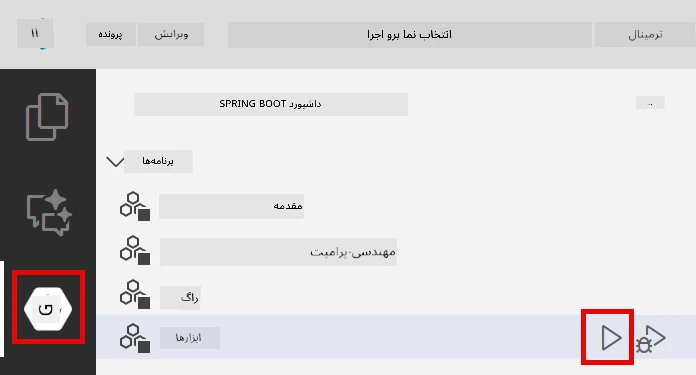
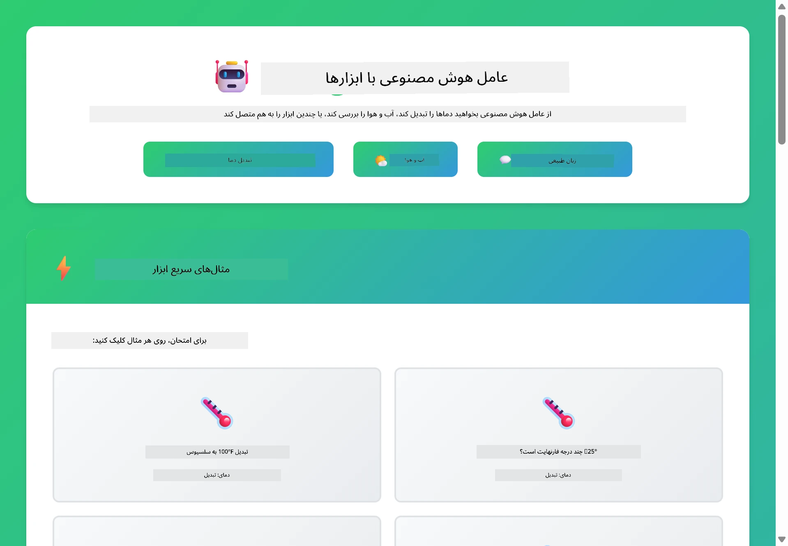
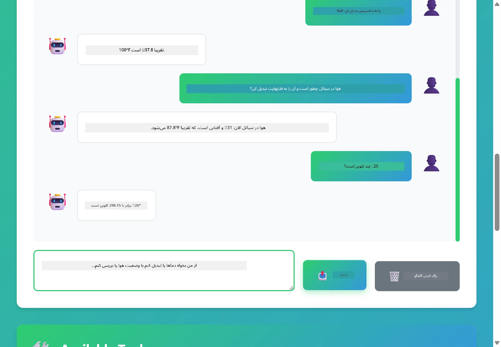

# ماژول ۰۴: عوامل هوش مصنوعی با ابزارها

## فهرست مطالب

- [راهنمای ویدئویی](#راهنمای-ویدئویی)
- [آنچه یاد خواهید گرفت](#آنچه-یاد-خواهید-گرفت)
- [پیش‌نیازها](#پیش‌نیازها)
- [درک عوامل هوش مصنوعی با ابزارها](#درک-عوامل-هوش-مصنوعی-با-ابزارها)
- [نحوه کارکرد فراخوانی ابزار](#نحوه-کارکرد-فراخوانی-ابزار)
  - [تعاریف ابزار](#تعاریف-ابزار)
  - [تصمیم‌گیری](#تصمیم‌گیری)
  - [اجرا](#اجرا)
  - [تولید پاسخ](#تولید-پاسخ)
  - [معماری: اتصال خودکار Spring Boot](#معماری-اتصال-خودکار-spring-boot)
- [زنجیره‌سازی ابزارها](#زنجیره‌سازی-ابزارها)
- [اجرای برنامه](#اجرای-برنامه)
- [استفاده از برنامه](#استفاده-از-برنامه)
  - [امتحان استفاده ساده از ابزار](#آزمایش-استفاده-ساده-از-ابزار)
  - [آزمایش زنجیره‌سازی ابزار](#آزمایش-زنجیره‌سازی-ابزار)
  - [مشاهده جریان مکالمه](#مشاهده-جریان-مکالمه)
  - [آزمایش درخواست‌های مختلف](#آزمایش-درخواست‌های-مختلف)
- [مفاهیم کلیدی](#مفاهیم-کلیدی)
  - [الگوی ReAct (استدلال و عمل)](#الگوی-react-استدلال-و-عمل)
  - [اهمیت توضیحات ابزار](#توضیحات-ابزار-مهم-است)
  - [مدیریت جلسه](#مدیریت-نشست)
  - [مدیریت خطا](#مدیریت-خطا)
- [ابزارهای در دسترس](#ابزارهای-در-دسترس)
- [زمان استفاده از عوامل مبتنی بر ابزار](#چه-زمانی-از-عامل‌های-مبتنی-بر-ابزار-استفاده-کنیم)
- [ابزارها در مقابل RAG](#ابزارها-در-مقابل-rag)
- [گام‌های بعدی](#مراحل-بعدی)

## راهنمای ویدئویی

این جلسه زنده را تماشا کنید که توضیح می‌دهد چگونه با این ماژول شروع کنید:

<a href="https://www.youtube.com/watch?v=O_J30kZc0rw"></a>

## آنچه یاد خواهید گرفت

تا کنون یاد گرفته‌اید چگونه با هوش مصنوعی گفتگو کنید، پرامپت‌ها را به طور مؤثر ساختاربندی کنید و پاسخ‌ها را در اسناد خود مستند کنید. اما هنوز یک محدودیت بنیادی وجود دارد: مدل‌های زبانی فقط می‌توانند متن تولید کنند. آن‌ها نمی‌توانند وضعیت آب و هوا را بررسی کنند، محاسبات انجام دهند، پایگاه داده‌ها را جستجو کنند یا با سیستم‌های خارجی تعامل داشته باشند.

ابزارها این وضعیت را تغییر می‌دهند. با دادن دسترسی به مدل به عملکردهایی که می‌تواند آنها را فراخوانی کند، آن را از تولیدکننده متن به عاملی تبدیل می‌کنید که می‌تواند عمل کند. مدل تصمیم می‌گیرد که کی به یک ابزار نیاز دارد، کدام ابزار را استفاده کند و چه پارامترهایی را ارسال نماید. کد شما عملکرد را اجرا کرده و نتیجه را بازمی‌گرداند. مدل آن نتیجه را در پاسخ خود وارد می‌کند.

## پیش‌نیازها

- تکمیل شده [ماژول ۰۱ - مقدمه](../01-introduction/README.md) (منابع Azure OpenAI مستقر شده)
- تکمیل ماژول‌های قبلی توصیه شده (این ماژول به [مفاهیم RAG از ماژول ۰۳](../03-rag/README.md) در مقایسه ابزارها با RAG اشاره دارد)
- فایل `.env` در دایرکتوری ریشه با اعتبارنامه‌های Azure (ایجاد شده با `azd up` در ماژول ۰۱)

> **توجه:** اگر ماژول ۰۱ را تکمیل نکرده‌اید، ابتدا از دستورالعمل‌های استقرار آن پیروی کنید.

## درک عوامل هوش مصنوعی با ابزارها

> **📝 توجه:** اصطلاح «عوامل» در این ماژول به دستیاران هوش مصنوعی اشاره دارد که با قابلیت‌های فراخوانی ابزار تقویت شده‌اند. این با الگوهای **Agentic AI** (عوامل مستقل با برنامه‌ریزی، حافظه و استدلال چندمرحله‌ای) که در [ماژول ۰۵: MCP](../05-mcp/README.md) پوشش داده می‌شوند، متفاوت است.

بدون ابزار، یک مدل زبانی فقط می‌تواند متن را از داده‌های آموزشی خود تولید کند. از آن بخواهید وضعیت آب و هوا را بگوید، باید حدس بزند. به آن ابزار بدهید و می‌تواند API وضعیت هوا را فراخوانی کند، محاسبات انجام دهد یا پایگاه داده را جستجو کند — سپس آن نتایج واقعی را در پاسخ خود بگنجاند.


*بدون ابزار مدل فقط حدس می‌زند — با ابزارها می‌تواند APIها را فراخوانی کند، محاسبه انجام دهد و داده‌های لحظه‌ای را بازگرداند.*

یک عامل هوش مصنوعی با ابزارها از الگوی **استدلال و عمل (ReAct)** پیروی می‌کند. مدل فقط پاسخ نمی‌دهد — تفکر می‌کند که چه نیاز دارد، با فراخوانی ابزار عمل می‌کند، نتیجه را مشاهده می‌کند و سپس تصمیم می‌گیرد که دوباره عمل کند یا پاسخ نهایی را ارائه دهد:

1. **استدلال** — عامل سؤال کاربر را تحلیل و مشخص می‌کند چه اطلاعاتی نیاز دارد
2. **عمل** — عامل ابزار مناسب را انتخاب، پارامترهای صحیح را تولید و آن را فراخوانی می‌کند
3. **مشاهده** — عامل خروجی ابزار را دریافت و نتیجه را ارزیابی می‌کند
4. **تکرار یا پاسخ** — اگر داده‌ی بیشتری نیاز باشد، عامل به مرحله اول برمی‌گردد؛ در غیر این صورت پاسخ نهایی را به زبان طبیعی می‌سازد


*چرخه ReAct — عامل در مورد اینکه چه کاری انجام دهد استدلال می‌کند، با فراخوانی ابزار عمل می‌کند، نتیجه را مشاهده می‌کند و تا زمانی که بتواند پاسخ نهایی را ارائه دهد، تکرار می‌کند.*

این فرایند به طور خودکار انجام می‌شود. شما ابزارها و توضیحاتشان را تعریف می‌کنید. مدل تصمیم‌گیری درباره زمان و نحوه استفاده از آن‌ها را بر عهده دارد.

## نحوه کارکرد فراخوانی ابزار

### تعاریف ابزار

[WeatherTool.java](../../../04-tools/src/main/java/com/example/langchain4j/agents/tools/WeatherTool.java) | [TemperatureTool.java](../../../04-tools/src/main/java/com/example/langchain4j/agents/tools/TemperatureTool.java)

شما توابعی با توضیح واضح و مشخصات پارامترها تعریف می‌کنید. مدل این توضیحات را در پرامپت سیستمی خود می‌بیند و درک می‌کند هر ابزار چه کاری انجام می‌دهد.

```java
@Component
public class WeatherTool {
    
    @Tool("Get the current weather for a location")
    public String getCurrentWeather(@P("Location name") String location) {
        // منطق جستجوی هوای شما
        return "Weather in " + location + ": 22°C, cloudy";
    }
}

@AiService
public interface Assistant {
    String chat(@MemoryId String sessionId, @UserMessage String message);
}

// دستیار به طور خودکار توسط Spring Boot متصل شده است با:
// - Bean مدل چت
// - همه متدهای @Tool از کلاس‌های @Component
// - ارائه‌دهنده حافظه چت برای مدیریت نشست‌ها
```

نمودار زیر هر توضیح را تجزیه کرده و نشان می‌دهد هر بخش چگونه به AI کمک می‌کند زمان فراخوانی ابزار و پارامترهایی که باید ارسال شود را بفهمد:


*آناتومی تعریف یک ابزار — @Tool به AI می‌گوید کی از آن استفاده کند، @P هر پارامتر را توصیف می‌کند و @AiService همه چیز را هنگام راه‌اندازی متصل می‌کند.*

> **🤖 امتحان کنید با چت [GitHub Copilot](https://github.com/features/copilot):** فایل [`WeatherTool.java`](../../../04-tools/src/main/java/com/example/langchain4j/agents/tools/WeatherTool.java) را باز کنید و بپرسید:
> - "چگونه می‌توانم یک API واقعی وضعیت هوا مانند OpenWeatherMap را به جای داده‌های شبیه‌سازی شده یکپارچه کنم؟"
> - "یک توضیح ابزار خوب که به AI کمک کند به درستی از آن استفاده کند، چگونه است؟"
> - "چگونه خطاهای API و محدودیت‌های نرخ را در پیاده‌سازی ابزار مدیریت کنم؟"

### تصمیم‌گیری

وقتی کاربر می‌پرسد «وضعیت هوا در سیاتل چیست؟»، مدل تصادفی یک ابزار انتخاب نمی‌کند. مدل قصد کاربر را با هر توضیح ابزاری که دسترسی دارد مقایسه می‌کند، هرکدام را بر اساس مرتبط بودن امتیاز می‌دهد و بهترین تطبیق را انتخاب می‌کند. سپس فراخوانی تابع ساختار یافته‌ای با پارامترهای صحیح تولید می‌کند — در این مورد، تنظیم `location` به `"Seattle"`.

اگر هیچ ابزاری با درخواست کاربر مطابقت نداشته باشد، مدل از دانش خودش پاسخ می‌دهد. اگر چند ابزار مطابقت داشتند، دقیق‌ترین را انتخاب می‌کند.


*مدل همه ابزارهای موجود را بر اساس قصد کاربر ارزیابی می‌کند و بهترین تطبیق را انتخاب می‌کند — به همین دلیل نوشتن توضیحات ابزار واضح و خاص اهمیت دارد.*

### اجرا

[AgentService.java](../../../04-tools/src/main/java/com/example/langchain4j/agents/service/AgentService.java)

Spring Boot رابط اعلانی `@AiService` را با همه ابزارهای ثبت شده خودکار متصل می‌کند و LangChain4j فراخوانی ابزارها را به صورت خودکار اجرا می‌کند. پشت صحنه، یک فراخوانی کامل ابزار از شش مرحله عبور می‌کند — از سؤال زبان طبیعی کاربر تا پاسخ به زبان طبیعی:


*جریان انتها به انتها — کاربر سؤال می‌پرسد، مدل یک ابزار انتخاب می‌کند، LangChain4j آن را اجرا می‌کند و مدل نتیجه را در یک پاسخ طبیعی می‌بافد.*

پشت صحنه، `AiServices` همان حلقه فراخوانی ابزار را برای هر ابزاری اجرا می‌کند — اینجا با یک `Calculator` ساده نشان داده شده است. نمودار دنباله زیر دقیقاً نشان می‌دهد چه مواردی در پس‌زمینه اتفاق می‌افتد:


*حلقه فراخوانی ابزار — `AiServices` پیام و اسکیماهای ابزار شما را به LLM ارسال می‌کند، LLM پاسخ می‌دهد با یک فراخوانی تابع مانند `add(42, 58)`, LangChain4j روش `Calculator` را به صورت محلی اجرا می‌کند و نتیجه را برای پاسخ نهایی بازمی‌گرداند.*

> **🤖 امتحان کنید با چت [GitHub Copilot](https://github.com/features/copilot):** فایل [`AgentService.java`](../../../04-tools/src/main/java/com/example/langchain4j/agents/service/AgentService.java) را باز کنید و بپرسید:
> - "الگوی ReAct چگونه کار می‌کند و چرا برای عوامل هوش مصنوعی مؤثر است؟"
> - "عامل چگونه تصمیم می‌گیرد از کدام ابزار استفاده کند و به چه ترتیبی؟"
> - "اگر اجرای یک ابزار شکست خورد چه می‌شود - چگونه باید خطاها را به‌طور مقاوم مدیریت کنم؟"

### تولید پاسخ

مدل داده‌های هواشناسی را دریافت کرده و آن را به یک پاسخ با زبان طبیعی برای کاربر قالب‌بندی می‌کند.

### معماری: اتصال خودکار Spring Boot

این ماژول از ادغام LangChain4j با Spring Boot با رابط‌های اعلانی `@AiService` استفاده می‌کند. هنگام راه‌اندازی، Spring Boot هر `@Component` که حاوی متدهای `@Tool` است، bean مدل گفتگو و `ChatMemoryProvider` را کشف می‌کند — سپس همه آنها را در یک رابط `Assistant` با صفر کد تکراری متصل می‌کند.


*رابط @AiService مدل گفتگو، کامپوننت‌های ابزار و ارائه‌دهنده حافظه را به هم پیوند می‌دهد — Spring Boot همه اتصال‌ها را خودکار انجام می‌دهد.*

در اینجا چرخه کامل درخواست به صورت نمودار توالی — از درخواست HTTP از طریق کنترلر، سرویس و پراکسی متصل خودکار تا اجرای ابزار و بازگشت نمایش داده شده است:


*چرخه کامل درخواست Spring Boot — درخواست HTTP از کنترلر و سرویس تا پراکسی Assistant متصل خودکار عبور می‌کند که هماهنگی LLM و فراخوانی ابزارها را خودکار انجام می‌دهد.*

مزایای کلیدی این رویکرد:

- **اتصال خودکار Spring Boot** — مدل گفتگو و ابزارها به صورت خودکار تزریق می‌شوند
- **الگوی @MemoryId** — مدیریت خودکار حافظه مبتنی بر جلسه
- **یک نمونه واحد** — Assistant یک بار ساخته شده و برای عملکرد بهتر مجدداً استفاده می‌شود
- **اجرای نوع امن** — متدهای جاوا به صورت مستقیم با تبدیل نوع فراخوانی می‌شوند
- **هماهنگی چندمرحله‌ای** — زنجیره‌سازی ابزارها را به صورت خودکار مدیریت می‌کند
- **صفر کد تکراری** — بدون فراخوانی‌های دستی `AiServices.builder()` یا هش‌مپ حافظه

رویکردهای جایگزین (دستی با `AiServices.builder()`) نیازمند کد بیشتر و فاقد مزایای ادغام Spring Boot هستند.

## زنجیره‌سازی ابزارها

**زنجیره‌سازی ابزارها** — قدرت واقعی عوامل مبتنی بر ابزار زمانی ظاهر می‌شود که یک سؤال واحد به چند ابزار نیاز داشته باشد. بپرسید «وضعیت هوا در سیاتل به فارنهایت چیست؟» و عامل به صورت خودکار دو ابزار را زنجیره می‌کند: ابتدا `getCurrentWeather` را برای گرفتن دما به سانتی‌گراد فراخوانی می‌کند، سپس آن مقدار را به `celsiusToFahrenheit` برای تبدیل می‌فرستد — همه در یک نوبت مکالمه.


*زنجیره‌سازی ابزار در عمل — عامل ابتدا getCurrentWeather را فراخوانی می‌کند، سپس نتیجه سانتی‌گراد را به celsiusToFahrenheit می‌فرستد و پاسخ ترکیبی ارائه می‌دهد.*

**خطاهای بی‌دردسر** — برای هوای شهری که در داده‌های شبیه‌سازی نیست درخواست کنید. ابزار پیام خطا بازمی‌گرداند و هوش مصنوعی توضیح می‌دهد که نمی‌تواند کمک کند به جای اینکه برنامه کرش کند. ابزارها به طور ایمن خطا می‌دهند. نمودار زیر دو رویکرد را مقایسه می‌کند — با مدیریت صحیح خطا، عامل استثنا را گرفته و پاسخ کمک‌کننده می‌دهد، در حالی که بدون آن کل برنامه کرش می‌کند:


*وقتی ابزار شکست می‌خورد، عامل خطا را می‌گیرد و به جای کرش کردن، با توضیح مفید پاسخ می‌دهد.*

این در یک نوبت مکالمه انجام می‌شود. عامل با خودکارسازی چند فراخوانی ابزار را هماهنگ می‌کند.

## اجرای برنامه

**اطمینان از استقرار:**

مطمئن شوید فایل `.env` در شاخه ریشه با اعتبارنامه‌های Azure وجود دارد (ایجاد شده در ماژول ۰۱). از دایرکتوری ماژول (`04-tools/`) این دستورات را اجرا کنید:

**Bash:**
```bash
cat ../.env  # باید AZURE_OPENAI_ENDPOINT، API_KEY، DEPLOYMENT را نشان دهد
```

**PowerShell:**
```powershell
Get-Content ..\.env  # باید AZURE_OPENAI_ENDPOINT، API_KEY، DEPLOYMENT را نمایش دهد
```

**راه‌اندازی برنامه:**

> **توجه:** اگر قبلاً همه برنامه‌ها را با استفاده از `./start-all.sh` از ریشه (طبق ماژول ۰۱) راه‌اندازی کرده‌اید، این ماژول در حال حاضر بر روی پورت 8084 اجرا می‌شود. می‌توانید دستورهای شروع زیر را رد کنید و مستقیماً به http://localhost:8084 بروید.

**گزینه ۱: استفاده از Spring Boot Dashboard (توصیه برای کاربران VS Code)**

کانتینر توسعه شامل افزونه Spring Boot Dashboard است که رابط بصری برای مدیریت همه برنامه‌های Spring Boot فراهم می‌کند. می‌توانید آن را در نوار فعالیت سمت چپ VS Code (آیکون Spring Boot) پیدا کنید.

از طریق Spring Boot Dashboard می‌توانید:
- همه برنامه‌های Spring Boot موجود در محیط کاری را ببینید
- برنامه‌ها را با یک کلیک شروع/توقف کنید
- لاگ‌های برنامه را به صورت زنده ببینید
- وضعیت برنامه را نظارت کنید

به سادگی روی دکمه پخش کنار "tools" کلیک کنید تا این ماژول شروع شود، یا همه ماژول‌ها را همزمان اجرا کنید.

نمایی که داشبورد Spring Boot در VS Code دارد به شکل زیر است:


*داشبورد Spring Boot در VS Code — شروع، توقف و نظارت روی همه ماژول‌ها از یک مکان*

**گزینه ۲: استفاده از اسکریپت‌های شِل**

همه برنامه‌های وب (ماژول‌های ۰۱-۰۴) را شروع کنید:

**Bash:**
```bash
cd ..  # از دایرکتوری ریشه
./start-all.sh
```

**PowerShell:**
```powershell
cd ..  # از دایرکتوری ریشه
.\start-all.ps1
```

یا فقط این ماژول را شروع کنید:

**Bash:**
```bash
cd 04-tools
./start.sh
```

**PowerShell:**
```powershell
cd 04-tools
.\start.ps1
```

هر دو اسکریپت به صورت خودکار متغیرهای محیطی را از فایل ریشه `.env` بارگذاری می‌کنند و در صورتی که فایل‌های JAR وجود نداشته باشند، آن‌ها را می‌سازند.

> **نکته:** اگر ترجیح می‌دهید قبل از شروع همه ماژول‌ها را به صورت دستی بسازید:
>
> **Bash:**
> ```bash
> cd ..  # Go to root directory
> mvn clean package -DskipTests
> ```
>
> **PowerShell:**
> ```powershell
> cd ..  # Go to root directory
> mvn clean package -DskipTests
> ```

در مرورگر خود به آدرس http://localhost:8084 مراجعه کنید.

**برای توقف:**

**Bash:**
```bash
./stop.sh  # این ماژول فقط
# یا
cd .. && ./stop-all.sh  # همه ماژول‌ها
```

**PowerShell:**
```powershell
.\stop.ps1  # فقط این ماژول
# یا
cd ..; .\stop-all.ps1  # همه ماژول‌ها
```

## استفاده از برنامه

این برنامه یک رابط وب فراهم می‌کند که می‌توانید با یک عامل هوش مصنوعی که به ابزارهای آب‌وهوا و تبدیل دما دسترسی دارد، تعامل برقرار کنید. نمایی از رابط اینجا آمده است — شامل مثال‌های شروع سریع و پنل چت برای ارسال درخواست‌ها:

<a href="images/tools-homepage.png"></a>

*رابط ابزارهای عامل هوش مصنوعی - مثال‌های سریع و رابط چت برای تعامل با ابزارها*

### آزمایش استفاده ساده از ابزار

با یک درخواست ساده شروع کنید: «100 درجه فارنهایت را به سلسیوس تبدیل کن». عامل تشخیص می‌دهد که باید از ابزار تبدیل دما استفاده کند، آن را با پارامترهای درست فراخوانی می‌کند و نتیجه را برمی‌گرداند. ببینید چقدر طبیعی است — شما مشخص نکردید کدام ابزار را استفاده کند یا چگونه آن را فراخوانی کنید.

### آزمایش زنجیره‌سازی ابزار

حالا یک درخواست پیچیده‌تر را امتحان کنید: «آب‌وهوا در سیاتل چطور است و آن را به فارنهایت تبدیل کن؟» مشاهده کنید که عامل به صورت مرحله به مرحله کار را انجام می‌دهد. ابتدا آب‌وهوا را دریافت می‌کند (که به سلسیوس است)، تشخیص می‌دهد که باید به فارنهایت تبدیل کند، ابزار تبدیل را فراخوانی می‌کند و هر دو نتیجه را در یک پاسخ ترکیب می‌کند.

### مشاهده جریان مکالمه

رابط چت تاریخچه مکالمات را حفظ می‌کند و به شما اجازه می‌دهد تعامل‌های چندمرحله‌ای داشته باشید. می‌توانید تمام پرسش‌ها و پاسخ‌های قبلی را ببینید و دنبال کردن مکالمه و درک نحوه ساخت زمینه توسط عامل را ساده می‌کند.

<a href="images/tools-conversation-demo.png"></a>

*مکالمه چندمرحله‌ای شامل تبدیل‌های ساده، جستجوی آب‌وهوا و زنجیره‌سازی ابزار*

### آزمایش درخواست‌های مختلف

ترکیبات مختلف را امتحان کنید:
- جستجوی آب‌وهوا: «آب‌وهوا در توکیو چطور است؟»
- تبدیل دما: «25 درجه سلسیوس چند کلوین است؟»
- پرسش‌های ترکیبی: «آب‌وهوا در پاریس را بررسی کن و بگو اگر بالای 20 درجه سلسیوس است»

توجه کنید که عامل چگونه زبان طبیعی را تعبیر می‌کند و آن را به فراخوانی‌های مناسب ابزار نگاشت می‌کند.

## مفاهیم کلیدی

### الگوی ReAct (استدلال و عمل)

عامل بین استدلال (تصمیم‌گیری در مورد کار بعدی) و عمل (استفاده از ابزارها) جابجا می‌شود. این الگو امکان حل خودکار مسئله را فراهم می‌کند، نه فقط پاسخ به دستورها.

### توضیحات ابزار مهم است

کیفیت توضیحات ابزار مستقیم روی نحوه استفاده بهتر عامل تأثیر می‌گذارد. توضیحات واضح و مشخص به مدل کمک می‌کند که چه موقع و چگونه هر ابزار را فراخوانی کند.

### مدیریت نشست

حاشیه‌نویسی `@MemoryId` امکان مدیریت حافظه مبتنی بر نشست را به صورت خودکار فراهم می‌کند. هر شناسه نشست یک نمونه `ChatMemory` منحصر به فرد دریافت می‌کند که توسط Bean `ChatMemoryProvider` مدیریت می‌شود، بنابراین چندین کاربر می‌توانند به طور همزمان با عامل تعامل داشته باشند بدون اینکه مکالماتشان با یکدیگر مخلوط شود. نمودار زیر نشان می‌دهد که چگونه چندین کاربر به فروشگاه‌های حافظه جداگانه بر اساس شناسه‌های نشستشان هدایت می‌شوند:


*هر شناسه نشست به یک تاریخچه مکالمه جداگانه نگاشت می‌شود — کاربران هرگز پیام‌های یکدیگر را نمی‌بینند.*

### مدیریت خطا

ابزارها ممکن است دچار خطا شوند — APIها ممکن است زمان‌تأخیر داشته باشند، پارامترها نادرست باشند، سرویس‌های خارجی ممکن است از کار بیفتند. عامل‌های تولید باید خطاها را مدیریت کنند تا مدل بتواند مشکلات را توضیح دهد یا جایگزین‌هایی امتحان کند، به جای اینکه کل برنامه کرش کند. وقتی یک ابزار استثنا پرتاب می‌کند، LangChain4j آن را گرفته و پیام خطا را به مدل بازمی‌گرداند که سپس می‌تواند مشکل را به زبان طبیعی توضیح دهد.

## ابزارهای در دسترس

نمودار زیر اکوسیستم گسترده ابزارهایی که می‌توانید بسازید را نشان می‌دهد. این ماژول ابزارهای آب‌وهوا و دما را نشان می‌دهد، اما همان الگوی `@Tool` برای هر متد جاوا کار می‌کند — از پرس‌وجوی دیتابیس تا پردازش پرداخت.


*هر متد جاوا که با @Tool نشانه‌گذاری شده باشد برای هوش مصنوعی در دسترس قرار می‌گیرد — الگو به دیتابیس‌ها، APIها، ایمیل، عملیات فایل و بیشتر گسترش می‌یابد.*

## چه زمانی از عامل‌های مبتنی بر ابزار استفاده کنیم

هر درخواستی به ابزار نیاز ندارد. تصمیم به این بستگی دارد که آیا AI باید با سیستم‌های خارجی تعامل داشته باشد یا بتواند از دانش خودش پاسخ دهد. راهنمای زیر خلاصه می‌کند که چه زمانی ابزارها ارزش افزوده دارند و چه زمانی ضروری نیستند:


*راهنمای تصمیم‌گیری سریع — ابزارها برای داده‌های بلادرنگ، محاسبات و عملیات؛ دانش عمومی و کارهای خلاقانه نیاز به آن‌ها ندارند.*

## ابزارها در مقابل RAG

ماژول‌های ۰۳ و ۰۴ هر دو قابلیت‌های AI را افزایش می‌دهند، اما به طور بنیادی متفاوت. RAG به مدل دسترسی به **دانش** را می‌دهد با بازخوانی اسناد. ابزارها به مدل امکان انجام **عملکردها** را با فراخوانی توابع می‌دهند. نمودار زیر این دو رویکرد را در کنار هم مقایسه می‌کند — از نحوه عملکرد هر جریان کاری تا مزایا و معایب آن‌ها:


*RAG اطلاعات را از اسناد ایستا بازیابی می‌کند — ابزارها عملیات را انجام می‌دهند و داده‌های پویا و بلادرنگ را واکشی می‌کنند. بسیاری از سیستم‌های تولیدی هر دو را با هم ترکیب می‌کنند.*

در عمل، بسیاری از سیستم‌های تولیدی هر دو رویکرد را ترکیب می‌کنند: RAG برای پایه‌گذاری پاسخ‌ها بر مستندات شما، و ابزارها برای واکشی داده‌های زنده یا انجام عملیات.

## مراحل بعدی

**ماژول بعدی:** [05-mcp - پروتکل زمینه مدل (MCP)](../05-mcp/README.md)

---

**ناوبری:** [← قبلی: ماژول ۰۳ - RAG](../03-rag/README.md) | [بازگشت به اصلی](../README.md) | [بعدی: ماژول ۰۵ - MCP →](../05-mcp/README.md)

---

<!-- CO-OP TRANSLATOR DISCLAIMER START -->
**سلب مسئولیت**:
این سند با استفاده از سرویس ترجمه هوش مصنوعی [Co-op Translator](https://github.com/Azure/co-op-translator) ترجمه شده است. در حالی که ما در تلاش برای دقت هستیم، لطفاً توجه داشته باشید که ترجمه‌های خودکار ممکن است شامل خطاها یا نادرستی‌هایی باشند. سند اصلی به زبان مادری خود باید به عنوان منبع معتبر در نظر گرفته شود. برای اطلاعات حیاتی، ترجمه حرفه‌ای انسانی توصیه می‌شود. ما در قبال هرگونه سوء تفاهم یا برداشت نادرست ناشی از استفاده از این ترجمه مسئولیتی نداریم.
<!-- CO-OP TRANSLATOR DISCLAIMER END -->