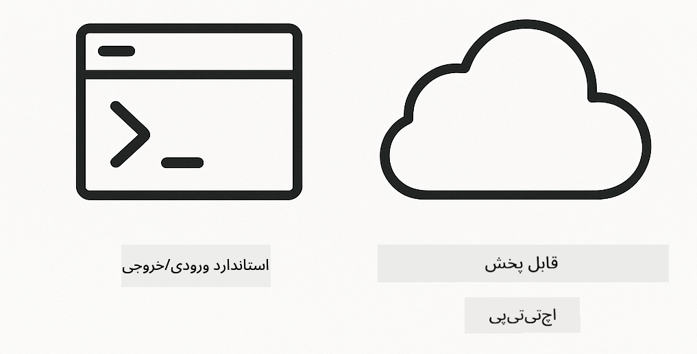

<!--
CO_OP_TRANSLATOR_METADATA:
{
  "original_hash": "6c816d130a1fa47570c11907e72d84ae",
  "translation_date": "2026-01-05T21:42:26+00:00",
  "source_file": "05-mcp/README.md",
  "language_code": "fa"
}
-->
# ماژول ۰۵: پروتکل زمینه مدل (MCP)

## فهرست مطالب

- [آنچه یاد می‌گیرید](../../../05-mcp)
- [MCP چیست؟](../../../05-mcp)
- [چگونه MCP کار می‌کند](../../../05-mcp)
- [ماژول عاملی](../../../05-mcp)
- [اجرای مثال‌ها](../../../05-mcp)
  - [نیازمندی‌ها](../../../05-mcp)
- [شروع سریع](../../../05-mcp)
  - [عملیات فایل (Stdio)](../../../05-mcp)
  - [عامل ناظر](../../../05-mcp)
    - [درک خروجی](../../../05-mcp)
    - [استراتژی‌های پاسخ](../../../05-mcp)
    - [توضیح ویژگی‌های ماژول عاملی](../../../05-mcp)
- [مفاهیم کلیدی](../../../05-mcp)
- [تبریک!](../../../05-mcp)
  - [مرحله بعد چیست؟](../../../05-mcp)

## آنچه یاد می‌گیرید

شما هوش مصنوعی محاوره‌ای ساخته‌اید، در استفاده از پرامپت‌ها مهارت پیدا کرده‌اید، پاسخ‌ها را بر اساس اسناد پایه‌گذاری کرده‌اید و با ابزارها، عوامل ساختید. اما همه این ابزارها برای کاربرد خاص شما به صورت سفارشی ساخته شده بودند. اگر می‌توانستید به هوش مصنوعی خود دسترسی به یک اکوسیستم استانداردشده ابزار بدهید که هر کسی بتواند آن را بسازد و به اشتراک بگذارد، چه؟ در این ماژول، یاد می‌گیرید چگونه با پروتکل زمینه مدل (MCP) و ماژول عاملی LangChain4j این کار را بکنید. ابتدا یک فایل‌خوان ساده MCP را نشان می‌دهیم و سپس چگونگی ادغام راحت آن در جریان‌های پیشرفته عاملی با الگوی عامل ناظر را نمایش می‌دهیم.

## MCP چیست؟

پروتکل زمینه مدل (MCP) دقیقا همین را فراهم می‌کند – روشی استاندارد برای برنامه‌های هوش مصنوعی برای کشف و استفاده از ابزارهای خارجی. به جای نوشتن ادغام‌های سفارشی برای هر منبع داده یا سرویس، به سرورهایی متصل می‌شوید که قابلیت‌های خود را با قالبی یکنواخت ارائه می‌دهند. سپس عامل هوش مصنوعی شما می‌تواند این ابزارها را به‌طور خودکار کشف و استفاده کند.


*قبل از MCP: ادغام‌های نقطه‌به‌نقطه پیچیده. بعد از MCP: یک پروتکل، امکانات نامحدود.*

MCP یک مشکل بنیادی در توسعه هوش مصنوعی را حل می‌کند: هر ادغام سفارشی است. می‌خواهید به GitHub دسترسی داشته باشید؟ کد سفارشی. می‌خواهید فایل بخوانید؟ کد سفارشی. می‌خواهید پایگاه داده پرس و جو کنید؟ کد سفارشی. و هیچ‌کدام از این ادغام‌ها با برنامه‌های هوش مصنوعی دیگر کار نمی‌کنند.

MCP این را استاندارد می‌کند. یک سرور MCP ابزارها را با شرح‌ها و شمایلی واضح ارائه می‌دهد. هر کلاینت MCP می‌تواند متصل شود، ابزارهای موجود را کشف کند و از آن‌ها استفاده کند. یک بار بسازید، همه جا استفاده کنید.


*معماری پروتکل زمینه مدل - کشف و اجرای استاندارد ابزارها*

## چگونه MCP کار می‌کند

**معماری سرور-کلاینت**

MCP از مدل کلاینت-سرور استفاده می‌کند. سرورها ابزار ارائه می‌دهند - خواندن فایل‌ها، پرس و جو پایگاه داده، فراخوانی APIها. کلاینت‌ها (برنامه هوش مصنوعی شما) به سرورها متصل شده و از ابزارهای آن‌ها استفاده می‌کنند.

برای استفاده از MCP با LangChain4j، این وابستگی Maven را اضافه کنید:

```xml
<dependency>
    <groupId>dev.langchain4j</groupId>
    <artifactId>langchain4j-mcp</artifactId>
    <version>${langchain4j.version}</version>
</dependency>
```

**کشف ابزار**

وقتی کلاینت شما به سرور MCP متصل می‌شود، می‌پرسد «چه ابزارهایی دارید؟» سرور با لیستی از ابزارهای موجود پاسخ می‌دهد که هر کدام شرح و ساختار پارامتر دارند. سپس عامل هوش مصنوعی شما می‌تواند بر اساس درخواست کاربر تصمیم بگیرد کدام ابزارها را استفاده کند.

**مکانیسم‌های انتقال**

MCP از مکانیسم‌های انتقال مختلفی پشتیبانی می‌کند. این ماژول انتقال Stdio را برای فرایندهای محلی نشان می‌دهد:



*مکانیسم‌های انتقال MCP: HTTP برای سرورهای راه دور، Stdio برای فرایندهای محلی*

**Stdio** - [StdioTransportDemo.java](../../../05-mcp/src/main/java/com/example/langchain4j/mcp/StdioTransportDemo.java)

برای فرایندهای محلی. برنامه شما یک سرور به عنوان فرایند فرزند ایجاد می‌کند و از طریق ورودی/خروجی استاندارد ارتباط برقرار می‌کند. برای دسترسی به سیستم فایل یا ابزارهای خط فرمان مفید است.

```java
McpTransport stdioTransport = new StdioMcpTransport.Builder()
    .command(List.of(
        npmCmd, "exec",
        "@modelcontextprotocol/server-filesystem@2025.12.18",
        resourcesDir
    ))
    .logEvents(false)
    .build();
```

> **🤖 امتحان با چت [GitHub Copilot](https://github.com/features/copilot):** فایل [`StdioTransportDemo.java`](../../../05-mcp/src/main/java/com/example/langchain4j/mcp/StdioTransportDemo.java) را باز کنید و بپرسید:
> - "انتقال Stdio چگونه کار می‌کند و چه زمانی باید آن را نسبت به HTTP استفاده کنم؟"
> - "LangChain4j چگونه چرخه عمر فرایندهای سرور MCP راه‌اندازی شده را مدیریت می‌کند؟"
> - "ملاحظات امنیتی دادن دسترسی هوش مصنوعی به سیستم فایل چیست؟"

## ماژول عاملی

در حالی که MCP ابزارهای استاندارد شده فراهم می‌کند، ماژول عاملی LangChain4j روشی بیانی برای ساخت عامل‌هایی ارائه می‌دهد که آن ابزارها را هماهنگ می‌کنند. انوتیشن `@Agent` و کلاس `AgenticServices` به شما اجازه می‌دهند رفتار عامل‌ها را با اینترفیس‌ها تعریف کنید نه کد امری.

در این ماژول، الگوی **عامل ناظر** را بررسی می‌کنید — رویکرد پیشرفته عاملی هوش مصنوعی که در آن یک عامل «ناظر» به طور پویا تصمیم می‌گیرد کدام زیرعامل‌ها بر اساس درخواست کاربر فراخوانی شوند. هر دو مفهوم را با دادن قابلیت دسترسی به فایل با قدرت MCP به یکی از زیرعامل‌ها ترکیب می‌کنیم.

برای استفاده از ماژول عاملی، این وابستگی Maven را اضافه کنید:

```xml
<dependency>
    <groupId>dev.langchain4j</groupId>
    <artifactId>langchain4j-agentic</artifactId>
    <version>${langchain4j.mcp.version}</version>
</dependency>
```

> **⚠️ آزمایشی:** ماژول `langchain4j-agentic` **آزمایشی** است و ممکن است تغییر کند. روش پایدار برای ساخت دستیارهای هوش مصنوعی همچنان `langchain4j-core` با ابزارهای سفارشی (ماژول ۰۴) است.

## اجرای مثال‌ها

### نیازمندی‌ها

- جاوا ۲۱ به بالا، Maven ۳.۹ به بالا
- Node.js 16 به بالا و npm (برای سرورهای MCP)
- متغیرهای محیطی پیکربندی شده در فایل `.env` (از دایرکتوری ریشه):
  - `AZURE_OPENAI_ENDPOINT`، `AZURE_OPENAI_API_KEY`، `AZURE_OPENAI_DEPLOYMENT` (مانند ماژول‌های ۰۱-۰۴)

> **توجه:** اگر هنوز متغیرهای محیطی خود را تنظیم نکرده‌اید، به [ماژول ۰۰ - شروع سریع](../00-quick-start/README.md) مراجعه کنید، یا فایل `.env.example` را به `.env` در دایرکتوری ریشه کپی کرده و مقادیر خود را وارد نمایید.

## شروع سریع

**استفاده از VS Code:** به سادگی روی هر فایل دمو در اکسپلورر راست‌کلیک کنید و **"Run Java"** را انتخاب کنید، یا از پیکربندی‌های اجرا در پنل Run and Debug استفاده کنید (مطمئن شوید ابتدا توکن خود را در فایل `.env` اضافه کرده‌اید).

**استفاده از Maven:** همچنین می‌توانید از خط فرمان با مثال‌های زیر اجرا کنید.

### عملیات فایل (Stdio)

این نمونه ابزارهای مبتنی بر فرایند فرزند محلی را نشان می‌دهد.

**✅ بدون نیازمندی قبلی** – سرور MCP به طور خودکار اجرا می‌شود.

**استفاده از اسکریپت‌های شروع (توصیه شده):**

اسکریپت‌های شروع متغیرهای محیطی را از فایل `.env` ریشه بارگذاری می‌کنند:

**Bash:**
```bash
cd 05-mcp
chmod +x start-stdio.sh
./start-stdio.sh
```

**PowerShell:**
```powershell
cd 05-mcp
.\start-stdio.ps1
```

**استفاده از VS Code:** روی `StdioTransportDemo.java` راست‌کلیک کنید و **"Run Java"** را انتخاب کنید (اطمینان یابید فایل `.env` پیکربندی شده است).

برنامه به طور خودکار یک سرور MCP فایل‌سیستم اجرا کرده و یک فایل محلی را می‌خواند. توجه کنید مدیریت فرایند فرزند چگونه انجام می‌شود.

**خروجی مورد انتظار:**
```
Assistant response: The file provides an overview of LangChain4j, an open-source Java library
for integrating Large Language Models (LLMs) into Java applications...
```

### عامل ناظر

الگوی **عامل ناظر** شکلی **انعطاف‌پذیر** از هوش مصنوعی عاملی است. یک ناظر با استفاده از مدل زبان بزرگ (LLM) به صورت خودکار تصمیم می‌گیرد کدام عامل‌ها بر اساس درخواست کاربر فراخوانی شوند. در مثال بعدی، دسترسی به فایل با قدرت MCP و عامل LLM را ترکیب می‌کنیم تا یک جریان کاری خواندن فایل → گزارش تحت نظارت ایجاد کنیم.

در دمو، `FileAgent` فایل را با استفاده از ابزارهای فایل‌سیستم MCP می‌خواند و `ReportAgent` گزارشی ساختارمند با خلاصه اجرایی (یک جمله)، سه نکته کلیدی و توصیه‌ها تولید می‌کند. ناظر این روند را به صورت خودکار هماهنگ می‌کند:


```
┌─────────────┐      ┌──────────────┐
│  FileAgent  │ ───▶ │ ReportAgent  │
│ (MCP tools) │      │  (pure LLM)  │
└─────────────┘      └──────────────┘
   outputKey:           outputKey:
  'fileContent'         'report'
```

هر عامل خروجی خود را در **دامنه عاملی** (حافظه مشترک) ذخیره می‌کند که اجازه می‌دهد عوامل بعدی به نتایج قبلی دسترسی داشته باشند. این نشان می‌دهد چگونه ابزارهای MCP به راحتی در جریان‌های کاری عاملی ادغام می‌شوند — ناظر نیازی ندارد بداند *چگونه* فایل‌ها خوانده می‌شوند، فقط می‌داند که `FileAgent` می‌تواند این کار را بکند.

#### اجرای دمو

اسکریپت‌های شروع متغیرهای محیطی را از فایل `.env` ریشه به طور خودکار بارگذاری می‌کنند:

**Bash:**
```bash
cd 05-mcp
chmod +x start-supervisor.sh
./start-supervisor.sh
```

**PowerShell:**
```powershell
cd 05-mcp
.\start-supervisor.ps1
```

**استفاده از VS Code:** روی `SupervisorAgentDemo.java` راست‌کلیک کنید و **"Run Java"** را انتخاب نمایید (اطمینان یابید فایل `.env` پیکربندی شده است).

#### نحوه کار ناظر

```java
// مرحله ۱: FileAgent با استفاده از ابزارهای MCP فایل‌ها را می‌خواند
FileAgent fileAgent = AgenticServices.agentBuilder(FileAgent.class)
        .chatModel(model)
        .toolProvider(mcpToolProvider)  // دارای ابزارهای MCP برای عملیات فایل
        .build();

// مرحله ۲: ReportAgent گزارش‌های ساختاریافته تولید می‌کند
ReportAgent reportAgent = AgenticServices.agentBuilder(ReportAgent.class)
        .chatModel(model)
        .build();

// Supervisor جریان کاری فایل → گزارش را هماهنگ می‌کند
SupervisorAgent supervisor = AgenticServices.supervisorBuilder()
        .chatModel(model)
        .subAgents(fileAgent, reportAgent)
        .responseStrategy(SupervisorResponseStrategy.LAST)  // گزارش نهایی را بازگردان
        .build();

// Supervisor تصمیم می‌گیرد کدام عوامل را بر اساس درخواست فراخوانی کند
String response = supervisor.invoke("Read the file at /path/file.txt and generate a report");
```

#### استراتژی‌های پاسخ

وقتی `SupervisorAgent` را تنظیم می‌کنید، مشخص می‌کنید که چگونه باید پاسخ نهایی خود را به کاربر پس از اتمام وظایف زیرعامل‌ها فرموله کند. استراتژی‌های موجود عبارت‌اند از:

| استراتژی | توضیح |
|----------|---------|
| **LAST** | ناظر خروجی آخرین زیرعامل یا ابزار فراخوانی شده را بازمی‌گرداند. این زمانی مفید است که عامل نهایی در جریان کاری به طور خاص برای تولید جواب کامل و نهایی طراحی شده باشد (برای مثال، «عامل خلاصه» در یک خط لوله تحقیقاتی). |
| **SUMMARY** | ناظر از مدل زبان داخلی خود (LLM) استفاده می‌کند تا خلاصه‌ای از کل تعامل و تمام خروجی‌های زیرعامل‌ها بسازد و سپس آن خلاصه را به عنوان پاسخ نهایی بازمی‌گرداند. این پاسخ کلی و تجمیع‌شده‌ای به کاربر ارائه می‌دهد. |
| **SCORED** | سیستم از یک LLM داخلی برای امتیازدهی هم به پاسخ آخر (LAST) و هم خلاصه (SUMMARY) بر اساس درخواست اصلی کاربر استفاده می‌کند و خروجی با امتیاز بالاتر را بازمی‌گرداند. |

کد کامل را در [SupervisorAgentDemo.java](../../../05-mcp/src/main/java/com/example/langchain4j/mcp/SupervisorAgentDemo.java) ببینید.

> **🤖 امتحان با چت [GitHub Copilot](https://github.com/features/copilot):** فایل [`SupervisorAgentDemo.java`](../../../05-mcp/src/main/java/com/example/langchain4j/mcp/SupervisorAgentDemo.java) را باز کنید و بپرسید:
> - "ناظر چگونه تصمیم می‌گیرد کدام عامل‌ها را فراخوانی کند؟"
> - "تفاوت الگوهای ناظر و جریان کاری ترتیبی چیست؟"
> - "چگونه می‌توانم رفتار برنامه‌ریزی ناظر را شخصی‌سازی کنم؟"

#### درک خروجی

وقتی دمو را اجرا می‌کنید، گام به گام می‌بینید که چگونه ناظر چندین عامل را هماهنگ می‌کند. هر بخش به چه معناست:

```
======================================================================
  FILE → REPORT WORKFLOW DEMO
======================================================================

This demo shows a clear 2-step workflow: read a file, then generate a report.
The Supervisor orchestrates the agents automatically based on the request.
```

**سربرگ** مفهوم جریان کاری را معرفی می‌کند: یک خط لوله متمرکز از خواندن فایل تا تولید گزارش.

```
--- WORKFLOW ---------------------------------------------------------
  ┌─────────────┐      ┌──────────────┐
  │  FileAgent  │ ───▶ │ ReportAgent  │
  │ (MCP tools) │      │  (pure LLM)  │
  └─────────────┘      └──────────────┘
   outputKey:           outputKey:
   'fileContent'        'report'

--- AVAILABLE AGENTS -------------------------------------------------
  [FILE]   FileAgent   - Reads files via MCP → stores in 'fileContent'
  [REPORT] ReportAgent - Generates structured report → stores in 'report'
```

**نمودار جریان کاری** جریان داده‌ها بین عامل‌ها را نشان می‌دهد. هر عامل نقش مشخصی دارد:
- **FileAgent** فایل‌ها را با ابزارهای MCP می‌خواند و محتوای خام را در `fileContent` ذخیره می‌کند
- **ReportAgent** آن محتوا را مصرف می‌کند و گزارش ساختارمندی در `report` تولید می‌کند

```
--- USER REQUEST -----------------------------------------------------
  "Read the file at .../file.txt and generate a report on its contents"
```

**درخواست کاربر** کار را نشان می‌دهد. ناظر این را تجزیه می‌کند و تصمیم می‌گیرد FileAgent → ReportAgent را اجرا کند.

```
--- SUPERVISOR ORCHESTRATION -----------------------------------------
  The Supervisor decides which agents to invoke and passes data between them...

  +-- STEP 1: Supervisor chose -> FileAgent (reading file via MCP)
  |
  |   Input: .../file.txt
  |
  |   Result: LangChain4j is an open-source, provider-agnostic Java framework for building LLM...
  +-- [OK] FileAgent (reading file via MCP) completed

  +-- STEP 2: Supervisor chose -> ReportAgent (generating structured report)
  |
  |   Input: LangChain4j is an open-source, provider-agnostic Java framew...
  |
  |   Result: Executive Summary...
  +-- [OK] ReportAgent (generating structured report) completed
```

**هماهنگی ناظر** روند ۲ مرحله‌ای را نمایش می‌دهد:
1. **FileAgent** فایل را از طریق MCP می‌خواند و محتوا را ذخیره می‌کند
2. **ReportAgent** محتوا را دریافت کرده و گزارش ساختاری تولید می‌کند

ناظر این تصمیمات را به طور **خودمختار** بر اساس درخواست کاربر گرفت.

```
--- FINAL RESPONSE ---------------------------------------------------
Executive Summary
...

Key Points
...

Recommendations
...

--- AGENTIC SCOPE (Data Flow) ----------------------------------------
  Each agent stores its output for downstream agents to consume:
  * fileContent: LangChain4j is an open-source, provider-agnostic Java framework...
  * report: Executive Summary...
```

#### توضیح ویژگی‌های ماژول عاملی

مثال چند ویژگی پیشرفته ماژول عاملی را نشان می‌دهد. بیایید نگاهی دقیق‌تر به دامنه عاملی و شنونده‌های عامل داشته باشیم.

**دامنه عاملی** حافظه مشترکی است که عامل‌ها نتایج خود را با استفاده از `@Agent(outputKey="...")` در آن ذخیره می‌کنند. این اجازه می‌دهد:
- عوامل بعدی به خروجی عوامل قبلی دسترسی داشته باشند
- ناظر بتواند پاسخ نهایی را ترکیب کند
- شما بتوانید خروجی هر عامل را بررسی کنید

```java
ResultWithAgenticScope<String> result = supervisor.invokeWithAgenticScope(request);
AgenticScope scope = result.agenticScope();
String fileContent = scope.readState("fileContent");  // داده‌های خام فایل از FileAgent
String report = scope.readState("report");            // گزارش ساختاریافته از ReportAgent
```

**شنونده‌های عامل** امکان پایش و اشکال‌زدایی اجرای عامل را فراهم می‌کنند. خروجی گام به گامی که در دمو می‌بینید، از یک AgentListener است که به هر فراخوانی عامل متصل می‌شود:
- **beforeAgentInvocation** - هنگام انتخاب یک عامل توسط ناظر فراخوانی می‌شود، و به شما اجازه می‌دهد ببینید کدام عامل انتخاب شده و چرا
- **afterAgentInvocation** - پس از اتمام عامل فراخوانی می‌شود و نتیجه آن را نشان می‌دهد
- **inheritedBySubagents** - وقتی فعال است، شنونده همه عامل‌ها در سلسله‌مراتب را مانیتور می‌کند

```java
AgentListener monitor = new AgentListener() {
    private int step = 0;
    
    @Override
    public void beforeAgentInvocation(AgentRequest request) {
        step++;
        System.out.println("  +-- STEP " + step + ": " + request.agentName());
    }
    
    @Override
    public void afterAgentInvocation(AgentResponse response) {
        System.out.println("  +-- [OK] " + response.agentName() + " completed");
    }
    
    @Override
    public boolean inheritedBySubagents() {
        return true; // به همه زیرعامل‌ها انتقال دهید
    }
};
```

فراتر از الگوی ناظر، ماژول `langchain4j-agentic` چند الگوی جریان کاری قدرتمند و ویژگی ارائه می‌دهد:

| الگو | توضیح | کاربرد |
|---------|-------------|----------|
| **ترتیبی** | اجرای عامل‌ها به ترتیب، خروجی به عامل بعدی منتقل می‌شود | خطوط لوله: تحقیق → تحلیل → گزارش |
| **موازی** | اجرای همزمان عامل‌ها | وظایف مستقل: هواشناسی + خبر + بورس |
| **حلقه** | تکرار تا برآورده شدن شرط | امتیازدهی کیفیت: بازبینی تا امتیاز ≥ ۰.۸ |
| **شرطی** | مسیر دادن بر اساس شرایط | دسته‌بندی → هدایت به عامل تخصصی |
| **انسان در حلقه** | افزودن ایستگاه‌های بازبینی انسانی | جریان‌های کاری تأیید، بازبینی محتوا |

## مفاهیم کلیدی

حالا که MCP و ماژول عاملی را در عمل بررسی کردید، بیایید خلاصه کنیم چه زمانی از هر رویکرد استفاده کنید.

**MCP** زمانی ایده‌آل است که بخواهید از اکوسیستم ابزارهای موجود بهره ببرید، ابزارهایی بسازید که چند برنامه بتوانند به اشتراک بگذارند، خدمات ثالث را با پروتکل‌های استاندارد ادغام کنید، یا پیاده‌سازی ابزارها را بدون تغییر کد تعویض کنید.

**ماژول عاملی** بهترین انتخاب زمانی است که بخواهید تعریف‌های بیانی عامل با انوتیشن‌های `@Agent` داشته باشید، نیاز به هماهنگی جریان کاری (ترتیبی، حلقه، موازی) دارید، طراحی عامل بر اساس اینترفیس را به کد امری ترجیح می‌دهید، یا چند عامل را ترکیب می‌کنید که خروجی‌ها را از طریق `outputKey` به اشتراک می‌گذارند.

**الگوی عامل ناظر** زمانی شاخص است که جریان کاری از پیش قابل پیش‌بینی نیست و می‌خواهید LLM تصمیم بگیرد، وقتی چند عامل تخصصی دارید که به هماهنگی پویا نیاز دارند، هنگام ساخت سیستم‌های محاوره‌ای که به توانمندی‌های مختلف هدایت می‌شوند، یا وقتی بیشترین انعطاف و سازگاری در رفتار عامل می‌خواهید.
## تبریک می‌گوییم!

شما دوره LangChain4j برای مبتدیان را به پایان رسانده‌اید. شما یاد گرفتید:

- چگونه یک هوش مصنوعی مکالمه‌ای با حافظه بسازید (ماژول ۰۱)
- الگوهای مهندسی پرسش برای وظایف مختلف (ماژول ۰۲)
- پاسخ‌ها را با استفاده از RAG در اسناد خود زمینه‌سازی کنید (ماژول ۰۳)
- ساخت عوامل پایه هوش مصنوعی (دستیارها) با ابزارهای سفارشی (ماژول ۰۴)
- ادغام ابزارهای استاندارد با ماژول‌های LangChain4j MCP و Agentic (ماژول ۰۵)

### بعدی چیست؟

پس از اتمام ماژول‌ها، راهنمای [Testing Guide](../docs/TESTING.md) را بررسی کنید تا مفاهیم تست LangChain4j را در عمل ببینید.

**منابع رسمی:**
- [مستندات LangChain4j](https://docs.langchain4j.dev/) - راهنماهای جامع و مرجع API
- [گیت‌هاب LangChain4j](https://github.com/langchain4j/langchain4j) - کد منبع و نمونه‌ها
- [آموزش‌های LangChain4j](https://docs.langchain4j.dev/tutorials/) - آموزش‌های گام به گام برای کاربردهای مختلف

از اینکه این دوره را تکمیل کردید سپاسگزاریم!

---

**ناوبری:** [← قبلی: ماژول ۰۴ - ابزارها](../04-tools/README.md) | [بازگشت به اصلی](../README.md)

---

<!-- CO-OP TRANSLATOR DISCLAIMER START -->
**توضیح مسئولیت**:
این سند با استفاده از سرویس ترجمه هوش مصنوعی [Co-op Translator](https://github.com/Azure/co-op-translator) ترجمه شده است. در حالی که ما در تلاش برای دقت هستیم، لطفاً آگاه باشید که ترجمه‌های خودکار ممکن است اشتباهات یا نواقصی داشته باشند. سند اصلی به زبان بومی آن باید به عنوان منبع معتبر در نظر گرفته شود. برای اطلاعات حساس، ترجمه حرفه‌ای انسانی توصیه می‌شود. ما در قبال هرگونه سوء تفاهم یا تفسیر نادرست ناشی از استفاده از این ترجمه مسئولیتی نداریم.
<!-- CO-OP TRANSLATOR DISCLAIMER END -->