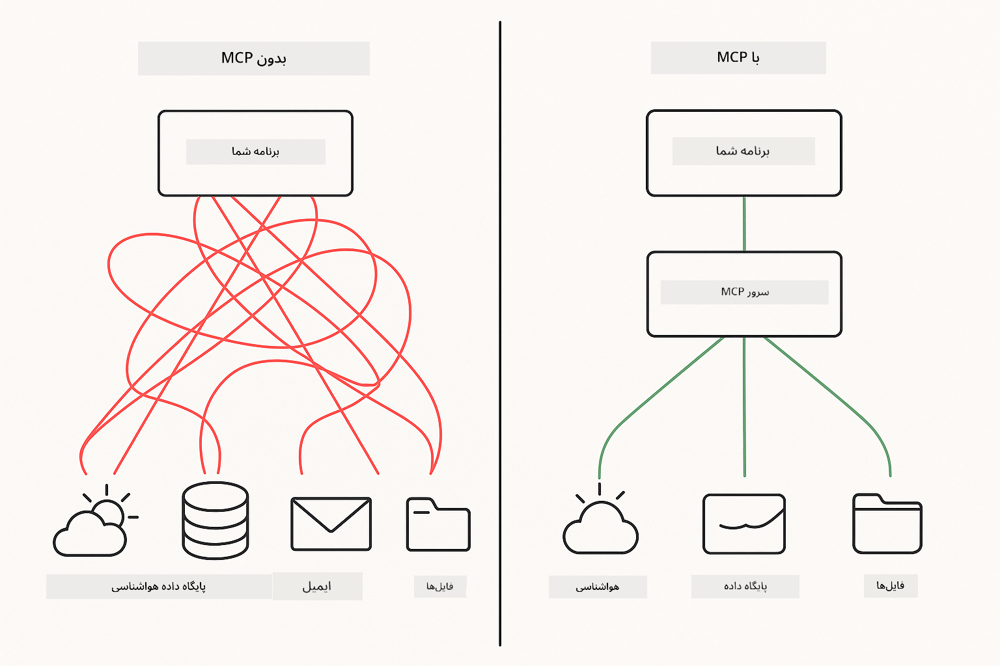
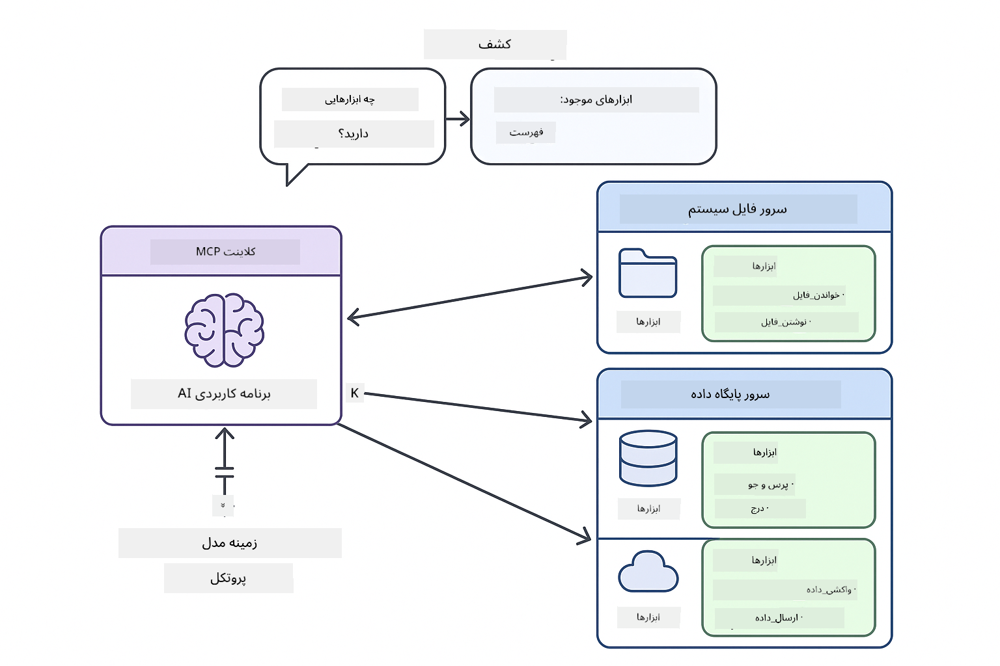

<!--
CO_OP_TRANSLATOR_METADATA:
{
  "original_hash": "c25ec1f10ef156c53e190cdf8b0711ab",
  "translation_date": "2025-12-13T17:38:17+00:00",
  "source_file": "05-mcp/README.md",
  "language_code": "fa"
}
-->
# ماژول ۰۵: پروتکل زمینه مدل (MCP)

## فهرست مطالب

- [آنچه خواهید آموخت](../../../05-mcp)
- [درک MCP](../../../05-mcp)
- [نحوه کار MCP](../../../05-mcp)
  - [معماری سرور-کلاینت](../../../05-mcp)
  - [کشف ابزار](../../../05-mcp)
  - [مکانیزم‌های انتقال](../../../05-mcp)
- [پیش‌نیازها](../../../05-mcp)
- [آنچه این ماژول پوشش می‌دهد](../../../05-mcp)
- [شروع سریع](../../../05-mcp)
  - [مثال ۱: ماشین حساب از راه دور (HTTP قابل پخش)](../../../05-mcp)
  - [مثال ۲: عملیات فایل (Stdio)](../../../05-mcp)
  - [مثال ۳: تحلیل گیت (Docker)](../../../05-mcp)
- [مفاهیم کلیدی](../../../05-mcp)
  - [انتخاب انتقال](../../../05-mcp)
  - [کشف ابزار](../../../05-mcp)
  - [مدیریت جلسه](../../../05-mcp)
  - [ملاحظات چندسکویی](../../../05-mcp)
- [چه زمانی از MCP استفاده کنیم](../../../05-mcp)
- [اکوسیستم MCP](../../../05-mcp)
- [تبریک!](../../../05-mcp)
  - [بعدی چیست؟](../../../05-mcp)
- [عیب‌یابی](../../../05-mcp)

## آنچه خواهید آموخت

شما هوش مصنوعی مکالمه‌ای ساخته‌اید، در مهندسی پرامپت‌ها مهارت یافته‌اید، پاسخ‌ها را در اسناد پایه‌گذاری کرده‌اید و عامل‌هایی با ابزارها ایجاد کرده‌اید. اما همه آن ابزارها به صورت سفارشی برای برنامه خاص شما ساخته شده بودند. اگر می‌توانستید به هوش مصنوعی خود دسترسی به یک اکوسیستم استاندارد از ابزارها بدهید که هر کسی بتواند آن‌ها را بسازد و به اشتراک بگذارد، چه؟

پروتکل زمینه مدل (MCP) دقیقاً همین را فراهم می‌کند - روشی استاندارد برای برنامه‌های هوش مصنوعی برای کشف و استفاده از ابزارهای خارجی. به جای نوشتن ادغام‌های سفارشی برای هر منبع داده یا سرویس، به سرورهای MCP متصل می‌شوید که قابلیت‌های خود را به صورت فرمت یکسان ارائه می‌دهند. عامل هوش مصنوعی شما سپس می‌تواند این ابزارها را به طور خودکار کشف و استفاده کند.



*قبل از MCP: ادغام‌های پیچیده نقطه به نقطه. بعد از MCP: یک پروتکل، امکانات بی‌پایان.*

## درک MCP

MCP یک مشکل اساسی در توسعه هوش مصنوعی را حل می‌کند: هر ادغام سفارشی است. می‌خواهید به GitHub دسترسی داشته باشید؟ کد سفارشی. می‌خواهید فایل‌ها را بخوانید؟ کد سفارشی. می‌خواهید از یک پایگاه داده پرس‌وجو کنید؟ کد سفارشی. و هیچ‌کدام از این ادغام‌ها با برنامه‌های هوش مصنوعی دیگر کار نمی‌کنند.

MCP این را استاندارد می‌کند. یک سرور MCP ابزارها را با توضیحات واضح و اسکیمای پارامترها ارائه می‌دهد. هر کلاینت MCP می‌تواند متصل شود، ابزارهای موجود را کشف کند و از آن‌ها استفاده کند. یک بار بسازید، همه جا استفاده کنید.



*معماری پروتکل زمینه مدل - کشف و اجرای ابزار استاندارد شده*

## نحوه کار MCP

**معماری سرور-کلاینت**

MCP از مدل کلاینت-سرور استفاده می‌کند. سرورها ابزارها را ارائه می‌دهند - خواندن فایل‌ها، پرس‌وجوی پایگاه داده‌ها، فراخوانی APIها. کلاینت‌ها (برنامه هوش مصنوعی شما) به سرورها متصل می‌شوند و از ابزارهای آن‌ها استفاده می‌کنند.

**کشف ابزار**

وقتی کلاینت شما به یک سرور MCP متصل می‌شود، می‌پرسد «چه ابزارهایی دارید؟» سرور با فهرستی از ابزارهای موجود پاسخ می‌دهد، هر کدام با توضیحات و اسکیمای پارامترها. عامل هوش مصنوعی شما سپس می‌تواند بر اساس درخواست کاربر تصمیم بگیرد کدام ابزارها را استفاده کند.

**مکانیزم‌های انتقال**

MCP دو مکانیزم انتقال تعریف می‌کند: HTTP برای سرورهای راه دور، Stdio برای فرآیندهای محلی (شامل کانتینرهای Docker):


*مکانیزم‌های انتقال MCP: HTTP برای سرورهای راه دور، Stdio برای فرآیندهای محلی (شامل کانتینرهای Docker)*

**HTTP قابل پخش** - [StreamableHttpDemo.java](../../../05-mcp/src/main/java/com/example/langchain4j/mcp/StreamableHttpDemo.java)

برای سرورهای راه دور. برنامه شما درخواست‌های HTTP به سروری که در جایی از شبکه اجرا می‌شود ارسال می‌کند. از Server-Sent Events برای ارتباط بلادرنگ استفاده می‌کند.

```java
McpTransport httpTransport = new StreamableHttpMcpTransport.Builder()
    .url("http://localhost:3001/mcp")
    .timeout(Duration.ofSeconds(60))
    .logRequests(true)
    .logResponses(true)
    .build();
```

> **🤖 با [GitHub Copilot](https://github.com/features/copilot) Chat امتحان کنید:** فایل [`StreamableHttpDemo.java`](../../../05-mcp/src/main/java/com/example/langchain4j/mcp/StreamableHttpDemo.java) را باز کنید و بپرسید:
> - "MCP چگونه با ادغام مستقیم ابزار مانند ماژول ۰۴ متفاوت است؟"
> - "مزایای استفاده از MCP برای اشتراک‌گذاری ابزار بین برنامه‌ها چیست؟"
> - "چگونه خطاهای اتصال یا تایم‌اوت به سرورهای MCP را مدیریت کنم؟"

**Stdio** - [StdioTransportDemo.java](../../../05-mcp/src/main/java/com/example/langchain4j/mcp/StdioTransportDemo.java)

برای فرآیندهای محلی. برنامه شما یک سرور به عنوان زیرفرآیند ایجاد می‌کند و از طریق ورودی/خروجی استاندارد با آن ارتباط برقرار می‌کند. برای دسترسی به سیستم فایل یا ابزارهای خط فرمان مفید است.

```java
McpTransport stdioTransport = new StdioMcpTransport.Builder()
    .command(List.of(
        npmCmd, "exec",
        "@modelcontextprotocol/server-filesystem@0.6.2",
        resourcesDir
    ))
    .logEvents(false)
    .build();
```

> **🤖 با [GitHub Copilot](https://github.com/features/copilot) Chat امتحان کنید:** فایل [`StdioTransportDemo.java`](../../../05-mcp/src/main/java/com/example/langchain4j/mcp/StdioTransportDemo.java) را باز کنید و بپرسید:
> - "مکانیزم انتقال Stdio چگونه کار می‌کند و چه زمانی باید به جای HTTP از آن استفاده کنم؟"
> - "LangChain4j چگونه چرخه عمر فرآیندهای سرور MCP ایجاد شده را مدیریت می‌کند؟"
> - "پیامدهای امنیتی دادن دسترسی هوش مصنوعی به سیستم فایل چیست؟"

**Docker (از Stdio استفاده می‌کند)** - [GitRepositoryAnalyzer.java](../../../05-mcp/src/main/java/com/example/langchain4j/mcp/GitRepositoryAnalyzer.java)

برای سرویس‌های کانتینری. از انتقال stdio برای ارتباط با یک کانتینر Docker از طریق `docker run` استفاده می‌کند. برای وابستگی‌های پیچیده یا محیط‌های ایزوله مناسب است.

```java
McpTransport dockerTransport = new StdioMcpTransport.Builder()
    .command(List.of(
        "docker", "run",
        "-e", "GITHUB_PERSONAL_ACCESS_TOKEN=" + System.getenv("GITHUB_TOKEN"),
        "-v", volumeMapping,
        "-i", "mcp/git"
    ))
    .logEvents(true)
    .build();
```

> **🤖 با [GitHub Copilot](https://github.com/features/copilot) Chat امتحان کنید:** فایل [`GitRepositoryAnalyzer.java`](../../../05-mcp/src/main/java/com/example/langchain4j/mcp/GitRepositoryAnalyzer.java) را باز کنید و بپرسید:
> - "مکانیزم انتقال Docker چگونه سرورهای MCP را ایزوله می‌کند و مزایای آن چیست؟"
> - "چگونه حجم‌های mount را برای اشتراک داده بین میزبان و کانتینرهای MCP پیکربندی کنم؟"
> - "بهترین روش‌ها برای مدیریت چرخه عمر سرورهای MCP مبتنی بر Docker در تولید چیست؟"

## اجرای مثال‌ها

### پیش‌نیازها

- جاوا ۲۱ به بالا، Maven 3.9 به بالا
- Node.js 16 به بالا و npm (برای سرورهای MCP)
- **Docker Desktop** - باید **در حال اجرا باشد** برای مثال ۳ (فقط نصب شده کافی نیست)
- توکن دسترسی شخصی GitHub در فایل `.env` پیکربندی شده باشد (از ماژول ۰۰)

> **توجه:** اگر هنوز توکن GitHub خود را تنظیم نکرده‌اید، به [ماژول ۰۰ - شروع سریع](../00-quick-start/README.md) مراجعه کنید.

> **⚠️ کاربران Docker:** قبل از اجرای مثال ۳، با دستور `docker ps` مطمئن شوید Docker Desktop در حال اجراست. اگر خطاهای اتصال دیدید، Docker Desktop را اجرا کنید و حدود ۳۰ ثانیه برای راه‌اندازی صبر کنید.

## شروع سریع

**استفاده از VS Code:** کافی است روی هر فایل دمو در اکسپلورر راست‌کلیک کنید و گزینه **"Run Java"** را انتخاب کنید، یا از پیکربندی‌های اجرا در پنل Run and Debug استفاده کنید (ابتدا توکن خود را به فایل `.env` اضافه کرده باشید).

**استفاده از Maven:** همچنین می‌توانید از خط فرمان با مثال‌های زیر اجرا کنید.

**⚠️ مهم:** برخی مثال‌ها پیش‌نیاز دارند (مانند راه‌اندازی سرور MCP یا ساخت ایمیج‌های Docker). قبل از اجرا، نیازمندی‌های هر مثال را بررسی کنید.

### مثال ۱: ماشین حساب از راه دور (HTTP قابل پخش)

این مثال ادغام ابزار مبتنی بر شبکه را نشان می‌دهد.

**⚠️ پیش‌نیاز:** ابتدا باید سرور MCP را راه‌اندازی کنید (به ترمینال ۱ زیر مراجعه کنید).

**ترمینال ۱ - راه‌اندازی سرور MCP:**

**Bash:**
```bash
git clone https://github.com/modelcontextprotocol/servers.git
cd servers/src/everything
npm install
node dist/streamableHttp.js
```

**PowerShell:**
```powershell
git clone https://github.com/modelcontextprotocol/servers.git
cd servers/src/everything
npm install
node dist/streamableHttp.js
```

**ترمینال ۲ - اجرای مثال:**

**استفاده از VS Code:** روی `StreamableHttpDemo.java` راست‌کلیک کنید و **"Run Java"** را انتخاب کنید.

**استفاده از Maven:**

**Bash:**
```bash
export GITHUB_TOKEN=your_token_here
cd 05-mcp
mvn compile exec:java -Dexec.mainClass=com.example.langchain4j.mcp.StreamableHttpDemo
```

**PowerShell:**
```powershell
$env:GITHUB_TOKEN=your_token_here
cd 05-mcp
mvn --% compile exec:java -Dexec.mainClass=com.example.langchain4j.mcp.StreamableHttpDemo
```

مشاهده کنید که عامل ابزارهای موجود را کشف می‌کند، سپس از ماشین حساب برای انجام جمع استفاده می‌کند.

### مثال ۲: عملیات فایل (Stdio)

این مثال ابزارهای مبتنی بر زیرفرآیند محلی را نشان می‌دهد.

**✅ بدون پیش‌نیاز** - سرور MCP به طور خودکار ایجاد می‌شود.

**استفاده از VS Code:** روی `StdioTransportDemo.java` راست‌کلیک کنید و **"Run Java"** را انتخاب کنید.

**استفاده از Maven:**

**Bash:**
```bash
export GITHUB_TOKEN=your_token_here
cd 05-mcp
mvn compile exec:java -Dexec.mainClass=com.example.langchain4j.mcp.StdioTransportDemo
```

**PowerShell:**
```powershell
$env:GITHUB_TOKEN=your_token_here
cd 05-mcp
mvn --% compile exec:java -Dexec.mainClass=com.example.langchain4j.mcp.StdioTransportDemo
```

برنامه به طور خودکار یک سرور MCP سیستم فایل ایجاد می‌کند و یک فایل محلی را می‌خواند. توجه کنید که مدیریت زیرفرآیند برای شما انجام می‌شود.

**خروجی مورد انتظار:**
```
Assistant response: The content of the file is "Kaboom!".
```

### مثال ۳: تحلیل گیت (Docker)

این مثال سرورهای ابزار کانتینری را نشان می‌دهد.

**⚠️ پیش‌نیازها:** 
1. **Docker Desktop باید در حال اجرا باشد** (فقط نصب شده کافی نیست)
2. **کاربران ویندوز:** حالت WSL 2 توصیه می‌شود (تنظیمات Docker Desktop → General → "Use the WSL 2 based engine"). حالت Hyper-V نیاز به پیکربندی اشتراک فایل دستی دارد.
3. ابتدا باید ایمیج Docker را بسازید (به ترمینال ۱ زیر مراجعه کنید)

**بررسی اجرای Docker:**

**Bash:**
```bash
docker ps  # باید لیست کانتینرها را نشان دهد، نه یک خطا
```

**PowerShell:**
```powershell
docker ps  # باید لیست کانتینرها را نشان دهد، نه یک خطا
```

اگر خطایی مانند "Cannot connect to Docker daemon" یا "The system cannot find the file specified" دیدید، Docker Desktop را اجرا کنید و حدود ۳۰ ثانیه برای راه‌اندازی صبر کنید.

**عیب‌یابی:**
- اگر هوش مصنوعی مخزن خالی یا بدون فایل گزارش می‌دهد، mount حجم (`-v`) کار نمی‌کند.
- **کاربران Hyper-V ویندوز:** دایرکتوری پروژه را به تنظیمات Docker Desktop → Resources → File sharing اضافه کنید، سپس Docker Desktop را ری‌استارت کنید.
- **راه‌حل پیشنهادی:** به حالت WSL 2 برای اشتراک فایل خودکار سوئیچ کنید (تنظیمات → General → فعال کردن "Use the WSL 2 based engine").

**ترمینال ۱ - ساخت ایمیج Docker:**

**Bash:**
```bash
cd servers/src/git
docker build -t mcp/git .
```

**PowerShell:**
```powershell
cd servers/src/git
docker build -t mcp/git .
```

**ترمینال ۲ - اجرای تحلیلگر:**

**استفاده از VS Code:** روی `GitRepositoryAnalyzer.java` راست‌کلیک کنید و **"Run Java"** را انتخاب کنید.

**استفاده از Maven:**

**Bash:**
```bash
export GITHUB_TOKEN=your_token_here
cd 05-mcp
mvn compile exec:java -Dexec.mainClass=com.example.langchain4j.mcp.GitRepositoryAnalyzer
```

**PowerShell:**
```powershell
$env:GITHUB_TOKEN=your_token_here
cd 05-mcp
mvn --% compile exec:java -Dexec.mainClass=com.example.langchain4j.mcp.GitRepositoryAnalyzer
```

برنامه یک کانتینر Docker راه‌اندازی می‌کند، مخزن شما را mount می‌کند و ساختار و محتوای مخزن را از طریق عامل هوش مصنوعی تحلیل می‌کند.

## مفاهیم کلیدی

**انتخاب انتقال**

بر اساس محل قرارگیری ابزارها انتخاب کنید:
- سرویس‌های راه دور → HTTP قابل پخش
- سیستم فایل محلی → Stdio
- وابستگی‌های پیچیده → Docker

**کشف ابزار**

کلاینت‌های MCP هنگام اتصال به طور خودکار ابزارهای موجود را کشف می‌کنند. عامل هوش مصنوعی شما توضیحات ابزارها را می‌بیند و بر اساس درخواست کاربر تصمیم می‌گیرد کدام‌ها را استفاده کند.

**مدیریت جلسه**

انتقال HTTP قابل پخش جلسات را حفظ می‌کند و امکان تعامل حالت‌دار با سرورهای راه دور را می‌دهد. انتقال‌های Stdio و Docker معمولاً بدون حالت هستند.

**ملاحظات چندسکویی**

مثال‌ها به طور خودکار تفاوت‌های پلتفرم را مدیریت می‌کنند (تفاوت‌های دستورات ویندوز و یونیکس، تبدیل مسیرها برای Docker). این برای استقرار در محیط‌های مختلف مهم است.

## چه زمانی از MCP استفاده کنیم

**از MCP استفاده کنید وقتی:**
- می‌خواهید از اکوسیستم ابزارهای موجود بهره ببرید
- در حال ساخت ابزارهایی هستید که چندین برنامه استفاده خواهند کرد
- در حال ادغام سرویس‌های شخص ثالث با پروتکل‌های استاندارد هستید
- نیاز دارید پیاده‌سازی ابزارها را بدون تغییر کد عوض کنید

**از ابزارهای سفارشی (ماژول ۰۴) استفاده کنید وقتی:**
- در حال ساخت قابلیت‌های خاص برنامه هستید
- عملکرد حیاتی است (MCP بار اضافی دارد)
- ابزارهای شما ساده هستند و دوباره استفاده نمی‌شوند
- نیاز به کنترل کامل روی اجرا دارید

## اکوسیستم MCP

پروتکل زمینه مدل یک استاندارد باز با اکوسیستم در حال رشد است:

- سرورهای رسمی MCP برای وظایف رایج (سیستم فایل، گیت، پایگاه داده‌ها)
- سرورهای مشارکتی جامعه برای خدمات مختلف
- توضیحات و اسکیمای ابزار استاندارد شده
- سازگاری بین چارچوب‌ها (با هر کلاینت MCP کار می‌کند)

این استانداردسازی به این معنی است که ابزارهای ساخته شده برای یک برنامه هوش مصنوعی با برنامه‌های دیگر کار می‌کنند و اکوسیستم مشترکی از قابلیت‌ها ایجاد می‌کنند.

## تبریک!

شما دوره LangChain4j برای مبتدیان را به پایان رسانده‌اید. آموخته‌اید:

- چگونه هوش مصنوعی مکالمه‌ای با حافظه بسازید (ماژول ۰۱)
- الگوهای مهندسی پرامپت برای وظایف مختلف (ماژول ۰۲)
- پایه‌گذاری پاسخ‌ها در اسناد با RAG (ماژول ۰۳)
- ایجاد عامل‌های هوش مصنوعی با ابزارهای سفارشی (ماژول ۰۴)
- ادغام ابزارهای استاندارد شده از طریق MCP (ماژول ۰۵)

اکنون پایه لازم برای ساخت برنامه‌های هوش مصنوعی تولیدی را دارید. مفاهیمی که آموخته‌اید فارغ از چارچوب‌ها یا مدل‌های خاص هستند - آن‌ها الگوهای بنیادی در مهندسی هوش مصنوعی‌اند.

### بعدی چیست؟

پس از اتمام ماژول‌ها، راهنمای [آزمون](../docs/TESTING.md) را بررسی کنید تا مفاهیم تست LangChain4j را در عمل ببینید.

**منابع رسمی:**
- [مستندات LangChain4j](https://docs.langchain4j.dev/) - راهنماهای جامع و مرجع API
- [گیت‌هاب LangChain4j](https://github.com/langchain4j/langchain4j) - کد منبع و مثال‌ها
- [آموزش‌های LangChain4j](https://docs.langchain4j.dev/tutorials/) - آموزش‌های گام به گام برای موارد مختلف استفاده

از اینکه این دوره را به پایان رساندید سپاسگزاریم!

---

**ناوبری:** [← قبلی: ماژول ۰۴ - ابزارها](../04-tools/README.md) | [بازگشت به اصلی](../README.md)

---

## عیب‌یابی

### نحو دستور Maven در PowerShell
**مشکل**: دستورات Maven با خطای `Unknown lifecycle phase ".mainClass=..."` شکست می‌خورند

**علت**: PowerShell علامت `=` را به عنوان عملگر انتساب متغیر تفسیر می‌کند که باعث شکستن نحو ویژگی Maven می‌شود

**راه‌حل**: از عملگر توقف تجزیه `--%` قبل از دستور Maven استفاده کنید:

**PowerShell:**
```powershell
mvn --% compile exec:java -Dexec.mainClass=com.example.langchain4j.mcp.StreamableHttpDemo
```

**Bash:**
```bash
mvn compile exec:java -Dexec.mainClass=com.example.langchain4j.mcp.StreamableHttpDemo
```

عملگر `--%` به PowerShell می‌گوید که تمام آرگومان‌های باقی‌مانده را به صورت دقیق و بدون تفسیر به Maven ارسال کند.

### مشکلات اتصال Docker

**مشکل**: دستورات Docker با خطای "Cannot connect to Docker daemon" یا "The system cannot find the file specified" شکست می‌خورند

**علت**: Docker Desktop در حال اجرا نیست یا به طور کامل راه‌اندازی نشده است

**راه‌حل**: 
1. Docker Desktop را راه‌اندازی کنید
2. حدود ۳۰ ثانیه برای راه‌اندازی کامل صبر کنید
3. با دستور `docker ps` بررسی کنید (باید لیست کانتینرها را نشان دهد، نه خطا)
4. سپس مثال خود را اجرا کنید

### نصب حجم Docker در ویندوز

**مشکل**: تحلیل‌گر مخزن Git گزارش می‌دهد که مخزن خالی است یا فایلی وجود ندارد

**علت**: نصب حجم (`-v`) به دلیل پیکربندی اشتراک فایل کار نمی‌کند

**راه‌حل**:
- **توصیه شده:** به حالت WSL 2 سوئیچ کنید (تنظیمات Docker Desktop → General → "Use the WSL 2 based engine")
- **جایگزین (Hyper-V):** دایرکتوری پروژه را به تنظیمات Docker Desktop → Resources → File sharing اضافه کنید، سپس Docker Desktop را مجدداً راه‌اندازی کنید

---

<!-- CO-OP TRANSLATOR DISCLAIMER START -->
**سلب مسئولیت**:  
این سند با استفاده از سرویس ترجمه هوش مصنوعی [Co-op Translator](https://github.com/Azure/co-op-translator) ترجمه شده است. در حالی که ما در تلاش برای دقت هستیم، لطفاً توجه داشته باشید که ترجمه‌های خودکار ممکن است حاوی خطاها یا نادرستی‌هایی باشند. سند اصلی به زبان بومی خود باید به عنوان منبع معتبر در نظر گرفته شود. برای اطلاعات حیاتی، ترجمه حرفه‌ای انسانی توصیه می‌شود. ما مسئول هیچ گونه سوءتفاهم یا تفسیر نادرستی که از استفاده این ترجمه ناشی شود، نیستیم.
<!-- CO-OP TRANSLATOR DISCLAIMER END -->