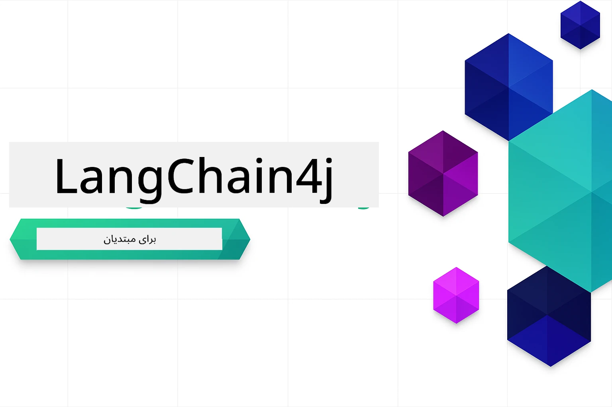

# LangChain4j برای مبتدیان

دوره‌ای برای ساخت برنامه‌های هوش مصنوعی با LangChain4j و Azure OpenAI GPT-5.2، از چت پایه تا عوامل هوش مصنوعی.

### 🌐 پشتیبانی چندزبانه

#### پشتیبانی از طریق GitHub Action (خودکار و همیشه به‌روز)

<!-- CO-OP TRANSLATOR LANGUAGES TABLE START -->
[Arabic](../ar/README.md) | [Bengali](../bn/README.md) | [Bulgarian](../bg/README.md) | [Burmese (Myanmar)](../my/README.md) | [Chinese (Simplified)](../zh-CN/README.md) | [Chinese (Traditional, Hong Kong)](../zh-HK/README.md) | [Chinese (Traditional, Macau)](../zh-MO/README.md) | [Chinese (Traditional, Taiwan)](../zh-TW/README.md) | [Croatian](../hr/README.md) | [Czech](../cs/README.md) | [Danish](../da/README.md) | [Dutch](../nl/README.md) | [Estonian](../et/README.md) | [Finnish](../fi/README.md) | [French](../fr/README.md) | [German](../de/README.md) | [Greek](../el/README.md) | [Hebrew](../he/README.md) | [Hindi](../hi/README.md) | [Hungarian](../hu/README.md) | [Indonesian](../id/README.md) | [Italian](../it/README.md) | [Japanese](../ja/README.md) | [Kannada](../kn/README.md) | [Khmer](../km/README.md) | [Korean](../ko/README.md) | [Lithuanian](../lt/README.md) | [Malay](../ms/README.md) | [Malayalam](../ml/README.md) | [Marathi](../mr/README.md) | [Nepali](../ne/README.md) | [Nigerian Pidgin](../pcm/README.md) | [Norwegian](../no/README.md) | [Persian (Farsi)](./README.md) | [Polish](../pl/README.md) | [Portuguese (Brazil)](../pt-BR/README.md) | [Portuguese (Portugal)](../pt-PT/README.md) | [Punjabi (Gurmukhi)](../pa/README.md) | [Romanian](../ro/README.md) | [Russian](../ru/README.md) | [Serbian (Cyrillic)](../sr/README.md) | [Slovak](../sk/README.md) | [Slovenian](../sl/README.md) | [Spanish](../es/README.md) | [Swahili](../sw/README.md) | [Swedish](../sv/README.md) | [Tagalog (Filipino)](../tl/README.md) | [Tamil](../ta/README.md) | [Telugu](../te/README.md) | [Thai](../th/README.md) | [Turkish](../tr/README.md) | [Ukrainian](../uk/README.md) | [Urdu](../ur/README.md) | [Vietnamese](../vi/README.md)

> **ترجیح می‌دهید به صورت محلی کلون کنید؟**
>
> این مخزن شامل بیش از ۵۰ ترجمه زبانی است که حجم دانلود را به طور قابل توجهی افزایش می‌دهد. برای کلون بدون ترجمه‌ها، از sparse checkout استفاده کنید:
>
> **Bash / macOS / Linux:**
> ```bash
> git clone --filter=blob:none --sparse https://github.com/microsoft/LangChain4j-for-Beginners.git
> cd LangChain4j-for-Beginners
> git sparse-checkout set --no-cone '/*' '!translations' '!translated_images'
> ```
>
> **CMD (Windows):**
> ```cmd
> git clone --filter=blob:none --sparse https://github.com/microsoft/LangChain4j-for-Beginners.git
> cd LangChain4j-for-Beginners
> git sparse-checkout set --no-cone "/*" "!translations" "!translated_images"
> ```
>
> این به شما همه چیز را می‌دهد تا دوره را با سرعت دانلود بسیار سریع‌تر به پایان برسانید.
<!-- CO-OP TRANSLATOR LANGUAGES TABLE END -->

## فهرست مطالب

1. [مقدمه](01-introduction/README.md) - اصول اولیه LangChain4j را بیاموزید
2. [مهندسی پرامپت](02-prompt-engineering/README.md) - طراحی مؤثر پرامپت را فرا بگیرید
3. [RAG (تولید تکمیل‌شده با بازیابی)](03-rag/README.md) - ساخت سیستم‌های هوشمند مبتنی بر دانش
4. [ابزارها](04-tools/README.md) - ادغام ابزارهای خارجی و دستیارهای ساده
5. [MCP (پروتکل زمینه مدل)](05-mcp/README.md) - کار با پروتکل زمینه مدل (MCP) و ماژول‌های عامل

### آموزش‌های ویدیویی

هر ماژول یک جلسه زنده همراه دارد که در آن مفاهیم و کد گام به گام آموزش داده می‌شود.

| ماژول | ویدیو |
|--------|-------|
| ۰۱ - مقدمه | [شروع کار با LangChain4j](https://www.youtube.com/live/nl_troDm8rQ) |
| ۰۲ - مهندسی پرامپت | [مهندسی پرامپت با LangChain4j](https://www.youtube.com/live/PJ6aBaE6bog) |
| ۰۳ - RAG | [RAG با LangChain4j](https://www.youtube.com/watch?v=_olq75ZH_eY) |
| ۰۴ - ابزارها و ۰۵ - MCP | [عوامل هوش مصنوعی با ابزارها و MCP](https://www.youtube.com/watch?v=O_J30kZc0rw) |

---

## مسیر یادگیری

**تازه‌کار در LangChain4j؟** برای تعریف اصطلاحات و مفاهیم کلیدی به [واژه‌نامه](docs/GLOSSARY.md) مراجعه کنید.

> **شروع سریع**

1. این مخزن را به حساب GitHub خود فورک کنید
2. روی **Code** → برگه **Codespaces** → **...** → **New with options...** کلیک کنید
3. از تنظیمات پیش‌فرض استفاده کنید – این گزینه کانتینر توسعه ایجاد شده برای این دوره را انتخاب می‌کند
4. روی **Create codespace** کلیک کنید
5. ۵ تا ۱۰ دقیقه منتظر بمانید تا محیط آماده شود
6. مستقیم به [مقدمه](./01-introduction/README.md) بروید و شروع کنید!

پس از تکمیل ماژول‌ها، به [راهنمای تست](docs/TESTING.md) مراجعه کنید تا مفاهیم تست LangChain4j را در عمل مشاهده کنید.

> **توجه:** این آموزش از Azure OpenAI استفاده می‌کند. اگر حساب Azure رایگان ندارید، با یک [حساب رایگان Azure](https://aka.ms/azure-free-account) شروع کنید.


## یادگیری با GitHub Copilot

برای شروع سریع برنامه‌نویسی، این پروژه را در GitHub Codespace یا IDE محلی خود با devcontainer ارائه شده باز کنید. devcontainer استفاده شده در این دوره از قبل با GitHub Copilot برای برنامه‌نویسی هوش مصنوعی همراه پیکربندی شده است.

هر مثال کد شامل پرسش‌هایی است که می‌توانید از GitHub Copilot بپرسید تا فهم خود را عمیق‌تر کنید. به دنبال علامت‌های 💡/🤖 در:

- **سرصفحه فایل‌های جاوا** - سوالات خاص هر مثال
- **README ماژول‌ها** - پیشنهادهای کشف پس از مثال‌های کد

**نحوه استفاده:** هر فایل کد را باز کنید و سوالات پیشنهادی را از Copilot بپرسید. او کاملاً با کد آشنا است و می‌تواند توضیح دهد، گسترش دهد و پیشنهادهایی بدهد.

می‌خواهید بیشتر یاد بگیرید؟ به [Copilot برای برنامه‌نویسی هوش مصنوعی همراه](https://aka.ms/GitHubCopilotAI) مراجعه کنید.


## منابع اضافی

<!-- CO-OP TRANSLATOR OTHER COURSES START -->
### LangChain
[](https://aka.ms/langchain4j-for-beginners)
[](https://aka.ms/langchainjs-for-beginners?WT.mc_id=m365-94501-dwahlin)
[](https://github.com/microsoft/langchain-for-beginners?WT.mc_id=m365-94501-dwahlin)
---

### Azure / Edge / MCP / Agents
[](https://github.com/microsoft/AZD-for-beginners?WT.mc_id=academic-105485-koreyst)
[](https://github.com/microsoft/edgeai-for-beginners?WT.mc_id=academic-105485-koreyst)
[](https://github.com/microsoft/mcp-for-beginners?WT.mc_id=academic-105485-koreyst)
[](https://github.com/microsoft/ai-agents-for-beginners?WT.mc_id=academic-105485-koreyst)

---
 
### سری هوش مصنوعی مولد
[](https://github.com/microsoft/generative-ai-for-beginners?WT.mc_id=academic-105485-koreyst)
[-9333EA?style=for-the-badge&labelColor=E5E7EB&color=9333EA)](https://github.com/microsoft/Generative-AI-for-beginners-dotnet?WT.mc_id=academic-105485-koreyst)
[-C084FC?style=for-the-badge&labelColor=E5E7EB&color=C084FC)](https://github.com/microsoft/generative-ai-for-beginners-java?WT.mc_id=academic-105485-koreyst)
[-E879F9?style=for-the-badge&labelColor=E5E7EB&color=E879F9)](https://github.com/microsoft/generative-ai-with-javascript?WT.mc_id=academic-105485-koreyst)

---
 
### یادگیری پایه
[](https://aka.ms/ml-beginners?WT.mc_id=academic-105485-koreyst)
[](https://aka.ms/datascience-beginners?WT.mc_id=academic-105485-koreyst)
[](https://aka.ms/ai-beginners?WT.mc_id=academic-105485-koreyst)
[](https://github.com/microsoft/Security-101?WT.mc_id=academic-96948-sayoung)
[](https://aka.ms/webdev-beginners?WT.mc_id=academic-105485-koreyst)
[](https://aka.ms/iot-beginners?WT.mc_id=academic-105485-koreyst)
[](https://github.com/microsoft/xr-development-for-beginners?WT.mc_id=academic-105485-koreyst)

---

### مجموعه Copilot
[](https://aka.ms/GitHubCopilotAI?WT.mc_id=academic-105485-koreyst)
[](https://github.com/microsoft/mastering-github-copilot-for-dotnet-csharp-developers?WT.mc_id=academic-105485-koreyst)
[](https://github.com/microsoft/CopilotAdventures?WT.mc_id=academic-105485-koreyst)
<!-- CO-OP TRANSLATOR OTHER COURSES END -->

## دریافت کمک

اگر به مشکلی برخوردید یا سوالی درباره ساخت برنامه‌های هوش مصنوعی داشتید، بپیوندید به:

[](https://aka.ms/foundry/discord)

اگر بازخورد محصول یا خطاهایی هنگام ساخت داشتید، مراجعه کنید به:

[](https://aka.ms/foundry/forum)

## مجوز

مجوز MIT - جزئیات را در فایل [LICENSE](../../LICENSE) ببینید.

---

<!-- CO-OP TRANSLATOR DISCLAIMER START -->
**سلب مسئولیت**:
این سند با استفاده از سرویس ترجمه هوش مصنوعی [Co-op Translator](https://github.com/Azure/co-op-translator) ترجمه شده است. در حالی که ما در تلاش برای دقت هستیم، لطفاً توجه داشته باشید که ترجمه‌های خودکار ممکن است شامل خطاها یا نادرستی‌هایی باشند. سند اصلی به زبان مادری خود باید به عنوان منبع معتبر در نظر گرفته شود. برای اطلاعات حیاتی، ترجمه حرفه‌ای انسانی توصیه می‌شود. ما در قبال هرگونه سوء تفاهم یا برداشت نادرست ناشی از استفاده از این ترجمه مسئولیتی نداریم.
<!-- CO-OP TRANSLATOR DISCLAIMER END -->