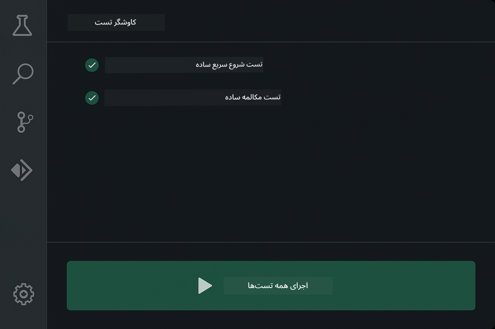
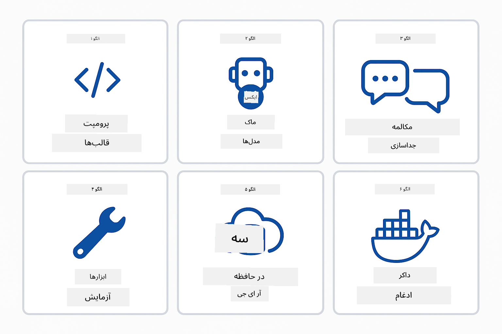
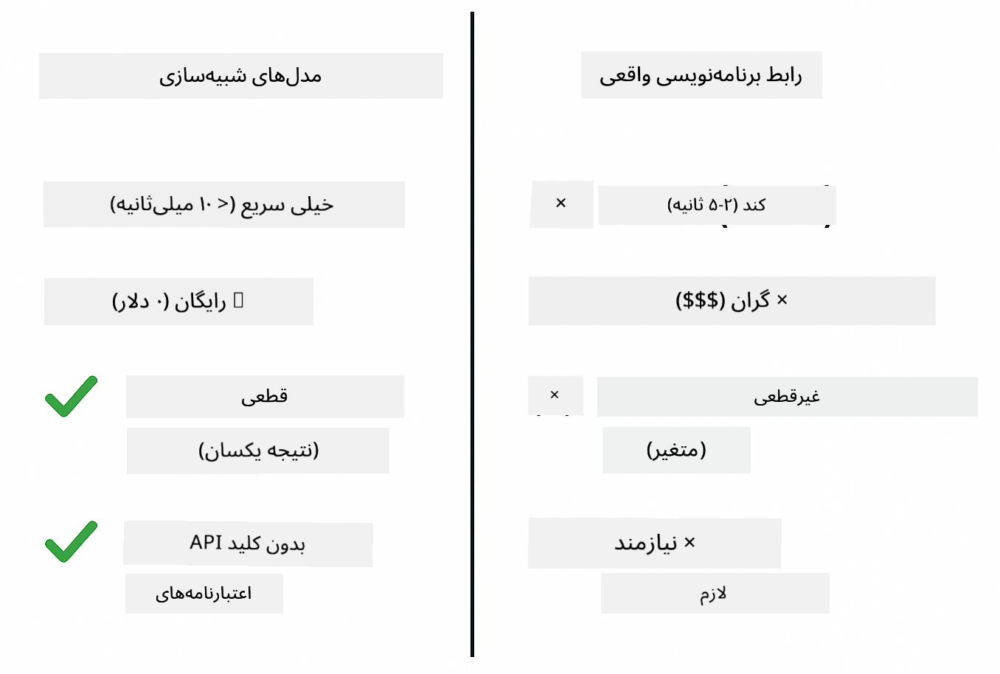
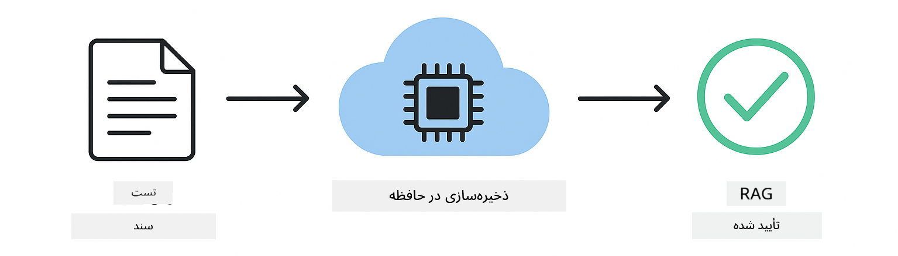

<!--
CO_OP_TRANSLATOR_METADATA:
{
  "original_hash": "b975537560c404d5f254331832811e78",
  "translation_date": "2025-12-13T20:38:18+00:00",
  "source_file": "docs/TESTING.md",
  "language_code": "fa"
}
-->
# آزمایش برنامه‌های LangChain4j

## فهرست مطالب

- [شروع سریع](../../../docs)
- [موارد تحت پوشش تست‌ها](../../../docs)
- [اجرای تست‌ها](../../../docs)
- [اجرای تست‌ها در VS Code](../../../docs)
- [الگوهای تست](../../../docs)
- [فلسفه تست](../../../docs)
- [گام‌های بعدی](../../../docs)

این راهنما شما را از طریق تست‌هایی که نشان می‌دهند چگونه برنامه‌های هوش مصنوعی را بدون نیاز به کلیدهای API یا سرویس‌های خارجی تست کنید، راهنمایی می‌کند.

## شروع سریع

تمام تست‌ها را با یک دستور اجرا کنید:

**Bash:**
```bash
mvn test
```

**PowerShell:**
```powershell
mvn --% test
```


*اجرای موفق تست‌ها که نشان می‌دهد همه تست‌ها بدون خطا گذرانده شده‌اند*

## موارد تحت پوشش تست‌ها

این دوره بر روی **تست‌های واحد** که به صورت محلی اجرا می‌شوند تمرکز دارد. هر تست یک مفهوم خاص از LangChain4j را به صورت جداگانه نشان می‌دهد.


*هرم تست که تعادل بین تست‌های واحد (سریع، جداگانه)، تست‌های یکپارچه‌سازی (کامپوننت‌های واقعی) و تست‌های انتها به انتها (کل سیستم با داکر) را نشان می‌دهد. این آموزش بر تست واحد تمرکز دارد.*

| ماژول | تست‌ها | تمرکز | فایل‌های کلیدی |
|--------|-------|-------|-----------|
| **00 - شروع سریع** | 6 | قالب‌های پرامپت و جایگزینی متغیرها | `SimpleQuickStartTest.java` |
| **01 - معرفی** | 8 | حافظه مکالمه و چت حالت‌دار | `SimpleConversationTest.java` |
| **02 - مهندسی پرامپت** | 12 | الگوهای GPT-5، سطوح اشتیاق، خروجی ساختاریافته | `SimpleGpt5PromptTest.java` |
| **03 - RAG** | 10 | دریافت اسناد، جاسازی‌ها، جستجوی شباهت | `DocumentServiceTest.java` |
| **04 - ابزارها** | 12 | فراخوانی توابع و زنجیره ابزارها | `SimpleToolsTest.java` |
| **05 - MCP** | 15 | پروتکل زمینه مدل با داکر | `SimpleMcpTest.java`, `McpDockerTransportTest.java` |

## اجرای تست‌ها

**اجرای همه تست‌ها از ریشه:**

**Bash:**
```bash
mvn test
```

**PowerShell:**
```powershell
mvn --% test
```

**اجرای تست‌ها برای یک ماژول خاص:**

**Bash:**
```bash
cd 01-introduction && mvn test
# یا از ریشه
mvn test -pl 01-introduction
```

**PowerShell:**
```powershell
cd 01-introduction; mvn --% test
# یا از ریشه
mvn --% test -pl 01-introduction
```

**اجرای یک کلاس تست واحد:**

**Bash:**
```bash
mvn test -Dtest=SimpleConversationTest
```

**PowerShell:**
```powershell
mvn --% test -Dtest=SimpleConversationTest
```

**اجرای یک متد تست خاص:**

**Bash:**
```bash
mvn test -Dtest=SimpleConversationTest#باید سابقه مکالمه حفظ شود
```

**PowerShell:**
```powershell
mvn --% test -Dtest=SimpleConversationTest#باید سابقه مکالمه حفظ شود
```

## اجرای تست‌ها در VS Code

اگر از Visual Studio Code استفاده می‌کنید، Test Explorer یک رابط گرافیکی برای اجرای تست‌ها و اشکال‌زدایی آن‌ها فراهم می‌کند.



*کاوشگر تست VS Code که درخت تست را با همه کلاس‌های تست جاوا و متدهای تست جداگانه نشان می‌دهد*

**برای اجرای تست‌ها در VS Code:**

1. با کلیک روی آیکون بشر در نوار فعالیت، Test Explorer را باز کنید
2. درخت تست را باز کنید تا همه ماژول‌ها و کلاس‌های تست را ببینید
3. روی دکمه پخش کنار هر تست کلیک کنید تا به صورت جداگانه اجرا شود
4. روی "Run All Tests" کلیک کنید تا کل مجموعه اجرا شود
5. روی هر تست راست‌کلیک کرده و "Debug Test" را انتخاب کنید تا نقاط توقف تنظیم و کد را مرحله به مرحله اجرا کنید

کاوشگر تست علامت‌های تیک سبز برای تست‌های موفق نشان می‌دهد و پیام‌های خطای دقیق هنگام شکست تست‌ها ارائه می‌دهد.

## الگوهای تست



*شش الگوی تست برای برنامه‌های LangChain4j: قالب‌های پرامپت، مدل‌های ساختگی، جداسازی مکالمه، تست ابزارها، RAG در حافظه، و یکپارچه‌سازی داکر*

### الگو 1: تست قالب‌های پرامپت

ساده‌ترین الگو قالب‌های پرامپت را بدون فراخوانی هیچ مدل هوش مصنوعی تست می‌کند. شما بررسی می‌کنید که جایگزینی متغیرها به درستی انجام می‌شود و پرامپت‌ها به شکل مورد انتظار قالب‌بندی شده‌اند.


*تست قالب‌های پرامپت که جریان جایگزینی متغیرها را نشان می‌دهد: قالب با جایگزین‌ها → مقادیر اعمال شده → خروجی قالب‌بندی شده تأیید شده*

```java
@Test
@DisplayName("Should format prompt template with variables")
void testPromptTemplateFormatting() {
    PromptTemplate template = PromptTemplate.from(
        "Best time to visit {{destination}} for {{activity}}?"
    );
    
    Prompt prompt = template.apply(Map.of(
        "destination", "Paris",
        "activity", "sightseeing"
    ));
    
    assertThat(prompt.text()).isEqualTo("Best time to visit Paris for sightseeing?");
}
```

این تست در `00-quick-start/src/test/java/com/example/langchain4j/quickstart/SimpleQuickStartTest.java` قرار دارد.

**اجرای آن:**

**Bash:**
```bash
cd 00-quick-start && mvn test -Dtest=SimpleQuickStartTest#قالب‌بندی الگوی درخواست آزمایشی
```

**PowerShell:**
```powershell
cd 00-quick-start; mvn --% test -Dtest=SimpleQuickStartTest#قالب‌بندی_الگوی_پرومپت_آزمایشی
```

### الگو 2: ساخت مدل‌های زبان ساختگی

هنگام تست منطق مکالمه، از Mockito برای ایجاد مدل‌های جعلی استفاده کنید که پاسخ‌های از پیش تعیین شده را برمی‌گردانند. این باعث می‌شود تست‌ها سریع، رایگان و قطعی باشند.



*مقایسه‌ای که نشان می‌دهد چرا مدل‌های ساختگی برای تست ترجیح داده می‌شوند: سریع، رایگان، قطعی و بدون نیاز به کلید API*

```java
@ExtendWith(MockitoExtension.class)
class SimpleConversationTest {
    
    private ConversationService conversationService;
    
    @Mock
    private OpenAiOfficialChatModel mockChatModel;
    
    @BeforeEach
    void setUp() {
        ChatResponse mockResponse = ChatResponse.builder()
            .aiMessage(AiMessage.from("This is a test response"))
            .build();
        when(mockChatModel.chat(anyList())).thenReturn(mockResponse);
        
        conversationService = new ConversationService(mockChatModel);
    }
    
    @Test
    void shouldMaintainConversationHistory() {
        String conversationId = conversationService.startConversation();
        
        ChatResponse mockResponse1 = ChatResponse.builder()
            .aiMessage(AiMessage.from("Response 1"))
            .build();
        ChatResponse mockResponse2 = ChatResponse.builder()
            .aiMessage(AiMessage.from("Response 2"))
            .build();
        ChatResponse mockResponse3 = ChatResponse.builder()
            .aiMessage(AiMessage.from("Response 3"))
            .build();
        
        when(mockChatModel.chat(anyList()))
            .thenReturn(mockResponse1)
            .thenReturn(mockResponse2)
            .thenReturn(mockResponse3);

        conversationService.chat(conversationId, "First message");
        conversationService.chat(conversationId, "Second message");
        conversationService.chat(conversationId, "Third message");

        List<ChatMessage> history = conversationService.getHistory(conversationId);
        assertThat(history).hasSize(6); // ۳ پیام کاربر + ۳ پیام هوش مصنوعی
    }
}
```

این الگو در `01-introduction/src/test/java/com/example/langchain4j/service/SimpleConversationTest.java` ظاهر می‌شود. مدل ساختگی رفتار یکنواخت را تضمین می‌کند تا بتوانید مدیریت حافظه را به درستی بررسی کنید.

### الگو 3: تست جداسازی مکالمه

حافظه مکالمه باید کاربران مختلف را جدا نگه دارد. این تست تأیید می‌کند که مکالمات زمینه‌ها را مخلوط نمی‌کنند.


*تست جداسازی مکالمه که فروشگاه‌های حافظه جداگانه برای کاربران مختلف را نشان می‌دهد تا از مخلوط شدن زمینه جلوگیری شود*

```java
@Test
void shouldIsolateConversationsByid() {
    String conv1 = conversationService.startConversation();
    String conv2 = conversationService.startConversation();
    
    ChatResponse mockResponse = ChatResponse.builder()
        .aiMessage(AiMessage.from("Response"))
        .build();
    when(mockChatModel.chat(anyList())).thenReturn(mockResponse);

    conversationService.chat(conv1, "Message for conversation 1");
    conversationService.chat(conv2, "Message for conversation 2");

    List<ChatMessage> history1 = conversationService.getHistory(conv1);
    List<ChatMessage> history2 = conversationService.getHistory(conv2);
    
    assertThat(history1).hasSize(2);
    assertThat(history2).hasSize(2);
}
```

هر مکالمه تاریخچه مستقل خود را حفظ می‌کند. در سیستم‌های تولید، این جداسازی برای برنامه‌های چندکاربره حیاتی است.

### الگو 4: تست مستقل ابزارها

ابزارها توابعی هستند که هوش مصنوعی می‌تواند فراخوانی کند. آن‌ها را مستقیماً تست کنید تا مطمئن شوید بدون توجه به تصمیمات هوش مصنوعی به درستی کار می‌کنند.


*تست مستقل ابزارها که اجرای ابزارهای ساختگی بدون فراخوانی هوش مصنوعی را نشان می‌دهد تا منطق کسب‌وکار تأیید شود*

```java
@Test
void shouldConvertCelsiusToFahrenheit() {
    TemperatureTool tempTool = new TemperatureTool();
    String result = tempTool.celsiusToFahrenheit(25.0);
    assertThat(result).containsPattern("77[.,]0°F");
}

@Test
void shouldDemonstrateToolChaining() {
    WeatherTool weatherTool = new WeatherTool();
    TemperatureTool tempTool = new TemperatureTool();

    String weatherResult = weatherTool.getCurrentWeather("Seattle");
    assertThat(weatherResult).containsPattern("\\d+°C");

    String conversionResult = tempTool.celsiusToFahrenheit(22.0);
    assertThat(conversionResult).containsPattern("71[.,]6°F");
}
```

این تست‌ها از `04-tools/src/test/java/com/example/langchain4j/agents/tools/SimpleToolsTest.java` منطق ابزار را بدون دخالت هوش مصنوعی اعتبارسنجی می‌کنند. مثال زنجیره‌ای نشان می‌دهد چگونه خروجی یک ابزار به ورودی ابزار دیگر می‌رود.

### الگو 5: تست RAG در حافظه

سیستم‌های RAG معمولاً به پایگاه داده‌های برداری و سرویس‌های جاسازی نیاز دارند. الگوی در حافظه به شما اجازه می‌دهد کل خط لوله را بدون وابستگی‌های خارجی تست کنید.



*جریان کاری تست RAG در حافظه که تجزیه سند، ذخیره جاسازی و جستجوی شباهت را بدون نیاز به پایگاه داده نشان می‌دهد*

```java
@Test
void testProcessTextDocument() {
    String content = "This is a test document.\nIt has multiple lines.";
    InputStream inputStream = new ByteArrayInputStream(content.getBytes(StandardCharsets.UTF_8));
    
    DocumentService.ProcessedDocument result = 
        documentService.processDocument(inputStream, "test.txt");

    assertNotNull(result);
    assertTrue(result.segments().size() > 0);
    assertEquals("test.txt", result.segments().get(0).metadata().getString("filename"));
}
```

این تست از `03-rag/src/test/java/com/example/langchain4j/rag/service/DocumentServiceTest.java` یک سند در حافظه ایجاد می‌کند و تقسیم‌بندی و مدیریت فراداده را تأیید می‌کند.

### الگو 6: تست یکپارچه‌سازی با داکر

برخی ویژگی‌ها به زیرساخت واقعی نیاز دارند. ماژول MCP از Testcontainers برای راه‌اندازی کانتینرهای داکر برای تست‌های یکپارچه‌سازی استفاده می‌کند. این‌ها اعتبار می‌دهند که کد شما با سرویس‌های واقعی کار می‌کند در حالی که جداسازی تست حفظ می‌شود.


*تست یکپارچه‌سازی MCP با Testcontainers که چرخه عمر خودکار کانتینرها را نشان می‌دهد: شروع، اجرای تست، توقف و پاک‌سازی*

تست‌ها در `05-mcp/src/test/java/com/example/langchain4j/mcp/McpDockerTransportTest.java` نیاز به اجرای داکر دارند.

**اجرای آن‌ها:**

**Bash:**
```bash
cd 05-mcp && mvn test
```

**PowerShell:**
```powershell
cd 05-mcp; mvn --% test
```

## فلسفه تست

کد خود را تست کنید، نه هوش مصنوعی را. تست‌های شما باید کدی که می‌نویسید را با بررسی نحوه ساخت پرامپت‌ها، مدیریت حافظه و اجرای ابزارها اعتبارسنجی کنند. پاسخ‌های هوش مصنوعی متغیر هستند و نباید بخشی از ادعاهای تست باشند. از خود بپرسید آیا قالب پرامپت شما متغیرها را به درستی جایگزین می‌کند، نه اینکه آیا هوش مصنوعی پاسخ درست می‌دهد.

از مدل‌های ساختگی برای مدل‌های زبان استفاده کنید. آن‌ها وابستگی‌های خارجی هستند که کند، گران و غیرقطعی‌اند. ساختگی کردن باعث می‌شود تست‌ها سریع با میلی‌ثانیه به جای ثانیه، رایگان بدون هزینه API و قطعی با همان نتیجه در هر بار اجرا باشند.

تست‌ها را مستقل نگه دارید. هر تست باید داده‌های خود را تنظیم کند، به تست‌های دیگر وابسته نباشد و پس از اجرا پاک‌سازی کند. تست‌ها باید بدون توجه به ترتیب اجرا موفق باشند.

موارد لبه‌ای فراتر از مسیر خوشحال را تست کنید. ورودی‌های خالی، ورودی‌های بسیار بزرگ، کاراکترهای خاص، پارامترهای نامعتبر و شرایط مرزی را امتحان کنید. این‌ها اغلب باگ‌هایی را نشان می‌دهند که استفاده معمولی آشکار نمی‌کند.

از نام‌های توصیفی استفاده کنید. مقایسه کنید `shouldMaintainConversationHistoryAcrossMultipleMessages()` با `test1()`. اولی دقیقاً می‌گوید چه چیزی تست می‌شود و اشکال‌زدایی شکست‌ها را بسیار آسان‌تر می‌کند.

## گام‌های بعدی

حالا که الگوهای تست را فهمیدید، عمیق‌تر به هر ماژول بپردازید:

- **[00 - شروع سریع](../00-quick-start/README.md)** - شروع با اصول قالب‌های پرامپت
- **[01 - معرفی](../01-introduction/README.md)** - یادگیری مدیریت حافظه مکالمه
- **[02 - مهندسی پرامپت](../02-prompt-engineering/README.md)** - تسلط بر الگوهای پرامپت GPT-5
- **[03 - RAG](../03-rag/README.md)** - ساخت سیستم‌های تولید تقویت‌شده با بازیابی
- **[04 - ابزارها](../04-tools/README.md)** - پیاده‌سازی فراخوانی توابع و زنجیره ابزارها
- **[05 - MCP](../05-mcp/README.md)** - یکپارچه‌سازی پروتکل زمینه مدل با داکر

README هر ماژول توضیحات دقیقی از مفاهیم تست شده در اینجا ارائه می‌دهد.

---

**ناوبری:** [← بازگشت به اصلی](../README.md)

---

<!-- CO-OP TRANSLATOR DISCLAIMER START -->
**سلب مسئولیت**:  
این سند با استفاده از سرویس ترجمه هوش مصنوعی [Co-op Translator](https://github.com/Azure/co-op-translator) ترجمه شده است. در حالی که ما در تلاش برای دقت هستیم، لطفاً توجه داشته باشید که ترجمه‌های خودکار ممکن است حاوی خطاها یا نواقصی باشند. سند اصلی به زبان بومی خود باید به عنوان منبع معتبر در نظر گرفته شود. برای اطلاعات حیاتی، ترجمه حرفه‌ای انسانی توصیه می‌شود. ما مسئول هیچ گونه سوءتفاهم یا تفسیر نادرستی که از استفاده این ترجمه ناشی شود، نیستیم.
<!-- CO-OP TRANSLATOR DISCLAIMER END -->