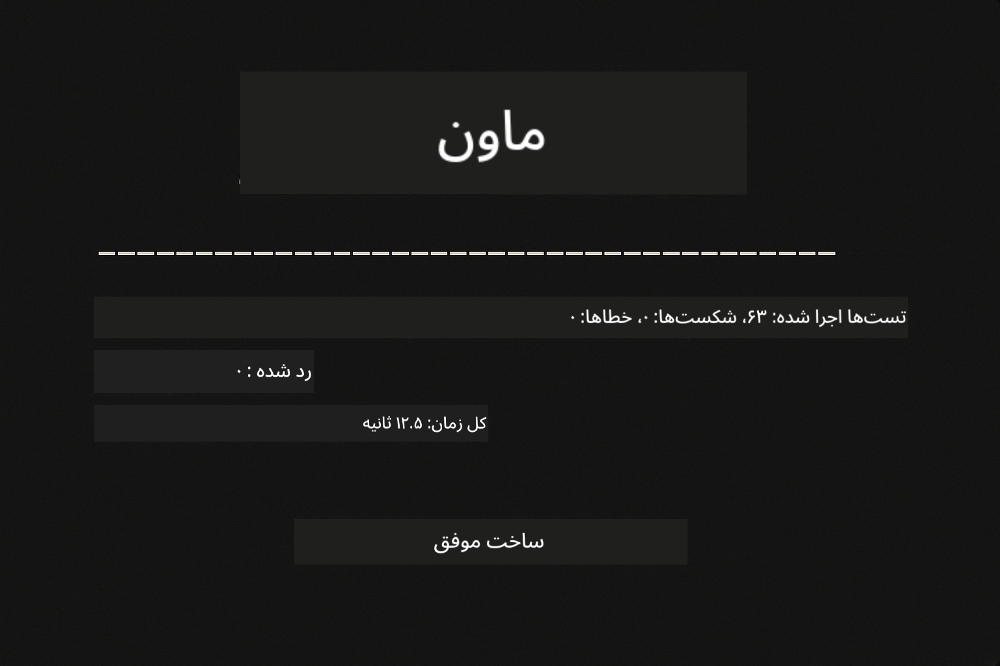
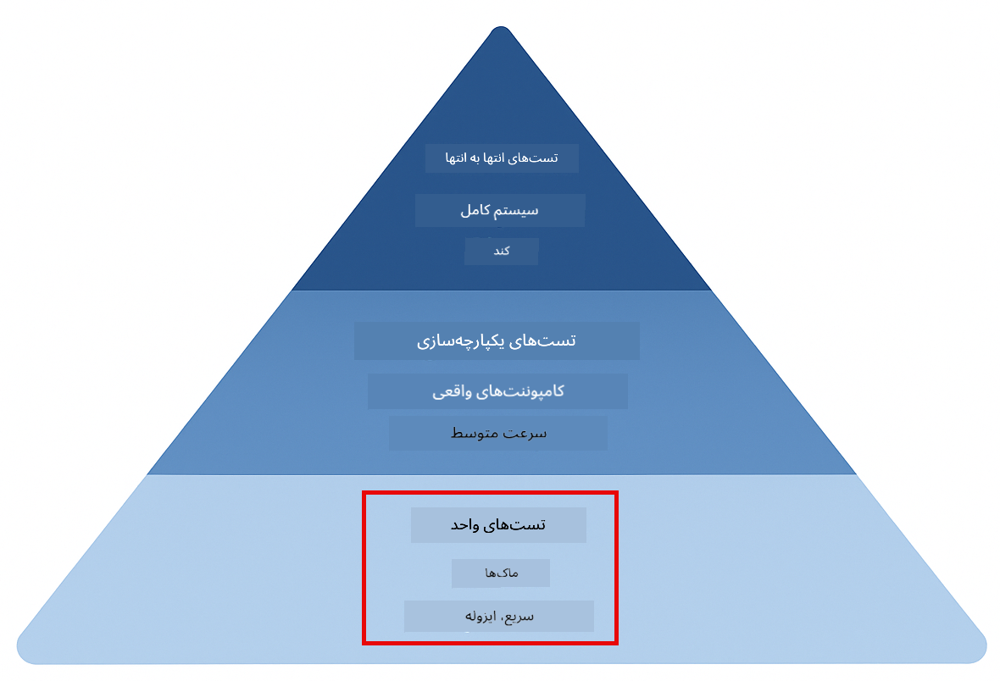
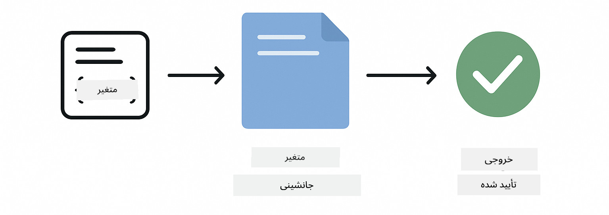
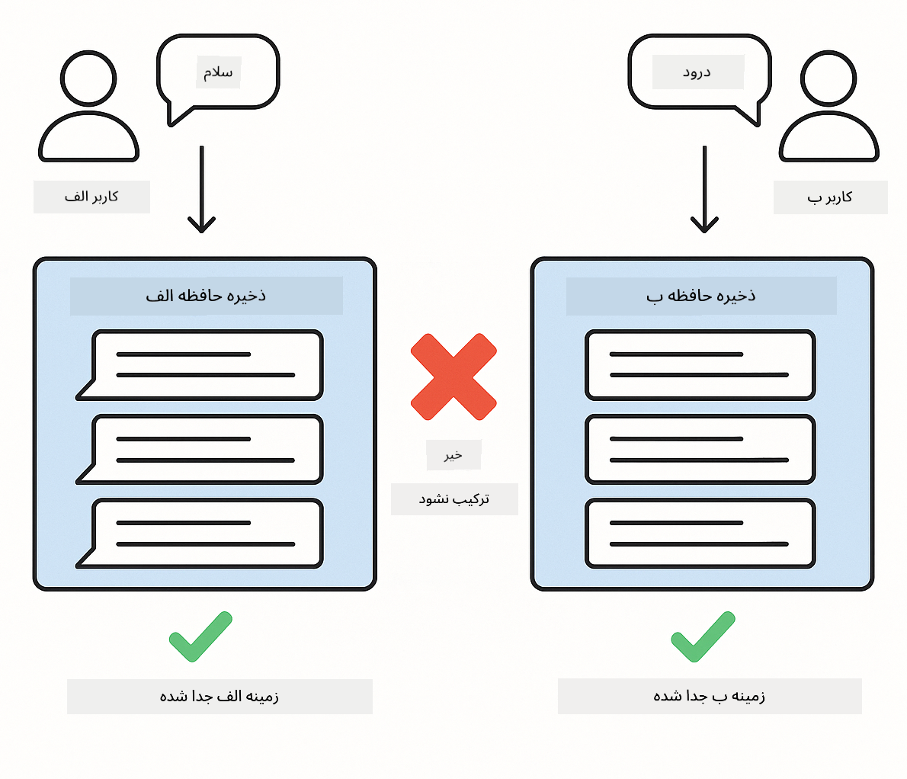
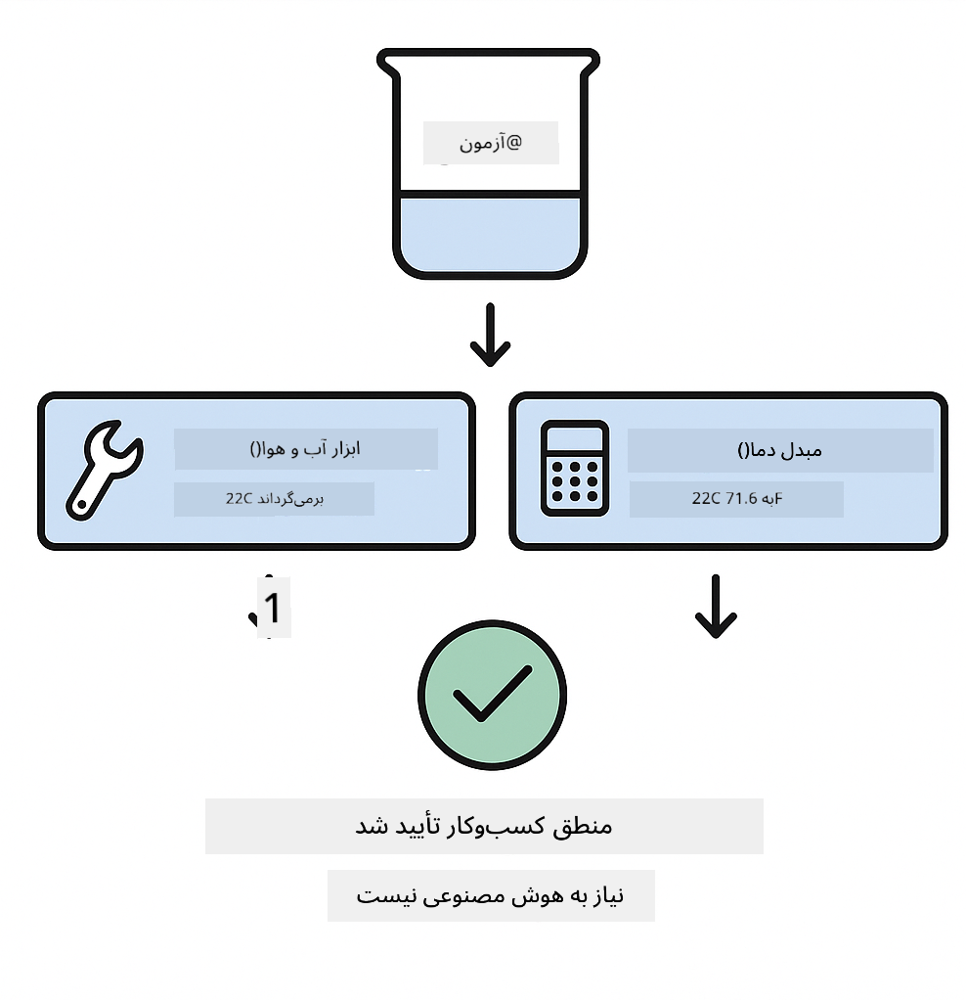

<!--
CO_OP_TRANSLATOR_METADATA:
{
  "original_hash": "ed93b3c14d58734ac10162967da958c1",
  "translation_date": "2025-12-30T20:38:04+00:00",
  "source_file": "docs/TESTING.md",
  "language_code": "fa"
}
-->
# آزمایش برنامه‌های LangChain4j

## فهرست مطالب

- [شروع سریع](../../../docs)
- [چه چیزهایی توسط تست‌ها پوشش داده می‌شوند](../../../docs)
- [اجرای تست‌ها](../../../docs)
- [اجرای تست‌ها در VS Code](../../../docs)
- [الگوهای تست](../../../docs)
- [فلسفهٔ تست‌نویسی](../../../docs)
- [گام‌های بعدی](../../../docs)

این راهنما شما را از طریق تست‌هایی هدایت می‌کند که نشان می‌دهند چگونه برنامه‌های هوش مصنوعی را بدون نیاز به کلیدهای API یا سرویس‌های خارجی تست کنید.

## شروع سریع

برای اجرای تمام تست‌ها با یک فرمان:

**Bash:**
```bash
mvn test
```

**PowerShell:**
```powershell
mvn --% test
```



*اجرای موفق تست که نشان می‌دهد تمامی تست‌ها با صفر شکست گذرانده شدند*

## چه چیزهایی توسط تست‌ها پوشش داده می‌شوند

این دوره بر روی **تست‌های واحد** که به صورت محلی اجرا می‌شوند تمرکز دارد. هر تست یک مفهوم خاص از LangChain4j را به‌صورت جداگانه نشان می‌دهد.



*هرم تست که تعادل بین تست‌های واحد (سریع، جدا)، تست‌های یکپارچه‌سازی (اجزای واقعی) و تست‌های انتها به انتها را نشان می‌دهد. این آموزش پوشش‌دهندهٔ تست‌های واحد است.*

| ماژول | تست‌ها | تمرکز | فایل‌های کلیدی |
|--------|-------|-------|-----------|
| **00 - شروع سریع** | 6 | قالب‌های پرامپت و جایگزینی متغیرها | `SimpleQuickStartTest.java` |
| **01 - مقدمه** | 8 | حافظهٔ گفتگو و چت حالت‌مند | `SimpleConversationTest.java` |
| **02 - مهندسی پرامپت** | 12 | الگوهای GPT-5، سطوح اشتیاق، خروجی ساخت‌یافته | `SimpleGpt5PromptTest.java` |
| **03 - RAG** | 10 | ورودی اسناد، امبدینگ‌ها، جستجوی شباهت | `DocumentServiceTest.java` |
| **04 - ابزارها** | 12 | فراخوانی تابع و زنجیره‌سازی ابزارها | `SimpleToolsTest.java` |
| **05 - MCP** | 8 | پروتکل مدل کانتکست با انتقال stdio | `SimpleMcpTest.java` |

## اجرای تست‌ها

**Run all tests from root:**

**Bash:**
```bash
mvn test
```

**PowerShell:**
```powershell
mvn --% test
```

**اجرای تست‌ها برای یک ماژول مشخص:**

**Bash:**
```bash
cd 01-introduction && mvn test
# یا از ریشه
mvn test -pl 01-introduction
```

**PowerShell:**
```powershell
cd 01-introduction; mvn --% test
# یا از ریشه
mvn --% test -pl 01-introduction
```

**اجرای یک کلاس تست منفرد:**

**Bash:**
```bash
mvn test -Dtest=SimpleConversationTest
```

**PowerShell:**
```powershell
mvn --% test -Dtest=SimpleConversationTest
```

**اجرای یک متد تست مشخص:**

**Bash:**
```bash
mvn test -Dtest=SimpleConversationTest#باید سابقهٔ گفتگو را حفظ کند
```

**PowerShell:**
```powershell
mvn --% test -Dtest=SimpleConversationTest#باید تاریخچه گفتگو را حفظ کند
```

## اجرای تست‌ها در VS Code

اگر از Visual Studio Code استفاده می‌کنید، Test Explorer یک رابط گرافیکی برای اجرای و دیباگ تست‌ها فراهم می‌کند.


*کاوشگر تست VS Code که درخت تست‌ها را با تمام کلاس‌های تست جاوا و متدهای تست جداگانه نمایش می‌دهد*

**برای اجرای تست‌ها در VS Code:**

1. نمایش Test Explorer با کلیک روی آیکون لوله آزمایش در نوار فعالیت
2. درخت تست را باز کنید تا تمام ماژول‌ها و کلاس‌های تست را ببینید
3. روی دکمهٔ پخش کنار هر تست کلیک کنید تا به صورت جدا اجرا شود
4. روی «Run All Tests» کلیک کنید تا کل مجموعه اجرا شود
5. روی هر تست راست‌کلیک کنید و «Debug Test» را انتخاب کنید تا نقاط توقف را تنظیم کرده و گام‌به‌گام کد را بررسی کنید

کاوشگر تست برای تست‌های موفق علامت تیک سبز نشان می‌دهد و در هنگام شکست تست‌ها پیام‌های خطای جزئیاتی ارائه می‌دهد.

## الگوهای تست

### الگوی ۱: تست قالب‌های پرامپت

ساده‌ترین الگو، قالب‌های پرامپت را بدون فراخوانی هیچ مدل هوش مصنوعی تست می‌کند. شما بررسی می‌کنید که جایگزینی متغیرها به‌درستی انجام شود و پرامپت‌ها مطابق انتظار فرمت شوند.



*تست قالب‌های پرامپت که جریان جایگزینی متغیرها را نشان می‌دهد: قالب با جای‌گیرها → اعمال مقادیر → تأیید خروجی فرمت‌شده*

```java
@Test
@DisplayName("Should format prompt template with variables")
void testPromptTemplateFormatting() {
    PromptTemplate template = PromptTemplate.from(
        "Best time to visit {{destination}} for {{activity}}?"
    );
    
    Prompt prompt = template.apply(Map.of(
        "destination", "Paris",
        "activity", "sightseeing"
    ));
    
    assertThat(prompt.text()).isEqualTo("Best time to visit Paris for sightseeing?");
}
```

This test lives in `00-quick-start/src/test/java/com/example/langchain4j/quickstart/SimpleQuickStartTest.java`.

**اجرایش کنید:**

**Bash:**
```bash
cd 00-quick-start && mvn test -Dtest=SimpleQuickStartTest#آزمایش قالب‌بندی الگوی پرامپت
```

**PowerShell:**
```powershell
cd 00-quick-start; mvn --% test -Dtest=SimpleQuickStartTest#قالب‌بندی الگوی پرامپت آزمایشی
```

### الگوی ۲: ساختن ماک برای مدل‌های زبانی

هنگام تست منطق گفتگو، از Mockito برای ایجاد مدل‌های جعلی استفاده کنید که پاسخ‌های از پیش تعیین‌شده برمی‌گردانند. این باعث می‌شود تست‌ها سریع، رایگان و قطعی باشند.


*مقایسه‌ای که نشان می‌دهد چرا ماک‌ها برای تست ترجیح داده می‌شوند: سریع، رایگان، قطعی و نیازمند کلید API نیستند*

```java
@ExtendWith(MockitoExtension.class)
class SimpleConversationTest {
    
    private ConversationService conversationService;
    
    @Mock
    private OpenAiOfficialChatModel mockChatModel;
    
    @BeforeEach
    void setUp() {
        ChatResponse mockResponse = ChatResponse.builder()
            .aiMessage(AiMessage.from("This is a test response"))
            .build();
        when(mockChatModel.chat(anyList())).thenReturn(mockResponse);
        
        conversationService = new ConversationService(mockChatModel);
    }
    
    @Test
    void shouldMaintainConversationHistory() {
        String conversationId = conversationService.startConversation();
        
        ChatResponse mockResponse1 = ChatResponse.builder()
            .aiMessage(AiMessage.from("Response 1"))
            .build();
        ChatResponse mockResponse2 = ChatResponse.builder()
            .aiMessage(AiMessage.from("Response 2"))
            .build();
        ChatResponse mockResponse3 = ChatResponse.builder()
            .aiMessage(AiMessage.from("Response 3"))
            .build();
        
        when(mockChatModel.chat(anyList()))
            .thenReturn(mockResponse1)
            .thenReturn(mockResponse2)
            .thenReturn(mockResponse3);

        conversationService.chat(conversationId, "First message");
        conversationService.chat(conversationId, "Second message");
        conversationService.chat(conversationId, "Third message");

        List<ChatMessage> history = conversationService.getHistory(conversationId);
        assertThat(history).hasSize(6); // ۳ پیام کاربر + ۳ پیام هوش مصنوعی
    }
}
```

This pattern appears in `01-introduction/src/test/java/com/example/langchain4j/service/SimpleConversationTest.java`. The mock ensures consistent behavior so you can verify memory management works correctly.

### الگوی ۳: تست ایزولاسیون گفتگو

حافظهٔ گفتگو باید کاربران متعدد را جدا نگه دارد. این تست تأیید می‌کند که گفتگوها زمینه‌ها را با هم مخلوط نمی‌کنند.



*تست ایزولاسیون گفتگو که ذخیره‌سازهای حافظه جداگانه برای کاربران مختلف را نشان می‌دهد تا از ترکیب زمینه‌ها جلوگیری شود*

```java
@Test
void shouldIsolateConversationsByid() {
    String conv1 = conversationService.startConversation();
    String conv2 = conversationService.startConversation();
    
    ChatResponse mockResponse = ChatResponse.builder()
        .aiMessage(AiMessage.from("Response"))
        .build();
    when(mockChatModel.chat(anyList())).thenReturn(mockResponse);

    conversationService.chat(conv1, "Message for conversation 1");
    conversationService.chat(conv2, "Message for conversation 2");

    List<ChatMessage> history1 = conversationService.getHistory(conv1);
    List<ChatMessage> history2 = conversationService.getHistory(conv2);
    
    assertThat(history1).hasSize(2);
    assertThat(history2).hasSize(2);
}
```

هر گفتگو تاریخچهٔ مستقل خود را حفظ می‌کند. در سیستم‌های تولیدی، این جداسازی برای برنامه‌های چندکاربره بحرانی است.

### الگوی ۴: تست مستقل ابزارها

ابزارها توابعی هستند که هوش مصنوعی می‌تواند فراخوانی کند. آن‌ها را مستقیماً تست کنید تا مطمئن شوید مستقل از تصمیمات AI درست کار می‌کنند.



*تست مستقل ابزارها که اجرای ماک ابزار را بدون فراخوانی AI نشان می‌دهد تا منطق کسب‌وکار را تأیید کند*

```java
@Test
void shouldConvertCelsiusToFahrenheit() {
    TemperatureTool tempTool = new TemperatureTool();
    String result = tempTool.celsiusToFahrenheit(25.0);
    assertThat(result).containsPattern("77[.,]0°F");
}

@Test
void shouldDemonstrateToolChaining() {
    WeatherTool weatherTool = new WeatherTool();
    TemperatureTool tempTool = new TemperatureTool();

    String weatherResult = weatherTool.getCurrentWeather("Seattle");
    assertThat(weatherResult).containsPattern("\\d+°C");

    String conversionResult = tempTool.celsiusToFahrenheit(22.0);
    assertThat(conversionResult).containsPattern("71[.,]6°F");
}
```

These tests from `04-tools/src/test/java/com/example/langchain4j/agents/tools/SimpleToolsTest.java` validate tool logic without AI involvement. The chaining example shows how one tool's output feeds into another's input.

### الگوی ۵: تست RAG در حافظه

سیستم‌های RAG معمولاً به پایگاه‌داده‌های برداری و سرویس‌های امبدینگ نیاز دارند. الگوی درون‌حافظه به شما امکان می‌دهد کل خط لوله را بدون وابستگی‌های خارجی تست کنید.


*جریان کاری تست RAG در حافظه که پارس کردن سند، ذخیرهٔ امبدینگ و جستجوی شباهت را بدون نیاز به پایگاه‌داده نشان می‌دهد*

```java
@Test
void testProcessTextDocument() {
    String content = "This is a test document.\nIt has multiple lines.";
    InputStream inputStream = new ByteArrayInputStream(content.getBytes(StandardCharsets.UTF_8));
    
    DocumentService.ProcessedDocument result = 
        documentService.processDocument(inputStream, "test.txt");

    assertNotNull(result);
    assertTrue(result.segments().size() > 0);
    assertEquals("test.txt", result.segments().get(0).metadata().getString("filename"));
}
```

This test from `03-rag/src/test/java/com/example/langchain4j/rag/service/DocumentServiceTest.java` creates a document in memory and verifies chunking and metadata handling.

### الگوی ۶: تست یکپارچه‌سازی MCP

ماژول MCP یکپارچه‌سازی پروتکل مدل کانتکست را با استفاده از انتقال stdio تست می‌کند. این تست‌ها تأیید می‌کنند که برنامهٔ شما می‌تواند سرورهای MCP را به‌عنوان فرایندهای فرعی ایجاد کرده و با آن‌ها ارتباط برقرار کند.

The tests in `05-mcp/src/test/java/com/example/langchain4j/mcp/SimpleMcpTest.java` validate MCP client behavior.

**اجرای آن‌ها:**

**Bash:**
```bash
cd 05-mcp && mvn test
```

**PowerShell:**
```powershell
cd 05-mcp; mvn --% test
```

## فلسفهٔ تست‌نویسی

کد خود را تست کنید، نه هوش مصنوعی را. تست‌های شما باید کدی را که می‌نویسید با بررسی نحوهٔ ساختن پرامپت‌ها، مدیریت حافظه و اجرای ابزارها اعتبارسنجی کنند. پاسخ‌های هوش مصنوعی متغیر هستند و نباید بخشی از ادعاهای تست باشند. از خود بپرسید آیا قالب پرامپت شما به‌درستی متغیرها را جایگزین می‌کند، نه اینکه آیا AI پاسخ درست می‌دهد یا خیر.

برای مدل‌های زبانی از ماک استفاده کنید. آن‌ها وابستگی‌های خارجی هستند که کند، پرهزینه و غیرقطعی‌اند. ماک‌سازی باعث می‌شود تست‌ها سریع باشند (میلی‌ثانیه به‌جای ثانیه)، رایگان بدون هزینهٔ API و قطعی با همان نتیجه در هر بار اجرا.

تست‌ها را مستقل نگه دارید. هر تست باید داده‌های خود را راه‌اندازی کند، به تست‌های دیگر تکیه نکند، و پس از اجرا پاک‌سازی انجام دهد. تست‌ها باید بدون توجه به ترتیب اجرا پاس شوند.

حالت‌های مرزی را فراتر از مسیر خوش را تست کنید. ورودی‌های خالی، ورودی‌های بسیار بزرگ، کاراکترهای خاص، پارامترهای نامعتبر و شرایط مرزی را امتحان کنید. این‌ها اغلب باگ‌هایی را آشکار می‌کنند که استفادهٔ عادی آن‌ها را نشان نمی‌دهد.

از نام‌های توصیفی استفاده کنید. مقایسه کنید `shouldMaintainConversationHistoryAcrossMultipleMessages()` را با `test1()`. مورد اول دقیقاً به شما می‌گوید چه چیزی در حال تست است و اشکال‌زدایی شکست‌ها را بسیار آسان‌تر می‌کند.

## گام‌های بعدی

حال که الگوهای تست را درک کردید، هر ماژول را عمیق‌تر بررسی کنید:

- **[00 - شروع سریع](../00-quick-start/README.md)** - با مبانی قالب‌های پرامپت شروع کنید
- **[01 - مقدمه](../01-introduction/README.md)** - مدیریت حافظهٔ گفتگو را یاد بگیرید
- **[02 - مهندسی پرامپت](../02-prompt-engineering/README.md)** - الگوهای پرامپت‌نویسی GPT-5 را فراگیرید
- **[03 - RAG](../03-rag/README.md)** - سیستم‌های RAG بسازید
- **[04 - ابزارها](../04-tools/README.md)** - فراخوانی توابع و زنجیره‌های ابزار را پیاده‌سازی کنید
- **[05 - MCP](../05-mcp/README.md)** - پروتکل مدل کانتکست را یکپارچه کنید

README هر ماژول توضیحات مفصل‌تری دربارهٔ مفاهیم مورد آزمایش در اینجا ارائه می‌دهد.

---

**ناوبری:** [← بازگشت به اصلی](../README.md)

---

<!-- CO-OP TRANSLATOR DISCLAIMER START -->
سلب مسئولیت:
این سند با استفاده از سرویس ترجمه‌ی هوش مصنوعی Co-op Translator (https://github.com/Azure/co-op-translator) ترجمه شده است. در حالی که ما در پی دقت هستیم، لطفاً توجه داشته باشید که ترجمه‌های خودکار ممکن است دارای خطاها یا نادرستی‌هایی باشند. سند اصلی به زبان مبدأ باید به‌عنوان منبع معتبر در نظر گرفته شود. برای اطلاعات حیاتی، استفاده از ترجمه‌ی حرفه‌ای توسط مترجم انسانی توصیه می‌شود. ما در قبال هرگونه سوءتفاهم یا تفسیر نادرست ناشی از استفاده از این ترجمه مسئولیتی نداریم.
<!-- CO-OP TRANSLATOR DISCLAIMER END -->