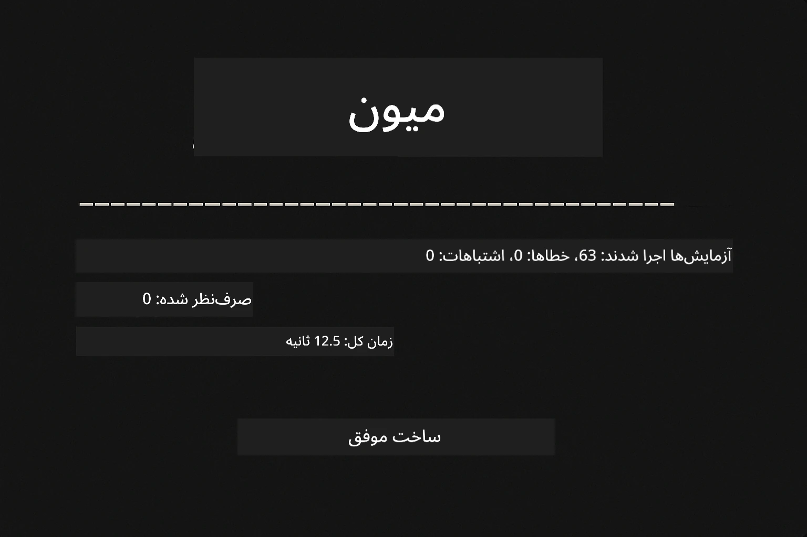
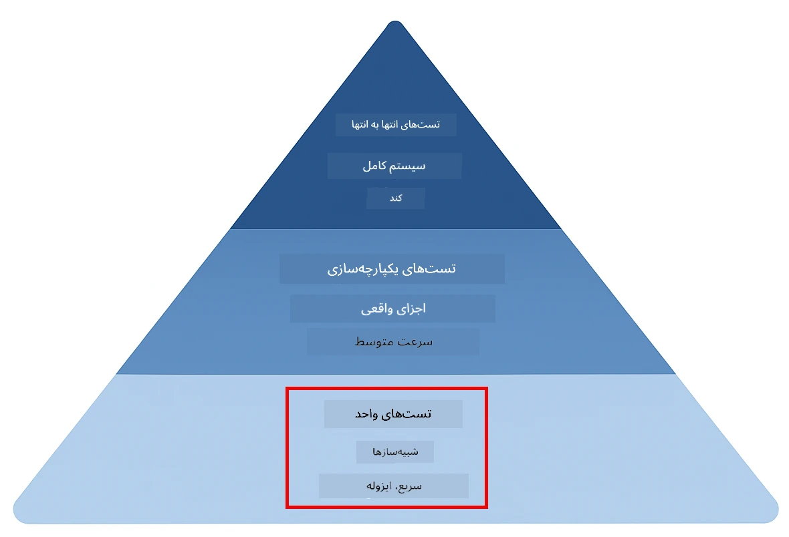
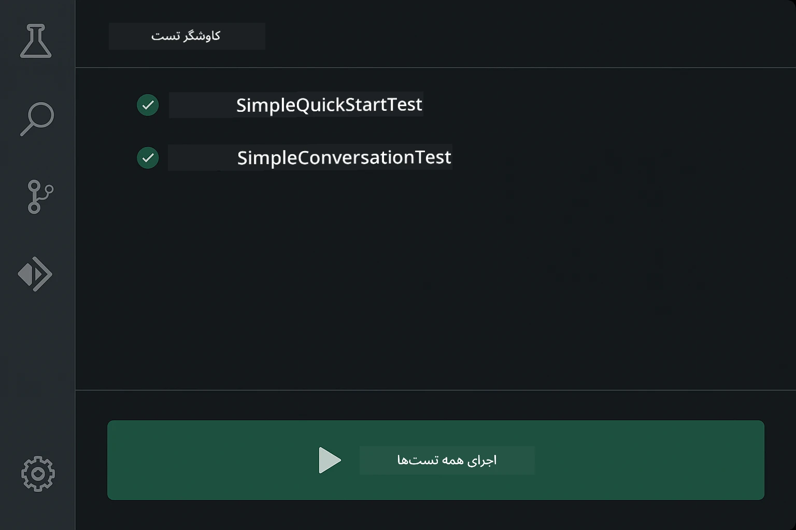
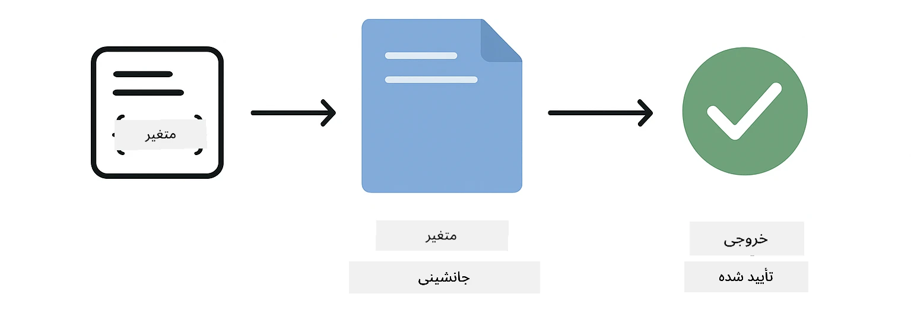
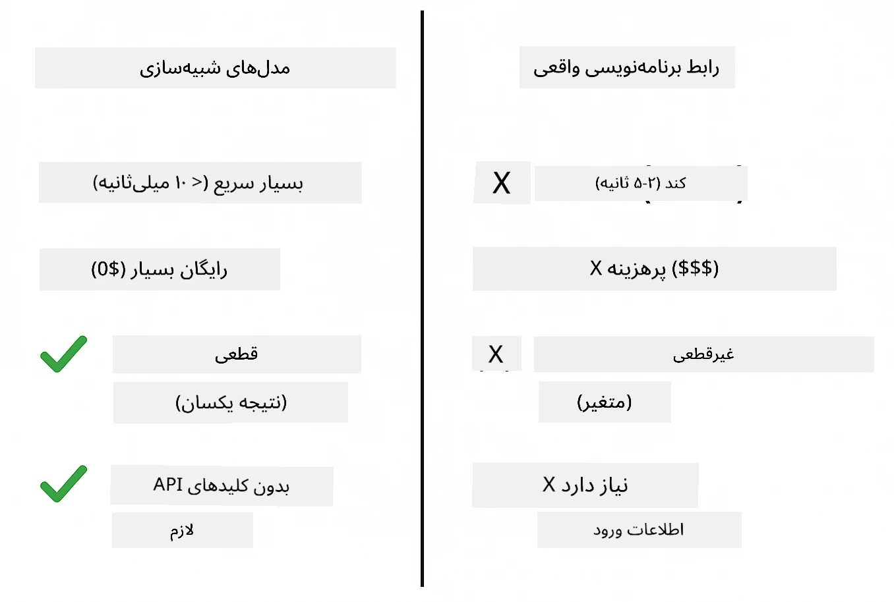
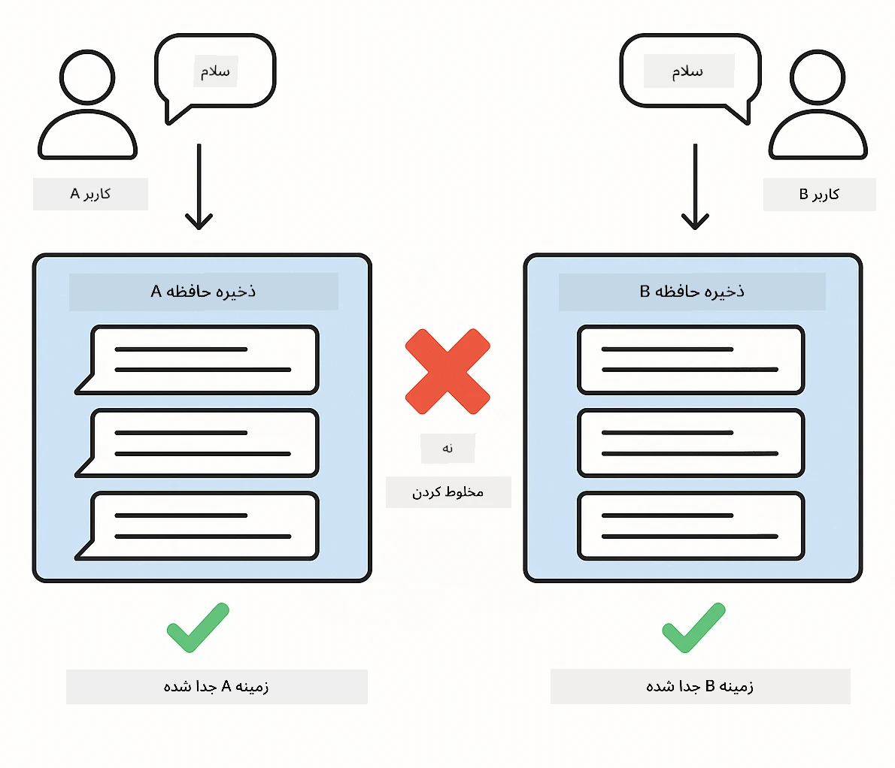
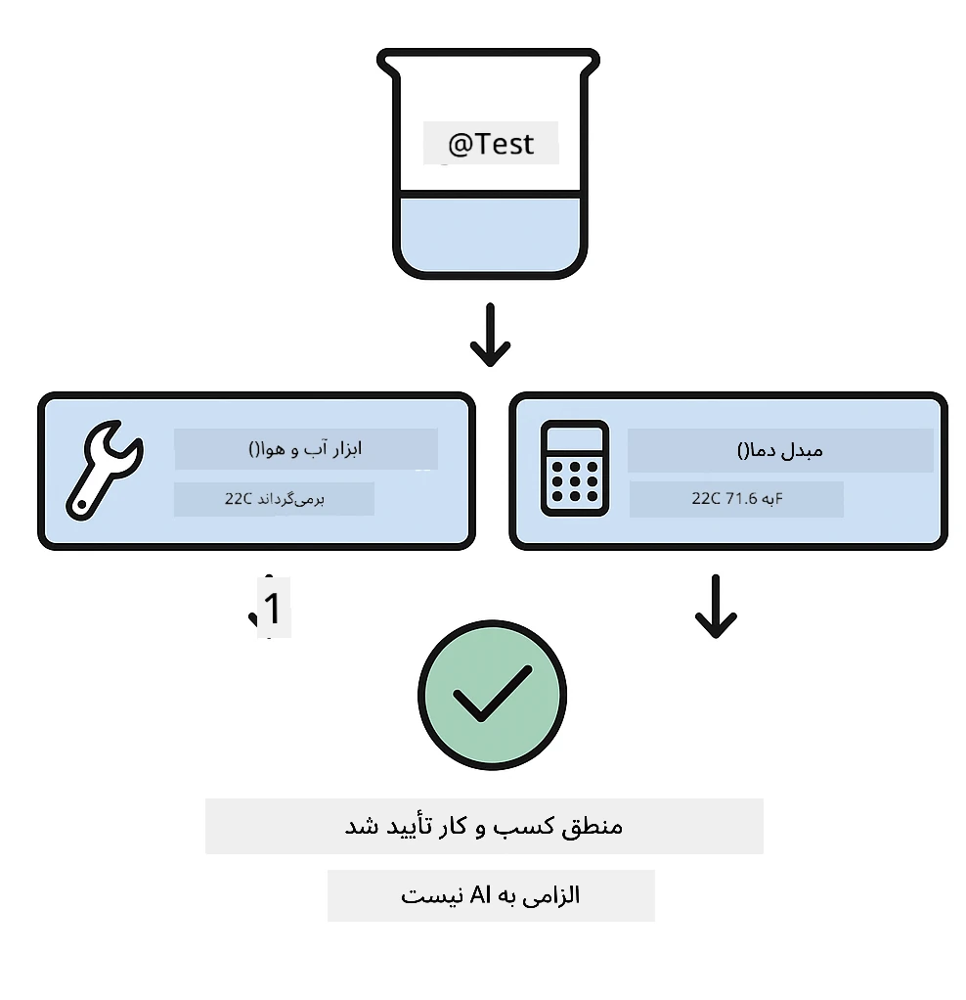
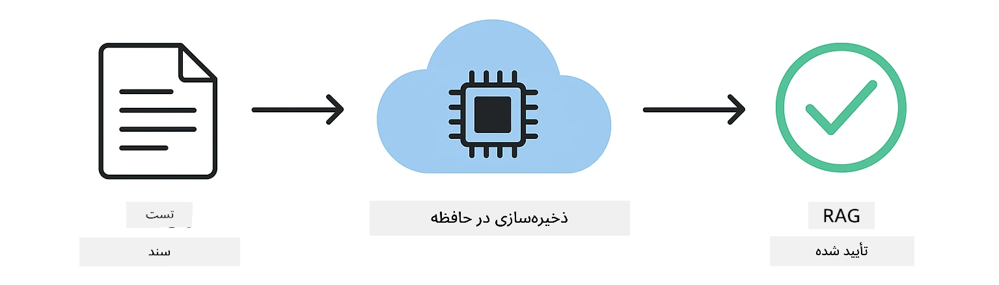

# آزمایش برنامه‌های LangChain4j

## فهرست مطالب

- [شروع سریع](#شروع-سریع)
- [محتوای آزمون‌ها](#محتوای-آزمون‌ها)
- [اجرای آزمون‌ها](#اجرای-آزمون‌ها)
- [اجرای آزمون‌ها در VS Code](#اجرای-آزمون‌ها-در-vs-code)
- [الگوهای آزمایشی](#الگوهای-آزمایشی)
- [فلسفه آزمایش](#فلسفه-آزمایش)
- [گام‌های بعدی](#گام‌های-بعدی)

این راهنما شما را از طریق آزمون‌هایی که نشان می‌دهند چگونه برنامه‌های هوش مصنوعی را بدون نیاز به کلیدهای API یا سرویس‌های خارجی آزمایش کنید راهنمایی می‌کند.

## شروع سریع

تمام آزمون‌ها را با یک دستور اجرا کنید:

**Bash:**
```bash
mvn test
```

**PowerShell:**
```powershell
mvn --% test
```

وقتی همه آزمون‌ها با موفقیت گذشتند، باید خروجی شبیه به تصویر زیر ببینید — آزمون‌ها بدون هیچ شکست اجرا می‌شوند.



*اجرای موفقیت‌آمیز آزمون‌ها که نشان می‌دهد همه آزمون‌ها بدون شکست گذشتند*

## محتوای آزمون‌ها

این دوره بر روی **آزمون‌های واحد** که به صورت محلی اجرا می‌شوند تمرکز دارد. هر آزمون یک مفهوم خاص از LangChain4j را به طور مجزا نشان می‌دهد. هرم آزمایش زیر نشان می‌دهد که آزمون‌های واحد در کجا قرار می‌گیرند — آنها پایه سریع و قابل اعتمادی تشکیل می‌دهند که باقی استراتژی آزمون شما بر آن بنا می‌شود.



*هرم آزمایش که تعادل بین آزمون‌های واحد (سریع، جدا شده)، آزمون‌های یکپارچه‌سازی (کامپوننت‌های واقعی) و آزمون‌های انتها به انتها را نشان می‌دهد. این آموزش پوشش‌دهنده آزمون واحد است.*

| ماژول | آزمون‌ها | تمرکز | فایل‌های کلیدی |
|--------|-------|-------|-----------|
| **۰۱ - مقدمه** | ۸ | حافظه مکالمه و چت حالت‌دار | `SimpleConversationTest.java` |
| **۰۲ - مهندسی پرس‌وجو** | ۱۲ | الگوهای GPT-5.2، سطوح اشتیاق، خروجی ساخت‌یافته | `SimpleGpt5PromptTest.java` |
| **۰۳ - RAG** | ۱۰ | وارد کردن سند، جاسازی‌ها، جستجوی مشابهت | `DocumentServiceTest.java` |
| **۰۴ - ابزارها** | ۱۲ | فراخوانی توابع و زنجیره ابزارها | `SimpleToolsTest.java` |
| **۰۵ - MCP** | ۸ | پروتکل زمینه مدل با انتقال stdio | `SimpleMcpTest.java` |

## اجرای آزمون‌ها

**اجرای همه آزمون‌ها از ریشه پروژه:**

**Bash:**
```bash
mvn test
```

**PowerShell:**
```powershell
mvn --% test
```

**اجرای آزمون‌ها برای یک ماژول خاص:**

**Bash:**
```bash
cd 01-introduction && mvn test
# یا از ریشه
mvn test -pl 01-introduction
```

**PowerShell:**
```powershell
cd 01-introduction; mvn --% test
# یا از ریشه
mvn --% test -pl 01-introduction
```

**اجرای یک کلاس آزمون واحد:**

**Bash:**
```bash
mvn test -Dtest=SimpleConversationTest
```

**PowerShell:**
```powershell
mvn --% test -Dtest=SimpleConversationTest
```

**اجرای یک متد آزمون مشخص:**

**Bash:**
```bash
mvn test -Dtest=SimpleConversationTest#باید تاریخچه‌ی گفتگو حفظ شود
```

**PowerShell:**
```powershell
mvn --% test -Dtest=SimpleConversationTest#باید تاریخچه مکالمه حفظ شود
```

## اجرای آزمون‌ها در VS Code

اگر از Visual Studio Code استفاده می‌کنید، Test Explorer یک رابط گرافیکی برای اجرای و دیباگ کردن آزمون‌ها فراهم می‌کند.



*کاوشگر آزمون VS Code که درخت آزمون را با تمام کلاس‌های آزمون جاوا و متدهای آزمون فردی نشان می‌دهد*

**برای اجرای آزمون‌ها در VS Code:**

1. با کلیک روی آیکون ارلنما در نوار فعالیت (Activity Bar) کاوشگر آزمون را باز کنید
2. درخت آزمون را باز کنید تا همه ماژول‌ها و کلاس‌های آزمون را ببینید
3. روی دکمه پخش کنار هر آزمون کلیک کنید تا فقط آن را اجرا کنید
4. روی "Run All Tests" کلیک کنید تا کل مجموعه اجرا شود
5. روی هر آزمون راست‌کلیک کرده و "Debug Test" را انتخاب کنید تا نقاط توقف تنظیم و مرحله‌ای کد را بررسی کنید

کاوشگر آزمون علامت‌های تیک سبز برای آزمون‌های موفق و پیام‌های شکست دقیق هنگام ناموفق بودن آزمون‌ها را نشان می‌دهد.

## الگوهای آزمایشی

### الگو ۱: آزمایش قالب‌های پرس‌وجو

ساده‌ترین الگو قالب‌های پرس‌وجو را بدون فراخوانی هیچ مدل هوش مصنوعی آزمایش می‌کند. شما صحت جایگزینی متغیرها را بررسی می‌کنید و اطمینان می‌یابید که قالب‌ها به درستی قالب‌بندی شده‌اند.



*آزمایش قالب‌های پرس‌وجو که جریان جایگزینی متغیرها را نشان می‌دهد: قالب با مکان‌نماها → مقادیر اعمال شده → خروجی قالب‌بندی شده تأیید شده*

```java
@Test
@DisplayName("Should format prompt template with variables")
void testPromptTemplateFormatting() {
    PromptTemplate template = PromptTemplate.from(
        "Best time to visit {{destination}} for {{activity}}?"
    );
    
    Prompt prompt = template.apply(Map.of(
        "destination", "Paris",
        "activity", "sightseeing"
    ));
    
    assertThat(prompt.text()).isEqualTo("Best time to visit Paris for sightseeing?");
}
```

این الگو تأیید می‌کند که جایگزینی متغیرها به درستی انجام شده و قالب‌ها به شکل مورد انتظار قالب‌بندی شده‌اند — نیازی به کلید API یا فراخوانی مدل نیست.

### الگو ۲: ایجاد مدل‌های زبان جعلی (Mocking)

هنگام آزمایش منطق مکالمه، از Mockito برای ساخت مدل‌های جعلی استفاده کنید که پاسخ‌های از پیش تعیین شده را برمی‌گردانند. این باعث می‌شود آزمون‌ها سریع، رایگان و قطعی باشند.



*مقایسه‌ای که چرا مدل‌های جعلی برای آزمایش ترجیح داده می‌شوند: سریع، رایگان، قطعی و بدون نیاز به کلید API*

```java
@ExtendWith(MockitoExtension.class)
class SimpleConversationTest {
    
    private ConversationService conversationService;
    
    @Mock
    private OpenAiOfficialChatModel mockChatModel;
    
    @BeforeEach
    void setUp() {
        ChatResponse mockResponse = ChatResponse.builder()
            .aiMessage(AiMessage.from("This is a test response"))
            .build();
        when(mockChatModel.chat(anyList())).thenReturn(mockResponse);
        
        conversationService = new ConversationService(mockChatModel);
    }
    
    @Test
    void shouldMaintainConversationHistory() {
        String conversationId = conversationService.startConversation();
        
        ChatResponse mockResponse1 = ChatResponse.builder()
            .aiMessage(AiMessage.from("Response 1"))
            .build();
        ChatResponse mockResponse2 = ChatResponse.builder()
            .aiMessage(AiMessage.from("Response 2"))
            .build();
        ChatResponse mockResponse3 = ChatResponse.builder()
            .aiMessage(AiMessage.from("Response 3"))
            .build();
        
        when(mockChatModel.chat(anyList()))
            .thenReturn(mockResponse1)
            .thenReturn(mockResponse2)
            .thenReturn(mockResponse3);

        conversationService.chat(conversationId, "First message");
        conversationService.chat(conversationId, "Second message");
        conversationService.chat(conversationId, "Third message");

        List<ChatMessage> history = conversationService.getHistory(conversationId);
        assertThat(history).hasSize(6); // ۳ پیام کاربر + ۳ پیام هوش مصنوعی
    }
}
```

این الگو در فایل `01-introduction/src/test/java/com/example/langchain4j/service/SimpleConversationTest.java` ظاهر می‌شود. مدل جعلی رفتار یکنواخت را تضمین می‌کند تا بتوانید مدیریت حافظه را به درستی بررسی کنید.

### الگو ۳: آزمایش جداسازی مکالمه

حافظه مکالمه باید چندین کاربر را جدا نگه دارد. این آزمون تأیید می‌کند که مکالمات زمینه‌ها را مخلوط نمی‌کنند.



*آزمایش جداسازی مکالمه که نشان‌دهنده نگهداری حافظه جداگانه برای کاربران مختلف برای جلوگیری از مخلوط شدن زمینه‌ها است*

```java
@Test
void shouldIsolateConversationsByid() {
    String conv1 = conversationService.startConversation();
    String conv2 = conversationService.startConversation();
    
    ChatResponse mockResponse = ChatResponse.builder()
        .aiMessage(AiMessage.from("Response"))
        .build();
    when(mockChatModel.chat(anyList())).thenReturn(mockResponse);

    conversationService.chat(conv1, "Message for conversation 1");
    conversationService.chat(conv2, "Message for conversation 2");

    List<ChatMessage> history1 = conversationService.getHistory(conv1);
    List<ChatMessage> history2 = conversationService.getHistory(conv2);
    
    assertThat(history1).hasSize(2);
    assertThat(history2).hasSize(2);
}
```

هر مکالمه تاریخچه مستقل خود را حفظ می‌کند. در سیستم‌های تولید، این جداسازی برای برنامه‌های چندکاربره حیاتی است.

### الگو ۴: آزمایش مستقل ابزارها

ابزارها توابعی هستند که هوش مصنوعی می‌تواند فراخوانی کند. آنها را مستقیماً آزمایش کنید تا اطمینان حاصل شود که بدون توجه به تصمیمات هوش مصنوعی به درستی کار می‌کنند.



*آزمایش مستقل ابزارها که اجرای ابزارهای جعلی بدون فراخوانی هوش مصنوعی را نشان می‌دهد تا منطق کسب‌وکار تحقق یابد*

```java
@Test
void shouldConvertCelsiusToFahrenheit() {
    TemperatureTool tempTool = new TemperatureTool();
    String result = tempTool.celsiusToFahrenheit(25.0);
    assertThat(result).containsPattern("77[.,]0°F");
}

@Test
void shouldDemonstrateToolChaining() {
    WeatherTool weatherTool = new WeatherTool();
    TemperatureTool tempTool = new TemperatureTool();

    String weatherResult = weatherTool.getCurrentWeather("Seattle");
    assertThat(weatherResult).containsPattern("\\d+°C");

    String conversionResult = tempTool.celsiusToFahrenheit(22.0);
    assertThat(conversionResult).containsPattern("71[.,]6°F");
}
```

این آزمایش‌ها از `04-tools/src/test/java/com/example/langchain4j/agents/tools/SimpleToolsTest.java` منطق ابزار را بدون دخالت هوش مصنوعی اعتبارسنجی می‌کنند. نمونه زنجیره‌ای نشان می‌دهد چگونه خروجی یک ابزار به ورودی ابزار دیگر می‌رود.

### الگو ۵: آزمایش RAG در حافظه

سیستم‌های RAG معمولاً به پایگاه داده‌های برداری و خدمات جاسازی نیاز دارند. الگوی درون حافظه اجازه می‌دهد کل زنجیره بدون وابستگی خارجی آزمایش شود.



*فرآیند آزمایشی RAG در حافظه که پارس کردن سند، ذخیره جاسازی و جستجوی مشابهت را بدون نیاز به پایگاه داده نشان می‌دهد*

```java
@Test
void testProcessTextDocument() {
    String content = "This is a test document.\nIt has multiple lines.";
    InputStream inputStream = new ByteArrayInputStream(content.getBytes(StandardCharsets.UTF_8));
    
    DocumentService.ProcessedDocument result = 
        documentService.processDocument(inputStream, "test.txt");

    assertNotNull(result);
    assertTrue(result.segments().size() > 0);
    assertEquals("test.txt", result.segments().get(0).metadata().getString("filename"));
}
```

این آزمون از `03-rag/src/test/java/com/example/langchain4j/rag/service/DocumentServiceTest.java` یک سند در حافظه ایجاد می‌کند و قطعه‌بندی و مدیریت متادیتا را بررسی می‌کند.

### الگو ۶: آزمایش یکپارچه‌سازی MCP

ماژول MCP آزمایش یکپارچه‌سازی پروتکل زمینه مدل را با انتقال stdio انجام می‌دهد. این آزمایش‌ها اطمینان می‌دهند که برنامه شما می‌تواند سرورهای MCP را به صورت زیرفرآیند ایجاد و با آنها ارتباط برقرار کند.

آزمون‌ها در `05-mcp/src/test/java/com/example/langchain4j/mcp/SimpleMcpTest.java` رفتار کلاینت MCP را اعتبارسنجی می‌کنند.

**اجرایشان کنید:**

**Bash:**
```bash
cd 05-mcp && mvn test
```

**PowerShell:**
```powershell
cd 05-mcp; mvn --% test
```

## فلسفه آزمایش

کد خود را آزمایش کنید، نه هوش مصنوعی را. آزمون‌های شما باید کدی که می‌نویسید را با بررسی نحوه ساخت پرس‌وجوها، مدیریت حافظه و اجرای ابزارها اعتبارسنجی کنند. پاسخ‌های هوش مصنوعی متغیر هستند و نباید جزو تأییدیه‌های آزمون باشند. از خود بپرسید آیا قالب پرس‌وجوی شما به درستی جایگزین متغیرها را انجام می‌دهد، نه اینکه آیا پاسخ هوش مصنوعی درست است.

از مدل‌های جعلی برای مدل‌های زبان استفاده کنید. آنها وابستگی‌های خارجی هستند که کند، پرهزینه و غیرقطعی‌اند. استفاده از جعلی‌ها باعث می‌شود آزمون‌ها سریع (با میلی‌ثانیه به جای ثانیه)، رایگان (بدون هزینه API) و قطعی (همیشه نتیجه یکسان) باشند.

آزمون‌ها را مستقل نگه دارید. هر آزمون باید داده‌های خود را تنظیم کند، به آزمون‌های دیگر وابسته نباشد و پس از اجرا پاک‌سازی کند. آزمون‌ها باید صرف‌نظر از ترتیب اجرا، موفق باشند.

موارد حاشیه‌ای را فراتر از مسیر خوش‌آیند آزمایش کنید. ورودی‌های خالی، ورودی‌های بسیار بزرگ، کاراکترهای خاص، پارامترهای نامعتبر و شرایط مرزی را امتحان کنید. این موارد اغلب باگ‌هایی را آشکار می‌کنند که استفاده معمولی نشان نمی‌دهد.

از نام‌های توصیفی استفاده کنید. مقایسه کنید `shouldMaintainConversationHistoryAcrossMultipleMessages()` با `test1()` را. نام اول دقیقاً توضیح می‌دهد چه چیزی آزمایش می‌شود و اشکال‌زدایی شکست‌ها را بسیار آسان‌تر می‌کند.

## گام‌های بعدی

حال که الگوهای آزمایشی را فهمیده‌اید، عمیق‌تر به هر ماژول بپردازید:

- **[۰۱ - مقدمه](../01-introduction/README.md)** - یادگیری مدیریت حافظه مکالمه
- **[۰۲ - مهندسی پرس‌وجو](../02-prompt-engineering/README.md)** - تسلط بر الگوهای پرس‌وجوی GPT-5.2
- **[۰۳ - RAG](../03-rag/README.md)** - ساخت سیستم‌های تولید افزوده بازیابی شده
- **[۰۴ - ابزارها](../04-tools/README.md)** - پیاده‌سازی فراخوانی توابع و زنجیره ابزارها
- **[۰۵ - MCP](../05-mcp/README.md)** - یکپارچه‌سازی پروتکل زمینه مدل

README هر ماژول توضیحات دقیقی از مفاهیم آزمون شده در اینجا ارائه می‌دهد.

---

**گردش در سند:** [← بازگشت به اصلی](../README.md)

---

<!-- CO-OP TRANSLATOR DISCLAIMER START -->
**سلب مسئولیت**:
این سند با استفاده از سرویس ترجمه هوش مصنوعی [Co-op Translator](https://github.com/Azure/co-op-translator) ترجمه شده است. در حالی که ما در تلاش برای دقت هستیم، لطفاً توجه داشته باشید که ترجمه‌های خودکار ممکن است شامل خطاها یا نادرستی‌هایی باشند. سند اصلی به زبان مادری خود باید به عنوان منبع معتبر در نظر گرفته شود. برای اطلاعات حیاتی، ترجمه حرفه‌ای انسانی توصیه می‌شود. ما در قبال هرگونه سوء تفاهم یا برداشت نادرست ناشی از استفاده از این ترجمه مسئولیتی نداریم.
<!-- CO-OP TRANSLATOR DISCLAIMER END -->