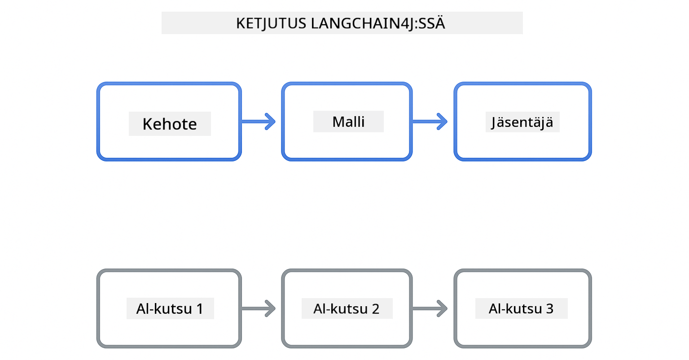
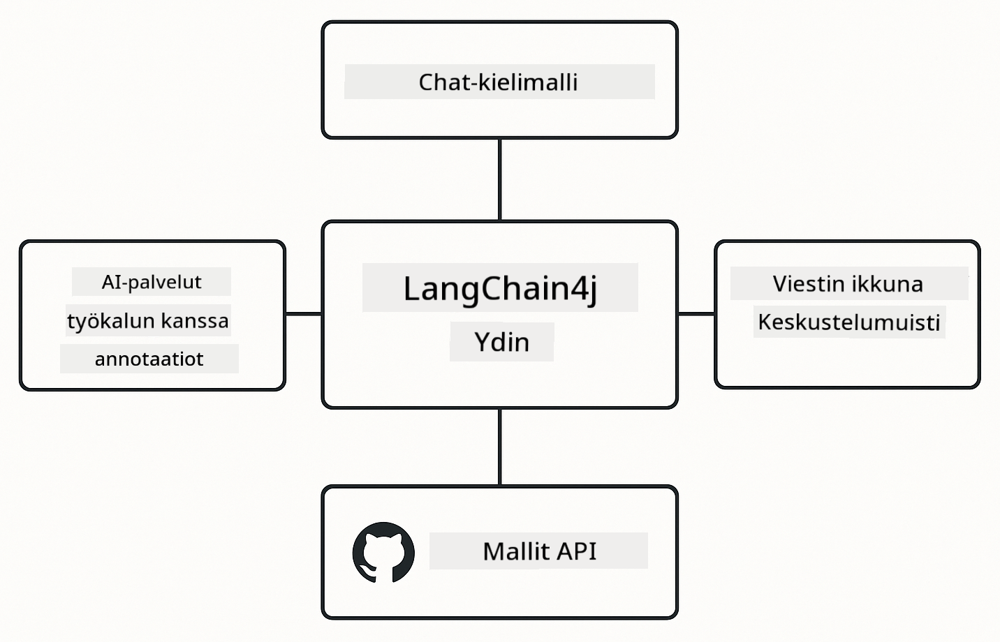

<!--
CO_OP_TRANSLATOR_METADATA:
{
  "original_hash": "22b5d7c8d7585325e38b37fd29eafe25",
  "translation_date": "2026-01-05T23:54:49+00:00",
  "source_file": "00-quick-start/README.md",
  "language_code": "fi"
}
-->
# Module 00: Pikakäyttöopas

## Sisällysluettelo

- [Johdanto](../../../00-quick-start)
- [Mikä on LangChain4j?](../../../00-quick-start)
- [LangChain4j-riippuvuudet](../../../00-quick-start)
- [Ennakkovaatimukset](../../../00-quick-start)
- [Asennus](../../../00-quick-start)
  - [1. Hanki GitHub-tokenisi](../../../00-quick-start)
  - [2. Aseta tokenisi](../../../00-quick-start)
- [Suorita esimerkit](../../../00-quick-start)
  - [1. Perusjuttu](../../../00-quick-start)
  - [2. Kehote-kuviot](../../../00-quick-start)
  - [3. Funktiokutsut](../../../00-quick-start)
  - [4. Dokumentin Kyselyt ja Vastaukset (RAG)](../../../00-quick-start)
  - [5. Vastuullinen tekoäly](../../../00-quick-start)
- [Mitä kukin esimerkki havainnollistaa](../../../00-quick-start)
- [Seuraavat askeleet](../../../00-quick-start)
- [Vianmääritys](../../../00-quick-start)

## Johdanto

Tämä pikakäyttöopas on tarkoitettu saamaan sinut alkuun LangChain4j:n kanssa mahdollisimman nopeasti. Se kattaa tekoälysovellusten perusasiat LangChain4j:n ja GitHub-mallien kanssa. Seuraavissa moduuleissa käytät Azure OpenAI:ta LangChain4j:n kanssa rakentamaan kehittyneempiä sovelluksia.

## Mikä on LangChain4j?

LangChain4j on Java-kirjasto, joka yksinkertaistaa tekoälypohjaisten sovellusten rakentamista. Sen sijaan, että käsittelisit HTTP-asiakkaita ja JSON-jäsentämistä, työskentelet selkeiden Java-rajapintojen kanssa.

LangChainin "ketju" viittaa useiden komponenttien ketjuttamiseen - voit ketjuttaa kehotteen mallille ja parserille tai ketjuttaa useita tekoälykutsuja, joissa yhden tulos syötetään seuraavaan syötteeseen. Tämä pikakäyttö keskittyy perusteisiin ennen monimutkaisempien ketjujen tutkimista.



*Komponenttien ketjutus LangChain4j:ssa – rakennuspalikat yhdistyvät luodakseen tehokkaita tekoälytyönkulkuja*

Käytämme kolmea ydinkomponenttia:

**ChatLanguageModel** – Rajapinta tekoälymallin vuorovaikutuksiin. Kutsu `model.chat("kehote")` ja saat vastauksen merkkijonona. Käytämme `OpenAiOfficialChatModel`-luokkaa, joka toimii OpenAI-yhteensopivien päätepisteiden kanssa, kuten GitHub-mallit.

**AiServices** – Luo tyyppiturvallisia tekoälypalvelujen rajapintoja. Määrittele menetelmät, merkitse ne `@Tool`-annotaatiolla, ja LangChain4j hoitaa orkestroinnin. Tekoäly kutsuu Java-metodejasi automaattisesti tarvittaessa.

**MessageWindowChatMemory** – Pitää yllä keskusteluhistoriaa. Ilman tätä jokainen pyyntö on itsenäinen. Sen avulla tekoäly muistaa aiemmat viestit ja ylläpitää kontekstia useiden vuorojen ajan.



*LangChain4j:n arkkitehtuuri – ydinkomponentit toimivat yhdessä tehostaakseen tekoälysovelluksiasi*

## LangChain4j-riippuvuudet

Tämä pikakäyttöopas käyttää kahta Maven-riippuvuutta [`pom.xml`](../../../00-quick-start/pom.xml) tiedostossa:

```xml
<!-- Core LangChain4j library -->
<dependency>
    <groupId>dev.langchain4j</groupId>
    <artifactId>langchain4j</artifactId> <!-- Inherited from BOM in root pom.xml -->
</dependency>

<!-- OpenAI integration (works with GitHub Models) -->
<dependency>
    <groupId>dev.langchain4j</groupId>
    <artifactId>langchain4j-open-ai-official</artifactId> <!-- Inherited from BOM in root pom.xml -->
</dependency>
```

`langchain4j-open-ai-official`-moduuli tarjoaa `OpenAiOfficialChatModel`-luokan, joka yhdistää OpenAI-yhteensopiviin API:hin. GitHub-mallit käyttävät samaa API-muotoa, joten erityistä adapteria ei tarvita – osoita vain perus-URL `https://models.github.ai/inference` osoitteeseen.

## Ennakkovaatimukset

**Käytätkö Dev Containeria?** Java ja Maven ovat jo asennettu. Tarvitset vain GitHub Henkilökohtaisen Käyttöavaimen.

**Paikallinen kehitys:**
- Java 21+, Maven 3.9+
- GitHub Henkilökohtainen Käyttöavain (ohjeet alla)

> **Huom:** Tämä moduuli käyttää `gpt-4.1-nano` GitHub-malleista. Älä muuta mallin nimeä koodissa - se on konfiguroitu toimimaan GitHubin saatavilla olevien mallien kanssa.

## Asennus

### 1. Hanki GitHub-tokenisi

1. Mene osoitteeseen [GitHub Asetukset → Henkilökohtaiset Käyttöavaimet](https://github.com/settings/personal-access-tokens)
2. Klikkaa "Luo uusi token"
3. Anna kuvaava nimi (esim. "LangChain4j Demo")
4. Aseta vanhenemisaika (7 päivää suositeltu)
5. Tilin oikeuksissa etsi "Models" ja aseta "Vain luku"
6. Klikkaa "Luo token"
7. Kopioi ja tallenna tokenisi – et näe sitä uudelleen

### 2. Aseta tokenisi

**Vaihtoehto 1: VS Code (Suositeltu)**

Jos käytät VS Codea, lisää tokenisi projektin juurihakemistossa olevaan `.env`-tiedostoon:

Jos `.env`-tiedostoa ei ole, kopioi `.env.example` nimellä `.env` tai luo uusi `.env`-tiedosto projektin juureen.

**Esimerkki `.env`-tiedostosta:**
```bash
# Kansiossa /workspaces/LangChain4j-for-Beginners/.env
GITHUB_TOKEN=your_token_here
```

Sitten voit yksinkertaisesti klikata hiiren oikealla mitä tahansa demo-tiedostoa (esim. `BasicChatDemo.java`) Resurssienhallinnassa ja valita **"Run Java"** tai käyttää ajoituskonfiguraatioita Ajossa ja virheenkorjauksessa -paneelista.

**Vaihtoehto 2: Komentorivin kautta**

Aseta token ympäristömuuttujaksi:

**Bash:**
```bash
export GITHUB_TOKEN=your_token_here
```

**PowerShell:**
```powershell
$env:GITHUB_TOKEN=your_token_here
```

## Suorita esimerkit

**VS Coden käyttö:** Klikkaa hiiren oikealla mitä tahansa demo-tiedostoa Resurssienhallinnassa ja valitse **"Run Java"**, tai käytä ajoituskonfiguraatioita Ajossa ja virheenkorjauksessa -paneelista (muista lisätä tokenisi ensin `.env`-tiedostoon).

**Mavenin käyttö:** Vaihtoehtoisesti voit suorittaa komentoriviltä:

### 1. Perusjuttu

**Bash:**
```bash
mvn compile exec:java -Dexec.mainClass=com.example.langchain4j.quickstart.BasicChatDemo
```

**PowerShell:**
```powershell
mvn --% compile exec:java -Dexec.mainClass=com.example.langchain4j.quickstart.BasicChatDemo
```

### 2. Kehote-kuviot

**Bash:**
```bash
mvn compile exec:java -Dexec.mainClass=com.example.langchain4j.quickstart.PromptEngineeringDemo
```

**PowerShell:**
```powershell
mvn --% compile exec:java -Dexec.mainClass=com.example.langchain4j.quickstart.PromptEngineeringDemo
```

Näyttää zero-shot-, few-shot-, chain-of-thought- ja roolipohjaiset kehotteet.

### 3. Funktiokutsut

**Bash:**
```bash
mvn compile exec:java -Dexec.mainClass=com.example.langchain4j.quickstart.ToolIntegrationDemo
```

**PowerShell:**
```powershell
mvn --% compile exec:java -Dexec.mainClass=com.example.langchain4j.quickstart.ToolIntegrationDemo
```

Tekoäly kutsuu automaattisesti Java-metodejasi tarpeen mukaan.

### 4. Dokumentin Kyselyt ja Vastaukset (RAG)

**Bash:**
```bash
mvn compile exec:java -Dexec.mainClass=com.example.langchain4j.quickstart.SimpleReaderDemo
```

**PowerShell:**
```powershell
mvn --% compile exec:java -Dexec.mainClass=com.example.langchain4j.quickstart.SimpleReaderDemo
```

Kysy sisältöön liittyviä kysymyksiä tiedostosta `document.txt`.

### 5. Vastuullinen tekoäly

**Bash:**
```bash
mvn compile exec:java -Dexec.mainClass=com.example.langchain4j.quickstart.ResponsibleAIDemo
```

**PowerShell:**
```powershell
mvn --% compile exec:java -Dexec.mainClass=com.example.langchain4j.quickstart.ResponsibleAIDemo
```

Näe miten tekoälyn turvallisuussuodattimet estävät haitallista sisältöä.

## Mitä kukin esimerkki havainnollistaa

**Perusjuttu** - [BasicChatDemo.java](../../../00-quick-start/src/main/java/com/example/langchain4j/quickstart/BasicChatDemo.java)

Aloita tästä nähdäksesi LangChain4j:n yksinkertaisimmillaan. Luot `OpenAiOfficialChatModel`-olion, lähetät kehotteen `.chat()`-metodilla ja saat vastauksen. Tämä osoittaa perustan: miten alustetaan mallit omilla päätepisteillä ja API-avaimilla. Kun ymmärrät tämän mallin, kaikki muu rakentuu sen päälle.

```java
ChatLanguageModel model = OpenAiOfficialChatModel.builder()
    .baseUrl("https://models.github.ai/inference")
    .apiKey(System.getenv("GITHUB_TOKEN"))
    .modelName("gpt-4.1-nano")
    .build();

String response = model.chat("What is LangChain4j?");
System.out.println(response);
```

> **🤖 Kokeile [GitHub Copilotin](https://github.com/features/copilot) Chatilla:** Avaa [`BasicChatDemo.java`](../../../00-quick-start/src/main/java/com/example/langchain4j/quickstart/BasicChatDemo.java) ja kysy:
> - "Miten vaihtaisin tässä koodissa GitHub-malleista Azure OpenAI:hin?"
> - "Mitkä muut parametrit ovat konfiguroitavissa OpenAiOfficialChatModel.builder()-metodissa?"
> - "Kuinka lisään suoratoistovastaukset odottamisen sijaan?"

**Prompt Engineering** - [PromptEngineeringDemo.java](../../../00-quick-start/src/main/java/com/example/langchain4j/quickstart/PromptEngineeringDemo.java)

Nyt kun tiedät miten puhua mallille, tutkitaan mitä sille sanotaan. Tämä demo käyttää samaa malliasetusta, mutta näyttää neljä erilaista kehotemallia. Kokeile zero-shot-kehotteita suorille ohjeille, few-shot-kehotteita, jotka oppivat esimerkeistä, chain-of-thought-kehotteita jotka paljastavat päättelyvaiheet, ja roolipohjaisia kehotteita, jotka asettavat kontekstin. Näet miten sama malli antaa dramaattisesti erilaisia tuloksia sen mukaan, miten muotoilet pyyntöäsi.

```java
PromptTemplate template = PromptTemplate.from(
    "What's the best time to visit {{destination}} for {{activity}}?"
);

Prompt prompt = template.apply(Map.of(
    "destination", "Paris",
    "activity", "sightseeing"
));

String response = model.chat(prompt.text());
```

> **🤖 Kokeile [GitHub Copilotin](https://github.com/features/copilot) Chatilla:** Avaa [`PromptEngineeringDemo.java`](../../../00-quick-start/src/main/java/com/example/langchain4j/quickstart/PromptEngineeringDemo.java) ja kysy:
> - "Mikä on ero zero-shotin ja few-shotin välillä, ja milloin kumpaakin kannattaa käyttää?"
> - "Miten lämpötilaparametri vaikuttaa mallin vastauksiin?"
> - "Mitkä ovat menetelmiä estää kehotteen injektointihyökkäyksiä tuotannossa?"
> - "Kuinka luoda uudelleenkäytettäviä PromptTemplate-olioita yleisille kuvioille?"

**Työkalujen integrointi** - [ToolIntegrationDemo.java](../../../00-quick-start/src/main/java/com/example/langchain4j/quickstart/ToolIntegrationDemo.java)

Tässä LangChain4j todella tehostuu. Käytät `AiServices`:iä luodaksesi tekoälyavustajan, joka voi kutsua Java-metodejasi. Merkitse vain metodit `@Tool("kuvaus")`-annotaatiolla ja LangChain4j hoitaa loput - tekoäly päättää automaattisesti, milloin käyttää kutakin työkalua käyttäjän kysymysten perusteella. Tämä esittelee funktiokutsut, keskeisen tekniikan tekoälyssä, joka voi toimia, ei pelkästään vastata kysymyksiin.

```java
@Tool("Performs addition of two numeric values")
public double add(double a, double b) {
    return a + b;
}

MathAssistant assistant = AiServices.create(MathAssistant.class, model);
String response = assistant.chat("What is 25 plus 17?");
```

> **🤖 Kokeile [GitHub Copilotin](https://github.com/features/copilot) Chatilla:** Avaa [`ToolIntegrationDemo.java`](../../../00-quick-start/src/main/java/com/example/langchain4j/quickstart/ToolIntegrationDemo.java) ja kysy:
> - "Miten @Tool-annotaatio toimii ja mitä LangChain4j tekee sen takana?"
> - "Voiko tekoäly kutsua useita työkaluja peräkkäin ratkaistakseen monimutkaisia ongelmia?"
> - "Mitä tapahtuu, jos työkalu heittää poikkeuksen – miten virheet tulisi käsitellä?"
> - "Kuinka integroida oikea API tämän laskin-esimerkin sijaan?"

**Dokumentti Kyselyt ja Vastaukset (RAG)** - [SimpleReaderDemo.java](../../../00-quick-start/src/main/java/com/example/langchain4j/quickstart/SimpleReaderDemo.java)

Tässä näet RAG:n (retrieval-augmented generation) perustan. Mallin koulutusdataan luottamisen sijaan lataat sisältöä tiedostosta [`document.txt`](../../../00-quick-start/document.txt) ja sisällytät sen kehoteeseen. Tekoäly vastaa dokumenttisi perusteella, ei yleisen tietonsa mukaan. Tämä on ensimmäinen askel järjestelmien rakentamisessa, jotka voivat työskennellä omien tietojesi kanssa.

```java
Document document = FileSystemDocumentLoader.loadDocument("document.txt");
String content = document.text();

String prompt = "Based on this document: " + content + 
                "\nQuestion: What is the main topic?";
String response = model.chat(prompt);
```

> **Huom:** Tämä yksinkertainen lähestymistapa lataa koko dokumentin kehoteeseen. Suurille tiedostoille (>10KB) kontekstirajat ylittyvät. Moduuli 03 käsittelee pilkkomista ja vektorihaun tuotannon RAG-järjestelmille.

> **🤖 Kokeile [GitHub Copilotin](https://github.com/features/copilot) Chatilla:** Avaa [`SimpleReaderDemo.java`](../../../00-quick-start/src/main/java/com/example/langchain4j/quickstart/SimpleReaderDemo.java) ja kysy:
> - "Miten RAG estää tekoälyn harhauttamista verrattuna mallin koulutusdataan?"
> - "Mikä on ero tämän yksinkertaisen menetelmän ja vektoriesitysten välillä hakutoiminnossa?"
> - "Kuinka skaalaisin tätä käsittelemään useita dokumentteja tai suurempia tietämyskantoja?"
> - "Mitkä ovat parhaat käytännöt kehote rakenteen varmistamiseksi, että tekoäly käyttää vain annettua kontekstia?"

**Vastuullinen tekoäly** - [ResponsibleAIDemo.java](../../../00-quick-start/src/main/java/com/example/langchain4j/quickstart/ResponsibleAIDemo.java)

Rakenna tekoälyn turvallisuutta moniportaisella suojauksella. Tämä demo näyttää kaksi suojakerrosta, jotka toimivat yhdessä:

**Osa 1: LangChain4j Input Guardrails** – Estää vaaralliset kehotteet ennen LLM:lle pääsyä. Luo omat suojatyökalut, jotka tarkistavat kielletyt avainsanat tai kuviot. Nämä toimivat koodissasi, joten ne ovat nopeita ja maksuttomia.

```java
class DangerousContentGuardrail implements InputGuardrail {
    @Override
    public InputGuardrailResult validate(UserMessage userMessage) {
        String text = userMessage.singleText().toLowerCase();
        if (text.contains("explosives")) {
            return fatal("Blocked: contains prohibited keyword");
        }
        return success();
    }
}
```

**Osa 2: Palveluntarjoajan turvallisuussuodattimet** – GitHub-malleissa on sisäänrakennetut suodattimet, jotka tarttuvat siihen, mitä suojasi saattavat missaata. Näet kovia estoja (HTTP 400 -virheitä) vakaville rikkomuksille ja pehmeitä kieltäytymisiä, joissa tekoäly kieltäytyy kohteliaasti.

> **🤖 Kokeile [GitHub Copilotin](https://github.com/features/copilot) Chatilla:** Avaa [`ResponsibleAIDemo.java`](../../../00-quick-start/src/main/java/com/example/langchain4j/quickstart/ResponsibleAIDemo.java) ja kysy:
> - "Mikä on InputGuardrail ja kuinka luoda oma?"
> - "Mikä on ero kovan eston ja pehmeän kieltäytymisen välillä?"
> - "Miksi käyttää sekä suojatyökaluja että palveluntarjoajan suodattimia yhdessä?"

## Seuraavat askeleet

**Seuraava moduuli:** [01-introduction - Aloittaminen LangChain4j:n ja gpt-5:n kanssa Azurella](../01-introduction/README.md)

---

**Navigointi:** [← Takaisin pääsivulle](../README.md) | [Seuraava: Moduuli 01 - Johdanto →](../01-introduction/README.md)

---

## Vianmääritys

### Ensimmäinen Maven-rakennus

**Ongelma:** Alkuperäinen `mvn clean compile` tai `mvn package` kestää kauan (10-15 minuuttia)

**Syy:** Mavenin pitää ladata kaikki projektin riippuvuudet (Spring Boot, LangChain4j-kirjastot, Azure SDK:t jne.) ensimmäisellä rakennuskerralla.

**Ratkaisu:** Tämä on normaalia käytöstä. Myöhemmät rakennukset ovat paljon nopeampia, koska riippuvuudet on välimuistissa paikallisesti. Latausaika riippuu verkkoyhteytesi nopeudesta.

### PowerShell Maven -komentojen syntaksi

**Ongelma:** Maven-komennot epäonnistuvat virheellä `Unknown lifecycle phase ".mainClass=..."`

**Syy:** PowerShell tulkitsee `=`-merkin muuttujan arvoksi, mikä rikkoo Mavenin ominaisuuksien syntaksin.
**Ratkaisu**: Käytä pysäytyskäsittelyoperaattoria `--%` ennen Maven-komentoa:

**PowerShell:**
```powershell
mvn --% compile exec:java -Dexec.mainClass=com.example.langchain4j.quickstart.BasicChatDemo
```

**Bash:**
```bash
mvn compile exec:java -Dexec.mainClass=com.example.langchain4j.quickstart.BasicChatDemo
```

Operaattori `--%` kertoo PowerShellille, että kaikki jäljellä olevat argumentit välitetään kirjaimellisesti Mavenille ilman tulkintaa.

### Windows PowerShellin emojien näyttö

**Ongelma**: AI-vastauksissa näkyy roska-merkkejä (esim. `????` tai `â??`) emojien sijaan PowerShellissä

**Tarkoitus**: PowerShellin oletuskoodaus ei tue UTF-8-emojia

**Ratkaisu**: Suorita tämä komento ennen Java-sovellusten käynnistämistä:
```cmd
chcp 65001
```

Tämä pakottaa UTF-8-koodauksen terminaaliin. Vaihtoehtoisesti käytä Windows Terminalia, joka tukee Unicodea paremmin.

### API-kutsujen vianmääritys

**Ongelma**: Todentamisvirheitä, määrärajoja tai odottamattomia vastauksia AI-mallilta

**Ratkaisu**: Esimerkeissä on mukana `.logRequests(true)` ja `.logResponses(true)` näyttääksesi API-kutsut konsolissa. Tämä auttaa vianmäärityksessä todentamisvirheiden, määrärajojen tai odottamattomien vastausten selvittämisessä. Poista nämä liput tuotannossa vähentääksesi lokien määrää.

---

<!-- CO-OP TRANSLATOR DISCLAIMER START -->
**Vastuuvapauslauseke**:
Tämä asiakirja on käännetty käyttämällä tekoälypohjaista käännöspalvelua [Co-op Translator](https://github.com/Azure/co-op-translator). Vaikka pyrimme tarkkuuteen, otathan huomioon, että automaattiset käännökset saattavat sisältää virheitä tai epätarkkuuksia. Alkuperäinen asiakirja sen alkuperäisellä kielellä on aina ensisijainen lähde. Tärkeissä asioissa suositellaan ammattilaisen tekemää käännöstä. Emme ole vastuussa tämän käännöksen käytöstä mahdollisesti aiheutuvista väärinymmärryksistä tai tulkinnoista.
<!-- CO-OP TRANSLATOR DISCLAIMER END -->