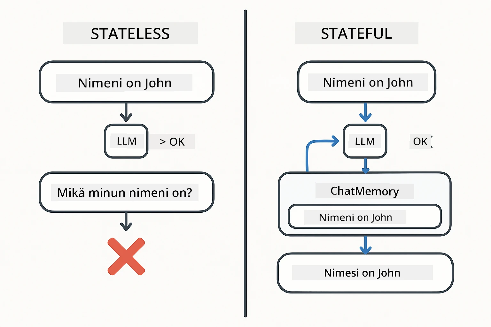
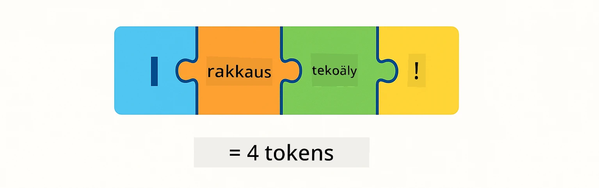
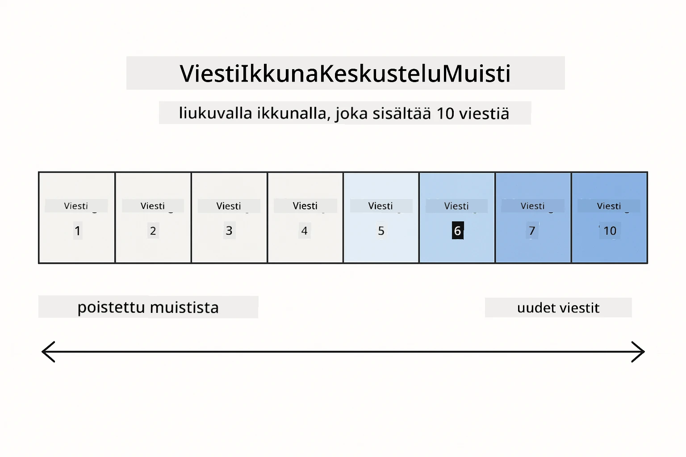
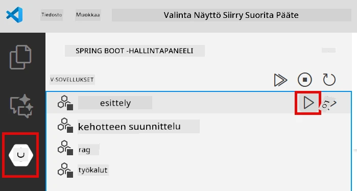
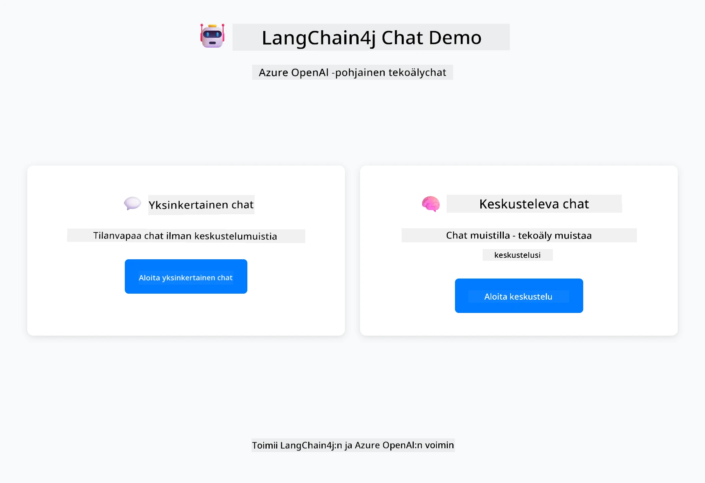
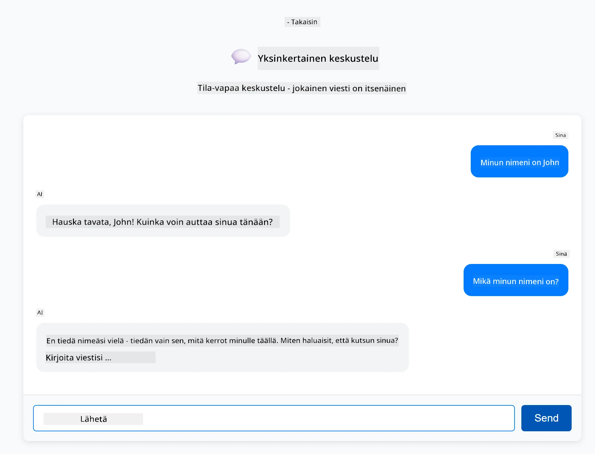
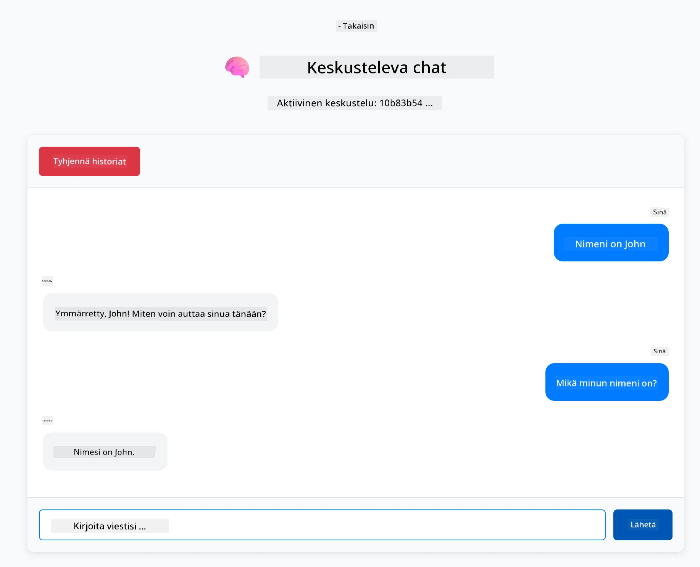

# Moduuli 01: LangChain4j:n perusteet

## Sisällysluettelo

- [Videokävely](#videokävely)
- [Mitä opit](#mitä-opit)
- [Esivaatimukset](#esivaatimukset)
- [Ymmärrä ydinkysymys](#ymmärrä-ydinkysymys)
- [Ymmärrä tokenit](#ymmärrä-tokenit)
- [Miten muisti toimii](#miten-muisti-toimii)
- [Miten tämä käyttää LangChain4j:ta](#miten-tämä-käyttää-langchain4jta)
- [Ota Azure OpenAI -infrastruktuuri käyttöön](#ota-azure-openai-infrastruktuuri-käyttöön)
- [Suorita sovellus paikallisesti](#suorita-sovellus-paikallisesti)
- [Sovelluksen käyttäminen](#sovelluksen-käyttäminen)
  - [Stateless Chat (vasen paneeli)](#stateless-chat-vasen-paneeli)
  - [Stateful Chat (oikea paneeli)](#stateful-chat-oikea-paneeli)
- [Seuraavat askeleet](#seuraavat-askeleet)

## Videokävely

Katso tämä live-sessio, joka selittää, miten aloittaa tämän moduulin kanssa:

<a href="https://www.youtube.com/live/nl_troDm8rQ?si=6b85S8xGjWnT2fX9"></a>

## Mitä opit

Tämä on lähtökohtasi LangChain4j:n ja Azure OpenAI:n kanssa. Aloitamme perusteista ja alamme rakentaa tuotantotyyppisiä sovelluksia. Tämä moduuli keskittyy keskustelevaan tekoälyyn, joka muistaa kontekstin ja ylläpitää tilaa — perustavanlaatuiset käsitteet, joihin myöhemmät moduulit rakentuvat.

Käytämme koko oppaassa Azure OpenAI:n GPT-5.2:ta, koska sen kehittyneet päättelykyvyt tekevät erilaisten mallien käyttäytymisen selkeämmin näkyväksi. Kun lisäät muistin, näet eron selvästi. Tämä helpottaa ymmärtämään, mitä kukin komponentti tuo sovellukseesi.

Rakennat yhden sovelluksen, joka demonstroi molempia malleja:

**Stateless Chat** – Jokainen pyyntö on itsenäinen. Mallilla ei ole muistia aiemmista viesteistä. Tämä on yksinkertaisin lähtökohta.

**Stateful Conversation** – Jokainen pyyntö sisältää keskusteluhistorian. Malli ylläpitää kontekstia useiden vuorojen ajan. Tätä tuotantosovellukset vaativat.

## Esivaatimukset

- Azure-tilaus, jossa on Azure OpenAI -käyttöoikeus
- Java 21, Maven 3.9+
- Azure CLI (https://learn.microsoft.com/en-us/cli/azure/install-azure-cli)
- Azure Developer CLI (azd) (https://learn.microsoft.com/en-us/azure/developer/azure-developer-cli/install-azd)

> **Huom:** Java, Maven, Azure CLI ja Azure Developer CLI (azd) on esiasennettu toimitettuun kehitysympäristöön.

> **Huom:** Tämä moduuli käyttää GPT-5.2:ta Azure OpenAI:ssa. Käyttöönotto määritetään automaattisesti komennolla `azd up` – älä muuta mallin nimeä koodissa.

## Ymmärrä ydinkysymys

Kielimallit ovat tilattomia. Jokainen API-kutsu on itsenäinen. Jos lähettää "Minun nimeni on John" ja sitten kysyy "Mikä on nimeni?", malli ei tiedä, että juuri esittelit itsesi. Se käsittelee jokaisen pyynnön ikään kuin se olisi sinun ensimmäinen keskustelusi koskaan.

Tämä toimii yksinkertaisissa kysymys-vastaus-tilanteissa, mutta on käyttökelvoton oikeissa sovelluksissa. Asiakaspalvelubottien täytyy muistaa, mitä kerroit heille. Henkilökohtaiset avustajat tarvitsevat kontekstin. Kaikki monivuorovaikutteiset keskustelut vaativat muistia.

Seuraava kuvio vertaa kahta lähestymistapaa — vasemmalla tilaton kutsu, joka unohtaa nimesi; oikealla tilallinen kutsu, jota tukee ChatMemory, joka muistaa sen.



*Erot tilattoman (itsenäiset kutsut) ja tilallisen (kontekstia ymmärtävän) keskustelun välillä*

## Ymmärrä tokenit

Ennen keskusteluihin sukeltamista on tärkeää ymmärtää tokenit – perusyksiköt tekstiä, joita kielimallit käsittelevät:



*Esimerkki siitä, miten teksti pilkotaan tokeneiksi – "I love AI!" muodostaa 4 erillistä käsittelyyksikköä*

Tokenit ovat tapa, jolla tekoälymallit mittaavat ja käsittelevät tekstiä. Sanat, välimerkit ja jopa välilyönnit voivat olla tokeneita. Mallillasi on raja, kuinka monta tokenia se voi käsitellä kerralla (GPT-5.2:lla 400 000, joista enintään 272 000 syöttötokeneita ja 128 000 tulostokoneita). Tokenien ymmärtäminen auttaa hallitsemaan keskustelun pituutta ja kustannuksia.

## Miten muisti toimii

Chat-muisti ratkaisee tilattomuuden ongelman säilyttämällä keskusteluhistorian. Ennen malliin lähettämistä kehys lisää siihen relevantit aiemmat viestit. Kun kysyt "Mikä on nimeni?", järjestelmä lähettää koko keskusteluhistorian, jolloin malli näkee, että sanasit aiemmin "Minun nimeni on John."

LangChain4j tarjoaa muistien toteutuksia, jotka hoitavat tämän automaattisesti. Valitset, kuinka monta viestiä haluat säilyttää, ja kehys hallinnoi konteksti-ikkunaa. Alla oleva kuvio näyttää, miten MessageWindowChatMemory ylläpitää liukuvana ikkunana uusimpia viestejä.



*MessageWindowChatMemory ylläpitää liukuvana ikkunana uusimpia viestejä, pudottaen automaattisesti vanhat*

## Miten tämä käyttää LangChain4j:ta

Tämä moduuli integroi Spring Bootin ja lisää keskustelumuistin. Näin osat nivoutuvat yhteen:

**Riippuvuudet** – Lisää kaksi LangChain4j-kirjastoa:

```xml
<dependency>
    <groupId>dev.langchain4j</groupId>
    <artifactId>langchain4j</artifactId> <!-- Inherited from BOM in root pom.xml -->
</dependency>
<dependency>
    <groupId>dev.langchain4j</groupId>
    <artifactId>langchain4j-open-ai-official</artifactId> <!-- Inherited from BOM in root pom.xml -->
</dependency>
```

**Chat-malli** – Määritä Azure OpenAI Springin beanina ([LangChainConfig.java](../../../01-introduction/src/main/java/com/example/langchain4j/config/LangChainConfig.java)):

```java
@Bean
public OpenAiOfficialChatModel openAiOfficialChatModel() {
    return OpenAiOfficialChatModel.builder()
            .baseUrl(azureEndpoint)
            .apiKey(azureApiKey)
            .modelName(deploymentName)
            .timeout(Duration.ofMinutes(5))
            .maxRetries(3)
            .build();
}
```

Rakentaja lukee tunnistetiedot ympäristömuuttujista, jotka `azd up` asettaa. Määrittämällä `baseUrl` Azure-päätepisteeksi OpenAI-asiakas toimii Azure OpenAI:n kanssa.

**Keskustelumuisti** – Seuraa chat-historiaa MessageWindowChatMemorylla ([ConversationService.java](../../../01-introduction/src/main/java/com/example/langchain4j/service/ConversationService.java)):

```java
ChatMemory memory = MessageWindowChatMemory.withMaxMessages(10);

memory.add(UserMessage.from("My name is John"));
memory.add(AiMessage.from("Nice to meet you, John!"));

memory.add(UserMessage.from("What's my name?"));
AiMessage aiMessage = chatModel.chat(memory.messages()).aiMessage();
memory.add(aiMessage);
```

Luo muisti komennolla `withMaxMessages(10)` jättäen viimeiset 10 viestiä talteen. Lisää käyttäjän ja tekoälyn viestit tyypitetyillä kääreillä: `UserMessage.from(text)` ja `AiMessage.from(text)`. Hae historia `memory.messages()`-metodilla ja lähetä se mallille. Palvelu tallentaa erilliset muistiyksiköt kutakin keskustelutunnusta varten, mahdollistaen useiden käyttäjien samanaikaisen chatin.

> **🤖 Kokeile GitHub Copilotin [Chatin](https://github.com/features/copilot) kanssa:** Avaa [`ConversationService.java`](../../../01-introduction/src/main/java/com/example/langchain4j/service/ConversationService.java) ja kysy:
> - "Miten MessageWindowChatMemory päättää, mitkä viestit pudotetaan, kun ikkuna on täysi?"
> - "Voinko toteuttaa oman muistivarastoinnin tietokannan avulla in-memoryn sijaan?"
> - "Miten lisäisin yhteenvetotoiminnon vanhan keskusteluhistorian tiivistämiseksi?"

Tilaton chat-päätepiste jättää muistin kokonaan pois – vain `chatModel.chat(prompt)` kuten pika-alussa. Tilallinen päätepiste lisää viestit muistiin, hakee historian ja liittää kontekstin jokaiseen pyyntöön. Sama malliasetus, erilaiset toteutustyylit.

## Ota Azure OpenAI -infrastruktuuri käyttöön

**Bash:**
```bash
cd 01-introduction
azd up  # Valitse tilaus ja sijainti (suositeltu eastus2)
```

**PowerShell:**
```powershell
cd 01-introduction
azd up  # Valitse tilaus ja sijainti (eastus2 suositus)
```

> **Huom:** Jos kohtaat aikakatkaisuvirheen (`RequestConflict: Cannot modify resource ... provisioning state is not terminal`), suorita vain `azd up` uudelleen. Azure-resurssit saattavat olla vielä määrittelyvaiheessa taustalla, ja uudelleenyritys mahdollistaa käyttöönoton etenemisen, kun tilat saavuttavat loppuvaiheen.

Tämä:
1. Ottaa käyttöön Azure OpenAI -resurssin GPT-5.2:lla ja text-embedding-3-small -malleilla
2. Luo automaattisesti `.env`-tiedoston projektin juureen tunnistetiedoilla
3. Asettaa kaikki tarvittavat ympäristömuuttujat

**Onko käyttöönotossa ongelmia?** Katso [Infrastructure README](infra/README.md) saadaksesi yksityiskohtaisia ohjeita, mukaan lukien aliverkkotunnusten ristiriidat, manuaaliset Azure-portaalin käyttöönotto-ohjeet ja mallien konfigurointiohjeet.

**Varmista, että käyttöönotto onnistui:**

**Bash:**
```bash
cat ../.env  # Pitäisi näyttää AZURE_OPENAI_ENDPOINT, API_KEY, jne.
```

**PowerShell:**
```powershell
Get-Content ..\.env  # Tulisi näyttää AZURE_OPENAI_ENDPOINT, API_KEY jne.
```

> **Huom:** `azd up` -komento luo `.env`-tiedoston automaattisesti. Jos sinun täytyy päivittää sitä myöhemmin, voit joko muokata `.env`-tiedostoa manuaalisesti tai luoda sen uudelleen ajamalla:
>
> **Bash:**
> ```bash
> cd ..
> bash .azd-env.sh
> ```
>
> **PowerShell:**
> ```powershell
> cd ..
> .\.azd-env.ps1
> ```

## Suorita sovellus paikallisesti

**Varmista käyttöönoton onnistuminen:**

Varmista, että `.env`-tiedosto on olemassa juurikansiossa Azure-tunnistetietoineen. Suorita tämä moduulikansiosta (`01-introduction/`):

**Bash:**
```bash
cat ../.env  # Tulisi näyttää AZURE_OPENAI_ENDPOINT, API_KEY, DEPLOYMENT
```

**PowerShell:**
```powershell
Get-Content ..\.env  # Tulisi näyttää AZURE_OPENAI_ENDPOINT, API_KEY, DEPLOYMENT
```

**Käynnistä sovellukset:**

**Vaihtoehto 1: Spring Boot Dashboardin käyttö (suositeltu VS Code -käyttäjille)**

Kehitysympäristö sisältää Spring Boot Dashboard -laajennuksen, joka tarjoaa visuaalisen käyttöliittymän kaikkien Spring Boot -sovellusten hallintaan. Löydät sen VS Coden vasemman reunan Activity Barista (etsi Spring Boot -kuvake).

Spring Boot Dashboardista voit:
- Nähdä kaikki työtilan käytettävissä olevat Spring Boot -sovellukset
- Käynnistää/pysäyttää sovellukset yhdellä napsautuksella
- Tarkastella sovelluslokeja reaaliaikaisesti
- Valvoa sovelluksen tilaa

Napsauta toistopainiketta kohdan "introduction" vieressä käynnistääksesi tämän moduulin, tai käynnistä kaikki moduulit kerralla.



*Spring Boot Dashboard VS Codessa — käynnistä, pysäytä ja valvo kaikkia moduuleja yhdestä paikasta*

**Vaihtoehto 2: Shell-skriptien käyttö**

Käynnistä kaikki web-sovellukset (moduulit 01-04):

**Bash:**
```bash
cd ..  # Juurihakemistosta
./start-all.sh
```

**PowerShell:**
```powershell
cd ..  # Juurihakemistosta
.\start-all.ps1
```

Tai käynnistä vain tämä moduuli:

**Bash:**
```bash
cd 01-introduction
./start.sh
```

**PowerShell:**
```powershell
cd 01-introduction
.\start.ps1
```

Molemmat skriptit lataavat automaattisesti ympäristömuuttujat juuren `.env`-tiedostosta ja rakentavat JAR-tiedostot, jos niitä ei vielä ole.

> **Huom:** Jos haluat rakentaa kaikki moduulit manuaalisesti ennen käynnistystä:
>
> **Bash:**
> ```bash
> cd ..  # Go to root directory
> mvn clean package -DskipTests
> ```
>
> **PowerShell:**
> ```powershell
> cd ..  # Go to root directory
> mvn clean package -DskipTests
> ```

Avaa selaimessa http://localhost:8080.

**Sovelluksen pysäyttäminen:**

**Bash:**
```bash
./stop.sh  # Vain tämä moduuli
# Tai
cd .. && ./stop-all.sh  # Kaikki moduulit
```

**PowerShell:**
```powershell
.\stop.ps1  # Vain tämä moduuli
# Tai
cd ..; .\stop-all.ps1  # Kaikki moduulit
```

## Sovelluksen käyttäminen

Sovellus tarjoaa verkkokäyttöliittymän, jossa on kaksi chat-toteutusta vierekkäin.



*Etusivu, jossa näkyvissä sekä Simple Chat (stateless) että Conversational Chat (stateful) -vaihtoehdot*

### Stateless Chat (vasen paneeli)

Kokeile ensin tätä. Kysy "Minun nimeni on John" ja heti perään "Mikä on nimeni?" Malli ei muista, koska kukin viesti on itsenäinen. Tämä havainnollistaa perusongelman peruskielimallien integroinnissa – ei keskustelukontekstia.



*Tekoäly ei muista nimeäsi edellisestä viestistä*

### Stateful Chat (oikea paneeli)

Kokeile nyt samaa sarjaa täällä. Kysy "Minun nimeni on John" ja sitten "Mikä on nimeni?" Tällä kertaa se muistaa. Erotuksena on MessageWindowChatMemory – se ylläpitää keskusteluhistoriaa ja lisää sen jokaiseen pyyntöön. Näin tuotantokeskusteleva tekoäly toimii.



*Tekoäly muistaa nimesi aiemmasta keskustelusta*

Molemmat paneelit käyttävät samaa GPT-5.2-mallia. Erona on vain muisti. Tämä selkeyttää, mitä muisti tuo sovellukseesi ja miksi se on välttämätön oikeissa käyttötapauksissa.

## Seuraavat askeleet

**Seuraava moduuli:** [02-prompt-engineering - Prompt Engineering GPT-5.2:n kanssa](../02-prompt-engineering/README.md)

---

**Navigointi:** [← Takaisin pääsivulle](../README.md) | [Seuraava: Moduuli 02 - Prompt Engineering →](../02-prompt-engineering/README.md)

---

<!-- CO-OP TRANSLATOR DISCLAIMER START -->
**Vastuuvapauslauseke**:
Tämä asiakirja on käännetty käyttämällä tekoälypohjaista käännöspalvelua [Co-op Translator](https://github.com/Azure/co-op-translator). Vaikka pyrimme tarkkuuteen, otathan huomioon, että automaattiset käännökset saattavat sisältää virheitä tai epätarkkuuksia. Alkuperäinen asiakirja sen alkuperäiskielellä on virallinen lähde. Tärkeissä asioissa suositellaan ammattimaista ihmiskäännöstä. Emme ole vastuussa tämän käännöksen käytöstä aiheutuvista väärinymmärryksistä tai tulkinnoista.
<!-- CO-OP TRANSLATOR DISCLAIMER END -->