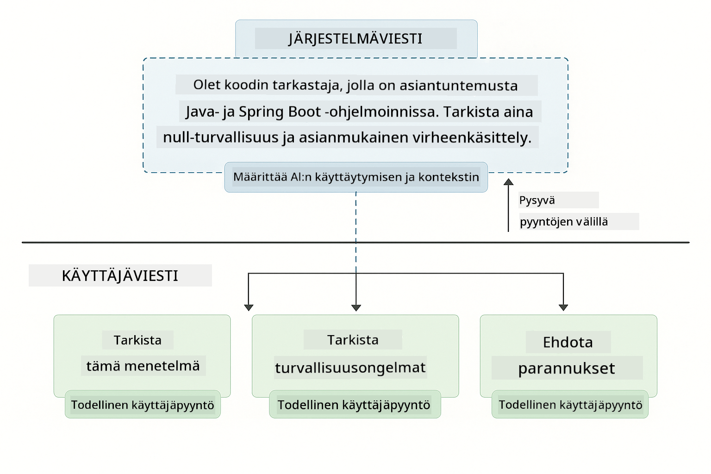
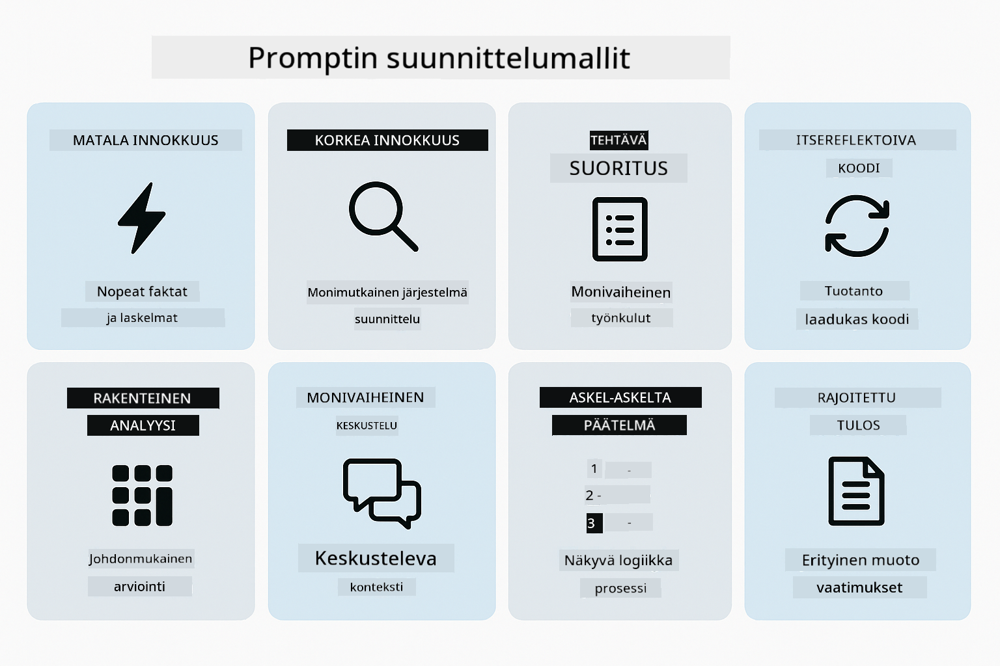
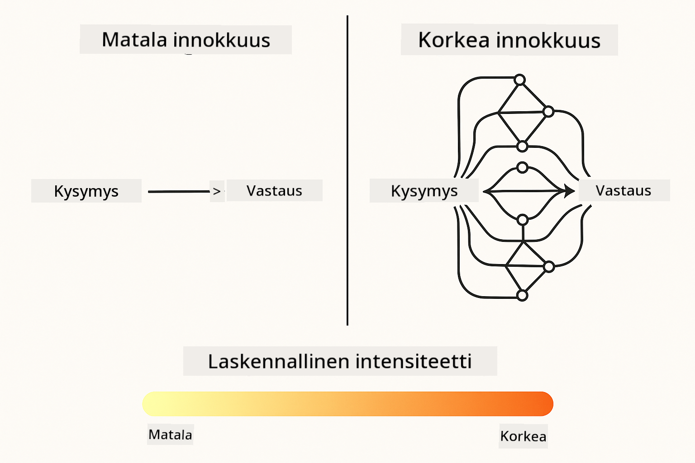
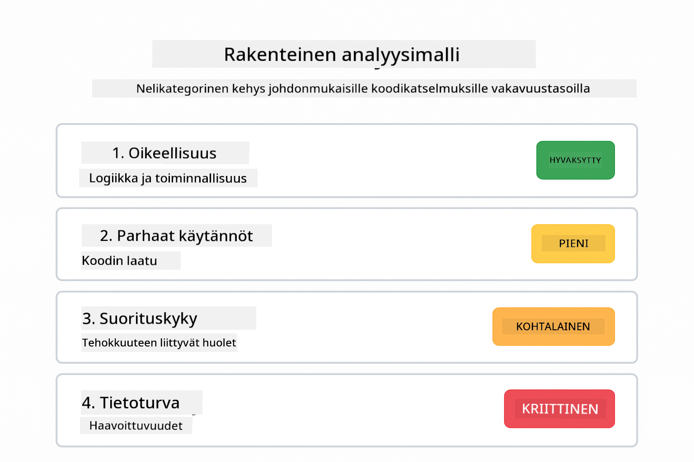
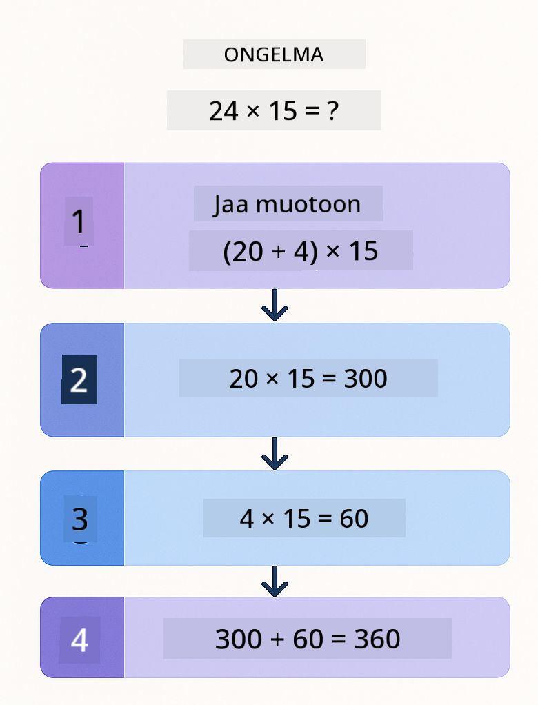
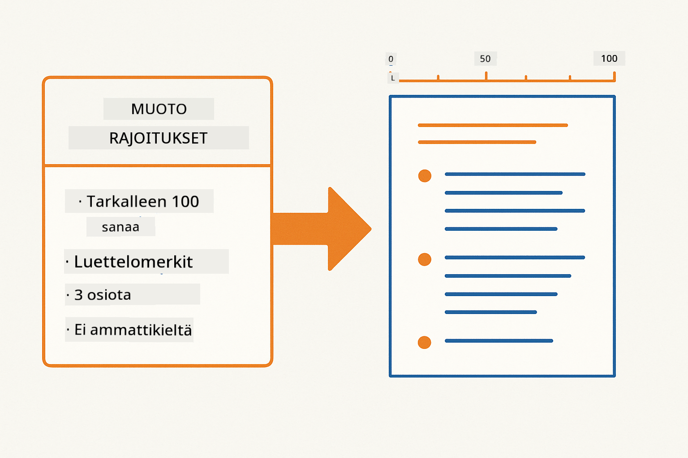
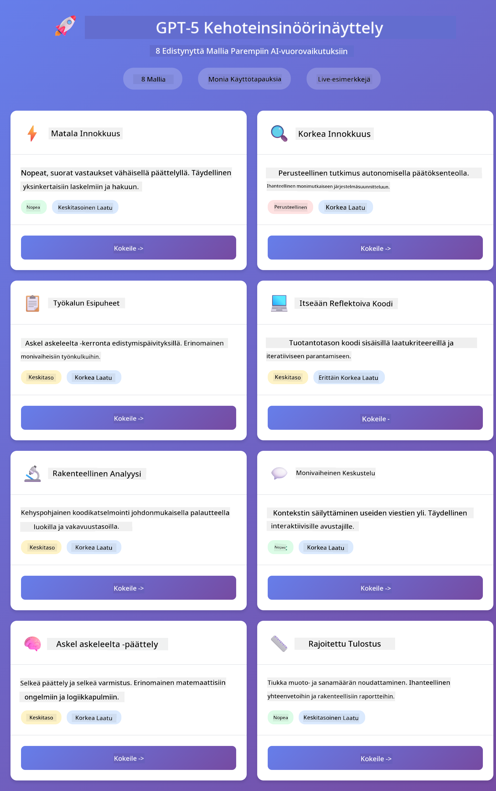
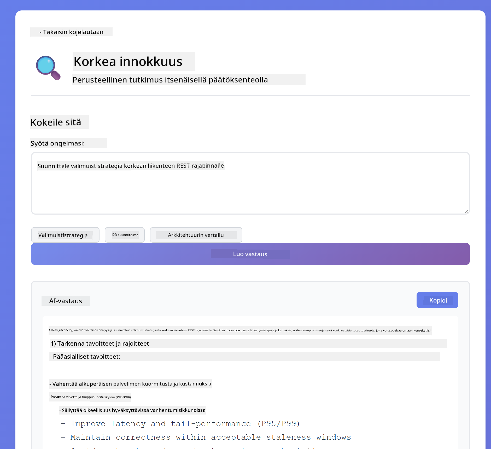

<!--
CO_OP_TRANSLATOR_METADATA:
{
  "original_hash": "8d787826cad7e92bf5cdbd116b1e6116",
  "translation_date": "2025-12-13T16:13:43+00:00",
  "source_file": "02-prompt-engineering/README.md",
  "language_code": "fi"
}
-->
# Moduuli 02: Prompt-suunnittelu GPT-5:n kanssa

## Sisällysluettelo

- [Mitä opit](../../../02-prompt-engineering)
- [Esivaatimukset](../../../02-prompt-engineering)
- [Prompt-suunnittelun ymmärtäminen](../../../02-prompt-engineering)
- [Miten tämä käyttää LangChain4j:ää](../../../02-prompt-engineering)
- [Keskeiset mallit](../../../02-prompt-engineering)
- [Olemassa olevien Azure-resurssien käyttö](../../../02-prompt-engineering)
- [Sovelluksen kuvakaappaukset](../../../02-prompt-engineering)
- [Mallien tutkiminen](../../../02-prompt-engineering)
  - [Matala vs korkea innokkuus](../../../02-prompt-engineering)
  - [Tehtävän suoritus (työkalujen esipuheet)](../../../02-prompt-engineering)
  - [Itsearvioiva koodi](../../../02-prompt-engineering)
  - [Rakenteellinen analyysi](../../../02-prompt-engineering)
  - [Monivaiheinen keskustelu](../../../02-prompt-engineering)
  - [Askel askeleelta päättely](../../../02-prompt-engineering)
  - [Rajoitettu tulostus](../../../02-prompt-engineering)
- [Mitä todella opit](../../../02-prompt-engineering)
- [Seuraavat askeleet](../../../02-prompt-engineering)

## Mitä opit

Edellisessä moduulissa näit, miten muisti mahdollistaa keskustelevan tekoälyn ja käytit GitHub-malleja perusvuorovaikutuksiin. Nyt keskitymme siihen, miten esität kysymyksiä – itse kehotteisiin – käyttäen Azure OpenAI:n GPT-5:ttä. Tapa, jolla rakennat kehotteesi, vaikuttaa dramaattisesti saamiesi vastausten laatuun.

Käytämme GPT-5:ttä, koska se tuo mukanaan päättelyohjauksen – voit kertoa mallille, kuinka paljon sen tulee ajatella ennen vastaamista. Tämä tekee erilaisista kehotteiden suunnittelustrategioista selkeämpiä ja auttaa ymmärtämään, milloin käyttää kutakin lähestymistapaa. Hyödymme myös Azuren vähäisemmistä rajoituksista GPT-5:lle verrattuna GitHub-malleihin.

## Esivaatimukset

- Moduuli 01 suoritettu (Azure OpenAI -resurssit otettu käyttöön)
- Juurikansiossa `.env`-tiedosto, jossa Azure-tunnistetiedot (luotu `azd up` -komennolla Moduulissa 01)

> **Huom:** Jos et ole suorittanut Moduulia 01, noudata ensin siellä annettuja käyttöönotto-ohjeita.

## Prompt-suunnittelun ymmärrys

Prompt-suunnittelu tarkoittaa syötetekstin suunnittelua siten, että saat johdonmukaisesti tarvitsemasi tulokset. Kyse ei ole pelkästään kysymysten esittämisestä – vaan pyyntöjen jäsentämisestä niin, että malli ymmärtää tarkalleen, mitä haluat ja miten sen tulee vastata.

Ajattele sitä kuin antaisit ohjeita kollegalle. "Korjaa bugi" on epämääräinen. "Korjaa null pointer -poikkeus UserService.java-tiedoston rivillä 45 lisäämällä null-tarkistus" on tarkka. Kielenmallit toimivat samalla tavalla – täsmällisyys ja rakenne ovat tärkeitä.

## Miten tämä käyttää LangChain4j:ää

Tämä moduuli demonstroi edistyneitä kehotemalleja käyttäen samaa LangChain4j-pohjaa kuin aiemmat moduulit, keskittyen kehotteiden rakenteeseen ja päättelyohjaukseen.


*Kuinka LangChain4j yhdistää kehotteesi Azure OpenAI GPT-5:een*

**Riippuvuudet** – Moduuli 02 käyttää seuraavia langchain4j-riippuvuuksia, jotka on määritelty `pom.xml`-tiedostossa:
```xml
<dependency>
    <groupId>dev.langchain4j</groupId>
    <artifactId>langchain4j</artifactId> <!-- Inherited from BOM in root pom.xml -->
</dependency>
<dependency>
    <groupId>dev.langchain4j</groupId>
    <artifactId>langchain4j-open-ai-official</artifactId> <!-- Inherited from BOM in root pom.xml -->
</dependency>
```

**OpenAiOfficialChatModel-konfiguraatio** – [LangChainConfig.java](../../../02-prompt-engineering/src/main/java/com/example/langchain4j/prompts/config/LangChainConfig.java)

Chat-malli on manuaalisesti konfiguroitu Spring beaniksi käyttäen OpenAI Official -asiakasta, joka tukee Azure OpenAI -päätepisteitä. Keskeinen ero Moduuliin 01 verrattuna on, miten rakennamme kehotteet, jotka lähetetään `chatModel.chat()`-metodille, ei itse mallin asetuksissa.

**Järjestelmä- ja käyttäjäviestit** – [Gpt5PromptService.java](../../../02-prompt-engineering/src/main/java/com/example/langchain4j/prompts/service/Gpt5PromptService.java)

LangChain4j erottaa viestityypit selkeyden vuoksi. `SystemMessage` asettaa tekoälyn käyttäytymisen ja kontekstin (kuten "Olet koodiarvioija"), kun taas `UserMessage` sisältää varsinaisen pyynnön. Tämä erottelu mahdollistaa johdonmukaisen tekoälyn käyttäytymisen eri käyttäjäkyselyissä.

```java
SystemMessage systemMsg = SystemMessage.from(
    "You are a helpful Java programming expert."
);

UserMessage userMsg = UserMessage.from(
    "Explain what a List is in Java"
);

String response = chatModel.chat(systemMsg, userMsg);
```



*SystemMessage tarjoaa pysyvän kontekstin, kun UserMessages sisältävät yksittäiset pyynnöt*

**MessageWindowChatMemory monivaiheiseen keskusteluun** – Monivaiheisen keskustelumallin toteutuksessa käytämme uudelleen `MessageWindowChatMemory`-luokkaa Moduulista 01. Jokaiselle istunnolle luodaan oma muistinsa, joka tallennetaan `Map<String, ChatMemory>`-rakenteeseen, mahdollistaen useiden samanaikaisten keskustelujen ilman kontekstin sekoittumista.

**Prompt-mallit** – Todellinen painopiste on prompt-suunnittelussa, ei uusissa LangChain4j-rajapinnoissa. Jokainen malli (matala innokkuus, korkea innokkuus, tehtävän suoritus jne.) käyttää samaa `chatModel.chat(prompt)`-metodia, mutta huolellisesti rakennetuin kehotetekstein. XML-tunnisteet, ohjeet ja muotoilu ovat osa kehotetekstiä, eivät LangChain4j:n ominaisuuksia.

**Päättelyohjaus** – GPT-5:n päättelyä ohjataan kehotteissa annettavilla ohjeilla, kuten "enintään 2 päättelyaskelta" tai "tutki perusteellisesti". Nämä ovat prompt-suunnittelutekniikoita, eivät LangChain4j:n asetuksia. Kirjasto vain välittää kehotteesi mallille.

Keskeinen opetus: LangChain4j tarjoaa infrastruktuurin (malliyhteyden [LangChainConfig.java](../../../02-prompt-engineering/src/main/java/com/example/langchain4j/prompts/config/LangChainConfig.java) kautta, muistin ja viestien käsittelyn [Gpt5PromptService.java](../../../02-prompt-engineering/src/main/java/com/example/langchain4j/prompts/service/Gpt5PromptService.java) kautta), kun taas tämä moduuli opettaa, miten luoda tehokkaita kehotteita tämän infrastruktuurin sisällä.

## Keskeiset mallit

Kaikki ongelmat eivät vaadi samaa lähestymistapaa. Jotkut kysymykset tarvitsevat nopeita vastauksia, toiset syvällistä pohdintaa. Jotkut vaativat näkyvää päättelyä, toiset pelkkiä tuloksia. Tämä moduuli kattaa kahdeksan kehotemallia – jokainen optimoitu eri tilanteisiin. Kokeilet kaikkia oppiaksesi, milloin mikäkin toimii parhaiten.



*Yhdeksän prompt-suunnittelumallin yleiskatsaus ja käyttötarkoitukset*



*Matala innokkuus (nopea, suora) vs korkea innokkuus (perusteellinen, tutkiva) päättelylähestymistavat*

**Matala innokkuus (nopea & kohdennettu)** – Yksinkertaisiin kysymyksiin, joissa haluat nopeita ja suoria vastauksia. Malli tekee minimaalisen päättelyn – enintään 2 askelta. Käytä tätä laskuihin, hakuun tai suoraviivaisiin kysymyksiin.

```java
String prompt = """
    <reasoning_effort>low</reasoning_effort>
    <instruction>maximum 2 reasoning steps</instruction>
    
    What is 15% of 200?
    """;

String response = chatModel.chat(prompt);
```

> 💡 **Tutki GitHub Copilotin kanssa:** Avaa [`Gpt5PromptService.java`](../../../02-prompt-engineering/src/main/java/com/example/langchain4j/prompts/service/Gpt5PromptService.java) ja kysy:
> - "Mikä on ero matalan ja korkean innokkuuden kehotemallien välillä?"
> - "Miten XML-tunnisteet kehotteissa auttavat jäsentämään tekoälyn vastausta?"
> - "Milloin käytän itsearviointimalleja verrattuna suoriin ohjeisiin?"

**Korkea innokkuus (syvällinen & perusteellinen)** – Monimutkaisiin ongelmiin, joissa haluat kattavan analyysin. Malli tutkii perusteellisesti ja näyttää yksityiskohtaisen päättelyn. Käytä tätä järjestelmäsuunnitteluun, arkkitehtuuripäätöksiin tai monimutkaiseen tutkimukseen.

```java
String prompt = """
    <reasoning_effort>high</reasoning_effort>
    <instruction>explore thoroughly, show detailed reasoning</instruction>
    
    Design a caching strategy for a high-traffic REST API.
    """;

String response = chatModel.chat(prompt);
```

**Tehtävän suoritus (askel askeleelta eteneminen)** – Monivaiheisiin työnkulkuihin. Malli antaa etukäteissuunnitelman, kuvailee jokaisen vaiheen työskennellessään ja lopuksi antaa yhteenvedon. Käytä tätä migraatioihin, toteutuksiin tai mihin tahansa monivaiheiseen prosessiin.

```java
String prompt = """
    <task>Create a REST endpoint for user registration</task>
    <preamble>Provide an upfront plan</preamble>
    <narration>Narrate each step as you work</narration>
    <summary>Summarize what was accomplished</summary>
    """;

String response = chatModel.chat(prompt);
```

Ajatusketju-kehotteet pyytävät mallia näyttämään päättelyprosessinsa, mikä parantaa tarkkuutta monimutkaisissa tehtävissä. Askel askeleelta -erittely auttaa sekä ihmisiä että tekoälyä ymmärtämään logiikan.

> **🤖 Kokeile [GitHub Copilot](https://github.com/features/copilot) Chatin kanssa:** Kysy tästä mallista:
> - "Miten mukauttaisin tehtävän suoritusmallia pitkäkestoisiin operaatioihin?"
> - "Mitkä ovat parhaat käytännöt työkalujen esipuheiden jäsentämiseen tuotantosovelluksissa?"
> - "Miten voin tallentaa ja näyttää väliaikaiset etenemispäivitykset käyttöliittymässä?"


*Suunnittele → Suorita → Yhteenveto -työnkulku monivaiheisille tehtäville*

**Itsearvioiva koodi** – Tuotantolaatuisen koodin generointiin. Malli generoi koodin, tarkistaa sen laatukriteerejä vasten ja parantaa sitä iteratiivisesti. Käytä tätä uusien ominaisuuksien tai palveluiden rakentamiseen.

```java
String prompt = """
    <task>Create an email validation service</task>
    <quality_criteria>
    - Correct logic and error handling
    - Best practices (clean code, proper naming)
    - Performance optimization
    - Security considerations
    </quality_criteria>
    <instruction>Generate code, evaluate against criteria, improve iteratively</instruction>
    """;

String response = chatModel.chat(prompt);
```


*Iteratiivinen parannussykli – generoi, arvioi, tunnista ongelmat, paranna, toista*

**Rakenteellinen analyysi** – Johdonmukaiseen arviointiin. Malli tarkastaa koodin kiinteän kehyksen mukaan (oikeellisuus, käytännöt, suorituskyky, turvallisuus). Käytä tätä koodikatselmuksiin tai laatutarkastuksiin.

```java
String prompt = """
    <code>
    public List getUsers() {
        return database.query("SELECT * FROM users");
    }
    </code>
    
    <framework>
    Evaluate using these categories:
    1. Correctness - Logic and functionality
    2. Best Practices - Code quality
    3. Performance - Efficiency concerns
    4. Security - Vulnerabilities
    </framework>
    """;

String response = chatModel.chat(prompt);
```

> **🤖 Kokeile [GitHub Copilot](https://github.com/features/copilot) Chatin kanssa:** Kysy rakenteellisesta analyysistä:
> - "Miten voin mukauttaa analyysikehystä eri tyyppisiin koodikatselmuksiin?"
> - "Mikä on paras tapa jäsentää ja käsitellä rakenteellista tulostetta ohjelmallisesti?"
> - "Miten varmistaa johdonmukaiset vakavuustasot eri katselmusistuntojen välillä?"



*Nelikategorinen kehys johdonmukaisiin koodikatselmuksiin vakavuustasoineen*

**Monivaiheinen keskustelu** – Keskusteluihin, jotka tarvitsevat kontekstia. Malli muistaa aiemmat viestit ja rakentaa niiden päälle. Käytä tätä interaktiivisiin tukisessioihin tai monimutkaiseen kysymys-vastaus-toimintaan.

```java
ChatMemory memory = MessageWindowChatMemory.withMaxMessages(10);

memory.add(UserMessage.from("What is Spring Boot?"));
AiMessage aiMessage1 = chatModel.chat(memory.messages()).aiMessage();
memory.add(aiMessage1);

memory.add(UserMessage.from("Show me an example"));
AiMessage aiMessage2 = chatModel.chat(memory.messages()).aiMessage();
memory.add(aiMessage2);
```


*Kuinka keskustelukonteksti kertyy useiden vuorojen aikana, kunnes token-raja saavutetaan*

**Askel askeleelta päättely** – Ongelmille, jotka vaativat näkyvää logiikkaa. Malli näyttää eksplisiittisen päättelyn jokaiselle askeleelle. Käytä tätä matemaattisiin ongelmiin, logiikkapulmiin tai kun haluat ymmärtää ajatteluprosessin.

```java
String prompt = """
    <instruction>Show your reasoning step-by-step</instruction>
    
    If a train travels 120 km in 2 hours, then stops for 30 minutes,
    then travels another 90 km in 1.5 hours, what is the average speed
    for the entire journey including the stop?
    """;

String response = chatModel.chat(prompt);
```



*Ongelmien pilkkominen eksplisiittisiin loogisiin askeleisiin*

**Rajoitettu tulostus** – Vastauksiin, joilla on erityiset muoto- ja pituusvaatimukset. Malli noudattaa tiukasti muoto- ja pituussääntöjä. Käytä tätä yhteenvetoihin tai kun tarvitset tarkkaa tulostusrakennetta.

```java
String prompt = """
    <constraints>
    - Exactly 100 words
    - Bullet point format
    - Technical terms only
    </constraints>
    
    Summarize the key concepts of machine learning.
    """;

String response = chatModel.chat(prompt);
```



*Erityisten muoto-, pituus- ja rakennevaatimusten noudattaminen*

## Olemassa olevien Azure-resurssien käyttö

**Tarkista käyttöönotto:**

Varmista, että juurikansiossa on `.env`-tiedosto, jossa Azure-tunnistetiedot (luotu Moduulissa 01):
```bash
cat ../.env  # Tulisi näyttää AZURE_OPENAI_ENDPOINT, API_KEY, DEPLOYMENT
```

**Käynnistä sovellus:**

> **Huom:** Jos olet jo käynnistänyt kaikki sovellukset `./start-all.sh` -komennolla Moduulissa 01, tämä moduuli on jo käynnissä portissa 8083. Voit ohittaa alla olevat käynnistyskomennot ja siirtyä suoraan osoitteeseen http://localhost:8083.

**Vaihtoehto 1: Spring Boot Dashboardin käyttö (suositeltu VS Code -käyttäjille)**

Kehitysympäristö sisältää Spring Boot Dashboard -laajennuksen, joka tarjoaa visuaalisen käyttöliittymän kaikkien Spring Boot -sovellusten hallintaan. Löydät sen VS Coden vasemman reunan Activity Barista (etsi Spring Boot -ikonia).

Spring Boot Dashboardista voit:
- Näyttää kaikki työtilan Spring Boot -sovellukset
- Käynnistää/pysäyttää sovelluksia yhdellä napsautuksella
- Tarkastella sovelluslokeja reaaliajassa
- Valvoa sovellusten tilaa

Klikkaa "prompt-engineering" -moduulin vieressä olevaa toistopainiketta käynnistääksesi sen, tai käynnistä kaikki moduulit kerralla.


**Vaihtoehto 2: Shell-skriptien käyttö**

Käynnistä kaikki web-sovellukset (moduulit 01-04):

**Bash:**
```bash
cd ..  # Juurihakemistosta
./start-all.sh
```

**PowerShell:**
```powershell
cd ..  # Juurihakemistosta
.\start-all.ps1
```

Tai käynnistä vain tämä moduuli:

**Bash:**
```bash
cd 02-prompt-engineering
./start.sh
```

**PowerShell:**
```powershell
cd 02-prompt-engineering
.\start.ps1
```

Molemmat skriptit lataavat automaattisesti ympäristömuuttujat juurikansion `.env`-tiedostosta ja rakentavat JAR-tiedostot, jos niitä ei ole olemassa.

> **Huom:** Jos haluat rakentaa kaikki moduulit manuaalisesti ennen käynnistystä:
>
> **Bash:**
> ```bash
> cd ..  # Go to root directory
> mvn clean package -DskipTests
> ```
>
> **PowerShell:**
> ```powershell
> cd ..  # Go to root directory
> mvn clean package -DskipTests
> ```

Avaa selaimessa http://localhost:8083.

**Pysäyttääksesi:**

**Bash:**
```bash
./stop.sh  # Vain tämä moduuli
# Tai
cd .. && ./stop-all.sh  # Kaikki moduulit
```

**PowerShell:**
```powershell
.\stop.ps1  # Vain tämä moduuli
# Tai
cd ..; .\stop-all.ps1  # Kaikki moduulit
```

## Sovelluksen kuvakaappaukset



*Pääasiallinen hallintapaneeli, joka näyttää kaikki 8 prompt-suunnittelumallia niiden ominaisuuksineen ja käyttötapauksineen*

## Mallien tutkiminen

Verkkokäyttöliittymä antaa sinun kokeilla erilaisia kehotteiden suunnittelustrategioita. Jokainen malli ratkaisee eri ongelmia – kokeile niitä nähdäksesi, milloin kukin lähestymistapa toimii parhaiten.

### Matala vs korkea innokkuus

Kysy yksinkertainen kysymys, kuten "Mikä on 15 % luvusta 200?" käyttäen matalaa innokkuutta. Saat välittömän, suoran vastauksen. Kysy nyt jotain monimutkaisempaa, kuten "Suunnittele välimuististrategia korkean liikenteen API:lle" käyttäen korkeaa innokkuutta. Katso, miten malli hidastuu ja antaa yksityiskohtaisen päättelyn. Sama malli, sama kysymysrakenne – mutta kehotteessa kerrotaan, kuinka paljon mallin tulee ajatella.


*Nopea laskenta vähäisellä päättelyllä*



*Kattava välimuististrategia (2,8 Mt)*

### Tehtävän suoritus (työkalujen esilauseet)

Monivaiheiset työnkulut hyötyvät ennakkosuunnittelusta ja etenemisen kertomisesta. Malli hahmottelee, mitä se aikoo tehdä, kertoo jokaisesta vaiheesta ja lopuksi tiivistää tulokset.


*REST-päätepisteen luominen vaihe vaiheelta kertoen (3,9 Mt)*

### Itsearvioiva koodi

Kokeile "Luo sähköpostin validointipalvelu". Sen sijaan, että malli vain generoi koodin ja pysähtyy, se tuottaa, arvioi laatukriteerien mukaan, tunnistaa heikkoudet ja parantaa. Näet sen toistavan prosessia, kunnes koodi täyttää tuotantostandardit.


*Täydellinen sähköpostin validointipalvelu (5,2 Mt)*

### Rakenteellinen analyysi

Koodikatselmukset tarvitsevat johdonmukaiset arviointikehykset. Malli analysoi koodia kiinteiden kategorioiden (oikeellisuus, käytännöt, suorituskyky, turvallisuus) ja vakavuustasojen avulla.


*Kehykseen perustuva koodikatselmus*

### Monikierroksinen keskustelu

Kysy "Mikä on Spring Boot?" ja seuraa heti kysymyksellä "Näytä esimerkki". Malli muistaa ensimmäisen kysymyksesi ja antaa sinulle juuri Spring Boot -esimerkin. Ilman muistia toinen kysymys olisi liian epämääräinen.


*Kontekstin säilyttäminen kysymysten välillä*

### Vaiheittainen päättely

Valitse matemaattinen ongelma ja kokeile sitä sekä vaiheittaisella päättelyllä että vähäisellä innokkuudella. Vähäinen innokkuus antaa vain vastauksen – nopeaa mutta epäselvää. Vaiheittainen näyttää jokaisen laskelman ja päätöksen.


*Matemaattinen ongelma selkeillä vaiheilla*

### Rajoitettu tulostus

Kun tarvitset tiettyjä muotoja tai sanamääriä, tämä malli varmistaa tiukan noudattamisen. Kokeile luoda yhteenveto, jossa on täsmälleen 100 sanaa luettelomuodossa.


*Koneoppimisen yhteenveto muodon hallinnalla*

## Mitä todella opit

**Päättelypanos muuttaa kaiken**

GPT-5 antaa sinun hallita laskentapanosta kehotteidesi kautta. Vähäinen panos tarkoittaa nopeita vastauksia vähäisellä tutkimisella. Korkea panos tarkoittaa, että malli käyttää aikaa syvälliseen ajatteluun. Opit sovittamaan panoksen tehtävän monimutkaisuuteen – älä tuhlaa aikaa yksinkertaisiin kysymyksiin, mutta älä myöskään kiirehdi monimutkaisia päätöksiä.

**Rakenne ohjaa käyttäytymistä**

Huomaatko XML-tunnisteet kehotteissa? Ne eivät ole koristeita. Mallit noudattavat rakenteellisia ohjeita luotettavammin kuin vapaamuotoista tekstiä. Kun tarvitset monivaiheisia prosesseja tai monimutkaista logiikkaa, rakenne auttaa mallia seuraamaan, missä se on ja mitä seuraavaksi tulee.


*Hyvin rakennetun kehotteen anatomia selkeillä osioilla ja XML-tyylisellä järjestelyllä*

**Laatu itsearvioinnin kautta**

Itsearvioivat mallit toimivat tekemällä laatukriteerit selviksi. Sen sijaan, että toivoisit mallin "tekevän oikein", kerrot sille tarkalleen, mitä "oikein" tarkoittaa: oikea logiikka, virheenkäsittely, suorituskyky, turvallisuus. Malli voi sitten arvioida omaa tuotostaan ja parantaa sitä. Tämä muuttaa koodin generoinnin arpajaisista prosessiksi.

**Konteksti on rajallinen**

Monikierroksiset keskustelut toimivat sisällyttämällä viestihistorian jokaiseen pyyntöön. Mutta on olemassa raja – jokaisella mallilla on maksimimäärä tokeneita. Keskustelujen kasvaessa tarvitset strategioita pitää relevantti konteksti ilman, että ylittyy tämä raja. Tämä moduuli näyttää, miten muisti toimii; myöhemmin opit, milloin tiivistää, milloin unohtaa ja milloin hakea.

## Seuraavat askeleet

**Seuraava moduuli:** [03-rag - RAG (Retrieval-Augmented Generation)](../03-rag/README.md)

---

**Navigointi:** [← Edellinen: Moduuli 01 - Johdanto](../01-introduction/README.md) | [Takaisin pääsivulle](../README.md) | [Seuraava: Moduuli 03 - RAG →](../03-rag/README.md)

---

<!-- CO-OP TRANSLATOR DISCLAIMER START -->
**Vastuuvapauslauseke**:
Tämä asiakirja on käännetty käyttämällä tekoälypohjaista käännöspalvelua [Co-op Translator](https://github.com/Azure/co-op-translator). Vaikka pyrimme tarkkuuteen, otathan huomioon, että automaattikäännöksissä saattaa esiintyä virheitä tai epätarkkuuksia. Alkuperäistä asiakirjaa sen alkuperäiskielellä tulee pitää virallisena lähteenä. Tärkeiden tietojen osalta suositellaan ammattimaista ihmiskäännöstä. Emme ole vastuussa tämän käännöksen käytöstä aiheutuvista väärinymmärryksistä tai tulkinnoista.
<!-- CO-OP TRANSLATOR DISCLAIMER END -->