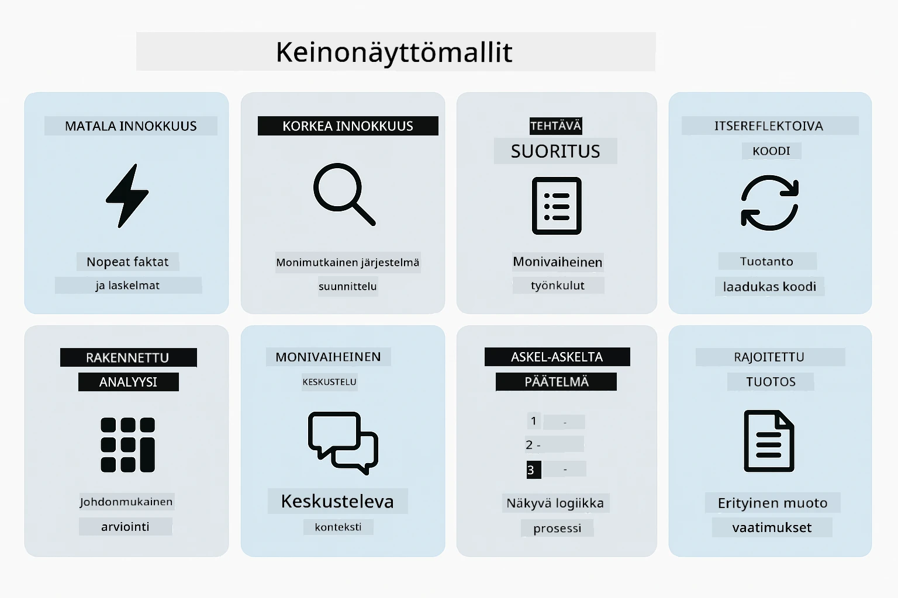
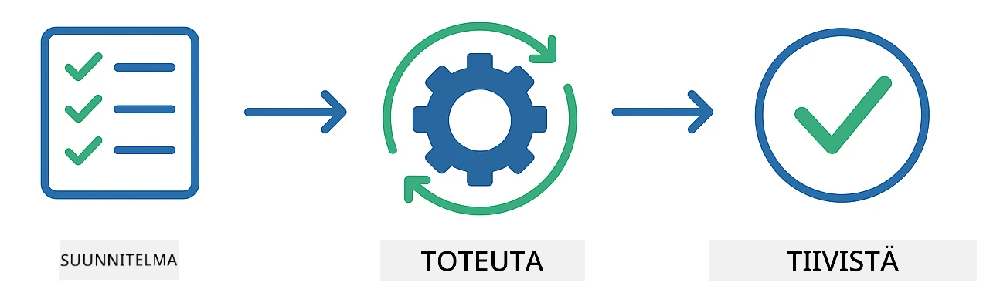
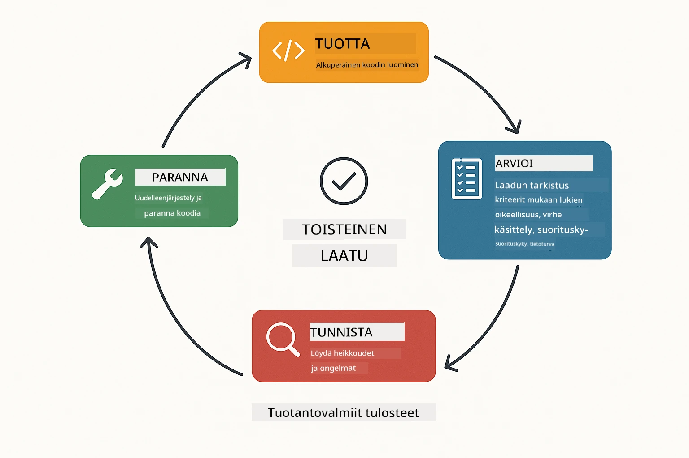
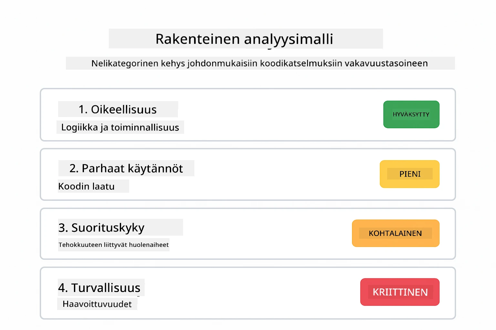
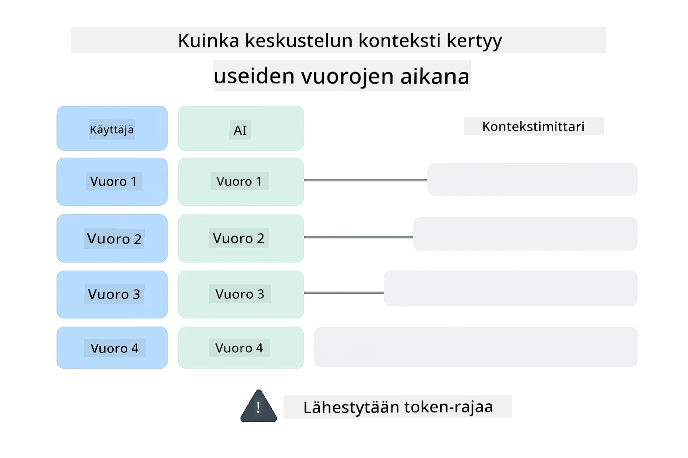
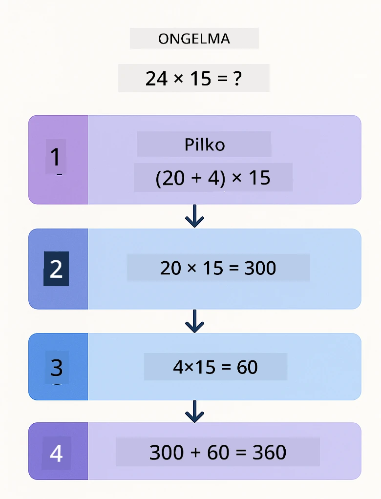
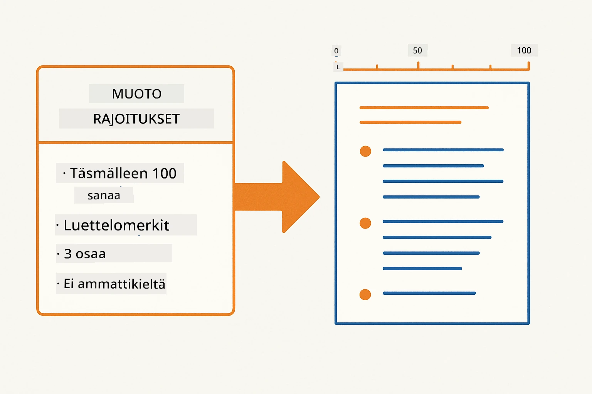
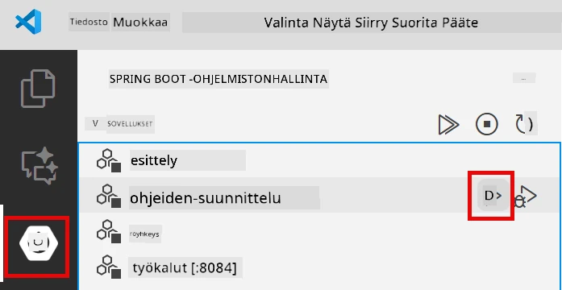
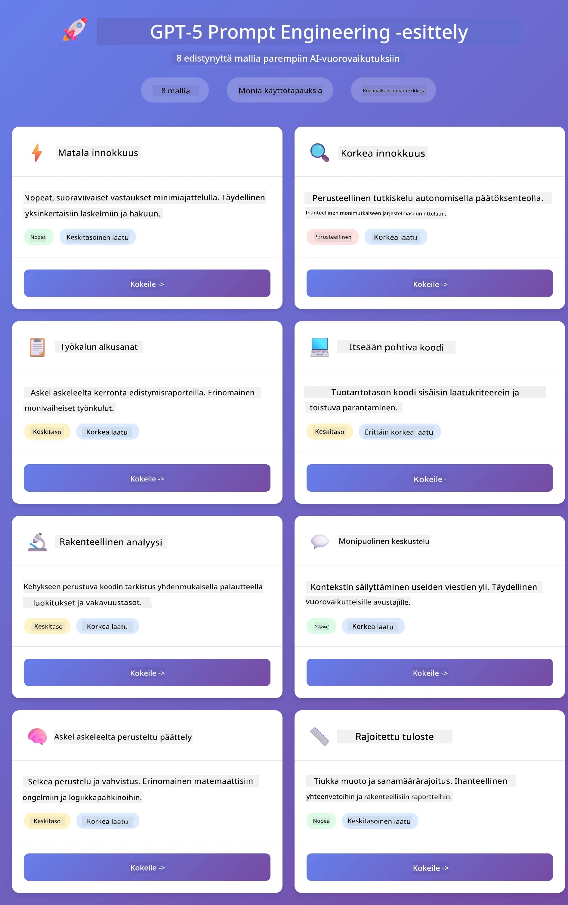
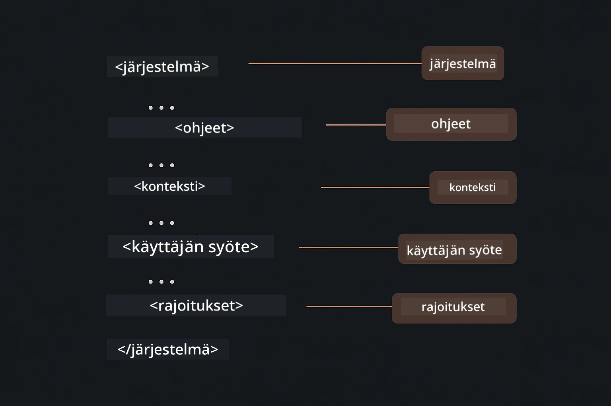

# Moduuli 02: Prompt-suunnittelu GPT-5.2:n kanssa

## Sisällysluettelo

- [Videoesittely](#videoesittely)
- [Mitä opit](#mitä-opit)
- [Esivaatimukset](#esivaatimukset)
- [Ymmärtäminen prompt-suunnittelusta](#ymmärtäminen-prompt-suunnittelusta)
- [Prompt-suunnittelun perusteet](#prompt-suunnittelun-perusteet)
  - [Zero-Shot Prompting](#zero-shot-prompting)
  - [Few-Shot Prompting](#few-shot-prompting)
  - [Chain of Thought](#chain-of-thought)
  - [Role-Based Prompting](#role-based-prompting)
  - [Prompt Templates](#prompt-templates)
- [Edistyneet kuviot](#edistyneet-kuviot)
- [Sovelluksen käynnistäminen](#suorita-sovellus)
- [Sovelluksen kuvakaappauksia](#sovelluksen-kuvakaappaukset)
- [Kuvioiden tutkiminen](#mallien-tutkiminen)
  - [Matala vs korkea innokkuus](#matala-vs-korkea-innokkuus)
  - [Tehtävän suoritus (työkalujen esipuheet)](#tehtävän-suoritus-tool-preambles)
  - [Itsereflektoiva koodi](#itsearvioiva-koodi)
  - [Rakenteellinen analyysi](#rakenteellinen-analyysi)
  - [Monikäyttökertakeskustelu](#monivaiheinen-keskustelu)
  - [Askel askeleelta päättely](#vaiheittainen-päättely)
  - [Rajoitettu tulostus](#rajoitettu-tulostus)
- [Mitä todella opit](#mitä-todellisuudessa-opit)
- [Seuraavat askeleet](#seuraavat-vaiheet)

## Videoesittely

Katso tämä live-sessio, joka selittää, miten aloittaa tämän moduulin kanssa:

<a href="https://www.youtube.com/live/PJ6aBaE6bog?si=LDshyBrTRodP-wke"></a>

## Mitä opit

Seuraava kaavio antaa yleiskuvan moduulin keskeisistä aiheista ja taidoista — promptin hienosäätötekniikoista askel askeleelta etenevään työnkulkuun, jota seuraat.


Edellisessä moduulissa näit, miten muisti mahdollistaa keskustelevan tekoälyn Azure OpenAI:n kanssa. Nyt keskitymme siihen, miten esität kysymykset — eli itse promptit — käyttäen Azure OpenAI:n GPT-5.2:ta. Tapa, jolla rakennat promptisi, vaikuttaa merkittävästi saamiesi vastausten laatuun. Aloitamme perustekniikoiden katsauksella ja siirrymme sitten kahdeksaan edistyneeseen kuvioon, jotka hyödyntävät GPT-5.2:n kykyjä täydellisesti.

Käytämme GPT-5.2:ta, koska se tuo mukanaan päättelyn hallinnan — voit kertoa mallille, kuinka paljon sen tulee ajatella ennen vastaamista. Tämä tuo eri promptausstrategiat selkeämmin esiin ja auttaa ymmärtämään, milloin käyttää kutakin lähestymistapaa.

## Esivaatimukset

- Moduuli 01 suoritettuna (Azure OpenAI -resurssit otettu käyttöön)
- `.env`-tiedosto juurihakemistossa Azure-tunnuksilla (luotu `azd up` -komennolla Moduulissa 01)

> **Huom:** Jos et ole suorittanut Moduulia 01, noudata ensin siellä annettuja käyttöönotto-ohjeita.

## Ymmärtäminen prompt-suunnittelusta

Ytimeltään prompt-suunnittelu on ero epämääräisten ohjeiden ja täsmällisten ohjeiden välillä, kuten alla oleva vertailu havainnollistaa.


Prompt-suunnittelu tarkoittaa syötteen muotoilua siten, että saat jatkuvasti tarvitsemasi tulokset. Kyse ei ole pelkästään kysymysten esittämisestä — vaan pyyntöjen rakenteistamisesta niin, että malli ymmärtää täsmälleen mitä haluat ja miten sen tulee vastata.

Ajattele sitä kuin antaisit ohjeita kollegalle. "Korjaa bugi" on epämääräinen. "Korjaa UserService.java-tiedoston rivin 45 null-viittaus virhe lisäämällä null-tarkistus" on tarkka. Kielimallit toimivat samalla tavalla — täsmällisyys ja rakenne ovat tärkeitä.

Alla olevassa kaaviossa näkyy, miten LangChain4j liittyy tähän kuvaan — se yhdistää prompt-kuviot malliin SystemMessage- ja UserMessage-rakenteiden kautta.


LangChain4j tarjoaa infrastruktuurin — malliyhteydet, muistin ja viestityypit — kun taas prompt-kuviot ovat huolellisesti rakenteistettua tekstiä, jota lähetät tämän infrastruktuurin läpi. Keskeiset rakennuspalikat ovat `SystemMessage` (joka määrittää tekoälyn toiminnan ja roolin) ja `UserMessage` (joka sisältää varsinaisen pyyntösi).

## Prompt-suunnittelun perusteet

Alla esitetyt viisi perusmenetelmää muodostavat tehokkaan prompt-suunnittelun perustan. Kukin käsittelee eri puolta siitä, miten kommunikoit kielimallien kanssa.


Ennen kuin sukellamme moduulin edistyneisiin kuvioihin, kerrataan viisi perustekniikkaa. Nämä ovat rakennuspalikoita, jotka jokaisen prompt-suunnittelijan tulisi tuntea.

### Zero-Shot Prompting

Yksinkertaisin lähestymistapa: anna mallille suora ohje ilman esimerkkejä. Malli luottaa täysin koulutukseensa tehtävän ymmärtämiseksi ja suorittamiseksi. Tämä toimii hyvin suoraviivaisissa pyynnöissä, joissa odotettu käyttäytyminen on ilmeistä.


*Suora ohje ilman esimerkkejä — malli päättelee tehtävän pelkästä ohjeesta*

```java
String prompt = "Classify this sentiment: 'I absolutely loved the movie!'";
String response = model.chat(prompt);
// Vastaus: "Positiivinen"
```

**Milloin käyttää:** Yksinkertaiset luokittelut, suoraviivaista kyselyt, käännökset tai tehtävät, jotka malli osaa hoitaa ilman lisäohjausta.

### Few-Shot Prompting

Anna esimerkkejä, jotka osoittavat mallille seurattavan kaavan. Malli oppii odotetun syöte–tuloste-muodon esimerkeistä ja soveltaa sitä uusiin syötteisiin. Tämä parantaa merkittävästi johdonmukaisuutta tehtävissä, joissa haluttu muoto tai käyttäytyminen ei ole ilmeistä.


*Oppii esimerkkien kautta — malli tunnistaa kaavan ja soveltaa sitä uusiin syötteisiin*

```java
String prompt = """
    Classify the sentiment as positive, negative, or neutral.
    
    Examples:
    Text: "This product exceeded my expectations!" → Positive
    Text: "It's okay, nothing special." → Neutral
    Text: "Waste of money, very disappointed." → Negative
    
    Now classify this:
    Text: "Best purchase I've made all year!"
    """;
String response = model.chat(prompt);
```

**Milloin käyttää:** Mukautetut luokittelut, johdonmukainen muotoilu, tekemäkohtaiset tehtävät tai kun zero-shot-tulokset ovat epäjohdonmukaisia.

### Chain of Thought

Pyydä mallia näyttämään päättelynsä askel askeleelta. Sen sijaan, että se hyppääisi suoraan vastaukseen, malli hajottaa ongelman ja käsittelee jokaisen osan selkeästi. Tämä parantaa tarkkuutta matematiikassa, logiikassa ja monivaiheisessa päättelyssä.


*Askel askeleelta päättely — monimutkaisten ongelmien hajottaminen selkeiksi loogisiksi vaiheiksi*

```java
String prompt = """
    Problem: A store has 15 apples. They sell 8 apples and then 
    receive a shipment of 12 more apples. How many apples do they have now?
    
    Let's solve this step-by-step:
    """;
String response = model.chat(prompt);
// Malli näyttää: 15 - 8 = 7, sitten 7 + 12 = 19 omenaa
```

**Milloin käyttää:** Matematiikan ongelmat, loogiset pulmat, virheenkorjaukset tai tehtävät, joissa päättelyprosessin näyttäminen parantaa tarkkuutta ja luottamusta.

### Role-Based Prompting

Aseta tekoälylle rooli tai persoona ennen kysymyksen esittämistä. Tämä antaa kontekstin, joka muokkaa vastauksen sävyä, syvyyttä ja painotusta. "Ohjelmistoarkkitehti" antaa erilaisia neuvoja kuin "juniori-kehittäjä" tai "turvallisuusauditoija".


*Kontekstin ja roolin asettaminen — sama kysymys saa eri vastauksen roolista riippuen*

```java
String prompt = """
    You are an experienced software architect reviewing code.
    Provide a brief code review for this function:
    
    def calculate_total(items):
        total = 0
        for item in items:
            total = total + item['price']
        return total
    """;
String response = model.chat(prompt);
```

**Milloin käyttää:** Koodikatselmukset, opastus, toimialakohtaiset analyysit tai kun tarvitset vastauksia, jotka on räätälöity tietylle asiantuntemustasolle tai näkökulmalle.

### Prompt Templates

Luo uudelleenkäytettäviä promptteja muuttuvilla paikkamerkeillä. Sen sijaan, että kirjoittaisit uuden promptin joka kerta, määrittele malli kerran ja täytä eri arvot. LangChain4j:n `PromptTemplate`-luokka tekee tämän helpoksi `{{muuttuja}}`-syntaksilla.


*Uudelleenkäytettävät promptit muuttuvilla paikkamerkeillä — yksi malli, monta käyttötapaa*

```java
PromptTemplate template = PromptTemplate.from(
    "What's the best time to visit {{destination}} for {{activity}}?"
);

Prompt prompt = template.apply(Map.of(
    "destination", "Paris",
    "activity", "sightseeing"
));

String response = model.chat(prompt.text());
```

**Milloin käyttää:** Toistuvat kyselyt eri syötteillä, eräkäsittely, uudelleenkäytettävien tekoälytyönkulkujen rakentaminen tai kaikki tilanteet, joissa promptin rakenne pysyy samana, mutta data vaihtuu.

---

Nämä viisi perustekniikkaa antavat sinulle vahvan työkalupakin useimpiin promptaukseen liittyviin tehtäviin. Loput tästä moduulista rakentuvat niiden päälle käyttäen **kahdeksaa edistynyttä kuviota**, jotka hyödyntävät GPT-5.2:n päättelyn hallintaa, itsearviointia ja rakenteellista tulostusta.

## Edistyneet kuviot

Kun perustekniikat on käyty läpi, siirrytään kahdeksaan edistyneeseen kuvioon, jotka tekevät tästä moduulista ainutlaatuisen. Kaikki ongelmat eivät vaadi samaa lähestymistapaa. Jotkut kysymykset tarvitsevat nopeita vastauksia, toiset syvällistä pohdintaa. Jotkut vaativat näkyvää päättelyä, toiset pelkkää tulosta. Alla olevat kuviot on optimoitu eri tilanteisiin — ja GPT-5.2:n päättelyn hallinta tekee eroista vielä selkeämpiä.



*Yleiskuva kahdeksasta prompt-suunnittelukuvioista ja niiden käyttötapauksista*

GPT-5.2 tuo näihin kuvioihin uuden ulottuvuuden: *päättelyn hallinnan*. Alla oleva liukusäädin näyttää, miten voit säätää mallin ajattelun määrää — nopeista suorista vastauksista syvälliseen ja perusteelliseen analyysiin.


*GPT-5.2:n päättelyn hallinta antaa mahdollisuuden määrittää, kuinka paljon ajattelua mallin tulee tehdä — nopeista suorista vastauksista syvälliseen pohdintaan*

**Matala innokkuus (nopea & keskittynyt)** – Yksinkertaisiin kysymyksiin, joissa haluat nopeita ja suoria vastauksia. Malli käyttää vähäistä päättelyä — enintään 2 askelta. Käytä tätä laskuihin, hakuihin tai suoraviivaisiin kysymyksiin.

```java
String prompt = """
    <context_gathering>
    - Search depth: very low
    - Bias strongly towards providing a correct answer as quickly as possible
    - Usually, this means an absolute maximum of 2 reasoning steps
    - If you think you need more time, state what you know and what's uncertain
    </context_gathering>
    
    Problem: What is 15% of 200?
    
    Provide your answer:
    """;

String response = chatModel.chat(prompt);
```

> 💡 **Tutustu GitHub Copilotilla:** Avaa [`Gpt5PromptService.java`](../../../02-prompt-engineering/src/main/java/com/example/langchain4j/prompts/service/Gpt5PromptService.java) ja kysy:
> - "Mikä on ero matalan ja korkean innokkuuden prompt-kuvioiden välillä?"
> - "Miten XML-tunnisteet promptissa auttavat AI:n vastauksen jäsentelyssä?"
> - "Milloin käytän itsereflektoivia kuvioita verrattuna suoriin ohjeisiin?"

**Korkea innokkuus (syvällinen & perusteellinen)** – Monimutkaisiin ongelmiin, joihin haluat kattavan analyysin. Malli tutkii perusteellisesti ja näyttää yksityiskohtaista päättelyä. Käytä tätä järjestelmäsuunnittelussa, arkkitehtuuripäätöksissä tai monimutkaisessa tutkimuksessa.

```java
String prompt = """
    Analyze this problem thoroughly and provide a comprehensive solution.
    Consider multiple approaches, trade-offs, and important details.
    Show your analysis and reasoning in your response.
    
    Problem: Design a caching strategy for a high-traffic REST API.
    """;

String response = chatModel.chat(prompt);
```

**Tehtävän suoritus (askel askeleelta eteneminen)** – Monivaiheisiin työnkulkuihin. Malli antaa aluksi suunnitelman, kertoo jokaisesta työvaiheesta työn edetessä ja lopuksi koosteen. Käytä tätä migraatioissa, toteutuksissa tai muissa monivaiheisissa prosesseissa.

```java
String prompt = """
    <task_execution>
    1. First, briefly restate the user's goal in a friendly way
    
    2. Create a step-by-step plan:
       - List all steps needed
       - Identify potential challenges
       - Outline success criteria
    
    3. Execute each step:
       - Narrate what you're doing
       - Show progress clearly
       - Handle any issues that arise
    
    4. Summarize:
       - What was completed
       - Any important notes
       - Next steps if applicable
    </task_execution>
    
    <tool_preambles>
    - Always begin by rephrasing the user's goal clearly
    - Outline your plan before executing
    - Narrate each step as you go
    - Finish with a distinct summary
    </tool_preambles>
    
    Task: Create a REST endpoint for user registration
    
    Begin execution:
    """;

String response = chatModel.chat(prompt);
```

Chain-of-Thought -promptaus pyytää mallia näyttämään päättelyprosessinsa eksplisiittisesti, mikä parantaa tarkkuutta monimutkaisissa tehtävissä. Askel askeleelta eteneminen auttaa sekä ihmisiä että tekoälyä ymmärtämään logiikan.

> **🤖 Kokeile [GitHub Copilot](https://github.com/features/copilot) Chat:issa:** Kysy tästä kuviosta:
> - "Miten muutan tehtävän suorituskuviota pitkään kestävien operaatioiden yhteydessä?"
> - "Mitkä ovat parhaat käytännöt työkalujen esipuheiden rakenteistamiseen tuotantosovelluksissa?"
> - "Miten voin tallentaa ja näyttää väliaikaiset etenemispäivitykset käyttöliittymässä?"

Alla oleva kaavio havainnollistaa tätä Suunnittele → Suorita → Yhteenveto -työnkulkua.



*Suunnittele → Suorita → Yhteenveto -työnkulku monivaiheisiin tehtäviin*

**Itsereflektoiva koodi** – Tuotantotasoisen koodin generointiin. Malli generoi koodia tuotantostandardien mukaan asianmukaisella virheenkäsittelyllä. Käytä tätä rakennettaessa uusia ominaisuuksia tai palveluita.

```java
String prompt = """
    Generate Java code with production-quality standards: Create an email validation service
    Keep it simple and include basic error handling.
    """;

String response = chatModel.chat(prompt);
```

Alla oleva kaavio kuvaa tämän iteratiivisen parantamisen kierteen — generoi, arvioi, tunnista heikkoudet ja hienosäädä, kunnes koodi täyttää tuotantovaatimukset.



*Iteratiivinen parantamiskierre — generoi, arvioi, tunnista ongelmat, paranna, toista*

**Rakenteellinen analyysi** – Johdonmukaiseen arviointiin. Malli tarkastaa koodin kiinteän kehyksen mukaan (oikeellisuus, käytännöt, suorituskyky, turvallisuus, ylläpidettävyys). Käytä tätä koodikatselmuksiin tai laadun arviointiin.

```java
String prompt = """
    <analysis_framework>
    You are an expert code reviewer. Analyze the code for:
    
    1. Correctness
       - Does it work as intended?
       - Are there logical errors?
    
    2. Best Practices
       - Follows language conventions?
       - Appropriate design patterns?
    
    3. Performance
       - Any inefficiencies?
       - Scalability concerns?
    
    4. Security
       - Potential vulnerabilities?
       - Input validation?
    
    5. Maintainability
       - Code clarity?
       - Documentation?
    
    <output_format>
    Provide your analysis in this structure:
    - Summary: One-sentence overall assessment
    - Strengths: 2-3 positive points
    - Issues: List any problems found with severity (High/Medium/Low)
    - Recommendations: Specific improvements
    </output_format>
    </analysis_framework>
    
    Code to analyze:
    ```
    public List getUsers() {
        return database.query("SELECT * FROM users");
    }
    ```
    Provide your structured analysis:
    """;

String response = chatModel.chat(prompt);
```

> **🤖 Kokeile [GitHub Copilot](https://github.com/features/copilot) Chat:issa:** Kysy rakenteellisesta analyysistä:
> - "Miten voin räätälöidä analyysikehystä eri tyyppisille koodikatselmuksille?"
> - "Mikä on paras tapa jäsentää ja käsitellä rakenteellista tulostetta ohjelmallisesti?"
> - "Miten varmistaa johdonmukaiset vakavuustasot eri katselmussessioissa?"

Seuraava kaavio näyttää, miten tämä rakenteellinen kehys jäsentää koodikatselmuksen johdonmukaisiin kategorioihin vakavuustasoineen.



*Kehys johdonmukaisiin koodikatselmuksiin vakavuustasojen kanssa*

**Monikäyttökertakeskustelu** – Keskusteluihin, jotka tarvitsevat kontekstia. Malli muistaa aiemmat viestit ja rakentaa niiden varaan. Käytä tätä interaktiivisiin tukisessioihin tai monimutkaisiin kysymys–vastaus-tilanteisiin.

```java
ChatMemory memory = MessageWindowChatMemory.withMaxMessages(10);

memory.add(UserMessage.from("What is Spring Boot?"));
AiMessage aiMessage1 = chatModel.chat(memory.messages()).aiMessage();
memory.add(aiMessage1);

memory.add(UserMessage.from("Show me an example"));
AiMessage aiMessage2 = chatModel.chat(memory.messages()).aiMessage();
memory.add(aiMessage2);
```

Alla oleva kaavio havainnollistaa, miten keskustelukonteksti kertyy kunkin vaiheen myötä ja miten se liittyy mallin token-rajoitukseen.



*Kuinka keskustelukonteksti kertyy useiden käänteiden aikana token-rajalle saakka*

**Askel askeleelta päättely** – Ongelmissa, jotka vaativat näkyvää logiikkaa. Malli näyttää eksplisiittisen päättelyn jokaiselle askeleelle. Käytä tätä matematiikan ongelmiin, loogisiin pulmisiin tai kun tarvitset ymmärrystä ajatteluprosessista.

```java
String prompt = """
    <instruction>Show your reasoning step-by-step</instruction>
    
    If a train travels 120 km in 2 hours, then stops for 30 minutes,
    then travels another 90 km in 1.5 hours, what is the average speed
    for the entire journey including the stop?
    """;

String response = chatModel.chat(prompt);
```

Alla oleva kaavio havainnollistaa, miten malli jakaa ongelmat eksplisiittisiin, numeroituihin loogisiin vaiheisiin.


*Ongelmien purkaminen eksplisiittisiksi loogisiksi vaiheiksi*

**Rajoitettu tulostus** – Vastauksissa, joissa on erityisiä formaatti- ja pituusvaatimuksia. Malli noudattaa tarkasti formaatti- ja pituussääntöjä. Käytä tätä yhteenvetoihin tai kun tarvitset täsmällistä tulosten rakennetta.

```java
String prompt = """
    <constraints>
    - Exactly 100 words
    - Bullet point format
    - Technical terms only
    </constraints>
    
    Summarize the key concepts of machine learning.
    """;

String response = chatModel.chat(prompt);
```
  
Seuraava kaavio näyttää, kuinka rajoitukset ohjaavat mallia tuottamaan vastauksen, joka noudattaa tiukasti antamiasi formaatti- ja pituusvaatimuksia.



*Erityisten formaatti-, pituus- ja rakennevaatimusten noudattaminen*

## Suorita sovellus

**Varmista käyttöönotto:**

Varmista, että `.env`-tiedosto on olemassa juurikansiossa Azure-tunnuksilla (luotu moduulin 01 aikana). Suorita tämä moduulihakemistosta (`02-prompt-engineering/`):

**Bash:**  
```bash
cat ../.env  # Tulisi näyttää AZURE_OPENAI_ENDPOINT, API_KEY, DEPLOYMENT
```
  
**PowerShell:**  
```powershell
Get-Content ..\.env  # Tulis näyttää AZURE_OPENAI_ENDPOINT, API_KEY, DEPLOYMENT
```
  
**Käynnistä sovellus:**

> **Huom:** Jos olet jo käynnistänyt kaikki sovellukset käyttämällä `./start-all.sh` juurikansiosta (kuten kuvattiin moduulissa 01), tämä moduuli on jo käynnissä portissa 8083. Voit ohittaa käynnistyskomennot alla ja siirtyä suoraan osoitteeseen http://localhost:8083.

**Vaihtoehto 1: Spring Boot Dashboardin käyttö (suositeltava VS Code -käyttäjille)**

Dev-containere sisältää Spring Boot Dashboard -laajennuksen, joka tarjoaa visuaalisen käyttöliittymän kaikkien Spring Boot -sovellusten hallintaan. Löydät sen VS Code:n vasemman laidan Activity Barista (etsi Spring Boot -kuvaketta).

Spring Boot Dashboardista voit:  
- Nähdä kaikki käytettävissä olevat Spring Boot -sovellukset työtilassa  
- Käynnistää/lopettaa sovelluksia yhdellä napsautuksella  
- Tarkastella sovelluslokeja reaaliajassa  
- Valvoa sovellusten tilaa  

Napsauta yksinkertaisesti toistopainiketta "prompt-engineering" -kohdan vieressä käynnistääksesi tämän moduulin, tai käynnistä kaikki moduulit kerralla.



*Spring Boot Dashboard VS Code:ssa – käynnistä, pysäytä ja valvo kaikkia moduuleja yhdestä paikasta*

**Vaihtoehto 2: Shell-skriptien käyttö**

Käynnistä kaikki verkkosovellukset (moduulit 01-04):

**Bash:**  
```bash
cd ..  # Juurihakemistosta
./start-all.sh
```
  
**PowerShell:**  
```powershell
cd ..  # Juurikansiosta
.\start-all.ps1
```
  
Tai käynnistä vain tämä moduuli:

**Bash:**  
```bash
cd 02-prompt-engineering
./start.sh
```
  
**PowerShell:**  
```powershell
cd 02-prompt-engineering
.\start.ps1
```
  
Molemmat skriptit lataavat automaattisesti ympäristömuuttujat juurihakemistossa olevasta `.env`-tiedostosta ja rakentavat JAR-tiedostot, jos niitä ei vielä ole.

> **Huom:** Jos haluat rakentaa kaikki moduulit manuaalisesti ennen käynnistystä:  
>  
> **Bash:**  
> ```bash
> cd ..  # Go to root directory
> mvn clean package -DskipTests
> ```
  
> **PowerShell:**  
> ```powershell
> cd ..  # Go to root directory
> mvn clean package -DskipTests
> ```
  
Avaa http://localhost:8083 selaimessasi.

**Pysäyttääksesi:**

**Bash:**  
```bash
./stop.sh  # Vain tämä moduuli
# Tai
cd .. && ./stop-all.sh  # Kaikki moduulit
```
  
**PowerShell:**  
```powershell
.\stop.ps1  # Vain tämä moduuli
# Tai
cd ..; .\stop-all.ps1  # Kaikki moduulit
```
  
## Sovelluksen kuvakaappaukset

Tässä on prompt engineering -moduulin pääkäyttöliittymä, jossa voit kokeilla kaikkia kahdeksaa mallia rinnakkain.



*Pääkojelauta, jossa näkyy kaikki 8 prompt engineering -mallia niiden ominaisuuksineen ja käyttötapauksineen*

## Mallien tutkiminen

Verkkokäyttöliittymä mahdollistaa erilaisten ohjausstrategioiden kokeilun. Jokainen malli ratkaisee erilaisia ongelmia – kokeile niitä nähdäksesi, milloin kukin lähestymistapa toimii parhaiten.

> **Huom: Streaming vs ei-streaming** — Jokaisella mallin sivulla on kaksi painiketta: **🔴 Stream Response (Live)** ja **Ei-streamaava** vaihtoehto. Striimaus käyttää Server-Sent Events (SSE) -tekniikkaa näyttämään tokenit reaaliajassa mallin generoimisen yhteydessä, joten näet etenemisen heti. Ei-streamaava vaihtoehto odottaa koko vastauksen valmistumista ennen näyttämistä. Syvällistä päättelyä vaativissa kysymyksissä (esim. High Eagerness, Self-Reflecting Code) ei-streamaava kutsu voi kestää hyvin kauan – jopa minuutteja – ilman näkyvää palautetta. **Käytä striimausta monimutkaisten kyselyiden kanssa**, jotta näet mallin toiminnassa ja vältyt vaikutelmalta, että pyyntö aikakatkaistiin.  
>  
> **Huom: Selainvaatimus** — Striimausominaisuus käyttää Fetch Streams APIa (`response.body.getReader()`), joka vaatii täyden selaimen (Chrome, Edge, Firefox, Safari). Se ei toimi VS Code:n sisäänrakennetussa Simple Browserissa, koska sen webview ei tue ReadableStream APIa. Jos käytät Simple Browseria, ei-streamaavat painikkeet toimivat normaalisti – vain striimauspainikkeet eivät. Avaa `http://localhost:8083` ulkoisessa selaimessa parhaan käyttökokemuksen saamiseksi.

### Matala vs korkea innokkuus

Kysy yksinkertainen kysymys kuten "Mikä on 15% luvusta 200?" käyttäen Low Eagernessia. Saat välittömän ja suoran vastauksen. Nyt kysy monimutkaisempi kysymys kuten "Suunnittele välimuististrategia korkealiikenteiselle API:lle" käyttäen High Eagernessia. Klikkaa **🔴 Stream Response (Live)** ja seuraa, kuinka mallin yksityiskohtainen päättely ilmestyy token tokenilta. Sama malli, sama kysymysrakenne – mutta pyyntö ohjaa mallia kuinka paljon ajattelua tehdä.

### Tehtävän suoritus (Tool Preambles)

Monivaiheiset työnkulut hyötyvät suunnittelusta ja etenemisen kerronnasta etukäteen. Malli hahmottelee, mitä aikoo tehdä, selostaa jokaisen vaiheen ja tiivistää lopputulokset.

### Itsearvioiva koodi

Kokeile "Luo sähköpostin validointipalvelu". Sen sijaan, että malli vain generoisi koodin ja pysähtyisi, se luo, arvioi laatukriteerien perusteella, tunnistaa heikkoudet ja parantaa. Näet, kuinka se käy koodia läpi kunnes se täyttää tuotantostandardit.

### Rakenteellinen analyysi

Koodikatselmukset tarvitsevat johdonmukaiset arviointikehykset. Malli analysoi koodia kiinteillä kategorioilla (oikeellisuus, käytännöt, suorituskyky, turvallisuus) vakavuustasoineen.

### Monivaiheinen keskustelu

Kysy "Mikä on Spring Boot?" ja heti sen jälkeen "Näytä esimerkki". Malli muistaa ensimmäisen kysymyksesi ja antaa sinulle juuri Spring Boot -esimerkin. Ilman muistia tuo toinen kysymys olisi liian epämääräinen.

### Vaiheittainen päättely

Valitse matemaattinen tehtävä ja kokeile sitä sekä Step-by-Step Reasoningilla että Low Eagernessilla. Matala innokkuus antaa vain vastauksen – nopeasti mutta vaillinaisesti. Vaiheittainen päättely näyttää jokaisen laskelman ja päätöksen.

### Rajoitettu tulostus

Kun tarvitset tarkkoja formaatteja tai sanamääriä, tämä malli varmistaa tiukan noudattamisen. Kokeile luoda yhteenveto, jossa on täsmälleen 100 sanaa bullet point -muodossa.

## Mitä todellisuudessa opit

**Päättelypanos muuttaa kaiken**

GPT-5.2 antaa sinun hallita laskentatehoa pyyntöjen kautta. Matala panos tarkoittaa nopeita vastauksia, joissa on vähän tutkiskelua. Korkea panos tarkoittaa, että malli käyttää aikaa syvälliseen ajatteluun. Opit sovittamaan panoksen tehtävän monimutkaisuuteen – älä tuhlaa aikaa yksinkertaisiin kysymyksiin, mutta älä myöskään kiirehdi monimutkaisia päätöksiä.

**Rakenne ohjaa toimintaa**

Huomaatko XML-tunnisteet pyytämisissä? Ne eivät ole koristeita. Mallit noudattavat rakenteellisia ohjeita luotettavammin kuin vapaamuotoista tekstiä. Kun tarvitset monivaiheisia prosesseja tai monimutkaista logiikkaa, rakenne auttaa mallia seuraamaan, missä se on ja mitä seuraavaksi tapahtuu. Alla oleva kaavio purkaa hyvin rakennetun kehotteen, joka näyttää kuinka tunnisteet kuten `<system>`, `<instructions>`, `<context>`, `<user-input>` ja `<constraints>` järjestävät ohjeesi selkeisiin osioihin.



*Hyvin rakennetun kehotteen anatomia selkeine osioineen ja XML-tyylisine järjestelyineen*

**Laatu itsearvioinnin kautta**

Itsearvioivissa malleissa laatukriteerit tuodaan eksplisiittisesti esiin. Sen sijaan, että toivotaan mallin "tekevän oikein", kerrot sille tarkasti, mitä "oikein" tarkoittaa: oikea logiikka, virheenkäsittely, suorituskyky, turvallisuus. Malli voi sitten arvioida omaa tuotostaan ja parantaa sitä. Tämä muuttaa koodin generoinnin arpajaisesta hallituksi prosessiksi.

**Konteksti on rajallinen**

Monivaiheiset keskustelut toimivat sisällyttämällä viestihistorian jokaiseen pyyntöön. Mutta on olemassa raja – jokaisella mallilla on maksimimäärä tokeneita. Keskustelujen kasvaessa tarvitset strategioita merkityksellisen kontekstin ylläpitämiseksi ilman rajan ylittymistä. Tämä moduuli näyttää, kuinka muisti toimii; myöhemmin opit, milloin tiivistää, milloin unohtaa ja milloin hakea tietoa uudelleen.

## Seuraavat vaiheet

**Seuraava moduuli:** [03-rag - RAG (Retrieval-Augmented Generation)](../03-rag/README.md)

---

**Navigointi:** [← Edellinen: Module 01 - Johdanto](../01-introduction/README.md) | [Takaisin pääsivulle](../README.md) | [Seuraava: Module 03 - RAG →](../03-rag/README.md)

---

<!-- CO-OP TRANSLATOR DISCLAIMER START -->
**Vastuuvapauslauseke**:
Tämä asiakirja on käännetty käyttämällä tekoälypohjaista käännöspalvelua [Co-op Translator](https://github.com/Azure/co-op-translator). Vaikka pyrimme tarkkuuteen, otathan huomioon, että automaattiset käännökset saattavat sisältää virheitä tai epätarkkuuksia. Alkuperäinen asiakirja sen alkuperäiskielellä on virallinen lähde. Tärkeissä asioissa suositellaan ammattimaista ihmiskäännöstä. Emme ole vastuussa tämän käännöksen käytöstä aiheutuvista väärinymmärryksistä tai tulkinnoista.
<!-- CO-OP TRANSLATOR DISCLAIMER END -->