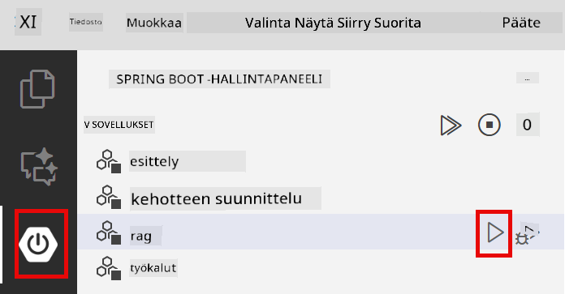

<!--
CO_OP_TRANSLATOR_METADATA:
{
  "original_hash": "f538a51cfd13147d40d84e936a0f485c",
  "translation_date": "2025-12-13T17:07:47+00:00",
  "source_file": "03-rag/README.md",
  "language_code": "fi"
}
-->
# Module 03: RAG (Retrieval-Augmented Generation)

## Sisällysluettelo

- [Mitä opit](../../../03-rag)
- [Esivaatimukset](../../../03-rag)
- [RAG:n ymmärtäminen](../../../03-rag)
- [Miten se toimii](../../../03-rag)
  - [Dokumenttien käsittely](../../../03-rag)
  - [Upotusten luominen](../../../03-rag)
  - [Semanttinen haku](../../../03-rag)
  - [Vastausten generointi](../../../03-rag)
- [Sovelluksen käynnistäminen](../../../03-rag)
- [Sovelluksen käyttäminen](../../../03-rag)
  - [Dokumentin lataaminen](../../../03-rag)
  - [Kysymysten esittäminen](../../../03-rag)
  - [Lähdeviitteiden tarkistaminen](../../../03-rag)
  - [Kokeile kysymyksiä](../../../03-rag)
- [Keskeiset käsitteet](../../../03-rag)
  - [Paloittelustrategia](../../../03-rag)
  - [Samanlaisuuspisteet](../../../03-rag)
  - [Muistissa säilytys](../../../03-rag)
  - [Kontekstin hallinta](../../../03-rag)
- [Milloin RAG on tärkeä](../../../03-rag)
- [Seuraavat askeleet](../../../03-rag)

## Mitä opit

Edellisissä moduuleissa opit käymään keskusteluja tekoälyn kanssa ja jäsentämään kehotteesi tehokkaasti. Mutta on olemassa perustavanlaatuinen rajoitus: kielimallit tietävät vain sen, mitä ne oppivat koulutuksen aikana. Ne eivät voi vastata kysymyksiin yrityksesi käytännöistä, projektidokumentaatiostasi tai mistään tiedoista, joita niille ei ole opetettu.

RAG (Retrieval-Augmented Generation) ratkaisee tämän ongelman. Sen sijaan, että yrittäisit opettaa mallille tietosi (mikä on kallista ja epäkäytännöllistä), annat sille mahdollisuuden hakea tietoa dokumenteistasi. Kun joku esittää kysymyksen, järjestelmä löytää asiaankuuluvan tiedon ja sisällyttää sen kehotteeseen. Malli vastaa sitten haetun kontekstin perusteella.

Ajattele RAG:ia mallin viitetietokirjastona. Kun esität kysymyksen, järjestelmä:

1. **Käyttäjän kysely** - Esität kysymyksen
2. **Upotus** - Muuntaa kysymyksesi vektoriksi
3. **Vektorihaku** - Löytää samankaltaiset dokumenttipalaset
4. **Kontekstin kokoaminen** - Lisää asiaankuuluvat palaset kehotteeseen
5. **Vastaus** - LLM generoi vastauksen kontekstin perusteella

Tämä perustaa mallin vastaukset todellisiin tietoihisi sen sijaan, että se luottaisi koulutustietoon tai keksisi vastauksia.


*RAG-työnkulku – käyttäjän kyselystä semanttiseen hakuun ja kontekstuaaliseen vastausten generointiin*

## Esivaatimukset

- Moduuli 01 suoritettu (Azure OpenAI -resurssit otettu käyttöön)
- `.env`-tiedosto juurihakemistossa Azure-tunnuksilla (luotu `azd up` -komennolla Moduulissa 01)

> **Huom:** Jos et ole suorittanut Moduulia 01, seuraa ensin siellä annettuja käyttöönotto-ohjeita.

## Miten se toimii

**Dokumenttien käsittely** - [DocumentService.java](../../../03-rag/src/main/java/com/example/langchain4j/rag/service/DocumentService.java)

Kun lataat dokumentin, järjestelmä pilkkoo sen paloiksi – pienemmiksi osiksi, jotka mahtuvat mukavasti mallin kontekstin ikkunaan. Nämä palaset limittyvät hieman, jotta konteksti ei katoa rajapinnoissa.

```java
Document document = FileSystemDocumentLoader.loadDocument("sample-document.txt");

DocumentSplitter splitter = DocumentSplitters
    .recursive(300, 30, new OpenAiTokenizer());

List<TextSegment> segments = splitter.split(document);
```

> **🤖 Kokeile [GitHub Copilot](https://github.com/features/copilot) Chatin kanssa:** Avaa [`DocumentService.java`](../../../03-rag/src/main/java/com/example/langchain4j/rag/service/DocumentService.java) ja kysy:
> - "Miten LangChain4j pilkkoo dokumentit paloiksi ja miksi limittyminen on tärkeää?"
> - "Mikä on optimaalinen palan koko eri dokumenttityypeille ja miksi?"
> - "Miten käsittelen dokumentteja, joissa on useita kieliä tai erityismuotoiluja?"

**Upotusten luominen** - [LangChainRagConfig.java](../../../03-rag/src/main/java/com/example/langchain4j/rag/config/LangChainRagConfig.java)

Jokainen pala muunnetaan numeeriseksi esitykseksi, jota kutsutaan upotukseksi – käytännössä matemaattiseksi sormenjäljeksi, joka kuvaa tekstin merkityksen. Samankaltainen teksti tuottaa samankaltaisia upotuksia.

```java
@Bean
public EmbeddingModel embeddingModel() {
    return OpenAiOfficialEmbeddingModel.builder()
        .baseUrl(azureOpenAiEndpoint)
        .apiKey(azureOpenAiKey)
        .modelName(azureEmbeddingDeploymentName)
        .build();
}

EmbeddingStore<TextSegment> embeddingStore = 
    new InMemoryEmbeddingStore<>();
```


*Dokumentit esitettyinä vektoreina upotustilassa – samankaltainen sisältö ryhmittyy yhteen*

**Semanttinen haku** - [RagService.java](../../../03-rag/src/main/java/com/example/langchain4j/rag/service/RagService.java)

Kun esität kysymyksen, myös kysymyksesi muutetaan upotukseksi. Järjestelmä vertaa kysymyksesi upotusta kaikkien dokumenttipalojen upotuksiin. Se löytää palaset, joiden merkitykset ovat lähimpänä – ei pelkästään avainsanojen perusteella, vaan todellisen semanttisen samankaltaisuuden mukaan.

```java
Embedding queryEmbedding = embeddingModel.embed(question).content();

List<EmbeddingMatch<TextSegment>> matches = 
    embeddingStore.findRelevant(queryEmbedding, 5, 0.7);

for (EmbeddingMatch<TextSegment> match : matches) {
    String relevantText = match.embedded().text();
    double score = match.score();
}
```

> **🤖 Kokeile [GitHub Copilot](https://github.com/features/copilot) Chatin kanssa:** Avaa [`RagService.java`](../../../03-rag/src/main/java/com/example/langchain4j/rag/service/RagService.java) ja kysy:
> - "Miten samankaltaisuushaku toimii upotusten kanssa ja mikä määrää pisteen?"
> - "Mikä samankaltaisuuskynnys pitäisi käyttää ja miten se vaikuttaa tuloksiin?"
> - "Miten käsittelen tilanteet, joissa ei löydy relevantteja dokumentteja?"

**Vastausten generointi** - [RagService.java](../../../03-rag/src/main/java/com/example/langchain4j/rag/service/RagService.java)

Merkityksellisimmät palaset sisällytetään mallin kehotteeseen. Malli lukee nämä tietyt palaset ja vastaa kysymykseesi niiden perusteella. Tämä estää harhauttamisen – malli voi vastata vain siitä, mitä sillä on edessään.

## Sovelluksen käynnistäminen

**Tarkista käyttöönotto:**

Varmista, että `.env`-tiedosto on juurihakemistossa Azure-tunnuksilla (luotu Moduulissa 01):
```bash
cat ../.env  # Tulisi näyttää AZURE_OPENAI_ENDPOINT, API_KEY, DEPLOYMENT
```

**Käynnistä sovellus:**

> **Huom:** Jos olet jo käynnistänyt kaikki sovellukset komennolla `./start-all.sh` Moduulissa 01, tämä moduuli on jo käynnissä portissa 8081. Voit ohittaa alla olevat käynnistyskomennot ja siirtyä suoraan osoitteeseen http://localhost:8081.

**Vaihtoehto 1: Spring Boot Dashboardin käyttö (suositeltu VS Code -käyttäjille)**

Kehityssäiliö sisältää Spring Boot Dashboard -laajennuksen, joka tarjoaa visuaalisen käyttöliittymän kaikkien Spring Boot -sovellusten hallintaan. Löydät sen VS Coden vasemman reunan Aktiviteettipalkista (etsi Spring Boot -kuvaketta).

Spring Boot Dashboardista voit:
- Näyttää kaikki työtilan Spring Boot -sovellukset
- Käynnistää/pysäyttää sovelluksia yhdellä napsautuksella
- Tarkastella sovelluslokeja reaaliajassa
- Valvoa sovellusten tilaa

Klikkaa vain "rag"-moduulin vieressä olevaa toistopainiketta käynnistääksesi tämän moduulin, tai käynnistä kaikki moduulit kerralla.



**Vaihtoehto 2: Shell-skriptien käyttö**

Käynnistä kaikki web-sovellukset (moduulit 01-04):

**Bash:**
```bash
cd ..  # Juurihakemistosta
./start-all.sh
```

**PowerShell:**
```powershell
cd ..  # Juurihakemistosta
.\start-all.ps1
```

Tai käynnistä vain tämä moduuli:

**Bash:**
```bash
cd 03-rag
./start.sh
```

**PowerShell:**
```powershell
cd 03-rag
.\start.ps1
```

Molemmat skriptit lataavat automaattisesti ympäristömuuttujat juurihakemiston `.env`-tiedostosta ja rakentavat JAR-tiedostot, jos niitä ei ole olemassa.

> **Huom:** Jos haluat rakentaa kaikki moduulit manuaalisesti ennen käynnistystä:
>
> **Bash:**
> ```bash
> cd ..  # Go to root directory
> mvn clean package -DskipTests
> ```
>
> **PowerShell:**
> ```powershell
> cd ..  # Go to root directory
> mvn clean package -DskipTests
> ```

Avaa selaimessa http://localhost:8081.

**Pysäyttääksesi:**

**Bash:**
```bash
./stop.sh  # Vain tämä moduuli
# Tai
cd .. && ./stop-all.sh  # Kaikki moduulit
```

**PowerShell:**
```powershell
.\stop.ps1  # Vain tämä moduuli
# Tai
cd ..; .\stop-all.ps1  # Kaikki moduulit
```

## Sovelluksen käyttäminen

Sovellus tarjoaa web-käyttöliittymän dokumenttien lataamiseen ja kysymysten esittämiseen.

<a href="images/rag-homepage.png"></a>

*RAG-sovelluksen käyttöliittymä – lataa dokumentteja ja esitä kysymyksiä*

**Dokumentin lataaminen**

Aloita lataamalla dokumentti – TXT-tiedostot toimivat parhaiten testaukseen. Tässä hakemistossa on mukana `sample-document.txt`, joka sisältää tietoa LangChain4j:n ominaisuuksista, RAG:n toteutuksesta ja parhaista käytännöistä – täydellinen järjestelmän testaamiseen.

Järjestelmä käsittelee dokumenttisi, pilkkoo sen paloiksi ja luo upotukset jokaiselle palalle. Tämä tapahtuu automaattisesti latauksen yhteydessä.

**Kysymysten esittäminen**

Esitä nyt tarkkoja kysymyksiä dokumentin sisällöstä. Kokeile jotain faktapohjaista, joka on selvästi mainittu dokumentissa. Järjestelmä etsii asiaankuuluvat palaset, lisää ne kehotteeseen ja generoi vastauksen.

**Lähdeviitteiden tarkistaminen**

Huomaa, että jokainen vastaus sisältää lähdeviitteet samankaltaisuuspisteineen. Nämä pisteet (0–1) osoittavat, kuinka relevantti kukin pala oli kysymykseesi nähden. Korkeammat pisteet tarkoittavat parempia osumia. Tämä antaa sinulle mahdollisuuden varmistaa vastaus lähdemateriaalin perusteella.

<a href="images/rag-query-results.png"></a>

*Kyselytulokset, jotka näyttävät vastauksen lähdeviitteineen ja relevanssipisteineen*

**Kokeile kysymyksiä**

Kokeile erilaisia kysymyksiä:
- Tarkat faktat: "Mikä on pääaihe?"
- Vertailut: "Mikä on ero X:n ja Y:n välillä?"
- Yhteenveto: "Tiivistä tärkeimmät kohdat Z:stä"

Seuraa, miten relevanssipisteet muuttuvat sen mukaan, kuinka hyvin kysymyksesi vastaa dokumentin sisältöä.

## Keskeiset käsitteet

**Paloittelustrategia**

Dokumentit pilkotaan 300 tokenin paloiksi, joissa on 30 tokenin limittymä. Tämä tasapaino varmistaa, että jokaisella palalla on riittävästi kontekstia ollakseen merkityksellinen, mutta ne pysyvät tarpeeksi pieninä, jotta useita paloja mahtuu kehotteeseen.

**Samanlaisuuspisteet**

Pisteet vaihtelevat 0:sta 1:een:
- 0.7–1.0: Erittäin relevantti, täsmällinen osuma
- 0.5–0.7: Relevantti, hyvä konteksti
- Alle 0.5: Suodatettu pois, liian erilainen

Järjestelmä hakee vain pisteet ylittävät palaset laadun varmistamiseksi.

**Muistissa säilytys**

Tämä moduuli käyttää yksinkertaisuuden vuoksi muistissa säilytystä. Kun käynnistät sovelluksen uudelleen, ladatut dokumentit katoavat. Tuotantojärjestelmissä käytetään pysyviä vektoritietokantoja, kuten Qdrant tai Azure AI Search.

**Kontekstin hallinta**

Jokaisella mallilla on maksimikokoinen kontekstin ikkuna. Et voi sisällyttää kaikkia paloja suuresta dokumentista. Järjestelmä hakee ylintä N merkityksellisintä palaa (oletuksena 5) pysyäkseen rajoissa ja tarjotakseen riittävästi kontekstia tarkkoihin vastauksiin.

## Milloin RAG on tärkeä

**Käytä RAG:ia, kun:**
- Vastaat kysymyksiin omista dokumenteista
- Tiedot muuttuvat usein (käytännöt, hinnat, tekniset tiedot)
- Tarkkuus vaatii lähdeviitteet
- Sisältö on liian laaja mahtuakseen yhteen kehotteeseen
- Tarvitset todennettavissa olevia, perusteltuja vastauksia

**Älä käytä RAG:ia, kun:**
- Kysymykset vaativat yleistä tietoa, joka mallilla jo on
- Tarvitset reaaliaikaista dataa (RAG toimii ladatuilla dokumenteilla)
- Sisältö on tarpeeksi pientä sisällytettäväksi suoraan kehotteeseen

## Seuraavat askeleet

**Seuraava moduuli:** [04-tools - AI Agents with Tools](../04-tools/README.md)

---

**Navigointi:** [← Edellinen: Moduuli 02 - Kehoteinsinöörityö](../02-prompt-engineering/README.md) | [Takaisin pääsivulle](../README.md) | [Seuraava: Moduuli 04 - Työkalut →](../04-tools/README.md)

---

<!-- CO-OP TRANSLATOR DISCLAIMER START -->
**Vastuuvapauslauseke**:  
Tämä asiakirja on käännetty käyttämällä tekoälypohjaista käännöspalvelua [Co-op Translator](https://github.com/Azure/co-op-translator). Pyrimme tarkkuuteen, mutta huomioithan, että automaattikäännöksissä saattaa esiintyä virheitä tai epätarkkuuksia. Alkuperäinen asiakirja sen alkuperäiskielellä on virallinen lähde. Tärkeissä asioissa suositellaan ammattimaista ihmiskäännöstä. Emme ole vastuussa tämän käännöksen käytöstä aiheutuvista väärinymmärryksistä tai tulkinnoista.
<!-- CO-OP TRANSLATOR DISCLAIMER END -->