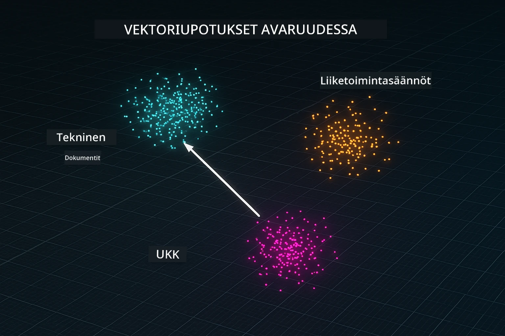
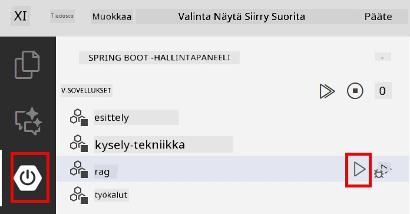
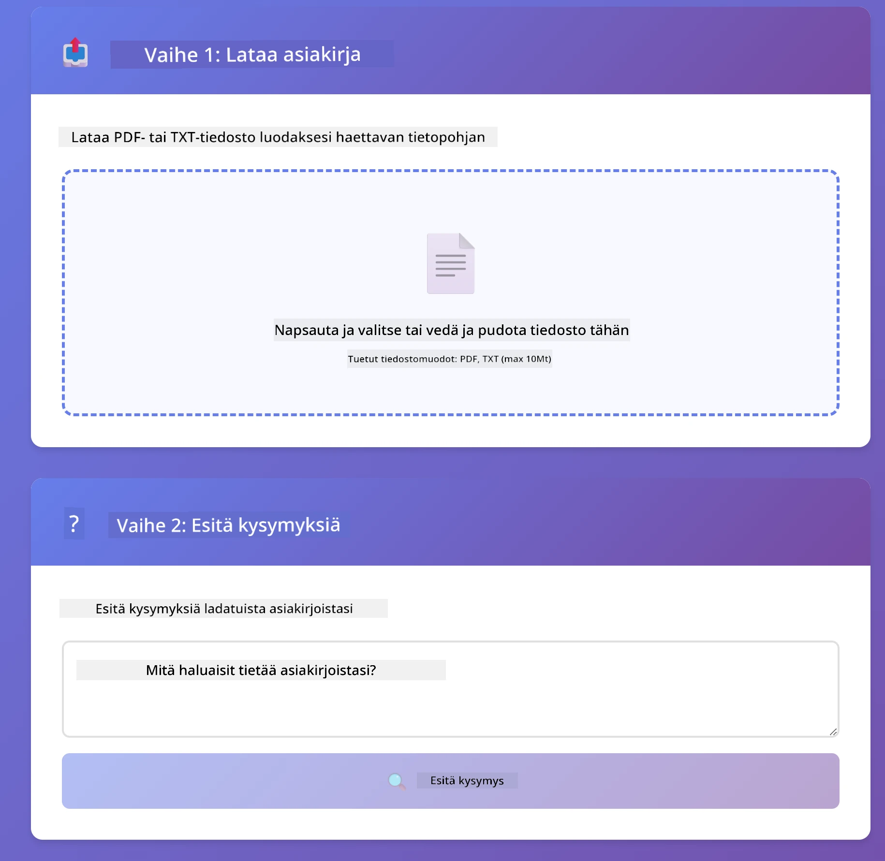
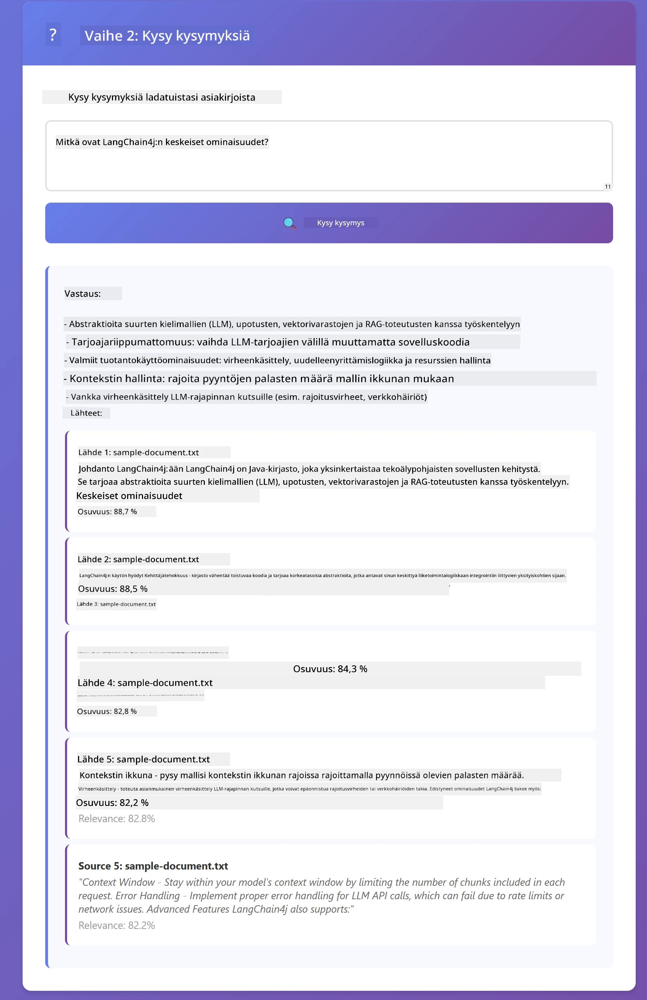

<!--
CO_OP_TRANSLATOR_METADATA:
{
  "original_hash": "81d087662fb3dd7b7124bce1a9c9ec86",
  "translation_date": "2026-01-05T23:55:36+00:00",
  "source_file": "03-rag/README.md",
  "language_code": "fi"
}
-->
# Moduuli 03: RAG (Retrieval-Augmented Generation)

## Sisällysluettelo

- [Mitä opit](../../../03-rag)
- [Esivaatimukset](../../../03-rag)
- [RAG:n ymmärtäminen](../../../03-rag)
- [Miten se toimii](../../../03-rag)
  - [Dokumentin käsittely](../../../03-rag)
  - [Upotusten luominen](../../../03-rag)
  - [Semanttinen haku](../../../03-rag)
  - [Vastausten generointi](../../../03-rag)
- [Suorita sovellus](../../../03-rag)
- [Sovelluksen käyttö](../../../03-rag)
  - [Lataa dokumentti](../../../03-rag)
  - [Kysy kysymyksiä](../../../03-rag)
  - [Tarkista lähdeviitteet](../../../03-rag)
  - [Kokeile kysymyksillä](../../../03-rag)
- [Keskeiset käsitteet](../../../03-rag)
  - [Paloittelustrategia](../../../03-rag)
  - [Samankaltaisuuspisteet](../../../03-rag)
  - [Muistissa tapahtuva tallennus](../../../03-rag)
  - [Kontekstin hallinta](../../../03-rag)
- [Milloin RAG on tärkeä](../../../03-rag)
- [Seuraavat askeleet](../../../03-rag)

## Mitä opit

Edellisissä moduuleissa opit keskustelemaan tekoälyn kanssa ja rakentamaan kehotteita tehokkaasti. Mutta on olemassa perusrajoitus: kielimallit tietävät vain sen, mitä ne oppivat koulutuksen aikana. Ne eivät voi vastata kysymyksiin yrityksesi käytännöistä, projektidokumentaatiosta tai tiedoista, joihin niitä ei ole koulutettu.

RAG (Retrieval-Augmented Generation) ratkaisee tämän ongelman. Sen sijaan, että yritettäisiin opettaa mallia tiedoillasi (mikä on kallista ja epäkäytännöllistä), annat sille mahdollisuuden hakea tietoa dokumenteistasi. Kun joku kysyy kysymyksen, järjestelmä löytää asiaankuuluvat tiedot ja lisää ne kehotteeseen. Malli vastaa sitten haetun kontekstin perusteella.

Ajattele RAG:ia kuin viitemuistiona mallille. Kun kysyt kysymyksen, järjestelmä:

1. **Käyttäjän kysely** – Kysyt kysymyksen
2. **Upotus** – Muuntaa kysymyksesi vektoriksi
3. **Vektorihaku** – Löytää samankaltaisia dokumenttipaloja
4. **Kontekstin luominen** – Lisää asiaankuuluvat palat kehotteeseen
5. **Vastaus** – LLM generoi vastauksen kontekstin perusteella

Tämä juurruttaa mallin vastaukset todellisiin tietoihisi sen sijaan, että se luottaisi koulutustietoon tai keksisi vastauksia.


*RAG-työnkulku – käyttäjän kyselystä semanttiseen hakuun ja kontekstuaaliseen vastausten generointiin*

## Esivaatimukset

- Moduuli 01 suoritettu (Azure OpenAI -resurssit otettu käyttöön)
- `.env`-tiedosto juurihakemistossa Azure-tunnuksineen (luotu `azd up` komennolla Moduulissa 01)

> **Huom:** Jos et ole suorittanut Moduuli 01, noudata siellä annettuja käyttöönotto-ohjeita ensin.

## Miten se toimii

### Dokumentin käsittely

[DocumentService.java](../../../03-rag/src/main/java/com/example/langchain4j/rag/service/DocumentService.java)

Kun lataat dokumentin, järjestelmä pilkkoo sen pienempiin paloihin – pienempiin osiin, jotka mahtuvat mallin konteksti-ikkunaan. Nämä palat limittyvät hieman, jotta et menetä kontekstia rajapisteissä.

```java
Document document = FileSystemDocumentLoader.loadDocument("sample-document.txt");

DocumentSplitter splitter = DocumentSplitters
    .recursive(300, 30, new OpenAiTokenizer());

List<TextSegment> segments = splitter.split(document);
```

> **🤖 Kokeile GitHub Copilotin Chatin kanssa:** Avaa [`DocumentService.java`](../../../03-rag/src/main/java/com/example/langchain4j/rag/service/DocumentService.java) ja kysy:
> - "Miten LangChain4j pilkkoo dokumentteja paloiksi ja miksi limittyminen on tärkeää?"
> - "Mikä on optimaalinen palan koko eri dokumenttityypeille ja miksi?"
> - "Miten käsittelen dokumentteja, joissa on useita kieliä tai erityisiä muotoiluja?"

### Upotusten luominen

[LangChainRagConfig.java](../../../03-rag/src/main/java/com/example/langchain4j/rag/config/LangChainRagConfig.java)

Jokainen pala muunnetaan numeeriseksi esitykseksi, jota kutsutaan upotukseksi – käytännössä matemaattiseksi sormenjäljeksi, joka kuvaa tekstin merkityksen. Samankaltainen teksti tuottaa samankaltaisia upotuksia.

```java
@Bean
public EmbeddingModel embeddingModel() {
    return OpenAiOfficialEmbeddingModel.builder()
        .baseUrl(azureOpenAiEndpoint)
        .apiKey(azureOpenAiKey)
        .modelName(azureEmbeddingDeploymentName)
        .build();
}

EmbeddingStore<TextSegment> embeddingStore = 
    new InMemoryEmbeddingStore<>();
```



*Dokumentit esitetty vektoreina upotusavaruudessa – samankaltaiset sisällöt ryhmittyvät*

### Semanttinen haku

[RagService.java](../../../03-rag/src/main/java/com/example/langchain4j/rag/service/RagService.java)

Kun kysyt kysymyksen, myös kysymyksesi muuntuu upotukseksi. Järjestelmä vertaa kysymyksesi upotusta kaikkiin dokumenttipalojen upotuksiin. Se löytää palat, joiden merkitykset ovat samankaltaisimmat – ei pelkästään avainsanojen osuman perusteella, vaan todellisen semanttisen samankaltaisuuden mukaan.

```java
Embedding queryEmbedding = embeddingModel.embed(question).content();

List<EmbeddingMatch<TextSegment>> matches = 
    embeddingStore.findRelevant(queryEmbedding, 5, 0.7);

for (EmbeddingMatch<TextSegment> match : matches) {
    String relevantText = match.embedded().text();
    double score = match.score();
}
```

> **🤖 Kokeile GitHub Copilotin Chatin kanssa:** Avaa [`RagService.java`](../../../03-rag/src/main/java/com/example/langchain4j/rag/service/RagService.java) ja kysy:
> - "Miten samankaltaisuushaku toimii upotuksilla ja mikä vaikuttaa pisteeseen?"
> - "Mikä on sopiva samankaltaisuuskynnys ja miten se vaikuttaa tuloksiin?"
> - "Miten käsittelen tilanteet, joissa ei löydy relevantteja dokumentteja?"

### Vastausten generointi

[RagService.java](../../../03-rag/src/main/java/com/example/langchain4j/rag/service/RagService.java)

Merkityksellisimmät palat sisällytetään mallille annettavaan kehotteeseen. Malli lukee nämä erikseen ja vastaa kysymykseesi sen tiedon perusteella. Tämä ehkäisee hallusinaatioita – malli voi vastata vain sen perusteella, mitä sillä on edessään.

## Suorita sovellus

**Varmista käyttöönotto:**

Varmista, että `.env`-tiedosto on juurihakemistossa Azure-tunnuksilla (luotu Moduulissa 01):
```bash
cat ../.env  # Tulisi näyttää AZURE_OPENAI_ENDPOINT, API_KEY, DEPLOYMENT
```

**Käynnistä sovellus:**

> **Huom:** Jos olet jo käynnistänyt kaikki sovellukset komennolla `./start-all.sh` Moduulissa 01, tämä moduuli on jo käynnissä portissa 8081. Voit ohittaa käynnistyskomennot ja mennä suoraan osoitteeseen http://localhost:8081.

**Vaihtoehto 1: Spring Boot Dashboardin käyttö (suositellaan VS Code -käyttäjille)**

Kehityskontti sisältää Spring Boot Dashboard -laajennuksen, joka tarjoaa visuaalisen käyttöliittymän kaikkien Spring Boot -sovellusten hallintaan. Löydät sen VS Coden vasemman reunan Activity Barista (etsi Spring Boot -ikonia).

Spring Boot Dashboardista voit:
- Näyttää kaikki työtilassa olevat Spring Boot -sovellukset
- Käynnistää/pysäyttää sovelluksia yhdellä napsautuksella
- Katsella sovelluslokeja reaaliajassa
- Valvoa sovellusten tilaa

Klikkaa vain "rag"-moduulin vieressä olevaa toistopainiketta käynnistääksesi tämän moduulin tai käynnistä kaikki moduulit kerralla.



**Vaihtoehto 2: Shell-skriptit**

Käynnistä kaikki web-sovellukset (moduulit 01-04):

**Bash:**
```bash
cd ..  # Juurihakemistosta
./start-all.sh
```

**PowerShell:**
```powershell
cd ..  # Juurihakemistosta
.\start-all.ps1
```

Tai käynnistä vain tämä moduuli:

**Bash:**
```bash
cd 03-rag
./start.sh
```

**PowerShell:**
```powershell
cd 03-rag
.\start.ps1
```

Molemmat skriptit lataavat automaattisesti ympäristömuuttujat juurihakemiston `.env`-tiedostosta ja rakentavat JAR:t, jos niitä ei ole.

> **Huom:** Jos haluat rakentaa kaikki moduulit manuaalisesti ennen käynnistystä:
>
> **Bash:**
> ```bash
> cd ..  # Go to root directory
> mvn clean package -DskipTests
> ```
>
> **PowerShell:**
> ```powershell
> cd ..  # Go to root directory
> mvn clean package -DskipTests
> ```

Avaa selaimessa http://localhost:8081.

**Pysäytä:**

**Bash:**
```bash
./stop.sh  # Vain tämä moduuli
# Tai
cd .. && ./stop-all.sh  # Kaikki moduulit
```

**PowerShell:**
```powershell
.\stop.ps1  # Vain tämä moduuli
# Tai
cd ..; .\stop-all.ps1  # Kaikki moduulit
```

## Sovelluksen käyttö

Sovellus tarjoaa selainpohjaisen käyttöliittymän dokumenttien lataamiseen ja kysymysten esittämiseen.

<a href="images/rag-homepage.png"></a>

*RAG-sovelluksen käyttöliittymä – lataa dokumentteja ja esitä kysymyksiä*

### Lataa dokumentti

Aloita lataamalla dokumentti – TXT-tiedostot toimivat parhaiten testauksessa. Tässä hakemistossa on `sample-document.txt`, joka sisältää tietoa LangChain4j:n ominaisuuksista, RAG-toteutuksesta ja parhaista käytännöistä – täydellinen järjestelmän testaamiseen.

Järjestelmä käsittelee dokumenttisi, pilkkoo sen paloiksi ja luo upotukset jokaiselle palalle. Tämä tapahtuu automaattisesti latauksen yhteydessä.

### Kysy kysymyksiä

Kysy nyt tarkkoja kysymyksiä dokumentin sisällöstä. Kokeile jotain faktatietoa, joka on selvästi dokumentissa ilmaistu. Järjestelmä hakee asiaankuuluvat palat, lisää ne kehotteeseen ja generoi vastauksen.

### Tarkista lähdeviitteet

Huomaa, että jokainen vastaus sisältää lähdeviitteitä samankaltaisuuspisteineen. Nämä pisteet (0–1) osoittavat, kuinka relevantteja kukin pala oli kysymyksellesi. Korkeammat pisteet tarkoittavat parempia osumia. Näin voit varmistaa vastauksen lähdeaineiston perusteella.

<a href="images/rag-query-results.png"></a>

*Kyselytulokset, jotka näyttävät vastauksen lähdeviitteineen ja relevanttipisteineen*

### Kokeile kysymyksillä

Kokeile erilaisia kysymyksiä:
- Tarkat faktat: "Mikä on pääaihe?"
- Vertailut: "Mikä on ero X:n ja Y:n välillä?"
- Yhteenvedot: "Tiivistä tärkeimmät kohdat Z:stä"

Seuraa, miten relevanttipisteet muuttuvat sen mukaan, kuinka hyvin kysymyksesi vastaa dokumentin sisältöä.

## Keskeiset käsitteet

### Paloittelustrategia

Dokumentit pilkotaan 300 tokenin paloihin, joissa on 30 tokenin limitys. Tämä tasapaino varmistaa, että jokaisessa palassa on tarpeeksi kontekstia merkityksellisyyden vuoksi, mutta palat ovat tarpeeksi pieniä, jotta useita paloja voi sisällyttää kehotteeseen.

### Samankaltaisuuspisteet

Pisteet vaihtelevat välillä 0–1:
- 0,7–1,0: Erittäin relevantti, tarkka osuma
- 0,5–0,7: Relevantti, hyvä konteksti
- Alle 0,5: Suodatettu pois, liian erilainen

Järjestelmä hakee vain palat, jotka ylittävät minimikynnyksen laadun varmistamiseksi.

### Muistissa tapahtuva tallennus

Tämä moduuli käyttää muistipohjaista tallennusta yksinkertaisuuden vuoksi. Kun käynnistät sovelluksen uudelleen, ladatut dokumentit katoavat. Tuotantojärjestelmissä käytetään pysyviä vektoritietokantoja kuten Qdrantia tai Azure AI Searchia.

### Kontekstin hallinta

Jokaisella mallilla on maksimissaan konteksti-ikkuna. Et voi sisällyttää jokaista palaa suuresta dokumentista. Järjestelmä hakee ylimmät N merkityksellisintä palaa (oletus 5) pysyäkseen rajoissa ja tarjotakseen riittävästi kontekstia tarkkoja vastauksia varten.

## Milloin RAG on tärkeä

**Käytä RAG:ia, kun:**
- Vastaat kysymyksiin yrityksen omista dokumenteista
- Tiedot muuttuvat usein (käytännöt, hinnat, erittelyt)
- Tarkkuus vaatii lähteiden ilmoittamista
- Sisältö on liian laaja yhteen kehotteeseen
- Tarvitset todennettavia ja juurtuneita vastauksia

**Älä käytä RAG:ia, kun:**
- Kysymykset vaativat yleistä tietoa, joka mallilla jo on
- Tarvitaan reaaliaikaista dataa (RAG toimii ladatuilla dokumenteilla)
- Sisältö on tarpeeksi pieni sisällytettäväksi suoraan kehotteisiin

## Seuraavat askeleet

**Seuraava moduuli:** [04-tools - AI Agentit työkaluilla](../04-tools/README.md)

---

**Navigointi:** [← Edellinen: Moduuli 02 - Kehote-tekniikka](../02-prompt-engineering/README.md) | [Takaisin pääsivulle](../README.md) | [Seuraava: Moduuli 04 - Työkalut →](../04-tools/README.md)

---

<!-- CO-OP TRANSLATOR DISCLAIMER START -->
**Vastuuvapauslauseke**:
Tämä asiakirja on käännetty käyttämällä tekoälypohjaista käännöspalvelua [Co-op Translator](https://github.com/Azure/co-op-translator). Vaikka pyrimme tarkkuuteen, on hyvä huomioida, että automaattikäännöksissä saattaa esiintyä virheitä tai epätarkkuuksia. Alkuperäistä asiakirjaa sen alkuperäiskielellä pidetään auktoritatiivisena lähteenä. Tärkeiden tietojen osalta suositellaan ammattimaista ihmiskäännöstä. Emme ole vastuussa mahdollisista väärinymmärryksistä tai tulkinnoista, jotka johtuvat tämän käännöksen käytöstä.
<!-- CO-OP TRANSLATOR DISCLAIMER END -->