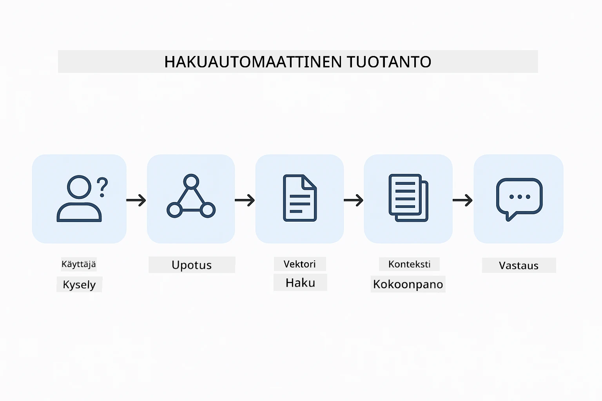
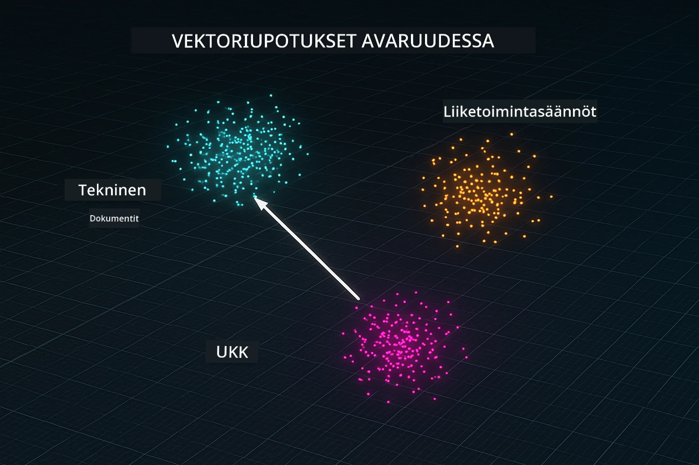
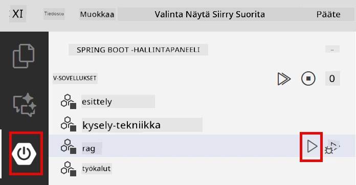
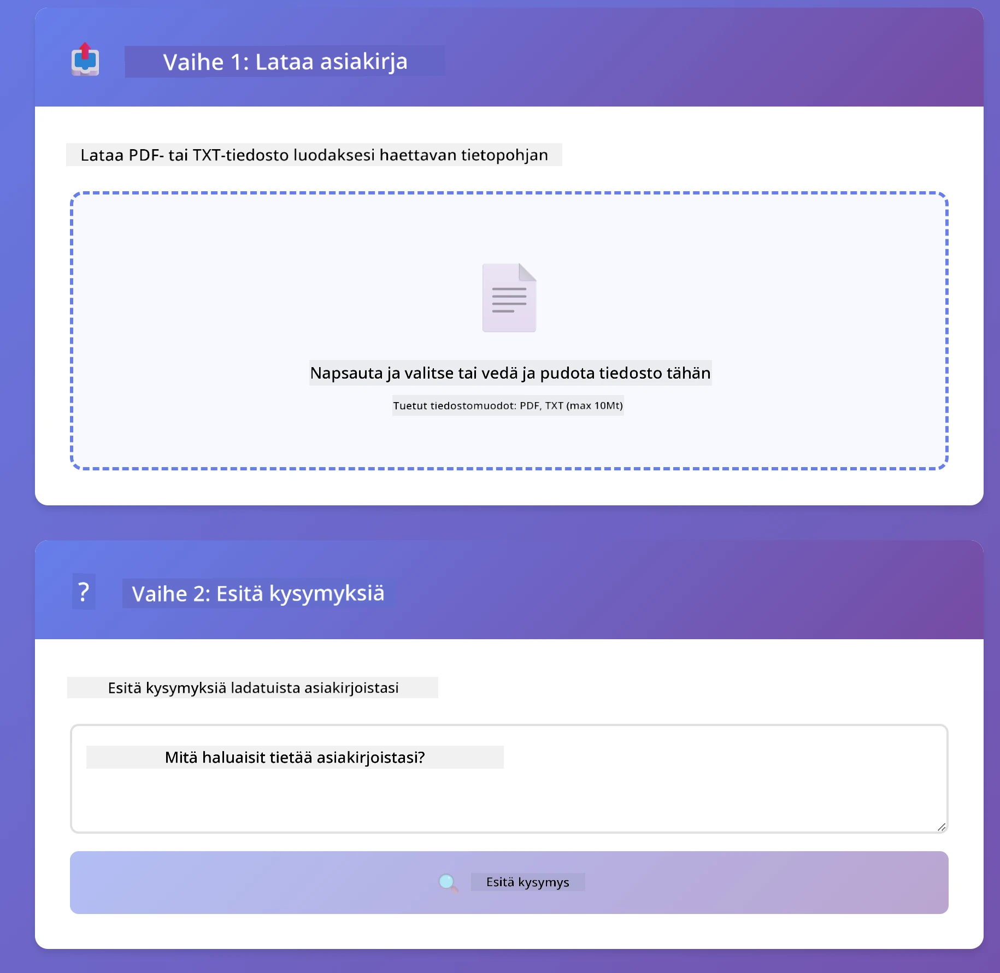
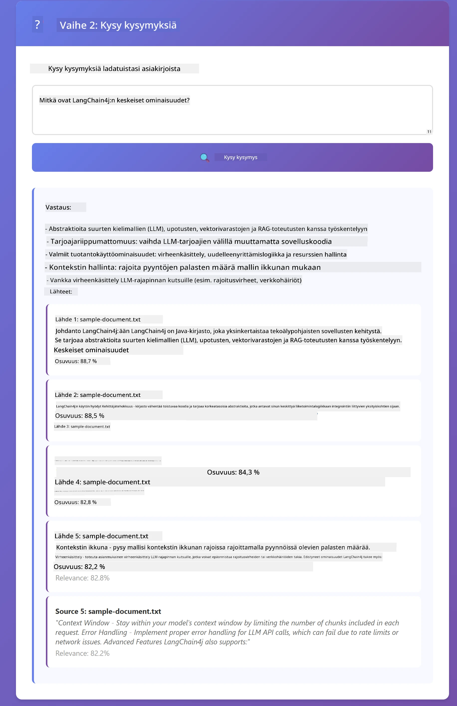

# Moduuli 03: RAG (Retrieval-Augmented Generation)

## Sisällysluettelo

- [Videoesittely](#videoesittely)
- [Mitä opit](#mitä-opit)
- [Esivaatimukset](#esivaatimukset)
- [RAG:n ymmärtäminen](#ragn-ymmärtäminen)
  - [Minkä RAG-lähestymistavan tämä opas käyttää?](#minkä-rag-lähestymistavan-tämä-opas-käyttää)
- [Miten se toimii](#miten-se-toimii)
  - [Dokumentin käsittely](#dokumentin-käsittely)
  - [Upotusten luominen](#upotusten-luominen)
  - [Semanttinen haku](#semanttinen-haku)
  - [Vastauksen luominen](#vastauksen-generointi)
- [Sovelluksen suorittaminen](#sovelluksen-käynnistäminen)
- [Sovelluksen käyttö](#sovelluksen-käyttö)
  - [Dokumentin lataaminen](#dokumentin-lataaminen)
  - [Kysymysten esittäminen](#kysymysten-esittäminen)
  - [Lähdeviitteiden tarkistaminen](#lähdeviitteiden-tarkistus)
  - [Kokeile kysymyksiä](#kokeile-erilaisia-kysymyksiä)
- [Keskeiset käsitteet](#keskeiset-käsitteet)
  - [Pilkkomisstrategia](#kappaleiden-jako)
  - [Samanlaisuuspisteet](#samankaltaisuuspisteet)
  - [Muistivarasto](#muistiin-tallennus)
  - [Kontekstin ikkunan hallinta](#konteksti-ikkunan-hallinta)
- [Milloin RAG on tärkeä](#milloin-rag-on-tärkeä)
- [Seuraavat askeleet](#seuraavat-askeleet)

## Videoesittely

Katso tämä live-istunto, joka selittää kuinka pääset alkuun tämän moduulin kanssa:

<a href="https://www.youtube.com/watch?v=_olq75ZH_eY"></a>

## Mitä opit

Aiemmissa moduuleissa opit keskustelemaan tekoälyn kanssa ja jäsentämään pyyntöjäsi tehokkaasti. Mutta on olemassa perustavanlaatuinen rajoitus: kielimallit tietävät vain sen, mitä ne oppivat harjoittelun aikana. Ne eivät voi vastata kysymyksiin yrityksesi käytännöistä, projektidokumentaatiostasi tai mistään tiedosta, jota niiden koulutuksessa ei ole ollut.

RAG (Retrieval-Augmented Generation) ratkaisee tämän ongelman. Sen sijaan, että yrittäisit opettaa mallille tietosi (mikä on kallista ja epäkäytännöllistä), annat mallille mahdollisuuden hakea dokumenteistasi. Kun joku esittää kysymyksen, järjestelmä löytää asiaankuuluvat tiedot ja liittää ne pyyntöön. Malli vastaa sitten haetun kontekstin pohjalta.

Ajattele RAG:ia mallin viitetietokirjastona. Kun esität kysymyksen, järjestelmä:

1. **Käyttäjän kysely** – Sinä esität kysymyksen  
2. **Upotus** – Muuntaa kysymyksesi vektoriksi  
3. **Vektorihaku** – Löytää samankaltaiset dokumenttipalat  
4. **Kontekstin koostaminen** – Lisää asiaankuuluvat palat pyyntöön  
5. **Vastaus** – Suuri kielimalli luo vastauksen kontekstin perusteella

Tämä perustaa mallin vastaukset todellisiin tietoihisi sen sijaan, että se luottaisi vain harjoittelutietoihin tai keksisi vastauksia.

## Esivaatimukset

- Valmis [Moduuli 01 - Johdanto](../01-introduction/README.md) (Azure OpenAI -resurssit käyttöön otettuna, mukaan lukien `text-embedding-3-small` -upotusmalli)  
- `.env`-tiedosto juurihakemistossa Azure-tunnuksillasi (luotu `azd up` -komennolla moduulissa 01)

> **Huom:** Jos et ole vielä suorittanut moduulia 01, noudata ensin siellä annettuja käyttöönotto-ohjeita. `azd up` -komento ottaa käyttöön sekä GPT-chat-mallin että tämän moduulin käyttämän upotusmallin.

## RAG:n ymmärtäminen

Alla oleva kaavio havainnollistaa ydinkonseptin: RAG ei perustu pelkästään mallin koulutusdataan, vaan antaa mallille viitetietokirjaston dokumenteistasi, joita se voi käyttää ennen jokaisen vastauksen luomista.


*Tämä kaavio näyttää eron tavallisen LLM:n (joka arvaa koulutusdatan pohjalta) ja RAG-parannetun LLM:n (joka käyttää ensin dokumenttejasi) välillä.*

Tässä on miten osat kytkeytyvät päästä päähän. Käyttäjän kysymys kulkee neljän vaiheen läpi — upotus, vektorihaku, kontekstin koostaminen ja vastauksen luominen — kukin rakentuu edellisen päälle:



*Tämä kaavio näyttää RAG-putken päästä päähän — käyttäjän kysely kulkee upotuksen, vektorihakemiston, kontekstin kokoamisen ja vastauksen luomisen kautta.*

Tämän moduulin loput osat käyvät jokaisen vaiheen läpi yksityiskohtaisesti, sisältäen koodin jota voit suorittaa ja muokata.

### Minkä RAG-lähestymistavan tämä opas käyttää?

LangChain4j tarjoaa kolme tapaa toteuttaa RAG, kukin eri abstraktiotason kanssa. Alla oleva kaavio vertaa niitä rinnakkain:


*Tämä kaavio vertailee LangChain4j:n kolmea RAG-lähestymistapaa — Easy, Native ja Advanced — näyttäen niiden keskeiset komponentit ja milloin niitä käytetään.*

| Lähestymistapa | Mitä se tekee | Vaihtoehto |
|---|---|---|
| **Easy RAG** | Kytkee kaiken automaattisesti `AiServices`- ja `ContentRetriever`-luokkien kautta. Merkitset rajapinnan, liität hakutoiminnon, ja LangChain4j hoitaa upotuksen, haun ja pyyntöjen kokoamisen taustalla. | Vähäinen koodimäärä, mutta et näe mitä kussakin vaiheessa tapahtuu. |
| **Native RAG** | Kutsut upotusmallin, haet tietovarastosta, rakennat pyynnön ja luot vastauksen itse — yksi selkeä vaihe kerrallaan. | Enemmän koodia, mutta jokainen vaihe on näkyvissä ja muokattavissa. |
| **Advanced RAG** | Käyttää `RetrievalAugmentor`-kehystä, jossa on vaihdettavissa olevia kyselyn muuntajia, reitittimiä, uudelleenjärjestelijöitä ja sisällön syöttäjiä tuotantotason putkistoihin. | Maksimaalinen joustavuus, mutta huomattavasti monimutkaisempi. |

**Tämä opas käyttää Native-lähestymistapaa.** Jokainen RAG-putken vaihe — kyselyn upotus, vektorivaraston haku, kontekstin kokoaminen ja vastauksen luominen — on kirjoitettu näkyvästi tiedostossa [`RagService.java`](../../../03-rag/src/main/java/com/example/langchain4j/rag/service/RagService.java). Tämä on tarkoituksellista: oppimateriaalina on tärkeämpää, että näet ja ymmärrät jokaisen vaiheen kuin että koodi olisi minimoitu. Kun tunnet, miten osat liittyvät toisiinsa, voit siirtyä Easy RAG:iin nopeita prototyyppejä varten tai Advanced RAG:iin tuotantojärjestelmiin.

> **💡 Kiinnostunut Easy RAG:stä?** LangChain4j tarjoaa myös *Easy RAG* -lähestymistavan, jossa `AiServices` ja `ContentRetriever` hoitavat upotuksen, haun ja pyyntöjen kokoamisen automaattisesti. Tämä moduuli käyttää selkeämpää reittiä — se avaa putken vaihe vaiheelta, jotta näet ja hallitset jokaisen osan itse.

Alla oleva kaavio näyttää Easy RAG -putken. Huomaa miten `AiServices` ja `EmbeddingStoreContentRetriever` piilottavat monimutkaisuuden — lataa dokumentti, liitä hakutoiminto ja saa vastauksia. Tämä moduulin Native-lähestymistapa avaa nuo piilotetut vaiheet:


*Tämä kaavio näyttää Easy RAG-putken. Verrattuna tähän Native-lähestymistapaa, jota käytetään tässä moduulissa: Easy RAG piilottaa upotuksen, haun ja pyyntöjen kokoamisen `AiServices`in ja `ContentRetriever`in taakse — lataat dokumentin, liität hakijan ja saat vastauksia. Tämä moduuli avaa kyseisen putken, jotta voit kutsua jokaista vaihetta (upotus, haku, kontekstin kokoaminen, vastaus) itse, tarjoten täydellisen näkyvyyden ja hallinnan.*

## Miten se toimii

Tämän moduulin RAG-putki jakautuu neljään vaiheeseen, jotka suoritetaan peräkkäin aina, kun käyttäjä esittää kysymyksen. Ensin ladattu dokumentti **jäsennetään ja pilkotaan** hallittaviksi paloiksi. Nämä palat muunnetaan sitten **vektoriedustuksiksi (upotuksiksi)** ja varastoidaan, jotta niitä voidaan vertailla matemaattisesti. Kun kysely saapuu, järjestelmä suorittaa **semanttisen haun** löytääkseen merkityksellisimmät palat, ja lopuksi välittää ne kontekstina LLM:lle **vastauksen luomiseksi**. Seuraavat osiot käyvät jokaisen vaiheen läpi konkreettisen koodin ja kaavioiden kera. Aloitetaan ensimmäisestä vaiheesta.

### Dokumentin käsittely

[DocumentService.java](../../../03-rag/src/main/java/com/example/langchain4j/rag/service/DocumentService.java)

Kun lataat dokumentin, järjestelmä jäsentää sen (PDF tai tavallinen teksti), liittää metatiedot kuten tiedostonimen, ja pilkkoo sen paloiksi — pienemmiksi osiksi, jotka mahtuvat mukavasti mallin kontekstin ikkunaan. Nämä palat limittäytyvät hieman, jotta konteksti ei katoa rajapinnoissa.

```java
// Jäsennä ladattu tiedosto ja kiedo se LangChain4j-dokumenttiin
Document document = Document.from(content, metadata);

// Jaa 300-tokenin paloihin, joissa on 30-tokenin päällekkäisyys
DocumentSplitter splitter = DocumentSplitters
    .recursive(300, 30);

List<TextSegment> segments = splitter.split(document);
```
  
Alla oleva kaavio näyttää tämän toiminnan visuaalisesti. Huomaa miten jokainen pala jakaa joitain tokeneita naapureidensa kanssa — 30 tokenin limitys varmistaa, ettei tärkeä konteksti katkea:


*Tämä kaavio näyttää dokumentin jakamisen 300 tokenin paloiksi, joissa on 30 tokenin limitys, joka säilyttää kontekstin palojen rajapinnoilla.*

> **🤖 Kokeile [GitHub Copilot](https://github.com/features/copilot) Chat -työkalulla:** Avaa [`DocumentService.java`](../../../03-rag/src/main/java/com/example/langchain4j/rag/service/DocumentService.java) ja kysy:  
> - "Miten LangChain4j pilkkoo dokumentit paloiksi ja miksi limitys on tärkeää?"  
> - "Mikä on optimaalinen palakoko eri dokumenttityypeille ja miksi?"  
> - "Miten käsitellä monikielisiä dokumentteja tai erikoismuotoiluja?"

### Upotusten luominen

[LangChainRagConfig.java](../../../03-rag/src/main/java/com/example/langchain4j/rag/config/LangChainRagConfig.java)

Jokainen pala muunnetaan numeeriseksi edustukseksi, jota kutsutaan upotukseksi — käytännössä merkityksen muuntaminen luvuiksi. Upotusmalli ei ole "älykäs" siinä mielessä kuin chat-malli; se ei seuraa ohjeita, päätttele tai vastaa kysymyksiin. Se osaa kuitenkin kuvata tekstin matemaattisessa tilassa, jossa samanlaiset merkitykset sijaitsevat lähellä toisiaan — "auto" lähellä "ajoneuvoa", "palautuskäytäntö" lähellä "rahan palautusta". Voit ajatella chat-mallia ihmisenä, jolle voi puhua; upotusmalli on erittäin tehokas arkistojärjestelmä.

Alla oleva kaavio havainnollistaa tätä konseptia — teksti menee sisään, numeeriset vektorit tulevat ulos, ja samankaltaiset merkitykset tuottavat lähekkäin sijaitsevia vektoreita:


*Tämä kaavio näyttää miten upotusmalli muuntaa tekstin numeerisiksi vektoreiksi, sijoittaen samankaltaiset merkitykset — kuten "auto" ja "ajoneuvo" — lähelle toisiaan vektoritilassa.*

```java
@Bean
public EmbeddingModel embeddingModel() {
    return OpenAiOfficialEmbeddingModel.builder()
        .baseUrl(azureOpenAiEndpoint)
        .apiKey(azureOpenAiKey)
        .modelName(azureEmbeddingDeploymentName)
        .build();
}

EmbeddingStore<TextSegment> embeddingStore = 
    new InMemoryEmbeddingStore<>();
```
  
Alla oleva luokkakaavio näyttää kaksi erillistä virtaa RAG-putkessa ja LangChain4j-luokat, jotka niitä toteuttavat. **Sisäänottovaihe** (suoritetaan kerran lataushetkellä) pilkkoo dokumentin, upottaa palat ja tallentaa ne `.addAll()`-metodilla. **Kyselyvaihe** (suoritetaan joka kerta kun käyttäjä kysyy) upottaa kysymyksen, hakee varastosta `.search()`-metodilla ja välittää löydetyn kontekstin chat-mallille. Molemmat virrat kohtaavat yhteisessä `EmbeddingStore<TextSegment>` -rajapinnassa:


*Tämä kaavio näyttää kaksi RAG-putken virtaa — sisäänoton ja kyselyn — ja niiden kytkeytymisen yhteisen EmbeddingStore-rajapinnan kautta.*

Kun upotukset on tallennettu, samankaltaiset sisällöt ryhmittyvät luonnollisesti toistensa läheisyyteen vektoritilassa. Alla oleva visualisointi osoittaa, miten aihepiireittäin liittyvät dokumentit muodostavat lähellä toisiaan olevia pisteitä, mikä tekee semanttisesta hausta mahdollista:



*Tämä visualisointi näyttää miten aiheiltaan samankaltaiset dokumentit ryhmittyvät toistensa lähelle 3D-vektoritilassa, aiheina mm. tekniset dokumentit, liiketoimintasäännöt ja FAQit.*

Kun käyttäjä hakee, järjestelmä suorittaa neljä vaihetta: upottaa dokumentit kerran, upottaa kyselyn jokaisella haulla, vertaa kyselyvektoria kaikkia tallennettuja vektoreita vastaan kosinisen samankaltaisuuden avulla, ja palauttaa kärki-K parasta osumaa. Alla olevassa kaaviossa käydään läpi jokainen vaihe ja LangChain4j:n luokat mukaan lukien:


*Tämä kaavio näyttää nelivaiheisen upotushakuprosessin: upotetaan dokumentit, upotetaan kysely, verrataan vektoreita kosinisamankaltaisuudella, ja palautetaan kärki-K tulokset.*

### Semanttinen haku

[RagService.java](../../../03-rag/src/main/java/com/example/langchain4j/rag/service/RagService.java)

Kun esität kysymyksen, kysymyksesi myös muunnetaan upotukseksi. Järjestelmä vertaa kysymyksesi upotusta kaikkien dokumenttipalojen upotuksiin. Se löytää ne palat, joilla on merkitykseltään lähimpänä - ei pelkästään avainsanojen täsmäystä, vaan todellinen semanttinen samankaltaisuus.

```java
Embedding queryEmbedding = embeddingModel.embed(question).content();

EmbeddingSearchRequest searchRequest = EmbeddingSearchRequest.builder()
    .queryEmbedding(queryEmbedding)
    .maxResults(5)
    .minScore(0.5)
    .build();

EmbeddingSearchResult<TextSegment> searchResult = embeddingStore.search(searchRequest);
List<EmbeddingMatch<TextSegment>> matches = searchResult.matches();

for (EmbeddingMatch<TextSegment> match : matches) {
    String relevantText = match.embedded().text();
    double score = match.score();
}
```
  
Alla oleva kaavio vertaa semanttista hakua perinteiseen avainsanahakuun. Avainsanahaku sanalle "ajoneuvo" ohittaa palan, jossa puhutaan "autoista ja kuorma-autoista", mutta semanttinen haku ymmärtää niiden tarkoittavan samaa asiaa ja palauttaa sen korkeasti pisteytettynä osumana:


*Tämä kaavio vertaa avainsanapohjaista hakua semanttiseen hakuun, näyttäen miten semanttinen haku löytää käsitteellisesti liittyvää sisältöä vaikka tarkat avainsanat eroavat.*

Tietokoneen mittarina samankaltaisuudelle käytetään kosinista samankaltaisuutta — käytännössä kysyen "osoittavatko nämä kaksi nuolta samaan suuntaan?" Kaksi palaa voivat käyttää täysin erilaisia sanoja, mutta jos ne tarkoittavat samaa, niiden vektorit osoittavat samaan suuntaan ja arvo on lähellä 1.0:


*Tämä kaavio havainnollistaa kosinissimilariteettia upotusvektorien välisenä kulmana — mitä paremmin kohdistuneet vektorit, sitä lähempänä pistemäärä on 1.0, mikä tarkoittaa suurempaa semanttista samankaltaisuutta.*

> **🤖 Kokeile [GitHub Copilot](https://github.com/features/copilot) Chatin kanssa:** Avaa [`RagService.java`](../../../03-rag/src/main/java/com/example/langchain4j/rag/service/RagService.java) ja kysy:
> - "Miten samankaltaisuushaku toimii upotusten kanssa ja mikä määrää pistemäärän?"
> - "Mikä samankaltaisuuskynnys minun pitäisi käyttää ja miten se vaikuttaa tuloksiin?"
> - "Miten käsittelen tapauksia, joissa ei löydy relevantteja dokumentteja?"

### Vastauksen generointi

[RagService.java](../../../03-rag/src/main/java/com/example/langchain4j/rag/service/RagService.java)

Osuvimmat kappaleet koottaan rakenteelliseksi kehotteeksi, joka sisältää selkeät ohjeet, haetun kontekstin ja käyttäjän kysymyksen. Malli lukee nämä tietyt kappaleet ja vastaa niiden pohjalta — se voi käyttää vain näkyvissä olevia tietoja, mikä estää hallusinaatiot.

```java
String context = matches.stream()
    .map(match -> match.embedded().text())
    .collect(Collectors.joining("\n\n"));

String prompt = String.format("""
    Answer the question based on the following context.
    If the answer cannot be found in the context, say so.

    Context:
    %s

    Question: %s

    Answer:""", context, request.question());

String answer = chatModel.chat(prompt);
```

Alla oleva kaavio näyttää tämän kokoonpanon toiminnassa — hakuvaiheen parhaiten pisteytetyt kappaleet upotetaan kehottepohjaan, ja `OpenAiOfficialChatModel` tuottaa perustellun vastauksen:


*Tämä kaavio näyttää, miten parhaiten pisteytetyt kappaleet kootaan rakenteelliseksi kehotteeksi, jolloin malli voi luoda perustellun vastauksen datastasi.*

## Sovelluksen käynnistäminen

**Varmista käyttöönotto:**

Varmista, että `.env`-tiedosto on juurikansiossa Azure-tunnistetiedoilla (luotu Modulissa 01). Suorita tämä moduulihakemistosta (`03-rag/`):

**Bash:**
```bash
cat ../.env  # Tulisi näyttää AZURE_OPENAI_ENDPOINT, API_KEY, DEPLOYMENT
```

**PowerShell:**
```powershell
Get-Content ..\.env  # Tulisi näyttää AZURE_OPENAI_ENDPOINT, API_KEY, DEPLOYMENT
```

**Käynnistä sovellus:**

> **Huom:** Jos olet jo käynnistänyt kaikki sovellukset käyttämällä `./start-all.sh` juurikansiosta (kuten Modulissa 01 kuvattu), tämä moduuli on jo käynnissä portissa 8081. Voit ohittaa alla olevat käynnistyskomennot ja siirtyä suoraan osoitteeseen http://localhost:8081.

**Vaihtoehto 1: Spring Boot Dashboardin käyttäminen (suositeltu VS Code -käyttäjille)**

Kehityssäiliö sisältää Spring Boot Dashboard -laajennuksen, joka tarjoaa visuaalisen käyttöliittymän kaikkien Spring Boot -sovellusten hallintaan. Löydät sen VS Coden vasemmasta sivupalkista (etsi Spring Boot -kuvake).

Spring Boot Dashboardista voit:
- Näyttää kaikki käytettävissä olevat Spring Boot -sovellukset työtilassa
- Käynnistää/lopettaa sovelluksia yhden napsautuksen avulla
- Katsoa sovelluslokeja reaaliajassa
- Valvoa sovellusten tilaa

Klikkaa "rag"-moduulin vieressä olevaa toistopainiketta käynnistääksesi tämän moduulin, tai käynnistä kaikki moduulit kerralla.



*Tämä kuvakaappaus näyttää Spring Boot Dashboardin VS Codessa, jossa voit käynnistää, pysäyttää ja valvoa sovelluksia visuaalisesti.*

**Vaihtoehto 2: Kuoriskriptien käyttäminen**

Käynnistä kaikki web-sovellukset (moduulit 01–04):

**Bash:**
```bash
cd ..  # Juurihakemistosta
./start-all.sh
```

**PowerShell:**
```powershell
cd ..  # Juurihakemistosta
.\start-all.ps1
```

Tai käynnistä vain tämä moduuli:

**Bash:**
```bash
cd 03-rag
./start.sh
```

**PowerShell:**
```powershell
cd 03-rag
.\start.ps1
```

Molemmat skriptit lataavat automaattisesti ympäristömuuttujat juurikansion `.env`-tiedostosta ja kokoavat JAR-tiedostot, jos niitä ei vielä ole.

> **Huom:** Jos haluat rakentaa kaikki moduulit manuaalisesti ennen käynnistystä:
>
> **Bash:**
> ```bash
> cd ..  # Go to root directory
> mvn clean package -DskipTests
> ```

> **PowerShell:**
> ```powershell
> cd ..  # Go to root directory
> mvn clean package -DskipTests
> ```

Avaa selaimessasi osoite http://localhost:8081.

**Sovelluksen pysäyttäminen:**

**Bash:**
```bash
./stop.sh  # Vain tämä moduuli
# Tai
cd .. && ./stop-all.sh  # Kaikki moduulit
```

**PowerShell:**
```powershell
.\stop.ps1  # Vain tämä moduuli
# Tai
cd ..; .\stop-all.ps1  # Kaikki moduulit
```

## Sovelluksen käyttö

Sovellus tarjoaa web-käyttöliittymän dokumenttien lataamiseen ja kysymysten esittämiseen.

<a href="images/rag-homepage.png"></a>

*Tämä kuvakaappaus näyttää RAG-sovelluksen käyttöliittymän, jossa lataat dokumentteja ja esität kysymyksiä.*

### Dokumentin lataaminen

Aloita lataamalla dokumentti – TXT-tiedostot sopivat testiä varten parhaiten. Tässä hakemistossa on mukana `sample-document.txt`, joka sisältää tietoa LangChain4j-ominaisuuksista, RAG-toteutuksesta ja parhaista käytännöistä – täydellinen järjestelmän testaamiseen.

Järjestelmä käsittelee dokumenttisi, jakaa sen kappaleisiin ja luo kullekin kappaleelle upotukset. Tämä tapahtuu automaattisesti latauksen yhteydessä.

### Kysymysten esittäminen

Esitä nyt tarkkoja kysymyksiä dokumentin sisällöstä. Kokeile faktoja, jotka ovat selvästi mainittu dokumentissa. Järjestelmä hakee osuvat kappaleet, lisää ne kehotteeseen ja tuottaa vastauksen.

### Lähdeviitteiden tarkistus

Huomaa, että jokainen vastaus sisältää lähdelähteet ja samankaltaisuuspisteet. Nämä pisteet (0–1) kertovat, kuinka relevantti kukin kappale oli kysymykseesi nähden. Korkeammat pisteet merkitsevät parempia osumia. Tämä auttaa sinua arvioimaan vastauksen luotettavuutta lähdemateriaalin perusteella.

<a href="images/rag-query-results.png"></a>

*Tässä kuvakaappauksessa näkyvät kyselytulokset, joissa ovat generoitu vastaus, lähdeviitteet ja kunkin haetun kappaleen merkityspisteet.*

### Kokeile erilaisia kysymyksiä

Kokeile erilaisia kysymystyyppejä:
- Tarkat faktat: "Mikä on pääaihe?"
- Vertailut: "Mikä on ero X:n ja Y:n välillä?"
- Yhteenveto: "Tiivistä tärkeimmät kohdat liittyen Z:ään"

Seuraa, miten merkityspisteet muuttuvat sen mukaan, kuinka hyvin kysymyksesi vastaa dokumentin sisältöä.

## Keskeiset käsitteet

### Kappaleiden jako

Dokumentit jaetaan 300 tokenin kappaleiksi, joissa on 30 tokenin päällekkäisyys. Tämä tasapaino takaa, että jokaisessa kappaleessa on riittävästi kontekstia ollakseen merkityksellinen, mutta kappaleet pysyvät tarpeeksi pieniä, jotta useita kappaleita voi sisällyttää kehotteeseen.

### Samankaltaisuuspisteet

Jokainen haettu kappale sisältää samankaltaisuuspisteen välillä 0–1, joka ilmaisee, kuinka hyvin se vastaa käyttäjän kysymystä. Alla oleva kaavio havainnollistaa pistealueita ja miten järjestelmä käyttää niitä tulosten suodattamiseen:


*Tämä kaavio näyttää pistemäärien alueet 0–1, minimikynnyksen 0.5, joka suodattaa pois epäolennaiset kappaleet.*

Pisteet vaihtelevat 0:sta 1:een:
- 0.7–1.0: Erittäin relevantti, täysi vastaavuus
- 0.5–0.7: Relevantti, hyvä konteksti
- Alle 0.5: Suodatettu pois, liian erilainen

Järjestelmä hakee vain kappaleet, jotka ylittävät minimikynnyksen laadun varmistamiseksi.

Upotukset toimivat hyvin, kun merkitykset ryhmittyvät selkeästi, mutta niillä on myös heikkouksia. Alla oleva kaavio näyttää yleiset epäonnistumistilanteet — liian suuret kappaleet tuottavat epämääräisiä vektoreita, liian pienet kappaleet eivät anna riittävästi kontekstia, monitulkintaiset termit ohjaavat useisiin ryhmiin, ja täsmähaku (ID:t, osanumero) ei toimi lainkaan upotusten kanssa:


*Tämä kaavio näyttää yleiset upotusten epäonnistumistilat: liian isot kappaleet, liian pienet kappaleet, monitulkintaiset termit, ja täsmähaku kuten ID-tunnukset.*

### Muistiin tallennus

Tämä moduuli käyttää yksinkertaisuuden vuoksi muistipohjaista tallennusta. Kun käynnistät sovelluksen uudelleen, ladatut dokumentit katoavat. Tuotantojärjestelmissä käytetään pysyviä vektoripohjaisia tietokantoja kuten Qdrant tai Azure AI Search.

### Konteksti-ikkunan hallinta

Jokaisella mallilla on maksimikonteksti-ikkuna. Et voi sisällyttää jokaista kappaletta isosta dokumentista. Järjestelmä hakee tärkeimmät N relevanttia kappaletta (oletuksena 5) pysyäkseen rajoissa ja tarjotakseen riittävästi kontekstia tarkkojen vastausten tuottamiseen.

## Milloin RAG on tärkeä

RAG ei aina ole oikea lähestymistapa. Alla oleva päätöksentekokaavio auttaa sinua arvioimaan, milloin RAG lisää arvoa ja milloin yksinkertaisemmat tavat — kuten sisällön suora lisääminen kehotteeseen tai mallin sisäänrakennetun tiedon käyttäminen — riittävät:


*Tämä kaavio näyttää päätöksenteko-ohjeen siitä, milloin RAG lisää arvoa ja milloin yksinkertaisemmat lähestymistavat riittävät.*

## Seuraavat askeleet

**Seuraava moduuli:** [04-tools - AI Agents with Tools](../04-tools/README.md)

---

**Navigointi:** [← Edellinen: Moduuli 02 - Kehote-Engineerointi](../02-prompt-engineering/README.md) | [Takaisin pääsivulle](../README.md) | [Seuraava: Moduuli 04 - Työkalut →](../04-tools/README.md)

---

<!-- CO-OP TRANSLATOR DISCLAIMER START -->
**Vastuuvapauslauseke**:
Tämä asiakirja on käännetty käyttämällä tekoälypohjaista käännöspalvelua [Co-op Translator](https://github.com/Azure/co-op-translator). Vaikka pyrimme tarkkuuteen, otathan huomioon, että automaattiset käännökset saattavat sisältää virheitä tai epätarkkuuksia. Alkuperäinen asiakirja sen alkuperäiskielellä on virallinen lähde. Tärkeissä asioissa suositellaan ammattimaista ihmiskäännöstä. Emme ole vastuussa tämän käännöksen käytöstä aiheutuvista väärinymmärryksistä tai tulkinnoista.
<!-- CO-OP TRANSLATOR DISCLAIMER END -->