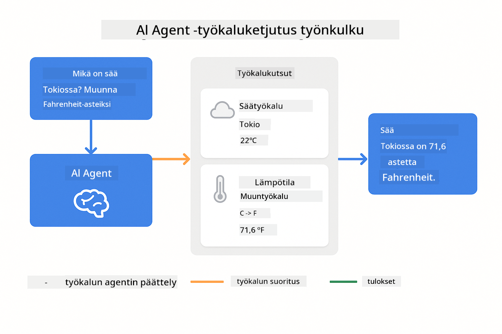
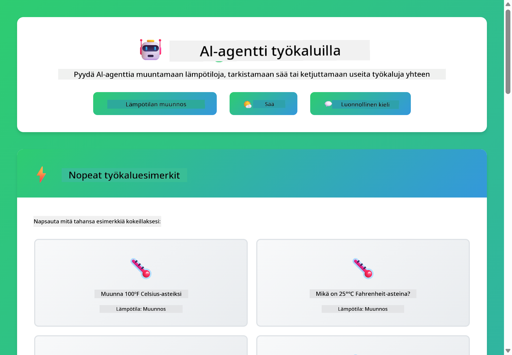
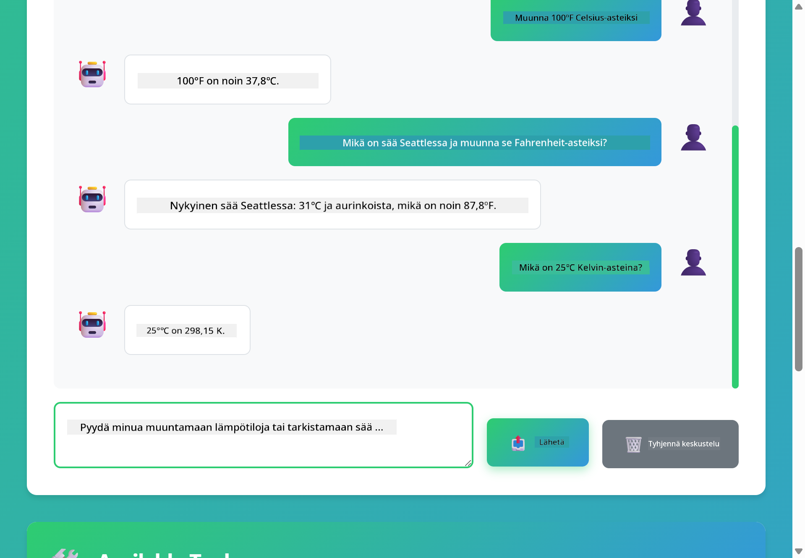

<!--
CO_OP_TRANSLATOR_METADATA:
{
  "original_hash": "aa23f106e7f53270924c9dd39c629004",
  "translation_date": "2025-12-13T19:03:37+00:00",
  "source_file": "04-tools/README.md",
  "language_code": "fi"
}
-->
# Moduuli 04: AI-agentit työkaluilla

## Sisällysluettelo

- [Mitä opit](../../../04-tools)
- [Esivaatimukset](../../../04-tools)
- [Ymmärtäminen: AI-agentit työkaluilla](../../../04-tools)
- [Miten työkalukutsut toimivat](../../../04-tools)
  - [Työkalumääritelmät](../../../04-tools)
  - [Päätöksenteko](../../../04-tools)
  - [Suoritus](../../../04-tools)
  - [Vastauksen generointi](../../../04-tools)
- [Työkaluketjutus](../../../04-tools)
- [Sovelluksen käynnistäminen](../../../04-tools)
- [Sovelluksen käyttö](../../../04-tools)
  - [Kokeile yksinkertaista työkalun käyttöä](../../../04-tools)
  - [Testaa työkaluketjutusta](../../../04-tools)
  - [Katso keskustelun kulku](../../../04-tools)
  - [Havainnoi päättely](../../../04-tools)
  - [Kokeile erilaisia pyyntöjä](../../../04-tools)
- [Keskeiset käsitteet](../../../04-tools)
  - [ReAct-malli (päättely ja toiminta)](../../../04-tools)
  - [Työkalujen kuvaukset ovat tärkeitä](../../../04-tools)
  - [Istunnon hallinta](../../../04-tools)
  - [Virheenkäsittely](../../../04-tools)
- [Saatavilla olevat työkalut](../../../04-tools)
- [Milloin käyttää työkalupohjaisia agenteja](../../../04-tools)
- [Seuraavat askeleet](../../../04-tools)

## Mitä opit

Tähän asti olet oppinut käymään keskusteluja tekoälyn kanssa, rakentamaan kehotteita tehokkaasti ja perustamaan vastaukset dokumentteihisi. Mutta on edelleen perustavanlaatuinen rajoitus: kielimallit voivat tuottaa vain tekstiä. Ne eivät voi tarkistaa säätä, suorittaa laskelmia, kysellä tietokantoja tai olla vuorovaikutuksessa ulkoisten järjestelmien kanssa.

Työkalut muuttavat tämän. Antamalla mallille pääsyn kutsuttaviin toimintoihin, muutat sen tekstin tuottajasta agentiksi, joka voi toimia. Malli päättää, milloin se tarvitsee työkalun, mitä työkalua käyttää ja mitä parametreja välittää. Koodisi suorittaa funktion ja palauttaa tuloksen. Malli sisällyttää tuloksen vastaukseensa.

## Esivaatimukset

- Moduuli 01 suoritettu (Azure OpenAI -resurssit otettu käyttöön)
- `.env`-tiedosto juurihakemistossa Azure-tunnuksilla (luotu `azd up` -komennolla Moduulissa 01)

> **Huom:** Jos et ole suorittanut Moduulia 01, seuraa ensin siellä annettuja käyttöönotto-ohjeita.

## Ymmärrys: AI-agentit työkaluilla

AI-agentti työkaluilla noudattaa päättelyn ja toiminnan mallia (ReAct):

1. Käyttäjä esittää kysymyksen
2. Agentti päättelijänä arvioi, mitä sen täytyy tietää
3. Agentti päättää, tarvitseeko se työkalua vastatakseen
4. Jos tarvitsee, agentti kutsuu sopivaa työkalua oikeilla parametreilla
5. Työkalu suorittaa ja palauttaa tiedot
6. Agentti sisällyttää tuloksen ja antaa lopullisen vastauksen


*ReAct-malli – miten AI-agentit vuorottelevat päättelyn ja toiminnan välillä ongelmien ratkaisemiseksi*

Tämä tapahtuu automaattisesti. Määrittelet työkalut ja niiden kuvaukset. Malli hoitaa päätöksenteon siitä, milloin ja miten niitä käytetään.

## Miten työkalukutsut toimivat

**Työkalumääritelmät** - [WeatherTool.java](../../../04-tools/src/main/java/com/example/langchain4j/agents/tools/WeatherTool.java) | [TemperatureTool.java](../../../04-tools/src/main/java/com/example/langchain4j/agents/tools/TemperatureTool.java)

Määrittelet funktiot selkeillä kuvauksilla ja parametrien määrittelyillä. Malli näkee nämä kuvaukset järjestelmäkehotteessaan ja ymmärtää, mitä kukin työkalu tekee.

```java
@Component
public class WeatherTool {
    
    @Tool("Get the current weather for a location")
    public String getCurrentWeather(@P("Location name") String location) {
        // Säähautasi logiikka
        return "Weather in " + location + ": 22°C, cloudy";
    }
}

@AiService
public interface Assistant {
    String chat(@MemoryId String sessionId, @UserMessage String message);
}

// Avustaja on automaattisesti yhdistetty Spring Bootin avulla:
// - ChatModel bean
// - Kaikki @Tool-metodit @Component-luokista
// - ChatMemoryProvider istunnon hallintaan
```

> **🤖 Kokeile [GitHub Copilot](https://github.com/features/copilot) Chatin kanssa:** Avaa [`WeatherTool.java`](../../../04-tools/src/main/java/com/example/langchain4j/agents/tools/WeatherTool.java) ja kysy:
> - "Miten integroisin oikean sää-API:n, kuten OpenWeatherMapin, mock-datan sijaan?"
> - "Mikä tekee hyvästä työkalukuvauksesta, joka auttaa tekoälyä käyttämään sitä oikein?"
> - "Miten käsittelen API-virheitä ja käyttörajoituksia työkalun toteutuksissa?"

**Päätöksenteko**

Kun käyttäjä kysyy "Mikä on sää Seattlessa?", malli tunnistaa tarvitsevansa säätyökalun. Se generoi funktiokutsun, jossa sijaintiparametri on "Seattle".

**Suoritus** - [AgentService.java](../../../04-tools/src/main/java/com/example/langchain4j/agents/service/AgentService.java)

Spring Boot yhdistää automaattisesti `@AiService`-rajapinnan kaikkiin rekisteröityihin työkaluihin, ja LangChain4j suorittaa työkalukutsut automaattisesti.

> **🤖 Kokeile [GitHub Copilot](https://github.com/features/copilot) Chatin kanssa:** Avaa [`AgentService.java`](../../../04-tools/src/main/java/com/example/langchain4j/agents/service/AgentService.java) ja kysy:
> - "Miten ReAct-malli toimii ja miksi se on tehokas AI-agenteille?"
> - "Miten agentti päättää, mitä työkalua käyttää ja missä järjestyksessä?"
> - "Mitä tapahtuu, jos työkalun suoritus epäonnistuu – miten virheet tulisi käsitellä luotettavasti?"

**Vastauksen generointi**

Malli vastaanottaa säädatan ja muotoilee siitä luonnollisen kielen vastauksen käyttäjälle.

### Miksi käyttää deklaratiivisia AI-palveluita?

Tämä moduuli käyttää LangChain4j:n Spring Boot -integraatiota deklaratiivisilla `@AiService`-rajapinnoilla:

- **Spring Bootin automaattinen yhdistäminen** – ChatModel ja työkalut injektoidaan automaattisesti
- **@MemoryId-malli** – Automaattinen istuntopohjainen muistin hallinta
- **Yksi instanssi** – Assistentti luodaan kerran ja käytetään uudelleen paremman suorituskyvyn vuoksi
- **Tyyppiturvallinen suoritus** – Java-metodit kutsutaan suoraan tyyppimuunnoksin
- **Monikierroksinen orkestrointi** – Käsittelee työkaluketjutuksen automaattisesti
- **Ei turhaa koodia** – Ei manuaalisia AiServices.builder()-kutsuja tai muistihakemistoja

Vaihtoehtoiset lähestymistavat (manuaalinen `AiServices.builder()`) vaativat enemmän koodia ja eivät hyödynnä Spring Bootin integraation etuja.

## Työkaluketjutus

**Työkaluketjutus** – AI voi kutsua useita työkaluja peräkkäin. Kysy "Mikä on sää Seattlessa ja pitäisikö minun ottaa sateenvarjo?" ja katso, miten se ketjuttaa `getCurrentWeather` -kutsun ja päättelyn sateenvarjosta.

<a href="images/tool-chaining.png"></a>

*Peräkkäiset työkalukutsut – yhden työkalun tulos syötteenä seuraavaan päätökseen*

**Sujuvat virhetilanteet** – Kysy sää jostain kaupungista, joka ei ole mock-datassa. Työkalu palauttaa virheilmoituksen, ja AI selittää, ettei voi auttaa. Työkalut epäonnistuvat turvallisesti.

Tämä tapahtuu yhdessä keskustelukierrossa. Agentti orkestroi useita työkalukutsuja itsenäisesti.

## Sovelluksen käynnistäminen

**Varmista käyttöönotto:**

Varmista, että `.env`-tiedosto on juurihakemistossa Azure-tunnuksilla (luotu Moduulissa 01):
```bash
cat ../.env  # Tulisi näyttää AZURE_OPENAI_ENDPOINT, API_KEY, DEPLOYMENT
```

**Käynnistä sovellus:**

> **Huom:** Jos olet jo käynnistänyt kaikki sovellukset `./start-all.sh` -skriptillä Moduulissa 01, tämä moduuli on jo käynnissä portissa 8084. Voit ohittaa alla olevat käynnistyskomennot ja siirtyä suoraan osoitteeseen http://localhost:8084.

**Vaihtoehto 1: Spring Boot Dashboardin käyttö (suositeltu VS Code -käyttäjille)**

Kehityssäiliössä on Spring Boot Dashboard -laajennus, joka tarjoaa visuaalisen käyttöliittymän kaikkien Spring Boot -sovellusten hallintaan. Löydät sen VS Coden vasemman reunan Aktiviteettipalkista (etsi Spring Boot -kuvake).

Spring Boot Dashboardista voit:
- Näyttää kaikki käytettävissä olevat Spring Boot -sovellukset työtilassa
- Käynnistää/pysäyttää sovelluksia yhdellä napsautuksella
- Tarkastella sovelluslokeja reaaliajassa
- Valvoa sovellusten tilaa

Klikkaa "tools"-moduulin vieressä olevaa toistopainiketta käynnistääksesi tämän moduulin tai käynnistä kaikki moduulit kerralla.


**Vaihtoehto 2: Shell-skriptien käyttö**

Käynnistä kaikki web-sovellukset (moduulit 01-04):

**Bash:**
```bash
cd ..  # Juurihakemistosta
./start-all.sh
```

**PowerShell:**
```powershell
cd ..  # Juurihakemistosta
.\start-all.ps1
```

Tai käynnistä vain tämä moduuli:

**Bash:**
```bash
cd 04-tools
./start.sh
```

**PowerShell:**
```powershell
cd 04-tools
.\start.ps1
```

Molemmat skriptit lataavat automaattisesti ympäristömuuttujat juurihakemiston `.env`-tiedostosta ja rakentavat JAR-tiedostot, jos niitä ei ole.

> **Huom:** Jos haluat rakentaa kaikki moduulit manuaalisesti ennen käynnistystä:
>
> **Bash:**
> ```bash
> cd ..  # Go to root directory
> mvn clean package -DskipTests
> ```
>
> **PowerShell:**
> ```powershell
> cd ..  # Go to root directory
> mvn clean package -DskipTests
> ```

Avaa selaimessa http://localhost:8084.

**Pysäyttääksesi:**

**Bash:**
```bash
./stop.sh  # Vain tämä moduuli
# Tai
cd .. && ./stop-all.sh  # Kaikki moduulit
```

**PowerShell:**
```powershell
.\stop.ps1  # Vain tämä moduuli
# Tai
cd ..; .\stop-all.ps1  # Kaikki moduulit
```

## Sovelluksen käyttö

Sovellus tarjoaa web-käyttöliittymän, jossa voit olla vuorovaikutuksessa AI-agentin kanssa, jolla on pääsy sää- ja lämpötilamuunnostyökaluihin.

<a href="images/tools-homepage.png"></a>

*AI-agenttien työkalujen käyttöliittymä – nopeita esimerkkejä ja chat-käyttöliittymä työkalujen kanssa vuorovaikutukseen*

**Kokeile yksinkertaista työkalun käyttöä**

Aloita suoraviivaisella pyynnöllä: "Muunna 100 Fahrenheit-astetta Celsius-asteiksi". Agentti tunnistaa tarvitsevansa lämpötilamuunnostyökalun, kutsuu sitä oikeilla parametreilla ja palauttaa tuloksen. Huomaa, miten luonnolliselta tämä tuntuu – et määritellyt, mitä työkalua käyttää tai miten sitä kutsutaan.

**Testaa työkaluketjutusta**

Kokeile nyt monimutkaisempaa: "Mikä on sää Seattlessa ja muunna se Fahrenheit-asteiksi?" Katso, miten agentti etenee vaiheittain. Se ensin hakee sään (joka palauttaa Celsius-asteet), tunnistaa tarvitsevansa muuntaa Fahrenheit-asteiksi, kutsuu muunnostyökalua ja yhdistää molemmat tulokset yhdeksi vastaukseksi.

**Katso keskustelun kulku**

Chat-käyttöliittymä ylläpitää keskusteluhistoriaa, jolloin voit käydä monikierroksisia vuorovaikutuksia. Näet kaikki aiemmat kyselyt ja vastaukset, mikä helpottaa keskustelun seuraamista ja ymmärtämään, miten agentti rakentaa kontekstia useiden vaihdosten aikana.

<a href="images/tools-conversation-demo.png"></a>

*Monikierroksinen keskustelu, jossa näkyy yksinkertaisia muunnoksia, säähaut ja työkaluketjutus*

**Kokeile erilaisia pyyntöjä**

Kokeile erilaisia yhdistelmiä:
- Säähaut: "Mikä on sää Tokiossa?"
- Lämpötilamuunnokset: "Mikä on 25°C Kelvineinä?"
- Yhdistetyt kyselyt: "Tarkista sää Pariisissa ja kerro, onko siellä yli 20°C"

Huomaa, miten agentti tulkitsee luonnollista kieltä ja yhdistää sen sopiviin työkalukutsuihin.

## Keskeiset käsitteet

**ReAct-malli (päättely ja toiminta)**

Agentti vuorottelee päättelyn (päätöksen tekeminen) ja toiminnan (työkalujen käyttö) välillä. Tämä malli mahdollistaa autonomisen ongelmanratkaisun pelkän ohjeiden seuraamisen sijaan.

**Työkalujen kuvaukset ovat tärkeitä**

Työkalukuvauksiesi laatu vaikuttaa suoraan siihen, miten hyvin agentti käyttää niitä. Selkeät, täsmälliset kuvaukset auttavat mallia ymmärtämään, milloin ja miten kutakin työkalua kutsutaan.

**Istunnon hallinta**

`@MemoryId`-annotaatio mahdollistaa automaattisen istuntopohjaisen muistin hallinnan. Jokaiselle istunnon tunnukselle luodaan oma `ChatMemory`-instanssi, jota hallinnoi `ChatMemoryProvider`-bean, joten manuaalista muistin seurantaa ei tarvita.

**Virheenkäsittely**

Työkalut voivat epäonnistua – API:t aikakatkaistaan, parametrit voivat olla virheellisiä, ulkoiset palvelut voivat olla poissa käytöstä. Tuotantoagenttien täytyy käsitellä virheitä, jotta malli voi selittää ongelmat tai kokeilla vaihtoehtoja.

## Saatavilla olevat työkalut

**Säätyökalut** (mock-data demonstrointiin):
- Hae nykyinen sää sijainnille
- Hae monipäiväinen sääennuste

**Lämpötilamuunnostyökalut**:
- Celsius → Fahrenheit
- Fahrenheit → Celsius
- Celsius → Kelvin
- Kelvin → Celsius
- Fahrenheit → Kelvin
- Kelvin → Fahrenheit

Nämä ovat yksinkertaisia esimerkkejä, mutta malli laajenee mihin tahansa funktioon: tietokantakyselyihin, API-kutsuihin, laskelmiin, tiedostotoimintoihin tai järjestelmäkomentoihin.

## Milloin käyttää työkalupohjaisia agenteja

**Käytä työkaluja, kun:**
- Vastaukset vaativat reaaliaikaista dataa (sää, osakekurssit, varastotiedot)
- Tarvitset laskelmia, jotka ylittävät yksinkertaisen matematiikan
- Pääsy tietokantoihin tai API:hin
- Toimien tekeminen (sähköpostien lähetys, tikettien luonti, tietojen päivitys)
- Useiden tietolähteiden yhdistäminen

**Älä käytä työkaluja, kun:**
- Kysymykset voidaan vastata yleisen tiedon perusteella
- Vastaus on puhtaasti keskusteleva
- Työkalun viive tekisi käyttökokemuksesta liian hitaan

## Seuraavat askeleet

**Seuraava moduuli:** [05-mcp - Mallin kontekstiprotokolla (MCP)](../05-mcp/README.md)

---

**Navigointi:** [← Edellinen: Moduuli 03 - RAG](../03-rag/README.md) | [Takaisin pääsivulle](../README.md) | [Seuraava: Moduuli 05 - MCP →](../05-mcp/README.md)

---

<!-- CO-OP TRANSLATOR DISCLAIMER START -->
**Vastuuvapauslauseke**:
Tämä asiakirja on käännetty käyttämällä tekoälypohjaista käännöspalvelua [Co-op Translator](https://github.com/Azure/co-op-translator). Vaikka pyrimme tarkkuuteen, otathan huomioon, että automaattikäännöksissä saattaa esiintyä virheitä tai epätarkkuuksia. Alkuperäistä asiakirjaa sen alkuperäisellä kielellä tulee pitää virallisena lähteenä. Tärkeissä asioissa suositellaan ammattimaista ihmiskäännöstä. Emme ole vastuussa tämän käännöksen käytöstä aiheutuvista väärinymmärryksistä tai tulkinnoista.
<!-- CO-OP TRANSLATOR DISCLAIMER END -->