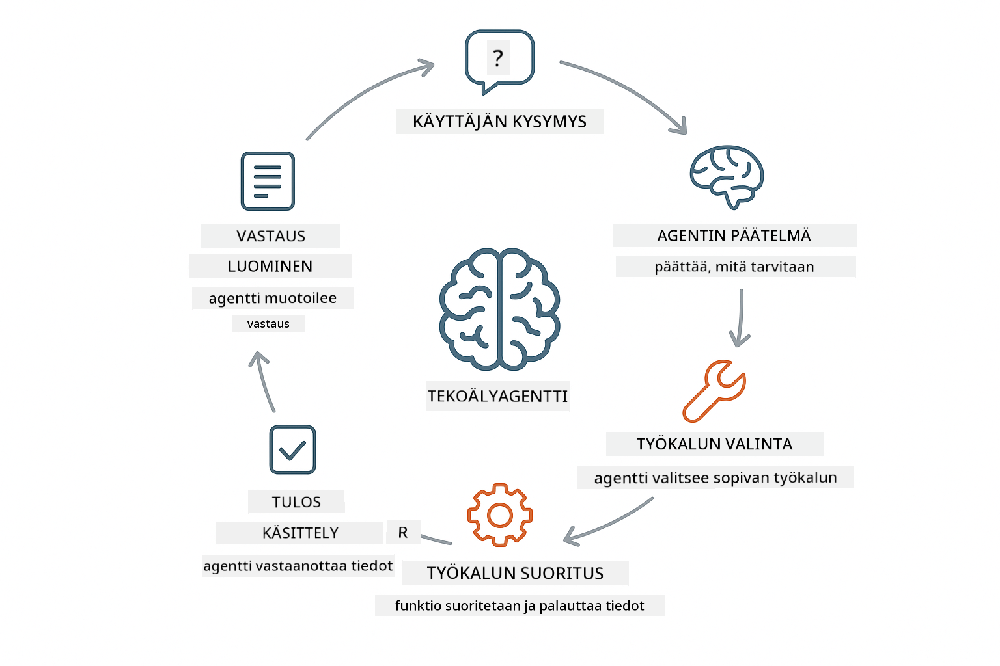
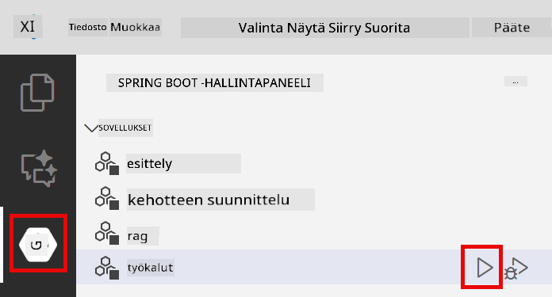

<!--
CO_OP_TRANSLATOR_METADATA:
{
  "original_hash": "13ec450c12cdd1a863baa2b778f27cd7",
  "translation_date": "2025-12-31T02:02:04+00:00",
  "source_file": "04-tools/README.md",
  "language_code": "fi"
}
-->
# Moduuli 04: Työkaluja käyttävät tekoälyagentit

## Sisällys

- [Mitä opit](../../../04-tools)
- [Edellytykset](../../../04-tools)
- [Ymmärrys: tekoälyagentit ja työkalut](../../../04-tools)
- [Kuinka työkalukutsut toimivat](../../../04-tools)
  - [Työkalujen määrittelyt](../../../04-tools)
  - [Päätöksenteko](../../../04-tools)
  - [Suoritus](../../../04-tools)
  - [Vastauksen muodostus](../../../04-tools)
- [Työkaluketjutus](../../../04-tools)
- [Sovelluksen käynnistäminen](../../../04-tools)
- [Sovelluksen käyttö](../../../04-tools)
  - [Kokeile yksinkertaista työkalun käyttöä](../../../04-tools)
  - [Testaa työkaluketjutusta](../../../04-tools)
  - [Katso keskustelun kulkua](../../../04-tools)
  - [Havainnoi päättely](../../../04-tools)
  - [Kokeile erilaisia pyyntöjä](../../../04-tools)
- [Keskeiset käsitteet](../../../04-tools)
  - [ReAct-malli (päätteleminen ja toimiminen)](../../../04-tools)
  - [Työkalukuvaukset ovat tärkeitä](../../../04-tools)
  - [Istunnon hallinta](../../../04-tools)
  - [Virheiden käsittely](../../../04-tools)
- [Saatavilla olevat työkalut](../../../04-tools)
- [Milloin käyttää työkaluja käyttäviä agenteja](../../../04-tools)
- [Seuraavat askeleet](../../../04-tools)

## Mitä opit

Tähän mennessä olet oppinut käymään keskusteluja tekoälyn kanssa, rakentamaan tehokkaita kehotteita ja perustamaan vastauksia dokumentteihisi. Silti on perustava rajoitus: kielimallit voivat vain tuottaa tekstiä. Ne eivät voi tarkistaa säätä, suorittaa laskelmia, kysellä tietokantoja tai olla vuorovaikutuksessa ulkoisten järjestelmien kanssa.

Työkalut muuttavat tätä. Antamalla mallille pääsyn kutsuttaviin toimintoihin muutat sen tekstintuottajasta agentiksi, joka voi toimia. Malli päättää, milloin se tarvitsee työkalua, mitä työkalua käyttää ja mitä parametreja välittää. Koodisi suorittaa funktion ja palauttaa tuloksen. Malli sisällyttää kyseisen tuloksen vastaukseensa.

## Edellytykset

- Moduuli 01 suoritettuna (Azure OpenAI -resurssit otettu käyttöön)
- `.env`-tiedosto juurihakemistossa Azure-tunnistetiedoilla (luotu komennolla `azd up` Moduulissa 01)

> **Huom:** Jos et ole suorittanut Moduulia 01, noudata ensin siellä annettuja käyttöönotto-ohjeita.

## Ymmärrys: tekoälyagentit ja työkalut

> **📝 Huom:** Tässä moduulissa termillä "agentit" tarkoitetaan työkutsutoiminnallisuudella laajennettuja tekoälyavustajia. Tämä eroaa **Agentic AI** -malleista (autonomiset agentit, joilla on suunnittelu, muisti ja monivaiheinen päättely), joita käsittelemme [Moduuli 05: MCP](../05-mcp/README.md) -osiossa.

Työkaluja käyttävä tekoälyagentti noudattaa päättelyn ja toiminnan mallia (ReAct):

1. Käyttäjä esittää kysymyksen
2. Agentti pohtii, mitä sen tarvitsee tietää
3. Agentti päättää, tarvitseekö se työkalua vastatakseen
4. Jos tarvitsee, agentti kutsuu sopivaa työkalua oikeilla parametreilla
5. Työkalu suorittaa ja palauttaa tietoa
6. Agentti sisällyttää tuloksen ja antaa lopullisen vastauksen



*ReAct-malli — miten tekoälyagentit vuorottelevat päättelyn ja toiminnan välillä ongelmien ratkaisemiseksi*

Tämä tapahtuu automaattisesti. Määrittelet työkalut ja niiden kuvaukset. Malli hoitaa päätöksenteon siitä, milloin ja miten niitä käytetään.

## Kuinka työkalukutsut toimivat

**Työkalumäärittelyt** - [WeatherTool.java](../../../04-tools/src/main/java/com/example/langchain4j/agents/tools/WeatherTool.java) | [TemperatureTool.java](../../../04-tools/src/main/java/com/example/langchain4j/agents/tools/TemperatureTool.java)

Määrittelet funktiot selkeillä kuvauksilla ja parametrien spesifikaatioilla. Malli näkee nämä kuvaukset järjestelmällä annettavassa kehotteessa ja ymmärtää, mitä kukin työkalu tekee.

```java
@Component
public class WeatherTool {
    
    @Tool("Get the current weather for a location")
    public String getCurrentWeather(@P("Location name") String location) {
        // Säähakun logiikka
        return "Weather in " + location + ": 22°C, cloudy";
    }
}

@AiService
public interface Assistant {
    String chat(@MemoryId String sessionId, @UserMessage String message);
}

// Avustaja kytketään automaattisesti Spring Bootin avulla seuraavilla:
// - ChatModel-bean
// - Kaikki @Tool-metodit @Component-luokista
// - ChatMemoryProvider istunnon hallintaan
```

> **🤖 Kokeile [GitHub Copilot](https://github.com/features/copilot) Chatin kanssa:** Avaa [`WeatherTool.java`](../../../04-tools/src/main/java/com/example/langchain4j/agents/tools/WeatherTool.java) ja kysy:
> - "Miten integroida oikea sää-API, kuten OpenWeatherMap, mock-datan sijaan?"
> - "Mikä tekee hyvästä työkalu kuvauksesta, joka auttaa AI:ta käyttämään sitä oikein?"
> - "Miten käsittelen API-virheitä ja nopeusrajoituksia työkalun toteutuksissa?"

**Päätöksenteko**

Kun käyttäjä kysyy "Mikä on sää Seattlessa?", malli tunnistaa tarvitsevansa säätyökalun. Se muodostaa funktiokutsun, jossa sijaintiparametriksi asetetaan "Seattle".

**Suoritus** - [AgentService.java](../../../04-tools/src/main/java/com/example/langchain4j/agents/service/AgentService.java)

Spring Boot kytkee automaattisesti deklaratiivisen `@AiService`-rajapinnan kaikkiin rekisteröityihin työkaluihin, ja LangChain4j suorittaa työkalukutsut automaattisesti.

> **🤖 Kokeile [GitHub Copilot](https://github.com/features/copilot) Chatin kanssa:** Avaa [`AgentService.java`](../../../04-tools/src/main/java/com/example/langchain4j/agents/service/AgentService.java) ja kysy:
> - "Miten ReAct-malli toimii ja miksi se on tehokas tekoälyagenteille?"
> - "Miten agentti päättää, mitä työkalua käyttää ja missä järjestyksessä?"
> - "Mitä tapahtuu, jos työkalun suoritus epäonnistuu — miten virheet pitäisi käsitellä luotettavasti?"

**Vastauksen muodostus**

Malli vastaanottaa säädatan ja muotoilee siitä luonnollisen kielen vastauksen käyttäjälle.

### Miksi käyttää deklaratiivisia AI-palveluja?

Tässä moduulissa käytetään LangChain4j:n Spring Boot -integraatiota deklaratiivisten `@AiService`-rajapintojen kanssa:

- **Spring Boot -autowiring** - ChatModel ja työkalut injektoidaan automaattisesti
- **@MemoryId-malli** - Automaattinen istuntokohtainen muistinhallinta
- **Yksi instanssi** - Avustaja luodaan kerran ja käytetään uudelleen paremman suorituskyvyn saamiseksi
- **Tyyppiturvallinen suoritus** - Java-metodeja kutsutaan suoraan tyyppimuunnoksin
- **Monikierroksinen orkestrointi** - Käsittelee työkaluketjutuksen automaattisesti
- **Ei turhaa boilerplatea** - Ei manuaalisia AiServices.builder()-kutsuja tai muistihakemistoja

Vaihtoehtoiset lähestymistavat (manuaalinen `AiServices.builder()`) vaativat enemmän koodia ja jäävät ilman Spring Boot -integraation etuja.

## Työkaluketjutus

**Työkaluketjutus** - AI voi kutsua useita työkaluja peräkkäin. Kysy "Mikä on sää Seattlessa ja pitäisikö minun ottaa sateenvarjo?" ja katso, miten se ketjuttaa `getCurrentWeather`-kutsun sekä pohtimisen sateenvarjon tarpeesta.

<a href="images/tool-chaining.png"></a>

*Peräkkäisiä työkalukutsuja — yhden työkalun output ohjaa seuraavaa päätöstä*

**Suuntautuneet epäonnistumiset** - Kysy säätä kaupungista, jota mock-data ei kata. Työkalu palauttaa virheilmoituksen, ja AI selittää, ettei se pysty auttamaan. Työkalut epäonnistuvat turvallisesti.

Tämä tapahtuu yhdessä keskusteluvaiheessa. Agentti orkestroi useita työkalukutsuja itsenäisesti.

## Sovelluksen käynnistäminen

**Tarkista käyttöönotto:**

Varmista, että `.env`-tiedosto on juurihakemistossa Azure-tunnistetiedoilla (luotu Moduuli 01:n aikana):
```bash
cat ../.env  # Tulisi näyttää AZURE_OPENAI_ENDPOINT, API_KEY, DEPLOYMENT
```

**Käynnistä sovellus:**

> **Huom:** Jos olet jo käynnistänyt kaikki sovellukset komennolla `./start-all.sh` Moduulista 01, tämä moduuli on jo käynnissä portissa 8084. Voit ohittaa aloituskäskyt alla ja siirtyä suoraan osoitteeseen http://localhost:8084.

**Vaihtoehto 1: Spring Boot Dashboardin käyttäminen (suositeltu VS Code -käyttäjille)**

Dev-container sisältää Spring Boot Dashboard -laajennuksen, joka tarjoaa visuaalisen käyttöliittymän kaikkien Spring Boot -sovellusten hallintaan. Löydät sen VS Code:n Activity Barista vasemmalta (etsi Spring Boot -ikonia).

Spring Boot Dashboardista voit:
- Näyttää kaikki työtilan saatavilla olevat Spring Boot -sovellukset
- Käynnistää/pysäyttää sovelluksia yhdellä napsautuksella
- Tarkastella sovelluslokia reaaliajassa
- Seurata sovellusten tilaa

Klikkaa play-painiketta "tools"-kohdan vierestä käynnistääksesi tämän moduulin, tai käynnistä kaikki moduulit kerralla.



**Vaihtoehto 2: Shell-skriptien käyttäminen**

Käynnistä kaikki web-sovellukset (moduulit 01–04):

**Bash:**
```bash
cd ..  # Juurihakemistosta
./start-all.sh
```

**PowerShell:**
```powershell
cd ..  # Juurihakemistosta
.\start-all.ps1
```

Tai käynnistä vain tämä moduuli:

**Bash:**
```bash
cd 04-tools
./start.sh
```

**PowerShell:**
```powershell
cd 04-tools
.\start.ps1
```

Molemmat skriptit lataavat automaattisesti ympäristömuuttujat juurihakemiston `.env`-tiedostosta ja rakentavat JAR-tiedostot, jos niitä ei vielä ole.

> **Huom:** Jos haluat rakentaa kaikki moduulit manuaalisesti ennen käynnistystä:
>
> **Bash:**
> ```bash
> cd ..  # Go to root directory
> mvn clean package -DskipTests
> ```
>
> **PowerShell:**
> ```powershell
> cd ..  # Go to root directory
> mvn clean package -DskipTests
> ```

Avaa selaimessa osoite http://localhost:8084.

**Sammuttaminen:**

**Bash:**
```bash
./stop.sh  # Vain tämä moduuli
# Tai
cd .. && ./stop-all.sh  # Kaikki moduulit
```

**PowerShell:**
```powershell
.\stop.ps1  # Vain tämä moduuli
# Tai
cd ..; .\stop-all.ps1  # Kaikki moduulit
```

## Sovelluksen käyttö

Sovellus tarjoaa verkkokäyttöliittymän, jossa voit olla vuorovaikutuksessa tekoälyagentin kanssa, joka pääsee käsiksi sää- ja lämpötilamuunnostyökaluihin.

<a href="images/tools-homepage.png"></a>

*AI Agent Tools -käyttöliittymä — pikiesimerkkejä ja chat-käyttöliittymä työkalujen kanssa käytävässä vuorovaikutuksessa*

**Kokeile yksinkertaista työkalun käyttöä**

Aloita suoraviivaisella pyynnöllä: "Muunna 100 astetta Fahrenheitia Celsiukseksi". Agentti tunnistaa tarvitsevansa lämpötilamuunnostyökalun, kutsuu sitä oikeilla parametreilla ja palauttaa tuloksen. Huomaa, kuinka luonnolliselta tämä tuntuu — sinun ei tarvinnut määrittää, mitä työkalua käyttää tai miten sitä kutsutaan.

**Testaa työkaluketjutusta**

Kokeile nyt jotain monimutkaisempaa: "Mikä on sää Seattlessa ja muunna se Fahrenheitiksi?" Katso, miten agentti etenee vaiheittain. Se hakee ensin sään (joka palauttaa celsius-asteet), tunnistaa tarpeen muunnokselle, kutsuu muunnostyökalua ja yhdistää molemmat tulokset yhdeksi vastaukseksi.

**Katso keskustelun kulkua**

Chat-käyttöliittymä säilyttää keskusteluhistorian, jolloin voit käydä monikierroksisia keskusteluja. Näet aiemmat kysymykset ja vastaukset, mikä helpottaa keskustelun seuraamista ja ymmärtämään, miten agentti rakentaa kontekstia useiden vaihtojen aikana.

<a href="images/tools-conversation-demo.png"></a>

*Monikierroksinen keskustelu, jossa näkyy yksinkertaisia muunnoksia, säähakuja ja työkaluketjutusta*

**Kokeile erilaisia pyyntöjä**

Kokeile erilaisia yhdistelmiä:
- Säähaut: "Mikä on sää Tokiossa?"
- Lämpötilamuunnokset: "Mikä on 25°C Kelvineinä?"
- Yhdistetyt kyselyt: "Tarkista sää Pariisissa ja kerro, onko siellä yli 20°C"

Huomaa, miten agentti tulkitsee luonnollista kieltä ja peilaa sen sopiviin työkalukutsuihin.

## Keskeiset käsitteet

**ReAct-malli (päätteleminen ja toimiminen)**

Agentti vuorottelee päättelyn (mitä tehdä) ja toiminnan (työkalujen käyttö) välillä. Tämä malli mahdollistaa autonomisen ongelmanratkaisun pelkän ohjeiden seuraamisen sijaan.

**Työkalukuvaukset ovat tärkeitä**

Työkalukuvauksiesi laatu vaikuttaa suoraan siihen, kuinka hyvin agentti käyttää niitä. Selkeät ja täsmälliset kuvaukset auttavat mallia ymmärtämään, milloin ja miten kukin työkalu tulee kutsua.

**Istunnon hallinta**

`@MemoryId`-annotaatio mahdollistaa automaattisen istuntokohtaisen muistinhallinnan. Jokaisella istuntotunnuksella on oma `ChatMemory`-instanssinsa, jota `ChatMemoryProvider`-bean hallinnoi, mikä poistaa manuaalisen muistinhallinnan tarpeen.

**Virheiden käsittely**

Työkalut voivat epäonnistua — API:t aikakatkevat, parametrien arvot voivat olla virheellisiä ja ulkoiset palvelut voivat olla alhaalla. Tuotantoagenttien tarvitsee virheenkäsittely, jotta malli voi selittää ongelmat tai kokeilla vaihtoehtoja.

## Saatavilla olevat työkalut

**Säätyökalut** (mock-data demonstrointia varten):
- Hae nykyinen sää sijainnille
- Hae monipäiväinen ennuste

**Lämpötilamuunnostyökalut**:
- Celsius → Fahrenheit
- Fahrenheit → Celsius
- Celsius → Kelvin
- Kelvin → Celsius
- Fahrenheit → Kelvin
- Kelvin → Fahrenheit

Nämä ovat yksinkertaisia esimerkkejä, mutta malli laajenee mihin tahansa toiminnallisuuteen: tietokantakyselyihin, API-kutsuihin, laskelmiin, tiedostotoimintoihin tai järjestelmäkomentoihin.

## Milloin käyttää työkaluja käyttäviä agenteja

**Käytä työkaluja, kun:**
- Vastaukseen tarvitaan reaaliaikaista dataa (sää, osakekurssit, varastotilanne)
- Tarvitset laskelmia, jotka ylittävät yksinkertaisen matematiikan
- Pääsy tietokantoihin tai API:hin on tarpeen
- Toimenpiteiden suorittaminen (sähköpostien lähetys, tikettien luominen, tietojen päivittäminen)
- Useiden tietolähteiden yhdistäminen

**Älä käytä työkaluja, kun:**
- Kysymykset voidaan vastata yleisestä tiedosta
- Vastaus on puhtaasti keskusteleva
- Työkalun latenssi tekisi kokemuksesta liian hitaan

## Seuraavat askeleet

**Seuraava moduuli:** [05-mcp - Model Context Protocol (MCP)](../05-mcp/README.md)

---

**Navigointi:** [← Edellinen: Moduuli 03 - RAG](../03-rag/README.md) | [Takaisin pääsivulle](../README.md) | [Seuraava: Moduuli 05 - MCP →](../05-mcp/README.md)

---

<!-- CO-OP TRANSLATOR DISCLAIMER START -->
Vastuuvapauslauseke:
Tämä asiakirja on käännetty tekoälykäännöspalvelulla Co‑op Translator (https://github.com/Azure/co-op-translator). Vaikka pyrimme tarkkuuteen, huomioithan, että automaattikäännöksissä voi esiintyä virheitä tai epätarkkuuksia. Alkuperäistä asiakirjaa sen alkuperäiskielellä tulee pitää ratkaisevana lähteenä. Tärkeissä asioissa suositellaan ammattimaista ihmiskäännöstä. Emme ole vastuussa mahdollisista väärinymmärryksistä tai virhetulkinnoista, joita tämän käännöksen käyttäminen voi aiheuttaa.
<!-- CO-OP TRANSLATOR DISCLAIMER END -->