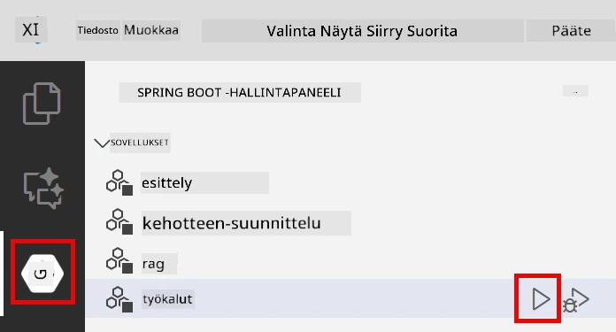
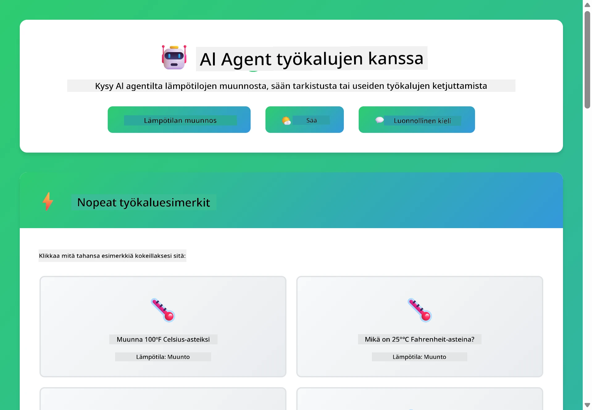
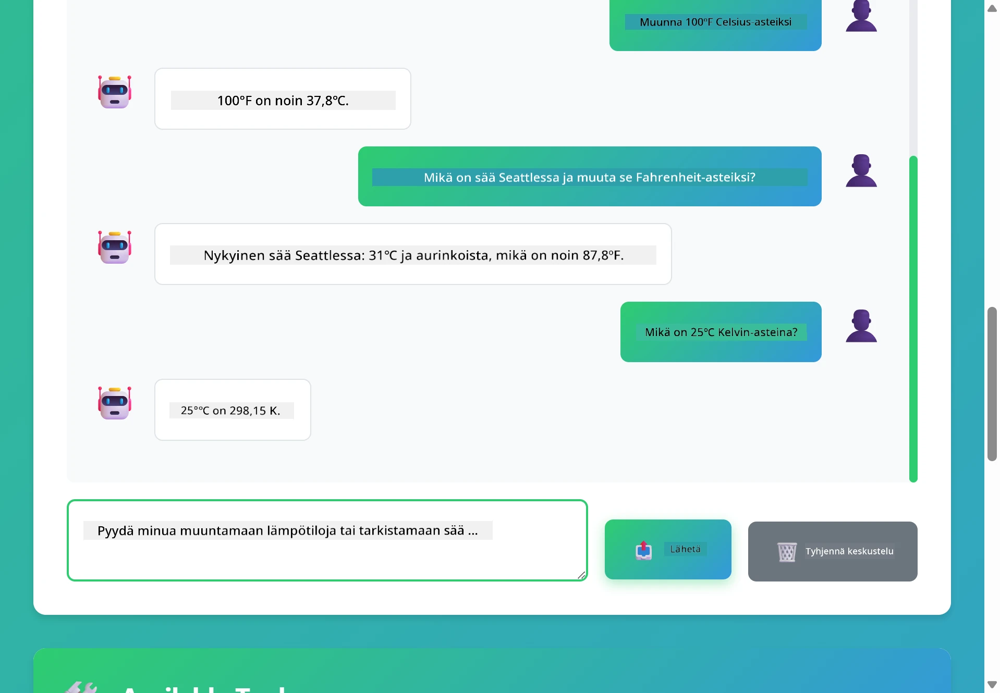

# Moduuli 04: Tekoälyagentit työkalujen kanssa

## Sisällysluettelo

- [Videokävely](#videokävely)
- [Mitä opit](#mitä-opit)
- [Esivaatimukset](#esivaatimukset)
- [Tekoälyagenttien ymmärtäminen työkaluilla](#tekoälyagenttien-ymmärtäminen-työkaluilla)
- [Kuinka työkalukutsu toimii](#kuinka-työkalukutsu-toimii)
  - [Työkalumääritelmät](#työkalumääritelmät)
  - [Päätöksenteko](#päätöksenteko)
  - [Suoritus](#suoritus)
  - [Vastauksen generointi](#vastauksen-generointi)
  - [Arkkitehtuuri: Spring Bootin automaattinen törmäys](#arkkitehtuuri-spring-bootin-automaattinen-törmäys)
- [Työkaluketjutus](#työkaluketjutus)
- [Sovelluksen suorittaminen](#sovelluksen-suorittaminen)
- [Sovelluksen käyttäminen](#sovelluksen-käyttö)
  - [Kokeile yksinkertaista työkalun käyttöä](#kokeile-yksinkertaista-työkalun-käyttöä)
  - [Testaa työkaluketjutusta](#testaa-työkaluketjutusta)
  - [Näe keskustelun kulku](#katso-keskustelun-kulkua)
  - [Kokeile erilaisia pyyntöjä](#kokeile-erilaisia-pyyntöjä)
- [Keskeiset käsitteet](#keskeiset-käsitteet)
  - [ReAct-malli (Päättely ja toiminta)](#react-malli-päättely-ja-toiminta)
  - [Työkalujen kuvaukset ovat tärkeitä](#tärkeitä-työkalukuvauksia)
  - [Istunnon hallinta](#istunnon-hallinta)
  - [Virheiden käsittely](#virheenkäsittely)
- [Saatavilla olevat työkalut](#saatavilla-olevat-työkalut)
- [Milloin käyttää työkalupohjaisia agentteja](#milloin-käyttää-työkalupohjaisia-agentteja)
- [Työkalut vs RAG](#työkalut-vs-rag)
- [Seuraavat askeleet](#seuraavat-askeleet)

## Videokävely

Katso tämä live-istunto, joka selittää miten aloittaa tämän moduulin kanssa:

<a href="https://www.youtube.com/watch?v=O_J30kZc0rw"></a>

## Mitä opit

Tähän mennessä olet oppinut käymään keskusteluja tekoälyn kanssa, rakentamaan kehotteita tehokkaasti ja perustamaan vastauksia dokumentteihisi. Mutta on vielä yksi perusrajoitus: kielimallit voivat ainoastaan generoida tekstiä. Ne eivät voi tarkistaa säätä, suorittaa laskutoimituksia, kysyä tietokannoista tai olla vuorovaikutuksessa ulkoisten järjestelmien kanssa.

Työkalut muuttavat tätä. Antamalla mallille pääsyn kutsuttaviin toimintoihin, muutat sen tekstigeneraattorista agentiksi, joka voi toimia. Malli päättää, milloin se tarvitsee työkalun, mitä työkalua käyttää ja mitä parametreja antaa. Koodisi suorittaa funktion ja palauttaa tuloksen. Malli sisällyttää tämän tuloksen vastaukseensa.

## Esivaatimukset

- Suoritettu [Moduuli 01 - Johdanto](../01-introduction/README.md) (Azure OpenAI -resurssit otettu käyttöön)
- Edellisten moduulien suorittaminen on suositeltavaa (tämä moduuli viittaa [RAG-konsepteihin Moduulista 03](../03-rag/README.md) Työkalut vs RAG -vertailussa)
- `.env`-tiedosto juurihakemistossa Azure-tunnuksilla (luotu komennolla `azd up` Moduulissa 01)

> **Huom:** Jos et ole suorittanut Moduulia 01, noudata ensin siellä annettuja asennusohjeita.

## Tekoälyagenttien ymmärtäminen työkaluilla

> **📝 Huom:** Tässä moduulissa termi "agentit" viittaa tekoälyavustajiin, jotka on parannettu työkalukutsutoiminnoilla. Tämä eroaa **Agentic AI** -malleista (autonomiset agentit, joilla on suunnittelu, muisti ja monivaiheinen päättely), joita käsittelemme [Moduulissa 05: MCP](../05-mcp/README.md).

Ilman työkaluja kielimalli voi ainoastaan generoida tekstiä koulutusdatastaan. Kysy siltä tämänhetkinen sää, niin sen pitää veikata. Anna sille työkaluja, niin se voi kutsua sää-API:a, suorittaa laskutoimituksia tai kysyä tietokannasta — ja kietoa nämä todelliset tulokset vastaukseensa.


*Ilman työkaluja malli vain veikkaa — työkaluilla se voi kutsua API:ita, suorittaa laskuja ja palauttaa reaaliaikaista dataa.*

Tekoälyagentti työkaluilla noudattaa **Päättely ja Toiminta (ReAct)** -mallia. Malli ei vain vastaa — se miettii, mitä se tarvitsee, toimii kutsumalla työkalua, tarkkailee tulosta ja päättää, toimiiko uudelleen vai antaa lopullisen vastauksen:

1. **Päättele** — Agentti analysoi käyttäjän kysymyksen ja määrittää, mitä tietoa se tarvitsee  
2. **Toimi** — Agentti valitsee sopivan työkalun, generoi oikeat parametrit ja kutsuu sitä  
3. **Tarkkaile** — Agentti vastaanottaa työkalun tuloksen ja arvioi sen  
4. **Toista tai vastaa** — Jos lisätietoa tarvitaan, agentti palaa aloitukseen; muuten se kokoaa luonnollisen kielen vastauksen


*ReAct-sykli — agentti päättää mitä tehdä, toimii kutsumalla työkalua, tarkkailee tulosta ja toistaa kunnes se voi antaa lopullisen vastauksen.*

Tämä tapahtuu automaattisesti. Määrittelet työkalut ja niiden kuvaukset. Malli huolehtii päätöksenteosta siitä, milloin ja miten työkaluja käytetään.

## Kuinka työkalukutsu toimii

### Työkalumääritelmät

[WeatherTool.java](../../../04-tools/src/main/java/com/example/langchain4j/agents/tools/WeatherTool.java) | [TemperatureTool.java](../../../04-tools/src/main/java/com/example/langchain4j/agents/tools/TemperatureTool.java)

Määrittelet funktiot selkeillä kuvauksilla ja parametrien määrittelyillä. Malli näkee nämä kuvaukset järjestelmäkehotteessaan ja ymmärtää, mitä kukin työkalu tekee.

```java
@Component
public class WeatherTool {
    
    @Tool("Get the current weather for a location")
    public String getCurrentWeather(@P("Location name") String location) {
        // Säätietojen hakulogiikkasi
        return "Weather in " + location + ": 22°C, cloudy";
    }
}

@AiService
public interface Assistant {
    String chat(@MemoryId String sessionId, @UserMessage String message);
}

// Avustaja on automaattisesti yhteydessä Spring Bootilla seuraaviin:
// - ChatModel bean
// - Kaikki @Tool-metodit @Component-luokista
// - ChatMemoryProvider istunnon hallintaan
```

Alla oleva kaavio purkaa jokaiseen annotaatioon ja näyttää, miten kukin osa auttaa tekoälyä ymmärtämään, milloin työkalu kutsutaan ja mitä argumentteja annetaan:


*Työkalumääritelmän anatomia — @Tool kertoo tekoälylle, milloin käyttää työkalua, @P kuvaa jokaisen parametrin, ja @AiService kytkee kaiken käynnistyksessä.*

> **🤖 Kokeile [GitHub Copilot](https://github.com/features/copilot) Chatin kanssa:** Avaa [`WeatherTool.java`](../../../04-tools/src/main/java/com/example/langchain4j/agents/tools/WeatherTool.java) ja kysy:  
> - "Kuinka integroisin oikean sää-API:n kuten OpenWeatherMapin sen sijaan, että käyttäisin mallinnettua dataa?"  
> - "Mikä tekee hyvästä työkalukuvauksesta, joka auttaa tekoälyä käyttämään sitä oikein?"  
> - "Miten käsittelen API-virheitä ja rajapintojen käyttörajoituksia työkalujen toteutuksissa?"

### Päätöksenteko

Kun käyttäjä kysyy "Mikä on sää Seattlella?", malli ei valitse työkalua satunnaisesti. Se vertaa käyttäjän aikomusta jokaiseen työkalukuvaan, arvioi ne merkityksellisyyden mukaan ja valitsee parhaan osuman. Se generoi rakenteellisen funktiokutsun oikeilla parametreilla — tässä tapauksessa asettaa `location` arvoksi `"Seattle"`.

Jos mikään työkalu ei sovi käyttäjän pyyntöön, malli vastaa omasta tietämyksestään. Jos useampi työkalu sopii, se valitsee spesifisemmän.


*Malli arvioi jokaisen käytettävissä olevan työkalun käyttäjän aikomusta vasten ja valitsee parhaan — siksi selkeiden ja tarkkojen työkalukuvauksien kirjoittaminen on tärkeää.*

### Suoritus

[AgentService.java](../../../04-tools/src/main/java/com/example/langchain4j/agents/service/AgentService.java)

Spring Boot kytkee deklaratiivisen `@AiService`-rajapinnan kaikkiin rekisteröityihin työkaluihin, ja LangChain4j suorittaa työkalukutsut automaattisesti. Kulissien takana täydellinen työkalukutsu kulkee kuuden vaiheen läpi — käyttäjän luonnollisen kielen kysymyksestä luonnollisen kielen vastaukseen:


*Loppuun asti kulkeva virtaus — käyttäjä kysyy kysymyksen, malli valitsee työkalun, LangChain4j suorittaa sen ja malli liittää tuloksen luonnolliseen vastaukseen.*

Kulissien takana `AiServices` pyörittää samaa työkalukutsusilmukkaa mille tahansa työkalulle — tässä yksinkertaisen `Calculator`-esimerkin kautta. Seuraava sekvenssikaavio näyttää tarkalleen, mitä tapahtuu sisäisesti:


*Työkalukutsusilmukka — `AiServices` lähettää viestin ja työkaluskeemat LLM:lle, LLM vastaa funktiokutsulla kuten `add(42, 58)`, LangChain4j suorittaa `Calculator`-metodin paikallisesti ja syöttää tuloksen lopulliseen vastaukseen.*

> **🤖 Kokeile [GitHub Copilot](https://github.com/features/copilot) Chatin kanssa:** Avaa [`AgentService.java`](../../../04-tools/src/main/java/com/example/langchain4j/agents/service/AgentService.java) ja kysy:  
> - "Miten ReAct-malli toimii ja miksi se on tehokas tekoälyagenteille?"  
> - "Miten agentti päättää, mitä työkalua käyttää ja missä järjestyksessä?"  
> - "Mitä tapahtuu, jos työkalun suoritus epäonnistuu - miten virheet kannattaa käsitellä luotettavasti?"

### Vastauksen generointi

Malli vastaanottaa säädatan ja muotoilee siitä käyttäjälle luonnollisen kielen vastauksen.

### Arkkitehtuuri: Spring Bootin automaattinen törmäys

Tämä moduuli käyttää LangChain4j:n Spring Boot -integraatiota deklaratiivisilla `@AiService`-rajapinnoilla. Käynnistyksessä Spring Boot löytää kaikki `@Component`-luokat, jotka sisältävät `@Tool`-metodeja, ChatModel-beanin ja ChatMemoryProviderin — ja kytkee ne kaikki yhdeksi `Assistant`-rajapinnaksi ilman boilerplate-koodia.


*@AiService-rajapinta yhdistää ChatModelin, työkalukomponentit ja muistin tarjoajan — Spring Boot huolehtii kaikesta automaattisesti.*

Tässä on koko pyyntöelinkaari sekvenssikaaviona — HTTP-pyynnöstä kontrollerin, palvelun ja automaattisesti kytketyn proxyn kautta työkalun suorittamiseen ja takaisin:


*Kokonainen Spring Boot -pyyntöelinkaari — HTTP-pyyntö kulkee kontrollerin ja palvelun kautta Assistant-proxylle, joka orkestroi LLM:n ja työkalukutsut automaattisesti.*

Tämän lähestymistavan tärkeimmät edut:

- **Spring Boot automaattinen kytkentä** — ChatModel ja työkalut injektoidaan automaattisesti  
- **@MemoryId-malli** — Automaattinen istuntopohjainen muistin hallinta  
- **Yksi instanssi** — Assistant luodaan kerran ja uudelleenkäytetään paremman suorituskyvyn vuoksi  
- **Tyyppiturvallinen suoritus** — Java-metodit kutsutaan suoraan tyypinmuunnoksella  
- **Monivaiheinen orkestrointi** — Käsittelee työkaluketjutuksen automaattisesti  
- **Ei boilerplatea** — Ei manuaalisia `AiServices.builder()` -kutsuja eikä muistihakemistoa

Vaihtoehtoiset käsitteet (manuaalinen `AiServices.builder()`) vaativat enemmän koodia ja jäävät ilman Spring Boot -integraation etuja.

## Työkaluketjutus

**Työkaluketjutus** — työkalupohjaisten agenttien todellinen voima näkyy, kun yksittäinen kysymys tarvitsee useita työkaluja. Kysy: "Mikä on sää Seattlella Fahrenheit-asteina?" ja agentti ketjuttaa automaattisesti kaksi työkalua: ensin se kutsuu `getCurrentWeather` saadakseen lämpötilan celsiusasteina, ja sitten antaa arvon `celsiusToFahrenheit`-työkalulle muuntamista varten — kaikki yhdessä keskustelukierrossa.


*Työkaluketjutus toiminnassa — agentti kutsuu ensin getCurrentWeatherin, syöttää sitten Celsius-tuloksen celsiusToFahrenheitille ja antaa yhdistetyn vastauksen.*

**Hallittu virhetilanteet** — Kysy sää jostain kaupungista, joka ei ole määritellyssä mallidatassa. Työkalu palauttaa virheilmoituksen, ja tekoäly selittää, ettei pysty auttamaan sen sijaan, että kaatuisi. Työkalut eivät kaadu, vaan epäonnistuvat turvallisesti. Alla oleva kaavio vertaa kahta lähestymistapaa — asianmukaisella virheenkäsittelyllä agentti nappaa poikkeuksen ja vastaa auttavasti, ilman sitä koko sovellus kaatuu:


*Kun työkalu epäonnistuu, agentti tarttuu virheeseen ja vastaa hyödyllisellä selityksellä kaatumisen sijaan.*

Tämä tapahtuu yhdellä keskustelukierroksella. Agentti orkestroi useita työkaluja itsenäisesti.

## Sovelluksen suorittaminen

**Varmista käyttöönotto:**

Varmista, että `.env`-tiedosto on juurikansiossa Azure-tunnuksilla (luotu Moduulissa 01). Suorita tämä moduulihakemistosta (`04-tools/`):

**Bash:**
```bash
cat ../.env  # Tulisi näyttää AZURE_OPENAI_ENDPOINT, API_KEY, DEPLOYMENT
```

**PowerShell:**
```powershell
Get-Content ..\.env  # Tulisi näyttää AZURE_OPENAI_ENDPOINT, API_KEY, DEPLOYMENT
```

**Aloita sovellus:**

> **Huom:** Jos olet jo käynnistänyt kaikki sovellukset komennolla `./start-all.sh` juurihakemistosta (kuten Moduulissa 01 kuvattu), tämä moduuli on jo käynnissä portissa 8084. Voit jättää alla olevat käynnistyskomennot väliin ja mennä suoraan osoitteeseen http://localhost:8084.

**Vaihtoehto 1: Spring Boot Dashboardin käyttö (Suositeltu VS Code -käyttäjille)**

Kehityssäilössä on mukana Spring Boot Dashboard -laajennus, joka tarjoaa visuaalisen käyttöliittymän hallita kaikkia Spring Boot -sovelluksia. Löydät sen vasemman reunan Activity Barista (etsi Spring Boot -ikonia).

Spring Boot Dashboardista voit:
- Näyttää kaikki käytettävissä olevat Spring Boot -sovellukset työtilassa  
- Käynnistää/pysäyttää sovelluksia yhdellä klikkauksella  
- Tarkastella sovelluslokeja reaaliajassa  
- Valvoa sovelluksen tilaa

Napsauta yksinkertaisesti soittonappia "tools" kohdalla käynnistääksesi tämän moduulin tai käynnistä kaikki moduulit kerralla.

Tältä Spring Boot Dashboard näyttää VS Codessa:


*Spring Boot -kojelauta VS Codessa — käynnistä, pysäytä ja valvo kaikkia moduuleja yhdestä paikasta*

**Vaihtoehto 2: Kuoriskriptien käyttö**

Käynnistä kaikki web-sovellukset (moduulit 01-04):

**Bash:**
```bash
cd ..  # Juurikansiosta
./start-all.sh
```

**PowerShell:**
```powershell
cd ..  # Juurikansiosta
.\start-all.ps1
```

Tai käynnistä vain tämä moduuli:

**Bash:**
```bash
cd 04-tools
./start.sh
```

**PowerShell:**
```powershell
cd 04-tools
.\start.ps1
```

Molemmat skriptit lataavat automaattisesti ympäristömuuttujat juuren `.env`-tiedostosta ja rakentavat JAR-tiedostot, jos niitä ei ole olemassa.

> **Huom:** Jos haluat rakentaa kaikki moduulit manuaalisesti ennen käynnistämistä:
>
> **Bash:**
> ```bash
> cd ..  # Go to root directory
> mvn clean package -DskipTests
> ```
>
> **PowerShell:**
> ```powershell
> cd ..  # Go to root directory
> mvn clean package -DskipTests
> ```

Avaa selaimessasi http://localhost:8084.

**Pysäyttämiseksi:**

**Bash:**
```bash
./stop.sh  # Vain tämä moduuli
# Tai
cd .. && ./stop-all.sh  # Kaikki moduulit
```

**PowerShell:**
```powershell
.\stop.ps1  # Vain tämä moduuli
# Tai
cd ..; .\stop-all.ps1  # Kaikki moduulit
```

## Sovelluksen käyttö

Sovellus tarjoaa web-käyttöliittymän, jossa voit olla vuorovaikutuksessa tekoälyagentin kanssa, jolla on pääsy sää- ja lämpötilamuunnostyökaluihin. Tässä miltä käyttöliittymä näyttää — se sisältää pikaesimerkkejä ja chat-paneelin pyynnöille:

<a href="images/tools-homepage.png"></a>

*Tekoälyagentin työkalujen käyttöliittymä – pikaesimerkkejä ja chat-käyttöliittymä työkalujen kanssa vuorovaikutukseen*

### Kokeile yksinkertaista työkalun käyttöä

Aloita suoraviivaisella pyynnöllä: "Muunna 100 astetta Fahrenheitia Celsius-asteiksi". Agentti tunnistaa, että se tarvitsee lämpötilamuunnostyökalua, kutsuu sitä oikeilla parametreilla ja palauttaa tuloksen. Huomaa miten luonnolliselta tämä tuntuu – sinun ei tarvinnut määritellä, mitä työkalua tai miten sitä käyttää.

### Testaa työkaluketjutusta

Kokeile nyt monimutkaisempaa: "Mikä on sää Seattlessa ja muunna se Fahrenheit-asteiksi?" Katso, miten agentti toimii vaiheittain. Se ensin hakee sään (joka palauttaa Celsius-asteet), tunnistaa tarpeen muuntaa Fahrenheitiksi, kutsuu muunnostyökalua ja yhdistää molemmat tulokset yhdeksi vastaukseksi.

### Katso keskustelun kulkua

Chat-käyttöliittymä ylläpitää keskusteluhistoriaa, jolloin voit käydä monivaiheisia vuorovaikutuksia. Näet kaikki aiemmat kyselyt ja vastaukset, mikä helpottaa keskustelun seuraamista ja ymmärtämään, miten agentti rakentaa kontekstia useiden vaihdosten aikana.

<a href="images/tools-conversation-demo.png"></a>

*Monivaiheinen keskustelu, jossa näkyy yksinkertaisia muunnoksia, säähaut ja työkaluketjutus*

### Kokeile erilaisia pyyntöjä

Kokeile erilaisia yhdistelmiä:
- Säähaut: "Millainen sää on Tokiossa?"
- Lämpötilamuunnokset: "Mikä on 25°C Kelvineissä?"
- Yhdistelmätiedustelut: "Tarkista sään tila Pariisissa ja kerro, onko siellä yli 20°C"

Huomaa, miten agentti tulkitsee luonnollista kieltä ja yhdistää sen sopiviin työkalukutsuihin.

## Keskeiset käsitteet

### ReAct-malli (Päättely ja Toiminta)

Agentti vuorottelee päättelyn (päätösten tekemisen) ja toiminnan (työkalujen käytön) välillä. Tämä malli mahdollistaa itsenäisen ongelmanratkaisun pelkkien käskyihin vastaamisen sijaan.

### Tärkeitä työkalukuvauksia

Työkalukuvauksiesi laatu vaikuttaa suoraan siihen, miten hyvin agentti käyttää työkaluja. Selkeät, täsmälliset kuvaukset auttavat mallia ymmärtämään, milloin ja miten kutakin työkalua kutsutaan.

### Istunnon hallinta

`@MemoryId`-annotaatio mahdollistaa automaattisen istuntokohtaisen muistinhallinnan. Jokainen istunto saa oman `ChatMemory`-instanssinsa, jota hallinnoi `ChatMemoryProvider`-bean, joten useat käyttäjät voivat olla vuorovaikutuksessa agentin kanssa samanaikaisesti ilman, että heidän keskustelunsa sekoittuvat. Seuraava kaavio näyttää, miten käyttäjät ohjataan eristyneisiin muistivarastoihin istunnon perusteella:


*Jokainen istunto-ID ohjautuu erilliseen keskusteluhistoriaan — käyttäjät eivät näe toistensa viestejä.*

### Virheenkäsittely

Työkalut voivat epäonnistua — API-yhteys voi aikakatketa, parametrit saattavat olla virheellisiä, ulkoiset palvelut voivat olla poissa käytöstä. Tuotantoagenttien tulee huolehtia virheistä, jotta malli voi selittää ongelmat tai kokeilla vaihtoehtoja sen sijaan, että koko sovellus kaatuisi. Kun työkalu heittää poikkeuksen, LangChain4j poimii sen ja syöttää virheilmoituksen takaisin mallille, joka osaa sitten selittää ongelman luonnollisella kielellä.

## Saatavilla olevat työkalut

Alla oleva kaavio esittelee laajan kokoelman työkaluja, joita voit rakentaa. Tämä moduuli esittelee sää- ja lämpötilatyökaluja, mutta sama `@Tool`-malli toimii minkä tahansa Java-metodin kanssa — oli kyse sitten tietokantakyselyistä tai maksun käsittelystä.


*Mikä tahansa Java-metodi, joka on merkitty @Toolilla, tulee käyttöön tekoälylle — malli laajenee tietokantoihin, rajapintoihin, sähköposteihin, tiedostotoimintoihin ja muuhun.*

## Milloin käyttää työkalupohjaisia agentteja

Kaikki pyynnöt eivät vaadi työkaluja. Päätös pohjautuu siihen, tarvitseeko tekoäly olla vuorovaikutuksessa ulkoisten järjestelmien kanssa vai pystyykö se vastaamaan omasta tiedostaan. Seuraava opas tiivistää, milloin työkalut tuovat lisäarvoa ja milloin ne ovat tarpeettomia:


*Nopea päätösopas — työkaluja käytetään reaaliaikaiseen dataan, laskentoihin ja toimenpiteisiin; yleinen tieto ja luovat tehtävät eivät niitä tarvitse.*

## Työkalut vs RAG

Moduulit 03 ja 04 laajentavat tekoälyn kykyjä, mutta perustavanlaatuisesti eri tavalla. RAG antaa mallille pääsyn **tietoon** hakemalla dokumentteja. Työkalut antavat mallille kyvyn suorittaa **toimia** kutsumalla funktioita. Alla oleva kaavio vertaa näitä kahta lähestymistapaa rinnakkain — miten kummankin työnkulku toimii ja niiden välillä tehdyt kompromissit:


*RAG hakee tietoa staattisista dokumenteista — Työkalut suorittavat toimintoja ja hakevat dynaamista, reaaliaikaista dataa. Monet tuotantojärjestelmät yhdistävät molemmat.*

Käytännössä monet tuotantojärjestelmät yhdistävät molemmat lähestymistavat: RAG vastauksille dokumentaatioon perustuen ja Työkalut live-datan hakemiseen tai toimintojen suorittamiseen.

## Seuraavat askeleet

**Seuraava moduuli:** [05-mcp - Model Context Protocol (MCP)](../05-mcp/README.md)

---

**Navigointi:** [← Edellinen: Moduuli 03 - RAG](../03-rag/README.md) | [Takaisin pääsivulle](../README.md) | [Seuraava: Moduuli 05 - MCP →](../05-mcp/README.md)

---

<!-- CO-OP TRANSLATOR DISCLAIMER START -->
**Vastuuvapauslauseke**:
Tämä asiakirja on käännetty käyttämällä tekoälypohjaista käännöspalvelua [Co-op Translator](https://github.com/Azure/co-op-translator). Vaikka pyrimme tarkkuuteen, otathan huomioon, että automaattiset käännökset saattavat sisältää virheitä tai epätarkkuuksia. Alkuperäinen asiakirja sen alkuperäiskielellä on virallinen lähde. Tärkeissä asioissa suositellaan ammattimaista ihmiskäännöstä. Emme ole vastuussa tämän käännöksen käytöstä aiheutuvista väärinymmärryksistä tai tulkinnoista.
<!-- CO-OP TRANSLATOR DISCLAIMER END -->