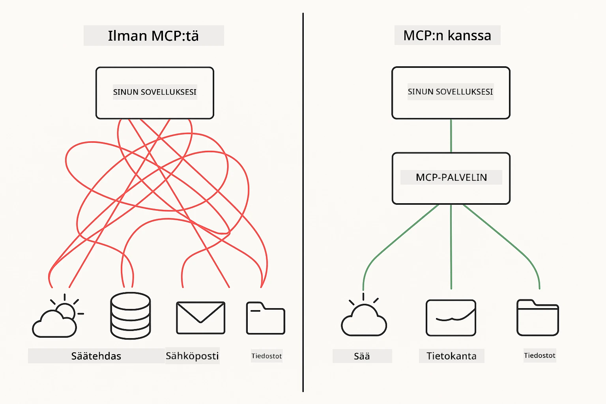
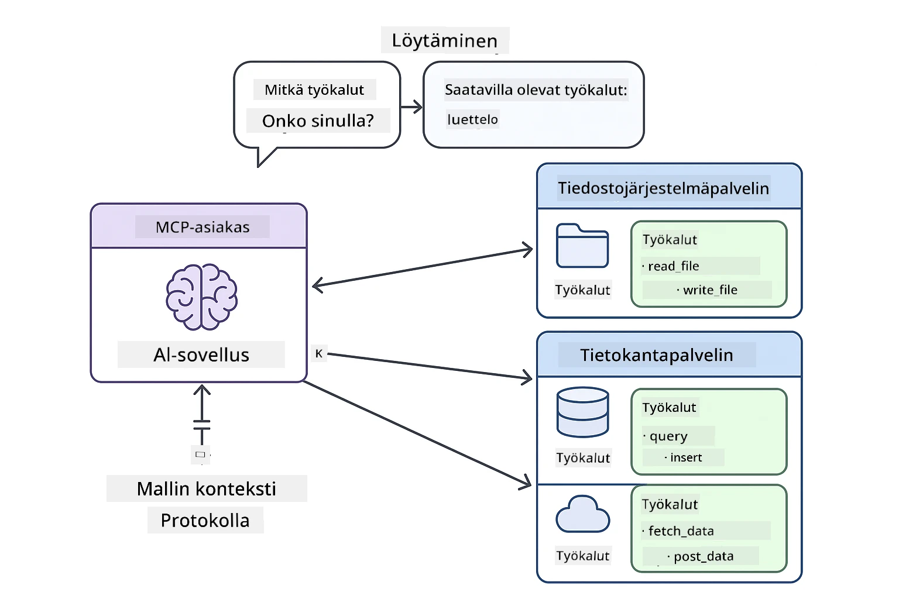
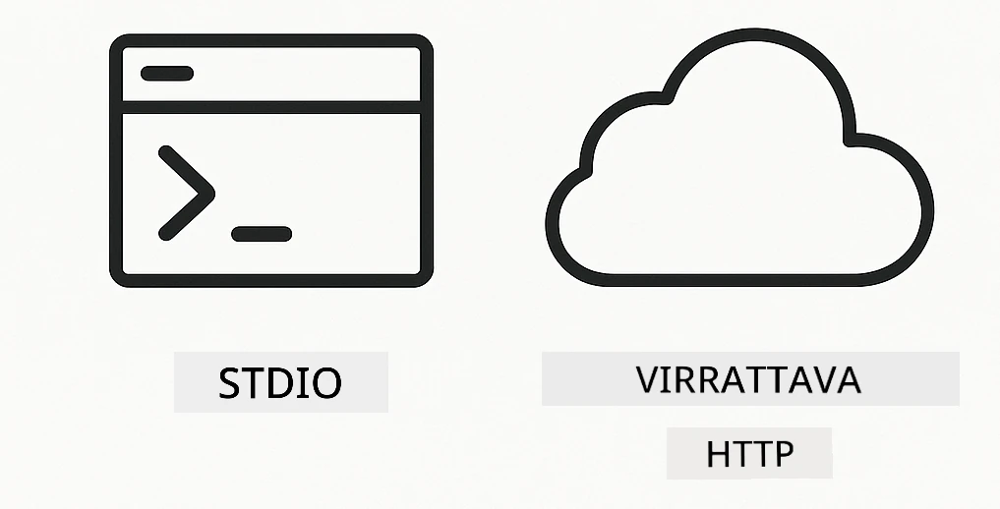
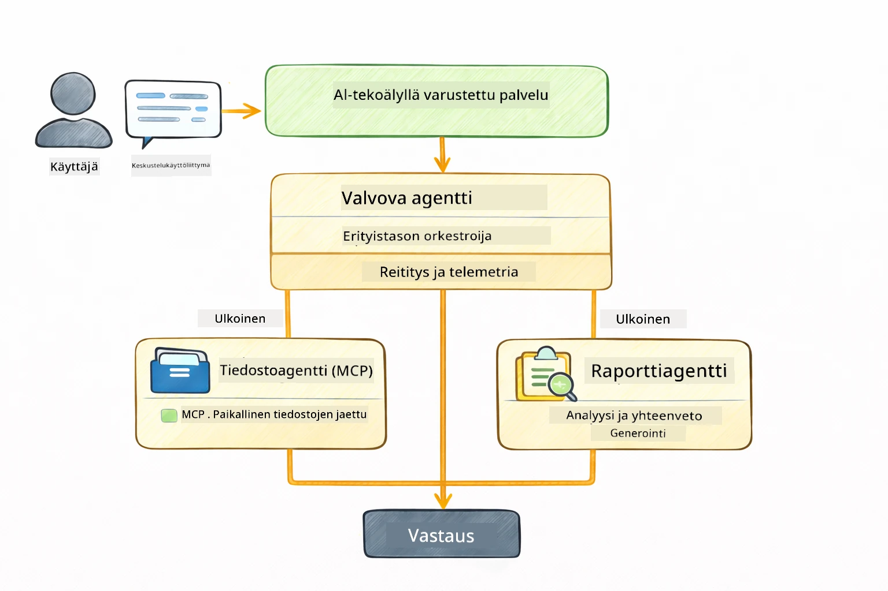

# Module 05: Mallin kontekstiprotokolla (MCP)

## Sisällysluettelo

- [Mitä opit](../../../05-mcp)
- [Mikä on MCP?](../../../05-mcp)
- [Miten MCP toimii](../../../05-mcp)
- [Agenttimoduuli](../../../05-mcp)
- [Esimerkkien suorittaminen](../../../05-mcp)
  - [Esivaatimukset](../../../05-mcp)
- [Nopea aloitus](../../../05-mcp)
  - [Tiedostotoiminnot (Stdio)](../../../05-mcp)
  - [Valvoja-agentti](../../../05-mcp)
    - [Tulosten ymmärtäminen](../../../05-mcp)
    - [Vastausstrategiat](../../../05-mcp)
    - [Agenttimoduulin ominaisuuksien selitys](../../../05-mcp)
- [Keskeiset käsitteet](../../../05-mcp)
- [Onnittelut!](../../../05-mcp)
  - [Mitä seuraavaksi?](../../../05-mcp)

## Mitä opit

Olet rakentanut keskustelevaa tekoälyä, hallinnut kehotteita, perustanut vastaukset dokumentteihin ja luonut agentteja työkaluilla. Mutta kaikki nämä työkalut olivat räätälöityjä juuri sinun sovellukseesi. Entä jos voisit antaa tekoälyllesi pääsyn standardoituihin työkaluekosysteemeihin, joita kuka tahansa voi luoda ja jakaa? Tässä moduulissa opit tekemään juuri niin Mallin kontekstiprotokollan (MCP) ja LangChain4j:n agenttimoduulin avulla. Esittelemme ensin yksinkertaisen MCP-tiedostonlukijan ja näytämme sitten, kuinka se helposti integroidaan kehittyneisiin agenttiprosesseihin Supervisor Agent -mallin avulla.

## Mikä on MCP?

Mallin kontekstiprotokolla (MCP) tarjoaa juuri tämän - standardoidun tavan tekoälysovelluksille löytää ja käyttää ulkoisia työkaluja. Sen sijaan, että kirjoittaisit räätälöityjä integraatioita jokaiselle tietolähteelle tai palvelulle, yhdistät MCP-palvelimiin, jotka tarjoavat kykynsä yhtenäisessä muodossa. Tekoälyagenttisi voi sitten automaattisesti löytää ja käyttää näitä työkaluja.



*Ennen MCP:tä: Monimutkaiset pisteestä pisteeseen integraatiot. MCP:n jälkeen: Yksi protokolla, loputtomat mahdollisuudet.*

MCP ratkaisee tekoälyn kehityksen perusongelman: jokainen integraatio on räätälöity. Haluatko päästä GitHubiin? Räätälöity koodi. Haluatko lukea tiedostoja? Räätälöity koodi. Haluatko kysellä tietokantaa? Räätälöity koodi. Eikä mikään näistä integroidu muihin tekoälysovelluksiin.

MCP standardisoi tämän. MCP-palvelin tarjoaa työkalut selkeillä kuvauksilla ja skeemoilla. Mikä tahansa MCP-asiakas voi muodostaa yhteyden, löytää käytettävissä olevat työkalut ja käyttää niitä. Rakenna kerran, käytä kaikkialla.



*Mallin kontekstiprotokollan arkkitehtuuri - standardoitu työkalujen löytäminen ja suoritus*

## Miten MCP toimii

**Palvelin-asiakasarkkitehtuuri**

MCP käyttää asiakas-palvelin-mallia. Palvelimet tarjoavat työkaluja – tiedostojen lukemista, tietokantakyselyjä, API-kutsuja. Asiakkaat (tekoälysovelluksesi) yhdistävät palvelimiin ja käyttävät niiden työkaluja.

Käyttääksesi MCP:tä LangChain4j:n kanssa, lisää tämä Maven-riippuvuus:

```xml
<dependency>
    <groupId>dev.langchain4j</groupId>
    <artifactId>langchain4j-mcp</artifactId>
    <version>${langchain4j.version}</version>
</dependency>
```


**Työkalujen löytäminen**

Kun asiakkaasi yhdistyy MCP-palvelimeen, se kysyy "Mitä työkaluja sinulla on?" Palvelin vastaa listalla käytettävissä olevista työkaluista, joilla on kuvaukset ja parametrien skeemat. Tekoälyagenttisi voi sitten päätellä, mitä työkaluja käyttää käyttäjän pyyntöjen perusteella.

**Siirtomekanismit**

MCP tukee erilaisia siirtomekanismeja. Tämä moduuli demonstroi paikallisten prosessien Stdio-siirtoa:



*MCP:n siirtomekanismit: HTTP etäpalvelimille, Stdio paikallisprosesseille*

**Stdio** - [StdioTransportDemo.java](../../../05-mcp/src/main/java/com/example/langchain4j/mcp/StdioTransportDemo.java)

Paikallisille prosesseille. Sovelluksesi käynnistää palvelimen aliprosessina ja viestii sen kanssa standardin sisääntulon/uloskäynnin kautta. Kätevä tiedostojärjestelmän käyttöön tai komentorivityökaluihin.

```java
McpTransport stdioTransport = new StdioMcpTransport.Builder()
    .command(List.of(
        npmCmd, "exec",
        "@modelcontextprotocol/server-filesystem@2025.12.18",
        resourcesDir
    ))
    .logEvents(false)
    .build();
```


> **🤖 Kokeile [GitHub Copilot](https://github.com/features/copilot) Chatin kanssa:** Avaa [`StdioTransportDemo.java`](../../../05-mcp/src/main/java/com/example/langchain4j/mcp/StdioTransportDemo.java) ja kysy:
> - "Miten Stdio-siirto toimii ja milloin sitä tulee käyttää verrattuna HTTP:hen?"
> - "Miten LangChain4j hallitsee MCP-palvelinprosessien elinkaaren?"
> - "Mitkä ovat turvallisuusvaikutukset, kun tekoälylle annetaan pääsy tiedostojärjestelmään?"

## Agenttimoduuli

Vaikka MCP tarjoaa standardisoidut työkalut, LangChain4j:n **agenttimoduuli** tarjoaa deklaratiivisen tavan rakentaa agenteja, jotka orkestroivat näitä työkaluja. `@Agent`-annotaatio ja `AgenticServices` antavat määritellä agenttien käyttäytymisen rajapintojen kautta imperatiivisen koodin sijaan.

Tässä moduulissa tutustut **Valvoja-agentti**-malliin — kehittyneeseen agenttipohjaiseen tekoälyyn, jossa "valvoja" agentti päättää dynaamisesti, mitä ali-agentteja kutsutaan käyttäjän pyyntöjen perusteella. Yhdistämme molemmat käsitteet antamalla yhdelle ali-agentistamme MCP:n avulla toimivan tiedostojen käyttömahdollisuuden.

Käyttääksesi agenttimoduulia, lisää tämä Maven-riippuvuus:

```xml
<dependency>
    <groupId>dev.langchain4j</groupId>
    <artifactId>langchain4j-agentic</artifactId>
    <version>${langchain4j.mcp.version}</version>
</dependency>
```


> **⚠️ Kokeellinen:** `langchain4j-agentic`-moduuli on **kokeellinen** ja saattaa muuttua. Vakaa tapa rakentaa tekoälyavustajia on edelleen `langchain4j-core` räätälöidyillä työkaluilla (Module 04).

## Esimerkkien suorittaminen

### Esivaatimukset

- Java 21+, Maven 3.9+
- Node.js 16+ ja npm (MCP-palvelimille)
- Ympäristömuuttujat määritelty `.env`-tiedostossa (juurihakemistosta):
  - `AZURE_OPENAI_ENDPOINT`, `AZURE_OPENAI_API_KEY`, `AZURE_OPENAI_DEPLOYMENT` (kuten Moduleissa 01-04)

> **Huom:** Jos et ole vielä asettanut ympäristömuuttujia, katso [Module 00 - Quick Start](../00-quick-start/README.md) ohjeet, tai kopioi `.env.example` tiedostoksi `.env` juurihakemistossa ja täytä arvot.

## Nopea aloitus

**VS Code -käyttäjille:** Oikeaklikkaa mitä tahansa demotiedostoa Resurssienhallinnassa ja valitse **"Run Java"**, tai käytä Käynnistys- ja debuggauspaneelin käynnistysasetuksia (muista ensin lisätä tokenisi `.env` tiedostoon).

**Mavenilla käytettäessä:** Voit myös suorittaa komentoriviltä alla olevilla esimerkeillä.

### Tiedostotoiminnot (Stdio)

Tämä demonstroi paikallisiin aliprosesseihin perustuvia työkaluja.

**✅ Ei esivaatimuksia** - MCP-palvelin käynnistyy automaattisesti.

**Käyttämällä käynnistyskriptit (suositeltu):**

Käynnistyskriptit lataavat automaattisesti ympäristömuuttujat juurihakemiston `.env`-tiedostosta:

**Bash:**
```bash
cd 05-mcp
chmod +x start-stdio.sh
./start-stdio.sh
```


**PowerShell:**
```powershell
cd 05-mcp
.\start-stdio.ps1
```


**VS Code käyttäen:** Oikeaklikkaa `StdioTransportDemo.java` ja valitse **"Run Java"** (Varmista, että `.env` tiedostosi on määritelty).

Sovellus käynnistää tiedostojärjestelmän MCP-palvelimen automaattisesti ja lukee paikallisen tiedoston. Huomaa, miten aliprosessin hallinta hoituu puolestasi.

**Odotettu tulos:**
```
Assistant response: The file provides an overview of LangChain4j, an open-source Java library
for integrating Large Language Models (LLMs) into Java applications...
```


### Valvoja-agentti

**Valvoja-agentti -malli** on **joustava** agenttipohjaisen tekoälyn muoto. Valvoja käyttää LLM:ää päättämään itsenäisesti, mitä agentteja kutsutaan käyttäjän pyynnön perusteella. Seuraavassa esimerkissä yhdistämme MCP:n mahdollistaman tiedoston käytön LLM-agenttiin, luoden valvotun tiedoston lukemisen → raportin laatimisen työnkulun.

Demossa `FileAgent` lukee tiedoston MCP:n tiedostojärjestelmätyökaluilla ja `ReportAgent` tuottaa jäsennellyn raportin, jonka osina ovat tiivistelmä (1 lause), 3 keskeistä kohtaa ja suositukset. Valvoja orkestroi tämän työnkulun automaattisesti:



```
┌─────────────┐      ┌──────────────┐
│  FileAgent  │ ───▶ │ ReportAgent  │
│ (MCP tools) │      │  (pure LLM)  │
└─────────────┘      └──────────────┘
   outputKey:           outputKey:
  'fileContent'         'report'
```


Jokainen agentti tallentaa tuloksensa **Agentic Scopeen** (jaettuun muistiin), mikä mahdollistaa seuraavien agenttien pääsyn aiempiin tuloksiin. Tämä osoittaa, miten MCP-työkalut integroituvat saumattomasti agenttiprosesseihin — Valvojan ei tarvitse tietää *miten* tiedostot luetaan, vaan pelkästään että `FileAgent` pystyy siihen.

#### Demon suorittaminen

Käynnistyskriptit lataavat automaattisesti ympäristömuuttujat juurihakemiston `.env`-tiedostosta:

**Bash:**
```bash
cd 05-mcp
chmod +x start-supervisor.sh
./start-supervisor.sh
```


**PowerShell:**
```powershell
cd 05-mcp
.\start-supervisor.ps1
```


**VS Code käyttäen:** Oikeaklikkaa `SupervisorAgentDemo.java` ja valitse **"Run Java"** (varmista, että `.env` on kunnossa).

#### Miten Valvoja toimii

```java
// Vaihe 1: FileAgent lukee tiedostoja käyttäen MCP-työkaluja
FileAgent fileAgent = AgenticServices.agentBuilder(FileAgent.class)
        .chatModel(model)
        .toolProvider(mcpToolProvider)  // Sisältää MCP-työkaluja tiedosto-operaatioihin
        .build();

// Vaihe 2: ReportAgent luo rakenteellisia raportteja
ReportAgent reportAgent = AgenticServices.agentBuilder(ReportAgent.class)
        .chatModel(model)
        .build();

// Supervisor ohjaa tiedosto → raportti työnkulkua
SupervisorAgent supervisor = AgenticServices.supervisorBuilder()
        .chatModel(model)
        .subAgents(fileAgent, reportAgent)
        .responseStrategy(SupervisorResponseStrategy.LAST)  // Palauta lopullinen raportti
        .build();

// Supervisor päättää, mitä agentteja kutsutaan pyynnön perusteella
String response = supervisor.invoke("Read the file at /path/file.txt and generate a report");
```


#### Vastausstrategiat

Kun määrität `SupervisorAgent`-instanssin, määrittelet miten sen tulee muodostaa lopullinen vastaus käyttäjälle, kun ali-agentit ovat suorittaneet tehtävänsä. Saatavilla olevat strategiat ovat:

| Strategia | Kuvaus |
|----------|-------------|
| **LAST** | Valvoja palauttaa viimeksi kutsutun ali-agentin tai työkalun tuloksen. Tämä on hyödyllistä, kun työnkulun viimeinen agentti on erityisesti suunniteltu tuottamaan täydellinen lopullinen vastaus (esim. "Tiivistelmä-agentti" tutkimusputkessa). |
| **SUMMARY** | Valvoja käyttää omaa sisäistä kieltämalliaan (LLM) synteettisen tiivistelmän koko vuorovaikutuksesta ja kaikista ali-agenttien tuloksista, ja palauttaa tämän tiivistelmän lopullisena vastauksena. Tämä tarjoaa käyttäjälle selkeän, koontivastauksen. |
| **SCORED** | Järjestelmä käyttää sisäistä LLM:ää pisteyttämään sekä VIIMEISEN vastauksen että TIIVISTELMÄN alkuperäisen käyttäjäpyynnön perusteella ja palauttaa korkeamman pistemäärän saanut vastauksen. |

Katso toteutus [SupervisorAgentDemo.java](../../../05-mcp/src/main/java/com/example/langchain4j/mcp/SupervisorAgentDemo.java).

> **🤖 Kokeile [GitHub Copilot](https://github.com/features/copilot) Chatin kanssa:** Avaa [`SupervisorAgentDemo.java`](../../../05-mcp/src/main/java/com/example/langchain4j/mcp/SupervisorAgentDemo.java) ja kysy:
> - "Miten Valvoja päättää, mitä agenteja kutsutaan?"
> - "Mikä on ero Valvoja- ja Sequential-työnkulkujen välillä?"
> - "Miten voin mukauttaa Valvojan suunnittelukäyttäytymistä?"

#### Tulosten ymmärtäminen

Kun ajat demon, näet jäsennellyn läpikäynnin siitä, miten Valvoja orkestroi useita agenteja. Tässä mitä kukin osio tarkoittaa:

```
======================================================================
  FILE → REPORT WORKFLOW DEMO
======================================================================

This demo shows a clear 2-step workflow: read a file, then generate a report.
The Supervisor orchestrates the agents automatically based on the request.
```


**Otsikko** esittelee työnkulun konseptin: kohdennettu putki tiedoston lukemisesta raportin tuottamiseen.

```
--- WORKFLOW ---------------------------------------------------------
  ┌─────────────┐      ┌──────────────┐
  │  FileAgent  │ ───▶ │ ReportAgent  │
  │ (MCP tools) │      │  (pure LLM)  │
  └─────────────┘      └──────────────┘
   outputKey:           outputKey:
   'fileContent'        'report'

--- AVAILABLE AGENTS -------------------------------------------------
  [FILE]   FileAgent   - Reads files via MCP → stores in 'fileContent'
  [REPORT] ReportAgent - Generates structured report → stores in 'report'
```


**Työnkulun kaavio** näyttää datan virtauksen agenttien välillä. Jokaisella agentilla on oma roolinsa:
- **FileAgent** lukee tiedostoja MCP-työkaluilla ja tallentaa raakasisällön `fileContent`-avainsanaan
- **ReportAgent** käyttää tätä sisältöä ja tuottaa rakenteellisen raportin `report`-avainsanaan

```
--- USER REQUEST -----------------------------------------------------
  "Read the file at .../file.txt and generate a report on its contents"
```


**Käyttäjän pyyntö** näyttää tehtävän. Valvoja jäsentää pyynnön ja päättää kutsua FileAgentin → ReportAgentin.

```
--- SUPERVISOR ORCHESTRATION -----------------------------------------
  The Supervisor decides which agents to invoke and passes data between them...

  +-- STEP 1: Supervisor chose -> FileAgent (reading file via MCP)
  |
  |   Input: .../file.txt
  |
  |   Result: LangChain4j is an open-source, provider-agnostic Java framework for building LLM...
  +-- [OK] FileAgent (reading file via MCP) completed

  +-- STEP 2: Supervisor chose -> ReportAgent (generating structured report)
  |
  |   Input: LangChain4j is an open-source, provider-agnostic Java framew...
  |
  |   Result: Executive Summary...
  +-- [OK] ReportAgent (generating structured report) completed
```


**Valvojan orkestrointi** näyttää kahden vaiheen työnkulun toiminnassa:
1. **FileAgent** lukee tiedoston MCP:n kautta ja tallentaa sisällön
2. **ReportAgent** vastaanottaa sisällön ja tuottaa jäsennellyn raportin

Valvoja teki nämä päätökset **itsenäisesti** käyttäjän pyynnön perusteella.

```
--- FINAL RESPONSE ---------------------------------------------------
Executive Summary
...

Key Points
...

Recommendations
...

--- AGENTIC SCOPE (Data Flow) ----------------------------------------
  Each agent stores its output for downstream agents to consume:
  * fileContent: LangChain4j is an open-source, provider-agnostic Java framework...
  * report: Executive Summary...
```


#### Agenttimoduulin ominaisuuksien selitys

Esimerkki demonstroi useita agenttimoduulin kehittyneitä ominaisuuksia. Tutkitaan tarkemmin Agentic Scopea ja Agent Kuuntelijoita.

**Agentic Scope** näyttää jaetun muistin, johon agentit tallensivat tuloksensa `@Agent(outputKey="...")` avulla. Tämä mahdollistaa:
- Myöhemmät agentit pääsevät aiempien agenttien tuloksiin
- Valvojan voi koostaa lopullisen vastauksen
- Sinä voit tarkastella, mitä kukin agentti tuotti

```java
ResultWithAgenticScope<String> result = supervisor.invokeWithAgenticScope(request);
AgenticScope scope = result.agenticScope();
String fileContent = scope.readState("fileContent");  // Raakadatatiedosto FileAgentilta
String report = scope.readState("report");            // Jäsennelty raportti ReportAgentilta
```


**Agent Kuuntelijat** mahdollistavat agenttien suorituksen seurannan ja virheiden etsinnän. Demossa näkyvä vaiheittainen tuloste syntyy AgentListenerista, joka kytkeytyy jokaiseen agenttikutsuun:
- **beforeAgentInvocation** - Kutsutaan, kun Valvoja valitsee agentin, jolloin näet, mikä agentti valittiin ja miksi
- **afterAgentInvocation** - Kutsutaan, kun agentti on suorittanut, näyttää tuloksen
- **inheritedBySubagents** - Kun true, kuuntelija seuraa kaikkia aliorganisaation agenteja

```java
AgentListener monitor = new AgentListener() {
    private int step = 0;
    
    @Override
    public void beforeAgentInvocation(AgentRequest request) {
        step++;
        System.out.println("  +-- STEP " + step + ": " + request.agentName());
    }
    
    @Override
    public void afterAgentInvocation(AgentResponse response) {
        System.out.println("  +-- [OK] " + response.agentName() + " completed");
    }
    
    @Override
    public boolean inheritedBySubagents() {
        return true; // Levitä kaikille aliagenteille
    }
};
```


Valvoja-mallin lisäksi `langchain4j-agentic`-moduuli tarjoaa useita tehokkaita työnkulku- ja ominaisuusmalleja:

| Malli | Kuvaus | Käyttötapaus |
|---------|-------------|----------|
| **Sequential** | Suorita agentit järjestyksessä, tuloste siirtyy seuraavalle | Putket: tutkimus → analyysi → raportti |
| **Parallel** | Suorita agentit samanaikaisesti | Riippumattomat tehtävät: sää + uutiset + osakkeet |
| **Loop** | Toista, kunnes ehto täyttyy | Laadunarviointi: hienosäädä kunnes pistemäärä ≥ 0.8 |
| **Conditional** | Reititä ehtojen perusteella | Luokitus → reititys erikoisagentille |
| **Human-in-the-Loop** | Lisää ihmistarkistuspisteitä | Hyväksyntäprosessit, sisällön tarkastus |

## Keskeiset käsitteet

Nyt kun olet tutustunut MCP:hen ja agenttimoduuliin käytännössä, tiivistetään milloin kannattaa käyttää kumpaakin lähestymistapaa.

**MCP** sopii parhaiten, kun haluat hyödyntää olemassa olevia työkaluekosysteemejä, rakentaa työkaluja joita useat sovellukset voivat käyttää, integroida kolmannen osapuolen palveluita standardiprotokollilla tai vaihtaa työkalujen toteutuksia ilman koodimuutoksia.

**Agenttimoduuli** toimii parhaiten, kun haluat deklaratiiviset agenttimäärittelyt `@Agent`-annotaatioilla, tarvitset työnkulkujen orkestrointia (peräkkäinen, silmukka, rinnakkainen), suositte rajapintapohjaista agenttisuunnittelua imperatiivisen koodin sijaan, tai yhdistät useita agenteja, jotka jakavat tuloksia `outputKey` avulla.

**Valvoja-agentti-malli** loistaa, kun työnkulku ei ole ennustettavissa etukäteen ja haluat LLM:n päättävän, kun sinulla on useita erikoistuneita agenteja, jotka tarvitsevat dynaamista orkestrointia, kun rakennat keskustelujärjestelmiä, jotka reitittävät eri kyvykkyyksille, tai kun haluat joustavan, sopeutuvan agenttikäyttäytymisen.
## Onnittelut!

Olet suorittanut LangChain4j for Beginners -kurssin. Olet oppinut:

- Kuinka rakentaa keskustelevaa tekoälyä muistilla (Moduuli 01)
- Prompt-suunnittelumalleja eri tehtäviin (Moduuli 02)
- Vastausten perustamisen dokumentteihisi RAG:llä (Moduuli 03)
- Perustason tekoälyagenttien (avustajien) luomisen räätälöidyillä työkaluilla (Moduuli 04)
- Standardoitujen työkalujen integroinnin LangChain4j MCP:n ja Agentic-moduulien kanssa (Moduuli 05)

### Mitä seuraavaksi?

Moduulien suorittamisen jälkeen tutustu [Testing Guide](../docs/TESTING.md) -oppaaseen nähdäksesi LangChain4j:n testauskonsepteja toiminnassa.

**Viralliset resurssit:**
- [LangChain4j Documentation](https://docs.langchain4j.dev/) - Kattavat oppaat ja API-viitteet
- [LangChain4j GitHub](https://github.com/langchain4j/langchain4j) - Lähdekoodi ja esimerkit
- [LangChain4j Tutorials](https://docs.langchain4j.dev/tutorials/) - Askeltavat opetusohjelmat erilaisiin käyttötapauksiin

Kiitos, että suoristit tämän kurssin!

---

**Navigointi:** [← Edellinen: Moduuli 04 - Työkalut](../04-tools/README.md) | [Takaisin alkuun](../README.md)

---

<!-- CO-OP TRANSLATOR DISCLAIMER START -->
**Vastuuvapauslauseke**:
Tämä asiakirja on käännetty käyttämällä tekoälypohjaista käännöspalvelua [Co-op Translator](https://github.com/Azure/co-op-translator). Pyrimme tarkkuuteen, mutta huomioithan, että automaattikäännöksissä saattaa esiintyä virheitä tai epätarkkuuksia. Alkuperäinen asiakirja omalla kielellään on virallinen lähde. Tärkeissä asioissa suositellaan ammattimaista ihmiskäännöstä. Emme ota vastuuta tämän käännöksen käytöstä aiheutuvista väärinkäsityksistä tai virhetulkinoista.
<!-- CO-OP TRANSLATOR DISCLAIMER END -->